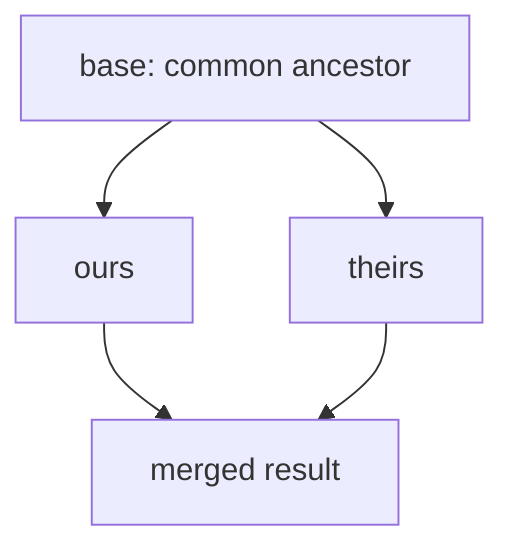
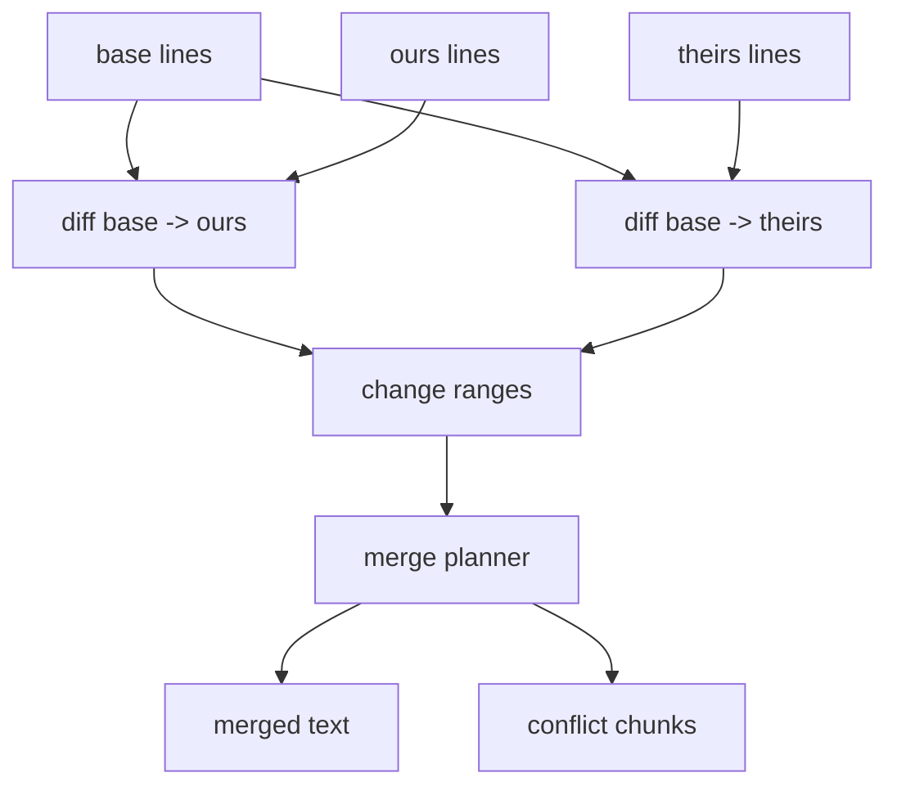
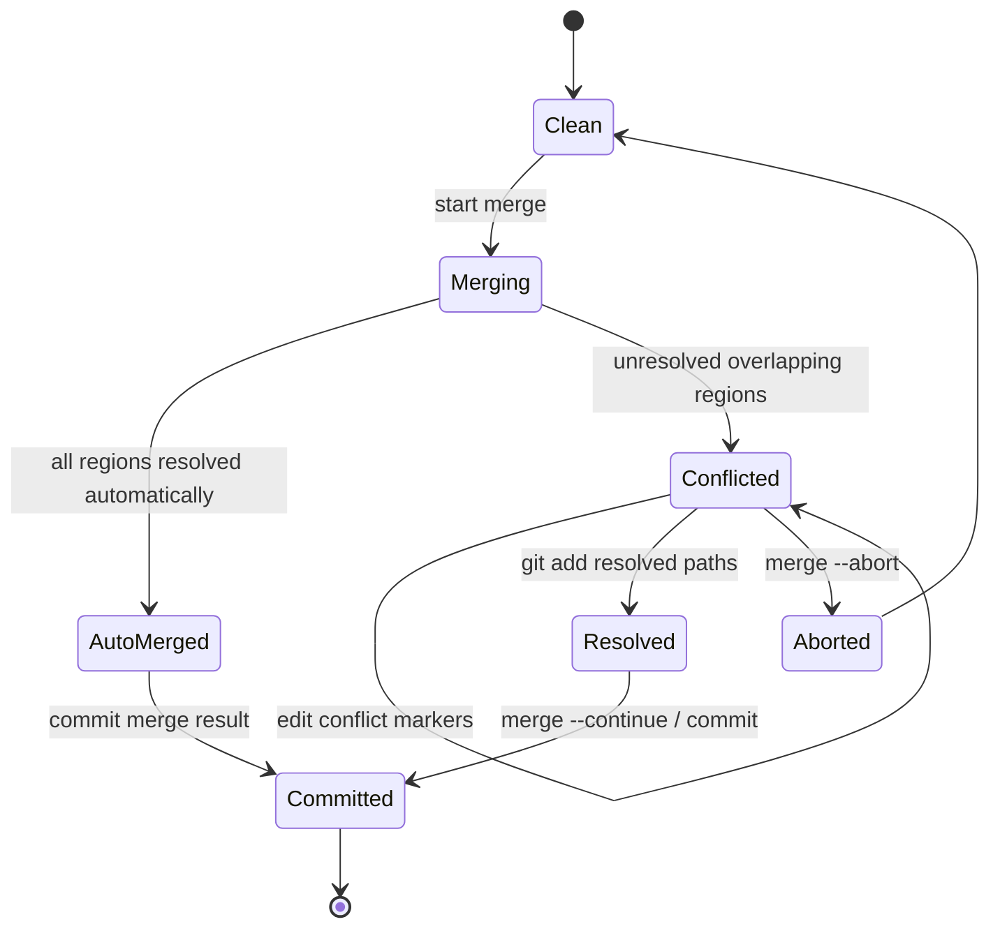

# Part 114 — Build a Mini Merge Engine

In the previous lab, we built a mini diff engine.

Now we use diff as a building block for merge.

A merge engine takes three snapshots:

```text
base   = common ancestor
ours   = current side
theirs = other side
```

It tries to produce one merged result.

If it cannot prove a safe textual combination, it emits a conflict.

This lab builds a simplified three-way merge engine in Java.

The goal is not to match Git's `ort` strategy. Git's production merge machinery handles rename detection, directory rename detection, criss-cross histories, recursive merge-base handling, submodules, file modes, symlinks, attributes, custom merge drivers, binary files, and many edge cases.

Our goal is smaller and deeper:

- understand why three-way merge needs a base
- classify one-sided vs two-sided changes
- detect overlapping textual edits
- emit conflict markers
- support merge and diff3 conflict styles
- separate textual merge success from semantic correctness

---

## 1. Why Three-Way Merge Exists

A two-way merge sees only:

```text
ours
 theirs
```

It cannot distinguish:

```text
line changed by ours
line changed by theirs
line unchanged by one side
same change made independently
```

A three-way merge uses the base to answer:

```text
What did each side change relative to the common ancestor?
```



The base is the reference point. Without it, the engine cannot know which side changed what.

---

## 2. Core Cases

For each region of text, compare base, ours, and theirs.

| Base vs Ours | Base vs Theirs | Result |
|---|---|---|
| unchanged | unchanged | keep base |
| changed | unchanged | take ours |
| unchanged | changed | take theirs |
| same change | same change | take changed version once |
| different non-overlapping changes | combine |
| different overlapping changes | conflict |

The hard part is deciding whether changes overlap.

---

## 3. Textual Conflict Is Not Semantic Conflict

A three-way textual merge can succeed while behavior is broken.

Example:

```text
ours:   add permission check
theirs: change state transition order
```

No line conflict may appear. But together, the result may allow an invalid enforcement transition or skip an audit event.

That gives us a second invariant:

> Merge success means Git found a textual result. It does not mean the domain model is safe.

This lab builds a textual merge engine. Domain validation remains your responsibility.

---

## 4. Simplified Merge Architecture

We will implement:

```text
base + ours   -> changes from base to ours
base + theirs -> changes from base to theirs
changes       -> merged lines or conflict chunks
```



We reuse the mental model from Part 113 but implement a simpler change-range extraction.

---

## 5. Project Layout

```text
mini-merge/
  src/main/java/minimerge/
    Change.java
    MergeChunk.java
    MergeResult.java
    MiniMergeEngine.java
    ConflictStyle.java
    MiniMergeCli.java
```

No external dependency is required.

---

## 6. Data Model

A change range represents a replacement of a region in base with a region from one side.

```java
package minimerge;

import java.util.List;

public record Change(
        int baseStart,
        int baseEndExclusive,
        List<String> replacement
) {
    public boolean isInsertion() {
        return baseStart == baseEndExclusive;
    }

    public boolean overlaps(Change other) {
        return this.baseStart < other.baseEndExclusive
                && other.baseStart < this.baseEndExclusive;
    }

    public boolean touches(Change other) {
        return this.baseEndExclusive == other.baseStart
                || other.baseEndExclusive == this.baseStart;
    }
}
```

Use zero-based half-open ranges:

```text
[baseStart, baseEndExclusive)
```

Examples:

```text
replace base line 3:
  [3, 4)

insert before base line 3:
  [3, 3)

delete base lines 5..7:
  [5, 8) with empty replacement
```

Conflict style:

```java
package minimerge;

public enum ConflictStyle {
    MERGE,
    DIFF3
}
```

Result:

```java
package minimerge;

import java.util.List;

public record MergeResult(List<String> lines, boolean conflicted) {}
```

---

## 7. Extract Changes with a Simple Diff

To keep this lab focused, we implement change extraction with an LCS edit script similar to Part 113.

The change extractor groups consecutive insert/delete edits into replacement ranges against the base.

```java
package minimerge;

import java.util.ArrayList;
import java.util.List;

public final class ChangeExtractor {

    public List<Change> changesFromBase(List<String> base, List<String> side) {
        List<MiniEdit> edits = diff(base, side);
        List<Change> changes = new ArrayList<>();

        int i = 0;
        while (i < edits.size()) {
            MiniEdit e = edits.get(i);
            if (e.type == MiniEditType.EQUAL) {
                i++;
                continue;
            }

            int baseStart = e.baseIndex;
            int baseEnd = e.baseIndex;
            List<String> replacement = new ArrayList<>();

            while (i < edits.size() && edits.get(i).type != MiniEditType.EQUAL) {
                MiniEdit current = edits.get(i);
                if (current.type == MiniEditType.DELETE) {
                    baseEnd = Math.max(baseEnd, current.baseIndex + 1);
                } else if (current.type == MiniEditType.INSERT) {
                    replacement.add(current.line);
                }
                i++;
            }

            changes.add(new Change(baseStart, baseEnd, List.copyOf(replacement)));
        }

        return changes;
    }

    private List<MiniEdit> diff(List<String> base, List<String> side) {
        int[][] lcs = lcs(base, side);
        List<MiniEdit> edits = new ArrayList<>();
        int i = 0;
        int j = 0;

        while (i < base.size() && j < side.size()) {
            if (base.get(i).equals(side.get(j))) {
                edits.add(new MiniEdit(MiniEditType.EQUAL, base.get(i), i, j));
                i++;
                j++;
            } else if (lcs[i + 1][j] >= lcs[i][j + 1]) {
                edits.add(new MiniEdit(MiniEditType.DELETE, base.get(i), i, -1));
                i++;
            } else {
                edits.add(new MiniEdit(MiniEditType.INSERT, side.get(j), i, j));
                j++;
            }
        }

        while (i < base.size()) {
            edits.add(new MiniEdit(MiniEditType.DELETE, base.get(i), i, -1));
            i++;
        }

        while (j < side.size()) {
            edits.add(new MiniEdit(MiniEditType.INSERT, side.get(j), i, j));
            j++;
        }

        return edits;
    }

    private int[][] lcs(List<String> a, List<String> b) {
        int[][] dp = new int[a.size() + 1][b.size() + 1];
        for (int i = a.size() - 1; i >= 0; i--) {
            for (int j = b.size() - 1; j >= 0; j--) {
                if (a.get(i).equals(b.get(j))) {
                    dp[i][j] = 1 + dp[i + 1][j + 1];
                } else {
                    dp[i][j] = Math.max(dp[i + 1][j], dp[i][j + 1]);
                }
            }
        }
        return dp;
    }

    private enum MiniEditType {
        EQUAL, DELETE, INSERT
    }

    private record MiniEdit(MiniEditType type, String line, int baseIndex, int sideIndex) {}
}
```

This extractor is intentionally imperfect around adjacent insertions and repeated lines.

That imperfection is educational. It shows why production merge algorithms are hard.

---

## 8. Merge Planner

The merge planner walks through base lines and the two change lists.

At a high level:

```text
cursor = 0
while there are changes:
  copy unchanged base before next change
  if only ours changes next region: take ours
  if only theirs changes next region: take theirs
  if both change overlapping region:
     if replacements equal: take once
     else conflict
copy remaining base
```

Implementation:

```java
package minimerge;

import java.util.ArrayList;
import java.util.Comparator;
import java.util.List;

public final class MiniMergeEngine {
    private final ChangeExtractor extractor = new ChangeExtractor();

    public MergeResult merge(
            List<String> base,
            List<String> ours,
            List<String> theirs,
            ConflictStyle style
    ) {
        List<Change> oursChanges = sorted(extractor.changesFromBase(base, ours));
        List<Change> theirsChanges = sorted(extractor.changesFromBase(base, theirs));

        List<String> out = new ArrayList<>();
        boolean conflicted = false;

        int cursor = 0;
        int i = 0;
        int j = 0;

        while (i < oursChanges.size() || j < theirsChanges.size()) {
            Change oc = i < oursChanges.size() ? oursChanges.get(i) : null;
            Change tc = j < theirsChanges.size() ? theirsChanges.get(j) : null;

            Change next = firstChange(oc, tc);

            copyBase(base, cursor, next.baseStart(), out);
            cursor = next.baseStart();

            if (oc != null && oc == next && (tc == null || oc.baseEndExclusive() <= tc.baseStart())) {
                out.addAll(oc.replacement());
                cursor = oc.baseEndExclusive();
                i++;
                continue;
            }

            if (tc != null && tc == next && (oc == null || tc.baseEndExclusive() <= oc.baseStart())) {
                out.addAll(tc.replacement());
                cursor = tc.baseEndExclusive();
                j++;
                continue;
            }

            // Overlapping or same-position changes.
            Change oursGroup = oc;
            Change theirsGroup = tc;
            int conflictStart = Math.min(oursGroup.baseStart(), theirsGroup.baseStart());
            int conflictEnd = Math.max(oursGroup.baseEndExclusive(), theirsGroup.baseEndExclusive());

            // For this mini engine, consume one change from each side.
            i++;
            j++;

            if (oursGroup.replacement().equals(theirsGroup.replacement())) {
                out.addAll(oursGroup.replacement());
            } else {
                conflicted = true;
                out.addAll(conflictLines(
                        base.subList(conflictStart, conflictEnd),
                        oursGroup.replacement(),
                        theirsGroup.replacement(),
                        style
                ));
            }

            cursor = conflictEnd;
        }

        copyBase(base, cursor, base.size(), out);
        return new MergeResult(List.copyOf(out), conflicted);
    }

    private List<Change> sorted(List<Change> changes) {
        return changes.stream()
                .sorted(Comparator.comparingInt(Change::baseStart))
                .toList();
    }

    private Change firstChange(Change a, Change b) {
        if (a == null) return b;
        if (b == null) return a;
        return a.baseStart() <= b.baseStart() ? a : b;
    }

    private void copyBase(List<String> base, int from, int to, List<String> out) {
        for (int k = from; k < to; k++) {
            out.add(base.get(k));
        }
    }

    private List<String> conflictLines(
            List<String> baseLines,
            List<String> oursLines,
            List<String> theirsLines,
            ConflictStyle style
    ) {
        List<String> lines = new ArrayList<>();
        lines.add("<<<<<<< ours");
        lines.addAll(oursLines);

        if (style == ConflictStyle.DIFF3) {
            lines.add("||||||| base");
            lines.addAll(baseLines);
        }

        lines.add("=======");
        lines.addAll(theirsLines);
        lines.add(">>>>>>> theirs");
        return lines;
    }
}
```

This implementation is deliberately conservative. If both sides touch the same base region differently, it conflicts.

Real Git can sometimes merge more cases automatically.

But conservative conflict is often safer than silent semantic corruption.

---

## 9. CLI

```java
package minimerge;

import java.nio.file.Files;
import java.nio.file.Path;
import java.util.List;

public final class MiniMergeCli {
    public static void main(String[] args) throws Exception {
        if (args.length < 3 || args.length > 4) {
            System.err.println("usage: mini-merge <base> <ours> <theirs> [--diff3]");
            System.exit(2);
        }

        ConflictStyle style = args.length == 4 && args[3].equals("--diff3")
                ? ConflictStyle.DIFF3
                : ConflictStyle.MERGE;

        List<String> base = Files.readAllLines(Path.of(args[0]));
        List<String> ours = Files.readAllLines(Path.of(args[1]));
        List<String> theirs = Files.readAllLines(Path.of(args[2]));

        MiniMergeEngine engine = new MiniMergeEngine();
        MergeResult result = engine.merge(base, ours, theirs, style);

        for (String line : result.lines()) {
            System.out.println(line);
        }

        if (result.conflicted()) {
            System.exit(1);
        }
    }
}
```

Exit code design:

```text
0 = clean merge
1 = conflict
2 = usage/input error
```

That mirrors the idea that conflict is not a crash. It is an unresolved integration state.

---

## 10. Test Case: One-Sided Change

Base:

```text
A
B
C
```

Ours:

```text
A
B changed
C
```

Theirs:

```text
A
B
C
```

Expected:

```text
A
B changed
C
```

Why?

Only ours changed relative to base.

---

## 11. Test Case: Same Change on Both Sides

Base:

```text
A
B
C
```

Ours:

```text
A
B changed
C
```

Theirs:

```text
A
B changed
C
```

Expected:

```text
A
B changed
C
```

Why?

Both sides made the same replacement. Do not duplicate it.

---

## 12. Test Case: Non-Overlapping Changes

Base:

```text
A
B
C
D
```

Ours:

```text
A
B ours
C
D
```

Theirs:

```text
A
B
C theirs
D
```

Expected:

```text
A
B ours
C theirs
D
```

Why?

The changes affect different base regions.

---

## 13. Test Case: Overlapping Conflict

Base:

```text
A
B
C
```

Ours:

```text
A
B ours
C
```

Theirs:

```text
A
B theirs
C
```

Expected merge-style conflict:

```text
A
<<<<<<< ours
B ours
=======
B theirs
>>>>>>> theirs
C
```

Expected diff3-style conflict:

```text
A
<<<<<<< ours
B ours
||||||| base
B
=======
B theirs
>>>>>>> theirs
C
```

Diff3 style is often superior during manual resolution because it shows the common ancestor.

---

## 14. Testing with JUnit

```java
package minimerge;

import org.junit.jupiter.api.Test;

import java.util.List;

import static org.junit.jupiter.api.Assertions.*;

class MiniMergeEngineTest {

    private final MiniMergeEngine engine = new MiniMergeEngine();

    @Test
    void takesOursWhenOnlyOursChanged() {
        MergeResult result = engine.merge(
                List.of("A", "B", "C"),
                List.of("A", "B ours", "C"),
                List.of("A", "B", "C"),
                ConflictStyle.MERGE
        );

        assertFalse(result.conflicted());
        assertEquals(List.of("A", "B ours", "C"), result.lines());
    }

    @Test
    void sameChangeIsAcceptedOnce() {
        MergeResult result = engine.merge(
                List.of("A", "B", "C"),
                List.of("A", "B changed", "C"),
                List.of("A", "B changed", "C"),
                ConflictStyle.MERGE
        );

        assertFalse(result.conflicted());
        assertEquals(List.of("A", "B changed", "C"), result.lines());
    }

    @Test
    void differentOverlappingChangeConflicts() {
        MergeResult result = engine.merge(
                List.of("A", "B", "C"),
                List.of("A", "B ours", "C"),
                List.of("A", "B theirs", "C"),
                ConflictStyle.DIFF3
        );

        assertTrue(result.conflicted());
        assertTrue(result.lines().contains("<<<<<<< ours"));
        assertTrue(result.lines().contains("||||||| base"));
        assertTrue(result.lines().contains("======="));
        assertTrue(result.lines().contains(">>>>>>> theirs"));
    }
}
```

---

## 15. Compare with Git's `merge-file`

Git has a low-level command that can perform a file-level three-way merge:

```bash
git merge-file ours.txt base.txt theirs.txt
```

For experimentation, use copies:

```bash
cp ours.txt ours.git-result.txt
git merge-file --diff3 ours.git-result.txt base.txt theirs.txt || true
cat ours.git-result.txt
```

Then compare with your mini engine.

Expect differences. Git's merge implementation is more sophisticated.

The purpose of comparison is to observe the cases:

- one side changed
- both sides made same change
- both sides changed different regions
- both sides changed overlapping region
- adjacent insertions
- repeated lines
- deletion vs modification

---

## 16. Mapping to Real Git Conflict State

When a real Git merge conflicts, Git stores multiple versions of the file in the index:

```text
stage 1 = base
stage 2 = ours
stage 3 = theirs
```

Commands:

```bash
git ls-files -u

git show :1:path/to/file   # base
git show :2:path/to/file   # ours
git show :3:path/to/file   # theirs
```

That maps directly to this lab's input model.

```text
base   -> stage 1
ours   -> stage 2
theirs -> stage 3
```

Conflict markers are only the working-tree representation.

The index is the structured conflict state.

---

## 17. Why `ours` and `theirs` Feel Reversed During Rebase

During a normal merge:

```text
ours   = current branch
 theirs = branch being merged
```

During rebase, Git is replaying commits onto another base. The labels can feel inverted because the operation is not "merge feature into current branch" in the same way.

Operational rule:

```text
Do not resolve by label memory.
Inspect the actual stage content.
```

Use:

```bash
git show :1:file
git show :2:file
git show :3:file
```

Then decide based on domain correctness.

---

## 18. Merge Is a State Machine



A conflict is not a failure of Git. It is Git refusing to invent intent.

---

## 19. The Dangerous Case: Clean Textual Merge, Broken Semantics

Example base:

```java
void closeCase(Case c) {
    c.transitionTo(CLOSED);
}
```

Ours:

```java
void closeCase(Case c) {
    permission.check(CLOSE_CASE);
    c.transitionTo(CLOSED);
}
```

Theirs:

```java
void closeCase(Case c) {
    c.transitionTo(CLOSED);
    audit.write(CASE_CLOSED);
}
```

Clean textual merge might produce:

```java
void closeCase(Case c) {
    permission.check(CLOSE_CASE);
    c.transitionTo(CLOSED);
    audit.write(CASE_CLOSED);
}
```

Looks good.

But maybe audit must happen before state transition because post-transition hooks read final state and lock the case. Or maybe permission check must be based on pre-transition state.

Git cannot know.

The merge engine solves syntax-level integration. Your domain tests solve behavior-level integration.

---

## 20. Production Merge Complexity We Skipped

Real Git merge must handle:

| Feature | Why it matters |
|---|---|
| multiple merge bases | criss-cross histories can have more than one base |
| rename detection | file moved on one side, edited on another |
| directory rename detection | many files move together |
| file mode changes | executable bit, symlink, submodule gitlink |
| binary files | cannot line-merge safely |
| attributes | custom merge drivers and binary/text handling |
| submodules | merging gitlink commits is not file content merge |
| sparse checkout | conflict may materialize out-of-cone paths |
| rerere | prior conflict resolutions can be reused |
| conflict styles | merge, diff3, zdiff3 |

This is why "just implement Git merge" is not a small task.

But the core model remains:

```text
base -> ours changes
base -> theirs changes
combine if safe
conflict if ambiguous
```

---

## 21. Safety Invariants for Merge Tooling

If you build internal merge tooling, enforce these invariants:

```text
Never discard one side silently.
Always preserve base/ours/theirs evidence for conflict.
Never auto-resolve sensitive paths without policy.
Always make conflict output auditable.
Always run domain tests after textual merge.
Always allow abort/recovery.
Always record manual resolution decisions when risk is high.
```

For regulated systems, conflict resolution should capture:

- files affected
- base commit
- ours commit
- theirs commit
- resolver identity
- resolution summary
- tests/evidence executed
- reviewer approval if sensitive path touched

---

## 22. Exercises

1. Improve the planner to merge adjacent non-overlapping changes more accurately.
2. Add `zdiff3`-like conflict style with reduced duplicated lines.
3. Add a binary-file detector and refuse textual merge.
4. Add path-level policy: files under `authz/` always require manual review if both sides changed.
5. Compare 20 cases against `git merge-file`.
6. Add `--ours`, `--theirs`, and `--union` strategies for selected files.
7. Add a JSON report containing conflict ranges and side content.
8. Implement a semantic post-merge check hook that runs domain invariants.

---

## 23. Engineering Takeaways

A merge engine is a structured decision system.

It does not simply concatenate diffs.

It asks:

```text
What did ours change relative to base?
What did theirs change relative to base?
Can these changes coexist textually?
If not, where must a human decide?
```

The strongest operational insight is this:

```text
Textual auto-merge is not semantic approval.
```

Git can integrate files. Your engineering system must validate behavior.

---

## References

- Git documentation: `git merge`
- Git documentation: `git merge-file`
- Git documentation: `git checkout` and unmerged index stages
- Pro Git: Advanced Merging
- Git documentation: merge strategies and conflict styles
