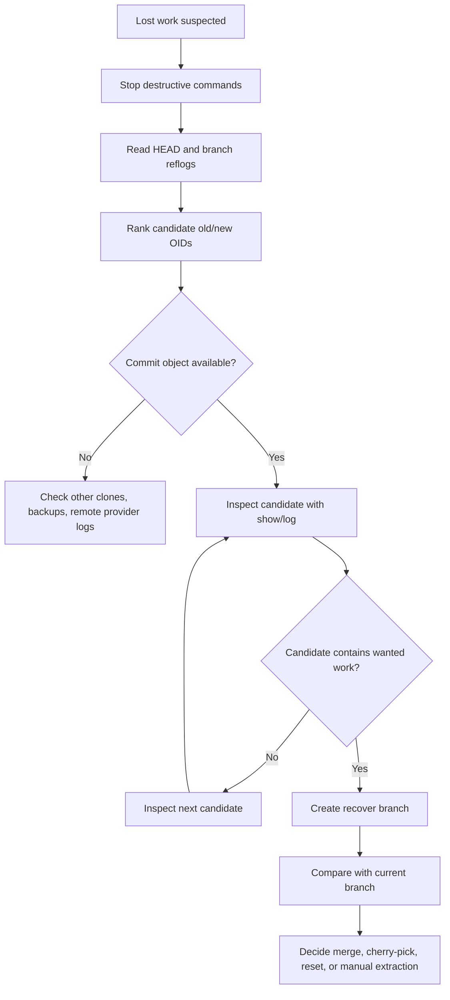

# Build a Mini Reflog Recovery Tool

Reflog is the difference between panic and recovery.

When a branch disappears, a rebase goes wrong, an amend overwrites the commit you wanted, or `reset --hard` moves `HEAD` away from valuable work, Git often still has enough local evidence to recover. The commit object may still exist. The ref movement may still be recorded. The missing piece is usually not data. It is diagnosis.

In this lab, we build a small recovery tool that reads reflog-like data and reconstructs likely recovery candidates.

We will not call JGit. We will not hide behind library abstractions. We will parse the useful subset ourselves so the model becomes clear.

The goal is not to replace Git. The goal is to understand how a serious engineer would build a recovery assistant around Git.

---

## 1. What This Tool Will Do

Our mini tool will:

1. Locate `.git` safely.
2. Read reflog files such as:
   - `.git/logs/HEAD`
   - `.git/logs/refs/heads/main`
   - `.git/logs/refs/heads/feature/foo`
3. Parse reflog entries.
4. Detect suspicious movements:
   - branch deletion clue
   - hard reset
   - rebase
   - amend
   - checkout movement
   - commit creation
   - pull/merge movement
5. Produce recovery candidates.
6. Emit safe commands such as:

```bash
# inspect before changing anything
git show <sha>
git log --oneline --decorate --graph <sha> --max-count=20

# recover by creating a new branch
git branch recover/<name> <sha>
```

The tool will **not** run destructive commands. A recovery tool should default to observation and branch creation suggestions, not mutation.

---

## 2. Reflog Mental Model

A ref is a pointer. A reflog is a local journal of pointer movement.

If `main` moved from commit `A` to commit `B`, the reflog entry remembers:

```text
old_oid new_oid actor timestamp timezone message
```

Typical entry:

```text
6f12a8c... b91d2ee... Jane Doe <jane@example.com> 1760000000 +0700 commit: add enforcement lifecycle state transition
```

Meaning:

```text
before: 6f12a8c...
after:  b91d2ee...
why:    commit: add enforcement lifecycle state transition
```

The critical recovery property is this:

> If a ref moved away from a commit, the old commit may still be recoverable as long as the object has not been pruned.

That is why `old_oid` matters.

---

## 3. Reflog Is Local Evidence, Not Global Truth

Reflog is not a distributed audit log.

It is local to a repository clone. Your teammate's reflog may contain entries that your clone does not. A remote hosting platform may keep additional audit events, but Git reflog itself is local repository metadata.

This creates several operational consequences:

| Situation | Reflog useful? | Notes |
|---|---:|---|
| You accidentally reset your local branch | Yes | Usually recoverable from `.git/logs/HEAD` or branch reflog. |
| You deleted a local branch | Often | `HEAD` reflog may remember checkout/commit positions. |
| Someone force-pushed remote branch | Maybe | Your local remote-tracking reflog may have old remote state if enabled/present. |
| Fresh clone after remote rewrite | No | The old local evidence never existed in that clone. |
| Object already pruned | Reflog may mention it, but object may be gone | Recovery candidate must be verified. |

A serious recovery tool must separate:

1. **Pointer evidence**: reflog says this SHA existed as a ref value.
2. **Object availability**: object database still contains that commit.
3. **Semantic value**: commit is actually the thing the user wants.

---

## 4. Reflog File Layout

Common files:

```text
.git/logs/HEAD
.git/logs/refs/heads/<branch>
.git/logs/refs/remotes/<remote>/<branch>
.git/logs/refs/stash
```

Example:

```text
.git/
  logs/
    HEAD
    refs/
      heads/
        main
        feature/enforcement-workflow
      remotes/
        origin/
          main
```

`HEAD` reflog records movements of `HEAD`.

Branch reflog records movements of that specific branch ref.

These are related but not identical.

---

## 5. Recovery Workflow Before Building the Tool

Manual recovery usually looks like this:

```bash
git reflog --date=iso
```

Find a suspicious entry:

```text
b91d2ee HEAD@{1}: reset: moving to HEAD~1
```

Inspect the previous commit:

```bash
git show b91d2ee
git log --oneline --decorate --graph b91d2ee --max-count=20
```

Create a recovery branch:

```bash
git branch recover/before-reset b91d2ee
```

Our tool automates the boring parts:

- parse reflog entries
- classify movement types
- rank candidates
- print safe recovery suggestions

---

## 6. Lab Boundary

This lab intentionally supports a useful subset:

- local `.git` repository
- normal text reflog files
- full 40-hex object IDs
- recovery suggestions only
- Java 21+

It does not implement:

- packed object parsing
- object existence check from packfiles
- worktree-specific reflog discovery in full generality
- Windows path edge cases beyond `java.nio.file`
- remote provider audit log integration

We will still design the code so those features can be added later.

---

## 7. Project Structure

```text
mini-reflog-recovery/
  src/
    Main.java
    GitRepository.java
    ReflogEntry.java
    ReflogParser.java
    RecoveryClassifier.java
    RecoveryCandidate.java
    RecoveryReport.java
```

For simplicity, the examples below can be compiled as separate files or merged into one educational file.

---

## 8. Reflog Entry Format

A reflog line is roughly:

```text
<old-oid> <new-oid> <name> <email> <timestamp> <timezone>\t<message>
```

Example:

```text
0000000000000000000000000000000000000000 8f5d0c2... Jane Doe <jane@example.com> 1760000000 +0700	commit (initial): initialize regulatory workflow
```

Important details:

- The message is separated by a tab from the metadata.
- Actor name may contain spaces.
- Email is enclosed in `<...>`.
- Timestamp is epoch seconds.
- Timezone is like `+0700`.
- The all-zero object ID means no previous object or no new object depending on direction.

The parser should not split naively by every space and assume fixed positions before the email.

---

## 9. Data Model

```java
import java.time.Instant;
import java.util.Objects;

public record ReflogEntry(
    String source,
    int lineNumber,
    String oldOid,
    String newOid,
    String actor,
    Instant time,
    String timezone,
    String message
) {
    public boolean oldIsZero() {
        return isZeroOid(oldOid);
    }

    public boolean newIsZero() {
        return isZeroOid(newOid);
    }

    public static boolean isZeroOid(String oid) {
        return oid != null && oid.matches("0{40}");
    }

    public boolean hasValidShape() {
        return oldOid != null
            && newOid != null
            && oldOid.matches("[0-9a-fA-F]{40}")
            && newOid.matches("[0-9a-fA-F]{40}")
            && time != null
            && message != null;
    }
}
```

Why keep `source` and `lineNumber`?

Because recovery is forensic. The report should say where the evidence came from.

---

## 10. Locating `.git`

A repository may have:

```text
.git/                 # normal repository metadata directory
.git                  # file pointing elsewhere, common in worktrees/submodules
```

A robust tool should handle both.

```java
import java.io.IOException;
import java.nio.file.Files;
import java.nio.file.Path;

public final class GitRepository {
    private final Path worktree;
    private final Path gitDir;

    private GitRepository(Path worktree, Path gitDir) {
        this.worktree = worktree;
        this.gitDir = gitDir;
    }

    public static GitRepository discover(Path start) throws IOException {
        Path current = start.toAbsolutePath().normalize();

        while (current != null) {
            Path dotGit = current.resolve(".git");

            if (Files.isDirectory(dotGit)) {
                return new GitRepository(current, dotGit);
            }

            if (Files.isRegularFile(dotGit)) {
                String content = Files.readString(dotGit).trim();
                if (!content.startsWith("gitdir:")) {
                    throw new IOException("Unsupported .git file format at " + dotGit);
                }

                String raw = content.substring("gitdir:".length()).trim();
                Path resolved = current.resolve(raw).normalize();
                return new GitRepository(current, resolved);
            }

            current = current.getParent();
        }

        throw new IOException("No .git directory found from " + start);
    }

    public Path worktree() {
        return worktree;
    }

    public Path gitDir() {
        return gitDir;
    }

    public Path logsDir() {
        return gitDir.resolve("logs");
    }
}
```

Invariant:

> Never assume `.git` is always a directory.

Worktrees and submodules commonly use a `.git` file that points to the real metadata directory.

---

## 11. Finding Reflog Files

```java
import java.io.IOException;
import java.nio.file.Files;
import java.nio.file.Path;
import java.util.ArrayList;
import java.util.List;
import java.util.stream.Stream;

public final class ReflogFiles {
    public static List<Path> discover(GitRepository repo) throws IOException {
        Path logs = repo.logsDir();
        List<Path> result = new ArrayList<>();

        if (!Files.isDirectory(logs)) {
            return result;
        }

        try (Stream<Path> stream = Files.walk(logs)) {
            stream
                .filter(Files::isRegularFile)
                .forEach(result::add);
        }

        return result;
    }
}
```

In production tooling, filter carefully and avoid reading giant unexpected files blindly. For an educational tool, walking `.git/logs` is acceptable.

---

## 12. Parsing Reflog Lines

```java
import java.time.Instant;
import java.util.Optional;

public final class ReflogParser {
    public Optional<ReflogEntry> parse(String source, int lineNumber, String line) {
        if (line == null || line.isBlank()) {
            return Optional.empty();
        }

        int tab = line.indexOf('\t');
        String header = tab >= 0 ? line.substring(0, tab) : line;
        String message = tab >= 0 ? line.substring(tab + 1) : "";

        String[] firstTwo = header.split(" ", 3);
        if (firstTwo.length < 3) {
            return Optional.empty();
        }

        String oldOid = firstTwo[0];
        String newOid = firstTwo[1];
        String rest = firstTwo[2];

        int emailStart = rest.lastIndexOf('<');
        int emailEnd = rest.lastIndexOf('>');
        if (emailStart < 0 || emailEnd < emailStart) {
            return Optional.empty();
        }

        String actor = rest.substring(0, emailEnd + 1).trim();
        String afterEmail = rest.substring(emailEnd + 1).trim();
        String[] timeParts = afterEmail.split(" ");
        if (timeParts.length < 2) {
            return Optional.empty();
        }

        try {
            long epochSeconds = Long.parseLong(timeParts[0]);
            String timezone = timeParts[1];

            ReflogEntry entry = new ReflogEntry(
                source,
                lineNumber,
                oldOid.toLowerCase(),
                newOid.toLowerCase(),
                actor,
                Instant.ofEpochSecond(epochSeconds),
                timezone,
                message
            );

            return entry.hasValidShape() ? Optional.of(entry) : Optional.empty();
        } catch (NumberFormatException ex) {
            return Optional.empty();
        }
    }
}
```

This parser is intentionally conservative. Bad lines are skipped rather than treated as truth.

For a recovery tool, false confidence is worse than missing one noisy line.

---

## 13. Classification Heuristics

Reflog messages are not a formal universal event API. They are useful hints.

Common messages:

```text
commit: add rule engine
commit (amend): refine rule engine
rebase (start): checkout main
rebase (finish): returning to refs/heads/feature/foo
reset: moving to HEAD~1
checkout: moving from main to feature/foo
merge main: Fast-forward
pull: Fast-forward
cherry-pick: fix production bug
```

We classify based on message prefix and old/new movement.

```java
public enum MovementKind {
    COMMIT,
    AMEND,
    RESET,
    REBASE,
    CHECKOUT,
    MERGE,
    PULL,
    CHERRY_PICK,
    BRANCH_CREATE,
    BRANCH_DELETE_OR_ZERO,
    UNKNOWN
}
```

```java
public final class RecoveryClassifier {
    public MovementKind classify(ReflogEntry e) {
        String m = e.message().toLowerCase();

        if (e.oldIsZero() || e.newIsZero()) {
            return MovementKind.BRANCH_DELETE_OR_ZERO;
        }
        if (m.startsWith("commit (amend):")) {
            return MovementKind.AMEND;
        }
        if (m.startsWith("commit:")) {
            return MovementKind.COMMIT;
        }
        if (m.startsWith("reset:")) {
            return MovementKind.RESET;
        }
        if (m.startsWith("rebase")) {
            return MovementKind.REBASE;
        }
        if (m.startsWith("checkout:")) {
            return MovementKind.CHECKOUT;
        }
        if (m.startsWith("merge")) {
            return MovementKind.MERGE;
        }
        if (m.startsWith("pull")) {
            return MovementKind.PULL;
        }
        if (m.startsWith("cherry-pick")) {
            return MovementKind.CHERRY_PICK;
        }
        return MovementKind.UNKNOWN;
    }
}
```

A production classifier should also read Git command context, current refs, and object availability.

But even this small classifier is enough to build useful recovery reports.

---

## 14. Which SHA Should Be a Candidate?

For each entry:

```text
old_oid -> new_oid
```

Potential recovery meanings:

| Movement | Usually interesting SHA | Why |
|---|---|---|
| bad reset | `old_oid` | branch moved away from old tip |
| bad rebase | `old_oid` or previous commit tips | old version of branch may be valuable |
| bad amend | `old_oid` | pre-amend commit may be valuable |
| accidental checkout | usually not recovery | movement of `HEAD`, not necessarily data loss |
| commit | `new_oid` | new created commit may be recoverable if branch later lost |
| branch delete/zero | non-zero side | clue for creation/deletion |

Recovery candidates should be ranked, not blindly emitted.

---

## 15. Candidate Model

```java
import java.time.Instant;

public record RecoveryCandidate(
    String oid,
    String reason,
    MovementKind kind,
    String source,
    int lineNumber,
    Instant time,
    String evidenceMessage,
    int score
) {}
```

Scoring heuristic:

| Signal | Score |
|---|---:|
| reset old tip | +90 |
| amend old commit | +80 |
| rebase old tip | +75 |
| branch delete non-zero side | +70 |
| commit new tip | +40 |
| checkout old/new side | +10 |
| unknown movement | +5 |

This is not mathematical truth. It is ranking for human inspection.

---

## 16. Candidate Extraction

```java
import java.util.ArrayList;
import java.util.List;

public final class CandidateExtractor {
    private final RecoveryClassifier classifier = new RecoveryClassifier();

    public List<RecoveryCandidate> from(ReflogEntry e) {
        MovementKind kind = classifier.classify(e);
        List<RecoveryCandidate> out = new ArrayList<>();

        switch (kind) {
            case RESET -> out.add(candidate(e.oldOid(), e, kind, "branch tip before reset", 90));
            case AMEND -> out.add(candidate(e.oldOid(), e, kind, "commit before amend", 80));
            case REBASE -> out.add(candidate(e.oldOid(), e, kind, "branch/head state before rebase movement", 75));
            case BRANCH_DELETE_OR_ZERO -> {
                if (!e.oldIsZero()) {
                    out.add(candidate(e.oldOid(), e, kind, "non-zero old side of zero movement", 70));
                }
                if (!e.newIsZero()) {
                    out.add(candidate(e.newOid(), e, kind, "non-zero new side of zero movement", 60));
                }
            }
            case COMMIT, CHERRY_PICK, MERGE, PULL ->
                out.add(candidate(e.newOid(), e, kind, "new tip after " + kind.name().toLowerCase(), 40));
            case CHECKOUT ->
                out.add(candidate(e.oldOid(), e, kind, "head before checkout", 10));
            case UNKNOWN ->
                out.add(candidate(e.oldOid(), e, kind, "old side of unknown movement", 5));
        }

        return out;
    }

    private RecoveryCandidate candidate(String oid, ReflogEntry e, MovementKind kind, String reason, int score) {
        return new RecoveryCandidate(
            oid,
            reason,
            kind,
            e.source(),
            e.lineNumber(),
            e.time(),
            e.message(),
            score
        );
    }
}
```

---

## 17. Loading All Entries

```java
import java.io.IOException;
import java.nio.file.Files;
import java.nio.file.Path;
import java.util.ArrayList;
import java.util.List;

public final class ReflogLoader {
    private final ReflogParser parser = new ReflogParser();

    public List<ReflogEntry> load(Path file, Path gitDir) throws IOException {
        List<String> lines = Files.readAllLines(file);
        List<ReflogEntry> entries = new ArrayList<>();
        String source = gitDir.relativize(file).toString();

        for (int i = 0; i < lines.size(); i++) {
            parser.parse(source, i + 1, lines.get(i)).ifPresent(entries::add);
        }

        return entries;
    }
}
```

---

## 18. Deduplicating Candidates

The same SHA may appear many times.

Group by OID, keep the highest score, and preserve evidence count.

```java
import java.util.ArrayList;
import java.util.Comparator;
import java.util.HashMap;
import java.util.List;
import java.util.Map;

public final class CandidateRanker {
    public List<RecoveryCandidate> rank(List<RecoveryCandidate> candidates) {
        Map<String, RecoveryCandidate> bestByOid = new HashMap<>();

        for (RecoveryCandidate c : candidates) {
            bestByOid.merge(
                c.oid(),
                c,
                (a, b) -> b.score() > a.score() ? b : a
            );
        }

        List<RecoveryCandidate> result = new ArrayList<>(bestByOid.values());
        result.sort(
            Comparator
                .comparingInt(RecoveryCandidate::score).reversed()
                .thenComparing(RecoveryCandidate::time, Comparator.reverseOrder())
        );
        return result;
    }
}
```

---

## 19. Object Availability Check

A candidate SHA is only useful if the object exists.

The easy path is to call:

```bash
git cat-file -e <sha>^{commit}
```

For this lab, we can either:

1. shell out to Git, or
2. check only loose object path.

Because Part 111 built a loose object store, we know the loose path:

```text
.git/objects/ab/cdef...
```

But many real commits are packed. A loose-only check would incorrectly mark packed commits as missing.

So for this recovery tool, shelling out to Git is the safer pragmatic choice.

```java
import java.io.IOException;
import java.nio.file.Path;
import java.util.List;

public final class GitObjectVerifier {
    private final Path worktree;

    public GitObjectVerifier(Path worktree) {
        this.worktree = worktree;
    }

    public boolean isCommitAvailable(String oid) {
        ProcessBuilder pb = new ProcessBuilder(
            List.of("git", "cat-file", "-e", oid + "^{commit}")
        );
        pb.directory(worktree.toFile());
        pb.redirectErrorStream(true);

        try {
            Process p = pb.start();
            return p.waitFor() == 0;
        } catch (IOException | InterruptedException ex) {
            Thread.currentThread().interrupt();
            return false;
        }
    }
}
```

Rule:

> Shelling out to Git is acceptable when Git is the source of truth and you are building workflow tooling, not reimplementing storage internals.

---

## 20. Reporting Safe Recovery Commands

A good recovery report should be explicit and non-destructive.

```java
public final class RecoveryReporter {
    public void print(List<RecoveryCandidate> candidates, GitObjectVerifier verifier) {
        int index = 1;

        for (RecoveryCandidate c : candidates) {
            boolean available = verifier.isCommitAvailable(c.oid());
            String shortOid = c.oid().substring(0, 12);

            System.out.println("\n# Candidate " + index++);
            System.out.println("score:   " + c.score());
            System.out.println("oid:     " + c.oid());
            System.out.println("exists:  " + available);
            System.out.println("kind:    " + c.kind());
            System.out.println("reason:  " + c.reason());
            System.out.println("source:  " + c.source() + ":" + c.lineNumber());
            System.out.println("time:    " + c.time());
            System.out.println("message: " + c.evidenceMessage());

            if (available) {
                System.out.println("inspect:");
                System.out.println("  git show --stat " + c.oid());
                System.out.println("  git log --oneline --decorate --graph " + c.oid() + " --max-count=20");
                System.out.println("recover:");
                System.out.println("  git branch recover/" + shortOid + " " + c.oid());
            } else {
                System.out.println("warning:");
                System.out.println("  object not available as commit in this clone; check another clone or backups");
            }
        }
    }
}
```

Why create a branch instead of resetting current branch?

Because recovery should preserve options.

```bash
git branch recover/<sha> <sha>
```

is safe because it creates a new ref. It does not move `main`, does not rewrite history, and does not alter the working tree.

---

## 21. Main Program

```java
import java.nio.file.Path;
import java.util.ArrayList;
import java.util.List;

public final class Main {
    public static void main(String[] args) throws Exception {
        Path start = args.length == 0 ? Path.of(".") : Path.of(args[0]);
        GitRepository repo = GitRepository.discover(start);

        List<Path> reflogFiles = ReflogFiles.discover(repo);
        ReflogLoader loader = new ReflogLoader();
        CandidateExtractor extractor = new CandidateExtractor();

        List<RecoveryCandidate> allCandidates = new ArrayList<>();

        for (Path file : reflogFiles) {
            for (ReflogEntry entry : loader.load(file, repo.gitDir())) {
                allCandidates.addAll(extractor.from(entry));
            }
        }

        List<RecoveryCandidate> ranked = new CandidateRanker().rank(allCandidates);
        GitObjectVerifier verifier = new GitObjectVerifier(repo.worktree());
        new RecoveryReporter().print(ranked.stream().limit(25).toList(), verifier);
    }
}
```

Compile and run:

```bash
javac *.java
java Main /path/to/repo
```

---

## 22. Example Output

```text
# Candidate 1
score:   90
oid:     b91d2ee4b10f2c13ea62a7fe4efce91cf1b22390
exists:  true
kind:    RESET
reason:  branch tip before reset
source:  logs/HEAD:315
time:    2026-07-07T03:42:11Z
message: reset: moving to HEAD~1
inspect:
  git show --stat b91d2ee4b10f2c13ea62a7fe4efce91cf1b22390
  git log --oneline --decorate --graph b91d2ee4b10f2c13ea62a7fe4efce91cf1b22390 --max-count=20
recover:
  git branch recover/b91d2ee4b10f b91d2ee4b10f2c13ea62a7fe4efce91cf1b22390
```

The output gives a safe next step, not an automatic mutation.

---

## 23. Scenario: Bad Reset

User did:

```bash
git reset --hard HEAD~3
```

Branch now points three commits earlier.

Recovery:

```bash
java Main .
```

Find a high-score reset candidate.

Inspect:

```bash
git show --stat <candidate>
git log --oneline --decorate --graph <candidate> --max-count=20
```

Recover:

```bash
git branch recover/before-bad-reset <candidate>
```

Then compare:

```bash
git log --oneline --decorate --graph HEAD..recover/before-bad-reset
```

If correct:

```bash
git switch recover/before-bad-reset
```

or carefully move the original branch after review.

---

## 24. Scenario: Bad Amend

User did:

```bash
git commit --amend
```

Then realized the previous commit message or content mattered.

Reflog likely contains:

```text
old new actor time tz	commit (amend): new message
```

The old side is the pre-amend commit.

Recovery branch:

```bash
git branch recover/pre-amend <old-oid>
```

Then inspect:

```bash
git range-diff recover/pre-amend HEAD
```

or:

```bash
git diff recover/pre-amend HEAD
```

depending on what you need to compare.

---

## 25. Scenario: Bad Rebase

Bad rebase is harder because there may be several useful tips:

- original branch tip before rebase
- intermediate rewritten commits
- final rewritten branch tip
- commits skipped/dropped accidentally

The tool should not claim certainty. It should surface candidates.

Manual commands:

```bash
git reflog --date=iso
git log --oneline --decorate --graph <candidate> --max-count=30
git range-diff <old-base>..<old-tip> <new-base>..<new-tip>
```

A good report says:

```text
reason: branch/head state before rebase movement
```

not:

```text
this is definitely your lost work
```

Recovery tooling should be humble.

---

## 26. Scenario: Deleted Branch

If a branch was deleted, its branch reflog file may also disappear depending on operation and Git version/config. But `HEAD` reflog may still have checkout entries or commit entries from when the branch was active.

Search candidates by message and time:

```bash
git reflog --all --date=iso | grep feature/enforcement
```

Our tool can improve by adding a `--grep` flag:

```bash
java Main . --grep enforcement
```

Implementation idea:

```java
boolean matches(ReflogEntry e, String query) {
    return e.message().toLowerCase().contains(query.toLowerCase())
        || e.source().toLowerCase().contains(query.toLowerCase());
}
```

---

## 27. Add a Time Window

Most recovery has a time story:

> I broke it around 10 AM.

Add flags:

```bash
--since 2026-07-07T09:00:00+07:00
--until 2026-07-07T11:00:00+07:00
```

Use `OffsetDateTime`:

```java
import java.time.Instant;
import java.time.OffsetDateTime;

public record TimeWindow(Instant since, Instant until) {
    public boolean contains(Instant t) {
        return (since == null || !t.isBefore(since))
            && (until == null || !t.isAfter(until));
    }

    public static Instant parse(String value) {
        return OffsetDateTime.parse(value).toInstant();
    }
}
```

Filtering by time turns a noisy recovery report into a useful one.

---

## 28. Add Branch-Aware Ranking

A recovery candidate from `logs/refs/heads/feature/foo` is more relevant to `feature/foo` recovery than a generic `HEAD` entry.

Heuristic:

```java
int branchBonus(RecoveryCandidate c, String targetBranch) {
    if (targetBranch == null) return 0;
    String normalized = targetBranch.replace("refs/heads/", "");
    return c.source().contains("refs/heads/" + normalized) ? 20 : 0;
}
```

Then adjust score before sorting.

---

## 29. Add Current Reachability Analysis

A candidate may still be reachable from a current branch. If so, it is not really lost.

Shell out:

```bash
git branch --contains <sha>
```

Java wrapper:

```java
public List<String> branchesContaining(String oid) {
    // run: git branch --contains <oid> --format=%(refname:short)
    return List.of();
}
```

Report:

```text
reachable-from:
  - main
  - release/2.4
```

If the commit is reachable, recovery may not be needed. The user may only need to find the branch.

---

## 30. Add Safety Checks Before Recovery

If the tool later supports `recover` mode, it should enforce:

1. do not move existing branches unless explicitly asked
2. create namespaced recovery refs
3. fail if recovery ref already exists unless `--force` with explicit SHA
4. print exact command before running
5. support `--dry-run`

Safer namespace:

```text
refs/heads/recover/<timestamp>-<shortsha>
```

Command:

```bash
git update-ref refs/heads/recover/20260707-b91d2ee b91d2ee...
```

But for users, `git branch` is easier:

```bash
git branch recover/20260707-b91d2ee b91d2ee...
```

---

## 31. Recovery Decision Tree



Notice the first action:

> Stop destructive commands.

Running `gc`, `prune`, or more resets can reduce recovery options.

---

## 32. How This Maps to Real Git Commands

| Tool behavior | Git equivalent |
|---|---|
| read reflog file | `git reflog`, `git reflog show --all` |
| verify object | `git cat-file -e <sha>^{commit}` |
| inspect commit | `git show <sha>` |
| inspect local graph | `git log --graph <sha>` |
| create recovery branch | `git branch recover/name <sha>` |
| compare patch series | `git range-diff` |
| compare trees | `git diff` |

The tool makes command selection systematic.

---

## 33. Production Hardening Checklist

Before using a tool like this in production incident response:

- [ ] Support `.git` file indirection.
- [ ] Support multiple worktrees.
- [ ] Include `git reflog --all` fallback.
- [ ] Verify object availability through Git, not loose-path only.
- [ ] Detect shallow/partial clone state.
- [ ] Detect ongoing Git operation state: rebase, merge, cherry-pick.
- [ ] Never run destructive commands by default.
- [ ] Emit JSON for automation.
- [ ] Include exact evidence source and line number.
- [ ] Support time window filters.
- [ ] Support target branch filters.
- [ ] Include branch reachability report.
- [ ] Add tests using disposable repositories.

---

## 34. Testing With Disposable Repositories

Create a sandbox:

```bash
rm -rf /tmp/reflog-lab
mkdir /tmp/reflog-lab
cd /tmp/reflog-lab
git init

echo one > file.txt
git add file.txt
git commit -m "one"

echo two >> file.txt
git commit -am "two"

echo three >> file.txt
git commit -am "three"

BAD=$(git rev-parse HEAD)
git reset --hard HEAD~2
```

Run the tool:

```bash
java Main /tmp/reflog-lab
```

Expected:

```text
Candidate includes BAD as branch tip before reset
```

Recover:

```bash
git branch recover/bad-reset $BAD
git log --oneline --decorate --graph --all
```

---

## 35. Edge Cases

### Reflog Entry References a Packed Commit

Object verification through loose object path fails. Use `git cat-file -e`.

### Reflog Mentions Commit Already Pruned

Report it as unavailable. Suggest checking another clone or backups.

### Rebase Creates Many Candidate Commits

Rank and group by time. Do not pretend one candidate is definitive.

### Branch Was Deleted Long Ago

Reflog may have expired. The tool may not recover anything.

### Secret Leak Recovery

Do not create recovery branches that keep exposed secrets alive unless incident policy requires evidence preservation in a controlled environment.

---

## 36. What Top Engineers Internalize

Reflog recovery is not magic. It is pointer archaeology.

You are reconstructing:

1. which refs moved
2. from which commit
3. to which commit
4. when
5. why Git thought it moved
6. whether the old commit object still exists
7. whether the old commit is semantically valuable

This is a deterministic investigation, not a guessing game.

---

## 37. Final Mental Model

A reflog recovery tool should obey one invariant:

> Recovery tooling should create new safe references to candidate commits, never destroy or overwrite current evidence.

When you are unsure, create a new branch.

```bash
git branch recover/<case-id>-<shortsha> <sha>
```

A new ref buys time. Time buys understanding. Understanding prevents turning a local mistake into a team incident.

---

## References

- Git documentation: `git reflog` — <https://git-scm.com/docs/git-reflog>
- Git documentation: `git cat-file` — <https://git-scm.com/docs/git-cat-file>
- Git documentation: `git update-ref` — <https://git-scm.com/docs/git-update-ref>
- Git documentation: `git branch` — <https://git-scm.com/docs/git-branch>
- Pro Git: Git Internals — <https://git-scm.com/book/en/v2/Git-Internals-Plumbing-and-Porcelain>
