# Build a Repo Health Analyzer

A repository does not become unhealthy in one dramatic moment.

It drifts.

A few large binaries enter history. Some release tags move. Old branches accumulate. CI switches to shallow clone and silently breaks release notes. Submodules point to unreachable commits. The default branch slows down because the index and working tree contain too much. Nobody notices until clone time explodes, merge queues slow down, release verification fails, or a production incident requires forensic confidence that the repository can no longer provide.

In this lab, we build a small repository health analyzer.

Not a dashboard. Not a generic linter. A tool that encodes Git operational invariants.

---

## 1. What the Analyzer Will Detect

Our tool will inspect:

1. repository identity
2. current branch and HEAD state
3. shallow/partial/sparse state
4. uncommitted working tree risk
5. branch age and stale branches
6. long-lived branch divergence
7. large blobs in history
8. tag anomalies
9. release tag verification candidates
10. submodule state
11. Git LFS configuration clues
12. object/storage health hints
13. CI/release correctness risks

It will produce:

- human-readable report
- machine-readable JSON-like structure
- severity levels
- suggested next actions

---

## 2. Design Principle

A repository health analyzer should not merely ask:

> Is the repository valid Git?

It should ask:

> Can this repository still support fast development, safe review, reproducible releases, and reliable incident forensics?

That is a stronger bar.

---

## 3. Health Categories

```mermaid
flowchart TD
    A[Repository Health] --> B[Correctness]
    A --> C[Performance]
    A --> D[Collaboration]
    A --> E[Release Integrity]
    A --> F[Supply Chain]
    A --> G[Forensics]

    B --> B1[clean index]
    B --> B2[valid refs]
    B --> B3[reachable submodule commits]

    C --> C1[large blobs]
    C --> C2[too many refs]
    C --> C3[loose object pressure]

    D --> D1[stale branches]
    D --> D2[long-lived divergence]
    D --> D3[tracking misconfiguration]

    E --> E1[annotated/signed tags]
    E --> E2[tag immutability]
    E --> E3[release boundary]

    F --> F1[LFS boundary]
    F --> F2[submodule provenance]
    F --> F3[third-party remotes]

    G --> G1[reflog availability]
    G --> G2[commit graph]
    G --> G3[object fsck]
```



A good analyzer separates these categories because a repository can be valid but operationally dangerous.

---

## 4. Lab Boundary

We will implement the analyzer as Java tooling that shells out to Git for authoritative answers.

That is intentional.

Git already knows how to traverse packed objects, understand refs, parse revision syntax, and inspect repository state. Reimplementing all of that would create a worse Git.

Our value is policy interpretation.

Supported:

- Java 21+
- local Git repository
- `git` executable available
- text report output
- safe read-only commands

Not supported in this lab:

- remote hosting API integration
- actual branch protection checks from GitHub/GitLab
- complete packfile parsing
- complete JSON library usage
- modifying repository state

---

## 5. Project Structure

```text
repo-health-analyzer/
  src/
    Main.java
    Git.java
    CheckResult.java
    Severity.java
    RepositoryContext.java
    Checks.java
    ReportPrinter.java
```

---

## 6. Command Runner

We need a small safe wrapper around Git commands.

```java
import java.io.IOException;
import java.nio.charset.StandardCharsets;
import java.nio.file.Path;
import java.time.Duration;
import java.util.ArrayList;
import java.util.List;
import java.util.concurrent.TimeUnit;

public final class Git {
    private final Path worktree;

    public Git(Path worktree) {
        this.worktree = worktree;
    }

    public Result run(String... args) {
        List<String> cmd = new ArrayList<>();
        cmd.add("git");
        for (String arg : args) cmd.add(arg);

        ProcessBuilder pb = new ProcessBuilder(cmd);
        pb.directory(worktree.toFile());
        pb.redirectErrorStream(true);

        try {
            Process p = pb.start();
            boolean done = p.waitFor(20, TimeUnit.SECONDS);
            if (!done) {
                p.destroyForcibly();
                return new Result(124, "command timed out: " + String.join(" ", cmd));
            }
            String out = new String(p.getInputStream().readAllBytes(), StandardCharsets.UTF_8);
            return new Result(p.exitValue(), out.trim());
        } catch (IOException | InterruptedException ex) {
            Thread.currentThread().interrupt();
            return new Result(125, ex.getMessage());
        }
    }

    public record Result(int exitCode, String output) {
        public boolean ok() {
            return exitCode == 0;
        }
    }
}
```

Timeouts matter. A health analyzer must not hang forever on a pathological repository.

---

## 7. Severity Model

```java
public enum Severity {
    INFO,
    WARN,
    ERROR,
    CRITICAL
}
```

```java
public record CheckResult(
    String id,
    Severity severity,
    String title,
    String detail,
    String recommendation
) {}
```

Severity should express operational risk:

| Severity | Meaning |
|---|---|
| INFO | useful context, no immediate problem |
| WARN | risky pattern, should be reviewed |
| ERROR | likely violates team/release policy |
| CRITICAL | can break recovery, security, or release integrity |

---

## 8. Repository Context

```java
public record RepositoryContext(
    String topLevel,
    String gitDir,
    String head,
    String currentBranch,
    boolean detachedHead,
    boolean shallow,
    boolean sparseCheckout,
    boolean partialClone
) {}
```

Build it:

```java
public final class ContextReader {
    public RepositoryContext read(Git git) {
        String top = value(git.run("rev-parse", "--show-toplevel"));
        String gitDir = value(git.run("rev-parse", "--git-dir"));
        String head = value(git.run("rev-parse", "HEAD"));

        Git.Result branchResult = git.run("branch", "--show-current");
        String branch = branchResult.ok() ? branchResult.output() : "";
        boolean detached = branch == null || branch.isBlank();

        boolean shallow = "true".equals(value(git.run("rev-parse", "--is-shallow-repository")));
        boolean sparse = "true".equals(value(git.run("config", "--bool", "core.sparseCheckout")));

        String partialFilter = value(git.run("config", "--get", "remote.origin.promisor"));
        boolean partial = "true".equals(partialFilter);

        return new RepositoryContext(top, gitDir, head, branch, detached, shallow, sparse, partial);
    }

    private String value(Git.Result r) {
        return r.ok() ? r.output() : "";
    }
}
```

---

## 9. Check: Are We Inside a Repository?

```java
public static CheckResult checkRepository(Git git) {
    Git.Result r = git.run("rev-parse", "--is-inside-work-tree");
    if (!r.ok() || !"true".equals(r.output())) {
        return new CheckResult(
            "repo.present",
            Severity.CRITICAL,
            "Not inside a Git worktree",
            "The analyzer could not confirm this path is inside a Git worktree.",
            "Run the analyzer from a repository worktree or pass the correct path."
        );
    }
    return new CheckResult(
        "repo.present",
        Severity.INFO,
        "Git worktree detected",
        "The current path is inside a Git worktree.",
        "No action needed."
    );
}
```

---

## 10. Check: Dirty Working Tree

Dirty state matters because local modifications can distort analysis.

```java
public static CheckResult checkDirtyTree(Git git) {
    Git.Result r = git.run("status", "--porcelain=v2");
    if (!r.ok()) {
        return new CheckResult(
            "worktree.status",
            Severity.ERROR,
            "Cannot read working tree status",
            r.output(),
            "Run git status manually and resolve repository state."
        );
    }

    if (!r.output().isBlank()) {
        return new CheckResult(
            "worktree.dirty",
            Severity.WARN,
            "Working tree or index is dirty",
            "There are staged, unstaged, untracked, or unresolved changes.",
            "Commit, stash, or intentionally ignore local changes before release or forensic analysis."
        );
    }

    return new CheckResult(
        "worktree.clean",
        Severity.INFO,
        "Working tree is clean",
        "No porcelain v2 status entries were reported.",
        "No action needed."
    );
}
```

For release verification, dirty state should usually be `ERROR`, not merely `WARN`.

Severity can depend on mode:

```bash
repo-health --mode developer
repo-health --mode release
repo-health --mode incident
```

---

## 11. Check: Detached HEAD

Detached HEAD is not always bad. In CI it is normal. In a developer workspace it can lead to lost commits.

```java
public static CheckResult checkDetachedHead(RepositoryContext ctx) {
    if (ctx.detachedHead()) {
        return new CheckResult(
            "head.detached",
            Severity.WARN,
            "Detached HEAD",
            "HEAD points directly to a commit instead of a branch.",
            "If doing local development, create a branch before committing: git switch -c work/<name>. In CI, ensure build metadata records the commit SHA."
        );
    }

    return new CheckResult(
        "head.branch",
        Severity.INFO,
        "HEAD is on a branch",
        "Current branch: " + ctx.currentBranch(),
        "No action needed."
    );
}
```

---

## 12. Check: Shallow Repository

Shallow clone can break:

- merge-base computation
- changelog generation
- release boundary detection
- bisect
- tag-based versioning
- affected-project calculation

```java
public static CheckResult checkShallow(RepositoryContext ctx) {
    if (ctx.shallow()) {
        return new CheckResult(
            "repo.shallow",
            Severity.WARN,
            "Repository is shallow",
            "History is truncated, which can break merge-base, release notes, bisect, and tag-based version logic.",
            "For release/forensic jobs, fetch full history or deepen explicitly: git fetch --unshallow --tags."
        );
    }

    return new CheckResult(
        "repo.full-history",
        Severity.INFO,
        "Repository is not shallow",
        "Git reports this is not a shallow repository.",
        "No action needed."
    );
}
```

---

## 13. Check: Partial Clone

Partial clone is powerful, but it changes object availability assumptions.

```java
public static CheckResult checkPartialClone(RepositoryContext ctx) {
    if (ctx.partialClone()) {
        return new CheckResult(
            "repo.partial-clone",
            Severity.INFO,
            "Partial clone detected",
            "This repository may lazily fetch missing objects from a promisor remote.",
            "Ensure release, audit, and offline forensic workflows materialize required objects before verification."
        );
    }

    return new CheckResult(
        "repo.not-partial",
        Severity.INFO,
        "Partial clone not detected",
        "No remote.origin.promisor=true config was detected.",
        "No action needed."
    );
}
```

In incident mode, partial clone might become `WARN` because lazy fetching during investigation can mutate local evidence timing and fail offline.

---

## 14. Check: Sparse Checkout

Sparse checkout is not unhealthy by itself. It is a profile that can hide files from the working tree.

```java
public static CheckResult checkSparse(RepositoryContext ctx) {
    if (ctx.sparseCheckout()) {
        return new CheckResult(
            "repo.sparse-checkout",
            Severity.INFO,
            "Sparse checkout enabled",
            "The working tree may only contain a subset of tracked files.",
            "For full-repository release scans, disable sparse checkout or run checks against the object database/tree, not only working-tree files."
        );
    }

    return new CheckResult(
        "repo.not-sparse",
        Severity.INFO,
        "Sparse checkout not enabled",
        "Working tree is not configured as sparse checkout.",
        "No action needed."
    );
}
```

---

## 15. Check: Stale Branches

A stale branch is not automatically wrong, but it creates coordination and security noise.

Get branches with committer date:

```bash
git for-each-ref refs/heads refs/remotes --format='%(refname:short)|%(committerdate:unix)|%(objectname:short)'
```

Java parser:

```java
import java.time.Instant;
import java.time.temporal.ChronoUnit;
import java.util.ArrayList;
import java.util.List;

public record BranchInfo(String name, Instant lastCommitTime, String shortOid) {}

public static List<BranchInfo> branches(Git git) {
    Git.Result r = git.run(
        "for-each-ref",
        "refs/heads",
        "refs/remotes",
        "--format=%(refname:short)|%(committerdate:unix)|%(objectname:short)"
    );
    List<BranchInfo> out = new ArrayList<>();
    if (!r.ok() || r.output().isBlank()) return out;

    for (String line : r.output().split("\\R")) {
        String[] p = line.split("\\|", -1);
        if (p.length != 3 || p[1].isBlank()) continue;
        out.add(new BranchInfo(p[0], Instant.ofEpochSecond(Long.parseLong(p[1])), p[2]));
    }
    return out;
}
```

Check:

```java
public static CheckResult checkStaleBranches(Git git, int maxAgeDays) {
    Instant cutoff = Instant.now().minus(maxAgeDays, ChronoUnit.DAYS);
    List<BranchInfo> stale = branches(git).stream()
        .filter(b -> b.lastCommitTime().isBefore(cutoff))
        .filter(b -> !b.name().matches("origin/HEAD|main|master|origin/main|origin/master"))
        .toList();

    if (!stale.isEmpty()) {
        String detail = stale.stream()
            .limit(20)
            .map(b -> b.name() + " @ " + b.shortOid() + " lastCommit=" + b.lastCommitTime())
            .reduce("", (a, b) -> a + "\n- " + b);

        return new CheckResult(
            "branches.stale",
            Severity.WARN,
            "Stale branches detected",
            stale.size() + " branches older than " + maxAgeDays + " days." + detail,
            "Review ownership, close obsolete branches, or document why long-lived branches still exist."
        );
    }

    return new CheckResult(
        "branches.stale",
        Severity.INFO,
        "No stale branches above threshold",
        "No local/remote branch exceeded the configured age threshold.",
        "No action needed."
    );
}
```

---

## 16. Check: Long-Lived Divergence

Branch age alone is incomplete.

A branch can be old but harmless if merged or inactive. More important:

- how far ahead it is from main
- how far behind it is from main
- whether it still has unmerged work

Command:

```bash
git rev-list --left-right --count main...feature/foo
```

Output:

```text
12 4
```

Meaning for `main...feature/foo`:

- left: commits reachable from `main` not from branch
- right: commits reachable from branch not from `main`

Check:

```java
public static CheckResult checkBranchDivergence(Git git, String base, int behindLimit, int aheadLimit) {
    List<String> risky = new ArrayList<>();

    for (BranchInfo b : branches(git)) {
        if (b.name().startsWith("origin/HEAD") || b.name().equals(base)) continue;
        if (b.name().startsWith("origin/")) continue; // keep this lab simple

        Git.Result r = git.run("rev-list", "--left-right", "--count", base + "..." + b.name());
        if (!r.ok() || r.output().isBlank()) continue;

        String[] p = r.output().split("\\s+");
        if (p.length != 2) continue;

        int behind = Integer.parseInt(p[0]);
        int ahead = Integer.parseInt(p[1]);

        if (behind > behindLimit || ahead > aheadLimit) {
            risky.add(b.name() + " behind=" + behind + " ahead=" + ahead);
        }
    }

    if (!risky.isEmpty()) {
        return new CheckResult(
            "branches.divergence",
            Severity.WARN,
            "Long-lived branch divergence detected",
            String.join("\n", risky),
            "Rebase/restack, split branch, merge intentionally, or close obsolete branch."
        );
    }

    return new CheckResult(
        "branches.divergence",
        Severity.INFO,
        "No branch divergence above threshold",
        "Branches are within configured ahead/behind limits.",
        "No action needed."
    );
}
```

---

## 17. Check: Large Blobs in History

Large blobs are one of the most expensive repository mistakes.

Command pattern:

```bash
git rev-list --objects --all
```

Then ask Git for object size:

```bash
git cat-file --batch-check='%(objecttype) %(objectname) %(objectsize) %(rest)'
```

For the lab, a simpler but slower approach:

```java
public record BlobInfo(String oid, long size, String path) {}

public static List<BlobInfo> largeBlobs(Git git, long thresholdBytes) {
    Git.Result objects = git.run("rev-list", "--objects", "--all");
    List<BlobInfo> result = new ArrayList<>();
    if (!objects.ok() || objects.output().isBlank()) return result;

    for (String line : objects.output().split("\\R")) {
        String[] p = line.split(" ", 2);
        String oid = p[0];
        String path = p.length > 1 ? p[1] : "";

        Git.Result type = git.run("cat-file", "-t", oid);
        if (!type.ok() || !"blob".equals(type.output())) continue;

        Git.Result size = git.run("cat-file", "-s", oid);
        if (!size.ok()) continue;

        long bytes = Long.parseLong(size.output());
        if (bytes >= thresholdBytes) {
            result.add(new BlobInfo(oid, bytes, path));
        }
    }

    result.sort((a, b) -> Long.compare(b.size(), a.size()));
    return result;
}
```

Check:

```java
public static CheckResult checkLargeBlobs(Git git, long thresholdBytes) {
    List<BlobInfo> blobs = largeBlobs(git, thresholdBytes);
    if (blobs.isEmpty()) {
        return new CheckResult(
            "objects.large-blobs",
            Severity.INFO,
            "No large blobs above threshold",
            "Threshold: " + thresholdBytes + " bytes.",
            "No action needed."
        );
    }

    String detail = blobs.stream()
        .limit(20)
        .map(b -> b.size() + " bytes " + b.oid().substring(0, 12) + " " + b.path())
        .reduce("", (a, b) -> a + "\n- " + b);

    return new CheckResult(
        "objects.large-blobs",
        Severity.ERROR,
        "Large blobs found in history",
        detail,
        "Move future large artifacts to artifact storage or Git LFS. If history cleanup is required, plan a coordinated rewrite with git filter-repo or equivalent."
    );
}
```

Performance note:

The simple implementation shells out per object. That is educational but slow.

Production version should use `cat-file --batch-check`.

---

## 18. Faster Large Blob Scan With Batch Check

Better pipeline:

```bash
git rev-list --objects --all |
git cat-file --batch-check='%(objecttype) %(objectname) %(objectsize) %(rest)'
```

Example output:

```text
blob a1b2c3... 9823412 path/to/big-file.zip
commit d4e5f6... 231
```

In production Java:

- start one `git cat-file --batch-check` process
- stream object IDs and paths into stdin
- parse stdout
- avoid one process per object

This is the difference between a toy analyzer and a tool that can survive a monorepo.

---

## 19. Check: Too Many Refs

Too many refs can slow operations and complicate governance.

```java
public static CheckResult checkRefCount(Git git, int warnAt) {
    Git.Result r = git.run("for-each-ref", "--format=%(refname)");
    if (!r.ok()) {
        return new CheckResult(
            "refs.count",
            Severity.ERROR,
            "Cannot count refs",
            r.output(),
            "Run git for-each-ref manually."
        );
    }

    long count = r.output().isBlank() ? 0 : r.output().split("\\R").length;
    if (count >= warnAt) {
        return new CheckResult(
            "refs.count",
            Severity.WARN,
            "High ref count",
            "Repository has " + count + " refs.",
            "Prune obsolete branches/tags, review remote-tracking refs, and ensure packed-refs/maintenance is healthy."
        );
    }

    return new CheckResult(
        "refs.count",
        Severity.INFO,
        "Ref count within threshold",
        "Repository has " + count + " refs.",
        "No action needed."
    );
}
```

---

## 20. Check: Tag Quality

For release integrity, tags should usually be annotated and often signed.

List tags and object types:

```bash
git for-each-ref refs/tags --format='%(refname:short)|%(objecttype)|%(objectname)|%(*objecttype)|%(*objectname)'
```

For an annotated tag:

- `%(objecttype)` is `tag`
- `%(*objecttype)` is usually `commit`

For a lightweight tag:

- `%(objecttype)` is usually `commit`
- peeled fields may be empty or same depending format behavior

Check:

```java
public static CheckResult checkLightweightReleaseTags(Git git) {
    Git.Result r = git.run(
        "for-each-ref",
        "refs/tags",
        "--format=%(refname:short)|%(objecttype)|%(objectname)"
    );

    if (!r.ok() || r.output().isBlank()) {
        return new CheckResult(
            "tags.present",
            Severity.WARN,
            "No tags or cannot inspect tags",
            r.output(),
            "If this repository produces releases, define an explicit tagging policy."
        );
    }

    List<String> lightweight = new ArrayList<>();
    for (String line : r.output().split("\\R")) {
        String[] p = line.split("\\|", -1);
        if (p.length >= 2 && "commit".equals(p[1]) && p[0].matches("v?\\d+\\.\\d+\\.\\d+.*")) {
            lightweight.add(p[0]);
        }
    }

    if (!lightweight.isEmpty()) {
        return new CheckResult(
            "tags.lightweight-release",
            Severity.WARN,
            "Lightweight release-like tags detected",
            String.join("\n", lightweight),
            "Use annotated and preferably signed tags for release identity. Protect release tags from mutation."
        );
    }

    return new CheckResult(
        "tags.release-quality",
        Severity.INFO,
        "No lightweight release-like tags detected",
        "Release-like tags appear to avoid lightweight commit refs.",
        "No action needed."
    );
}
```

---

## 21. Check: Moved Tag Risk

Git alone cannot know whether a tag was moved on remote unless you compare against a trusted baseline.

So the analyzer should support a baseline file:

```json
{
  "v1.4.2": "3f2c...",
  "v1.4.3": "8af1..."
}
```

Then compare current resolved tag commit:

```bash
git rev-parse v1.4.2^{commit}
```

If current differs from baseline:

```text
CRITICAL: release tag moved relative to baseline
```

This is how you turn an organizational invariant into a machine-checkable control.

---

## 22. Check: Git LFS Clues

Detect whether repository uses LFS:

```bash
git lfs ls-files
```

But `git-lfs` may not be installed. Also inspect:

```bash
cat .gitattributes | grep filter=lfs
```

Java check:

```java
import java.nio.file.Files;
import java.nio.file.Path;

public static CheckResult checkLfsAttributes(Path worktree) {
    Path attrs = worktree.resolve(".gitattributes");
    if (!Files.exists(attrs)) {
        return new CheckResult(
            "lfs.attributes",
            Severity.INFO,
            "No root .gitattributes found",
            "Cannot infer Git LFS usage from root .gitattributes.",
            "If repository stores large binaries, define explicit LFS or artifact storage policy."
        );
    }

    try {
        String text = Files.readString(attrs);
        if (text.contains("filter=lfs")) {
            return new CheckResult(
                "lfs.attributes",
                Severity.INFO,
                "Git LFS attributes detected",
                "Root .gitattributes contains filter=lfs.",
                "Ensure CI runs git lfs checkout/fetch where needed and release artifacts do not accidentally package pointer files."
            );
        }
    } catch (Exception ex) {
        return new CheckResult(
            "lfs.attributes",
            Severity.WARN,
            "Cannot read .gitattributes",
            ex.getMessage(),
            "Inspect .gitattributes manually."
        );
    }

    return new CheckResult(
        "lfs.attributes",
        Severity.INFO,
        "No Git LFS attributes detected in root .gitattributes",
        "No filter=lfs rule found at repository root.",
        "No action needed if large binaries are not stored in this repository."
    );
}
```

---

## 23. Check: Submodule State

Submodules introduce pinned external repository state.

Detect `.gitmodules`:

```java
public static CheckResult checkSubmodules(Path worktree, Git git) {
    Path gitmodules = worktree.resolve(".gitmodules");
    if (!Files.exists(gitmodules)) {
        return new CheckResult(
            "submodules.present",
            Severity.INFO,
            "No .gitmodules detected",
            "Repository does not appear to declare submodules at root.",
            "No action needed."
        );
    }

    Git.Result r = git.run("submodule", "status", "--recursive");
    if (!r.ok()) {
        return new CheckResult(
            "submodules.status",
            Severity.ERROR,
            "Cannot inspect submodule status",
            r.output(),
            "Run git submodule update --init --recursive or inspect .gitmodules and submodule URLs manually."
        );
    }

    Severity severity = r.output().contains("-") || r.output().contains("+")
        ? Severity.WARN
        : Severity.INFO;

    return new CheckResult(
        "submodules.status",
        severity,
        "Submodule status inspected",
        r.output().isBlank() ? "No submodule status output." : r.output(),
        "Ensure submodule commits are reachable from trusted remotes and pinned commits are reviewed like dependencies."
    );
}
```

Submodule status markers matter:

| Prefix | Meaning |
|---|---|
| space | initialized and matches expected commit |
| `-` | not initialized |
| `+` | checked-out commit differs from index |
| `U` | conflict |

---

## 24. Check: Object Database Health

Run:

```bash
git fsck --connectivity-only
```

This is useful but can be expensive.

```java
public static CheckResult checkFsck(Git git) {
    Git.Result r = git.run("fsck", "--connectivity-only");
    if (!r.ok()) {
        return new CheckResult(
            "objects.fsck",
            Severity.CRITICAL,
            "Git fsck connectivity issue",
            r.output(),
            "Stop destructive maintenance. Backup repository and investigate missing/corrupt objects."
        );
    }

    return new CheckResult(
        "objects.fsck",
        Severity.INFO,
        "Object connectivity check passed",
        r.output().isBlank() ? "git fsck --connectivity-only returned success." : r.output(),
        "No action needed."
    );
}
```

In normal developer runs, make this optional:

```bash
repo-health --deep
```

---

## 25. Check: Loose Object Pressure

Command:

```bash
git count-objects -vH
```

Example output:

```text
count: 2481
size: 31.42 MiB
in-pack: 800120
packs: 14
size-pack: 2.13 GiB
prune-packable: 1200
garbage: 0
size-garbage: 0 bytes
```

Check:

```java
public static CheckResult checkCountObjects(Git git) {
    Git.Result r = git.run("count-objects", "-vH");
    if (!r.ok()) {
        return new CheckResult(
            "objects.count",
            Severity.WARN,
            "Cannot inspect object count",
            r.output(),
            "Run git count-objects -vH manually."
        );
    }

    boolean suspicious = r.output().contains("garbage: ") && !r.output().contains("garbage: 0");

    return new CheckResult(
        "objects.count",
        suspicious ? Severity.WARN : Severity.INFO,
        "Object storage summary",
        r.output(),
        suspicious
            ? "Investigate garbage objects and consider safe maintenance after backup."
            : "Use this as baseline for repository growth monitoring."
    );
}
```

---

## 26. Check: Commit-Graph and Maintenance

For large repositories, commit-graph and maintenance tasks matter.

Commands:

```bash
git maintenance status
git commit-graph verify
git multi-pack-index verify
```

Availability varies by Git version and repository state.

A portable analyzer should treat failures as diagnostic, not always fatal.

```java
public static CheckResult checkMaintenance(Git git) {
    Git.Result r = git.run("maintenance", "status");
    if (!r.ok()) {
        return new CheckResult(
            "maintenance.status",
            Severity.INFO,
            "Git maintenance status unavailable",
            r.output(),
            "If this is a large repository, consider enabling git maintenance or Scalar-style maintenance."
        );
    }

    return new CheckResult(
        "maintenance.status",
        Severity.INFO,
        "Git maintenance status",
        r.output(),
        "Review whether background maintenance fits this repository profile."
    );
}
```

---

## 27. Report Printer

```java
import java.util.Comparator;
import java.util.List;

public final class ReportPrinter {
    public void print(List<CheckResult> results) {
        System.out.println("# Repository Health Report\n");

        results.stream()
            .sorted(Comparator.comparing(CheckResult::severity).reversed())
            .forEach(this::printOne);
    }

    private void printOne(CheckResult r) {
        System.out.println("## [" + r.severity() + "] " + r.title());
        System.out.println();
        System.out.println("id: " + r.id());
        System.out.println();
        System.out.println(r.detail());
        System.out.println();
        System.out.println("Recommendation:");
        System.out.println(r.recommendation());
        System.out.println();
    }
}
```

`enum` sort order here is simplistic. In production, define explicit severity weights.

---

## 28. Main Program

```java
import java.nio.file.Path;
import java.util.ArrayList;
import java.util.List;

public final class Main {
    public static void main(String[] args) {
        Path worktree = args.length == 0 ? Path.of(".") : Path.of(args[0]);
        Git git = new Git(worktree);

        List<CheckResult> results = new ArrayList<>();
        results.add(Checks.checkRepository(git));

        RepositoryContext ctx = new ContextReader().read(git);
        results.add(Checks.checkDirtyTree(git));
        results.add(Checks.checkDetachedHead(ctx));
        results.add(Checks.checkShallow(ctx));
        results.add(Checks.checkPartialClone(ctx));
        results.add(Checks.checkSparse(ctx));
        results.add(Checks.checkStaleBranches(git, 90));
        results.add(Checks.checkBranchDivergence(git, "main", 200, 20));
        results.add(Checks.checkLargeBlobs(git, 10L * 1024 * 1024));
        results.add(Checks.checkRefCount(git, 5000));
        results.add(Checks.checkLightweightReleaseTags(git));
        results.add(Checks.checkLfsAttributes(Path.of(ctx.topLevel())));
        results.add(Checks.checkSubmodules(Path.of(ctx.topLevel()), git));
        results.add(Checks.checkCountObjects(git));

        new ReportPrinter().print(results);
    }
}
```

In a real tool, not every check should always run. Use profiles.

---

## 29. Profiles

```text
developer profile:
  - dirty tree
  - detached head
  - stale local branches
  - submodule state
  - LFS pointer risk

ci profile:
  - shallow state
  - tag availability
  - merge-base availability
  - submodule/LFS checkout
  - dirty tree

release profile:
  - clean tree
  - full history
  - annotated/signed tag
  - tag baseline
  - artifact metadata
  - submodule reachability

incident profile:
  - fsck
  - reflog availability
  - object availability
  - no destructive maintenance
  - ref snapshot
  - release tag integrity

monorepo profile:
  - large blobs
  - sparse/partial clone
  - ref count
  - branch divergence
  - maintenance status
```

A good analyzer adapts severity by profile.

Example:

| Check | Developer | CI | Release | Incident |
|---|---:|---:|---:|---:|
| dirty tree | WARN | ERROR | CRITICAL | WARN |
| shallow clone | INFO | WARN | ERROR | ERROR |
| partial clone | INFO | INFO | WARN | WARN |
| lightweight release tag | WARN | ERROR | ERROR | ERROR |
| fsck failure | CRITICAL | CRITICAL | CRITICAL | CRITICAL |

---

## 30. Machine-Readable Output

A serious tool should emit JSON:

```json
{
  "repository": {
    "head": "abc123...",
    "branch": "main",
    "shallow": false,
    "partialClone": false,
    "sparseCheckout": false
  },
  "results": [
    {
      "id": "objects.large-blobs",
      "severity": "ERROR",
      "title": "Large blobs found in history",
      "recommendation": "Move future large artifacts to artifact storage or Git LFS."
    }
  ]
}
```

This enables CI policy:

```bash
repo-health --profile release --format json > repo-health.json
repo-health --profile release --fail-on ERROR
```

---

## 31. Example Report

```text
# Repository Health Report

## [ERROR] Large blobs found in history

id: objects.large-blobs

- 58422391 bytes 9f12a8c1e442 test-data/full-export.zip
- 40122300 bytes 11bc9f013efa docs/demo-recording.mov

Recommendation:
Move future large artifacts to artifact storage or Git LFS. If history cleanup is required, plan a coordinated rewrite with git filter-repo or equivalent.

## [WARN] Repository is shallow

id: repo.shallow

History is truncated, which can break merge-base, release notes, bisect, and tag-based version logic.

Recommendation:
For release/forensic jobs, fetch full history or deepen explicitly: git fetch --unshallow --tags.
```

This report is useful because it connects symptom to consequence.

---

## 32. Repo Health Is About Invariants

Examples of useful invariants:

```text
Release jobs must not run on dirty worktrees.
Release jobs must have full history and tags.
Release-like tags must be annotated and protected.
Production dependencies must not point to mutable Git refs.
Main must not be force-pushed.
Long-lived branches must be either documented or closed.
Large binary artifacts must not enter normal Git history.
Submodule commits must be reachable from trusted remotes.
```

A health analyzer is just a way to make these invariants executable.

---

## 33. Failure Mode: Analyzer Becomes Noise

If every repository emits 200 warnings, nobody listens.

Avoid this by:

1. using profiles
2. setting realistic thresholds
3. suppressing with explicit reason and expiry
4. grouping related findings
5. emitting top risks first
6. linking each warning to operational consequence

Bad warning:

```text
Branch old.
```

Good warning:

```text
Branch feature/enforcement-v2 is 173 days old, 418 commits behind main, and 37 commits ahead.
This is likely to produce high-risk integration conflict and unreviewable PR size.
```

---

## 34. Failure Mode: Tool Trusts Working Tree Too Much

Sparse checkout, generated files, ignored files, and untracked files can distort working-tree scans.

For repository-wide checks, prefer object database/tree commands:

```bash
git ls-tree -r HEAD
git rev-list --objects --all
git grep <pattern> <rev>
```

not only:

```bash
find . -type f
```

Working tree is a view. Git history is the source of truth.

---

## 35. Failure Mode: Tool Ignores Hosting Policy

Local Git cannot know everything:

- whether branch protection is enabled
- whether admins can bypass
- whether merge queue is required
- whether required checks exist
- whether tag protection exists
- whether CODEOWNERS review is enforced

A production analyzer should integrate with hosting APIs.

But it should still distinguish:

```text
Local evidence: what Git can prove from repository data.
Hosting evidence: what platform policy currently enforces.
Organizational evidence: what handbook/process says should happen.
```

These layers should not be mixed.

---

## 36. Extensions

Build next:

1. `--baseline tags.json` to detect moved release tags.
2. `--profile release` with stricter severity.
3. `--format json` for CI consumption.
4. Batch-mode large blob scanner.
5. Branch owner mapping from CODEOWNERS.
6. Stale branch report grouped by author/owner.
7. Submodule reachability verifier.
8. LFS pointer vs real file checker.
9. Secret pattern scan across release range.
10. GitHub/GitLab branch protection integration.

---

## 37. Testing Strategy

Use disposable repositories:

```bash
rm -rf /tmp/repo-health-lab
mkdir /tmp/repo-health-lab
cd /tmp/repo-health-lab
git init

echo hello > README.md
git add README.md
git commit -m "initial"

git switch -c old-branch
GIT_COMMITTER_DATE="2020-01-01T00:00:00+0000" \
GIT_AUTHOR_DATE="2020-01-01T00:00:00+0000" \
  git commit --allow-empty -m "old branch commit"

git switch main
base64 /dev/urandom | head -c 12000000 > big.bin
git add big.bin
git commit -m "add large binary"

git tag v1.0.0
```

Expected findings:

- stale branch
- large blob
- lightweight release-like tag

Run:

```bash
java Main /tmp/repo-health-lab
```

---

## 38. Operational Use Cases

### Before Release

```bash
repo-health --profile release --fail-on ERROR
```

Checks:

- clean worktree
- full history
- release tag quality
- baseline tag immutability
- submodule status
- LFS state
- artifact metadata readiness

### Before Repository Migration

```bash
repo-health --profile migration
```

Checks:

- branch/tag count
- large blobs
- submodules
- LFS
- refs namespace
- object health
- default branch identity

### During Incident

```bash
repo-health --profile incident --deep
```

Checks:

- object connectivity
- reflog presence
- release tag movement
- dirty state
- shallow/partial clone warning

### Monthly Maintenance

```bash
repo-health --profile maintenance --format json
```

Checks:

- stale branches
- large object growth
- loose object pressure
- ref count growth
- maintenance status

---

## 39. What Top Engineers Internalize

Repository health is not aesthetic.

It affects:

- clone latency
- developer feedback loop
- CI cost
- review quality
- merge safety
- release reproducibility
- incident recovery
- supply-chain trust
- compliance evidence

A repo can pass tests and still be operationally unhealthy.

The analyzer exists to catch the slow failures before they become expensive failures.

---

## 40. Final Mental Model

A repository health analyzer is a policy engine over Git evidence.

It reads facts:

```text
refs, commits, tags, objects, config, working tree, submodules, LFS, maintenance state
```

It evaluates invariants:

```text
release refs immutable, history sufficient, object database healthy, branch drift controlled, artifacts outside Git, source identity reproducible
```

It emits consequences:

```text
what can fail, why it matters, what to do next
```

That is the difference between a script and engineering tooling.

---

## References

- Git documentation: `git status` — <https://git-scm.com/docs/git-status>
- Git documentation: `git rev-parse` — <https://git-scm.com/docs/git-rev-parse>
- Git documentation: `git for-each-ref` — <https://git-scm.com/docs/git-for-each-ref>
- Git documentation: `git rev-list` — <https://git-scm.com/docs/git-rev-list>
- Git documentation: `git cat-file` — <https://git-scm.com/docs/git-cat-file>
- Git documentation: `git fsck` — <https://git-scm.com/docs/git-fsck>
- Git documentation: `git count-objects` — <https://git-scm.com/docs/git-count-objects>
- Git documentation: `git tag` — <https://git-scm.com/docs/git-tag>
- Git LFS documentation — <https://git-lfs.com/>
- Git documentation: `git submodule` — <https://git-scm.com/docs/git-submodule>
