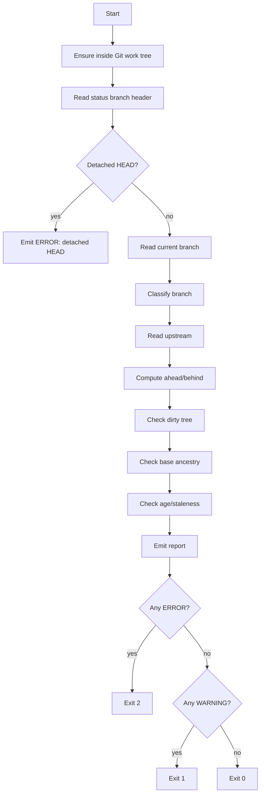

# Part 117 — Build a Branch Policy Checker

Di bagian ini kita membangun **branch policy checker** kecil dari nol.

Targetnya bukan membuat wrapper Git yang pintar-pintar sendiri. Targetnya adalah membuat tool yang bisa membaca state repository secara eksplisit, lalu mengevaluasi invariant yang biasanya hanya tertulis longgar di engineering handbook:

- branch feature harus punya upstream yang jelas;
- branch tidak boleh terlalu jauh tertinggal dari base;
- branch release tidak boleh menerima commit yang belum melewati boundary yang benar;
- branch hotfix harus berasal dari release branch/tag yang benar;
- branch main tidak boleh dirty saat release;
- tag release tidak boleh dibuat dari commit yang tidak reachable dari protected line;
- branch temporary tidak boleh dipakai sebagai dependency jangka panjang;
- branch lokal yang akan di-push harus memakai safety check terhadap remote tracking ref.

Mental model-nya sederhana:

> Git policy checker bukan menggantikan branch protection atau server-side hook. Ia memberi **pre-flight signal** sebelum developer, CI, atau release engineer melakukan operasi berisiko.

Kalau server-side hook adalah pagar, policy checker adalah instrumen cockpit.

---

## 1. Problem: Git Policy Biasanya Terlambat Diketahui

Banyak aturan Git baru terlihat saat sudah terlambat:

```bash
$ git push origin feature/foo
! [rejected] feature/foo -> feature/foo (non-fast-forward)
```

Atau lebih buruk:

```bash
$ git tag -a v2.8.0 -m "release v2.8.0"
$ git push origin v2.8.0
```

Ternyata tag dibuat dari commit lokal yang belum lewat CI final.

Atau:

```bash
$ git checkout release/2.7
$ git merge feature/new-schema
```

Ternyata branch release menerima feature commit, bukan minimal hotfix.

Git tidak salah. Git hanya mengeksekusi perintah graph/ref/object. Yang hilang adalah layer yang memahami **aturan organisasi**.

---

## 2. What We Will Build

Kita akan membuat tool bernama `git-branch-policy`.

Versi awal akan:

1. membaca current branch;
2. membaca upstream branch;
3. membaca semua local branch;
4. membaca semua remote-tracking branch;
5. menghitung ahead/behind terhadap upstream;
6. memvalidasi naming convention;
7. memvalidasi branch class;
8. memvalidasi branch base menggunakan `merge-base`;
9. mendeteksi branch terlalu tua;
10. mendeteksi local branch tanpa upstream;
11. mendeteksi dirty working tree;
12. mendeteksi detached HEAD;
13. mengeluarkan report human-readable dan JSON-like output;
14. mengembalikan exit code berbeda untuk warning/error.

Kita tidak akan mengakses `.git` langsung untuk semua hal. Untuk tooling production, lebih aman memakai command Git plumbing/porcelain yang stabil untuk scripting seperti:

- `git rev-parse`
- `git status --porcelain=v2 --branch`
- `git for-each-ref`
- `git merge-base`
- `git rev-list --left-right --count`
- `git show-ref`
- `git cat-file -e`

`git for-each-ref` memang didesain untuk iterasi refs dengan format yang bisa dikontrol, sehingga cocok untuk tooling repository state. Dokumentasi `git rev-parse` juga menjelaskan extended revision syntax yang dipakai Git untuk resolve nama ref/object.

---

## 3. Policy Boundary: Local Checker vs Real Enforcement

Jangan salah menaruh tanggung jawab.

| Layer | Cocok Untuk | Tidak Cocok Untuk |
|---|---|---|
| local checker | fast feedback, pre-flight, onboarding, CI diagnostics | enforcement final |
| client hook | feedback sebelum commit/push | security boundary, karena bisa dibypass |
| CI check | repeatable validation, evidence | mencegah push langsung ke bare Git tanpa protection |
| server hook | hard repository invariant | complex review UX |
| branch protection | protected line governance | local developer education |
| release verifier | artifact/source evidence | branch hygiene harian |

Branch policy checker yang kita bangun akan dipakai di:

```bash
# local
$ git branch-policy check

# pre-push hook
$ git branch-policy pre-push

# CI
$ git branch-policy ci --base origin/main

# release preflight
$ git branch-policy release --candidate v2.8.0-rc.2
```

Namun final enforcement untuk protected branch tetap harus berada di remote host, server hook, branch protection, ruleset, atau merge queue.

---

## 4. Policy Model

Kita mulai dari konfigurasi sederhana.

```yaml
protectedBranches:
  - main
  - master
  - release/*

branchClasses:
  feature:
    pattern: "feature/[a-z0-9._-]+"
    requiredBase: "origin/main"
    requireUpstream: true
    maxBehindBase: 100
    maxAgeDays: 30

  bugfix:
    pattern: "bugfix/[a-z0-9._-]+"
    requiredBase: "origin/main"
    requireUpstream: true
    maxBehindBase: 100
    maxAgeDays: 30

  hotfix:
    pattern: "hotfix/[0-9]+\\.[0-9]+/[a-z0-9._-]+"
    requiredBasePattern: "origin/release/*"
    requireUpstream: true
    maxBehindBase: 30
    maxAgeDays: 14

  release:
    pattern: "release/[0-9]+\\.[0-9]+"
    requiredBase: "origin/main"
    requireUpstream: true
    maxBehindBase: 0
    maxAgeDays: 120
```

Kita bisa mulai tanpa YAML parser dengan hardcoded config di Java. Tujuannya memahami engine dulu.

---

## 5. State Diagram



Exit code convention:

| Exit Code | Meaning |
|---:|---|
| `0` | policy pass |
| `1` | warnings only |
| `2` | hard policy error |
| `3` | tool/internal error |

---

## 6. Project Layout

Buat single-file Java dulu agar mudah dijalankan:

```text
branch-policy-checker/
  src/
    BranchPolicyChecker.java
  README.md
```

Compile:

```bash
javac src/BranchPolicyChecker.java
```

Run dari dalam repository Git:

```bash
java -cp src BranchPolicyChecker
```

---

## 7. Command Runner

Tool Git automation harus memperlakukan command sebagai boundary yang bisa gagal.

Kita butuh wrapper:

- capture stdout;
- capture stderr;
- capture exit code;
- timeout sederhana tidak kita implementasikan dulu;
- jangan pakai shell string interpolation;
- gunakan `ProcessBuilder` dengan argumen list.

```java
import java.io.*;
import java.nio.charset.StandardCharsets;
import java.time.*;
import java.util.*;
import java.util.regex.*;

public class BranchPolicyChecker {

    enum Severity { INFO, WARNING, ERROR }

    record CmdResult(int exitCode, String stdout, String stderr) {}

    record Finding(Severity severity, String code, String message, String evidence) {}

    static CmdResult git(String... args) throws IOException, InterruptedException {
        List<String> command = new ArrayList<>();
        command.add("git");
        command.addAll(Arrays.asList(args));

        Process p = new ProcessBuilder(command)
                .redirectErrorStream(false)
                .start();

        String out;
        String err;
        try (InputStream stdout = p.getInputStream(); InputStream stderr = p.getErrorStream()) {
            out = new String(stdout.readAllBytes(), StandardCharsets.UTF_8);
            err = new String(stderr.readAllBytes(), StandardCharsets.UTF_8);
        }

        int exit = p.waitFor();
        return new CmdResult(exit, out.stripTrailing(), err.stripTrailing());
    }

    static String gitOut(String... args) throws Exception {
        CmdResult r = git(args);
        if (r.exitCode != 0) {
            throw new IllegalStateException("git " + String.join(" ", args) + " failed: " + r.stderr);
        }
        return r.stdout;
    }

    public static void main(String[] args) {
        try {
            Checker checker = new Checker();
            Report report = checker.run();
            report.printHuman();
            System.exit(report.exitCode());
        } catch (Exception e) {
            System.err.println("TOOL ERROR: " + e.getMessage());
            System.exit(3);
        }
    }
}
```

---

## 8. Repository State Model

Tambahkan model data.

```java
record BranchStatus(
        String currentBranch,
        boolean detached,
        String upstream,
        int ahead,
        int behind,
        boolean dirty
) {}

record RefInfo(
        String refName,
        String shortName,
        String objectName,
        String committerDateIso
) {}

record BranchClass(
        String name,
        Pattern pattern,
        String requiredBase,
        Pattern requiredBasePattern,
        boolean requireUpstream,
        int maxBehindBase,
        int maxAgeDays
) {}
```

Kita sengaja memisahkan `requiredBase` dan `requiredBasePattern`.

- `feature/foo` biasanya harus berbasis `origin/main`.
- `hotfix/2.7/fix-null` harus berbasis `origin/release/2.7`, tetapi versinya dinamis.

---

## 9. Membaca Current Branch dan Dirty State

Gunakan:

```bash
git status --porcelain=v2 --branch
```

Contoh output:

```text
# branch.oid 3a4f...
# branch.head feature/foo
# branch.upstream origin/feature/foo
# branch.ab +2 -1
1 .M N... 100644 100644 100644 ... src/App.java
```

Parser sederhana:

```java
static BranchStatus readBranchStatus() throws Exception {
    String out = gitOut("status", "--porcelain=v2", "--branch");

    String head = null;
    String upstream = null;
    int ahead = 0;
    int behind = 0;
    boolean dirty = false;

    for (String line : out.split("\\R")) {
        if (line.startsWith("# branch.head ")) {
            head = line.substring("# branch.head ".length()).trim();
        } else if (line.startsWith("# branch.upstream ")) {
            upstream = line.substring("# branch.upstream ".length()).trim();
        } else if (line.startsWith("# branch.ab ")) {
            String ab = line.substring("# branch.ab ".length()).trim();
            Matcher m = Pattern.compile("\\+(\\d+) -([0-9]+)").matcher(ab);
            if (m.matches()) {
                ahead = Integer.parseInt(m.group(1));
                behind = Integer.parseInt(m.group(2));
            }
        } else if (!line.startsWith("#") && !line.isBlank()) {
            dirty = true;
        }
    }

    boolean detached = "(detached)".equals(head);
    return new BranchStatus(head, detached, upstream, ahead, behind, dirty);
}
```

Policy implication:

- dirty tree tidak selalu error;
- untuk release operation, dirty tree harus error;
- untuk normal branch check, dirty tree bisa warning;
- detached HEAD harus error untuk branch workflow, tapi bisa valid untuk CI checkout.

---

## 10. Membaca Ref dengan `for-each-ref`

Kita perlu data branch lokal dan remote.

```bash
git for-each-ref \
  --format='%(refname)%00%(refname:short)%00%(objectname)%00%(committerdate:iso8601-strict)' \
  refs/heads refs/remotes
```

NUL separator (`%00`) membuat parsing lebih aman daripada split spasi.

```java
static List<RefInfo> readRefs() throws Exception {
    String format = "%(refname)%00%(refname:short)%00%(objectname)%00%(committerdate:iso8601-strict)";
    String out = gitOut("for-each-ref", "--format=" + format, "refs/heads", "refs/remotes");

    List<RefInfo> refs = new ArrayList<>();
    if (out.isBlank()) return refs;

    for (String line : out.split("\\R")) {
        String[] p = line.split("\\u0000", -1);
        if (p.length >= 4) {
            refs.add(new RefInfo(p[0], p[1], p[2], p[3]));
        }
    }
    return refs;
}
```

Why not read `.git/refs` manually?

Karena refs bisa loose, packed, symbolic, atau reftable tergantung setup. Tooling yang membaca `.git/refs` langsung mudah rusak pada repository modern.

---

## 11. Branch Classifier

Kita encode config minimal:

```java
static List<BranchClass> defaultClasses() {
    return List.of(
        new BranchClass(
            "mainline",
            Pattern.compile("^(main|master)$"),
            null,
            null,
            false,
            0,
            3650
        ),
        new BranchClass(
            "feature",
            Pattern.compile("^feature/[a-z0-9._-]+$"),
            "origin/main",
            null,
            true,
            100,
            30
        ),
        new BranchClass(
            "bugfix",
            Pattern.compile("^bugfix/[a-z0-9._-]+$"),
            "origin/main",
            null,
            true,
            100,
            30
        ),
        new BranchClass(
            "hotfix",
            Pattern.compile("^hotfix/([0-9]+\\.[0-9]+)/[a-z0-9._-]+$"),
            null,
            Pattern.compile("^origin/release/[0-9]+\\.[0-9]+$"),
            true,
            30,
            14
        ),
        new BranchClass(
            "release",
            Pattern.compile("^release/[0-9]+\\.[0-9]+$"),
            "origin/main",
            null,
            true,
            0,
            120
        )
    );
}

static Optional<BranchClass> classify(String branch) {
    return defaultClasses().stream()
            .filter(c -> c.pattern().matcher(branch).matches())
            .findFirst();
}
```

Rule penting:

> Branch name bukan hanya estetika. Branch name memberi tool kemampuan mengklasifikasikan intent.

Tanpa class, branch bernama `foo` tidak memberi tahu apakah ia feature, hotfix, release, experiment, atau incident branch.

---

## 12. Computing Ahead/Behind Against Any Base

Untuk upstream, `status --branch` sudah memberi ahead/behind. Untuk required base lain, gunakan:

```bash
git rev-list --left-right --count origin/main...HEAD
```

Output:

```text
12 3
```

Artinya:

- kiri: commit yang reachable dari `origin/main`, tidak dari `HEAD`;
- kanan: commit yang reachable dari `HEAD`, tidak dari `origin/main`.

Dalam konteks branch feature:

- behind base terlalu tinggi = branch lama;
- ahead base terlalu tinggi = branch terlalu besar;
- both high = branch drift dan scope risk.

```java
record Divergence(int leftOnly, int rightOnly) {}

static Divergence divergence(String left, String right) throws Exception {
    CmdResult r = git("rev-list", "--left-right", "--count", left + "..." + right);
    if (r.exitCode != 0) {
        throw new IllegalStateException("Cannot compute divergence " + left + "..." + right + ": " + r.stderr);
    }
    String[] p = r.stdout.trim().split("\\s+");
    return new Divergence(Integer.parseInt(p[0]), Integer.parseInt(p[1]));
}
```

---

## 13. Base Ancestry Check

Kadang kita tidak hanya peduli ahead/behind. Kita ingin tahu apakah branch benar-benar memiliki base yang sesuai.

Untuk feature branch:

```bash
git merge-base --is-ancestor origin/main HEAD
```

Jika exit code `0`, `origin/main` adalah ancestor dari `HEAD`. Tapi dalam praktik feature branch sering dibuat dari commit lama di `origin/main`; itu tetap ancestor jika branch sudah tidak direbase setelah `origin/main` bergerak? Tidak selalu. Kalau `origin/main` sekarang sudah lebih maju, current `origin/main` bukan ancestor dari feature branch.

Lebih tepat untuk policy freshness:

```bash
git merge-base origin/main HEAD
```

Lalu bandingkan merge-base terhadap `origin/main` tip:

```bash
git rev-list --count <merge-base>..origin/main
```

Kalau terlalu besar, branch tertinggal jauh dari base.

```java
static String mergeBase(String a, String b) throws Exception {
    return gitOut("merge-base", a, b).trim();
}

static int commitCount(String range) throws Exception {
    String out = gitOut("rev-list", "--count", range).trim();
    return Integer.parseInt(out);
}
```

Policy:

```java
static void checkBaseFreshness(
        Report report,
        String branch,
        BranchClass klass,
        String requiredBase
) throws Exception {
    String base = mergeBase(requiredBase, "HEAD");
    int behindBaseTip = commitCount(base + ".." + requiredBase);

    if (behindBaseTip > klass.maxBehindBase()) {
        report.add(Severity.WARNING,
            "BRANCH_BASE_STALE",
            "Branch is too far behind required base " + requiredBase,
            "merge-base=" + base + ", behindBaseTip=" + behindBaseTip + ", max=" + klass.maxBehindBase());
    } else {
        report.add(Severity.INFO,
            "BRANCH_BASE_OK",
            "Branch base freshness is within threshold",
            "requiredBase=" + requiredBase + ", behindBaseTip=" + behindBaseTip);
    }
}
```

---

## 14. Branch Age Check

Branch age bisa diukur beberapa cara:

1. commit date terbaru di branch;
2. author date terbaru di branch;
3. reflog branch creation date;
4. first unique commit date;
5. PR creation date dari hosting platform.

Untuk Git-only checker, kita pakai approximation:

```bash
git log -1 --format=%cI HEAD
```

Ini mengukur last committer date, bukan umur branch sebenarnya. Untuk policy lokal cukup sebagai warning.

```java
static long daysSinceLastCommit(String rev) throws Exception {
    String iso = gitOut("log", "-1", "--format=%cI", rev).trim();
    OffsetDateTime t = OffsetDateTime.parse(iso);
    return Duration.between(t, OffsetDateTime.now()).toDays();
}
```

Rule:

```java
static void checkAge(Report report, BranchClass klass) throws Exception {
    long days = daysSinceLastCommit("HEAD");
    if (days > klass.maxAgeDays()) {
        report.add(Severity.WARNING,
            "BRANCH_STALE",
            "Branch has not received commits recently",
            "daysSinceLastCommit=" + days + ", max=" + klass.maxAgeDays());
    }
}
```

Caveat:

> Branch age dari Git local tidak sempurna. Untuk governance final, gabungkan dengan PR metadata dari GitHub/GitLab/Bitbucket.

---

## 15. Report Engine

```java
static class Report {
    final List<Finding> findings = new ArrayList<>();

    void add(Severity severity, String code, String message, String evidence) {
        findings.add(new Finding(severity, code, message, evidence));
    }

    int exitCode() {
        boolean hasError = findings.stream().anyMatch(f -> f.severity() == Severity.ERROR);
        boolean hasWarning = findings.stream().anyMatch(f -> f.severity() == Severity.WARNING);
        if (hasError) return 2;
        if (hasWarning) return 1;
        return 0;
    }

    void printHuman() {
        System.out.println("Branch Policy Report");
        System.out.println("====================");
        for (Finding f : findings) {
            System.out.printf("[%s] %s - %s%n", f.severity(), f.code(), f.message());
            if (f.evidence() != null && !f.evidence().isBlank()) {
                System.out.println("  evidence: " + f.evidence());
            }
        }
        System.out.println();
        System.out.println("result: " + switch (exitCode()) {
            case 0 -> "PASS";
            case 1 -> "WARNING";
            case 2 -> "FAIL";
            default -> "TOOL_ERROR";
        });
    }
}
```

---

## 16. Checker Core

```java
static class Checker {
    Report run() throws Exception {
        Report report = new Report();

        ensureInsideWorkTree(report);

        BranchStatus status = readBranchStatus();
        checkDetached(report, status);
        checkDirty(report, status);

        if (status.detached()) {
            return report;
        }

        String branch = status.currentBranch();
        Optional<BranchClass> klassOpt = classify(branch);

        if (klassOpt.isEmpty()) {
            report.add(Severity.ERROR,
                    "BRANCH_NAME_UNCLASSIFIED",
                    "Branch name does not match any known policy class",
                    "branch=" + branch);
            return report;
        }

        BranchClass klass = klassOpt.get();
        report.add(Severity.INFO,
                "BRANCH_CLASS",
                "Branch classified as " + klass.name(),
                "branch=" + branch + ", pattern=" + klass.pattern().pattern());

        checkUpstream(report, status, klass);
        checkAge(report, klass);
        checkRequiredBase(report, branch, klass);
        checkAheadBehind(report, status, klass);

        return report;
    }

    void ensureInsideWorkTree(Report report) throws Exception {
        String out = gitOut("rev-parse", "--is-inside-work-tree").trim();
        if (!"true".equals(out)) {
            report.add(Severity.ERROR, "NOT_WORK_TREE", "Not inside a Git work tree", out);
        }
    }

    void checkDetached(Report report, BranchStatus status) {
        if (status.detached()) {
            report.add(Severity.ERROR,
                    "DETACHED_HEAD",
                    "Current checkout is detached HEAD; branch policy cannot infer branch intent",
                    "head=" + status.currentBranch());
        }
    }

    void checkDirty(Report report, BranchStatus status) {
        if (status.dirty()) {
            report.add(Severity.WARNING,
                    "DIRTY_WORK_TREE",
                    "Working tree or index has uncommitted changes",
                    "git status --porcelain=v2 is non-empty");
        }
    }

    void checkUpstream(Report report, BranchStatus status, BranchClass klass) {
        if (klass.requireUpstream() && (status.upstream() == null || status.upstream().isBlank())) {
            report.add(Severity.ERROR,
                    "MISSING_UPSTREAM",
                    "Branch class requires an upstream branch",
                    "branch=" + status.currentBranch());
        } else if (status.upstream() != null) {
            report.add(Severity.INFO,
                    "UPSTREAM_FOUND",
                    "Branch has upstream",
                    "upstream=" + status.upstream());
        }
    }

    void checkAheadBehind(Report report, BranchStatus status, BranchClass klass) {
        if (status.behind() > klass.maxBehindBase()) {
            report.add(Severity.WARNING,
                    "UPSTREAM_BEHIND_TOO_FAR",
                    "Branch is behind upstream beyond threshold",
                    "behind=" + status.behind() + ", max=" + klass.maxBehindBase());
        }
        if (status.ahead() > 50) {
            report.add(Severity.WARNING,
                    "BRANCH_TOO_LARGE",
                    "Branch has many local commits ahead of upstream",
                    "ahead=" + status.ahead());
        }
    }

    void checkRequiredBase(Report report, String branch, BranchClass klass) throws Exception {
        if (klass.requiredBase() != null) {
            ensureRefExists(report, klass.requiredBase());
            checkBaseFreshness(report, branch, klass, klass.requiredBase());
            return;
        }

        if (klass.requiredBasePattern() != null) {
            String inferred = inferHotfixBase(branch);
            if (inferred == null || !klass.requiredBasePattern().matcher(inferred).matches()) {
                report.add(Severity.ERROR,
                        "BASE_NOT_INFERRED",
                        "Cannot infer required base for branch",
                        "branch=" + branch + ", requiredBasePattern=" + klass.requiredBasePattern().pattern());
                return;
            }
            ensureRefExists(report, inferred);
            checkBaseFreshness(report, branch, klass, inferred);
        }
    }

    String inferHotfixBase(String branch) {
        Matcher m = Pattern.compile("^hotfix/([0-9]+\\.[0-9]+)/[a-z0-9._-]+$").matcher(branch);
        if (!m.matches()) return null;
        return "origin/release/" + m.group(1);
    }

    void ensureRefExists(Report report, String ref) throws Exception {
        CmdResult r = git("rev-parse", "--verify", ref + "^{commit}");
        if (r.exitCode != 0) {
            report.add(Severity.ERROR,
                    "REQUIRED_REF_MISSING",
                    "Required base ref does not resolve to a commit",
                    "ref=" + ref + ", stderr=" + r.stderr());
        }
    }
}
```

Catatan: `git rev-parse --verify <rev>^{commit}` membantu memastikan nama yang diberikan resolve ke commit object, bukan blob/tree/tag yang tidak sesuai untuk branch base.

---

## 17. Full Single-File Version

Gabungkan semua record/static method di satu class `BranchPolicyChecker`. Untuk ringkas, struktur akhirnya:

```text
BranchPolicyChecker
  enum Severity
  record CmdResult
  record Finding
  record BranchStatus
  record RefInfo
  record BranchClass
  record Divergence
  class Report
  class Checker
  static git(...)
  static gitOut(...)
  static readBranchStatus()
  static readRefs()
  static defaultClasses()
  static classify(...)
  static divergence(...)
  static mergeBase(...)
  static commitCount(...)
  static daysSinceLastCommit(...)
  main(...)
```

Compile/run:

```bash
javac src/BranchPolicyChecker.java
java -cp src BranchPolicyChecker
```

Example output:

```text
Branch Policy Report
====================
[INFO] BRANCH_CLASS - Branch classified as feature
  evidence: branch=feature/add-payment-audit, pattern=^feature/[a-z0-9._-]+$
[INFO] UPSTREAM_FOUND - Branch has upstream
  evidence: upstream=origin/feature/add-payment-audit
[WARNING] DIRTY_WORK_TREE - Working tree or index has uncommitted changes
  evidence: git status --porcelain=v2 is non-empty
[INFO] BRANCH_BASE_OK - Branch base freshness is within threshold
  evidence: requiredBase=origin/main, behindBaseTip=8

result: WARNING
```

---

## 18. Extending the Policy Engine

### 18.1 Protected Branch Mutation Check

Forbid local operations from protected branch except read-only:

```java
static boolean isProtectedBranch(String branch) {
    return branch.equals("main")
        || branch.equals("master")
        || branch.matches("^release/[0-9]+\\.[0-9]+$");
}
```

Policy:

- dirty protected branch = error;
- local commits on protected branch = error;
- direct push to protected branch = error unless CI/release bot.

```java
if (isProtectedBranch(status.currentBranch()) && status.ahead() > 0) {
    report.add(Severity.ERROR,
        "PROTECTED_BRANCH_LOCAL_COMMITS",
        "Protected branch has local commits; use PR or release procedure",
        "branch=" + status.currentBranch() + ", ahead=" + status.ahead());
}
```

### 18.2 Sensitive Path Detection

Use Git diff against base:

```bash
git diff --name-only origin/main...HEAD --
```

Then check path classes:

```java
static String sensitivity(String path) {
    if (path.startsWith("infra/") || path.startsWith("terraform/")) return "infra";
    if (path.startsWith("auth/") || path.contains("permission")) return "authz";
    if (path.startsWith("migrations/")) return "db-migration";
    if (path.endsWith(".github/workflows/deploy.yml")) return "ci-cd";
    return "normal";
}
```

Policy:

| Path Class | Required Control |
|---|---|
| auth/authz | CODEOWNER/security approval |
| migration | migration rollback note |
| infra | platform review |
| CI/CD | DevSecOps review |
| secrets/config | secret scan + owner review |

Local checker cannot know approvals unless integrated with hosting API. But it can emit required review classes.

---

## 19. CI Mode

CI mode differs from developer mode.

Developer checkout may be:

- local branch;
- dirty;
- has upstream;
- has user config.

CI checkout may be:

- detached HEAD;
- synthetic merge commit;
- shallow clone;
- no upstream;
- partial tags;
- PR ref.

Policy checker should have modes:

```bash
java BranchPolicyChecker --mode=local
java BranchPolicyChecker --mode=ci --base=origin/main --head=HEAD
java BranchPolicyChecker --mode=release --tag=v2.8.0
```

Do not force local branch assumptions on CI.

CI-specific checks:

- `HEAD` resolves to commit;
- base ref exists;
- merge-base can be computed;
- clone is not too shallow for required operation;
- required tags are fetched;
- working tree clean after build generation step;
- no uncommitted generated artifacts.

Detect shallow clone:

```bash
git rev-parse --is-shallow-repository
```

If release notes require previous tag ancestry, shallow clone should fail or fetch more history.

---

## 20. Pre-Push Mode

A pre-push hook receives remote name, remote URL, and lines on stdin.

Format from Git hook:

```text
<local-ref> <local-oid> <remote-ref> <remote-oid>
```

Policy examples:

- forbid direct push to `refs/heads/main`;
- require `--force-with-lease` cannot be detected perfectly from hook, but can reject non-fast-forward update by comparing remote oid ancestry;
- forbid moving release tags;
- forbid pushing branch names outside allowed pattern;
- forbid pushing very large blobs.

Server side remains stronger because client hook can be bypassed.

---

## 21. Server-Side Translation

The same policy engine can run in server hook mode if input is ref updates.

Pre-receive stdin:

```text
<old-value> <new-value> <ref-name>
```

Policy mapping:

| Local Checker Concept | Server Hook Equivalent |
|---|---|
| current branch | incoming ref name |
| HEAD | new value |
| upstream | protected base config |
| dirty tree | not relevant |
| branch age | commit date/ref metadata |
| base freshness | merge-base between protected base and new value |
| tag immutability | old value not zero + tag ref |

This is powerful: write policy once, adapt input layer.

---

## 22. Failure Modes

### 22.1 Tool Reads Stale Remote Tracking Ref

`origin/main` is local knowledge, not guaranteed current remote state.

Mitigation:

```bash
git fetch --prune origin +refs/heads/main:refs/remotes/origin/main
```

Run fetch in CI/preflight before policy check.

### 22.2 Shallow Clone Hides Merge Base

Symptom:

```text
fatal: Not a valid commit name origin/main
fatal: no merge base
```

Mitigation:

```bash
git fetch --deepen=100 origin main
# or for release job
git fetch --unshallow --tags
```

### 22.3 Squash Merge Breaks Branch Ancestry Assumption

After squash merge, feature branch commits are not ancestors of main. Do not use raw ancestry alone to decide whether PR has landed. Use hosting metadata or patch-id/range-diff if needed.

### 22.4 Branch Name Carries Wrong Intent

A branch named `hotfix/2.7/foo` can still contain feature commits. Naming is only initial classification. Use diff/path/release boundary checks to validate intent.

### 22.5 Local Checker Becomes Annoying

Too many false positives = developers bypass the tool.

Policy should classify:

- hard errors only for dangerous cases;
- warnings for hygiene;
- info for context;
- explain remediation command.

---

## 23. Remediation Suggestions

A good checker should not only say “wrong”. It should say what to do.

Examples:

| Finding | Suggested Fix |
|---|---|
| `MISSING_UPSTREAM` | `git push -u origin HEAD` if branch is meant to be published |
| `BRANCH_BASE_STALE` | `git fetch origin && git rebase origin/main` for private branch, or merge main if team policy uses merge |
| `DETACHED_HEAD` | `git switch -c feature/name` if work should become branch |
| `DIRTY_WORK_TREE` | commit/stash/reset intentionally before release check |
| `REQUIRED_REF_MISSING` | fetch required remote branch/tag |
| `PROTECTED_BRANCH_LOCAL_COMMITS` | create feature branch and open PR |

Tool output should include remediation text as another field:

```java
record Finding(
    Severity severity,
    String code,
    String message,
    String evidence,
    String remediation
) {}
```

---

## 24. Production Hardening

Before using in a real organization, add:

1. config file parser;
2. JSON output;
3. stable machine-readable finding codes;
4. allowlist with expiration date;
5. path-sensitive policies;
6. hosting API integration for PR metadata;
7. test fixtures using temporary repositories;
8. server-hook input mode;
9. CI mode with explicit base/head;
10. documentation for each finding.

Example JSON output:

```json
{
  "result": "warning",
  "branch": "feature/add-payment-audit",
  "findings": [
    {
      "severity": "WARNING",
      "code": "BRANCH_BASE_STALE",
      "message": "Branch is too far behind required base",
      "evidence": "behindBaseTip=47,max=30",
      "remediation": "Fetch and rebase or merge the required base according to team policy."
    }
  ]
}
```

---

## 25. Lab Exercise

Implement these extensions:

1. Add `--json` output.
2. Add `--base=<ref>` override.
3. Add sensitive path detection via `git diff --name-only <base>...HEAD`.
4. Add branch size warning if `HEAD` has more than 20 unique commits over base.
5. Add protected-branch direct-work error.
6. Add shallow-repository warning.
7. Add remediation field per finding.
8. Add test script that creates temporary Git repositories and validates exit codes.

Test fixture idea:

```bash
#!/usr/bin/env bash
set -euo pipefail

rm -rf /tmp/policy-lab
mkdir /tmp/policy-lab
cd /tmp/policy-lab

git init -b main
git config user.email a@example.com
git config user.name A

echo root > README.md
git add README.md
git commit -m "initial commit"

git checkout -b feature/bad_name_is_not_this

echo change > app.txt
git add app.txt
git commit -m "add app"

java -cp /path/to/classes BranchPolicyChecker || true
```

---

## 26. Engineering Invariants

A mature branch policy checker encodes these invariants:

1. **Intent must be visible.** Branch name and base should reveal work type.
2. **Integration risk must be bounded.** Branch age, size, and drift should not grow invisibly.
3. **Protected lines are not personal workspaces.** Main/release branches need controlled mutation.
4. **Release branches accept narrower changes than main.** Hotfix/backport policy must be stricter than feature policy.
5. **Local knowledge is stale by default.** Fetch before making remote-state decisions.
6. **CI mode is not local mode.** Detached HEAD and shallow checkout must be handled intentionally.
7. **Policy without remediation creates bypass culture.** Every finding should explain the next safe move.

---

## 27. What This Tool Does Not Prove

It does not prove:

- code is correct;
- PR was approved;
- commit author is trusted;
- release artifact was built from this commit;
- tag is immutable on remote;
- no secrets exist in old history;
- remote branch has not moved since last fetch;
- merge queue has validated the final integration result.

Those require CI, hosting API, protected refs, server hooks, secret scanning, release verifier, and artifact provenance.

That is why Part 118 builds the next layer: **release integrity verifier**.

---

## References

- Git documentation: `git rev-parse`, revision/object verification.
- Git documentation: `git for-each-ref`, iterating repository refs.
- Git documentation: `git merge-base`, best common ancestor for integration checks.
- Git documentation: `git rev-list`, commit graph traversal and counting.
- Git documentation: `git status --porcelain`, machine-readable repository state.
