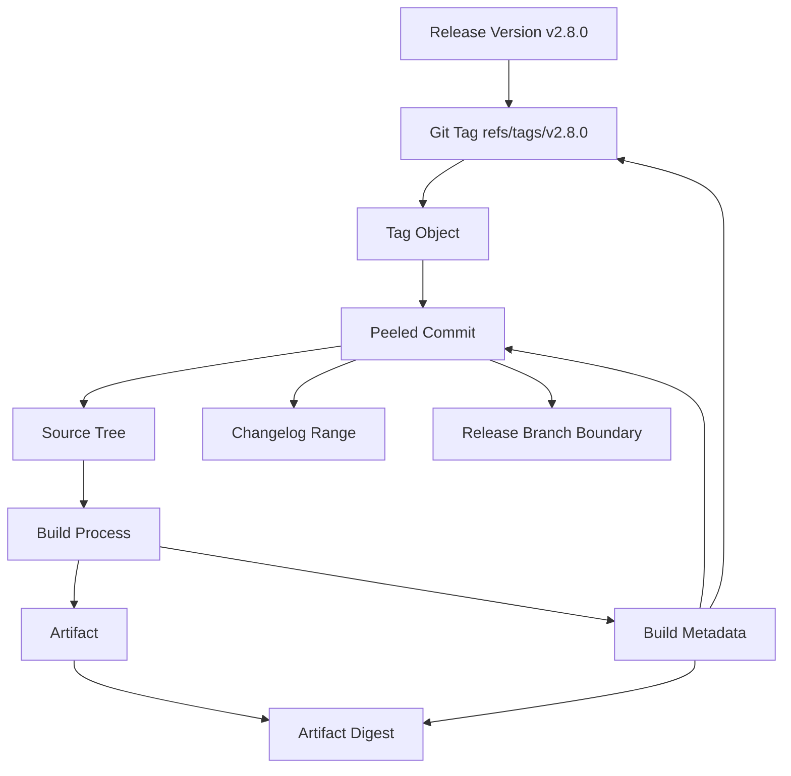
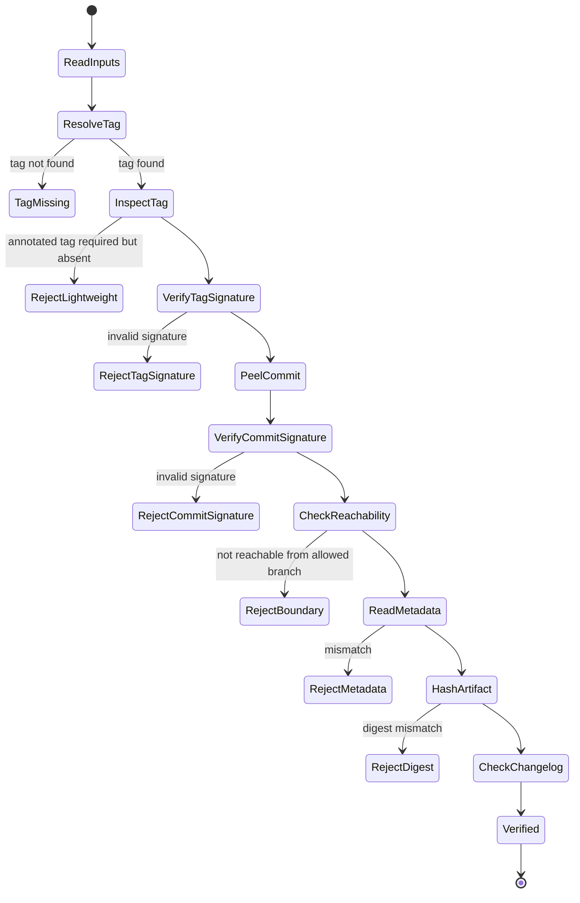

# Part 118 — Build a Release Integrity Verifier

Di bagian ini kita membangun **release integrity verifier** kecil dari nol.

Tool ini menjawab pertanyaan yang sering dianggap sederhana tetapi sebenarnya sangat menentukan keamanan release:

> Apakah release artifact ini benar-benar berasal dari commit/tag/source boundary yang kita klaim?

Pada sistem kecil, jawaban sering hanya:

```text
Ya, karena namanya v2.8.0.
```

Pada sistem serius, itu tidak cukup.

Release identity harus mengikat:

- tag;
- tag object;
- peeled commit;
- branch/release boundary;
- commit signature jika dipakai;
- tag signature jika dipakai;
- build metadata;
- artifact digest;
- source archive digest;
- changelog range;
- CI run identity;
- environment/deployment record.

Git memberi object identity yang kuat, tetapi Git tidak otomatis membuktikan artifact build Anda benar-benar berasal dari tag tersebut. Itu pekerjaan release process dan verifier.

---

## 1. Release Integrity Model

Release integrity adalah relasi antar identity.



Verifier harus mengecek relasi, bukan hanya satu node.

---

## 2. What We Will Build

Tool bernama `release-verify`.

Input:

```bash
java ReleaseIntegrityVerifier \
  --version v2.8.0 \
  --tag refs/tags/v2.8.0 \
  --base-tag v2.7.3 \
  --artifact build/app.jar \
  --metadata build/release-metadata.properties \
  --release-branch origin/release/2.8
```

Metadata file example:

```properties
version=v2.8.0
git.tag=v2.8.0
git.commit=5e1c8f7b7b8a1ef3fdc1e8a7a64e41c3e50d7a91
git.tree=21bc0efad1e43a3e2394e0f935f9952788c97a7b
git.dirty=false
artifact.sha256=3b7d5a...
build.id=github-actions:123456789
build.source=ci
```

Verifier checks:

1. tag exists;
2. tag peels to commit;
3. tag is annotated if policy requires it;
4. tag signature verifies if policy requires it;
5. commit signature verifies if policy requires it;
6. commit is reachable from allowed release branch or mainline;
7. commit is not ahead of release branch unexpectedly;
8. metadata commit equals peeled tag commit;
9. metadata version equals expected version;
10. dirty flag is false;
11. artifact SHA-256 equals metadata;
12. changelog range can be computed from base tag to release tag;
13. source tree id matches metadata if available;
14. release tag is not lightweight if annotated tag required.

---

## 3. Why Tag Name Alone Is Not Enough

`v2.8.0` is a ref name. A ref can move unless your hosting/policy prevents it.

A tag name can point to:

- a lightweight tag directly naming a commit;
- an annotated tag object;
- a signed annotated tag object;
- accidentally, a tag object pointing to a non-commit object;
- a moved tag after bad retagging.

Git can verify tag object signatures using `git verify-tag`, and commit signatures using `git verify-commit`. But signature validity only says the object was signed by a key that verifies locally. It does not prove CI built the artifact from that object.

So verifier must combine Git checks with artifact metadata checks.

---

## 4. Release Verification State Machine



---

## 5. Project Layout

```text
release-integrity-verifier/
  src/
    ReleaseIntegrityVerifier.java
  sample/
    release-metadata.properties
  README.md
```

Compile:

```bash
javac src/ReleaseIntegrityVerifier.java
```

Run:

```bash
java -cp src ReleaseIntegrityVerifier \
  --version v2.8.0 \
  --tag v2.8.0 \
  --base-tag v2.7.3 \
  --artifact build/app.jar \
  --metadata build/release-metadata.properties \
  --release-branch origin/release/2.8
```

---

## 6. Core Types

```java
import java.io.*;
import java.nio.charset.StandardCharsets;
import java.nio.file.*;
import java.security.MessageDigest;
import java.util.*;

public class ReleaseIntegrityVerifier {

    enum Severity { INFO, WARNING, ERROR }

    record CmdResult(int exitCode, String stdout, String stderr) {}

    record Finding(Severity severity, String code, String message, String evidence) {}

    record Options(
            String version,
            String tag,
            String baseTag,
            Path artifact,
            Path metadata,
            String releaseBranch,
            boolean requireAnnotatedTag,
            boolean requireSignedTag,
            boolean requireSignedCommit
    ) {}

    record GitTagInfo(
            String tagName,
            String rawObject,
            String peeledCommit,
            boolean annotated
    ) {}

    static class Report {
        final List<Finding> findings = new ArrayList<>();

        void add(Severity severity, String code, String message, String evidence) {
            findings.add(new Finding(severity, code, message, evidence));
        }

        int exitCode() {
            boolean error = findings.stream().anyMatch(f -> f.severity() == Severity.ERROR);
            boolean warning = findings.stream().anyMatch(f -> f.severity() == Severity.WARNING);
            if (error) return 2;
            if (warning) return 1;
            return 0;
        }

        void printHuman() {
            System.out.println("Release Integrity Report");
            System.out.println("========================");
            for (Finding f : findings) {
                System.out.printf("[%s] %s - %s%n", f.severity(), f.code(), f.message());
                if (f.evidence() != null && !f.evidence().isBlank()) {
                    System.out.println("  evidence: " + f.evidence());
                }
            }
            System.out.println();
            System.out.println("result: " + switch (exitCode()) {
                case 0 -> "VERIFIED";
                case 1 -> "VERIFIED_WITH_WARNINGS";
                case 2 -> "FAILED";
                default -> "TOOL_ERROR";
            });
        }
    }
}
```

---

## 7. Command Runner

```java
static CmdResult git(String... args) throws IOException, InterruptedException {
    List<String> command = new ArrayList<>();
    command.add("git");
    command.addAll(Arrays.asList(args));

    Process p = new ProcessBuilder(command).start();
    String out;
    String err;
    try (InputStream stdout = p.getInputStream(); InputStream stderr = p.getErrorStream()) {
        out = new String(stdout.readAllBytes(), StandardCharsets.UTF_8);
        err = new String(stderr.readAllBytes(), StandardCharsets.UTF_8);
    }
    int exit = p.waitFor();
    return new CmdResult(exit, out.stripTrailing(), err.stripTrailing());
}

static String gitOut(String... args) throws Exception {
    CmdResult r = git(args);
    if (r.exitCode() != 0) {
        throw new IllegalStateException("git " + String.join(" ", args) + " failed: " + r.stderr());
    }
    return r.stdout();
}
```

---

## 8. Parse CLI Options

Minimal parser:

```java
static Options parseOptions(String[] args) {
    Map<String, String> m = new HashMap<>();
    Set<String> flags = new HashSet<>();

    for (String arg : args) {
        if (arg.startsWith("--") && arg.contains("=")) {
            int i = arg.indexOf('=');
            m.put(arg.substring(2, i), arg.substring(i + 1));
        } else if (arg.startsWith("--")) {
            flags.add(arg.substring(2));
        }
    }

    String version = required(m, "version");
    String tag = m.getOrDefault("tag", version);
    String baseTag = required(m, "base-tag");
    Path artifact = Paths.get(required(m, "artifact"));
    Path metadata = Paths.get(required(m, "metadata"));
    String releaseBranch = required(m, "release-branch");

    return new Options(
        version,
        tag,
        baseTag,
        artifact,
        metadata,
        releaseBranch,
        !flags.contains("allow-lightweight-tag"),
        flags.contains("require-signed-tag"),
        flags.contains("require-signed-commit")
    );
}

static String required(Map<String, String> m, String key) {
    String v = m.get(key);
    if (v == null || v.isBlank()) throw new IllegalArgumentException("Missing --" + key + "=<value>");
    return v;
}
```

Example:

```bash
java ReleaseIntegrityVerifier \
  --version=v2.8.0 \
  --tag=v2.8.0 \
  --base-tag=v2.7.3 \
  --artifact=build/app.jar \
  --metadata=build/release-metadata.properties \
  --release-branch=origin/release/2.8 \
  --require-signed-tag \
  --require-signed-commit
```

---

## 9. Resolve Tag and Peeled Commit

We need distinguish annotated vs lightweight tag.

Useful commands:

```bash
git rev-parse --verify v2.8.0
git cat-file -t v2.8.0
git rev-parse --verify v2.8.0^{commit}
```

- `git cat-file -t v2.8.0` returns `tag` for annotated tag.
- It returns `commit` for lightweight tag pointing directly to commit.
- `v2.8.0^{commit}` peels tag to commit.

```java
static GitTagInfo inspectTag(String tag) throws Exception {
    String raw = gitOut("rev-parse", "--verify", tag).trim();
    String type = gitOut("cat-file", "-t", tag).trim();
    String commit = gitOut("rev-parse", "--verify", tag + "^{commit}").trim();
    boolean annotated = "tag".equals(type);
    return new GitTagInfo(tag, raw, commit, annotated);
}
```

Policy:

```java
static void checkTagShape(Report report, Options options, GitTagInfo tag) {
    if (options.requireAnnotatedTag() && !tag.annotated()) {
        report.add(Severity.ERROR,
                "LIGHTWEIGHT_TAG_FOR_RELEASE",
                "Release policy requires annotated tag, but tag is lightweight",
                "tag=" + tag.tagName() + ", rawObject=" + tag.rawObject());
    } else {
        report.add(Severity.INFO,
                "TAG_SHAPE_OK",
                "Tag shape accepted",
                "tag=" + tag.tagName() + ", annotated=" + tag.annotated());
    }
}
```

Why annotated tag?

Because annotated tag is an object with metadata and optional signature. Lightweight tag is just a ref naming an object.

---

## 10. Verify Tag Signature

```bash
git verify-tag v2.8.0
```

```java
static void verifyTagSignature(Report report, Options options) throws Exception {
    if (!options.requireSignedTag()) {
        report.add(Severity.INFO,
                "TAG_SIGNATURE_NOT_REQUIRED",
                "Signed tag verification is not required by current policy",
                "tag=" + options.tag());
        return;
    }

    CmdResult r = git("verify-tag", options.tag());
    if (r.exitCode() != 0) {
        report.add(Severity.ERROR,
                "TAG_SIGNATURE_INVALID",
                "Tag signature verification failed",
                r.stderr());
    } else {
        report.add(Severity.INFO,
                "TAG_SIGNATURE_VALID",
                "Tag signature verified",
                options.tag());
    }
}
```

Caveat:

- local GPG/SSH trust config matters;
- valid signature does not mean signer was authorized by your organization;
- authorization must be checked against key registry or hosting verification policy.

---

## 11. Verify Commit Signature

```bash
git verify-commit <commit>
```

```java
static void verifyCommitSignature(Report report, Options options, String commit) throws Exception {
    if (!options.requireSignedCommit()) {
        report.add(Severity.INFO,
                "COMMIT_SIGNATURE_NOT_REQUIRED",
                "Signed commit verification is not required by current policy",
                "commit=" + commit);
        return;
    }

    CmdResult r = git("verify-commit", commit);
    if (r.exitCode() != 0) {
        report.add(Severity.ERROR,
                "COMMIT_SIGNATURE_INVALID",
                "Commit signature verification failed",
                r.stderr());
    } else {
        report.add(Severity.INFO,
                "COMMIT_SIGNATURE_VALID",
                "Commit signature verified",
                "commit=" + commit);
    }
}
```

In many teams, signed release tag is stricter than requiring every commit signed. In regulated or high-trust repositories, both may be required.

---

## 12. Check Release Branch Boundary

A release tag should usually be reachable from the allowed release branch or protected mainline.

```bash
git merge-base --is-ancestor <tag-commit> origin/release/2.8
```

If exit `0`, tag commit is ancestor of the release branch tip.

```java
static void checkReachabilityFromReleaseBranch(
        Report report,
        String commit,
        String releaseBranch
) throws Exception {
    CmdResult ref = git("rev-parse", "--verify", releaseBranch + "^{commit}");
    if (ref.exitCode() != 0) {
        report.add(Severity.ERROR,
                "RELEASE_BRANCH_MISSING",
                "Release branch does not resolve to commit",
                "releaseBranch=" + releaseBranch + ", stderr=" + ref.stderr());
        return;
    }

    CmdResult r = git("merge-base", "--is-ancestor", commit, releaseBranch);
    if (r.exitCode() == 0) {
        report.add(Severity.INFO,
                "COMMIT_REACHABLE_FROM_RELEASE_BRANCH",
                "Tag commit is reachable from release branch",
                "commit=" + commit + ", releaseBranch=" + releaseBranch);
    } else {
        report.add(Severity.ERROR,
                "COMMIT_NOT_ON_RELEASE_BRANCH",
                "Tag commit is not reachable from configured release branch",
                "commit=" + commit + ", releaseBranch=" + releaseBranch);
    }
}
```

This does not guarantee branch tip equals tag commit. That depends on policy.

Two common policies:

| Policy | Check |
|---|---|
| tag may be behind branch tip | commit is ancestor of release branch |
| tag must equal branch tip | commit equals `rev-parse releaseBranch` |

For release candidate, ancestor may be okay. For final release, exact tip may be required.

---

## 13. Read Release Metadata

```java
static Properties readMetadata(Path path) throws IOException {
    Properties props = new Properties();
    try (InputStream in = Files.newInputStream(path)) {
        props.load(in);
    }
    return props;
}
```

Validate required keys:

```java
static void checkMetadata(
        Report report,
        Options options,
        GitTagInfo tag,
        Properties p
) throws Exception {
    requireProp(report, p, "version");
    requireProp(report, p, "git.tag");
    requireProp(report, p, "git.commit");
    requireProp(report, p, "git.dirty");
    requireProp(report, p, "artifact.sha256");

    equalsProp(report, p, "version", options.version(), "VERSION_MISMATCH");
    equalsProp(report, p, "git.tag", options.tag(), "TAG_METADATA_MISMATCH");
    equalsProp(report, p, "git.commit", tag.peeledCommit(), "COMMIT_METADATA_MISMATCH");
    equalsProp(report, p, "git.dirty", "false", "DIRTY_BUILD_METADATA");

    String tree = p.getProperty("git.tree");
    if (tree != null && !tree.isBlank()) {
        String actualTree = gitOut("show", "-s", "--format=%T", tag.peeledCommit()).trim();
        if (!actualTree.equals(tree)) {
            report.add(Severity.ERROR,
                    "TREE_METADATA_MISMATCH",
                    "Metadata tree id does not match release commit tree",
                    "metadata=" + tree + ", actual=" + actualTree);
        } else {
            report.add(Severity.INFO,
                    "TREE_METADATA_OK",
                    "Metadata tree id matches release commit tree",
                    tree);
        }
    }
}

static void requireProp(Report report, Properties p, String key) {
    if (p.getProperty(key) == null || p.getProperty(key).isBlank()) {
        report.add(Severity.ERROR,
                "METADATA_KEY_MISSING",
                "Required release metadata key is missing",
                "key=" + key);
    }
}

static void equalsProp(Report report, Properties p, String key, String expected, String code) {
    String actual = p.getProperty(key);
    if (!Objects.equals(actual, expected)) {
        report.add(Severity.ERROR,
                code,
                "Release metadata value mismatch for " + key,
                "expected=" + expected + ", actual=" + actual);
    } else {
        report.add(Severity.INFO,
                "METADATA_" + key.toUpperCase(Locale.ROOT).replace('.', '_') + "_OK",
                "Release metadata value matches for " + key,
                actual);
    }
}
```

---

## 14. Verify Artifact Digest

Compute SHA-256:

```java
static String sha256(Path path) throws Exception {
    MessageDigest digest = MessageDigest.getInstance("SHA-256");
    try (InputStream in = Files.newInputStream(path)) {
        byte[] buf = new byte[8192];
        int n;
        while ((n = in.read(buf)) != -1) {
            digest.update(buf, 0, n);
        }
    }
    byte[] bytes = digest.digest();
    StringBuilder sb = new StringBuilder();
    for (byte b : bytes) sb.append(String.format("%02x", b));
    return sb.toString();
}
```

Check:

```java
static void checkArtifactDigest(Report report, Options options, Properties p) throws Exception {
    if (!Files.exists(options.artifact())) {
        report.add(Severity.ERROR,
                "ARTIFACT_MISSING",
                "Artifact file does not exist",
                options.artifact().toString());
        return;
    }

    String expected = p.getProperty("artifact.sha256");
    String actual = sha256(options.artifact());

    if (!Objects.equals(expected, actual)) {
        report.add(Severity.ERROR,
                "ARTIFACT_DIGEST_MISMATCH",
                "Artifact SHA-256 does not match release metadata",
                "expected=" + expected + ", actual=" + actual);
    } else {
        report.add(Severity.INFO,
                "ARTIFACT_DIGEST_OK",
                "Artifact SHA-256 matches release metadata",
                actual);
    }
}
```

This proves only that metadata matches artifact. It does not prove metadata itself came from trusted CI unless metadata is signed or provenance is independently verified.

---

## 15. Check Changelog Range

A release should have explicit boundary.

```bash
git rev-parse --verify v2.7.3^{commit}
git rev-parse --verify v2.8.0^{commit}
git log --oneline v2.7.3..v2.8.0
```

```java
static void checkChangelogRange(Report report, Options options, GitTagInfo tag) throws Exception {
    CmdResult base = git("rev-parse", "--verify", options.baseTag() + "^{commit}");
    if (base.exitCode() != 0) {
        report.add(Severity.ERROR,
                "BASE_TAG_INVALID",
                "Base tag does not resolve to commit",
                "baseTag=" + options.baseTag() + ", stderr=" + base.stderr());
        return;
    }

    String baseCommit = base.stdout().trim();
    String count = gitOut("rev-list", "--count", baseCommit + ".." + tag.peeledCommit()).trim();

    report.add(Severity.INFO,
            "CHANGELOG_RANGE_OK",
            "Changelog range can be computed",
            options.baseTag() + ".." + options.tag() + ", commits=" + count);

    if ("0".equals(count)) {
        report.add(Severity.WARNING,
                "EMPTY_CHANGELOG_RANGE",
                "Release contains zero commits after base tag",
                "range=" + options.baseTag() + ".." + options.tag());
    }
}
```

For merge-commit workflow, release notes may use first-parent:

```bash
git log --first-parent --oneline v2.7.3..v2.8.0
```

For squash workflow, release notes often rely on PR metadata rather than commit series.

---

## 16. Verify Working Tree Is Clean During Local Build

If verifier runs immediately after local build, check dirty tree:

```java
static void checkWorkingTreeClean(Report report) throws Exception {
    String out = gitOut("status", "--porcelain=v2");
    if (!out.isBlank()) {
        report.add(Severity.WARNING,
                "LOCAL_WORK_TREE_DIRTY",
                "Current working tree is dirty; local verification may not represent committed source exactly",
                "git status --porcelain=v2 non-empty");
    } else {
        report.add(Severity.INFO,
                "LOCAL_WORK_TREE_CLEAN",
                "Current working tree is clean",
                "");
    }
}
```

In CI, you usually care more about metadata `git.dirty=false` captured at build time.

---

## 17. Main Verifier

```java
static class Verifier {
    Report run(Options options) throws Exception {
        Report report = new Report();

        ensureRepository(report);

        GitTagInfo tag = inspectTag(options.tag());
        report.add(Severity.INFO,
                "TAG_RESOLVED",
                "Release tag resolved",
                "tag=" + tag.tagName()
                    + ", rawObject=" + tag.rawObject()
                    + ", peeledCommit=" + tag.peeledCommit()
                    + ", annotated=" + tag.annotated());

        checkTagShape(report, options, tag);
        verifyTagSignature(report, options);
        verifyCommitSignature(report, options, tag.peeledCommit());
        checkReachabilityFromReleaseBranch(report, tag.peeledCommit(), options.releaseBranch());

        Properties metadata = readMetadata(options.metadata());
        checkMetadata(report, options, tag, metadata);
        checkArtifactDigest(report, options, metadata);
        checkChangelogRange(report, options, tag);
        checkWorkingTreeClean(report);

        return report;
    }

    void ensureRepository(Report report) throws Exception {
        String inside = gitOut("rev-parse", "--is-inside-work-tree").trim();
        if (!"true".equals(inside)) {
            report.add(Severity.ERROR,
                    "NOT_GIT_WORK_TREE",
                    "Verifier must run inside a Git work tree",
                    inside);
        }
    }
}
```

`main`:

```java
public static void main(String[] args) {
    try {
        Options options = parseOptions(args);
        Report report = new Verifier().run(options);
        report.printHuman();
        System.exit(report.exitCode());
    } catch (Exception e) {
        System.err.println("TOOL ERROR: " + e.getMessage());
        System.exit(3);
    }
}
```

---

## 18. Sample Output

```text
Release Integrity Report
========================
[INFO] TAG_RESOLVED - Release tag resolved
  evidence: tag=v2.8.0, rawObject=7f8c..., peeledCommit=5e1c..., annotated=true
[INFO] TAG_SHAPE_OK - Tag shape accepted
  evidence: tag=v2.8.0, annotated=true
[INFO] TAG_SIGNATURE_VALID - Tag signature verified
  evidence: v2.8.0
[INFO] COMMIT_SIGNATURE_VALID - Commit signature verified
  evidence: commit=5e1c...
[INFO] COMMIT_REACHABLE_FROM_RELEASE_BRANCH - Tag commit is reachable from release branch
  evidence: commit=5e1c..., releaseBranch=origin/release/2.8
[INFO] METADATA_VERSION_OK - Release metadata value matches for version
  evidence: v2.8.0
[INFO] METADATA_GIT_COMMIT_OK - Release metadata value matches for git.commit
  evidence: 5e1c...
[INFO] ARTIFACT_DIGEST_OK - Artifact SHA-256 matches release metadata
  evidence: 3b7d5a...
[INFO] CHANGELOG_RANGE_OK - Changelog range can be computed
  evidence: v2.7.3..v2.8.0, commits=42

result: VERIFIED
```

Failure example:

```text
[ERROR] COMMIT_METADATA_MISMATCH - Release metadata value mismatch for git.commit
  evidence: expected=5e1c..., actual=91ab...
[ERROR] ARTIFACT_DIGEST_MISMATCH - Artifact SHA-256 does not match release metadata
  evidence: expected=3b7d..., actual=aa10...

result: FAILED
```

That means either:

- artifact is not the artifact described by metadata;
- metadata was generated for a different build;
- artifact was modified after build;
- verifier input is wrong;
- release process has been compromised.

Do not “fix” by editing metadata. Rebuild or re-establish provenance.

---

## 19. Generating Release Metadata Correctly

Build should generate metadata from Git state before artifact finalization.

Example shell:

```bash
#!/usr/bin/env bash
set -euo pipefail

VERSION="$1"
TAG="$2"
OUT="build/release-metadata.properties"
ARTIFACT="build/app.jar"

COMMIT="$(git rev-parse --verify "$TAG^{commit}")"
TREE="$(git show -s --format=%T "$COMMIT")"
DIRTY="false"

if [[ -n "$(git status --porcelain=v2)" ]]; then
  DIRTY="true"
fi

SHA256="$(sha256sum "$ARTIFACT" | awk '{print $1}')"

cat > "$OUT" <<META
version=$VERSION
git.tag=$TAG
git.commit=$COMMIT
git.tree=$TREE
git.dirty=$DIRTY
artifact.sha256=$SHA256
build.id=${BUILD_ID:-local}
build.source=${CI:-local}
META
```

In production, generate after artifact exists and sign metadata/provenance.

---

## 20. Stronger Metadata: Include Source Archive Digest

Git tree id identifies source tree, but consumers may receive source archive.

Generate source archive:

```bash
git archive --format=tar --prefix="app-v2.8.0/" v2.8.0 | gzip -n > app-v2.8.0-src.tar.gz
sha256sum app-v2.8.0-src.tar.gz
```

Caveat: archive digest can vary depending on compression flags, timestamp normalization, and archive format. If you publish source archive digest, standardize archive generation.

Metadata keys:

```properties
source.archive.sha256=...
source.archive.format=tar.gz
source.archive.command=git archive --format=tar --prefix=app-v2.8.0/ v2.8.0 | gzip -n
```

Verifier can check source archive digest the same way as artifact digest.

---

## 21. Stronger Policy: Exact Release Branch Tip

For final release, require tag commit equals release branch tip:

```java
static void checkTagEqualsReleaseBranchTip(
        Report report,
        String commit,
        String releaseBranch
) throws Exception {
    String tip = gitOut("rev-parse", "--verify", releaseBranch + "^{commit}").trim();
    if (!commit.equals(tip)) {
        report.add(Severity.ERROR,
                "TAG_NOT_AT_RELEASE_BRANCH_TIP",
                "Final release tag must point to release branch tip",
                "tagCommit=" + commit + ", branchTip=" + tip);
    } else {
        report.add(Severity.INFO,
                "TAG_AT_RELEASE_BRANCH_TIP",
                "Release tag points to release branch tip",
                commit);
    }
}
```

For RC releases, allow tag behind branch tip if newer fixes are still being tested.

---

## 22. Stronger Policy: No Unexpected Commits Since RC

For final release after RC:

```bash
git log --oneline v2.8.0-rc.3..v2.8.0
```

Policy:

- allowed: version metadata commit, changelog update;
- allowed: specific approved blockers;
- forbidden: feature commits;
- forbidden: config/deployment changes without release approval.

This requires commit classification or PR metadata.

---

## 23. Stronger Policy: Sensitive Path Scan in Release Range

```bash
git diff --name-only v2.7.3..v2.8.0 -- auth/ infra/ migrations/ .github/workflows/
```

Verifier can report:

```text
Sensitive release range changes:
- auth/policy/PermissionEvaluator.java        authz
- migrations/V2026070701__case_index.sql      db-migration
- .github/workflows/deploy.yml                ci-cd
```

Policy:

- authz changes require security approval evidence;
- migration changes require rollback/roll-forward note;
- CI/CD changes require platform approval;
- config/secrets changes require secret scan and deployment review.

Git can identify paths. Approval evidence usually comes from PR platform or release ticket.

---

## 24. Stronger Policy: Verify Tag Has Not Moved Since Evidence Capture

Store release evidence:

```properties
release.tag=v2.8.0
release.tag.object=7f8c...
release.commit=5e1c...
```

Verifier later checks:

```bash
git rev-parse v2.8.0
git rev-parse v2.8.0^{commit}
```

If either differs from evidence, tag moved.

This is why release evidence should record both:

- raw tag object id;
- peeled commit id.

Annotated tag may keep tag object id distinct from commit id. Lightweight tag raw object equals commit id.

---

## 25. Stronger Policy: Verify Build Metadata Is Signed

A simple `.properties` file can be edited. For production:

- generate provenance statement;
- sign it;
- store with artifact;
- verify signature and identity;
- bind artifact digest and source commit.

Minimal detached signature pattern:

```bash
gpg --detach-sign --armor build/release-metadata.properties

gpg --verify build/release-metadata.properties.asc build/release-metadata.properties
```

Java can call `gpg --verify`, but a serious implementation should use a defined provenance format and trusted key/certificate policy.

---

## 26. CI Integration

Release job should run:

```bash
git fetch --tags --force origin

git rev-parse --verify "$TAG^{commit}"
git verify-tag "$TAG"

./gradlew clean build
./scripts/write-release-metadata.sh "$VERSION" "$TAG"

java -cp tools ReleaseIntegrityVerifier \
  --version="$VERSION" \
  --tag="$TAG" \
  --base-tag="$BASE_TAG" \
  --artifact="build/libs/app.jar" \
  --metadata="build/release-metadata.properties" \
  --release-branch="origin/release/2.8" \
  --require-signed-tag
```

Important checkout requirements:

- tags must be fetched;
- history must include base tag and release tag;
- shallow clone must be deep enough or disabled;
- release branch ref must exist;
- build must not mutate source without recording it;
- generated artifact metadata must be archived with artifact.

---

## 27. Failure Modes

### 27.1 Tag Exists Locally But Not Remotely

Local verification can pass on a tag not pushed to origin.

Mitigation:

```bash
git ls-remote --tags origin v2.8.0
```

Add remote verification if verifier is allowed network access.

### 27.2 Local Tag Is Stale After Remote Retag

Mitigation:

```bash
git fetch --tags --force origin
```

But forced tag fetch can overwrite local tags. CI should use clean clone or explicit fetch policy.

### 27.3 Shallow Clone Cannot Compute Changelog

Symptom:

```text
fatal: Invalid revision range v2.7.3..v2.8.0
```

Mitigation:

```bash
git fetch --unshallow --tags
```

or fetch exact tags and ancestry depth.

### 27.4 Signature Valid But Signer Unauthorized

Cryptographic verification is not authorization.

You need a trusted signer registry:

```yaml
releaseSigners:
  - alice@example.com
  - release-bot@example.com
```

And map signature identity to that registry.

### 27.5 Artifact Digest Matches Metadata, But Metadata Is Untrusted

Digest check only binds artifact to metadata. It does not prove metadata is authentic.

Mitigation:

- signed metadata;
- CI-issued provenance;
- immutable artifact store;
- build system identity;
- protected release job.

### 27.6 Release Branch Contains Unreviewed Commits

Reachability does not prove review.

Mitigation:

- merge queue;
- branch protection;
- PR approval evidence;
- CI status evidence;
- release ticket approval.

---

## 28. Evidence Bundle

A strong release evidence bundle contains:

```text
release-evidence-v2.8.0/
  release-metadata.properties
  release-metadata.properties.sig
  artifact.sha256
  source-archive.sha256
  git-tag.txt
  git-tag-verify.txt
  git-commit-verify.txt
  git-log-v2.7.3..v2.8.0.txt
  git-diff-name-status-v2.7.3..v2.8.0.txt
  ci-run.json
  approvals.json
  release-notes.md
```

Verifier can generate part of this bundle:

```bash
git cat-file -p v2.8.0 > evidence/git-tag.txt
git verify-tag -v v2.8.0 > evidence/git-tag-verify.txt 2>&1
git log --oneline --decorate v2.7.3..v2.8.0 > evidence/git-log.txt
git diff --name-status v2.7.3..v2.8.0 > evidence/git-diff-name-status.txt
```

For regulated systems, evidence bundle should be stored immutably with release artifact.

---

## 29. Lab Exercise

Extend the verifier:

1. Add `--json` output.
2. Add `--require-exact-release-branch-tip`.
3. Add source archive digest verification.
4. Add sensitive path report for release range.
5. Add remote tag verification using `git ls-remote`.
6. Add evidence bundle writer.
7. Add policy config file.
8. Add signer allowlist.
9. Add validation that release notes range is non-empty unless explicitly allowed.
10. Add tests using temporary Git repositories.

Temporary test repo script:

```bash
#!/usr/bin/env bash
set -euo pipefail

rm -rf /tmp/release-verify-lab
mkdir /tmp/release-verify-lab
cd /tmp/release-verify-lab

git init -b main
git config user.email a@example.com
git config user.name A

echo root > README.md
git add README.md
git commit -m "initial"
git tag -a v1.0.0 -m "v1.0.0"

echo change > app.txt
git add app.txt
git commit -m "add app"
git checkout -b release/1.1
git tag -a v1.1.0 -m "v1.1.0"

mkdir -p build
echo artifact > build/app.jar
SHA=$(sha256sum build/app.jar | awk '{print $1}')
COMMIT=$(git rev-parse v1.1.0^{commit})
TREE=$(git show -s --format=%T "$COMMIT")

cat > build/release-metadata.properties <<META
version=v1.1.0
git.tag=v1.1.0
git.commit=$COMMIT
git.tree=$TREE
git.dirty=false
artifact.sha256=$SHA
build.id=local-test
build.source=test
META

java -cp /path/to/classes ReleaseIntegrityVerifier \
  --version=v1.1.0 \
  --tag=v1.1.0 \
  --base-tag=v1.0.0 \
  --artifact=build/app.jar \
  --metadata=build/release-metadata.properties \
  --release-branch=release/1.1
```

Then mutate artifact and verify failure:

```bash
echo tamper >> build/app.jar
java -cp /path/to/classes ReleaseIntegrityVerifier ...
# expected: ARTIFACT_DIGEST_MISMATCH
```

---

## 30. Engineering Invariants

A release verifier should encode these invariants:

1. **Version is not identity.** Version string must bind to tag, commit, source, artifact, and evidence.
2. **Tag name is not enough.** Record raw tag object and peeled commit.
3. **Signature is not authorization.** Verify cryptography and signer policy separately.
4. **Artifact digest is required.** Release artifact must be immutable by content hash.
5. **Metadata must be trusted.** Unsigned metadata is only a hint.
6. **Changelog boundary must be explicit.** Release notes should come from known previous/current refs.
7. **CI checkout must be sufficient.** Shallow/no-tags checkout can invalidate release verification.
8. **Reachability is necessary but not sufficient.** It proves graph relation, not review approval.
9. **Evidence must outlive the repository state.** Store immutable evidence with artifact/release record.

---

## 31. Closing Phase 14

Parts 111–118 built small implementations of Git concepts:

| Part | Built Artifact | Mental Model Reinforced |
|---:|---|---|
| 111 | mini object store | Git as content-addressed database |
| 112 | mini commit walker | DAG, reachability, merge-base |
| 113 | mini diff engine | diff as algorithmic signal |
| 114 | mini merge engine | three-way merge and conflict |
| 115 | mini reflog recovery tool | local recovery via ref movement history |
| 116 | repo health analyzer | repository risk as measurable state |
| 117 | branch policy checker | workflow invariant as code |
| 118 | release integrity verifier | release provenance and artifact binding |

At this point, Git is no longer just a command-line tool. It is a programmable database plus workflow substrate.

The next phase moves from implementation labs into case studies and operational playbooks.

---

## References

- Git documentation: `git verify-tag`, validating tag object signatures.
- Git documentation: `git verify-commit`, validating signed commit objects.
- Git documentation: `git rev-parse`, resolving and verifying revisions.
- Git documentation: `git cat-file`, inspecting object type/content.
- Git documentation: `git merge-base`, ancestry and release boundary checks.
- Git documentation: `git rev-list`, release range and changelog traversal.
- Git documentation: `git tag`, annotated/lightweight tag behavior and retagging caveats.
