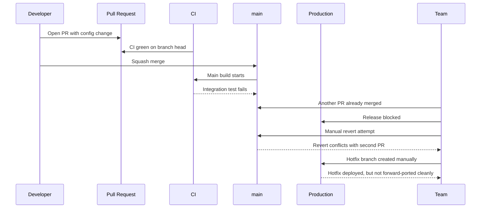
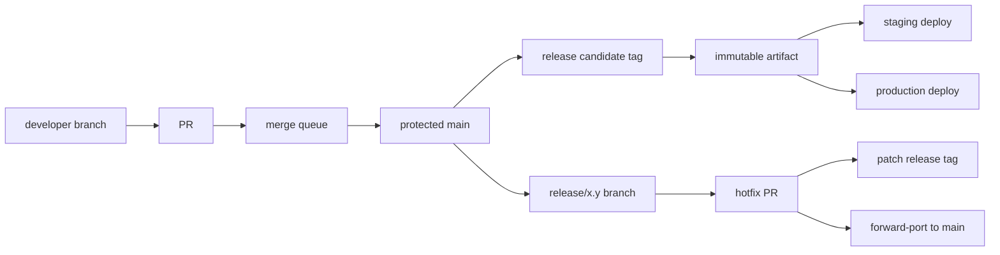
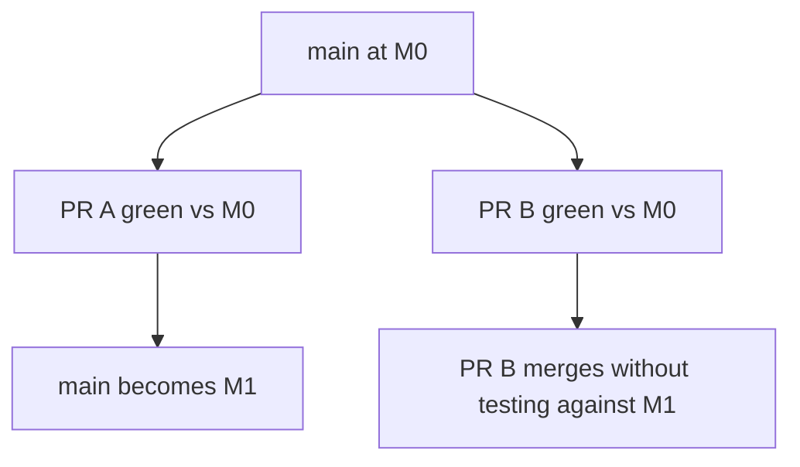
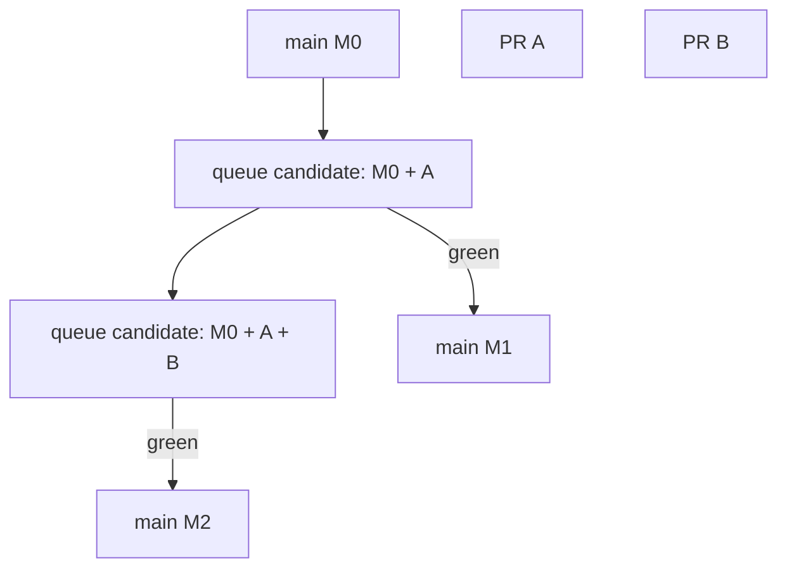
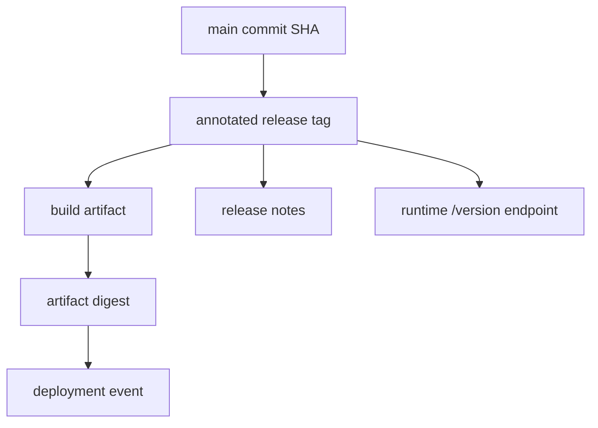
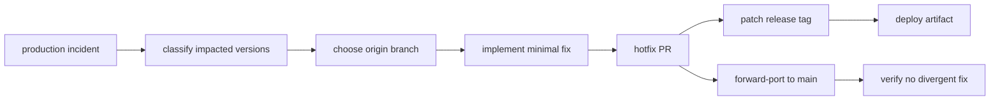

# Case Study: Small Team to Platform Team

> Tujuan part ini bukan memberi template workflow yang bisa ditempel mentah-mentah. Tujuannya adalah memperlihatkan bagaimana workflow Git berevolusi ketika organisasi berubah: dari 5 engineer yang bisa saling teriak di meja yang sama, menjadi platform team yang memelihara kontrak lintas service, shared libraries, deployment pipeline, security gates, release branches, dan audit evidence.

Small team biasanya tidak gagal karena kurang aturan. Mereka gagal ketika aturan lama tetap dipakai setelah sistem menjadi lebih besar. Workflow Git yang terasa ringan di awal bisa berubah menjadi sumber incident saat jumlah branch, reviewer, environment, service, dan release line meningkat.

Kita akan membangun case study fiktif tapi realistis: tim produk kecil bernama **Atlas** berkembang menjadi platform team yang melayani banyak stream engineering.

---

## 1. Initial State: Small Team yang Masih Cepat

Kondisi awal:

| Dimensi | Kondisi |
|---|---|
| Engineer | 5 orang |
| Repository | 1 repository aplikasi utama |
| Deployment | Manual/semi-manual, 1-2 kali per minggu |
| Branch model | `main` + feature branch pendek |
| Review | informal, kadang pair review |
| CI | unit test + build |
| Release | deploy dari `main` terbaru |
| Governance | trust-based |

Workflow mereka kira-kira seperti ini:

```bash
# developer

git checkout main
git pull --ff-only
git checkout -b feature/add-case-priority
# work
git add -p
git commit -m "Add case priority field"
git push -u origin feature/add-case-priority
# open PR
```

Merge policy awal:

```text
small PR + one review + CI green -> squash merge to main
```

Ini bukan workflow buruk. Untuk small team, ini cukup sehat karena:

1. branch lifetime pendek,
2. komunikasi murah,
3. reviewer tahu konteks domain,
4. jumlah release line kecil,
5. rollback biasanya revert sederhana,
6. CI masih cepat.

Masalah belum terlihat karena sistem belum punya tekanan organisasi.

---

## 2. Growth Pressure: Gejala Awal Workflow Mulai Retak

Setelah 12 bulan, Atlas berubah.

| Dimensi | Kondisi Baru |
|---|---|
| Engineer | 35 engineer lintas product squads |
| Repository | aplikasi utama + shared packages + deployment config |
| Deployment | beberapa kali per hari |
| Branch model | feature branches, release branches, emergency hotfix branches |
| Review | wajib, tapi reviewer sering tidak punya konteks penuh |
| CI | unit, integration, contract, security, container build |
| Release | staged rollout, release candidate, hotfix |
| Governance | audit, security review, platform ownership |

Gejala yang muncul:

| Gejala | Penyebab Git/Workflow |
|---|---|
| PR kecil mulai lama merge | reviewer routing tidak jelas |
| Main sering merah | checks tidak merepresentasikan merge result terbaru |
| Hotfix sulit dilacak | squash merge menghilangkan commit identity granular |
| Release notes tidak akurat | release boundary tidak eksplisit |
| Backport sering salah | patch dependency tidak dianalisis |
| Conflict makin sering | branch lifetime naik |
| Owner file tidak jelas | repository tumbuh tanpa ownership boundary |
| Tag release kadang dibuat ulang | release identity belum immutable |
| CI checkout kadang gagal changelog | shallow clone terlalu agresif |
| Engineer takut rebase/force push | protokol rewrite tidak jelas |

Masalah utamanya bukan Git command. Masalahnya adalah **workflow lama tidak punya invariant cukup kuat untuk skala baru**.

---

## 3. Failure Timeline: Incident yang Memaksa Perubahan

Satu incident membuat tim berhenti dan mendesain ulang workflow.

Timeline:



Root causes:

1. PR CI tidak menguji merge result terbaru terhadap `main`.
2. Tidak ada merge queue.
3. Squash merge membuat mapping PR -> original commits hilang di Git history.
4. Hotfix tidak punya manifest.
5. Tidak ada rule bahwa release tag immutable.
6. Tidak ada owner untuk deployment config.
7. Tidak ada documented playbook untuk broken main.

Yang menarik: semua orang merasa sudah “mengikuti proses”. Artinya prosesnya sendiri yang lemah.

---

## 4. Target State: Platform Git Workflow

Tim memutuskan workflow baru tidak boleh hanya “lebih ketat”. Ia harus memberi **safety tanpa memperlambat small changes**.

Target invariants:

| Invariant | Makna |
|---|---|
| `main` harus selalu releasable | minimal: build, unit, integration critical, migration gate green |
| release identity immutable | tag release tidak boleh dipindah |
| production artifact traceable | artifact punya commit SHA, tag, build id, digest |
| sensitive paths punya owner | perubahan auth, infra, migration, CI, security wajib reviewer owner |
| hotfix punya forward-port | tidak boleh fix hanya hidup di release branch |
| branch lifetime dibatasi | semakin lama branch, semakin tinggi integration risk |
| forced update dibatasi | private feature branch boleh dengan lease, protected branch tidak boleh |
| PR diff harus stabil | base drift harus terlihat |
| deployment bukan branch merge | promotion memakai artifact identity, bukan merge antar environment branch |

Target topology:



---

## 5. Phase 1 Migration: Normalize Local Developer Workflow

Sebelum menambah server-side governance, mereka memperbaiki local workflow.

### 5.1 Standard Sync

Mereka melarang `git pull` default yang ambiguity-nya tergantung config personal.

Standard:

```bash
git fetch --prune origin
git switch main
git merge --ff-only origin/main
```

Atau alias:

```ini
[alias]
  sync-main = !git fetch --prune origin && git switch main && git merge --ff-only origin/main
```

Kenapa `--ff-only`?

Karena update `main` lokal dari remote tidak perlu membuat merge commit lokal. Jika tidak bisa fast-forward, berarti local `main` sudah menyimpang dan harus diinvestigasi.

### 5.2 Feature Branch Start Rule

Rule:

```bash
git sync-main
git switch -c feature/<ticket>-<slug>
```

Branch tidak boleh dibuat dari branch arbitrary kecuali memang stacked change.

Validation script:

```bash
base=$(git merge-base HEAD origin/main)
main=$(git rev-parse origin/main)
if [ "$base" != "$main" ]; then
  echo "Branch did not start from current origin/main or is now stale. Rebase or explain stack parent."
  exit 1
fi
```

### 5.3 Force Push Rule

Allowed:

```bash
git push --force-with-lease origin feature/my-branch
```

Forbidden:

```bash
git push --force origin main
git push --force origin release/1.8
```

Policy:

| Branch class | Force update |
|---|---|
| private feature branch | allowed with lease |
| shared feature branch | discouraged; require coordination |
| `main` | forbidden |
| `release/*` | forbidden |
| tags `v*` | forbidden |

---

## 6. Phase 2 Migration: Branch Protection and Merge Queue

Branch protection is introduced for `main`:

Required:

1. PR required before merge.
2. At least 1 approval.
3. CODEOWNER review for sensitive paths.
4. Required status checks.
5. Stale approval dismissed after new commits.
6. Linear history or merge queue policy chosen explicitly.
7. No force push.
8. No delete.
9. Signed release tags required separately.

The most important change: **merge queue**.

Why?

Without queue:



With queue:



The queue changes the invariant from:

```text
PR branch is green
```

to:

```text
candidate integration result is green
```

That is a different guarantee.

---

## 7. Phase 3 Migration: Ownership and Review Routing

The team creates ownership zones.

Example `CODEOWNERS`:

```text
# Security and authorization
/services/authz/**        @platform/security
/services/identity/**     @platform/security

# Database migrations
/db/migrations/**         @platform/data

# CI/CD and deployment
.github/workflows/**      @platform/devex
/deploy/**                @platform/release

# Shared API contracts
/contracts/**             @platform/api-governance

# Frontend platform shell
/apps/web-shell/**        @platform/frontend
```

But CODEOWNERS alone is not enough. They add a rule:

> CODEOWNERS routes review; it does not replace domain judgment.

Review class matrix:

| Change class | Required review |
|---|---|
| UI-only local component | owning squad |
| authn/authz | security/platform owner |
| migration | data owner + service owner |
| deployment config | release/platform owner |
| shared API contract | producer + consumer owner |
| CI workflow | devex/platform owner |
| dependency upgrade | service owner + security if critical |

---

## 8. Phase 4 Migration: Release Identity and Evidence

Before migration, release was “whatever was on main when deployment happened”.

Target release model:



Required release metadata:

```json
{
  "version": "1.12.0",
  "gitCommit": "9f3a...",
  "gitTag": "v1.12.0",
  "buildId": "ci-78231",
  "artifactDigest": "sha256:...",
  "builtAt": "2026-07-07T09:14:00Z",
  "dirty": false
}
```

Release verification script:

```bash
set -euo pipefail

version="$1"
tag="v$version"

git fetch --tags --force-with-lease origin

git rev-parse --verify "$tag^{tag}" >/dev/null
commit=$(git rev-parse "$tag^{commit}")

echo "release tag: $tag"
echo "release commit: $commit"

git verify-tag "$tag"

git merge-base --is-ancestor "$commit" origin/main || {
  echo "release commit is not reachable from origin/main"
  exit 1
}
```

Important decision:

> Patch release tags are never moved. If a release tag is wrong and publicly consumed, create a new patch version.

---

## 9. Phase 5 Migration: Hotfix and Backport Discipline

Old hotfix:

```text
create branch from prod-ish state -> patch -> deploy -> forget
```

New hotfix:



Hotfix manifest:

```yaml
incident: INC-2026-0712
issue: AUTHZ-8432
originBranch: release/1.12
originCommit: 3d8b71a
patchCommits:
  - a91d2fc
releaseTag: v1.12.3
forwardPort:
  branch: main
  commit: c7e1a02
verification:
  - unit-authz
  - contract-permission-v2
  - migration-not-required
approvers:
  - security-owner
  - release-manager
```

The invariant:

```text
Every hotfix must either already exist in main or have an explicit forward-port record.
```

---

## 10. Phase 6 Migration: CI Profiles by Git Context

They stop using one checkout setting for everything.

| Job type | Checkout requirement |
|---|---|
| fast PR unit test | shallow may be okay |
| PR affected-project detection | needs merge base |
| release notes | needs tags and previous release range |
| release build | full enough to verify tag and commit |
| security audit | needs relevant history range |
| monorepo impact analysis | needs changed paths and base commit |

Example CI preflight:

```bash
set -euo pipefail

required_ref="origin/main"

git rev-parse --verify HEAD^{commit}
git rev-parse --verify "$required_ref^{commit}"

git merge-base HEAD "$required_ref" >/dev/null || {
  echo "Cannot compute merge base. Fetch more history."
  exit 1
}

if git rev-parse --is-shallow-repository | grep -q true; then
  echo "Repository is shallow; release/changelog jobs must unshallow."
fi
```

---

## 11. Phase 7 Migration: From Personal Knowledge to Handbook

The platform team writes Git standards as executable guidance.

Handbook sections:

1. branch naming,
2. commit message rules,
3. PR size guidance,
4. merge method policy,
5. force push protocol,
6. release branch lifecycle,
7. tag immutability,
8. hotfix/backport playbook,
9. broken main incident response,
10. secret leak response,
11. checkout profiles for CI,
12. large file policy,
13. submodule policy,
14. exception process.

Good handbook entry shape:

```md
## Rule: Release tags are immutable

### Why
Release tags bind source identity to artifact identity. Moving them breaks reproducibility and downstream trust.

### Required
- Use annotated tag for public release.
- Sign tag for production release.
- Protect `v*` tags on remote.
- Never force-push replacement release tag.

### Exception
If tag was created locally and never pushed/consumed, delete and recreate locally before publishing.

### Incident response
If public tag is wrong, create a new patch version and publish correction note.
```

---

## 12. Migration Order: Jangan Big Bang

Bad rollout:

```text
enable all protections + merge queue + CODEOWNERS + signing + new branching model in one week
```

Better rollout:

| Phase | Change | Reason |
|---|---|---|
| 1 | document current workflow | expose implicit rules |
| 2 | add local aliases/scripts | low-friction safety |
| 3 | protect `main` minimally | stop destructive mutation |
| 4 | define ownership | improve review routing |
| 5 | require critical CI checks | make green meaningful |
| 6 | introduce merge queue | remove integration race |
| 7 | standardize release tags | fix release identity |
| 8 | automate hotfix/backport manifest | reduce production drift |
| 9 | add policy-as-code | make invariants executable |

Migration should reduce surprise. If engineers feel Git became arbitrary bureaucracy, adoption will fail.

---

## 13. Metrics After Migration

Useful metrics:

| Metric | Why it matters |
|---|---|
| median branch age | integration risk |
| PR queue time | process friction |
| main red duration | trunk health |
| revert rate | quality/risk signal |
| hotfix forward-port lag | branch drift risk |
| release tag corrections | release identity failure |
| forced update count | rewrite risk |
| stale PR count | hidden integration debt |
| CODEOWNER review latency | ownership bottleneck |
| CI flake rate | trust in merge gate |

Avoid weaponized metrics:

| Bad metric use | Why bad |
|---|---|
| commits per engineer | rewards noise |
| lines changed | punishes simplification |
| PR count as productivity | ignores complexity |
| reviewer comments as quality | incentivizes performative review |

Git metrics are system signals, not individual performance truth.

---

## 14. Final Workflow Contract

The platform team eventually lands on this contract:

```text
1. `main` is protected and expected to stay releasable.
2. All product changes enter through PR and merge queue.
3. Feature branches should be short-lived.
4. Private feature branch rewrites are allowed only with `--force-with-lease`.
5. Shared/protected branch rewrites are forbidden.
6. Sensitive paths require owner review.
7. Production releases are tagged with immutable annotated/signed tags.
8. Artifacts carry commit/tag/build metadata.
9. Hotfixes require forward-port or explicit proof already present in main.
10. Environment promotion uses artifact identity, not environment branch merges.
```

This is not the only valid workflow. It is a coherent one because every rule maps to a failure mode.

---

## 15. Engineering Takeaways

1. Git workflow must evolve with organizational scale.
2. The best workflow is not the one with the most rules; it is the one with the clearest invariants.
3. Branch protection without CI correctness gives false confidence.
4. Merge queue solves a real integration race, not a political preference.
5. CODEOWNERS routes attention; it does not create ownership culture by itself.
6. Release tags are source identity boundaries and should be treated as immutable.
7. Hotfix without forward-port creates future incident debt.
8. Workflow standards should be executable where possible and documented where judgment is required.
9. A platform team should reduce cognitive load, not centralize every decision.
10. Every Git policy should answer: what failure mode does this prevent?

---

## 16. Practical Checklist

Before changing your team workflow, answer:

```text
[ ] Which refs are protected?
[ ] Which branches are allowed to be rewritten?
[ ] What does “green PR” actually mean?
[ ] Are PRs tested against branch head or merge result?
[ ] How is release identity represented?
[ ] Are release tags immutable?
[ ] Can a deployed artifact report its Git commit?
[ ] Who owns sensitive paths?
[ ] What is the hotfix forward-port rule?
[ ] What is the broken-main playbook?
[ ] What checkout depth does each CI job need?
[ ] Which Git operations have safe aliases?
[ ] Which rules are enforced server-side vs documented as judgment?
```

---

## References

- Git documentation: `gitworkflows`, `git merge`, `git push`, `git tag`, `git rev-parse`, `git log`.
- Pro Git: branching workflows, distributed workflows, signing, internals.
- GitHub Docs: branch protection, CODEOWNERS, merge queue, protected tags/rulesets.
- Trunk Based Development: short-lived branches, branch by abstraction, release branches.
