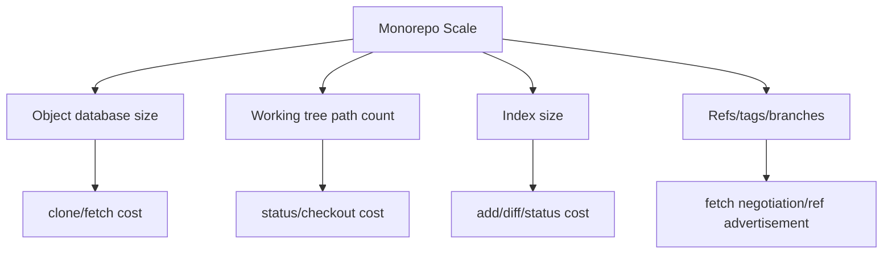
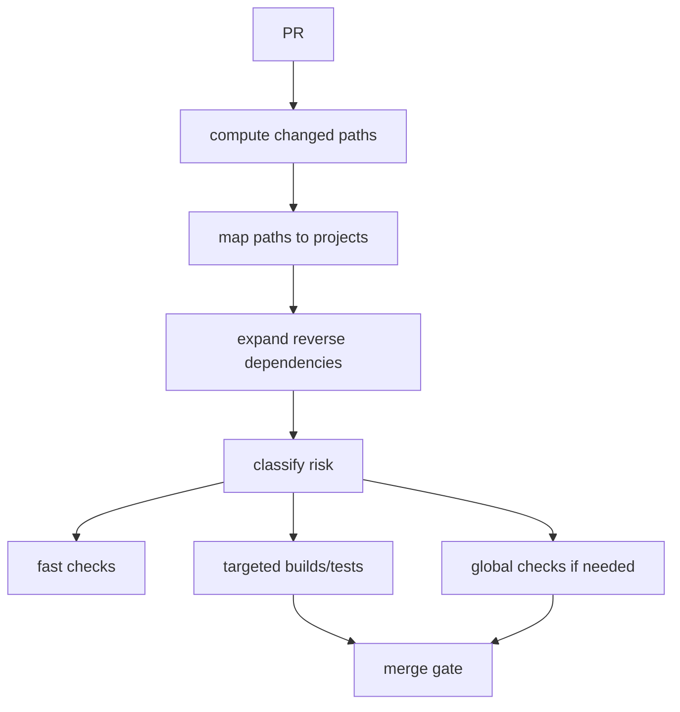
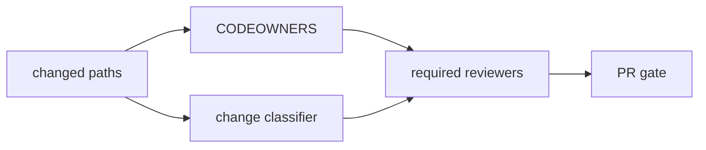
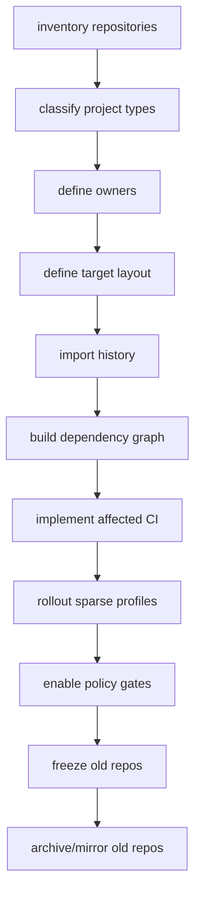

# Case Study: Monorepo at Scale

> Monorepo bukan sekadar “semua code dimasukkan ke satu repository”. Monorepo adalah keputusan arsitektur dan operasional: ownership, dependency direction, CI graph, review routing, release slicing, Git performance, developer tooling, dan governance harus didesain sebagai satu sistem.

Case study ini membahas organisasi fiktif bernama **Northstar** yang memindahkan 80 repository service/library ke satu monorepo. Fokusnya bukan promosi monorepo. Fokusnya adalah desain Git dan workflow agar monorepo tidak berubah menjadi shared dumping ground.

---

## 1. Starting Point: Banyak Repository, Banyak Friction

Northstar awalnya punya polyrepo setup:

```text
service-case-api
service-case-worker
service-identity
service-notification
library-authz-client
library-event-schema
library-observability
infra-terraform
frontend-admin
frontend-portal
...
```

Masalah yang muncul:

| Masalah | Gejala |
|---|---|
| cross-repo change lambat | perubahan API butuh 5 PR di 5 repo |
| dependency skew | service pakai versi library berbeda-beda |
| shared contract tidak sinkron | producer update schema, consumer terlambat |
| release coordination manual | spreadsheet untuk dependency rollout |
| ownership kabur | library kecil tidak punya maintainer aktif |
| duplicate tooling | tiap repo punya CI dan scripts berbeda |
| audit sulit | perubahan feature tersebar lintas repo/tag |

Motivasi monorepo:

1. atomic cross-project change,
2. shared tooling,
3. unified ownership map,
4. dependency graph visible,
5. easier refactoring,
6. consistent policy enforcement,
7. better audit for large feature rollout.

Risiko monorepo:

1. Git operations melambat,
2. CI cost meledak,
3. ownership makin kabur jika tidak dipetakan,
4. release boundaries kacau,
5. unrelated teams saling block,
6. repository bloat permanen,
7. review routing terlalu luas.

---

## 2. Monorepo Design Principle

Northstar membuat prinsip awal:

```text
A monorepo must make cross-boundary changes easier without making local changes slower.
```

Invariants:

| Invariant | Makna |
|---|---|
| ownership must be explicit | setiap path punya owner |
| dependency direction must be enforceable | tidak boleh cyclic chaos |
| CI must be affected-set aware | tidak semua change menjalankan semua test |
| release identity must be project-scoped | tag global tidak cukup untuk semua kasus |
| checkout must be profile-based | developer tidak harus checkout semua path |
| binary/artifact boundary must be strict | monorepo bukan artifact store |
| main must stay healthy | merge queue dan critical checks wajib |

---

## 3. Target Repository Layout

Struktur awal:

```text
repo/
  apps/
    case-admin/
    case-portal/
  services/
    case-api/
    case-worker/
    identity/
    notification/
  libs/
    authz-client/
    event-schema/
    observability/
    testkit/
  contracts/
    case-events/
    identity-api/
  infra/
    terraform/
    helm/
  tools/
    build/
    git/
    ci/
  docs/
    adr/
    runbooks/
  .github/
  CODEOWNERS
  monorepo.yaml
```

Important: layout is not cosmetic. Layout is policy surface.

Example ownership:

```text
/services/identity/**        @team-identity
/services/case-api/**        @team-case-platform
/libs/authz-client/**        @platform-authz
/contracts/**                @platform-api-governance
/infra/**                    @platform-infra
/tools/**                    @platform-devex
.github/workflows/**         @platform-devex
```

Example dependency policy:

```yaml
projects:
  services/case-api:
    type: service
    owners: [team-case-platform]
    dependsOn:
      - libs/authz-client
      - libs/observability
      - contracts/case-events

  libs/authz-client:
    type: library
    owners: [platform-authz]
    dependsOn:
      - contracts/identity-api

rules:
  - from: services/**
    mayDependOn:
      - libs/**
      - contracts/**
    mustNotDependOn:
      - apps/**
      - services/**

  - from: libs/**
    mustNotDependOn:
      - services/**
      - apps/**
```

---

## 4. Git Performance Model

A monorepo stresses Git along four axes:



Mitigation matrix:

| Pressure | Mitigation |
|---|---|
| huge object database | partial clone, blobless clone, maintenance, MIDX, bitmaps |
| too many working tree files | sparse checkout |
| huge index | sparse index |
| slow clone | partial clone + shallow only where safe |
| CI fetching too much | checkout profiles per job |
| binary history bloat | LFS/artifact boundary/pre-receive large blob block |
| many refs/tags | ref hygiene, packed refs, tag convention |

---

## 5. Developer Checkout Profiles

Northstar defines checkout profiles.

```yaml
profiles:
  case-api:
    sparse:
      - /services/case-api/
      - /libs/authz-client/
      - /libs/observability/
      - /contracts/case-events/
      - /tools/

  identity:
    sparse:
      - /services/identity/
      - /contracts/identity-api/
      - /libs/observability/
      - /tools/

  frontend:
    sparse:
      - /apps/case-admin/
      - /apps/case-portal/
      - /libs/ui/
      - /tools/
```

Bootstrap:

```bash
git clone --filter=blob:none --sparse git@example.com:northstar/platform.git
cd platform

git sparse-checkout init --cone
git sparse-checkout set \
  services/case-api \
  libs/authz-client \
  libs/observability \
  contracts/case-events \
  tools
```

Key distinction:

| Feature | Reduces |
|---|---|
| partial clone | object transfer/storage |
| sparse checkout | working tree files |
| sparse index | index cost |
| shallow clone | history depth |

Do not confuse them. A sparse checkout can still have full object history. A partial clone can still have a broad working tree if sparse checkout is not used.

---

## 6. CI Partitioning: Affected Set, Not Whole Repo by Default

Naive monorepo CI:

```text
any PR -> build all services -> test all services -> deploy nothing until everything passes
```

This fails quickly.

Target CI:



Affected-set algorithm:

1. determine base commit,
2. list changed files,
3. map file to owning project,
4. expand reverse dependencies,
5. add global checks for high-risk paths,
6. run only required jobs,
7. include manual override for uncertain mapping.

Example:

```bash
base=$(git merge-base HEAD origin/main)
git diff --name-only "$base" HEAD > changed-files.txt
```

Then:

```text
changed: libs/authz-client/src/TokenClient.java
impacted:
  - libs/authz-client
  - services/case-api
  - services/identity
  - apps/case-admin
```

Critical rule:

> Affected-set CI is only safe if dependency graph is accurate and changes outside known project boundaries trigger conservative fallback.

Fallback conditions:

| Changed path | Required behavior |
|---|---|
| build tooling | run broad/global checks |
| CI workflow | run CI validation + owner review |
| shared contract | producer + consumer checks |
| root dependency lockfile | broad dependency impact |
| codegen template | all generated consumers |
| auth/security library | security critical impact set |

---

## 7. Merge Queue in a Monorepo

Monorepo makes merge race worse because unrelated PRs can still interact through shared tooling, root lockfiles, generated code, or global config.

Without queue:

```text
PR A changes root build plugin and passes.
PR B changes service and passes.
A merges.
B merges without being tested against A.
main breaks.
```

With queue, candidate commits are tested in order.

Optimization:

| Queue strategy | Trade-off |
|---|---|
| strict serial queue | safest, slower |
| batched queue | faster, harder failure isolation |
| affected-set queue | efficient, needs accurate dependency/risk model |
| priority lane | useful for incident, risk of starvation |

Northstar uses:

1. strict queue for high-risk paths,
2. batched queue for low-risk independent projects,
3. priority lane only for incident/hotfix,
4. automatic fallback to stricter validation if dependency model uncertain.

---

## 8. Review Routing in Monorepo

Review cannot be “any senior engineer approves anything”.

Routing layers:



Risk-based routing:

| Path/change | Reviewers |
|---|---|
| `/services/x/**` | service owner |
| `/libs/shared/**` | library owner + affected consumer owner if API changes |
| `/contracts/**` | API governance + producer + impacted consumers |
| `/infra/**` | infra owner |
| `.github/workflows/**` | devex/security if credentials involved |
| root build config | devex + impacted domain owners |
| authz library | platform-authz + security |

Review bot comment example:

```text
Impact analysis:
- Changed project: libs/authz-client
- Reverse dependencies: services/case-api, services/identity, apps/case-admin
- Required owners: @platform-authz
- Suggested reviewers: @team-case-platform, @team-identity
- Required checks: authz-client-unit, case-api-contract, identity-contract
```

---

## 9. Release Slicing

Monorepo does not imply one global release version.

Northstar chooses mixed release identity:

| Artifact type | Version strategy |
|---|---|
| platform-wide release train | global tag `platform-vYYYY.MM.N` |
| independent service | service-scoped tag `service/case-api/v1.14.0` |
| shared library | library tag `lib/authz-client/v2.3.1` |
| contract package | contract tag `contract/case-events/v4.1.0` |
| infra baseline | infra tag `infra/prod/v2026.07.07` |

Example tag names:

```text
service/case-api/v1.14.0
service/identity/v2.8.3
lib/authz-client/v3.2.0
contract/case-events/v5.0.0
platform-v2026.07.0
```

Release range for service:

```bash
git log --first-parent -- services/case-api libs/authz-client contracts/case-events
```

But beware: path-limited history is not the same as dependency-aware release history. If `services/case-api` depends on `libs/authz-client`, library changes may affect service release even when service path did not change.

Release evidence should include:

```yaml
artifact: case-api
version: 1.14.0
tag: service/case-api/v1.14.0
commit: 2f9c0ab
includedPaths:
  - services/case-api
  - libs/authz-client
  - libs/observability
  - contracts/case-events
dependencyGraphVersion: 2026-07-07T10:00:00Z
artifactDigest: sha256:...
```

---

## 10. Monorepo Failure Modes

### 10.1 Repository Becomes Slow

Symptoms:

```text
git status takes 20s
git checkout takes 60s
clone takes hours
CI fetch times out
IDE indexing unusable
```

Likely causes:

1. too many working tree files,
2. large index,
3. binary blobs in history,
4. no commit-graph/MIDX maintenance,
5. hooks scanning entire repo,
6. sparse checkout not adopted,
7. generated files tracked broadly.

Diagnostics:

```bash
git count-objects -vH
git maintenance run --task=commit-graph
git sparse-checkout list
git rev-parse --is-shallow-repository
git rev-parse --is-bare-repository
git ls-files | wc -l
```

### 10.2 CI Cost Explosion

Symptoms:

```text
small docs change runs 800 jobs
queue time exceeds development time
teams bypass checks manually
```

Root cause:

```text
CI does not know project graph or risk classes.
```

Fix:

1. define project graph,
2. map paths to projects,
3. implement affected-set expansion,
4. conservative fallback,
5. cache build/test outputs,
6. split required vs informational checks.

### 10.3 Ownership Collapse

Symptoms:

```text
shared libraries changed by drive-by contributors
reviewers approve unfamiliar code
critical files have no active owner
```

Fix:

1. CODEOWNERS,
2. owner health review,
3. escalation owner,
4. ownership rotation,
5. review SLO per critical path,
6. sensitive path policy.

### 10.4 Global Lockfile Conflict Storm

Symptoms:

```text
almost every PR conflicts on root lockfile
merge queue constantly retries
```

Options:

| Option | Trade-off |
|---|---|
| one root lockfile | simpler consistency, more conflicts |
| per-project lockfile | less conflict, more version skew |
| generated lockfile with bot | central automation, bot complexity |
| dependency update window | controlled churn, slower updates |

No universal answer. Pick based on release coupling and ecosystem tooling.

### 10.5 Path-Based CI Misses Semantic Impact

Example:

```text
Changed: libs/authz-client internal behavior
Path impact says: authz-client only
Reality: all services using authz decisions affected
```

Fix:

1. semantic risk classification,
2. dependency graph expansion,
3. owner-defined impact metadata,
4. manual override labels,
5. post-merge monitoring.

---

## 11. Policy-as-Code for Monorepo

Northstar implements a `repo-policy` tool.

Example checks:

```yaml
checks:
  - name: no-service-to-service-dependency
    type: dependency-rule
    from: services/**
    forbidden:
      - services/**

  - name: sensitive-path-owner-review
    type: review-rule
    paths:
      - services/identity/**
      - libs/authz-client/**
      - infra/**
    requiredOwners: true

  - name: no-large-blobs
    type: blob-size
    maxBytes: 10485760

  - name: release-tag-format
    type: tag-format
    patterns:
      - service/*/v*
      - lib/*/v*
      - platform-v*
```

Run modes:

| Mode | Purpose |
|---|---|
| local pre-push | fast warning |
| PR CI | required gate |
| server-side hook | hard ref invariant |
| scheduled audit | drift detection |

---

## 12. Migration from Polyrepo to Monorepo

Migration order:



Decision: preserve history or squash import?

| Option | Pros | Cons |
|---|---|---|
| preserve full history | audit, blame, archaeology | bigger repo, migration complexity |
| squash import | clean start, smaller | loses local history context |
| preserve selected history | compromise | requires careful tooling |

For regulated systems, preserving history or archiving old repos with immutable references is usually safer than pretending history disappeared.

Old repo archive note:

```md
This repository was migrated to northstar/platform at commit <sha> under path services/case-api.
Old default branch is read-only.
Release tags before v1.12.0 remain authoritative here.
Release tags after v1.12.0 live in northstar/platform.
```

---

## 13. Operational Runbook: Developer Onboarding

New developer should not clone the entire world by accident.

```bash
# 1. Clone with blobless partial clone and sparse enabled
git clone --filter=blob:none --sparse git@example.com:northstar/platform.git
cd platform

# 2. Select profile
./tools/git/profile use case-api

# 3. Verify repo health
./tools/git/doctor

# 4. Start branch
./tools/git/new feature CASE-123-add-priority-routing
```

`git doctor` output:

```text
Repository: northstar/platform
Partial clone: yes, blob:none
Sparse checkout: yes, cone mode
Sparse profile: case-api
Sparse index: enabled
Current branch: main
Upstream: origin/main
Dirty tree: no
Main freshness: up to date
LFS configured: yes
Hooks installed: yes
```

---

## 14. Operational Runbook: PR Review

Reviewer sees bot summary:

```text
PR Impact Summary
-----------------
Changed projects:
- services/case-api
- contracts/case-events

Impacted reverse dependencies:
- apps/case-admin
- services/case-worker

Required owners:
- @team-case-platform
- @platform-api-governance

Required checks:
- case-api-unit
- case-api-contract
- case-worker-consumer-contract
- case-admin-contract

Risk flags:
- contract change
- generated code changed
```

Reviewer checklist:

```text
[ ] Is the dependency graph expansion correct?
[ ] Are generated files consistent with source schema?
[ ] Are consumers tested or intentionally deferred?
[ ] Is release impact documented?
[ ] Does this change require migration/feature flag?
[ ] Is the PR too broad for safe review?
```

---

## 15. Operational Runbook: Release

Service release:

```bash
service="case-api"
version="1.14.0"
tag="service/$service/v$version"

git fetch origin --tags
git rev-parse --verify HEAD^{commit}

./tools/release/verify-project \
  --project services/case-api \
  --version "$version"

git tag -a "$tag" -m "Release $service $version"
git push origin "$tag"

./tools/build service case-api --from-tag "$tag"
```

Release verifier checks:

1. tag format,
2. tag object is annotated/signed if required,
3. commit reachable from protected main or release branch,
4. project version file matches tag,
5. dependency graph included,
6. release notes range computed,
7. artifact digest recorded,
8. runtime metadata generated.

---

## 16. Monorepo Decision Framework

Use monorepo when:

| Signal | Interpretation |
|---|---|
| many atomic cross-repo changes | monorepo may reduce coordination cost |
| shared contracts change often | unified review/test helpful |
| tooling duplicated across repos | centralization valuable |
| dependency skew hurts reliability | single source/version graph useful |
| organization can invest in tooling | monorepo needs platform support |

Avoid or delay monorepo when:

| Signal | Interpretation |
|---|---|
| no platform ownership | monorepo will rot |
| CI already unreliable | monorepo amplifies pain |
| teams need hard confidentiality boundaries | repository-level access may be too broad |
| binary/artifact-heavy codebase | Git performance risk |
| release independence is extreme | scoped release tooling mandatory |
| no dependency graph discipline | affected CI unsafe |

---

## 17. Engineering Takeaways

1. Monorepo shifts complexity; it does not delete complexity.
2. Sparse checkout and partial clone solve different performance problems.
3. CI must be dependency-aware, not only path-aware.
4. CODEOWNERS is necessary but insufficient; ownership health must be maintained.
5. Release identity in monorepo should often be project-scoped.
6. Merge queue becomes more valuable as shared infrastructure and root config grow.
7. Binary/artifact boundary must be enforced before bloat becomes permanent.
8. Affected-set CI must fail conservative when dependency knowledge is uncertain.
9. Migration must include old repository archival and release identity mapping.
10. A successful monorepo is a product maintained by a platform team, not a dumping ground.

---

## 18. Monorepo Readiness Checklist

```text
[ ] Target layout defined
[ ] Ownership map complete
[ ] CODEOWNERS reviewed
[ ] Dependency graph represented in machine-readable form
[ ] CI affected-set algorithm designed
[ ] Conservative fallback rules defined
[ ] Merge queue policy chosen
[ ] Sparse checkout profiles defined
[ ] Partial clone strategy tested
[ ] Large blob/LFS policy enforced
[ ] Release tag convention defined
[ ] Project-scoped release notes implemented
[ ] Old repository archival plan written
[ ] Developer onboarding script exists
[ ] Repo health dashboard exists
[ ] Incident runbooks updated for monorepo
```

---

## References

- Git documentation: `git sparse-checkout`, partial clone, commit-graph, multi-pack-index, `git clone`, `git diff`, `git log`.
- GitHub Docs: CODEOWNERS, branch protection, merge queue, monorepo and repository management guidance.
- Pro Git: branching workflows, distributed Git, submodules, internals.
- Trunk Based Development: short-lived branches and integration discipline.
