# Case Study: Regulatory Case Management Platform

Bayangkan platform case management untuk siklus enforcement regulasi:

- menerima referral / complaint / suspicious activity,
- melakukan triage,
- membuka investigation,
- mengeskalasi case,
- menghasilkan notice / order / sanction,
- melakukan review legal,
- menerbitkan decision,
- menyimpan evidence,
- dan mempertahankan audit trail ketika keputusan ditantang.

Dalam sistem seperti ini, Git bukan hanya alat developer. Git menjadi bagian dari **evidence chain** software delivery.

Pertanyaan besarnya bukan:

> “Workflow Git apa yang paling enak?”

Pertanyaannya adalah:

> “Workflow Git apa yang membuat kita bisa membuktikan bahwa perubahan yang berjalan di production memang sudah direview, diuji, disetujui, dirilis, dan dapat ditelusuri ke requirement serta risk control yang benar?”

Materi ini adalah case study desain workflow Git untuk platform regulated. Tidak semua organisasi butuh seketat ini. Tapi jika sistem memengaruhi enforcement decision, due process, legal notice, eligibility, sanction, audit evidence, atau public accountability, workflow Git harus diperlakukan sebagai bagian dari control system.

---

## 1. Domain Context

Kita gunakan contoh sistem fiktif: **RegCase Platform**.

Sistem ini mengelola lifecycle case:

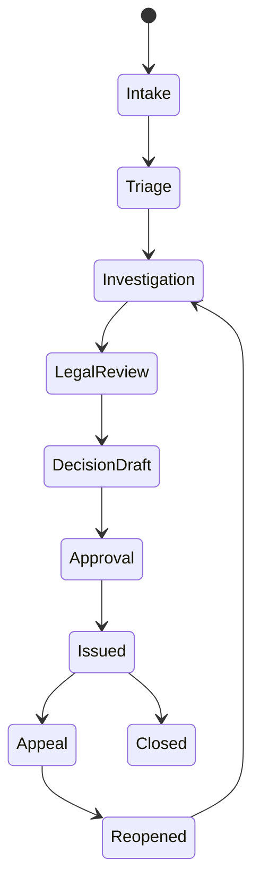

Komponen teknisnya:

| Component | Responsibility | Git Risk |
|---|---|---|
| `case-api` | Case lifecycle API | State transition bug can create invalid enforcement path |
| `workflow-engine` | State machine + escalation rules | Wrong transition can violate policy |
| `acl-service` | Authorization and role policy | Unauthorized access or decision approval |
| `document-service` | Notice/order generation | Wrong template can create legally defective notice |
| `evidence-store` | Evidence metadata + immutable links | Data integrity and chain-of-custody risk |
| `audit-service` | Audit events | Missing/incorrect log can weaken defensibility |
| `reporting` | Regulatory reports | Misreporting exposure |
| `infra` | IAM/network/deployment | Production exposure risk |
| `db/migrations` | Schema evolution | Irreversible data/state risk |

Git workflow must recognize that not all files carry equal risk.

Changing a README is not equivalent to changing:

- `workflow/state-machine.yaml`,
- `authorization/policies.rego`,
- `db/migration/V2026_07_*.sql`,
- `templates/enforcement-notice/*.docx`,
- `audit/event-schema.json`,
- `infra/iam/*.tf`,
- or `release/production-manifest.json`.

A serious workflow encodes this difference.

---

## 2. Core Invariant

For this platform, define the core Git invariant:

> Every production artifact must be traceable to an immutable source commit and release tag whose changes were reviewed by the correct owners, validated by required checks, and recorded in a release evidence bundle.

This expands into smaller invariants.

| Invariant | Meaning |
|---|---|
| Source identity invariant | Every artifact records exact commit SHA, tag, build id, and dirty-tree status. |
| Protected ref invariant | Production source line and release tags cannot be rewritten by normal users. |
| Review ownership invariant | Sensitive paths require domain/security/platform owner approval. |
| CI evidence invariant | Required checks must run against the actual integration result, not stale branch assumptions. |
| Release identity invariant | Release tag must be annotated and preferably signed. |
| Migration invariant | Schema/data migration changes require rollback/forward plan. |
| Emergency invariant | Emergency change can bypass some latency, but not evidence capture. |
| Audit invariant | Every exception has recorded reason, approver, time, and remediation. |

In a regulated platform, speed is still important. But speed cannot come from deleting evidence.

---

## 3. Repository Topology

There are three plausible repository models.

### Option A: Polyrepo

Each service owns its repository:

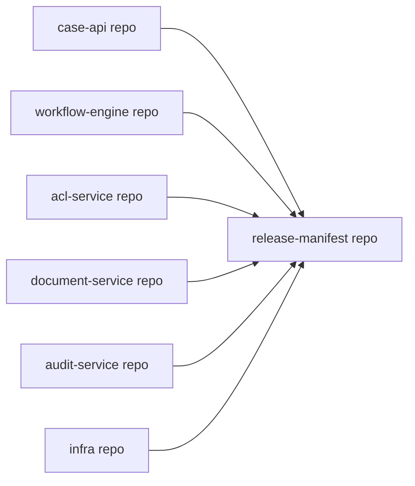

Good when teams are independent and services release separately.

Risk:

- cross-service case lifecycle changes become hard to review atomically,
- release evidence must aggregate many repositories,
- dependency pinning becomes mandatory,
- “which exact versions ran together?” becomes a release-manifest problem.

### Option B: Monorepo

Everything lives in one repository:

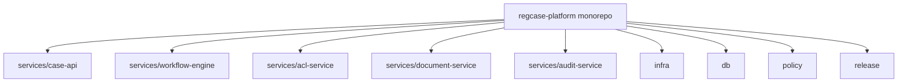

Good when correctness depends on coordinated changes.

Risk:

- large-repo performance,
- owner routing complexity,
- CI cost,
- accidental broad-impact changes.

### Option C: Hybrid

Core regulated surface in monorepo; peripheral integrations in polyrepos.

This is often the best compromise:

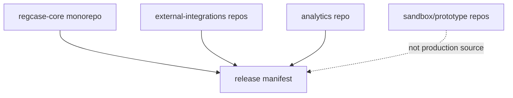

For this case study, choose **hybrid**:

- core enforcement lifecycle in monorepo,
- external connector adapters in separate repos,
- experimental/prototype code outside production release boundary,
- release manifest binds all deployed artifacts.

---

## 4. Branch Model

Avoid environment branches like `dev`, `staging`, `prod` as source-of-truth branches.

Use:

```text
main
release/2026.07
hotfix/2026.07.1-authz-approval-fix
feature/case-close-reason-v2
spike/*            # never production source
```

Meaning:

| Branch | Meaning | Mutability |
|---|---|---|
| `main` | Integrated source line | Protected, no force push |
| `release/<version>` | Stabilization/maintenance line | Protected, no force push |
| `feature/*` | Short-lived proposal | Rewritable before merge |
| `hotfix/*` | Emergency production fix proposal | Short-lived, strongly audited |
| `spike/*` | Exploration only | Not releasable |

State model:

```mermaid
flowchart LR
  dev[feature branch] --> pr[PR to main]
  pr --> checks[Required checks]
  checks --> owners[Required owners]
  owners --> queue[Merge queue]
  queue --> main[main]
  main --> rc[release branch + RC tag]
  rc --> prodtag[production signed tag]
  prodtag --> artifact[immutable artifact]
  artifact --> deploy[deployment record]
```

Important: deployment promotion should promote **artifact identity**, not merge code across environment branches.

---

## 5. File Risk Classification

Create path-based risk classification.

Example `risk-map.yaml`:

```yaml
classes:
  critical_workflow:
    paths:
      - services/workflow-engine/**
      - policy/state-machine/**
    required_owners:
      - '@workflow-owners'
      - '@legal-policy-reviewers'
    required_checks:
      - workflow-model-check
      - state-transition-regression

  authorization:
    paths:
      - services/acl-service/**
      - policy/authz/**
    required_owners:
      - '@security-owners'
      - '@platform-owners'
    required_checks:
      - authz-regression-suite
      - privilege-escalation-tests

  audit_evidence:
    paths:
      - services/audit-service/**
      - schemas/audit/**
    required_owners:
      - '@audit-owners'
      - '@compliance-reviewers'
    required_checks:
      - audit-event-schema-compatibility

  migrations:
    paths:
      - db/migrations/**
    required_owners:
      - '@database-owners'
      - '@service-owner'
    required_checks:
      - migration-forward-test
      - migration-rollback-or-compensation-test

  documents:
    paths:
      - templates/notices/**
      - templates/orders/**
    required_owners:
      - '@legal-content-owners'
      - '@product-owners'
    required_checks:
      - template-render-test
      - snapshot-regression-test
```

This map should not live only in tribal knowledge. It should drive:

- CODEOWNERS,
- CI conditional checks,
- PR template requirements,
- release evidence collection,
- and exception reporting.

---

## 6. CODEOWNERS as Review Routing, Not Full Governance

`CODEOWNERS` can route review, but it is not enough by itself.

Example:

```text
# Workflow and legal state machine
/services/workflow-engine/ @workflow-owners @legal-policy-reviewers
/policy/state-machine/ @workflow-owners @legal-policy-reviewers

# Authorization
/services/acl-service/ @security-owners @platform-owners
/policy/authz/ @security-owners

# Evidence and audit
/services/audit-service/ @audit-owners @compliance-reviewers
/schemas/audit/ @audit-owners @compliance-reviewers

# Database
/db/migrations/ @database-owners @service-owners

# Legal templates
/templates/notices/ @legal-content-owners
/templates/orders/ @legal-content-owners

# Release control
/release/ @release-managers @platform-owners
```

But CODEOWNERS cannot decide whether the PR contains:

- a breaking state transition,
- insufficient migration plan,
- undocumented emergency exception,
- hidden generated file drift,
- or a semantic authorization bypass.

So CODEOWNERS is only one layer.

Governance stack:

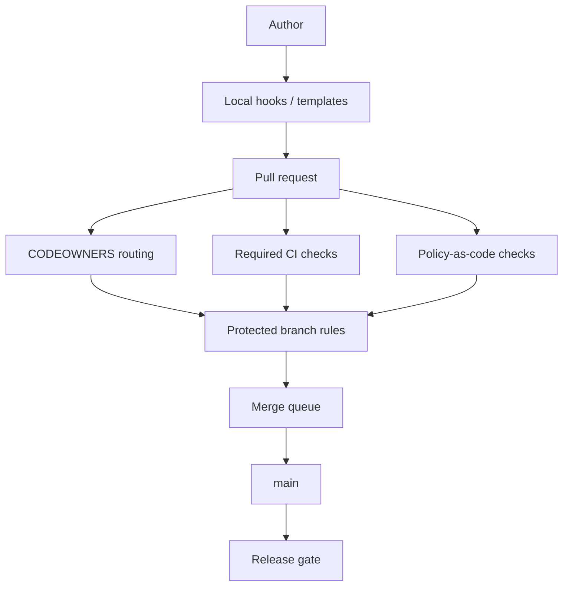

---

## 7. PR Contract for Regulated Change

Every PR touching regulated surface must answer:

1. What domain behavior changes?
2. Which states/transitions/roles/documents/reports are affected?
3. What existing cases could be affected?
4. Is migration required?
5. Is rollback safe, or is compensation required?
6. What audit evidence changes?
7. Which release train should include this?
8. Does this require legal/compliance signoff?

Template:

```md
## Change Summary

## Regulatory Impact
- [ ] No regulatory behavior impact
- [ ] Workflow/state transition impact
- [ ] Authorization/permission impact
- [ ] Notice/order/document impact
- [ ] Evidence/audit/reporting impact
- [ ] Data migration impact

## Case Lifecycle Impact
Affected states:
Affected transitions:
Affected roles:
Affected existing cases:

## Verification
- Unit:
- Integration:
- State-machine regression:
- Authorization regression:
- Migration test:
- Audit event verification:

## Rollback / Compensation
Rollback type:
- [ ] safe revert
- [ ] feature flag disable
- [ ] forward fix only
- [ ] data compensation required

## Evidence Links
Requirement:
Risk record:
Incident/change ticket:
Design decision:
```

This is not bureaucracy. It is a compression format for future forensic analysis.

---

## 8. Commit Design in This Domain

Bad commit:

```text
fix workflow
```

Better commit:

```text
Enforce supervisor approval before sanction issuance

Previously, a case could move from LEGAL_REVIEW to SANCTION_ISSUED
when the assigned investigator had the `case.approve` permission. That
allowed operational approval to bypass supervisor review for sanction
cases created through referral intake.

This change introduces an explicit SUPERVISOR_APPROVED gate for sanction
issuance and updates the regression fixtures for referral-origin cases.

Regulatory-impact: sanction-approval-workflow
Risk: unauthorized-enforcement-action
Ticket: REG-18422
```

Commit message should capture why the change exists, not merely what files changed.

For critical paths, require trailers:

```text
Regulatory-impact: workflow-transition
Risk-id: RISK-AUTHZ-0041
Case-state-impact: LEGAL_REVIEW,SUPERVISOR_APPROVED,SANCTION_ISSUED
Migration-impact: none
Reviewed-by-domain-owner: yes
```

These trailers can be parsed for release notes and evidence bundles.

---

## 9. Merge Method Decision

For this platform, use different merge methods by branch class.

| Target | Preferred Method | Why |
|---|---|---|
| `feature/*` private branch | Rebase/amend/fixup allowed | Shape clean review series |
| `main` | Merge queue with squash or rebase-merge depending policy | Keep main green and reviewable |
| `release/*` | No squash for hotfix/backport commits unless evidence preserved elsewhere | Need traceability across versions |
| Emergency hotfix | Merge commit or explicit cherry-pick with `-x` | Preserve source relationship |
| Release tag | Annotated/signed tag | Immutable release identity |

There is no universal best merge method.

For regulated systems, the important question is:

> Can a future investigator reconstruct why this source reached production?

If squash merge is used, the final squashed commit must preserve:

- PR id,
- ticket id,
- risk id,
- reviewer trail,
- release note category,
- and affected domain.

If merge commits are used, `--first-parent` history can become the release narrative.

---

## 10. Release Evidence Bundle

Every production release should produce an evidence bundle.

Example structure:

```text
release-evidence/
  2026.07.2/
    source.json
    tag-verification.txt
    commit-verification.txt
    changelog.md
    pr-list.json
    risk-impact-summary.md
    test-results/
      unit.xml
      integration.xml
      authz-regression.xml
      workflow-model-check.json
      migration-test.json
    artifacts/
      case-api.sha256
      workflow-engine.sha256
      acl-service.sha256
    deployment/
      staging-deploy.json
      production-deploy.json
    approvals/
      release-manager.md
      compliance.md
      security.md
```

`source.json`:

```json
{
  "release": "2026.07.2",
  "tag": "v2026.07.2",
  "tagType": "annotated-signed",
  "commit": "3f2c9b1e7a...",
  "tree": "b21f...",
  "branch": "release/2026.07",
  "dirty": false,
  "buildId": "build-982134",
  "builtAt": "2026-07-07T04:10:00Z"
}
```

Release evidence is stronger when it binds:

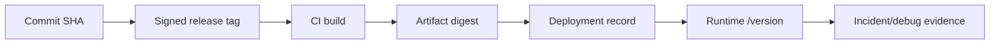

---

## 11. CI Gates by Risk Surface

A normal PR may run:

- lint,
- unit tests,
- integration smoke,
- build.

A workflow/state-machine PR must run more:

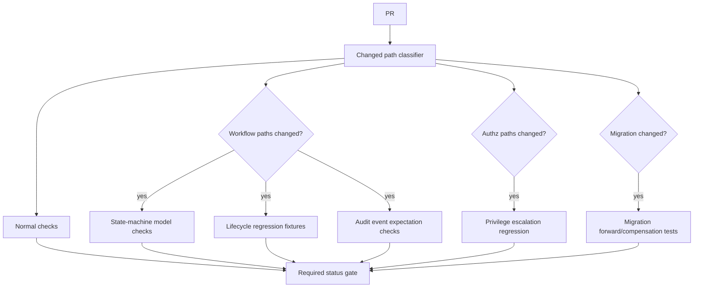

Checks should match domain risk.

A state transition change that passes only unit tests is not enough.

---

## 12. Migration Policy

Database migration in case management is dangerous because case state is evidence.

Require each migration PR to classify:

| Migration Type | Requirement |
|---|---|
| Additive schema | Forward test, compatibility check |
| Backfill | Idempotency, batch strategy, audit note |
| Destructive schema | Explicit approval and archive/compensation plan |
| State migration | Case count impact, before/after invariant check |
| Authorization data migration | Security approval and sampled verification |

Example migration PR checklist:

```md
## Migration Checklist

- [ ] Migration is idempotent or protected by version table
- [ ] Existing case count impact calculated
- [ ] Rollback/compensation plan documented
- [ ] Audit events remain interpretable after migration
- [ ] Old application version compatibility considered
- [ ] Production dry-run or sampled validation included
```

A rollback of source code does not automatically rollback migrated case state.

This matters for Git because `git revert` may be insufficient for operational rollback.

---

## 13. Emergency Change Path

Emergency changes happen. The goal is not to pretend they never do.

Emergency invariant:

> Emergency flow may reduce waiting time, but must not erase identity, approval, verification, or post-facto review.

Emergency hotfix flow:

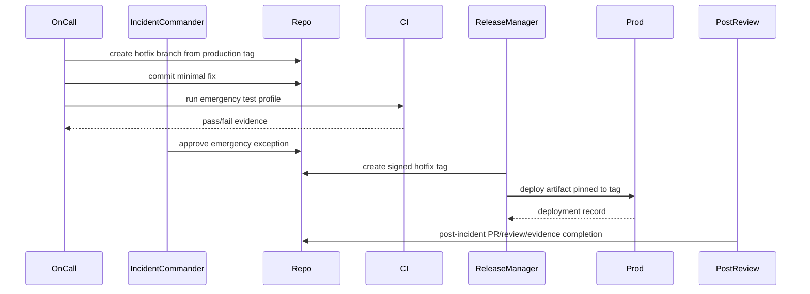

Rules:

- branch from last known production source,
- smallest safe patch,
- no opportunistic refactor,
- required emergency reviewer,
- signed hotfix tag,
- release evidence captured,
- follow-up review within defined SLA,
- forward-port to `main` if hotfix started from release branch.

---

## 14. Backport and Forward-Port Discipline

A fix may need to exist in:

- `main`,
- `release/2026.07`,
- `release/2026.06`,
- maybe a long-term support branch.

Use a matrix:

| Fix | main | 2026.07 | 2026.06 | Notes |
|---|---:|---:|---:|---|
| `REG-18422` supervisor approval | yes | yes | no | Feature not present in 2026.06 |
| `SEC-941` ACL bypass | yes | yes | yes | Security hotfix |
| `DOC-330` notice wording | yes | yes | yes | Legal template update |

For cherry-picks across release branches, use `-x` when policy requires source trace:

```bash
git checkout release/2026.07
git cherry-pick -x <main-fix-sha>
```

The resulting commit hash differs, but the message records origin.

---

## 15. State Machine Change Example

Suppose current workflow has:

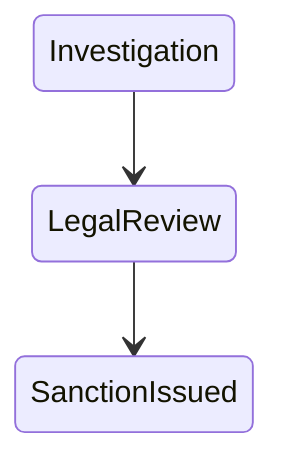

New regulation requires supervisor approval:

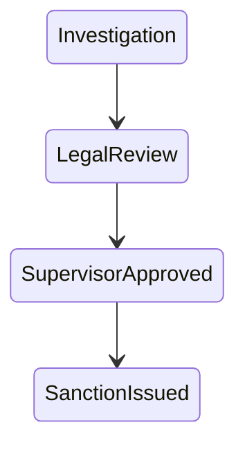

This is not one code change. It touches:

- workflow state enum,
- transition guards,
- authorization policy,
- UI display,
- audit event schema,
- report mapping,
- migration/backfill for in-flight cases,
- notification/document generation,
- training/release notes.

A reviewable commit series:

```text
1. Add SUPERVISOR_APPROVED state to workflow model
2. Add transition guard requiring supervisor role
3. Emit audit event for supervisor approval
4. Migrate in-flight sanction cases to LegalReview hold state
5. Update notice generation to include approval timestamp
6. Add regression fixtures for referral-origin sanction cases
7. Document regulatory behavior change in release notes
```

Each commit has a different owner and test requirement.

Trying to squash all of this into `update workflow` destroys reviewability.

---

## 16. Audit Event Compatibility

Audit event schemas should be treated as public contracts.

Example changed file:

```text
schemas/audit/case-state-transition.v3.json
```

Required Git controls:

- CODEOWNER from audit/compliance,
- schema compatibility check,
- event replay test,
- release note entry,
- migration note if historical reports depend on old fields.

Failure mode:

> A developer renames `approvedByUserId` to `approvalActorId` without compatibility shim. Runtime works, but audit export for older reports breaks.

Git cannot detect this alone. But Git can route the change to the right checks.

---

## 17. Production Source and Runtime Provenance

Every service should expose source identity.

Example `/version` response:

```json
{
  "service": "workflow-engine",
  "version": "2026.07.2",
  "commit": "3f2c9b1e7a0b...",
  "tag": "v2026.07.2",
  "tree": "b21f8a...",
  "buildId": "build-982134",
  "artifactDigest": "sha256:7c8a...",
  "dirty": false
}
```

This lets incident response ask:

- What source commit is running?
- Is it from a release tag?
- Did that tag pass release gates?
- Which PRs are included?
- Which risk approvals exist?
- Which migration version is active?

Without runtime Git metadata, production debugging becomes archaeology.

---

## 18. Bad Patterns

### Pattern 1: `prod` branch as deployed reality

```text
main -> dev -> staging -> prod
```

Problem:

- environment state becomes source history,
- back-merges become ambiguous,
- hotfixes get stranded,
- deployed artifact identity is unclear.

Better:

```text
main/release branch -> signed tag -> artifact digest -> deploy environment
```

### Pattern 2: approval outside Git with no link back

A manager approves in chat, but the PR/release record does not link it.

Problem:

- future audit cannot reconstruct approval context,
- chat retention may not match evidence retention,
- approval may not identify exact commit/tag.

Better: approval record references exact PR, commit, release tag, and risk id.

### Pattern 3: emergency hotfix directly on production server

Problem:

- no source identity,
- no review,
- no reproducible artifact,
- no rollback boundary,
- no future diff.

Better: emergency branch + minimal CI + signed hotfix tag + post-review.

### Pattern 4: migration without case impact count

Problem:

- source diff looks safe,
- production data impact unknown,
- rollback may be impossible.

Better: migration PR includes impact query, sampled result, and compensation plan.

---

## 19. Reference Implementation: Policy Checks

Pseudo policy check:

```bash
#!/usr/bin/env bash
set -euo pipefail

base="${BASE_SHA:?}"
head="${HEAD_SHA:?}"

changed=$(git diff --name-only "$base...$head")

requires_owner() {
  local pattern="$1"
  echo "$changed" | grep -E "$pattern" >/dev/null
}

if requires_owner '^(services/workflow-engine|policy/state-machine)/'; then
  echo "requires: workflow model check"
  echo "requires: legal policy owner approval"
fi

if requires_owner '^(services/acl-service|policy/authz)/'; then
  echo "requires: authz regression suite"
  echo "requires: security owner approval"
fi

if requires_owner '^db/migrations/'; then
  echo "requires: migration forward test"
  echo "requires: rollback or compensation plan"
fi
```

This script is not the full governance system. It is a small executable representation of a real policy.

---

## 20. Release Gate Script

Before release tagging:

```bash
#!/usr/bin/env bash
set -euo pipefail

version="$1"
tag="v$version"

# Ensure clean source state
git diff --quiet
git diff --cached --quiet

# Ensure current commit is reachable from release branch
branch=$(git symbolic-ref --short HEAD)
case "$branch" in
  release/*|main) ;;
  *) echo "Release must be cut from main or release branch" >&2; exit 1 ;;
esac

# Ensure tag does not already exist
git rev-parse --verify --quiet "refs/tags/$tag" && {
  echo "Tag already exists: $tag" >&2
  exit 1
}

# Create annotated tag; use -s when signing policy is enabled
git tag -a "$tag" -m "Release $version"

# Verify tag object
git cat-file -t "$tag" | grep -qx tag

git show --no-patch --format='%H %T %ct' "$tag^{}" > "release-source-$version.txt"
```

A production release cannot rely on “whatever HEAD was in CI.”

---

## 21. Evidence-Driven Incident Triage

When a production incident occurs:

1. Query runtime `/version`.
2. Resolve release tag to commit.
3. Validate tag signature/annotation.
4. Get PR range from previous production tag.
5. Run risk-surface diff.
6. Identify changed critical files.
7. Check release evidence for required tests/approvals.
8. Use `git bisect` only after defining executable failure predicate.
9. If rollback needed, determine whether source revert is enough or data compensation is required.

Command sketch:

```bash
previous=v2026.07.1
current=v2026.07.2

git diff --name-only "$previous...$current"
git log --first-parent --oneline "$previous..$current"
git log --format='%H%x09%s' -- services/workflow-engine policy/authz db/migrations
```

The value of disciplined Git workflow appears during incident pressure.

---

## 22. Governance Checklist

For a regulated Git workflow baseline:

- [ ] `main` protected against force push and direct push.
- [ ] release branches protected.
- [ ] release tags protected/immutable.
- [ ] signed/annotated release tags required.
- [ ] CODEOWNERS covers critical paths.
- [ ] sensitive path changes trigger domain-specific checks.
- [ ] CI runs against correct integration result.
- [ ] release artifacts embed commit/tag/build/digest metadata.
- [ ] emergency path exists and captures evidence.
- [ ] migration PRs require impact and compensation plan.
- [ ] hotfix/backport matrix maintained.
- [ ] release evidence bundle generated and retained.
- [ ] exceptions require explicit reason and approver.
- [ ] post-incident review checks whether Git controls failed.

---

## 23. Mental Model

For normal products, Git history helps collaboration.

For regulated systems, Git history also helps answer:

- Who changed what?
- Why was it changed?
- Who approved it?
- What tests ran?
- What exact source entered production?
- What artifact was built?
- What was deployed?
- Which cases/users/decisions could be affected?
- What evidence exists if the behavior is challenged?

The goal is not perfect bureaucracy.

The goal is **defensible change**.

A top-tier engineer does not just ask whether the branch merged. They ask whether the organization can prove the right change merged into the right release with the right controls.

---

## References

- Git documentation: `git tag`, signed/annotated tags, tag verification.
- Git documentation: `git log`, `git diff`, `git rev-parse`, and revision ranges.
- Git documentation: `git revert` and `git cherry-pick` for remediation/backport operations.
- GitHub Docs: branch protection, CODEOWNERS, required reviews, required checks, and rulesets.
- GitHub Docs: removing sensitive data and secret scanning guidance.
