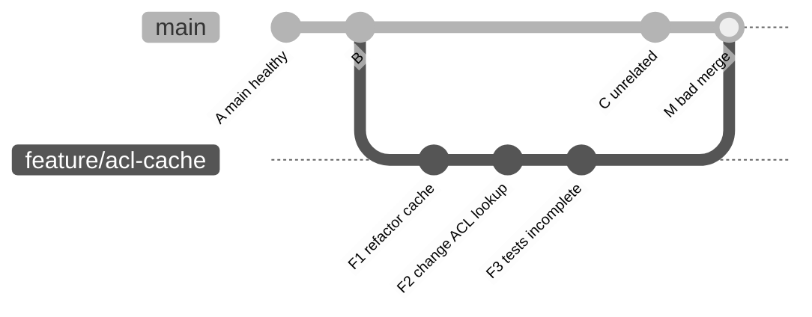
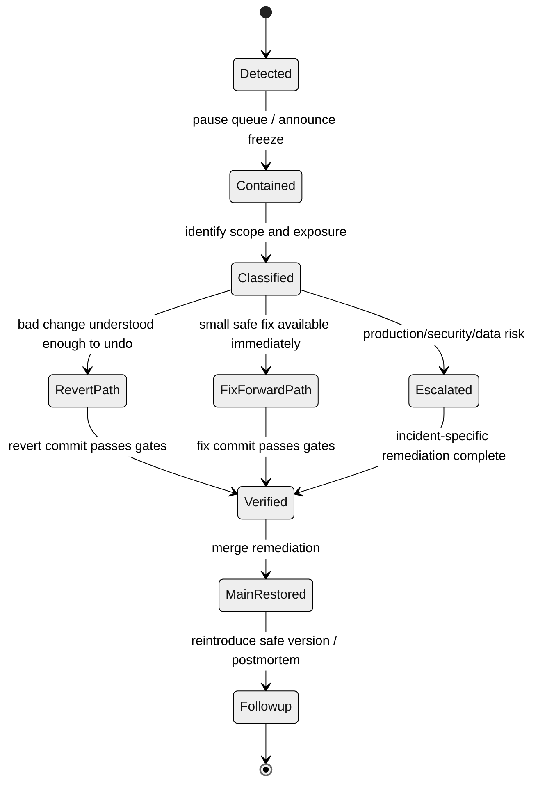
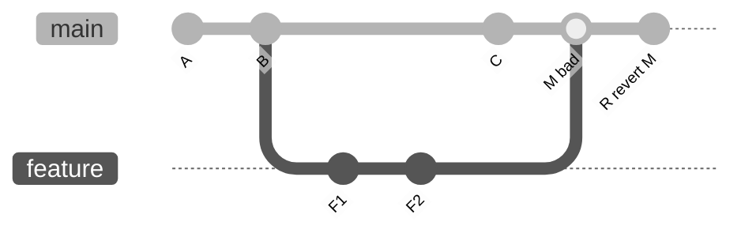
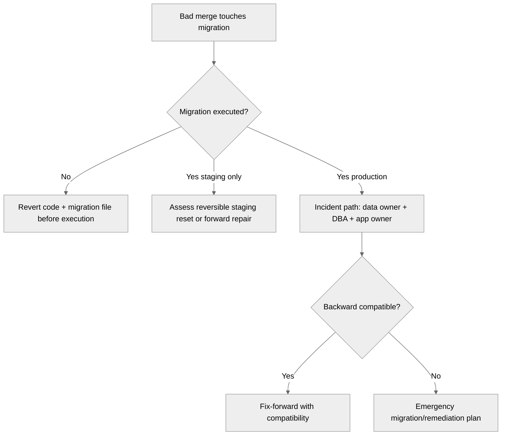
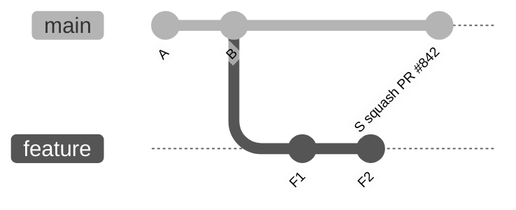
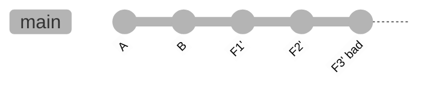

# Case Study: Bad Merge to Main

Bad merge ke `main` adalah salah satu incident Git paling umum di organisasi engineering yang sudah memakai protected branch, CI, dan pull request. Ironisnya, incident ini sering terjadi bukan karena tim tidak paham command Git, tetapi karena tim salah membaca sifat `main`.

`main` bukan sekadar branch default. Dalam organisasi engineering yang sehat, `main` adalah **shared integration contract**. Ia adalah titik koordinasi untuk CI, release candidate, deployment preview, ownership routing, automation, security scanning, dan audit trail.

Karena itu, ketika `main` rusak, pertanyaannya bukan hanya:

> Command apa yang bisa mengembalikan kode?

Pertanyaan yang benar adalah:

> Bagaimana kita mengembalikan invariant `main` dengan evidence yang jelas, risiko minimum, dan downstream coordination yang terkendali?

Part ini membahas case study bad merge ke `main` dari sudut pandang internal engineering handbook.

---

## 1. Incident Summary

Kita gunakan skenario konkret:

- repository memakai protected `main`;
- setiap PR wajib lulus CI;
- merge method yang dipakai adalah **merge commit**;
- tim memakai release branch mingguan;
- `main` otomatis dideploy ke staging;
- release candidate dibuat dari tag pada `main`;
- PR `#842` merge ke `main`;
- setelah merge, integration tests staging gagal;
- service masih build, tetapi authorization flow untuk role tertentu rusak;
- belum ada production deploy dari commit buruk tersebut.

Secara graph, situasinya kira-kira seperti ini:



Commit `M` adalah merge commit yang masuk ke `main`. Setelah `M`, invariant `main` berubah dari healthy menjadi broken.

---

## 2. Core Invariant

Invariant utama:

> Public `main` tidak boleh direwrite sebagai respons normal terhadap bad merge.

Artinya:

- jangan `git reset --hard <old>` lalu force push `main`;
- jangan delete `main` lalu recreate;
- jangan mengubah history shared branch untuk “membuat terlihat tidak pernah terjadi”;
- gunakan **revert commit** atau **fix-forward commit** agar timeline incident tetap auditable.

Why?

Karena `main` sudah dikonsumsi oleh:

- developer clones;
- CI caches;
- deployment automation;
- release note tooling;
- merge queues;
- security scanners;
- artifact provenance;
- branch protection audit;
- downstream fork atau mirrors.

Menghapus event dari public history sering membuat masalah kedua yang lebih buruk dari masalah pertama: setiap consumer harus reconcile history yang berubah.

---

## 3. Incident State Machine

Bad merge harus ditangani sebagai state machine, bukan reaksi impulsif.



Setiap transisi harus meninggalkan evidence:

- siapa yang memutuskan;
- commit mana yang bermasalah;
- branch/ref mana yang terdampak;
- test mana yang gagal;
- remediation commit mana yang dipilih;
- kapan `main` kembali healthy.

---

## 4. First Response: Jangan Langsung Memperbaiki Code

Ketika `main` rusak, developer sering langsung membuat patch. Itu bisa benar, tapi bukan langkah pertama.

Langkah pertama adalah **containment**.

```bash
# Snapshot state lokal sebelum investigasi
mkdir -p incident-main-broken

printf "HEAD: " > incident-main-broken/state.txt
git rev-parse HEAD >> incident-main-broken/state.txt

printf "BRANCH: " >> incident-main-broken/state.txt
git branch --show-current >> incident-main-broken/state.txt

printf "REMOTE MAIN: " >> incident-main-broken/state.txt
git ls-remote origin refs/heads/main >> incident-main-broken/state.txt

git status --porcelain=v2 > incident-main-broken/status.txt
git log --oneline --decorate --graph --first-parent -20 > incident-main-broken/first-parent.log
```

Lalu lakukan containment organisasi:

- pause merge queue;
- informasikan `main` sedang frozen;
- stop auto-promotion dari `main` jika ada;
- jangan merge PR baru sampai root cause atau remediation path jelas;
- pastikan tidak ada release tag dibuat dari bad head;
- jika ada deployment otomatis, freeze deployment dari commit buruk.

Contoh announcement internal:

```text
main is currently broken after merge <M> from PR #842.
Merge queue is paused.
Do not merge, rebase onto, or release from current main until remediation is posted.
Current bad head: <sha>
Incident owner: <name>
Next update: after revert/fix-forward validation.
```

---

## 5. Identify the Bad Integration Commit

Untuk merge commit workflow, jalur utama biasanya bisa dibaca dengan `--first-parent`.

```bash
git fetch origin

git log origin/main --first-parent --oneline --decorate -20
```

Cari commit terakhir sebelum failure.

```bash
# Example output
# a1b2c3d Merge pull request #842 from team/feature/acl-cache
# 9d8e7f6 Merge pull request #841 from team/refactor-logging
# 1c2b3a4 Release prep
```

Kemudian inspect merge commit.

```bash
git show --summary --decorate a1b2c3d
git show --stat a1b2c3d
git show --cc a1b2c3d
```

Untuk merge commit, parent matters.

```bash
git show --pretty=raw --no-patch a1b2c3d
```

Output raw akan menunjukkan parent:

```text
commit a1b2c3d...
tree ...
parent 9d8e7f6...      # parent 1: previous main
parent f4e5d6c...      # parent 2: feature branch tip
```

Biasanya, pada merge commit ke `main`, **parent 1** adalah previous `main`, dan **parent 2** adalah branch yang di-merge. Tetapi jangan mengandalkan “biasanya” untuk incident. Verifikasi graph.

```bash
git log --graph --oneline --decorate --parents -10 origin/main
```

---

## 6. Decision: Revert, Fix-Forward, Disable, atau Escalate?

Pilih remediation berdasarkan exposure dan reversibility.

| Kondisi | Default action | Kenapa |
|---|---|---|
| Bad merge belum ke production | Revert atau fix-forward | Target utama restore healthy `main` cepat. |
| Bad merge berupa small obvious bug | Fix-forward | Jika patch lebih kecil dan lebih aman dari revert. |
| Bad merge berupa broad feature branch | Revert merge commit | Menghapus seluruh feature dari `main` lebih predictable. |
| Bad merge menyentuh schema/data migration | Escalate | Revert code belum tentu revert data. |
| Bad merge leak secret | Security incident path | Rotate/revoke dulu, Git cleanup kemudian. |
| Bad merge sudah dirilis/tagged | Release incident path | Perlu corrective release/versioning evidence. |
| Bad merge menyebabkan production outage | Incident commander decides | Git recovery hanya satu bagian dari service recovery. |

Rule praktis:

> Revert ketika kita lebih percaya pada previous known-good state daripada kemampuan membuat patch cepat.

> Fix-forward ketika failure sudah dipahami, patch kecil, dan risiko regressi tambahan lebih rendah daripada revert.

---

## 7. Reverting a Normal Commit

Jika bad commit bukan merge commit:

```bash
git switch main
git pull --ff-only origin main

git switch -c incident/revert-bad-main-a1b2c3d

git revert a1b2c3d

# run validation
./gradlew test integrationTest

git push -u origin incident/revert-bad-main-a1b2c3d
```

Buat PR remediation dengan judul eksplisit:

```text
Revert a1b2c3d: restore main after ACL cache regression
```

Commit revert harus menjelaskan:

- commit yang direvert;
- gejala failure;
- kenapa revert dipilih daripada fix-forward;
- test yang membuktikan healthy state;
- rencana reintroduce jika fitur masih dibutuhkan.

---

## 8. Reverting a Merge Commit

Jika commit buruk adalah merge commit, gunakan `git revert -m`.

`-m` berarti **mainline parent**: parent yang dianggap sebagai garis utama yang ingin dipertahankan.

Dalam merge PR ke `main`, biasanya:

```bash
git revert -m 1 <merge-commit-sha>
```

Contoh:

```bash
git switch main
git pull --ff-only origin main

git switch -c incident/revert-pr-842

git revert -m 1 a1b2c3d
```

Secara konseptual:



Commit `R` tidak menghapus commit `M` dari history. Ia menambahkan commit baru yang membalik tree changes yang diperkenalkan oleh merge `M` relatif terhadap parent `1`.

### 8.1 Parent Verification

Jangan menebak `-m 1`.

Verifikasi:

```bash
git show --pretty=raw --no-patch a1b2c3d
```

Jika parent pertama adalah previous `main`, gunakan `-m 1`.

Jika parent order berbeda karena merge dilakukan dari branch lain atau tooling khusus, pilih parent sesuai garis yang ingin dipertahankan.

### 8.2 Why Wrong Parent Is Dangerous

Jika salah memilih parent:

```bash
git revert -m 2 a1b2c3d
```

Git akan mempertahankan sisi feature dan membalik sisi main. Dalam incident, ini hampir selalu salah dan bisa menghasilkan revert commit yang tampak valid secara Git tetapi menghancurkan perubahan main yang benar.

Operational invariant:

> Tidak ada revert merge commit tanpa menampilkan parent list di PR description.

---

## 9. The Merge-Revert Trap

Reverting a merge commit punya konsekuensi jangka panjang.

Setelah merge commit direvert, Git history masih mengetahui bahwa feature branch pernah di-merge. Jika branch yang sama di-merge lagi tanpa perubahan baru, Git mungkin tidak membawa kembali perubahan yang sudah direvert karena commit feature sudah ancestor dari `main`.

Artinya, reintroducing feature biasanya membutuhkan salah satu dari:

1. **revert the revert**;
2. recreate patch di commit baru;
3. rebase/rebuild feature branch dari base baru;
4. cherry-pick clean commits yang sudah diperbaiki.

Contoh revert the revert:

```bash
# R adalah commit revert dari M
git revert <R>
```

Tetapi lakukan ini hanya jika feature memang sudah diperbaiki dan seluruh invariant sudah diverifikasi.

Recommended playbook:

```bash
# Setelah main healthy lagi
# Buat branch reintroduce yang eksplisit
git switch main
git pull --ff-only

git switch -c feature/acl-cache-reintroduce

# Opsi A: revert revert commit lalu apply fix tambahan
git revert <revert-commit-sha>
# apply fixes
# run tests

# Opsi B: cherry-pick subset clean dari branch lama
# git cherry-pick -x <fixed-commit>
```

Jangan diam-diam merge branch lama yang sama dan berharap Git “mengerti intent bisnis”.

---

## 10. Fix-Forward Path

Fix-forward cocok saat failure sangat sempit.

Contoh:

- typo config;
- missing null check;
- salah feature flag default;
- test fixture tidak update;
- migration script belum dipanggil tapi schema belum berubah;
- dependency version salah namun mudah dikembalikan.

Workflow:

```bash
git switch main
git pull --ff-only origin main

git switch -c incident/fix-acl-cache-regression

# edit minimal files
$EDITOR src/main/java/...

git diff --stat
git diff

git add -p
git commit -m "Fix ACL cache fallback after PR #842"

./gradlew test integrationTest

git push -u origin incident/fix-acl-cache-regression
```

Fix-forward PR harus kecil dan fokus. Jangan sekalian refactor. Jangan sekalian memperbaiki unrelated warnings. Saat incident, review bandwidth sedang sempit.

---

## 11. Feature Flag Disable Path

Kadang remediation tercepat bukan revert code, tetapi mematikan feature flag.

Gunakan path ini jika:

- perubahan sudah terdeploy tapi flag-gated;
- code path baru bisa dinonaktifkan tanpa redeploy;
- data belum termutasi permanen;
- disabling flag mengembalikan behavior known-good.

Tetapi tetap buat Git follow-up:

- commit untuk mengubah default flag jika default tersimpan di repo;
- issue untuk root cause;
- PR test coverage;
- release note jika user-facing.

Git history tetap harus mencatat remediation, meskipun operational toggle dilakukan di luar Git.

---

## 12. Schema/Data Migration Special Case

Bad merge yang menyentuh database migration tidak boleh diperlakukan seperti code-only revert.

Contoh risk:

- migration sudah berjalan di staging/prod;
- column sudah dihapus;
- data sudah diubah irreversible;
- event schema sudah dipublish;
- background job sudah memproses data dengan format baru.

Checklist:

```text
[ ] Apakah migration sudah dijalankan?
[ ] Di environment mana?
[ ] Apakah migration reversible?
[ ] Apakah data sudah berubah?
[ ] Apakah rollback code kompatibel dengan schema saat ini?
[ ] Apakah perlu forward migration untuk repair?
[ ] Apakah release branch/tag sudah dibuat setelah migration?
```

Dalam kasus ini, revert code tanpa data strategy bisa memperburuk incident.

Recommended state machine:



---

## 13. Secret Leak Special Case

Jika bad merge memasukkan secret:

> Rotate/revoke secret first. Git cleanup second.

Do not spend the first 30 minutes debating `filter-repo` while credential masih valid.

Minimum path:

1. identify secret type;
2. revoke/rotate at provider;
3. remove current-tree exposure;
4. assess clone/log/artifact exposure;
5. decide whether history rewrite is needed;
6. coordinate downstream cleanup;
7. add prevention control.

Git revert tidak menghapus secret dari history. Ia hanya membuat tree terbaru tidak mengandung secret.

---

## 14. Squash Merge Case

Jika PR di-merge dengan squash merge, `main` memiliki one normal commit, not merge commit.

Graph:



Remediation:

```bash
git revert <squash-commit-sha>
```

Tidak ada `-m` karena bukan merge commit.

Trade-off: squash merge membuat revert sederhana, tetapi menghilangkan internal commit granularity di `main`. Jika PR sangat besar, revert all-or-nothing bisa terlalu kasar.

---

## 15. Rebase Merge Case

Jika hosting platform melakukan “rebase and merge”, commit feature dipindahkan ke `main` satu per satu.

Graph:



Remediation options:

```bash
# Revert only bad commit if isolated
git revert <F3-prime>

# Revert a range, newest first or using --no-commit
git revert --no-commit <F1-prime>^..<F3-prime>
git commit -m "Revert PR #842 after main regression"
```

Be careful with ranges. Validate the exact commit set:

```bash
git log --oneline <old-good>..<bad-head>
```

---

## 16. Validation Before Remediation Merge

A revert/fix PR should not bypass all validation just because incident pressure is high.

Minimum validation:

```bash
# local sanity
git status --short
git diff --check

# tests affected by incident
./gradlew test integrationTest

# compare main head with remediation branch
git log --oneline --decorate --graph origin/main..HEAD
git diff --stat origin/main...HEAD
```

For CI:

- run same checks required for `main`;
- if merge queue exists, use queue unless queue itself is failing because of bad main;
- if bypass required, log exception explicitly;
- attach evidence to incident.

Remediation PR description template:

```md
## Incident
main broke after PR #842 / merge commit a1b2c3d.

## Failure
Staging integration test `AuthorizationFlowIT#caseOwnerCanEscalate` fails.

## Action
Revert merge commit a1b2c3d using `git revert -m 1`.

## Parent verification
- parent 1: 9d8e7f6 previous main
- parent 2: f4e5d6c feature/acl-cache

## Validation
- unit tests passed
- integration tests passed
- staging smoke pending/passed

## Follow-up
Feature will be reintroduced via new PR after root cause fix and expanded test coverage.
```

---

## 17. Communication Protocol

During bad main incident, unclear communication causes duplicate fixes, bad rebases, and accidental releases.

Use one owner and one thread.

```text
Incident: main broken after PR #842
Current main head: a1b2c3d
Containment: merge queue paused, release from main paused
Impact: staging integration failure, no production deploy confirmed
Remediation: revert PR #842 via branch incident/revert-pr-842
ETA language avoided; next update after CI result
Do not rebase branches onto current main until restore notice
```

After restoration:

```text
main restored at commit e5f6a7b.
Remediation: reverted merge a1b2c3d with -m 1.
Validation: required CI passed, staging smoke passed.
Merge queue reopened.
Branches based on a1b2c3d should sync with latest main before PR update.
Follow-up issue: #861 root cause + test coverage for ACL cache regression.
```

---

## 18. Postmortem: Look for Control Failure, Not Blame

A bad merge is rarely one person’s mistake. It is usually a workflow control failure.

Ask:

- Why did CI pass before merge?
- Was the missing test unit, integration, contract, or environment-specific?
- Was PR too large to review?
- Did CODEOWNERS route to correct domain owner?
- Did merge queue test the actual post-merge result?
- Was branch stale relative to main?
- Was risky path changed without specialized check?
- Did generated files hide semantic changes?
- Was feature flag missing or default unsafe?
- Did release automation consume `main` too quickly?

Map root cause to guardrail:

| Root cause | Guardrail |
|---|---|
| PR too large | reviewable branch policy, stacked changes |
| Missing domain test | required integration/contract test |
| Stale branch | require up-to-date branch or merge queue |
| Sensitive path changed | CODEOWNERS + specialized CI |
| Hidden generated diff | generated file review policy |
| Feature default unsafe | flag default gate and rollout checklist |
| Merge result untested | merge queue or test merge commit |

---

## 19. Team Policy: Bad Main Runbook

A concise runbook that belongs in engineering handbook:

```text
When main is broken:
1. Pause merge queue and release-from-main automation.
2. Announce bad main with current bad SHA.
3. Snapshot first-parent log and failing evidence.
4. Classify: code-only, migration/data, secret, release-tagged, production-exposed.
5. Prefer revert for broad/uncertain bad changes.
6. Prefer fix-forward only for small, understood, low-risk patches.
7. Never rewrite public main as normal remediation.
8. For merge commit revert, verify parent list and use explicit -m.
9. Validate remediation with required checks.
10. Reopen queue only after main is healthy.
11. Create follow-up issue for root cause and prevention.
```

---

## 20. Hands-On Lab

Create a disposable repo.

```bash
rm -rf /tmp/git-bad-main-lab
mkdir /tmp/git-bad-main-lab
cd /tmp/git-bad-main-lab

git init -b main

echo 'mode=stable' > app.conf
git add app.conf
git commit -m 'Initial stable config'

echo 'test=passing' > test.txt
git add test.txt
git commit -m 'Add test marker'
```

Create feature branch.

```bash
git switch -c feature/bad-change

echo 'mode=experimental' > app.conf
echo 'acl_cache=unsafe' >> app.conf
git add app.conf
git commit -m 'Enable experimental ACL cache'
```

Merge to main.

```bash
git switch main

echo 'logging=enabled' > logging.conf
git add logging.conf
git commit -m 'Enable logging'

git merge --no-ff feature/bad-change -m 'Merge feature/bad-change'
```

Inspect graph.

```bash
git log --graph --oneline --decorate --parents
```

Revert merge commit.

```bash
BAD_MERGE=$(git rev-parse HEAD)
git show --pretty=raw --no-patch "$BAD_MERGE"

git revert -m 1 "$BAD_MERGE"
```

Verify state.

```bash
cat app.conf
cat logging.conf

git log --graph --oneline --decorate --parents
```

Observe:

- `logging.conf` remains;
- `app.conf` returns to mainline state;
- merge commit remains in history;
- new revert commit documents remediation.

---

## 21. Operational Anti-Patterns

Avoid:

```bash
# Anti-pattern: erase shared main history
git reset --hard <old-good>
git push --force origin main
```

Avoid:

```bash
# Anti-pattern: revert merge without parent verification
git revert -m 1 <merge>
```

Avoid:

```bash
# Anti-pattern: giant emergency PR with unrelated cleanup
git add .
git commit -m 'fix main'
```

Avoid:

```bash
# Anti-pattern: silently re-enable queue before remediation reaches main
```

Avoid:

```bash
# Anti-pattern: assume revert solved data/secret/release exposure
```

---

## 22. Final Mental Model

Bad merge to `main` is not a Git embarrassment. It is an operational event.

The mature response is not to make the history look clean. The mature response is to make system state correct again while preserving the evidence needed to understand what happened.

Use this hierarchy:

1. contain;
2. classify;
3. choose revert/fix-forward/escalation;
4. verify;
5. communicate;
6. restore queue/release flow;
7. prevent recurrence.

The top 1% Git user does not merely know `git revert`. They know when revert is the correct organizational move, what evidence it preserves, what it fails to undo, and how to keep the same incident from becoming a recurring pattern.

---

## References

- Git documentation: `git revert`, especially `-m <parent-number>` for reverting merge commits.
- Git documentation: `git merge` and merge commit behavior.
- Git documentation: `git log`, `git show`, and `git rev-parse` for incident inspection.
- Git documentation: `git push` for why public ref rewrite is dangerous without explicit coordination.
