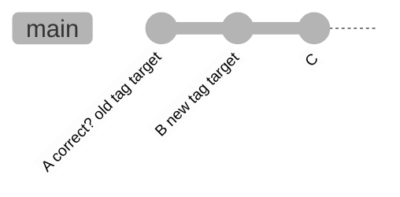
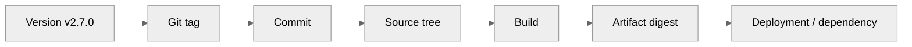
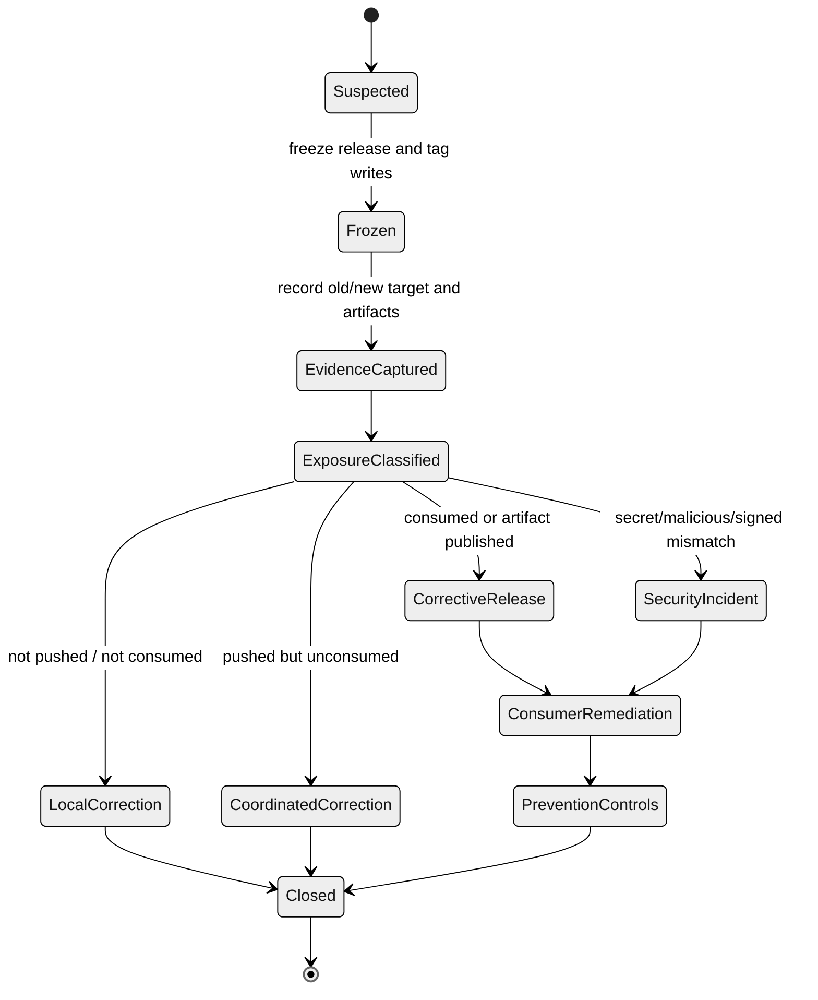

# Case Study: Release Tag Moved

A release tag moved adalah incident supply-chain, bukan sekadar “tag salah”.

Dalam Git, tag adalah ref. Ref bisa dibuat, dihapus, dan dalam kondisi tertentu dipaksa menunjuk object lain. Secara budaya engineering, release tag sering diperlakukan immutable. Tetapi secara mekanisme Git mentah, tag bukan benda sakral kecuali repository policy, hosting protection, dan release process membuatnya sakral.

Part ini membahas case study ketika tag `v2.7.0` yang sudah dipublish berubah dari commit `A` ke commit `B`.

---

## 1. Incident Summary

Skenario:

- project menerbitkan release `v2.7.0`;
- CI membangun artifact dari tag `v2.7.0`;
- artifact dipublish ke package registry;
- beberapa service internal pin dependency ke `v2.7.0`;
- satu maintainer menyadari tag menunjuk commit yang salah;
- maintainer delete dan recreate tag `v2.7.0` ke commit lain;
- beberapa consumer sudah fetch tag lama;
- beberapa consumer baru fetch tag baru;
- build reproducibility mulai pecah.

Graph konseptual:



Tag movement:

```text
refs/tags/v2.7.0: A -> B
```

Masalahnya bukan hanya commit mana yang benar. Masalahnya adalah dunia sekarang memiliki dua realitas:

- consumer lama percaya `v2.7.0 == A`;
- consumer baru percaya `v2.7.0 == B`;
- artifact registry mungkin berisi artifact dari A, B, atau campuran metadata;
- release notes mungkin menjelaskan range yang berbeda;
- SBOM/provenance mungkin menunjuk sumber yang tidak cocok dengan binary.

---

## 2. Core Invariant

Release identity harus immutable setelah dikonsumsi.

> Satu nama versi publik harus menunjuk satu source identity dan satu artifact identity.

Untuk Git release:

```text
version tag -> tag object/ref -> commit -> tree -> source archive -> build inputs -> artifact digest -> deployment
```

Jika tag bergerak, chain ini pecah.



Release tag moved membuat node `T -> C` tidak stabil. Semua downstream evidence setelahnya menjadi suspect.

---

## 3. Taxonomy of Tag Movement

Tidak semua tag movement punya severity sama.

| Case | Exposure | Default response |
|---|---:|---|
| Local tag only, not pushed | Low | Delete/recreate locally. No incident. |
| Pushed tag, no consumers, no artifact | Medium | Coordinate, correct once, record evidence. |
| Pushed tag, CI built artifact | High | Treat as release integrity issue. Prefer new version. |
| Public release consumed externally | Critical | Do not silently move. Publish corrective release. |
| Security-sensitive release | Critical | Incident response + provenance verification. |
| Package ecosystem dependency by tag | Critical | Consumer remediation and commit pin guidance. |

The dangerous threshold is **consumption**.

Once a tag has been fetched, built, deployed, mirrored, packaged, or referenced by dependency metadata, mutating it creates split-brain.

---

## 4. Detection Signals

A moved tag may be detected by:

- reproducible build mismatch;
- source archive checksum mismatch;
- `git fetch --tags` warning/rejection;
- package build suddenly changes without version bump;
- dependency lockfile resolves different commit;
- release artifact provenance mismatch;
- GitHub release/tag audit alert;
- internal mirror reports ref update;
- consumer reports tag object not matching attestation.

Useful commands:

```bash
# Local tag target
git rev-parse v2.7.0^{commit}

# Remote tag target
git ls-remote --tags origin 'v2.7.0*'

# Show tag object if annotated
git cat-file -t v2.7.0
git show --no-patch --decorate v2.7.0

# Verify signed tag if available
git tag -v v2.7.0

# Compare local vs remote
LOCAL=$(git rev-parse v2.7.0^{commit})
REMOTE=$(git ls-remote origin refs/tags/v2.7.0 | awk '{print $1}')
echo "local=$LOCAL remote=$REMOTE"
```

For annotated tags, there are two layers:

```text
tag ref -> tag object -> commit object
```

Peeling matters:

```bash
git ls-remote --tags origin 'v2.7.0*'
```

You may see:

```text
<tag-object-sha> refs/tags/v2.7.0
<commit-sha>     refs/tags/v2.7.0^{}
```

`^{}` is the peeled commit target.

---

## 5. Incident State Machine



---

## 6. Immediate Containment

Saat tag movement terdeteksi:

1. freeze release automation;
2. stop publishing artifacts for that version;
3. disable jobs that rebuild from mutable tag;
4. prevent further tag mutation;
5. capture evidence before anyone “fixes” it again.

Evidence capture:

```bash
mkdir -p incident-tag-v2.7.0

git fetch origin --tags

git rev-parse v2.7.0 > incident-tag-v2.7.0/local-tag.txt || true
git rev-parse v2.7.0^{commit} > incident-tag-v2.7.0/local-peeled-commit.txt || true

git ls-remote --tags origin 'v2.7.0*' > incident-tag-v2.7.0/remote-tag.txt

git show --no-patch --pretty=fuller v2.7.0 > incident-tag-v2.7.0/tag-show.txt || true
git for-each-ref refs/tags/v2.7.0 --format='%(refname) %(objecttype) %(objectname) %(creatordate:iso8601) %(taggername)' > incident-tag-v2.7.0/ref.txt || true
```

If artifacts exist:

```bash
sha256sum dist/* > incident-tag-v2.7.0/artifact-digests.txt
```

Record:

- original tag target if known;
- current tag target;
- who pushed mutation;
- CI run IDs;
- artifact digests;
- package registry publication timestamp;
- release notes timestamp;
- consumer dependency references;
- signed tag verification status.

---

## 7. Do Not Silently Retag Public Releases

The immature response:

```bash
git tag -f v2.7.0 <correct-commit>
git push --force origin v2.7.0
```

This may make the repository look correct for future consumers, but it breaks existing consumers.

A mature release policy says:

> If a release version has been consumed, do not reuse that version name for a different source identity. Publish a corrective version.

Examples:

- bad `v2.7.0` published from wrong commit;
- correct commit should become `v2.7.1` or `v2.7.0+metadata` depending ecosystem rules;
- release notes should explain `v2.7.0` is superseded;
- consumers should upgrade to corrective release;
- build systems should pin commit or artifact digest.

---

## 8. Correction Paths

### 8.1 Local-only Tag Mistake

If tag was never pushed:

```bash
git tag -d v2.7.0
git tag -a v2.7.0 <correct-commit> -m "Release v2.7.0"
```

No incident needed beyond local cleanup.

### 8.2 Pushed But Not Consumed

If pushed tag is confirmed unconsumed:

```bash
# Create explicit evidence branch before mutation
git branch evidence/bad-v2.7.0 <wrong-commit>
git push origin refs/heads/evidence/bad-v2.7.0

# Delete remote tag
git push origin :refs/tags/v2.7.0

# Recreate annotated tag
git tag -a v2.7.0 <correct-commit> -m "Release v2.7.0"
git push origin refs/tags/v2.7.0
```

This still requires communication:

```text
Tag v2.7.0 was corrected before artifact publication or external consumption.
Wrong target: <A>
Correct target: <B>
Evidence branch: evidence/bad-v2.7.0
Please run `git fetch --tags --force` if you fetched during the correction window.
```

### 8.3 Consumed Public Release

If tag was consumed, prefer corrective release:

```bash
# Do not move v2.7.0 again
# Create new patch version
git tag -a v2.7.1 <correct-commit> -m "Release v2.7.1: corrective release for v2.7.0 tag incident"
git push origin refs/tags/v2.7.1
```

Then publish release notes:

```md
## v2.7.1 Corrective Release

v2.7.0 was published from an incorrect Git tag target.
Do not use v2.7.0 for reproducible builds.

- v2.7.0 observed target: <A>
- intended source commit: <B>
- corrective release tag: v2.7.1
- artifact digest: <sha256>

Consumers should upgrade to v2.7.1 or pin commit <B> directly.
```

### 8.4 Malicious or Unknown Tag Movement

If tag moved without authorized release action:

- freeze all release credentials;
- audit token/user who pushed tag;
- rotate compromised credentials if needed;
- inspect CI runs triggered by tag;
- inspect package registry uploads;
- verify signatures/attestations;
- alert consumers;
- create security incident record;
- block tag force updates.

---

## 9. Commands for Tag Mutation: Know Them, But Prefer Not to Use Them Publicly

Delete local tag:

```bash
git tag -d v2.7.0
```

Delete remote tag:

```bash
git push origin :refs/tags/v2.7.0
```

Create annotated tag:

```bash
git tag -a v2.7.0 <commit> -m "Release v2.7.0"
```

Create signed tag:

```bash
git tag -s v2.7.0 <commit> -m "Release v2.7.0"
```

Push tag:

```bash
git push origin refs/tags/v2.7.0
```

Force-push tag:

```bash
git push --force origin refs/tags/v2.7.0
```

Safer explicit forced refspec:

```bash
git push origin +refs/tags/v2.7.0:refs/tags/v2.7.0
```

Use forced tag update only inside a controlled incident window and only if policy permits. It is a supply-chain-visible action.

---

## 10. Local Consumer Cleanup

If consumer fetched wrong tag, a normal fetch may not update it.

Consumer may need:

```bash
git fetch --tags --force origin
```

Or explicit deletion:

```bash
git tag -d v2.7.0
git fetch origin refs/tags/v2.7.0:refs/tags/v2.7.0
```

But if release was public, do not ask consumers to silently rewrite their tag cache as the only remediation. They need to know whether builds from old and new targets differ.

Consumer verification script:

```bash
EXPECTED_COMMIT="<expected-sha>"
ACTUAL_COMMIT=$(git rev-parse v2.7.0^{commit})

if [ "$ACTUAL_COMMIT" != "$EXPECTED_COMMIT" ]; then
  echo "Tag target mismatch: expected $EXPECTED_COMMIT got $ACTUAL_COMMIT" >&2
  exit 1
fi
```

Better dependency policy:

```text
production dependency = version + commit SHA + artifact digest
```

Not:

```text
production dependency = mutable tag name only
```

---

## 11. Artifact Mismatch Investigation

When a tag moves, compare artifacts.

Questions:

```text
[ ] Which commit produced package artifact?
[ ] Does artifact metadata embed Git SHA?
[ ] Does source archive digest match tag target?
[ ] Were release notes generated from old or new range?
[ ] Did SBOM/provenance point to old or new commit?
[ ] Did deployment use artifact from old or new tag?
[ ] Did dependency lockfiles capture tag name or commit hash?
```

Recommended build metadata:

```json
{
  "version": "2.7.0",
  "gitTag": "v2.7.0",
  "gitCommit": "abc123...",
  "gitTree": "def456...",
  "dirty": false,
  "artifactSha256": "...",
  "builtAt": "2026-07-07T00:00:00Z",
  "builder": "ci/release-pipeline"
}
```

Runtime endpoint:

```http
GET /version
```

Response:

```json
{
  "version": "2.7.0",
  "commit": "abc123...",
  "tag": "v2.7.0",
  "artifactSha256": "..."
}
```

Without this metadata, tag incident investigation becomes guesswork.

---

## 12. Signed Tags and What They Do Not Solve

Signed tags help detect unauthorized or altered release identity.

They prove:

- someone with signing key signed tag object;
- tag object content has not changed;
- tag points to a specific target object;
- verification can bind tag to a trusted key.

They do not automatically prove:

- the code is correct;
- build artifact was produced from the signed tag;
- signer was authorized by release policy;
- signing key was not compromised;
- tag ref was never moved to a different signed tag object.

Therefore signed tags should be combined with:

- protected tags;
- release branch protection;
- CI provenance;
- artifact digest verification;
- key lifecycle management;
- release approval workflow.

---

## 13. Protected Tags and Immutable Releases

Preventive controls:

```text
[ ] Only release bot can create refs/tags/v*.
[ ] No one can force-update release tags.
[ ] No one can delete release tags without break-glass approval.
[ ] Release tags must be annotated and signed.
[ ] Release job verifies tag points to expected commit.
[ ] Artifact metadata embeds commit SHA and tag.
[ ] Release notes include previous/current commit boundary.
[ ] Package registry upload requires artifact digest.
[ ] Consumers pin commit hash or artifact digest for critical dependencies.
```

Protected tag policy should be enforced server-side or by hosting platform. Client-side hooks are not enough because they can be bypassed and do not protect remote refs from another machine.

---

## 14. Release Tag Creation Playbook

Preferred release flow:

```bash
git switch main
git pull --ff-only origin main

# verify clean state
git status --porcelain=v2

# verify candidate commit
RELEASE_COMMIT=$(git rev-parse HEAD)

git tag -s v2.7.0 "$RELEASE_COMMIT" -m "Release v2.7.0"

git tag -v v2.7.0

git push origin refs/tags/v2.7.0
```

Then CI should verify:

```bash
EXPECTED_TAG="v2.7.0"
TAG_COMMIT=$(git rev-parse "$EXPECTED_TAG^{commit}")
HEAD_COMMIT=$(git rev-parse HEAD)

if [ "$TAG_COMMIT" != "$HEAD_COMMIT" ]; then
  echo "CI checkout mismatch: tag $EXPECTED_TAG points to $TAG_COMMIT but HEAD is $HEAD_COMMIT" >&2
  exit 1
fi
```

Release job should write manifest:

```text
version=v2.7.0
tag=v2.7.0
tag_object=<tag-object-sha>
commit=<commit-sha>
tree=<tree-sha>
artifact_sha256=<digest>
source_archive_sha256=<digest>
ci_run=<run-id>
```

---

## 15. Incident Report Template

```md
# Incident: Release tag v2.7.0 moved

## Summary
Tag `v2.7.0` changed target from `<old>` to `<new>`.

## Timeline
- T0: tag created at `<old>`
- T1: artifact built from `<old>`
- T2: tag moved to `<new>`
- T3: mismatch detected by `<system/person>`
- T4: release freeze started
- T5: corrective release published

## Exposure
- Artifact published: yes/no
- Production deployed: yes/no
- External consumers: yes/no/unknown
- Package registry: yes/no
- Internal mirrors: yes/no

## Evidence
- old tag target:
- new tag target:
- tag object:
- artifact digest:
- CI run:
- release notes:

## Root Cause
Why tag mutation was possible.

## Remediation
Corrective release / consumer notice / tag protection.

## Prevention
Protected tags, signed tags, release bot, provenance verification.
```

---

## 16. Hands-On Lab

Create repo.

```bash
rm -rf /tmp/git-moved-tag-lab
mkdir /tmp/git-moved-tag-lab
cd /tmp/git-moved-tag-lab

git init -b main

echo 'version 1' > app.txt
git add app.txt
git commit -m 'Release source A'
A=$(git rev-parse HEAD)

echo 'version 2' > app.txt
git add app.txt
git commit -m 'Release source B'
B=$(git rev-parse HEAD)
```

Create tag at old commit.

```bash
git tag -a v2.7.0 "$A" -m 'Release v2.7.0'

git show --no-patch v2.7.0
git rev-parse v2.7.0^{commit}
```

Move tag locally.

```bash
git tag -f -a v2.7.0 "$B" -m 'Release v2.7.0 corrected'

git show --no-patch v2.7.0
git rev-parse v2.7.0^{commit}
```

Observe:

- same tag name;
- different tag object;
- different peeled commit;
- consumers that saw first tag have different release identity.

Simulate consumer evidence:

```bash
echo "$A" > consumer-old-observed-v2.7.0.txt
echo "$B" > producer-current-v2.7.0.txt

diff -u consumer-old-observed-v2.7.0.txt producer-current-v2.7.0.txt || true
```

Takeaway:

> A moved tag creates two truths for the same version name.

---

## 17. Anti-Patterns

Avoid:

```bash
# Anti-pattern: silently move public release tag
git tag -f v2.7.0 <new-commit>
git push --force origin v2.7.0
```

Avoid:

```bash
# Anti-pattern: release artifacts without embedding commit SHA
```

Avoid:

```bash
# Anti-pattern: using branch or tag name only for production dependency identity
```

Avoid:

```bash
# Anti-pattern: deleting bad release evidence before investigation
```

Avoid:

```bash
# Anti-pattern: assuming signed tag means artifact came from that tag
```

---

## 18. Final Mental Model

A release tag is not just a Git convenience. It is a supply-chain anchor.

If a tag moves after consumption, the problem is not merely “which commit should the tag point to?” The problem is that the same release name may now resolve to different code for different consumers.

Mature release engineering treats public release identity as immutable:

- release tags are protected;
- release tags are annotated and signed;
- release artifacts embed commit metadata;
- release manifests record tag object, peeled commit, tree, artifact digest, and CI run;
- consumed bad releases are superseded by corrective versions, not silently rewritten;
- critical dependencies pin commit hash or artifact digest, not mutable names alone.

The top 1% Git engineer knows that Git permits many mutations that engineering systems should forbid.

---

## References

- Git documentation: `git tag`, annotated tags, signed tags, deletion, and replacement behavior.
- Git documentation: `git push`, refspecs, deletion syntax, and forced updates.
- Git documentation: `git rev-parse`, `git cat-file`, and object peeling syntax for tag verification.
- GitHub Docs: immutable releases and protected release/tag behavior.
