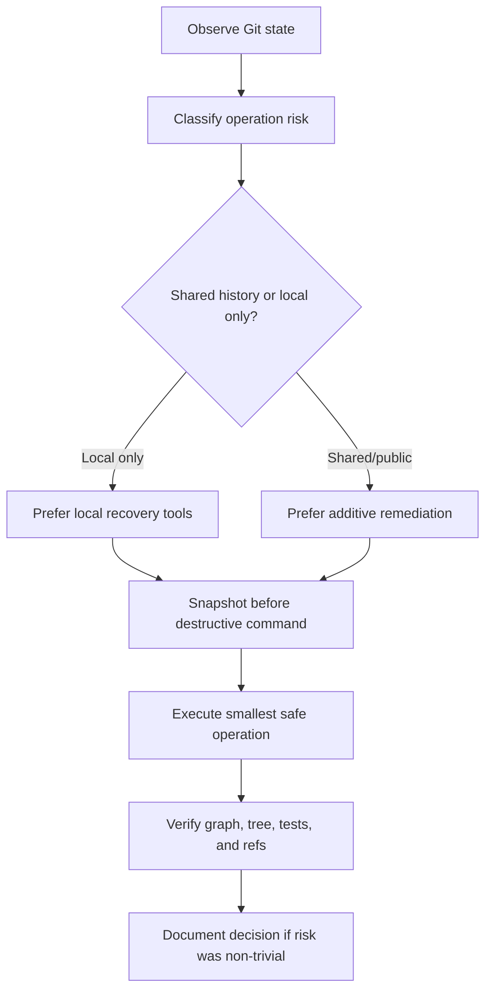
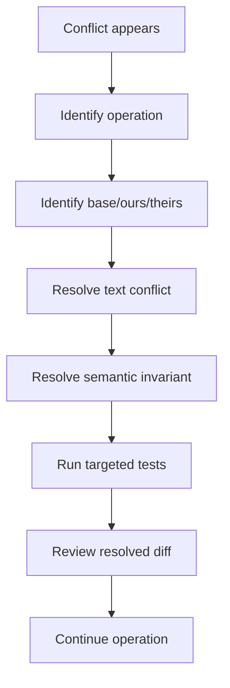
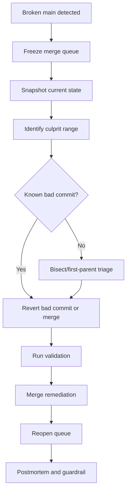
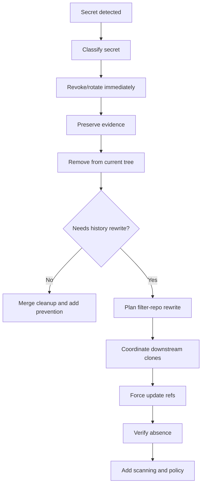
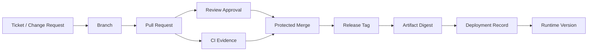
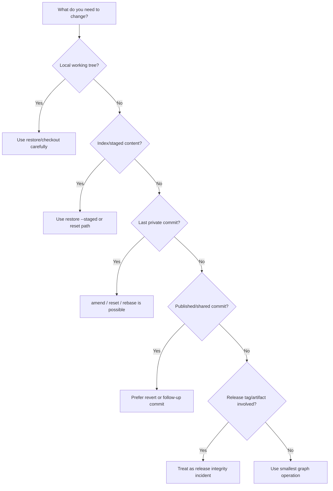

# Git Operational Checklists

> Git mastery is not only knowing commands. Git mastery is being able to enter any repository state, classify it, choose the lowest-risk operation, preserve evidence, and leave the system more understandable than before.

This part converts the entire series into operational checklists.

The goal is not to memorize everything. The goal is to build **repeatable behavior** for high-risk Git moments:

- before starting work;
- before committing;
- before pushing;
- before rewriting history;
- before merging;
- before releasing;
- before deleting anything;
- before cleaning a workspace;
- before responding to incidents;
- before changing repository policy.

A checklist is useful only if it encodes real invariants. A weak checklist says:

> Run tests before merging.

A strong checklist says:

> Confirm the checked-out commit is the commit being tested, the merge base is current, required tags were fetched, generated files are either reproducible or intentionally committed, and the artifact records the source commit SHA and dirty-tree state.

That is the difference between ritual and operational control.

---

## 1. How to Use These Checklists

Do not run every checklist every day. Use them based on risk class.

| Situation | Checklist type | Why |
|---|---|---|
| Normal feature work | Lightweight daily checklist | Prevent local confusion. |
| Pull request ready | Reviewability checklist | Reduce reviewer load and hidden integration risk. |
| Rebase/amend/fixup | Rewrite checklist | Avoid losing commits or surprising reviewers. |
| Force push | Lease and communication checklist | Prevent overwriting teammate work. |
| Merge to main | Integration checklist | Keep shared branch healthy. |
| Release | Release identity checklist | Preserve reproducibility and audit evidence. |
| Production hotfix | Hotfix/backport checklist | Control cross-version patch drift. |
| Broken main | Incident checklist | Restore shared integration contract safely. |
| Secret leak | Security incident checklist | Rotate first, rewrite second. |
| Large repo slowdown | Repository health checklist | Diagnose before blindly running destructive maintenance. |

The common pattern is:



---

## 2. Universal Safety Invariants

These invariants apply across all Git workflows.

### 2.1 Identity Invariants

| Invariant | Meaning |
|---|---|
| A commit hash identifies content and ancestry. | If tree, parent, author, committer, or message changes, commit identity changes. |
| A branch is movable. | It is not a release identity unless policy makes it so. |
| A tag can be moved unless protected by policy. | A tag name alone is not immutable proof. |
| An annotated/signed tag is stronger than a lightweight tag. | It adds tag object metadata and possibly signature verification. |
| Runtime artifact must record source commit. | Otherwise incident forensics becomes guesswork. |

### 2.2 State Invariants

| Invariant | Meaning |
|---|---|
| Working tree is not the index. | `git status` must be read as two comparisons: index vs `HEAD`, working tree vs index. |
| Index is not just staging. | It also holds conflict stages and performance metadata. |
| `HEAD` may be detached. | Detached state is valid but dangerous if you expect branch movement. |
| Reflog is local. | It is a local recovery aid, not shared audit evidence. |
| Untracked files are not in Git. | `git clean` can destroy them permanently. |

### 2.3 Collaboration Invariants

| Invariant | Meaning |
|---|---|
| Public history should usually be remediated additively. | Revert, follow-up commit, or corrective release is safer than rewrite. |
| Private history may be rewritten. | But only before other people depend on it. |
| Force push must use lease unless intentionally overwriting. | `--force-with-lease` protects against stale local assumptions. |
| Merge policy is workflow architecture. | Squash, rebase, and merge commits optimize different properties. |
| PR diff is not the whole truth. | Merge-base drift and generated files can hide risk. |

### 2.4 Release Invariants

| Invariant | Meaning |
|---|---|
| A release must map to an immutable source identity. | Usually annotated/signed tag + commit SHA + artifact digest. |
| Build artifact must be promoted, not rebuilt silently. | Rebuild changes evidence and may change bits. |
| Release notes need explicit boundaries. | `previous_tag..current_tag`, not vague branch state. |
| Hotfix must have version coverage. | Know which maintained versions need the fix. |
| Bad tag is supply-chain incident, not cosmetic error. | Consumers may already have fetched or built from it. |

---

## 3. Daily Start Checklist

Use this at the beginning of a work session.

```bash
# Where am I?
git status --short --branch

# What commit am I on?
git rev-parse --short HEAD

# Am I on a branch?
git symbolic-ref --short -q HEAD || echo "DETACHED HEAD"

# What is my upstream relationship?
git branch -vv

# What remotes exist?
git remote -v
```

Checklist:

- [ ] I know the current branch or detached `HEAD` state.
- [ ] I know whether the working tree is clean, dirty, conflicted, sparse, shallow, or partial.
- [ ] I know the upstream branch.
- [ ] I know whether local branch is ahead/behind/diverged.
- [ ] I have fetched before making integration decisions.
- [ ] I am not starting work from a stale base unless intentionally doing so.
- [ ] I am not carrying unrelated local changes from yesterday.

Safer daily refresh:

```bash
git fetch --prune --tags

git status --short --branch
```

For teams using trunk-based development:

```bash
git switch main
git pull --ff-only
git switch -c feature/<ticket>-<short-name>
```

For existing branch:

```bash
git fetch --prune

git merge-base --is-ancestor origin/main HEAD \
  && echo "Branch contains origin/main" \
  || echo "Branch may need refresh"
```

Important: `pull` is not automatically safe. It is `fetch + integrate`. Prefer explicit configuration:

```bash
git config --global pull.ff only
```

---

## 4. New Branch Checklist

Before creating a branch:

- [ ] The base branch is correct.
- [ ] The base branch is current.
- [ ] The branch name encodes purpose, not implementation noise.
- [ ] The work has a bounded scope.
- [ ] The target branch is known.
- [ ] The branch will not live longer than the team's branch lifetime budget.

Commands:

```bash
git switch main
git pull --ff-only
git switch -c feature/REG-1842-case-escalation-timeout
```

Good names:

```text
feature/REG-1842-escalation-timeout
fix/REG-2210-permission-cache-invalidation
chore/SEC-1042-upgrade-oauth-library
hotfix/INC-7782-null-case-owner
backport/v2.8/SEC-1042-oauth-library
```

Weak names:

```text
update-code
final-fix
new-branch
john-work
misc-changes
```

Naming rule:

> A branch name should help a reviewer or incident responder understand why the branch exists without opening the diff.

---

## 5. Pre-Commit Checklist

Before committing:

```bash
git status --short
git diff
git diff --staged
```

Checklist:

- [ ] The staged diff is the commit I intend to create.
- [ ] The unstaged diff is intentionally excluded.
- [ ] No debug logs, test credentials, local config, or generated garbage are staged.
- [ ] New files are intentionally tracked.
- [ ] Deleted files are intentional.
- [ ] Renames are reviewable.
- [ ] Binary changes are expected.
- [ ] Lockfile changes match dependency changes.
- [ ] Migration changes include rollback/forward strategy where needed.
- [ ] Tests or verification commands were run at the right scope.

Partial staging:

```bash
git add -p

git diff --staged

git commit
```

For suspicious files:

```bash
git diff --staged --stat

git diff --staged --name-status

git diff --staged --check
```

`git diff --check` helps catch whitespace errors, but it is not semantic validation.

---

## 6. Commit Message Checklist

A commit message should answer:

1. What changed?
2. Why did it change?
3. What constraint or incident caused it?
4. What should future maintainers know?
5. What evidence links it to review, ticket, release, or policy?

Template:

```text
<area>: <imperative summary>

<why this change exists>

<important design/operational notes>

Refs: REG-1842
Risk: medium
Test: ./gradlew test --tests EscalationTimeoutTest
```

Checklist:

- [ ] Subject is specific and imperative.
- [ ] Body explains causal context for non-trivial changes.
- [ ] Security, migration, compatibility, or release impact is explicit.
- [ ] Test evidence is mentioned if useful.
- [ ] Ticket/reference trailer is included when required.
- [ ] The message does not merely repeat the diff.

Weak:

```text
fix bug
```

Better:

```text
case-workflow: expire pending escalation after SLA window

Pending escalations were staying active when their SLA timer elapsed
without an assignee. This blocked later escalation attempts because the
workflow still observed an active escalation edge.

Refs: REG-1842
Test: EscalationTimeoutPolicyTest
```

---

## 7. Pre-Push Checklist

Before pushing:

```bash
git status --short --branch
git log --oneline --decorate --graph --max-count=20
```

Checklist:

- [ ] I know what branch I am pushing.
- [ ] I know what remote ref will be updated.
- [ ] I am not accidentally pushing to `upstream` instead of fork/origin.
- [ ] My branch is not behind its upstream in a way that will surprise me.
- [ ] I am not pushing WIP commits to a protected or shared branch unless expected.
- [ ] I did not accidentally include local-only commits.
- [ ] If rewriting, I am using `--force-with-lease`, not blind `--force`.

Safer first push:

```bash
git push -u origin HEAD
```

Safer rewrite push:

```bash
git fetch origin

git push --force-with-lease origin HEAD
```

Even safer explicit lease:

```bash
expected=$(git rev-parse origin/my-branch)
git push --force-with-lease=refs/heads/my-branch:$expected origin HEAD:my-branch
```

---

## 8. Pull Request Readiness Checklist

Before opening or marking PR ready:

- [ ] PR has one clear integration purpose.
- [ ] Branch target is correct.
- [ ] Diff base is current enough for review.
- [ ] PR title explains the change at integration level.
- [ ] Description explains why, not only what.
- [ ] Testing evidence is included.
- [ ] Migration/deployment steps are explicit.
- [ ] Rollback/revert strategy is known.
- [ ] Sensitive files have correct reviewers.
- [ ] Generated files are justified.
- [ ] Binary/LFS/submodule changes are visible and intentional.
- [ ] Commit series is reviewable or PR is intentionally squash-merged.

Diagnostic commands:

```bash
git fetch origin

git diff --stat origin/main...HEAD

git diff --name-status origin/main...HEAD

git log --oneline --decorate origin/main..HEAD

git range-diff origin/main...HEAD@{1} origin/main...HEAD 2>/dev/null || true
```

PR description template:

```md
## What changed

## Why

## Risk

## Verification

## Deployment / migration notes

## Rollback

## Review focus
```

Review focus examples:

```text
Please focus on the escalation state transition invariant and not on generated OpenAPI changes.
```

```text
The risky part is the cache invalidation condition in PermissionSnapshotStore.
```

---

## 9. Code Review Checklist

For reviewers:

- [ ] Is the PR boundary coherent?
- [ ] Does the diff hide generated or renamed code?
- [ ] Are tests validating the behavior that changed?
- [ ] Are security-sensitive paths covered by owners?
- [ ] Does the change alter API, schema, permission, workflow, or deployment semantics?
- [ ] Is rollback possible?
- [ ] Does the PR introduce long-lived branch dependency?
- [ ] Is the merge method appropriate?
- [ ] Does the PR require documentation, runbook, migration, or alert update?

Useful reviewer commands:

```bash
# Compare branch with merge base
git diff origin/main...feature-branch

# Show commits proposed by branch
git log --oneline origin/main..feature-branch

# Show first-parent integration history
git log --first-parent --oneline origin/main

# Detect moved code with low noise
git diff --color-moved origin/main...feature-branch

# Ignore whitespace if formatting-only change is claimed
git diff -w origin/main...feature-branch
```

Reviewer red flags:

| Red flag | Why it matters |
|---|---|
| PR title says refactor but behavior changes exist. | Semantic risk is hidden. |
| Huge rename + edit in same commit. | Review signal collapses. |
| Lockfile changed without dependency explanation. | Supply-chain drift. |
| Migration without rollback/compatibility note. | Release risk. |
| Auth/permission changes without owner review. | Security risk. |
| Generated files dominate diff. | Human review may miss source change. |
| PR branch is weeks old. | Integration assumptions are stale. |

---

## 10. Conflict Resolution Checklist

When Git reports conflicts:

```bash
git status

git ls-files -u
```

Checklist:

- [ ] I know which operation caused the conflict: merge, rebase, cherry-pick, revert, stash apply.
- [ ] I know which side is `ours` and which side is `theirs` for this operation.
- [ ] I inspected the base when semantic intent matters.
- [ ] I did not blindly choose `ours` or `theirs` for domain files.
- [ ] I resolved generated files using the generator if possible.
- [ ] I ran relevant tests after resolution.
- [ ] I reviewed the final resolved diff.

Conflict inspection:

```bash
# Show unmerged stages
git ls-files -u

# Inspect versions
git show :1:path/to/file   # base
git show :2:path/to/file   # ours
git show :3:path/to/file   # theirs
```

After resolving:

```bash
git add path/to/file

git diff --staged
```

For rebase/cherry-pick:

```bash
git rebase --continue
# or
git cherry-pick --continue
```

Abort only if you intend to abandon the operation:

```bash
git rebase --abort
# or
git merge --abort
# or
git cherry-pick --abort
```

Mental model:



---

## 11. Rebase Checklist

Before rebase:

- [ ] Branch is private or rewrite has been coordinated.
- [ ] Working tree is clean or intentionally stashed.
- [ ] Current branch tip is backed up.
- [ ] Base branch has been fetched.
- [ ] I know whether merge topology should be preserved.
- [ ] I know how to abort and recover.

Backup:

```bash
git branch backup/$(git branch --show-current)-before-rebase
```

Rebase:

```bash
git fetch origin

git rebase origin/main
```

Interactive rebase:

```bash
git rebase -i origin/main
```

Preserve merges:

```bash
git rebase --rebase-merges origin/main
```

After rebase:

```bash
git range-diff origin/main...backup/my-branch-before-rebase origin/main...HEAD

git status --short --branch
```

Force push only with lease:

```bash
git push --force-with-lease origin HEAD
```

Recovery:

```bash
git reflog

git reset --hard HEAD@{<before-rebase>}
```

---

## 12. Force Push Checklist

Before force push:

- [ ] I fetched remote state recently.
- [ ] I know exactly which remote ref will be updated.
- [ ] Branch is not protected or shared without agreement.
- [ ] Reviewers know the branch was rewritten.
- [ ] A backup ref exists if this is risky.
- [ ] I am using `--force-with-lease`.

Commands:

```bash
git fetch origin

git branch backup/my-branch-before-force-push

git push --force-with-lease origin HEAD:my-branch
```

After force push:

```bash
git fetch origin

git rev-parse HEAD

git rev-parse origin/my-branch
```

Tell teammates:

```text
I rewrote feature/REG-1842 to squash review feedback.
New tip: <sha>
Old tip backup: backup/feature-REG-1842-before-rewrite
Please reset/rebase local copies before continuing work.
```

---

## 13. Merge to Main Checklist

Before merging to main:

- [ ] PR target branch is correct.
- [ ] Required checks ran on current branch head or merge queue candidate.
- [ ] Required reviewers approved after latest relevant changes.
- [ ] Sensitive paths have owners.
- [ ] No unresolved discussions remain.
- [ ] Branch is not stale relative to target branch, or merge queue will validate latest integration.
- [ ] Merge method matches policy.
- [ ] Rollback strategy is clear.

For merge commit policy:

```bash
git log --first-parent --oneline main
```

For squash policy:

- [ ] Squash commit message preserves PR context.
- [ ] Important commit-level rationale is not lost.
- [ ] Release notes tooling can still classify the change.

For rebase-merge policy:

- [ ] Commit series is clean and bisectable.
- [ ] Commits were not signed in a way that rewrite invalidated policy expectations.

---

## 14. Release Checklist

Before release:

- [ ] Release source commit is identified by full SHA.
- [ ] Release branch/tag strategy is known.
- [ ] Working tree is clean.
- [ ] Build uses exact commit, not mutable branch state.
- [ ] Required tags were fetched.
- [ ] Version file matches intended version.
- [ ] Release notes boundary is explicit.
- [ ] Artifact records source commit and build metadata.
- [ ] Artifact digest is recorded.
- [ ] Release tag is annotated and signed if policy requires it.
- [ ] Tag is protected/immutable after publication.

Commands:

```bash
git fetch --tags --prune

git status --porcelain=v2

git rev-parse --verify HEAD^{commit}

git describe --tags --always --dirty
```

Create annotated tag:

```bash
git tag -a v2.8.0 -m "Release v2.8.0"
```

Create signed tag:

```bash
git tag -s v2.8.0 -m "Release v2.8.0"
```

Verify tag:

```bash
git tag -v v2.8.0

git rev-parse v2.8.0^{commit}
```

Release notes:

```bash
git log --first-parent --oneline v2.7.0..v2.8.0

git shortlog -sne v2.7.0..v2.8.0
```

Release evidence bundle:

```yaml
release: v2.8.0
sourceCommit: <full-sha>
sourceTree: <tree-sha>
tagObject: <tag-object-sha>
artifactDigest: sha256:<digest>
ciRun: <run-id>
builderImage: <image-digest>
releaseNotesRange: v2.7.0..v2.8.0
approvedBy:
  - <reviewer>
```

---

## 15. Hotfix Checklist

Before hotfix:

- [ ] Incident severity and affected versions are known.
- [ ] Patch origin is known: main-first, release-branch-first, or emergency branch.
- [ ] Fix is minimal.
- [ ] Dependency commits are identified.
- [ ] Backport/forward-port direction is explicit.
- [ ] Version bump is decided.
- [ ] Rollback plan exists.
- [ ] Release evidence will record hotfix source commit.

Typical flow:

```bash
git switch release/2.8

git pull --ff-only

git switch -c hotfix/INC-7782-null-case-owner

# apply minimal fix

git commit -m "case-owner: handle missing owner during escalation"
```

Backport from main:

```bash
git switch release/2.8

git cherry-pick -x <fix-commit>
```

Forward-port to main if fix began on release branch:

```bash
git switch main

git pull --ff-only

git cherry-pick -x <hotfix-commit>
```

Hotfix anti-patterns:

| Anti-pattern | Consequence |
|---|---|
| Patch only release branch and forget main. | Regression returns in next release. |
| Cherry-pick without dependency analysis. | Compile passes but behavior is incomplete. |
| Rebuild from branch name only. | Artifact provenance is weak. |
| Move existing release tag. | Consumers face split-brain source identity. |

---

## 16. Backport Checklist

Before backport:

- [ ] Target maintenance branch is supported.
- [ ] Patch commit list is explicit and ordered.
- [ ] Each commit has dependency classification.
- [ ] Patch applies semantically, not just textually.
- [ ] `-x` is used unless policy says otherwise.
- [ ] Tests run against target branch, not main.
- [ ] Release notes mention affected version.

Manifest:

```yaml
backport: SEC-1042
sourceBranch: main
targetBranches:
  - release/2.8
  - release/2.7
commits:
  - sha: abc1234
    reason: core fix
  - sha: def5678
    reason: regression test
excluded:
  - sha: aaa9999
    reason: refactor-only dependency not needed
```

Execution:

```bash
git switch release/2.8

git pull --ff-only

git switch -c backport/2.8/SEC-1042

git cherry-pick -x abc1234 def5678
```

Verification:

```bash
git log --oneline release/2.8..HEAD

git range-diff main~5..main release/2.8..HEAD || true
```

---

## 17. Broken Main Incident Checklist

When main is broken:



Checklist:

- [ ] Freeze merges or merge queue.
- [ ] Capture current `main` tip.
- [ ] Announce incident channel.
- [ ] Determine whether failure is build, test, runtime, migration, config, secret, or infra.
- [ ] Prefer revert for shared history unless fix-forward is clearly safer.
- [ ] If reverting merge commit, identify mainline parent carefully.
- [ ] Validate remediation on current main candidate.
- [ ] Merge remediation with clear incident message.
- [ ] Reopen queue after green validation.
- [ ] Add guardrail that would have caught it.

Snapshot:

```bash
git fetch origin

git rev-parse origin/main

git log --first-parent --oneline -20 origin/main
```

Revert normal commit:

```bash
git revert <bad-commit>
```

Revert merge commit:

```bash
git show --summary <merge-commit>

git revert -m 1 <merge-commit>
```

Do not use `reset --hard` on published `main` as default incident response.

---

## 18. Bad Release Tag Checklist

When a release tag is wrong:

- [ ] Stop publishing artifacts for that tag.
- [ ] Determine whether tag was pushed publicly.
- [ ] Determine whether artifacts were built from it.
- [ ] Determine whether consumers may have fetched it.
- [ ] Capture old tag target and new intended target.
- [ ] Avoid silently moving public tag if possible.
- [ ] Prefer corrective version if exposure occurred.
- [ ] Protect tag pattern after incident.

Diagnosis:

```bash
git fetch --tags --force

git rev-parse v2.8.0

git rev-parse v2.8.0^{commit}

git cat-file -t v2.8.0

git tag -v v2.8.0 || true
```

Corrective release pattern:

```text
Bad:  v2.8.0 points to wrong commit and may be consumed.
Good: publish v2.8.1 with correct commit and document v2.8.0 as invalid/superseded.
```

If tag was local only:

```bash
git tag -d v2.8.0

git tag -a v2.8.0 <correct-commit> -m "Release v2.8.0"
```

If public exposure occurred, treat as release integrity incident, not cleanup.

---

## 19. Secret Leak Checklist

When a secret enters Git:



Checklist:

- [ ] Rotate/revoke credential before history rewrite.
- [ ] Capture where it appeared.
- [ ] Identify exposure window.
- [ ] Remove from current branch.
- [ ] Search all refs if necessary.
- [ ] Decide whether rewrite is needed.
- [ ] Notify affected clone owners before rewrite.
- [ ] Purge CI caches/artifacts/logs if they contain secret.
- [ ] Verify secret no longer appears in reachable history.
- [ ] Add prevention: secret scanning, hooks, CI gates, education.

Search:

```bash
git grep -n "SECRET_PATTERN" $(git rev-list --all)
```

Large repositories may require specialized scanning tooling.

Rewrite using `git filter-repo` requires separate operational planning and downstream coordination.

---

## 20. Repository Health Checklist

Run this periodically or when repo feels slow.

```bash
git status --short --branch

git count-objects -vH

git for-each-ref --format='%(refname:short) %(committerdate:iso8601)' refs/heads refs/remotes | head

git fsck --connectivity-only
```

Checklist:

- [ ] Loose object count is not exploding.
- [ ] Pack count is not excessive.
- [ ] Large blobs are known and intentional.
- [ ] Stale branches are pruned or archived.
- [ ] Release tags are protected and coherent.
- [ ] Commit-graph maintenance is enabled for large repos.
- [ ] Multi-pack-index/incremental repack is considered where needed.
- [ ] Sparse/partial clone profile exists for monorepo users.
- [ ] CI is not doing wasteful full clone when unnecessary.
- [ ] CI release jobs fetch tags/history when necessary.

Large blob scan:

```bash
git rev-list --objects --all \
  | git cat-file --batch-check='%(objecttype) %(objectname) %(objectsize) %(rest)' \
  | awk '$1 == "blob" {print $3, $4, $2}' \
  | sort -nr \
  | head -50
```

Maintenance:

```bash
git maintenance run

git gc --auto
```

Do not use aggressive history rewrite as first response to slowness. Diagnose first.

---

## 21. CI Checkout Checklist

For CI jobs:

- [ ] Job knows whether it needs full history.
- [ ] Job knows whether it needs tags.
- [ ] PR job knows whether to test head commit or merge result.
- [ ] Release job uses exact commit/tag.
- [ ] Shallow clone does not break changelog, merge-base, or affected-set logic.
- [ ] Submodules are initialized recursively if required.
- [ ] LFS files are fetched if required.
- [ ] Sparse checkout does not omit files needed by build/test.
- [ ] Build metadata records commit SHA and dirty state.

Profiles:

| CI job | Suggested checkout |
|---|---|
| Lint single PR | Shallow may be okay if no merge-base logic. |
| Affected-set monorepo job | Needs merge base and enough history. |
| Release notes | Needs tags and release boundary history. |
| Release build | Needs exact tag/commit, clean tree, tags, provenance. |
| Bisect job | Needs enough reachable history. |
| Submodule build | Needs recursive submodule checkout. |

Validation snippet:

```bash
git rev-parse --verify HEAD^{commit}

git status --porcelain=v2

git describe --tags --always --dirty || true
```

---

## 22. Large File / LFS Checklist

Before adding large files:

- [ ] File is source-like and reviewable, or intentionally binary.
- [ ] File changes over time at acceptable frequency.
- [ ] Repository size impact is known.
- [ ] CI and local workflows can fetch it.
- [ ] Artifact repository was considered.
- [ ] Git LFS was considered for large binary source assets.
- [ ] Generated artifacts are not committed unless required.
- [ ] `.gitattributes` tracks LFS patterns if used.

Check staged large files:

```bash
git diff --cached --numstat
```

Find large blobs:

```bash
git rev-list --objects --all \
  | git cat-file --batch-check='%(objecttype) %(objectname) %(objectsize) %(rest)' \
  | sort -k3nr \
  | head -20
```

Decision:

| File type | Usually belongs |
|---|---|
| Source code | Git |
| Small text config | Git |
| Generated build artifact | Artifact store |
| Large binary asset needed at build time | Git LFS or artifact store |
| Customer data dump | Not Git |
| Secret material | Not Git |

---

## 23. Submodule Checklist

Before adding or updating submodule:

- [ ] Dependency ownership is explicit.
- [ ] Submodule commit is reachable from its upstream.
- [ ] CI can fetch submodule recursively.
- [ ] Release process records submodule commit.
- [ ] Security review includes submodule repository.
- [ ] Developers know detached HEAD behavior.
- [ ] Update PR includes parent repo gitlink change and reason.

Commands:

```bash
git submodule status --recursive

git submodule update --init --recursive
```

Submodule update:

```bash
cd path/to/submodule
git fetch --tags
git checkout <commit-or-tag>
cd -
git add path/to/submodule
git commit -m "deps: update case-rules submodule to <sha>"
```

Failure mode:

> Parent repository points to a submodule commit that was never pushed to the submodule remote.

Verification:

```bash
cd path/to/submodule
git cat-file -e HEAD^{commit}
git branch -r --contains HEAD
```

---

## 24. Sparse / Partial Clone Checklist

Before enabling sparse or partial clone:

- [ ] Users understand missing working tree paths vs missing objects.
- [ ] Tooling supports sparse index if enabled.
- [ ] CI jobs that need full repository do not inherit developer sparse profile blindly.
- [ ] Offline workflows are considered.
- [ ] Lazy fetch storm risk is measured.
- [ ] Release jobs use full-enough checkout.

Sparse checkout:

```bash
git sparse-checkout init --cone

git sparse-checkout set services/case-api libs/workflow-core
```

Partial clone:

```bash
git clone --filter=blob:none <url>
```

Diagnostic:

```bash
git rev-parse --is-shallow-repository

git config --get remote.origin.promisor

git config --get remote.origin.partialclonefilter

git sparse-checkout list || true
```

---

## 25. Audit / Regulated Systems Checklist

For regulated or high-accountability systems:

- [ ] Protected branch rules are documented.
- [ ] Required approvals map to risk class.
- [ ] CODEOWNERS routes sensitive changes.
- [ ] CI checks produce durable evidence.
- [ ] Release tag is immutable and preferably signed.
- [ ] Artifact provenance records source commit and digest.
- [ ] Emergency change path exists and is auditable.
- [ ] History rewrite policy exists.
- [ ] Secret leak response procedure exists.
- [ ] Deployment record links artifact to release approval.
- [ ] Runtime version endpoint exposes commit/artifact identity.

Evidence chain:



Minimum release evidence:

```yaml
changeRequest: REG-1842
pr: 4217
sourceCommit: <sha>
releaseTag: v2.8.0
artifactDigest: sha256:<digest>
ciRun: <id>
approvals:
  - security-owner
  - workflow-owner
deployedAt: 2026-07-07T10:00:00+07:00
```

---

## 26. Dangerous Command Checklist

Before running any dangerous command:

```bash
git status --short --branch

git rev-parse --short HEAD
```

Create backup when uncertain:

```bash
git branch backup/before-dangerous-operation-$(date +%Y%m%d-%H%M%S)
```

Dangerous commands:

| Command | Danger |
|---|---|
| `git reset --hard` | Discards tracked working tree/index changes. |
| `git clean -fdx` | Deletes untracked and ignored files. |
| `git push --force` | Can overwrite remote work. |
| `git rebase` | Rewrites commit identity. |
| `git filter-repo` | Rewrites history broadly. |
| `git tag -f` | Moves release identity. |
| `git push --mirror` | Can overwrite/delete many remote refs. |
| `git branch -D` | Deletes local branch pointer. |

Safe pattern:

```bash
# 1. Observe
git status --short --branch

# 2. Backup
git branch backup/<name>

# 3. Dry run where possible
git clean -ndx

# 4. Execute scoped command, not broad command
git clean -fd -- path/to/generated-output
```

---

## 27. One-Page Decision Tree



Command selection:

| Goal | Prefer |
|---|---|
| Remove unstaged file edits | `git restore <path>` |
| Unstage file | `git restore --staged <path>` |
| Rewrite last private commit | `git commit --amend` |
| Reorder private commits | `git rebase -i` |
| Undo public commit | `git revert` |
| Recover lost local commit | `git reflog` then branch/reset |
| Apply fix to old release branch | `git cherry-pick -x` |
| Compare rewritten patch series | `git range-diff` |
| Find regression commit | `git bisect` |
| Diagnose repository object health | `git fsck`, `git count-objects` |

---

## 28. Final Operational Principle

A high-level engineer does not ask only:

> What Git command solves this?

A high-level engineer asks:

1. Which state will this command mutate?
2. Is the state local or shared?
3. Is the identity mutable or release-critical?
4. What evidence do we preserve?
5. How do downstream users recover?
6. What invariant prevents recurrence?

That is the bridge from Git usage to Git operational engineering.

---

## References

- Git documentation index: https://git-scm.com/docs
- Git workflows: https://git-scm.com/docs/gitworkflows
- Git hooks: https://git-scm.com/docs/githooks
- Git push: https://git-scm.com/docs/git-push
- Git revert: https://git-scm.com/docs/git-revert
- Git tag: https://git-scm.com/docs/git-tag
- Git sparse checkout: https://git-scm.com/docs/git-sparse-checkout
- Partial clone design: https://git-scm.com/docs/partial-clone
