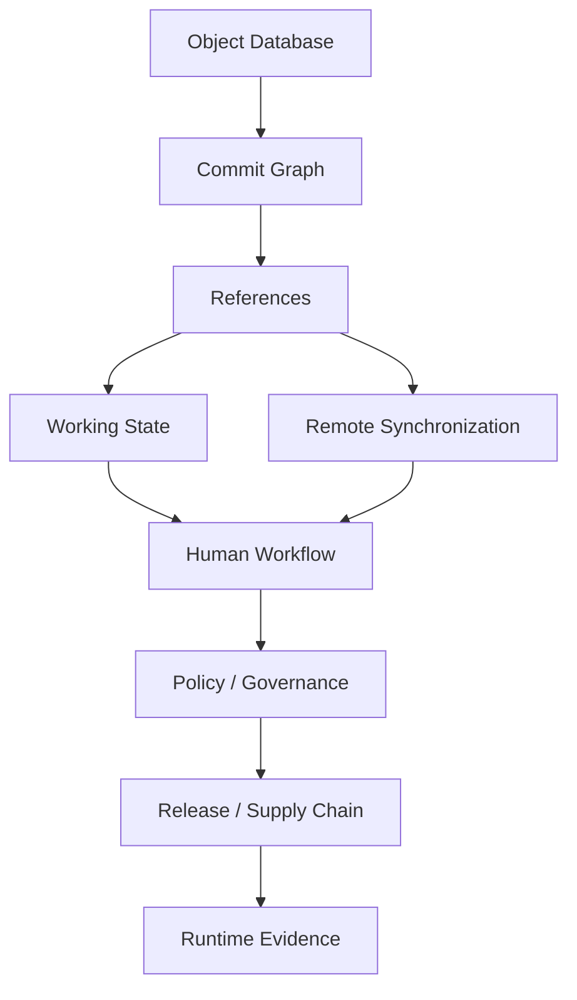
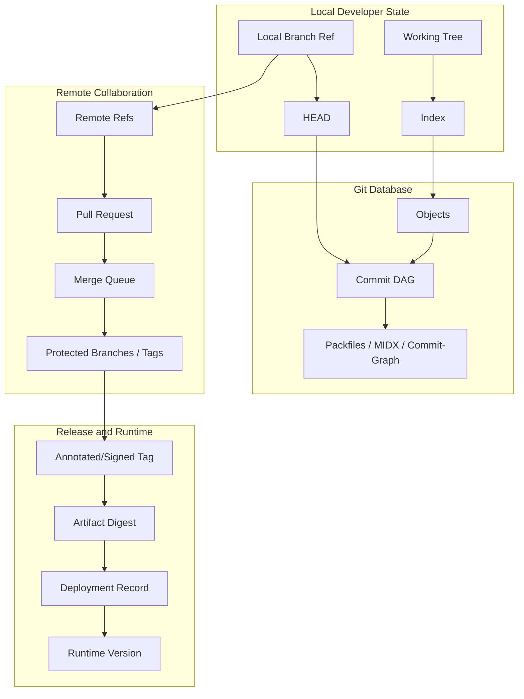

# Final Synthesis: Git Mastery Map

This is the final part of **Learn Git In Action**.

The series started from one correction:

> Git is not folder sync.

Git is a content-addressed object database with a commit graph, mutable references, local and remote state machines, storage optimization layers, and collaboration policies built on top.

From that model, everything else becomes less mysterious:

- `commit` writes a new graph node.
- `branch` moves a pointer.
- `tag` names an object.
- `merge` creates or advances integration topology.
- `rebase` replays changes and creates new commit identity.
- `revert` compensates public history with new evidence.
- `fetch` negotiates object graph state.
- `push` requests remote ref updates.
- `index` stages the next tree and stores conflict stages.
- `reflog` remembers local ref movement.
- `packfile` optimizes object storage.
- `commit-graph` optimizes graph traversal.
- `branch protection` turns repository references into governance boundaries.
- `release tag` becomes a supply-chain identity only when protected by policy and evidence.

That is the mental model.

Now this final part compresses the entire series into a mastery map.

---

## 1. The Core Model

A Git repository can be understood as five interacting layers:



| Layer | Main question | Main failure |
|---|---|---|
| Object database | What content exists? | Corruption, bloat, missing object, secret history. |
| Commit graph | What depends on what? | Wrong ancestry, stale merge-base, bad rebase. |
| References | What names point where? | Force push, moved tag, wrong branch, detached HEAD confusion. |
| Working state | What is staged/unstaged/conflicted? | Accidental commit, data loss, wrong conflict resolution. |
| Remote synchronization | What changed locally vs remotely? | Non-fast-forward, stale fetch, wrong remote, mirror damage. |
| Human workflow | How do people integrate safely? | Large PRs, long-lived branches, hidden review risk. |
| Policy/governance | What is allowed? | Bypass, weak checks, missing owner review. |
| Release/supply chain | What source produced artifact? | Mutable tag, unpinned dependency, unverifiable build. |
| Runtime evidence | What is deployed? | Artifact cannot be tied to commit/review/release. |

If you can place a problem into this map, you can usually solve it.

---

## 2. The 12 Git Mastery Invariants

### Invariant 1 — Commit Identity Is Content + Metadata + Ancestry

A commit hash is not just a diff hash.

It binds:

- tree;
- parent commit IDs;
- author;
- committer;
- timestamps;
- message;
- object format.

Therefore:

- amend changes commit ID;
- rebase changes commit ID;
- cherry-pick creates a different commit ID;
- revert creates a new commit ID;
- signed commit verification applies to that exact object.

### Invariant 2 — Branches Are Pointers, Not Containers

A branch does not contain commits.

A branch points to one commit. The visible branch history is computed by graph reachability from that tip.

Consequences:

- branch creation is cheap;
- branch deletion deletes a pointer, not immediately the objects;
- force push moves a remote pointer;
- `main` is only special because people and policy treat it as special.

### Invariant 3 — Tags Are Names Until Policy Makes Them Release Identity

A tag name alone is mutable.

A strong release identity requires:

- annotated or signed tag;
- protected tag namespace;
- artifact digest;
- source commit SHA;
- CI/build evidence;
- release notes boundary;
- immutability policy.

### Invariant 4 — Public History Should Prefer Additive Correction

When history is already shared, prefer:

- revert;
- follow-up fix;
- corrective release;
- documented exception.

Rewrite public history only when the risk of leaving history untouched is higher than the downstream disruption.

Secret leak is the canonical exception, and even then:

> Rotate first. Rewrite second.

### Invariant 5 — Merge and Rebase Optimize Different Properties

Merge preserves topology.

Rebase rewrites topology into a cleaner series.

Squash compresses review context into one commit.

No method is universally superior.

| Method | Optimizes | Loses / risks |
|---|---|---|
| Merge commit | Integration event, first-parent history | More graph complexity |
| Rebase merge | Linear commit series | Original commit identity |
| Squash merge | Simple main history | Commit-level rationale and bisect granularity |
| Fast-forward | No extra node | Less explicit integration boundary |

### Invariant 6 — Conflict Resolution Is Domain Work

A text conflict is only the visible symptom.

The real question is:

> Which combined state preserves the system invariant?

For regulated workflows, authorization systems, migrations, or release logic, conflict resolution must be reviewed like source design, not clerical cleanup.

### Invariant 7 — The Index Is an Operational Data Structure

The index is:

- proposed next tree;
- staging area;
- cache of file metadata;
- conflict stage holder;
- sparse-index participant;
- partial commit boundary.

Treating the index as “just staged files” is too shallow for advanced Git.

### Invariant 8 — Remote State Is Cached Locally Until Fetch

`origin/main` is not the remote server's live state.

It is your last fetched view.

Therefore:

- lease safety depends on fresh enough remote-tracking refs;
- merge-base decisions require fetch discipline;
- PR review may drift if base moved;
- CI must know whether it checks branch head or merge result.

### Invariant 9 — CI Checkout State Is Part of Correctness

A test result is meaningful only if you know what Git state was tested.

CI must record:

- commit SHA;
- PR head vs merge candidate;
- checkout depth;
- tags availability;
- submodule/LFS state;
- dirty tree state;
- sparse/partial/shallow state;
- artifact digest.

### Invariant 10 — Repository Performance Is Usually Shape, Not Just Size

Large repository pain comes from:

- number of paths;
- history depth;
- binary blob churn;
- ref count;
- pack fragmentation;
- commit graph traversal;
- CI clone pattern;
- generated files;
- submodules/LFS filters;
- tooling that scans everything.

Modern Git tools help:

- partial clone;
- sparse checkout;
- sparse index;
- commit-graph;
- multi-pack-index;
- reachability bitmaps;
- background maintenance;
- Scalar.

But tool adoption must follow diagnosis.

### Invariant 11 — Policy Must Live at the Right Layer

Client hooks are feedback.

Server hooks, branch protection, required checks, merge queues, CODEOWNERS, signed tag policy, and protected tags are enforcement.

Wrong layer examples:

- enforcing release tag immutability only with developer convention;
- relying on pre-commit hook for secret prevention;
- trusting PR title for security owner review;
- relying on shallow CI checkout for release notes.

### Invariant 12 — Git Evidence Must Connect to Runtime Reality

Git history is not enough.

For production systems, evidence chain must connect:

```text
change request -> branch -> PR -> review -> checks -> merge -> tag -> artifact -> deployment -> runtime version
```

Without this chain, Git is merely source history, not operational evidence.

---

## 3. The Mastery Ladder

### Level 0 — Command User

Can run:

```bash
git add
git commit
git push
git pull
```

Common failure:

- does not know what state changed;
- copies commands from StackOverflow;
- treats Git as backup/sync.

### Level 1 — Safe Individual Contributor

Can:

- read `git status`;
- create branches;
- stage partial changes;
- write useful commit messages;
- recover with reflog;
- avoid destructive commands.

Common growth area:

- understands local state but not graph/remote semantics deeply.

### Level 2 — Reviewable Contributor

Can:

- shape atomic commits;
- use `add -p`;
- use amend/fixup/autosquash;
- compare rewritten series with `range-diff`;
- design PRs that are easy to review.

Common growth area:

- still sees PR as UI object rather than integration contract.

### Level 3 — Integration Engineer

Can:

- reason about merge base;
- choose merge vs rebase;
- resolve conflicts semantically;
- manage stacked branches;
- avoid non-fast-forward damage;
- understand PR diff mechanics.

Common growth area:

- may not yet handle release/security workflows.

### Level 4 — Release-Safe Engineer

Can:

- manage release branches/tags;
- build reproducibly from commit/tag;
- backport safely;
- handle hotfixes;
- generate release notes from explicit ranges;
- preserve audit trail.

Common growth area:

- may not yet diagnose repository internals/performance.

### Level 5 — Repository Operator

Can:

- inspect `.git` layout;
- understand object storage;
- diagnose packfile/object/ref problems;
- run maintenance safely;
- use sparse/partial/scalar strategies;
- split/rewrite repository history with blast-radius control.

Common growth area:

- may not yet encode organizational policy.

### Level 6 — Workflow Architect

Can:

- design team Git workflow;
- set branch protection and merge queue strategy;
- define CODEOWNERS and review routing;
- design policies for regulated systems;
- create internal Git standards;
- build tooling and checkers.

Common growth area:

- continuous improvement, metrics, and socio-technical adoption.

### Level 7 — Git Platform Engineer

Can:

- build Git-aware tools;
- implement object walkers/diff/merge tooling;
- manage monorepo scale;
- design supply-chain provenance flows;
- run Git incidents;
- reason about Git server-side enforcement, protocol, and storage.

This is the level this series targets.

---

## 4. Mental Model Equations

These compact equations are useful in real work.

```text
commit = tree + parents + metadata + message
```

```text
branch = mutable ref -> commit
```

```text
tag = ref -> object
annotated tag = tag object -> target object
```

```text
working tree != index != HEAD
```

```text
pull = fetch + integrate
```

```text
merge = combine histories using merge base
```

```text
rebase = replay patches onto new base
```

```text
cherry-pick = replay selected patch as new commit
```

```text
revert = new commit that compensates old commit
```

```text
force push = remote ref movement without normal fast-forward guarantee
```

```text
force-with-lease = remote ref movement only if remote matches expected value
```

```text
release integrity = source identity + artifact identity + immutable evidence
```

```text
repository health = graph shape + object shape + ref shape + working tree shape + CI clone shape
```

---

## 5. Failure Mode Map

| Symptom | Likely layer | First diagnostic |
|---|---|---|
| Push rejected | Remote/ref semantics | `git fetch`, `git status -sb`, `git log --left-right --graph` |
| PR diff shows unrelated changes | Merge-base / branch target | `git merge-base`, `git diff base...HEAD` |
| Lost commit after reset | Local ref movement | `git reflog` |
| Main broken after merge | Integration/release | first-parent log, revert plan |
| Release artifact cannot be traced | Release evidence | source SHA, tag, artifact digest, CI run |
| Tag points to wrong commit | Ref integrity | `git rev-parse tag^{commit}`, `git tag -v` |
| Repo clone/status slow | Storage/working tree/performance | `count-objects`, sparse/partial analysis |
| Conflict keeps repeating | Integration workflow | `rerere`, branch lifetime, dependency chain |
| CI passes but main breaks | CI checkout/merge queue | test merge result, not stale branch head |
| Secret committed | Security incident | rotate, preserve evidence, remove/rewrite |
| Review misses behavior change | Diff signal | rename/edit split, generated file policy |
| Backport compiles but wrong behavior | Semantic dependency | patch dependency analysis |

---

## 6. The Git Decision Framework

Before choosing a command, answer seven questions.

### 6.1 What Object or Ref Am I Changing?

| Target | Examples |
|---|---|
| Working tree | `restore`, `checkout`, manual edit |
| Index | `add`, `restore --staged`, `reset <path>` |
| Local branch ref | `commit`, `reset`, `rebase`, `merge` |
| Remote branch ref | `push`, `push --force-with-lease` |
| Tag ref | `tag`, `push --tags`, `tag -f` |
| Object database | `hash-object`, `gc`, `repack`, `filter-repo` |
| Policy state | branch protection, hooks, rulesets |

### 6.2 Is It Local or Shared?

Local state can often be repaired with reflog.

Shared state requires coordination and evidence.

### 6.3 Is Identity Stable or Mutable?

| Identity | Stability |
|---|---|
| Commit SHA | Stable if object exists. |
| Branch name | Mutable. |
| Lightweight tag | Mutable unless protected. |
| Annotated/signed tag | Stronger object identity but ref still movable unless protected. |
| Artifact digest | Stable if artifact storage is immutable. |
| Release version | Only trustworthy when mapped to immutable evidence. |

### 6.4 Is There Downstream Dependency?

Downstream dependency includes:

- teammate branches;
- PR reviews;
- CI caches;
- release artifacts;
- customer deployments;
- submodules;
- vendor mirrors;
- fork users;
- audit records.

The more downstream dependency exists, the less acceptable silent rewrite becomes.

### 6.5 Can I Dry-Run or Snapshot?

Prefer:

```bash
git status --short --branch

git branch backup/<name>

git clean -n

git push --dry-run
```

### 6.6 Can I Verify After?

Verification examples:

```bash
git rev-parse --verify HEAD^{commit}

git diff --check

git fsck --connectivity-only

git tag -v v2.8.0

git merge-base --is-ancestor <base> <tip>
```

### 6.7 What Invariant Prevents Recurrence?

A fix without guardrail is incomplete.

Examples:

| Incident | Guardrail |
|---|---|
| Bad merge to main | Merge queue + current merge-result CI |
| Secret committed | Secret scanning + pre-receive gate |
| Bad release tag | Protected tags + release verifier |
| Long-lived branch conflict debt | Branch lifetime policy + restack tooling |
| Large binary committed | Size gate + LFS/artifact policy |
| Wrong CODEOWNER missing review | Sensitive path CODEOWNERS + required owner review |

---

## 7. Phase-by-Phase Mastery Recap

### Phase 1 — Git Mental Model

You learned Git as a content-addressed database with:

- blobs;
- trees;
- commits;
- tags;
- refs;
- index;
- working tree;
- reachability.

Core skill:

> Read repository state before mutating it.

### Phase 2 — Commit Craftsmanship

You learned commit design:

- atomic commits;
- useful messages;
- patch shaping;
- amend/fixup/autosquash;
- range-diff;
- cherry-pick;
- revert.

Core skill:

> Shape history into reviewable, reversible, explainable units.

### Phase 3 — Branching and Integration

You learned:

- branch as pointer;
- merge-base;
- fast-forward;
- merge strategy;
- conflicts;
- rerere;
- rebase;
- topology preservation;
- merge vs rebase decision.

Core skill:

> Treat integration as graph engineering plus domain validation.

### Phase 4 — Undo and Recovery

You learned:

- reset/restore/checkout/revert;
- reflog;
- fsck;
- stash internals;
- clean safety;
- force-push recovery;
- broken main and bad tag playbooks.

Core skill:

> Recover without making the incident larger.

### Phase 5 — Remote Collaboration

You learned:

- remotes;
- refspecs;
- fetch negotiation;
- pull semantics;
- push semantics;
- forks/upstreams;
- multi-remote enterprise workflows;
- submodules/subtree/monorepo trade-offs.

Core skill:

> Know which ref is local, cached, remote, protected, mirrored, or dependency-pinned.

### Phase 6 — PRs and Governance

You learned:

- PR as integration contract;
- reviewable branch design;
- stacked branches;
- diff mechanics;
- protected branches;
- merge queues;
- CODEOWNERS;
- human factors.

Core skill:

> Design workflows that reduce human error instead of blaming humans after error.

### Phase 7 — Release Engineering

You learned:

- release branching;
- version tags;
- hotfix/backport/forward-port;
- cherry-pick trains;
- release candidate flow;
- revert strategy;
- SemVer boundaries;
- build reproducibility.

Core skill:

> Make release identity explicit, immutable, and auditable.

### Phase 8 — Internals

You learned:

- `.git/` layout;
- loose objects;
- packfiles;
- commit-graph;
- MIDX;
- bitmaps;
- ref storage;
- revision language;
- pathspecs;
- attributes;
- hooks.

Core skill:

> Debug Git by understanding the database and metadata structures beneath porcelain commands.

### Phase 9 — Scale and Monorepo Operations

You learned:

- large repo failure modes;
- maintenance/gc/repack;
- incremental MIDX;
- partial clone;
- sparse checkout/index;
- Scalar;
- shallow clone trade-offs;
- monorepo strategy;
- LFS/artifact boundaries;
- repository splitting/history rewrite.

Core skill:

> Optimize repository shape and workflow shape, not just command syntax.

### Phase 10 — Debugging and Forensics

You learned:

- bisect;
- blame;
- pickaxe;
- regression debugging;
- sensitive change audit;
- diff algorithms;
- rename/copy review risk;
- time-based analysis;
- unknown repo forensics.

Core skill:

> Use history as causal evidence, not trivia.

### Phase 11 — Security and Supply Chain

You learned:

- signed commits/tags;
- branch protection as security control;
- secret leak response;
- rewrite risk;
- tag mutability;
- dependency pinning;
- third-party repo safety;
- Git policy as code.

Core skill:

> Bind source identity, trust policy, and artifact provenance.

### Phase 12 — Workflow Architecture

You learned:

- team workflow design;
- trunk-based development;
- GitFlow trade-offs;
- environment branch anti-pattern;
- long-lived branch risk;
- freeze models;
- regulated workflows;
- engineering handbook standards.

Core skill:

> Treat Git workflow as architecture, not personal preference.

### Phase 13 — Automation and DX

You learned:

- aliases;
- templates;
- client hooks;
- server hooks;
- CI Git state;
- release notes;
- Git metadata observability;
- internal workflow CLI.

Core skill:

> Encode safe behavior into tools while keeping Git state visible.

### Phase 14 — Implementation Labs

You built:

- mini object store;
- mini commit walker;
- mini diff engine;
- mini merge engine;
- mini reflog recovery tool;
- repo health analyzer;
- branch policy checker;
- release integrity verifier.

Core skill:

> Internalize Git by implementing simplified versions of its mechanisms.

### Phase 15 — Case Studies and Playbooks

You studied:

- small team to platform team;
- monorepo at scale;
- regulatory case management platform;
- secret leak/history rewrite;
- bad merge to main;
- moved release tag;
- operational checklists.

Core skill:

> Apply Git thinking under real operational pressure.

---

## 8. Anti-Pattern Map

| Anti-pattern | Root misunderstanding | Better model |
|---|---|---|
| “Just pull” | Pull is treated as magic sync. | Pull = fetch + integrate. Choose integration mode. |
| Blind `git push --force` | Remote branch treated as personal pointer. | Remote ref may be shared. Use lease and coordinate. |
| Environment branches | Branches confused with deployment environments. | Promote immutable artifacts across environments. |
| Moving release tag | Tag name treated as harmless label. | Release tag is source identity. Use corrective version. |
| Giant PR | Review treated as rubber stamp. | PR is integration contract; reduce scope. |
| Long-lived feature branch | Integration postponed. | Integrate early with flags/abstraction. |
| Rebase shared branch | Clean history valued above shared identity. | Rewrite private history only. |
| Commit secret then delete file | Current tree confused with history. | Rotate secret and remove from reachable history if needed. |
| Commit large generated artifacts | Git used as artifact store. | Use artifact store or LFS when justified. |
| Shallow CI everywhere | Clone speed valued over correctness. | Checkout depth depends on job semantics. |
| Conflict resolved by choosing side | Text result confused with domain correctness. | Validate combined invariant. |
| Hooks as only policy | Local feedback confused with enforcement. | Enforce at protected refs/server/CI. |

---

## 9. Final Mastery Exercises

You are ready to claim advanced Git fluency if you can answer these without guessing.

### Exercise 1 — Lost Commit

You ran:

```bash
git reset --hard origin/main
```

Then realized your last two local commits disappeared.

Questions:

- Which state moved?
- Are commits necessarily deleted?
- Which command finds prior branch tips?
- How do you recover without rewriting remote history?

Expected direction:

```bash
git reflog

git branch recover/<name> <old-sha>
```

### Exercise 2 — Push Rejected

Your push to a feature branch is rejected as non-fast-forward.

Questions:

- Is this always bad?
- What does your local `origin/branch` represent?
- How do you inspect divergence?
- When is rebase appropriate?
- When is merge appropriate?
- When is force-with-lease appropriate?

Expected direction:

```bash
git fetch origin

git log --oneline --left-right --graph HEAD...origin/my-branch
```

### Exercise 3 — PR Diff Looks Wrong

A PR shows unrelated commits.

Questions:

- What is the target branch?
- What is the merge base?
- Was branch created from wrong base?
- Was target branch changed?
- Is this a two-dot vs three-dot misunderstanding?

Expected direction:

```bash
git merge-base origin/main HEAD

git diff origin/main...HEAD

git log origin/main..HEAD
```

### Exercise 4 — Bad Main

Main broke after a merge commit.

Questions:

- Should you reset main?
- How do you inspect first-parent history?
- What does `git revert -m 1` mean?
- How do you preserve incident evidence?
- What guardrail prevents recurrence?

Expected direction:

```bash
git log --first-parent --oneline origin/main

git revert -m 1 <merge-commit>
```

### Exercise 5 — Bad Release Tag

A release tag points to the wrong commit and was pushed.

Questions:

- Was artifact published?
- Did consumers fetch/build it?
- Is moving the tag acceptable?
- Should you publish corrective version?
- How do you protect tags afterward?

Expected direction:

```bash
git rev-parse vX.Y.Z^{commit}

git tag -v vX.Y.Z
```

### Exercise 6 — Secret Leak

A credential was committed to main two days ago.

Questions:

- What is first action?
- Why is deleting the file not enough?
- When is rewrite necessary?
- Who must coordinate after rewrite?
- Which caches/artifacts/logs may contain the secret?

Expected direction:

```text
revoke/rotate -> preserve evidence -> remove current tree -> decide rewrite -> coordinate downstream -> verify -> prevent
```

### Exercise 7 — Slow Monorepo

Developers complain `status` and `clone` are slow.

Questions:

- Is the issue object size, path count, ref count, pack shape, filters, or CI clone pattern?
- Would sparse checkout help?
- Would partial clone help?
- Would commit-graph/MIDX maintenance help?
- Are large binaries the real problem?

Expected direction:

```bash
git count-objects -vH

git sparse-checkout list

git config --get remote.origin.partialclonefilter
```

### Exercise 8 — Regulated Release

Auditor asks which source produced a deployed artifact.

Questions:

- Can runtime report commit SHA?
- Is release tag immutable/signed?
- Is artifact digest recorded?
- Can you find PR approval and CI evidence?
- Can you prove deployment used that artifact?

Expected direction:

```text
source commit -> PR -> checks -> tag -> artifact digest -> deployment record -> runtime version
```

---

## 10. What “Top 1% Git Skill” Actually Means

It does not mean knowing every flag.

It means:

1. You can model Git state precisely.
2. You can avoid destructive operations under pressure.
3. You can recover when someone else breaks history.
4. You can design commit/PR/release flows that scale across teams.
5. You can make Git evidence useful for audit, debugging, and production operations.
6. You can diagnose large repository performance without superstition.
7. You can encode policy into tooling and governance.
8. You can teach others the model without giving them a bag of commands.

A top engineer uses Git as:

- database;
- graph;
- protocol;
- workflow substrate;
- release identity system;
- forensic tool;
- organizational control plane.

---

## 11. Suggested Next Learning Path

After this series, the most valuable advanced paths are:

### Path A — Git Protocol and Server Internals

Study:

- protocol v2;
- upload-pack / receive-pack;
- pack negotiation;
- server-side hooks;
- protected refs;
- Git hosting internals;
- repository mirroring;
- bare repository operations.

Build:

- mini Git server receiving push simulation;
- pre-receive policy engine;
- object negotiation visualizer.

### Path B — JGit / libgit2 / Native Tooling

Study:

- JGit object model;
- libgit2 APIs;
- repository walkers;
- diff APIs;
- index APIs;
- credential handling;
- performance trade-offs vs shelling out to Git.

Build:

- internal repository analyzer;
- PR diff risk classifier;
- release verifier integrated into CI.

### Path C — Monorepo Build Systems

Study:

- affected target detection;
- dependency graph;
- remote cache;
- hermetic builds;
- sparse checkout profiles;
- partial clone behavior;
- merge queue scaling.

Build:

- Git-aware affected-test selector;
- monorepo ownership and hotspot dashboard.

### Path D — Supply Chain and Provenance

Study:

- SLSA;
- in-toto attestations;
- Sigstore/cosign;
- signed commits/tags;
- artifact immutability;
- SBOM;
- dependency pinning;
- release evidence bundles.

Build:

- release provenance generator;
- artifact-to-Git evidence verifier.

### Path E — Workflow Architecture and Engineering Governance

Study:

- trunk-based development;
- branch protection/rulesets;
- merge queues;
- review routing;
- incident response;
- regulated change management;
- policy-as-code.

Build:

- engineering handbook generator;
- Git workflow maturity scanner;
- exception workflow audit log.

---

## 12. Final Synthesis Diagram



This is the full system.

A weak Git user sees only:

```text
files -> commit -> push
```

An advanced engineer sees:

```text
working state -> object identity -> graph topology -> ref mutation -> remote negotiation -> review contract -> protected integration -> release evidence -> runtime provenance
```

---

## 13. The Final Rule

When uncertain, slow down and ask:

> What identity am I changing, who else depends on it, and how will we prove the result afterward?

That question prevents most severe Git mistakes.

---

## 14. Series Completion

This is the final part of the series.

The series completes at:

```text
learn-git-part-126-final-synthesis-git-mastery-map.mdx
```

Status:

```text
Learn Git In Action: COMPLETE
Parts: 001–126
```

---

## References

- Git documentation index: https://git-scm.com/docs
- Git workflows: https://git-scm.com/docs/gitworkflows
- Git revisions: https://git-scm.com/docs/gitrevisions
- Git diff: https://git-scm.com/docs/git-diff
- Git merge: https://git-scm.com/docs/git-merge
- Git rebase: https://git-scm.com/docs/git-rebase
- Git push: https://git-scm.com/docs/git-push
- Git tag: https://git-scm.com/docs/git-tag
- Git maintenance: https://git-scm.com/docs/git-maintenance
- Git hooks: https://git-scm.com/docs/githooks
