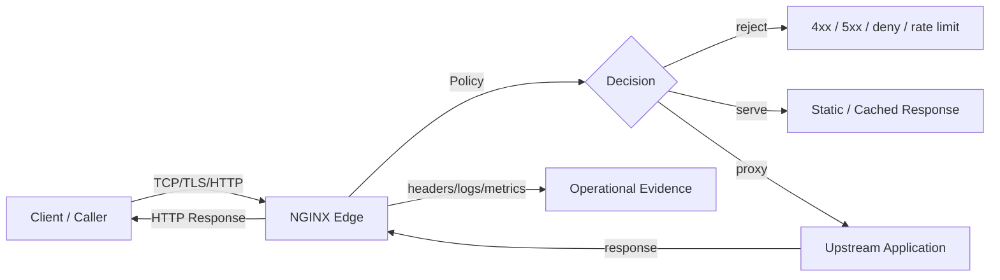
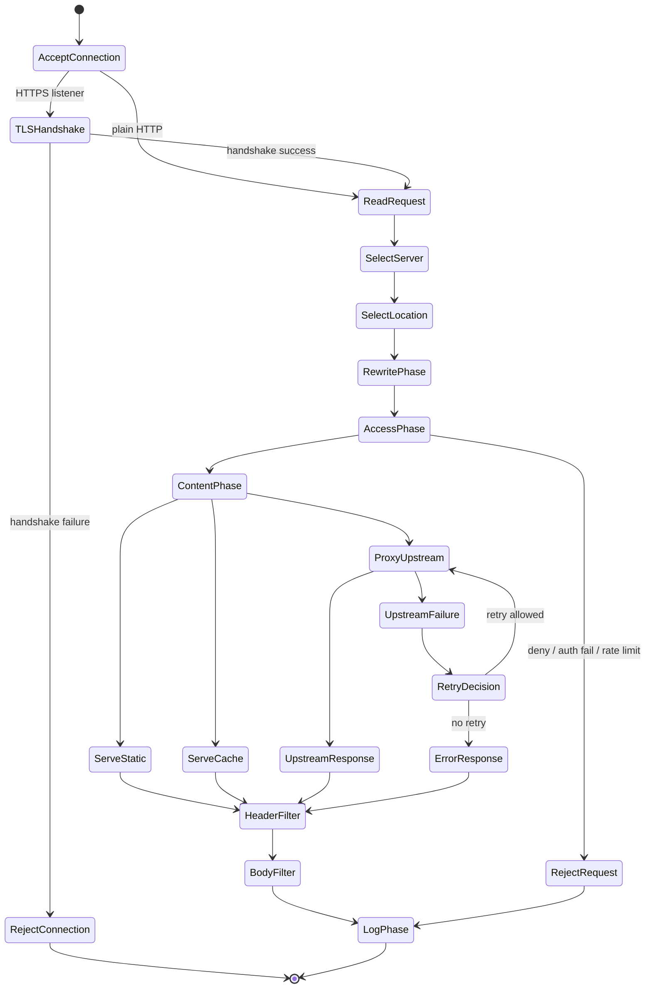
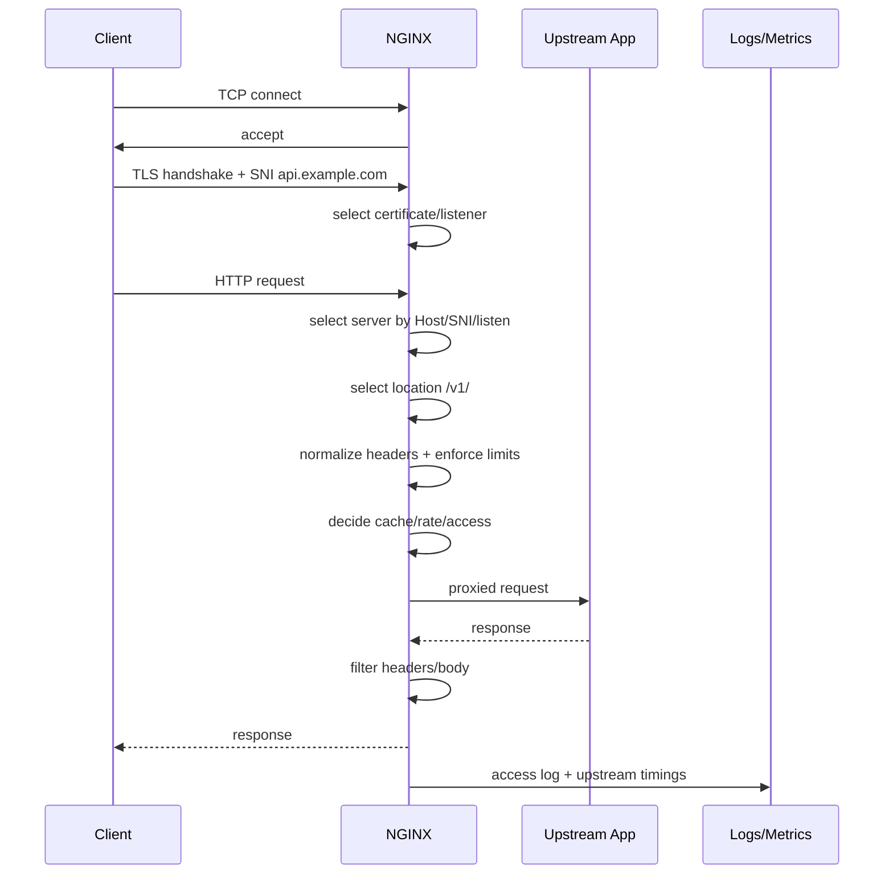
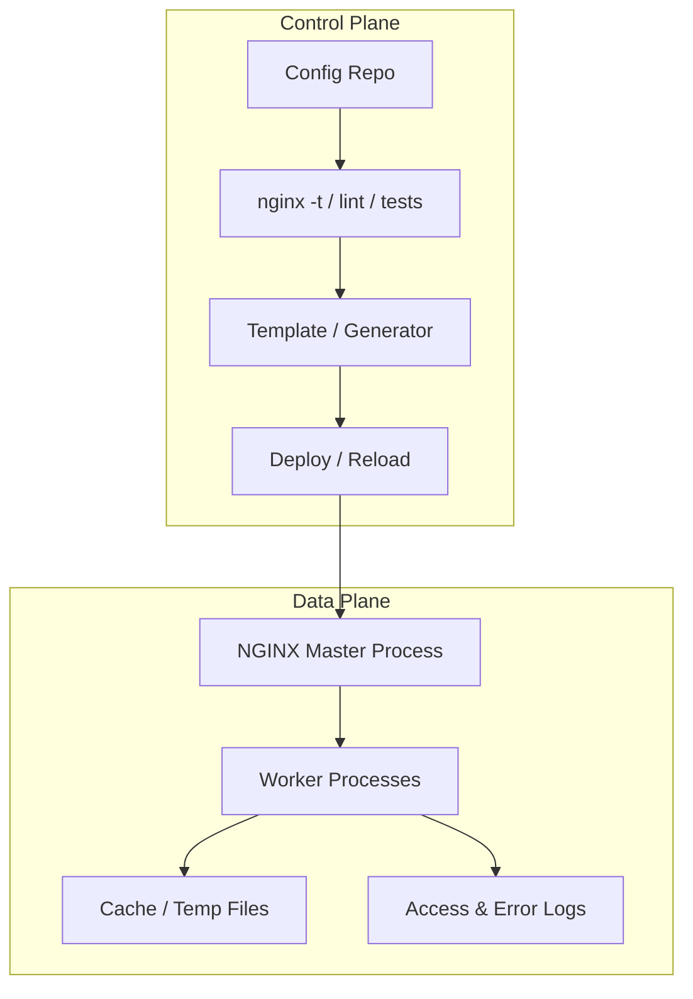
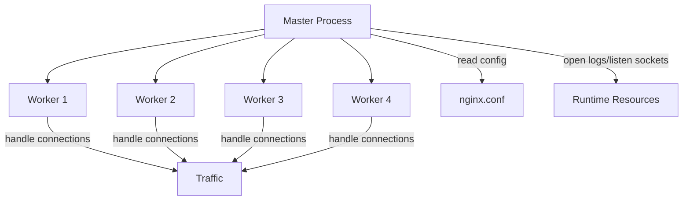
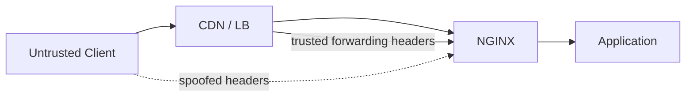

# Part 001 — Edge Traffic Mental Model

> Target part ini: setelah selesai, kamu tidak lagi melihat NGINX sebagai kumpulan directive yang dihafal, tetapi sebagai **traffic state machine** di tepi sistem: menerima koneksi, memilih virtual server, mengklasifikasi request, menerapkan policy, meneruskan ke upstream, mengelola failure, lalu meninggalkan evidence operasional.

NGINX sering diajarkan dengan pola seperti ini:

```nginx
server {
    listen 80;
    server_name example.com;

    location / {
        proxy_pass http://localhost:8080;
    }
}
```

Config itu benar, tetapi mental modelnya terlalu dangkal untuk production. Di production, pertanyaan yang lebih penting adalah:

- request ini **datang dari trust boundary mana**?
- hostname, SNI, path, method, header, body, dan client IP mana yang boleh dipercaya?
- kapan request harus ditolak di edge, kapan diteruskan, kapan di-cache, kapan di-retry?
- jika upstream lambat, mati, overload, atau salah response, NGINX harus melakukan apa?
- bukti apa yang harus tersisa di log agar incident bisa diinvestigasi?
- konfigurasi mana yang bisa di-reload aman tanpa membunuh koneksi aktif?

NGINX bukan hanya web server. Secara resmi, NGINX Open Source diposisikan sebagai HTTP web server, reverse proxy, content cache, load balancer, TCP/UDP proxy, dan mail proxy. Artinya satu binary yang sama bisa berada di banyak posisi arsitektur: static asset server, TLS terminator, API gateway ringan, L7 load balancer, L4 stream proxy, origin shield, Kubernetes ingress data plane, atau internal service gateway.

Part ini membangun fondasi konseptual untuk seluruh seri.

---

## 1. Definisi kerja: apa itu “edge traffic system”?

Dalam seri ini, **edge** bukan selalu berarti public internet edge. Edge adalah titik tempat traffic berpindah dari satu domain kontrol ke domain kontrol lain.

Contoh edge:

| Edge | Dari | Ke | Risiko utama |
|---|---|---|---|
| Public edge | Internet | Platform internal | hostile input, TLS, DDoS, header spoofing |
| App edge | Frontend/CDN | Backend API | routing, CORS, auth propagation, timeout |
| Service edge | Service A | Service B | retry storm, overload propagation, mTLS, observability |
| Kubernetes edge | Ingress/Gateway | Service/Pod | dynamic endpoint churn, config drift, rollout race |
| Data edge | App | DB/cache/TCP service | connection pressure, L4 failure, source IP preservation |

NGINX menjadi penting karena ia duduk di jalur kritis tempat traffic berubah bentuk:



NGINX bukan sekadar “pipa”. Ia adalah komponen yang membuat keputusan.

Keputusan itu bisa berupa:

- **connection decision**: terima koneksi atau tidak;
- **TLS decision**: sertifikat mana, protocol mana, cipher mana, SNI mana;
- **virtual host decision**: `server {}` mana yang memproses request;
- **routing decision**: `location {}` mana yang berlaku;
- **policy decision**: allow/deny, rate limit, body size, method filtering;
- **upstream decision**: backend mana, keepalive atau tidak, retry atau tidak;
- **cache decision**: HIT, MISS, BYPASS, STALE, revalidate;
- **logging decision**: apa yang dicatat, dalam format apa, dengan correlation id mana.

Kalau kamu memahami NGINX sebagai decision engine, konfigurasi menjadi desain sistem, bukan template.

---

## 2. NGINX sebagai state machine request

Mental model paling berguna untuk NGINX adalah state machine.



Detail internal NGINX lebih kompleks dari diagram ini, tetapi diagram ini cukup akurat sebagai model kerja production.

Setiap directive yang kamu tulis biasanya memengaruhi salah satu phase:

| Phase | Contoh directive | Pertanyaan desain |
|---|---|---|
| Listen | `listen`, `reuseport`, `ssl`, `http2` | socket mana yang menerima traffic? |
| TLS | `ssl_certificate`, `ssl_protocols` | identitas dan enkripsi mana yang berlaku? |
| Server selection | `server_name`, `default_server` | host mana yang dipilih? |
| Location selection | `location`, `try_files` | handler mana yang menang? |
| Rewrite | `return`, `rewrite`, `set`, `map` | URI/flow berubah atau berhenti? |
| Access | `allow`, `deny`, `auth_basic`, `limit_req` | request boleh lanjut? |
| Content | `root`, `proxy_pass`, `grpc_pass` | response berasal dari mana? |
| Proxy | `proxy_set_header`, `proxy_read_timeout` | kontrak ke upstream bagaimana? |
| Cache | `proxy_cache`, `proxy_cache_key` | response disimpan/dipakai ulang atau tidak? |
| Log | `access_log`, `error_log`, `log_format` | evidence apa yang tersisa? |

Skill tingkat lanjut bukan menghafal semua directive. Skill tingkat lanjut adalah tahu **phase mana yang kamu ubah**, konsekuensinya apa, dan failure mode-nya apa.

---

## 3. Perbedaan role: web server, reverse proxy, load balancer, cache, gateway

NGINX bisa menjalankan banyak role sekaligus, tapi desain yang buruk biasanya mencampur role tanpa boundary.

### 3.1 Static web server

Role paling sederhana: NGINX membaca file dari filesystem dan mengembalikan response.

```nginx
server {
    listen 80;
    server_name static.example.com;

    root /srv/www/static;

    location / {
        try_files $uri $uri/ =404;
    }
}
```

Decision utama:

- path mana yang boleh dibaca;
- apakah directory listing boleh;
- MIME type apa yang dikirim;
- cache header apa yang aman;
- apakah asset fingerprinted atau tidak;
- bagaimana hidden file dicegah bocor.

Failure mode:

- salah `root`/`alias` membuka file internal;
- SPA fallback terlalu luas sehingga semua 404 berubah jadi 200;
- cache header terlalu agresif untuk HTML;
- compression atau sendfile salah asumsi terhadap storage.

### 3.2 Reverse proxy

NGINX menerima HTTP request dari client lalu membuat request baru ke upstream.

```nginx
upstream app_backend {
    server 127.0.0.1:8080;
}

server {
    listen 80;
    server_name api.example.com;

    location / {
        proxy_pass http://app_backend;
        proxy_set_header Host $host;
        proxy_set_header X-Real-IP $remote_addr;
        proxy_set_header X-Forwarded-For $proxy_add_x_forwarded_for;
        proxy_set_header X-Forwarded-Proto $scheme;
    }
}
```

Hal penting: reverse proxy bukan forwarder byte-for-byte. Ia membentuk ulang kontrak antara client dan upstream.

Beberapa pertanyaan desain:

- apakah upstream harus melihat `Host` asli atau host internal?
- apakah `X-Forwarded-For` dari client harus dipercaya atau ditimpa?
- apakah request body dibuffer penuh sebelum dikirim ke upstream?
- apakah response upstream dibuffer di NGINX atau streaming langsung?
- timeout mana yang menunjukkan upstream down vs slow vs overloaded?
- retry boleh dilakukan untuk method apa?

Failure mode:

- spoofed `X-Forwarded-For` membuat audit salah;
- `proxy_pass` slash semantics salah sehingga path berubah diam-diam;
- timeout terlalu panjang membuat worker menahan koneksi terlalu lama;
- retry pada write request menciptakan duplicate transaction;
- buffering memindahkan bottleneck ke disk temporary file.

### 3.3 Load balancer

Load balancing berarti NGINX memilih upstream dari group.

```nginx
upstream app_pool {
    least_conn;
    server 10.0.1.10:8080 weight=2;
    server 10.0.1.11:8080 weight=1;
}

server {
    listen 80;
    server_name api.example.com;

    location / {
        proxy_pass http://app_pool;
    }
}
```

Load balancing tidak otomatis membuat sistem resilient.

Resilience butuh:

- health signal yang benar;
- timeout yang realistis;
- retry yang aman;
- overload policy;
- deployment strategy;
- observability per upstream;
- kapasitas backend yang cukup.

Failure mode:

- semua upstream dianggap sehat padahal dependency mereka mati;
- retry memperparah overload;
- `least_conn` mengirim banyak traffic ke backend baru yang cold;
- sticky routing menyembunyikan imbalance;
- satu upstream lambat menyebabkan request menumpuk.

### 3.4 Content cache

Cache di NGINX adalah cara mengubah request ke upstream menjadi lookup lokal.

```nginx
proxy_cache_path /var/cache/nginx levels=1:2 keys_zone=api_cache:100m max_size=10g inactive=60m;

server {
    listen 80;
    server_name api.example.com;

    location /public-data/ {
        proxy_cache api_cache;
        proxy_cache_key "$scheme$request_method$host$request_uri";
        proxy_cache_valid 200 10m;
        proxy_pass http://app_backend;
        add_header X-Cache-Status $upstream_cache_status always;
    }
}
```

Cache bukan optimisasi kecil. Cache adalah **stateful subsystem**.

Pertanyaan desain:

- key cache terdiri dari apa?
- response mana yang boleh disimpan?
- bagaimana auth, cookie, query string, dan language variation diperlakukan?
- apakah stale response boleh dikirim saat upstream error?
- bagaimana cache poisoning dicegah?
- bagaimana purge dilakukan?

Failure mode:

- private data ter-cache publik;
- header `Vary` diabaikan;
- cache key tidak menyertakan tenant/user dimension;
- cache stampede membuat origin collapse;
- disk cache penuh memengaruhi latency semua request.

### 3.5 API gateway ringan

NGINX sering dipakai sebagai API gateway ringan: routing, TLS termination, rate limiting, allow/deny, CORS, path normalization, dan proxying.

Namun NGINX Open Source bukan full policy engine seperti dedicated API management platform.

Cocok untuk:

- simple routing;
- TLS termination;
- header normalization;
- basic rate limiting;
- request size protection;
- coarse-grained access control;
- upstream shielding;
- simple canary split.

Tidak ideal untuk:

- complex per-user authorization;
- deeply dynamic policy evaluation;
- monetization, API product lifecycle, developer portal;
- rich quota per customer dengan distributed counter kuat;
- business-aware request transformation kompleks.

Mental model yang sehat: NGINX bagus untuk **edge enforcement yang deterministik dan murah**, bukan semua jenis policy.

---

## 4. Request lifecycle dari sudut pandang production

Mari lihat request sederhana:

```text
GET /v1/cases/123 HTTP/1.1
Host: api.example.com
X-Request-Id: abc-123
Authorization: Bearer ...
```

Secara production, flow-nya bukan hanya “masuk lalu proxied”.



Hal yang harus kamu modelkan:

1. **Connection identity**  
   Siapa client dari sudut pandang NGINX? IP asli, IP load balancer, IP CDN, atau hasil PROXY protocol?

2. **HTTP identity**  
   Host header apa yang dipakai? Apakah SNI cocok dengan Host? Apakah default server bisa menjadi sink untuk host aneh?

3. **Request classification**  
   Apakah ini static asset, API read, API write, health check, admin route, WebSocket, gRPC, atau upload?

4. **Policy enforcement**  
   Apa yang ditolak lebih awal? Body terlalu besar, method tidak valid, host tidak dikenal, path forbidden, rate terlalu tinggi?

5. **Upstream contract**  
   Header apa yang dikirim ke app? Timeout berapa? Buffering bagaimana? Retry kapan?

6. **Response contract**  
   Header security/caching apa yang dipastikan NGINX? Apakah upstream boleh mengatur semua header?

7. **Evidence**  
   Bisakah kamu menjawab: request ini ke upstream mana, latency di mana, retry berapa kali, cache status apa, dan request id apa?

---

## 5. Control plane vs data plane

NGINX sering gagal dipahami karena control plane dan data plane dicampur.



**Data plane** melayani traffic.  
**Control plane** menghasilkan dan mengganti konfigurasi.

Invarian penting:

- data plane harus tetap melayani traffic saat config baru divalidasi;
- config reload harus bisa gagal tanpa merusak worker lama;
- semua perubahan config harus bisa di-review dan di-rollback;
- generated config harus bisa direproduksi;
- observability harus membedakan config version lama dan baru.

Di level beginner, kamu mengetik config di server.  
Di level production, config adalah artifact yang diuji, dipromosikan, di-reload, dan diobservasi.

---

## 6. Master process, worker process, dan graceful reload

NGINX memakai model master/worker.

Secara konseptual:



Tanggung jawab master:

- membaca dan memvalidasi konfigurasi;
- membuka listening socket;
- mengelola worker process;
- menerima signal seperti reload/quit/reopen;
- memulai worker baru saat reload berhasil;
- menghentikan worker lama secara graceful.

Tanggung jawab worker:

- menerima/menangani koneksi;
- menjalankan request processing;
- proxy ke upstream;
- membaca file/cache;
- menulis log;
- melayani traffic aktual.

Kenapa ini penting?

Karena production NGINX biasanya diubah dengan reload, bukan restart.

```bash
nginx -t
nginx -s reload
```

Reload yang sehat berarti:

1. config baru dites;
2. master membaca config baru;
3. jika valid, worker baru dibuat;
4. worker lama berhenti menerima koneksi baru;
5. koneksi lama diselesaikan atau ditutup sesuai lifecycle;
6. jika config invalid, worker lama tetap berjalan.

Anti-pattern:

```bash
systemctl restart nginx
```

Restart bisa memutus koneksi aktif. Reload adalah default path untuk perubahan config normal.

Namun reload juga bukan magic. Reload terlalu sering bisa berdampak pada:

- churn worker;
- cache metadata reload behavior;
- log correlation;
- config race;
- temporary spike pada connection handling;
- kesulitan RCA jika config version tidak tercatat.

---

## 7. NGINX bukan application server

Kesalahan desain umum: memperlakukan NGINX seperti application server programmable.

NGINX unggul ketika rule-nya:

- deterministik;
- cepat dievaluasi;
- dekat dengan protokol;
- tidak membutuhkan state bisnis kompleks;
- tidak membutuhkan query database per request;
- bisa dinyatakan dengan routing/header/limit/cache policy.

NGINX buruk ketika dipaksa untuk:

- menjalankan business workflow;
- mengambil keputusan domain kompleks;
- menjadi authorization engine penuh;
- menyimpan state transaksional utama;
- melakukan transformasi payload rumit;
- menggantikan service logic.

Rule praktis:

> Let NGINX enforce protocol and edge policy. Let applications own business semantics.

Contoh bagus:

```nginx
# Tolak body upload terlalu besar sebelum mencapai aplikasi
client_max_body_size 10m;
```

Contoh berbahaya:

```nginx
# Jangan encode authorization bisnis kompleks dengan nested if/rewrite/map
# hanya karena bisa dilakukan.
```

NGINX boleh menjadi **guardrail**, bukan domain brain.

---

## 8. Trust boundary: hal paling penting di edge

Traffic edge selalu tentang kepercayaan.



Header seperti ini tidak otomatis aman:

```text
X-Forwarded-For: 1.2.3.4
X-Real-IP: 1.2.3.4
X-Forwarded-Proto: https
Forwarded: for=1.2.3.4;proto=https
```

Jika client bisa mengirim header itu langsung ke NGINX, maka header itu hostile input.

Invarian aman:

- hanya percaya forwarded headers dari proxy/CDN/load balancer yang eksplisit dipercaya;
- hapus atau overwrite header identitas dari client;
- gunakan `real_ip` hanya dengan CIDR trusted;
- log raw remote address dan resolved real client address bila perlu;
- jangan jadikan header user-controlled sebagai basis authorization.

Contoh konsep:

```nginx
# Contoh hanya. CIDR harus sesuai infra aktual.
set_real_ip_from 10.0.0.0/8;
real_ip_header X-Forwarded-For;
real_ip_recursive on;
```

Kalau boundary ini salah, semua layer di belakang bisa salah:

- rate limit salah target;
- audit log salah client;
- geo policy salah lokasi;
- fraud detection salah identity;
- application security mengambil keputusan dari data palsu.

---

## 9. NGINX sebagai contract translator

Reverse proxy selalu menerjemahkan kontrak.

Client contract:

```text
public hostname: api.example.com
public scheme: https
public path: /v1/cases/123
public auth: bearer token
public timeout expectation: < 2s
```

Upstream contract:

```text
internal host: case-service.default.svc.cluster.local:8080
internal scheme: http
internal path: /cases/123
internal headers: X-Request-Id, X-Forwarded-Proto, X-Real-IP
internal timeout budget: connect 250ms, read 1500ms
```

NGINX dapat mengubah:

- scheme: HTTPS di client, HTTP ke upstream;
- host: public host ke internal host;
- path: `/api/` ke `/`;
- headers: tambah/hapus/override;
- buffering: streaming vs buffered;
- timeout: client-facing vs upstream-facing;
- response headers: cache/security;
- status: upstream failure menjadi custom error.

Setiap transformasi harus disengaja.

Checklist contract translation:

```text
[ ] Apakah Host ke upstream memang perlu public Host?
[ ] Apakah X-Forwarded-For diappend atau direset?
[ ] Apakah X-Forwarded-Proto selalu akurat?
[ ] Apakah path rewrite diuji untuk slash/no-slash?
[ ] Apakah timeout NGINX selaras dengan timeout app dan client?
[ ] Apakah upstream boleh mengirim caching/security headers sendiri?
[ ] Apakah error upstream diekspos mentah ke client?
```

---

## 10. Policy placement: mana di NGINX, mana di app?

Policy yang baik di edge:

| Policy | Cocok di NGINX? | Alasan |
|---|---:|---|
| TLS termination | Ya | edge identity/protocol concern |
| HTTP→HTTPS redirect | Ya | canonical edge behavior |
| host allowlist | Ya | murah, deterministik |
| max body size | Ya | proteksi resource awal |
| static file access | Ya | filesystem serving concern |
| basic rate limit | Ya | edge overload protection |
| CORS sederhana | Ya, hati-hati | protocol/header policy |
| per-route auth bisnis | Biasanya tidak | butuh domain context |
| complex authorization | Tidak | butuh policy engine/app context |
| payload validation domain | Tidak | aplikasi lebih tahu schema/domain |
| transaction retry | Hati-hati | idempotency domain-specific |
| audit bisnis | Tidak | edge log bukan audit domain final |

Pertanyaan kunci:

> Apakah policy ini bisa dievaluasi hanya dari metadata request/protocol tanpa state bisnis kompleks?

Jika ya, NGINX mungkin tempat yang baik. Jika tidak, pindahkan ke app/service/policy engine.

---

## 11. Latency budget: NGINX harus memperjelas, bukan menyembunyikan

Misalnya SLO API adalah p95 < 500ms.

Budget kasar:

```text
client network       50ms
TLS/edge overhead    10ms
NGINX queue/buffer   10ms
upstream processing  350ms
response transfer    80ms
```

NGINX dapat merusak latency budget dengan beberapa cara:

- timeout terlalu panjang membuat request menggantung;
- buffering besar menambah delay sebelum upstream menerima body;
- retry diam-diam membuat satu request menjadi beberapa attempt;
- cache MISS menambah origin latency;
- upstream keepalive tidak dipakai sehingga connection setup mahal;
- log sync/disk pressure memperlambat worker;
- DNS resolution tidak sesuai pola runtime.

NGINX juga bisa membantu:

- terminate TLS dekat client;
- reuse upstream connections;
- reject request buruk lebih awal;
- serve static/cache response;
- shed load;
- expose upstream timing.

Access log yang berguna harus bisa memisahkan:

```text
request_time              total time from first byte read to log write
upstream_connect_time     time to connect to upstream
upstream_header_time      time until upstream response header
upstream_response_time    time for upstream response
upstream_addr             selected upstream server
upstream_status           upstream status code(s)
```

Tanpa separation ini, “NGINX lambat” hanya tebakan.

---

## 12. Failure model: NGINX di tengah tidak boleh memperburuk incident

NGINX berada di tengah jalur kritis. Saat sistem gagal, NGINX bisa menjadi stabilizer atau amplifier.

### 12.1 Upstream down

Gejala:

- 502 Bad Gateway;
- connect refused;
- no live upstreams;
- upstream prematurely closed connection.

Response desain:

- timeout connect pendek;
- health/failure detection jelas;
- fallback error page aman;
- retry terbatas hanya untuk request aman;
- alert berdasarkan upstream failure rate.

### 12.2 Upstream slow

Gejala:

- 504 Gateway Timeout;
- request_time naik;
- upstream_response_time naik;
- worker connections terpakai lama.

Response desain:

- read timeout sesuai SLO;
- load shedding;
- cache stale untuk endpoint aman;
- observability per route/upstream;
- jangan menaikkan timeout tanpa memahami penyebab.

### 12.3 Client slow

Gejala:

- banyak koneksi idle;
- upload lambat;
- worker_connections habis;
- bandwidth kecil tapi connection count tinggi.

Response desain:

- client body/header timeout;
- keepalive timeout realistis;
- body size limit;
- rate/connection limit;
- OS/network tuning.

### 12.4 Config bad deploy

Gejala:

- reload gagal;
- wrong upstream;
- wrong route;
- cert path salah;
- traffic ke default server.

Response desain:

- `nginx -t` wajib;
- config generated dan versioned;
- smoke test per hostname/path;
- rollback config artifact;
- log config version.

### 12.5 Cache poison / private leakage

Gejala:

- user melihat data user lain;
- cache HIT untuk response yang seharusnya private;
- query/cookie/header variation tidak masuk cache key.

Response desain:

- default no-cache untuk authenticated response;
- explicit allowlist endpoint cacheable;
- cache key review;
- include tenant/language/encoding dimensions bila relevan;
- cache status header saat debugging.

---

## 13. Production invariants

Invarian adalah aturan yang harus tetap benar meski config bertambah kompleks.

### 13.1 Routing invariant

> Setiap request harus jatuh ke route yang disengaja atau ditolak eksplisit.

Implikasi:

- jangan biarkan default server melayani host random;
- gunakan catch-all server untuk reject unknown host;
- uji location matching;
- hindari regex location tanpa alasan kuat;
- dokumentasikan path ownership.

Contoh:

```nginx
server {
    listen 80 default_server;
    server_name _;
    return 444;
}
```

Catatan: `444` adalah status non-standard NGINX untuk menutup koneksi tanpa response. Gunakan hanya jika sesuai operational policy; untuk banyak environment, `400`/`404` lebih mudah diobservasi.

### 13.2 Identity invariant

> Aplikasi tidak boleh menerima identitas client dari header yang bisa dipalsukan.

Implikasi:

- normalize forwarded headers;
- trust hanya proxy internal;
- log remote dan real IP;
- jangan jadikan `X-Forwarded-*` dari public client sebagai truth.

### 13.3 Timeout invariant

> Timeout NGINX harus merefleksikan latency budget dan failure semantics, bukan angka acak.

Implikasi:

- connect timeout pendek;
- read timeout sesuai endpoint class;
- upload route punya timeout/body policy berbeda;
- WebSocket/SSE punya profile berbeda dari REST;
- retry harus mempertimbangkan idempotency.

### 13.4 Cache invariant

> Response hanya boleh di-cache jika semua dimensi variasinya masuk cache key atau dinyatakan irrelevant.

Implikasi:

- auth response default tidak di-cache;
- cookie-aware endpoint hati-hati;
- query string review;
- `Vary` behavior dipahami;
- debug dengan `X-Cache-Status` di environment aman.

### 13.5 Observability invariant

> Setiap incident edge harus bisa ditelusuri dari log/metrics tanpa menebak config.

Implikasi:

- structured logs;
- request id;
- upstream address/status/time;
- host/path/method/status/body bytes;
- cache status;
- config version bila memungkinkan.

---

## 14. Anatomy of a production-ish baseline

Ini bukan config final, hanya skeleton untuk menunjukkan boundary.

```nginx
# /etc/nginx/nginx.conf
user nginx;
worker_processes auto;

error_log /var/log/nginx/error.log warn;
pid /var/run/nginx.pid;

events {
    worker_connections 4096;
}

http {
    include       /etc/nginx/mime.types;
    default_type  application/octet-stream;

    log_format main_json escape=json
        '{'
          '"time":"$time_iso8601",'
          '"remote_addr":"$remote_addr",'
          '"request_id":"$request_id",'
          '"host":"$host",'
          '"method":"$request_method",'
          '"uri":"$request_uri",'
          '"status":$status,'
          '"request_time":$request_time,'
          '"upstream_addr":"$upstream_addr",'
          '"upstream_status":"$upstream_status",'
          '"upstream_response_time":"$upstream_response_time"'
        '}';

    access_log /var/log/nginx/access.log main_json;

    sendfile on;
    keepalive_timeout 30s;

    # Unknown host sink.
    server {
        listen 80 default_server;
        server_name _;
        return 404;
    }

    include /etc/nginx/conf.d/*.conf;
}
```

Contoh app server:

```nginx
# /etc/nginx/conf.d/api.example.com.conf
upstream api_backend {
    server 127.0.0.1:8080;
    keepalive 32;
}

server {
    listen 80;
    server_name api.example.com;

    client_max_body_size 10m;

    location /healthz {
        access_log off;
        return 200 "ok\n";
    }

    location / {
        proxy_http_version 1.1;
        proxy_set_header Connection "";

        proxy_set_header Host $host;
        proxy_set_header X-Request-Id $request_id;
        proxy_set_header X-Real-IP $remote_addr;
        proxy_set_header X-Forwarded-For $proxy_add_x_forwarded_for;
        proxy_set_header X-Forwarded-Proto $scheme;

        proxy_connect_timeout 250ms;
        proxy_send_timeout 5s;
        proxy_read_timeout 5s;

        proxy_pass http://api_backend;
    }
}
```

Yang harus kamu lihat dari skeleton ini:

- ada catch-all server;
- logging mengandung upstream timing;
- upstream diberi nama;
- timeout eksplisit;
- forwarded headers eksplisit;
- health endpoint tidak diproxy;
- config bisa dipisah per virtual host.

Yang belum diselesaikan:

- TLS;
- real IP dari load balancer/CDN;
- rate limiting;
- cache;
- route-specific policies;
- deployment validation;
- metrics exporter;
- hardening lengkap.

Seri ini akan menambahkan semua itu secara bertahap.

---

## 15. Configuration is code, but with different failure semantics

Konfigurasi NGINX terlihat deklaratif, tetapi efeknya runtime-critical.

Perubahan kecil bisa berdampak besar:

```diff
- proxy_pass http://backend;
+ proxy_pass http://backend/;
```

Satu slash bisa mengubah URI forwarding semantics.

```diff
- location /api/ {
+ location /api {
```

Satu slash bisa mengubah route match.

```diff
- add_header X-Frame-Options DENY;
+ add_header X-Frame-Options DENY always;
```

Satu keyword bisa mengubah apakah header muncul pada error response.

Karena itu, config NGINX harus diperlakukan seperti code dengan test:

- syntax test: `nginx -t`;
- semantic test: request sample ke hostname/path penting;
- negative test: unknown host/path/method;
- security test: hidden files, header spoofing;
- performance smoke test;
- rollback test.

Minimal CI idea:

```bash
#!/usr/bin/env bash
set -euo pipefail

nginx -t -c "$PWD/nginx.conf"

# Example semantic checks after launching test instance.
curl -fsS -H 'Host: api.example.com' http://127.0.0.1/healthz
curl -s -o /dev/null -w '%{http_code}\n' -H 'Host: unknown.example.com' http://127.0.0.1/ | grep -E '^(400|404|444)$'
```

---

## 16. Edge design questions sebelum menulis config

Sebelum membuat config NGINX, jawab ini:

### 16.1 Traffic classification

```text
[ ] Public atau internal?
[ ] HTTP, HTTPS, gRPC, WebSocket, TCP, UDP?
[ ] Static, API read, API write, upload, stream, admin?
[ ] Ada CDN/load balancer sebelum NGINX?
[ ] Ada service mesh setelah NGINX?
```

### 16.2 Identity and trust

```text
[ ] Source IP aktual berasal dari mana?
[ ] Header forwarded mana yang dipercaya?
[ ] Apakah SNI dan Host harus cocok?
[ ] Apakah unknown host ditolak?
[ ] Apakah mTLS diperlukan?
```

### 16.3 Routing

```text
[ ] Hostname apa saja yang valid?
[ ] Path ownership bagaimana?
[ ] Rewrite diperlukan atau bisa dihindari?
[ ] Regex location benar-benar perlu?
[ ] Apa behavior default untuk route tidak dikenal?
```

### 16.4 Upstream

```text
[ ] Upstream statis, DNS-based, service discovery, atau Kubernetes?
[ ] Timeout connect/read/send berapa?
[ ] Keepalive diperlukan?
[ ] Retry boleh untuk request mana?
[ ] Health check pasif cukup atau butuh aktif?
```

### 16.5 Safety

```text
[ ] Body size limit?
[ ] Rate limit?
[ ] Connection limit?
[ ] CORS policy?
[ ] Security headers?
[ ] Cache policy?
```

### 16.6 Operability

```text
[ ] Log format cukup untuk RCA?
[ ] Metrics tersedia?
[ ] Config version terlacak?
[ ] Reload aman?
[ ] Rollback jelas?
[ ] Alert berdasarkan symptom yang benar?
```

---

## 17. Anti-pattern awal yang harus dibunuh

### Anti-pattern 1: copy-paste config tanpa phase model

Gejala:

```nginx
if ($something) {
    rewrite ...
}
```

lalu tidak tahu kapan rule itu dievaluasi.

Perbaikan:

- pahami phase;
- gunakan `return` untuk redirect sederhana;
- gunakan `map` untuk decision berbasis variable;
- minimalkan `if` dalam `location`.

### Anti-pattern 2: semua route masuk satu `location /`

Gejala:

```nginx
location / {
    proxy_pass http://backend;
}
```

Untuk sistem kecil tidak masalah. Untuk platform besar, route dengan karakteristik berbeda perlu policy berbeda.

Contoh pemisahan:

```nginx
location /api/ { ... }
location /assets/ { ... }
location /uploads/ { ... }
location /admin/ { ... }
location /ws/ { ... }
```

### Anti-pattern 3: timeout default tanpa desain

Default belum tentu salah, tapi production harus eksplisit untuk endpoint penting.

Beda endpoint, beda profile:

| Endpoint | Timeout profile |
|---|---|
| REST read | pendek-sedang |
| REST write | sesuai transaction budget |
| upload | body timeout lebih realistis |
| WebSocket | long-lived |
| SSE | long-lived read |
| health check | sangat pendek |

### Anti-pattern 4: mempercayai semua forwarded headers

Jangan lakukan ini di public edge:

```nginx
proxy_set_header X-Real-IP $http_x_real_ip;
```

Itu berarti client bisa memilih IP-nya sendiri.

### Anti-pattern 5: cache dulu, safety nanti

Cache harus opt-in, bukan default untuk semua response.

Aman:

```text
cache only known public GET/HEAD responses
```

Berbahaya:

```text
cache everything except when something looks private
```

---

## 18. Mental model ringkas

Simpan model ini:

```text
NGINX = listener + selector + policy engine + content/proxy handler + filter + logger
```

Atau lebih production-oriented:

```text
NGINX protects, normalizes, routes, accelerates, and records traffic at a trust boundary.
```

Setiap config harus bisa dijelaskan dalam lima kalimat:

1. traffic apa yang diterima;
2. identity apa yang dipercaya;
3. request mana yang ditolak;
4. upstream/content mana yang dipilih;
5. evidence apa yang dicatat.

Jika config tidak bisa dijelaskan begitu, biasanya desainnya belum matang.

---

## 19. Latihan desain

Ambil service API internal bernama `case-service`.

Requirement:

```text
Public host: api.example.com
Route: /v1/cases/
Backend: case-service:8080
Max body: 2MB for normal API
Upload route: /v1/cases/*/attachments up to 50MB
Health: /healthz served by NGINX
Unknown host: rejected
Request ID: propagated
Timeout: normal 3s, upload 30s
```

Sketsa desain:

```nginx
upstream case_service {
    server case-service:8080;
    keepalive 32;
}

server {
    listen 80 default_server;
    server_name _;
    return 404;
}

server {
    listen 80;
    server_name api.example.com;

    location = /healthz {
        access_log off;
        return 200 "ok\n";
    }

    location ~ ^/v1/cases/.+/attachments$ {
        client_max_body_size 50m;
        proxy_read_timeout 30s;
        proxy_send_timeout 30s;
        proxy_set_header X-Request-Id $request_id;
        proxy_pass http://case_service;
    }

    location /v1/cases/ {
        client_max_body_size 2m;
        proxy_connect_timeout 250ms;
        proxy_read_timeout 3s;
        proxy_send_timeout 3s;
        proxy_set_header X-Request-Id $request_id;
        proxy_pass http://case_service;
    }

    location / {
        return 404;
    }
}
```

Ini belum final production config. Tujuannya menunjukkan bahwa route berbeda harus punya policy berbeda.

Pertanyaan review:

```text
[ ] Apakah regex attachment benar untuk semua URL valid?
[ ] Apakah upload butuh buffering off atau tetap buffered?
[ ] Apakah write request boleh retry? Belum diset, berarti default behavior perlu dicek nanti.
[ ] Apakah request id dari client boleh dipercaya atau harus generate sendiri?
[ ] Apakah app butuh X-Forwarded-Proto?
[ ] Apakah unknown host harus 404, 400, atau close connection?
[ ] Apakah path traversal relevan untuk route ini? Tidak, karena proxied, bukan static.
```

---

## 20. Apa yang harus kamu kuasai sebelum lanjut

Sebelum Part 002, pastikan kamu bisa menjawab:

1. Apa bedanya NGINX sebagai web server, reverse proxy, load balancer, dan cache?
2. Mengapa reverse proxy adalah contract translator?
3. Mengapa forwarded headers adalah trust boundary problem?
4. Mengapa timeout harus didesain berdasarkan endpoint class?
5. Mengapa cache harus dianggap stateful subsystem?
6. Apa bedanya control plane dan data plane pada NGINX?
7. Mengapa reload lebih aman daripada restart untuk perubahan config normal?
8. Evidence apa yang harus ada di log agar incident upstream bisa dianalisis?

---

## Referensi resmi

- NGINX official site: role NGINX sebagai HTTP web server, reverse proxy, content cache, load balancer, TCP/UDP proxy, dan mail proxy.
- NGINX Beginner's Guide: start/stop/reload, struktur konfigurasi, static content, proxy server, FastCGI.
- NGINX request processing documentation: server selection dan location processing.
- NGINX reverse proxy admin guide: proxying, request header modification, response buffering.
- NGINX HTTP load balancing admin guide: Layer 7 load balancing dan algoritma.

---

## Penutup

Part ini sengaja tidak mengejar banyak directive. Fondasi utamanya adalah cara berpikir.

Mulai Part 002, kita akan menempatkan NGINX dalam arsitektur nyata: bare metal, VM, container, Kubernetes, CDN, load balancer cloud, service mesh, dan platform internal. Tujuannya agar kamu tahu kapan NGINX adalah pilihan tepat, kapan redundant, dan kapan menjadi sumber kompleksitas yang tidak perlu.
