# Part 002 — Where NGINX Fits In Modern Architecture

> Target part ini: kamu bisa memutuskan **di mana NGINX seharusnya ditempatkan**, kapan NGINX memberi nilai besar, kapan cukup memakai managed load balancer/CDN/service mesh, dan kapan NGINX justru menciptakan layer tambahan yang tidak perlu.

NGINX bukan selalu jawaban. NGINX adalah alat tajam untuk posisi tertentu dalam arsitektur traffic.

Pertanyaan production bukan:

```text
Should we use NGINX?
```

Pertanyaan yang lebih benar:

```text
At which traffic boundary do we need NGINX-like behavior,
and which component should own that behavior?
```

Behavior yang dimaksud:

- TLS termination;
- HTTP routing;
- static serving;
- reverse proxying;
- Layer 7 load balancing;
- Layer 4 TCP/UDP proxying;
- caching;
- buffering;
- header normalization;
- rate limiting;
- request size protection;
- ingress control;
- operational logging at the edge.

NGINX cocok ketika behavior itu perlu dikendalikan secara eksplisit, dekat dengan traffic, dan bisa dijelaskan dengan policy deterministik.

---

## 1. Peta besar posisi NGINX

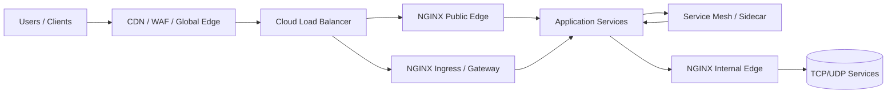

NGINX bisa berada di:

1. **Public edge** — menerima traffic setelah CDN/cloud LB atau langsung dari internet.
2. **Origin shield** — melindungi origin dari CDN atau traffic spike.
3. **App edge** — reverse proxy di depan app service.
4. **Sidecar-ish local proxy** — dekat dengan satu process/app, meskipun sekarang sering digantikan service mesh.
5. **Kubernetes ingress/gateway** — data plane untuk traffic masuk cluster.
6. **Internal gateway** — boundary antar domain internal.
7. **L4 proxy** — TCP/UDP proxy untuk database, DNS, syslog, LDAP, dan protokol non-HTTP.
8. **Static asset server** — melayani build frontend atau download artifact.

Yang harus dihindari: menaruh NGINX di semua tempat hanya karena familiar.

---

## 2. Decision framework: kapan NGINX diperlukan?

Gunakan pertanyaan ini:

```text
1. Apakah ada trust boundary?
2. Apakah traffic perlu dinormalisasi/diproteksi sebelum masuk aplikasi?
3. Apakah butuh routing HTTP yang eksplisit?
4. Apakah butuh static serving atau cache dekat edge?
5. Apakah managed LB/CDN sudah cukup?
6. Apakah service mesh sudah mengambil fungsi ini?
7. Apakah tim siap mengoperasikan config, reload, logs, metrics, cert, dan incidents?
```

Jika jawaban 1-4 banyak “ya” dan 5-7 realistis, NGINX masuk akal.

Jika hanya butuh “membagi traffic ke beberapa instance”, managed load balancer mungkin cukup.

Jika butuh mutual TLS antar-service, retry, circuit breaking, telemetry, dan policy service-to-service yang konsisten di ratusan service, service mesh mungkin lebih tepat.

Jika butuh API product management, developer portal, quota per customer, key lifecycle, monetization, dan analytics bisnis, API management platform mungkin lebih tepat.

---

## 3. NGINX vs managed cloud load balancer

Cloud load balancer seperti AWS ALB/NLB, GCP Load Balancing, Azure Application Gateway/Load Balancer, atau sejenisnya biasanya memberi:

- managed availability;
- managed scaling;
- TLS termination;
- health checks;
- basic routing;
- integration dengan cloud network/security;
- minimal operational burden.

NGINX memberi:

- config lebih fleksibel;
- static serving;
- detailed rewrite/routing;
- response/header manipulation;
- caching;
- buffering control;
- fine-grained logs;
- edge policy yang bisa versioned sebagai file;
- portability lintas environment.

Perbandingan konseptual:

| Kebutuhan | Managed LB | NGINX |
|---|---:|---:|
| Basic L4/L7 load balancing | Sangat cocok | Cocok |
| Managed HA tanpa mengelola node | Sangat cocok | Perlu desain sendiri |
| Complex rewrite/routing | Terbatas-bervariasi | Kuat |
| Static file serving | Biasanya tidak | Kuat |
| Content cache | Biasanya CDN, bukan LB | Kuat untuk origin/edge lokal |
| Config portability | Rendah-sedang | Tinggi |
| Operational simplicity | Tinggi | Tergantung maturity tim |
| Deep request logs at edge | Bervariasi | Kuat |
| Advanced per-route buffering | Terbatas | Kuat |

Rule praktis:

> Gunakan managed LB untuk commodity traffic distribution. Gunakan NGINX ketika kamu butuh programmable edge behavior yang masih deterministik dan operable.

Namun jangan abaikan HA. Jika NGINX ada di public path, kamu harus mendesain:

- minimal dua node/replica;
- health check dari LB sebelumnya;
- safe reload;
- config rollout;
- certificate rotation;
- log shipping;
- metrics;
- disaster recovery.

NGINX memberi kontrol, tapi kontrol berarti tanggung jawab.

---

## 4. NGINX setelah CDN

Pola umum:

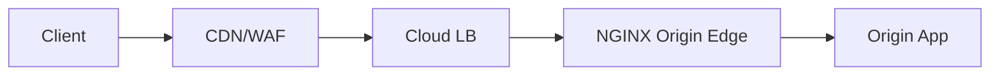

CDN menangani:

- global edge;
- asset caching dekat user;
- DDoS/WAF layer tertentu;
- TLS public;
- request filtering awal;
- geo routing;
- bot protection, tergantung vendor.

NGINX di origin masih berguna untuk:

- origin routing;
- shielding aplikasi;
- validating forwarded headers dari CDN;
- origin cache tambahan;
- per-route timeout/buffer;
- canonical host enforcement;
- log detail dekat aplikasi;
- fallback/stale response strategy;
- menjaga kontrak upstream internal.

Namun ada risiko double policy:

| Policy | CDN | NGINX | Risiko |
|---|---:|---:|---|
| Redirect HTTP→HTTPS | Ya | Ya | redirect loop / duplicated behavior |
| Cache | Ya | Ya | stale mismatch / invalidation sulit |
| WAF/rate limit | Ya | Ya | false positive sulit dilacak |
| Header manipulation | Ya | Ya | header conflict |
| Compression | Ya | Ya | double compression / debugging sulit |

Design invariant:

> Untuk setiap policy, harus jelas owner utamanya: CDN atau NGINX. Jangan biarkan dua layer menjalankan policy yang sama tanpa alasan.

Contoh boundary sehat:

```text
CDN owns:
- global caching for static assets
- public TLS
- bot/WAF coarse filtering
- global DDoS protection

NGINX owns:
- origin routing
- upstream timeout/buffering
- app-specific headers
- origin shield cache for expensive public APIs
- request logs with upstream timings
```

---

## 5. NGINX sebagai reverse proxy di depan monolith

Pola klasik tapi masih sangat relevan:

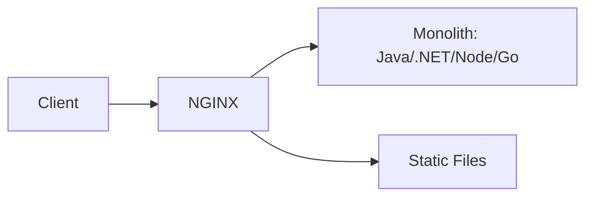

Manfaat:

- TLS termination di NGINX;
- static assets dilayani tanpa membebani app;
- request body size limit;
- upload route policy;
- compression;
- cache untuk static/public content;
- graceful maintenance page;
- header normalization;
- log edge vs app terpisah.

Contoh layout:

```nginx
server {
    listen 443 ssl;
    server_name app.example.com;

    root /srv/app/public;

    location /assets/ {
        try_files $uri =404;
        expires 1y;
        add_header Cache-Control "public, immutable";
    }

    location /uploads/ {
        client_max_body_size 100m;
        proxy_read_timeout 60s;
        proxy_pass http://monolith_backend;
    }

    location / {
        proxy_pass http://monolith_backend;
    }
}
```

Kapan cocok:

- aplikasi belum cloud-native;
- static dan dynamic traffic tercampur;
- butuh zero-downtime-ish reload/restart app di belakang;
- butuh traffic shielding ringan;
- app server bukan pilihan terbaik untuk static/TLS/proxy concerns.

Kapan kurang cocok:

- platform sudah memakai managed ingress/gateway matang;
- app butuh native HTTP/2/gRPC end-to-end tanpa termination;
- operational team tidak siap mengelola cert/config/log;
- semua fungsi NGINX sudah disediakan layer sebelumnya.

---

## 6. NGINX di microservices architecture

Dalam microservices, ada beberapa lokasi potensial:

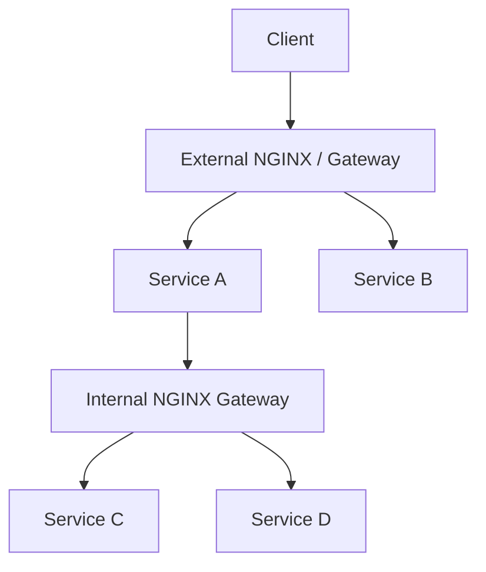

NGINX bisa menjadi:

1. **external gateway** untuk routing public API;
2. **backend-for-frontend edge**;
3. **internal domain gateway** antar bounded context;
4. **per-service local reverse proxy**;
5. **L4 proxy** untuk dependency non-HTTP.

Namun microservices menambah risiko:

- retry storm;
- timeout mismatch;
- cascading failure;
- duplicated auth/routing policy;
- route ownership tidak jelas;
- NGINX config menjadi monolith baru;
- centralized gateway menjadi bottleneck organisasi.

### 6.1 External gateway pattern

```text
/api/customers/* -> customer-service
/api/cases/*     -> case-service
/api/payments/*  -> payment-service
```

Cocok untuk:

- public API routing;
- coarse-grained protection;
- TLS/cert boundary;
- centralized logging;
- migration dari monolith ke service.

Risiko:

- gateway config berubah setiap service berubah;
- terlalu banyak business routing di NGINX;
- service team bergantung ke platform team untuk setiap route.

Mitigasi:

- path ownership registry;
- generated config dari deklarasi service;
- CI semantic test;
- route review;
- self-service safe abstractions.

### 6.2 Internal domain gateway

Misalnya regulatory platform punya domain:

```text
case-management
inspection
sanction
appeal
notification
identity
```

NGINX bisa menjadi boundary antar domain, bukan antar setiap service kecil.

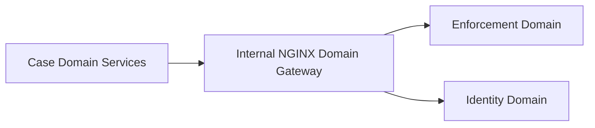

Cocok ketika:

- ada domain boundary jelas;
- perlu policy antar-domain;
- traffic tidak terlalu dynamic;
- ownership gateway jelas.

Tidak cocok jika:

- setiap service berubah endpoint setiap hari;
- service discovery dinamis sangat tinggi;
- mTLS/retry/telemetry sudah ditangani mesh;
- gateway menjadi shared bottleneck.

---

## 7. NGINX vs service mesh

Service mesh seperti Istio/Envoy-based mesh, Linkerd, Consul Connect, atau sejenisnya biasanya fokus pada service-to-service communication.

Mesh biasanya memberi:

- mTLS antar-service;
- service discovery;
- traffic splitting;
- retry/timeouts;
- circuit breaking/outlier detection;
- telemetry;
- policy;
- sidecar/gateway model.

NGINX memberi:

- edge reverse proxy;
- web/static serving;
- content cache;
- mature config model;
- L7/L4 proxying;
- ingress/gateway options;
- simpler deployment untuk banyak kasus.

Perbandingan:

| Kebutuhan | NGINX | Service Mesh |
|---|---:|---:|
| Public edge reverse proxy | Kuat | Biasanya lewat ingress gateway |
| Service-to-service mTLS skala besar | Bisa tapi manual | Kuat |
| Per-service telemetry otomatis | Manual/terbatas | Kuat |
| Static serving/cache | Kuat | Bukan fokus |
| Complex traffic policy antar ratusan service | Terbatas/manual | Kuat |
| Simplicity untuk sistem kecil-menengah | Kuat | Bisa overkill |
| Protocol-aware gateway | Kuat | Kuat, tergantung mesh |

Rule praktis:

> NGINX sering tepat di north-south edge. Service mesh sering tepat untuk east-west service traffic. Keduanya bisa coexist, tapi boundary harus jelas.

Coexist pattern:

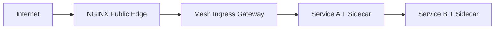

Pertanyaan boundary:

```text
[ ] TLS public berhenti di mana?
[ ] mTLS internal mulai di mana?
[ ] Retry dimiliki NGINX atau mesh?
[ ] Rate limiting di edge atau mesh?
[ ] Request ID dibuat oleh siapa?
[ ] Access log source of truth yang mana?
```

Tanpa jawaban ini, kamu akan punya dua layer proxy yang saling menyembunyikan failure.

---

## 8. NGINX di containerized deployment

Pola sederhana:

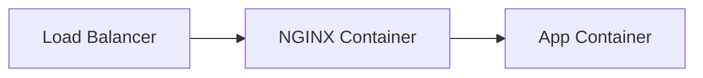

Ada beberapa model.

### 8.1 NGINX sebagai container terpisah di host/service

```yaml
services:
  nginx:
    image: nginx:stable
    ports:
      - "80:80"
    volumes:
      - ./nginx.conf:/etc/nginx/nginx.conf:ro
  app:
    image: my-app:latest
```

Cocok untuk:

- local composition;
- simple deployment;
- static frontend + backend;
- reverse proxy di environment kecil.

Risiko:

- config volume drift;
- reload orchestration;
- log routing;
- cert management;
- container health check tidak cukup menggambarkan upstream health.

### 8.2 NGINX baked into image

```dockerfile
FROM nginx:stable
COPY nginx.conf /etc/nginx/nginx.conf
COPY dist/ /usr/share/nginx/html/
```

Cocok untuk static frontend immutable.

Kelebihan:

- artifact reproducible;
- deploy rollback mudah;
- config dan asset satu versi.

Kekurangan:

- setiap config change butuh image baru;
- secret/cert jangan dibake;
- environment-specific config perlu templating hati-hati.

### 8.3 NGINX sidecar

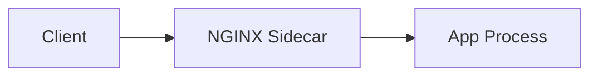

Cocok untuk:

- legacy app perlu TLS/proxy/static offload;
- app tidak bisa expose HTTP behavior yang dibutuhkan;
- transitional architecture.

Tapi untuk platform Kubernetes modern, sidecar NGINX per service sering kalah oleh ingress/gateway/mesh yang lebih operable.

---

## 9. NGINX di Kubernetes: Ingress Controller vs Gateway

Di Kubernetes, NGINX biasanya tidak dikelola sebagai config file manual per node, melainkan sebagai controller/data plane.

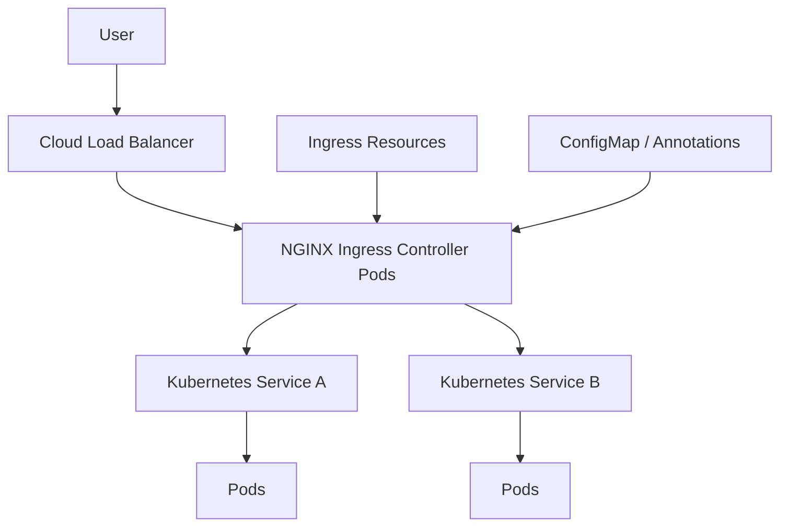

NGINX Ingress Controller watches Kubernetes resources, menghasilkan konfigurasi NGINX, lalu melakukan reload/update sesuai model controller.

Fungsi umum:

- content-based routing;
- TLS termination;
- WebSocket/gRPC support;
- TCP/UDP load balancing, tergantung controller/config;
- annotation/configmap extensions;
- integration dengan Kubernetes Service/Endpoint changes.

Namun Kubernetes menambah failure mode:

- ingress resource salah annotation;
- service endpoint kosong;
- rollout membuat endpoint churn;
- config reload terlalu sering;
- controller dan NGINX data plane punya status berbeda;
- default backend menangani route yang tidak diinginkan;
- cert secret tidak valid;
- annotation behavior berbeda antar controller.

### 9.1 Ingress API

Ingress cocok untuk:

- HTTP routing umum;
- TLS host/path routing;
- kompatibilitas luas;
- organisasi yang sudah punya pola Ingress matang.

Keterbatasan:

- API Ingress relatif sederhana;
- banyak fitur bergantung annotation vendor-specific;
- portability terbatas jika annotations banyak;
- policy kompleks sering tidak natural.

### 9.2 Gateway API

Gateway API dirancang lebih ekspresif dan role-oriented daripada Ingress.

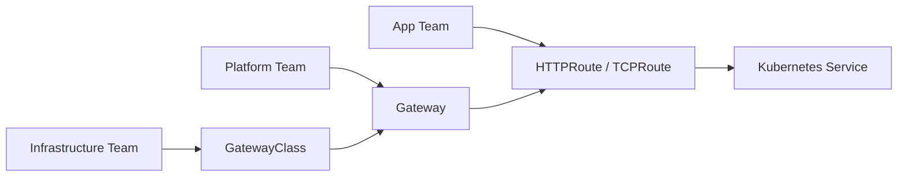

NGINX Gateway Fabric adalah implementasi Gateway API berbasis NGINX data plane.

Mental model:

- infrastructure team owns GatewayClass;
- platform/network team owns Gateway;
- app team owns Routes;
- policy attachment bisa dibuat lebih eksplisit daripada annotation-only model.

Kapan mempertimbangkan Gateway API:

- banyak team berbagi cluster edge;
- butuh ownership boundary lebih jelas;
- annotation sprawl sudah sulit dikontrol;
- ingin model routing yang lebih future-facing;
- platform ingin standard API Kubernetes yang lebih kaya.

---

## 10. NGINX sebagai API gateway: batas realistis

NGINX bisa menjalankan banyak API gateway concern:

```text
TLS termination
host/path routing
header normalization
request size limit
rate limit
basic auth
JWT validation in some distributions/modules
CORS
upstream selection
canary split
logging
```

Namun API gateway enterprise biasanya mencakup hal lebih luas:

```text
API catalog
developer portal
consumer onboarding
API keys lifecycle
per-consumer quota
billing/monetization
schema validation
request/response transformation
policy versioning
analytics business-level
approval workflow
```

NGINX Open Source bukan pengganti penuh API management platform.

Decision matrix:

| Use case | NGINX cukup? | Catatan |
|---|---:|---|
| Public REST routing sederhana | Ya | sangat umum |
| TLS + rate limit + header policy | Ya | cocok |
| gRPC gateway edge | Ya, dengan desain HTTP/2 benar | butuh testing |
| Per-tenant dynamic quota distributed | Tidak ideal | butuh state/policy backend |
| API product lifecycle | Tidak | pakai API management |
| Complex authz per object | Tidak | app/policy engine |
| Developer portal | Tidak | bukan fungsi NGINX |

Rule:

> NGINX sebagai API gateway bagus untuk protocol gateway. Untuk business API platform, NGINX hanya salah satu data plane atau edge layer.

---

## 11. NGINX sebagai origin shield/cache layer

Pola:

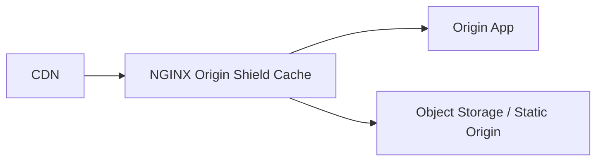

Cocok ketika:

- origin expensive;
- CDN cache miss tinggi;
- perlu cache behavior internal lebih eksplisit;
- perlu stale-on-error untuk endpoint publik;
- origin app perlu dilindungi dari thundering herd.

Contoh use case:

- public catalog;
- public regulation/reference data;
- generated reports yang sama untuk banyak user;
- static metadata;
- expensive read-only endpoint.

Tidak cocok untuk:

- user-specific data;
- authorization-sensitive response;
- frequently mutated state tanpa invalidation strategy;
- compliance-sensitive data yang tidak boleh stale.

Design question:

```text
[ ] Apakah response benar-benar public?
[ ] Apakah query string bagian dari identity response?
[ ] Apakah Accept-Language/Encoding memengaruhi body?
[ ] Apakah stale response legal/acceptable?
[ ] Bagaimana purge/invalidation dilakukan?
[ ] Apa yang terjadi saat disk cache penuh?
```

---

## 12. NGINX sebagai L4 proxy

NGINX tidak hanya HTTP. Dengan stream module, NGINX bisa proxy/load balance TCP dan UDP.

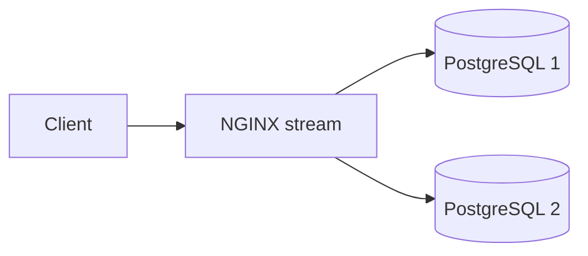

Use case:

- TCP load balancing;
- TLS passthrough;
- SNI-based routing without HTTP termination;
- preserving client IP with PROXY protocol;
- UDP proxy for DNS/syslog/RADIUS-like services;
- internal dependency boundary.

Namun L4 proxy punya batas:

- NGINX tidak memahami semantic SQL/app protocol secara penuh;
- health check open-source biasanya lebih terbatas dibanding Plus/managed systems;
- connection pooling semantics harus dipahami;
- database failover bukan sekadar load balancing;
- transactional consistency tidak bisa diselesaikan NGINX.

Rule:

> L4 NGINX bagus untuk transport-level indirection. Jangan menjadikannya pengganti database-aware failover manager.

---

## 13. Deployment topology patterns

### Pattern A — Managed LB → NGINX → App

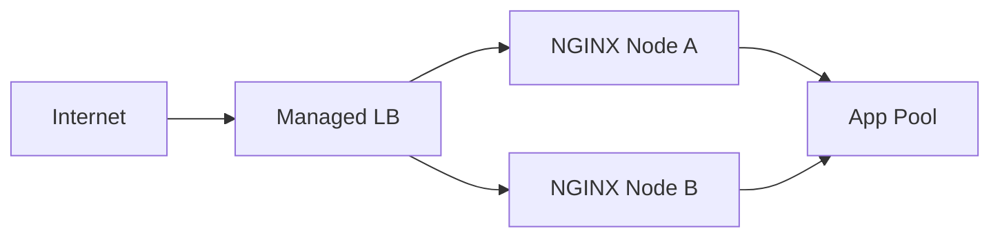

Kelebihan:

- managed LB memberi HA entrypoint;
- NGINX memberi routing/policy/cache;
- app terlindungi.

Risiko:

- dua layer health check;
- forwarded IP harus benar;
- cert termination bisa di LB atau NGINX, jangan ambigu;
- NGINX nodes harus disk/log/cert/config-managed.

Cocok untuk:

- VM/bare metal apps;
- hybrid cloud;
- high-control environments;
- gradual modernization.

### Pattern B — CDN → NGINX Origin → App

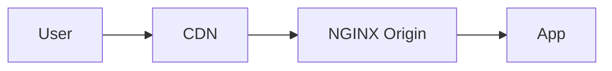

Kelebihan:

- origin shielding;
- detailed origin policy;
- cache layering.

Risiko:

- double cache invalidation;
- duplicate security controls;
- forwarded header trust complexity.

Cocok untuk:

- high traffic public sites;
- expensive origin APIs;
- static + dynamic mix.

### Pattern C — Kubernetes LB → NGINX Ingress → Services

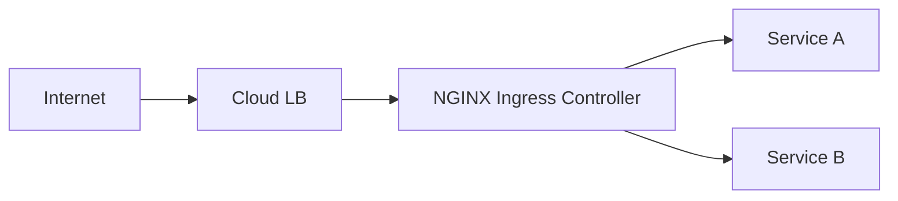

Kelebihan:

- Kubernetes-native routing;
- dynamic endpoint discovery;
- team-level ingress resources;
- good fit for cluster edge.

Risiko:

- annotation sprawl;
- controller-specific behavior;
- reload churn;
- endpoint readiness mismatch.

Cocok untuk:

- Kubernetes-hosted apps;
- platform-managed ingress;
- multi-service cluster.

### Pattern D — NGINX Gateway Fabric / Gateway API

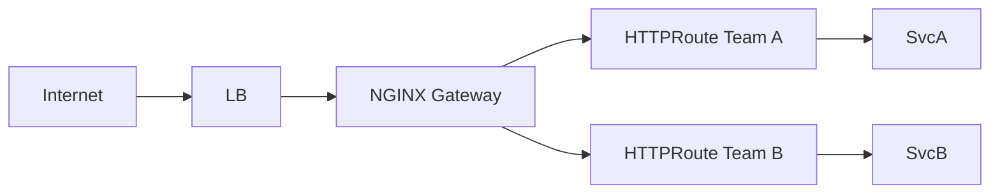

Kelebihan:

- better role separation;
- more expressive API than Ingress;
- less annotation-centric;
- platform governance lebih jelas.

Risiko:

- maturity/feature parity harus dievaluasi;
- migration dari Ingress perlu planning;
- team perlu memahami Gateway API.

Cocok untuk:

- multi-team platform;
- governance-heavy environment;
- future-facing Kubernetes networking.

### Pattern E — NGINX sidecar per app

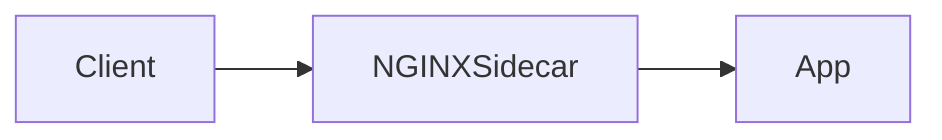

Kelebihan:

- app-local control;
- migration legacy;
- TLS/static/proxy offload.

Risiko:

- config duplication;
- per-service operational overhead;
- difficult global policy consistency;
- sidecar sprawl.

Cocok untuk:

- transitional legacy app;
- special protocol need;
- single service needing local proxy behavior.

---

## 14. Ownership model

NGINX failure sering bukan technical failure, tapi ownership failure.

Pertanyaan ownership:

```text
[ ] Siapa owner base nginx.conf?
[ ] Siapa owner virtual host route?
[ ] Siapa owner TLS certificate?
[ ] Siapa owner upstream inventory?
[ ] Siapa owner cache policy?
[ ] Siapa owner rate limit policy?
[ ] Siapa yang menerima alert 502/504?
[ ] Siapa yang boleh reload/deploy config?
[ ] Siapa yang approve route baru?
```

Model umum:

| Artifact | Owner ideal |
|---|---|
| base runtime config | platform/SRE |
| security baseline | security/platform |
| route declaration | app team |
| generated NGINX config | platform automation |
| cert lifecycle | platform/security automation |
| cache policy | app + platform review |
| incident response | shared app/platform |

Untuk sistem besar, jangan minta app team menulis raw NGINX config penuh. Lebih aman memberi abstraction:

```yaml
service: case-service
host: api.example.com
routes:
  - path: /v1/cases/
    upstream: case-service:8080
    timeout: 3s
    maxBody: 2mb
  - path: /v1/cases/*/attachments
    upstream: case-service:8080
    timeout: 30s
    maxBody: 50mb
```

Lalu platform menghasilkan NGINX config dari deklarasi yang tervalidasi.

Kenapa?

Karena raw NGINX config punya terlalu banyak footgun untuk self-service massal.

---

## 15. Routing ownership dan path registry

Jika NGINX menjadi API edge, kamu perlu registry.

Contoh registry:

| Host | Path prefix | Owner | Upstream | Policy class |
|---|---|---|---|---|
| `api.example.com` | `/v1/cases/` | case team | case-service | api-default |
| `api.example.com` | `/v1/cases/*/attachments` | case team | case-service | upload |
| `api.example.com` | `/v1/inspections/` | inspection team | inspection-service | api-default |
| `admin.example.com` | `/` | platform | admin-frontend | admin-restricted |

Policy class bisa menghasilkan config standar:

```yaml
policyClasses:
  api-default:
    maxBody: 2mb
    connectTimeout: 250ms
    readTimeout: 3s
    rateLimit: standard-api
  upload:
    maxBody: 50mb
    connectTimeout: 250ms
    readTimeout: 30s
    buffering: default
  admin-restricted:
    maxBody: 1mb
    allowCidrs:
      - 10.0.0.0/8
```

Tujuannya:

- route tidak tabrakan;
- policy konsisten;
- review mudah;
- config generated;
- audit perubahan jelas;
- app team tetap bisa self-service.

---

## 16. NGINX in regulated systems

Untuk sistem regulasi, enforcement, case management, atau audit-heavy platform, NGINX biasanya bukan source of truth domain. Namun ia penting sebagai **technical control layer**.

NGINX bisa membantu:

- memaksa HTTPS;
- mTLS antar boundary tertentu;
- allowlist admin endpoint;
- request size limit;
- coarse rate limit;
- correlation id propagation;
- immutable-ish access logs;
- upstream timing evidence;
- deny unknown host;
- standardized security headers;
- separation public/admin/internal host.

NGINX tidak boleh menjadi satu-satunya:

- authorization decision source;
- audit trail hukum/domain;
- case state transition enforcer;
- evidence repository;
- policy exception engine.

Pattern yang defensible:

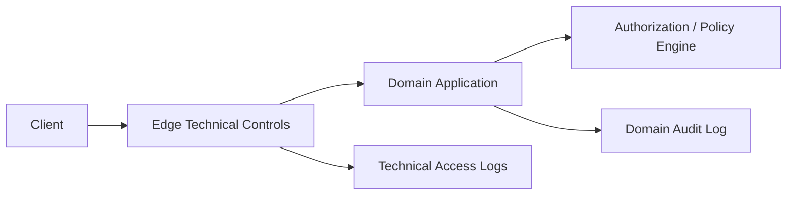

Pembagian:

| Concern | Owner |
|---|---|
| request reached system | NGINX technical log |
| user is allowed to act | app/policy engine |
| case state changed | domain audit log |
| evidence generated | domain evidence store |
| suspicious traffic | NGINX/security telemetry |

Ini penting agar audit tidak bergantung pada edge logs saja.

---

## 17. Cost of adding NGINX

NGINX bukan gratis secara operasional.

Biaya nyata:

- config design;
- testing;
- CVE tracking;
- patching;
- certificate lifecycle;
- metrics/log pipeline;
- tuning;
- incident ownership;
- HA topology;
- capacity planning;
- documentation;
- team knowledge.

Hidden cost:

- “temporary” rewrite menjadi permanen;
- route ownership kabur;
- app bugs ditutupi proxy behavior;
- cache invalidation jadi incident;
- security policy tersebar di banyak file;
- debugging melewati terlalu banyak proxy layer.

Gunakan NGINX ketika value-nya melebihi biaya ini.

---

## 18. Architecture review checklist

Sebelum memasukkan NGINX ke design, review:

```text
Traffic Boundary
[ ] Boundary apa yang dijaga NGINX?
[ ] Public, internal, cluster, atau dependency edge?
[ ] Apa yang terjadi jika NGINX down?

Responsibilities
[ ] Apa saja behavior yang dimiliki NGINX?
[ ] Behavior mana yang dimiliki CDN/LB/mesh/app?
[ ] Ada duplicated policy?

Availability
[ ] Berapa replica/node?
[ ] Siapa health-check NGINX?
[ ] Apa readiness criteria?
[ ] Bagaimana zero-downtime config reload?

Security
[ ] TLS termination di mana?
[ ] Source IP trust chain bagaimana?
[ ] Unknown host diapakan?
[ ] Header spoofing dicegah?
[ ] Admin/internal route dipisah?

Routing
[ ] Host/path registry ada?
[ ] Route conflict dicek?
[ ] Default route aman?
[ ] Rewrite bisa dihindari?

Upstream
[ ] Service discovery model apa?
[ ] Timeout/retry per endpoint class?
[ ] Keepalive strategy?
[ ] Health check semantics?

Observability
[ ] Access log structured?
[ ] Upstream timing dicatat?
[ ] Metrics tersedia?
[ ] Alert owner jelas?
[ ] Config version terlihat?

Operations
[ ] Config source of truth di mana?
[ ] CI menjalankan nginx -t?
[ ] Smoke test apa?
[ ] Rollback bagaimana?
[ ] Patching/CVE process siapa?
```

Jika banyak jawaban kosong, masalahnya bukan NGINX config. Masalahnya architecture readiness.

---

## 19. Decision matrix cepat

| Situation | Rekomendasi |
|---|---|
| Static frontend sederhana di container | NGINX sangat cocok |
| Public monolith butuh TLS/static/reverse proxy | NGINX cocok |
| Basic traffic distribution di cloud | Managed LB mungkin cukup |
| Kubernetes HTTP ingress multi-service | NGINX Ingress/Gateway cocok bila platform siap |
| Hundreds of services needing mTLS/retry/telemetry | Service mesh lebih cocok untuk east-west |
| API monetization/developer portal/quota business | API management platform, NGINX hanya edge/data plane |
| Expensive public read endpoints | NGINX cache/origin shield cocok |
| User-specific authenticated data | Cache NGINX harus sangat hati-hati atau dihindari |
| Database failover orchestration | Jangan mengandalkan NGINX saja |
| Regulated audit trail | NGINX log hanya technical evidence, bukan domain audit |

---

## 20. Reference architecture: balanced production edge

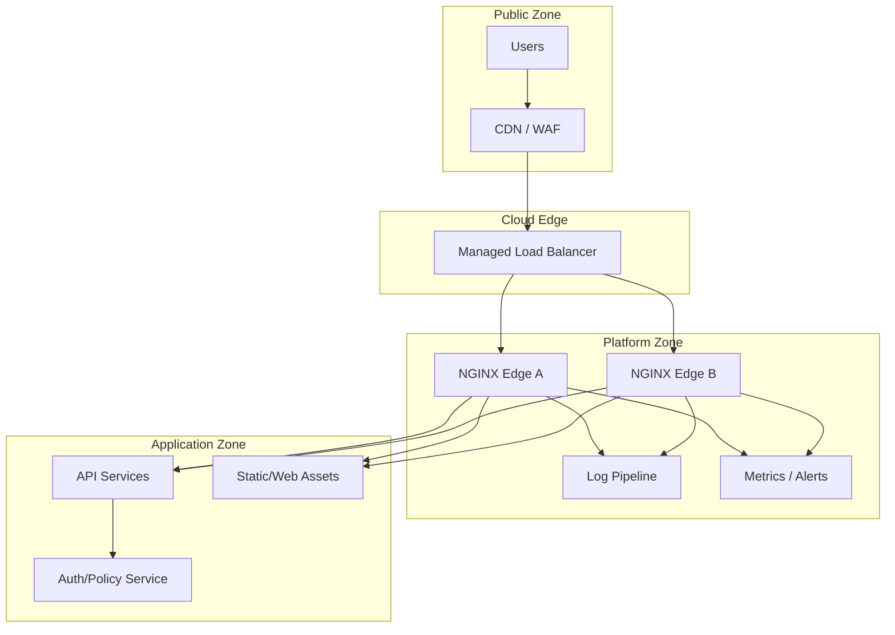

Responsibility split:

| Layer | Responsibility |
|---|---|
| CDN/WAF | global protection, public cache, bot/DDoS controls |
| Managed LB | HA entrypoint, node health checks |
| NGINX | host/path routing, TLS if not at CDN/LB, header normalization, timeout, cache, logs |
| App | business logic, authz, domain audit, state changes |
| Observability | logs/metrics/traces/alerts across layers |

Ini bukan satu-satunya arsitektur benar. Ini reference mental model.

---

## 21. Anti-pattern architecture

### 21.1 NGINX as accidental monolith gateway

Semua service route dimasukkan manual ke satu file besar:

```text
/etc/nginx/conf.d/all-services.conf
```

Gejala:

- file ribuan baris;
- route ownership tidak jelas;
- perubahan satu service berisiko semua service;
- tidak ada generator/test;
- reload manual;
- incident RCA sulit.

Solusi:

- route registry;
- generated config;
- policy class;
- ownership metadata;
- semantic tests;
- split by host/domain.

### 21.2 Double gateway without contract

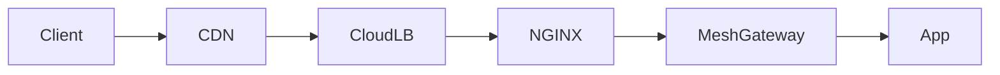

Layer ini bisa valid, tapi hanya jika kontraknya jelas.

Tanpa kontrak:

- siapa retry?
- siapa timeout?
- siapa auth?
- siapa rate limit?
- siapa log source of truth?
- siapa terminate TLS?

Jika tidak jelas, debugging akan mahal.

### 21.3 NGINX hiding application failures

Misalnya semua upstream error diubah menjadi 200 dengan fallback HTML.

Itu mungkin bagus untuk static maintenance page, tapi berbahaya untuk API karena client dan monitoring bisa mengira request berhasil.

Rule:

- fallback boleh, tapi status harus benar;
- user-friendly error tidak boleh merusak machine contract;
- logs harus mencatat upstream failure asli.

### 21.4 Dynamic service discovery hacked with reload loops

Menghasilkan config baru dan reload setiap beberapa detik untuk endpoint churn bisa berbahaya.

Untuk Kubernetes, gunakan controller. Untuk service discovery dinamis di luar Kubernetes, desain resolver/upstream strategy dengan hati-hati, atau pakai komponen yang memang dibuat untuk dynamic discovery.

---

## 22. Skill target setelah part ini

Setelah Part 002, kamu harus bisa:

1. menjelaskan minimal lima posisi NGINX dalam arsitektur modern;
2. membedakan fungsi NGINX, CDN, managed LB, service mesh, dan API management;
3. menentukan kapan NGINX memberi nilai dan kapan redundant;
4. mendesain ownership model untuk config/route/cert/cache/incident;
5. mengidentifikasi duplicated policy antar proxy layer;
6. membuat architecture review checklist sebelum menaruh NGINX di jalur traffic;
7. menjelaskan mengapa NGINX log bukan pengganti audit domain;
8. memilih antara Ingress dan Gateway API secara konseptual.

---

## 23. Latihan architecture review

Scenario:

```text
Sebuah platform case-management regulatory berjalan di Kubernetes.
Public traffic masuk dari CDN ke cloud load balancer.
Tim ingin menambahkan NGINX Ingress Controller untuk routing service.
Beberapa endpoint public read-only mahal dihitung.
Admin UI hanya boleh dari VPN.
Semua perubahan case harus punya audit domain.
```

Desain awal:

```mermaid
flowchart LR
    User --> CDN
    Admin[Admin via VPN] --> CDN
    CDN --> LB[Cloud LB]
    LB --> NIC[NGINX Ingress Controller]
    NIC --> Case[Case Service]
    NIC --> AdminUI[Admin UI]
    Case --> Audit[Domain Audit]
```

Review jawaban yang diharapkan:

```text
[ ] CDN owns public DDoS/WAF and maybe global static cache.
[ ] Cloud LB owns HA entrypoint to ingress controller.
[ ] NGINX Ingress owns Kubernetes host/path routing and some edge policies.
[ ] Public read-only expensive endpoints may use cache only if response is public and key is safe.
[ ] Admin UI must have separate host and allowlist/VPN enforcement; do not rely only on frontend hiding.
[ ] Case state changes must be audited in application/domain audit store, not only NGINX access log.
[ ] Source IP trust chain from CDN -> LB -> NGINX must be explicit.
[ ] Route ownership should be declared per service/team.
[ ] Ingress annotations should be governed to avoid unsafe self-service.
[ ] Upstream timeout/retry must respect domain semantics, especially writes.
```

---

## Referensi resmi

- NGINX official site: NGINX sebagai HTTP web server, reverse proxy, content cache, load balancer, TCP/UDP proxy, dan mail proxy.
- NGINX reverse proxy documentation: proxy server, request header modification, response buffering.
- NGINX HTTP load balancing documentation: Layer 7 load balancing dan algoritma.
- NGINX TCP/UDP load balancing documentation: Layer 4 proxy/load balancing untuk TCP dan UDP.
- F5 NGINX Ingress Controller documentation: Kubernetes Ingress Controller berbasis NGINX/NGINX Plus, WebSocket/gRPC/TCP/UDP, content-based routing, TLS termination.
- F5 NGINX Gateway Fabric documentation: Gateway API implementation dengan NGINX data plane.

---

## Penutup

Part 001 membangun mental model NGINX sebagai edge traffic state machine.

Part 002 menempatkan NGINX di arsitektur nyata dan memberi decision framework agar kamu tidak memasang NGINX secara refleks.

Part berikutnya akan turun ke runtime internal: **master/worker process, event-driven architecture, reload semantics, worker lifecycle, connection handling, dan konsekuensi operasionalnya**.
