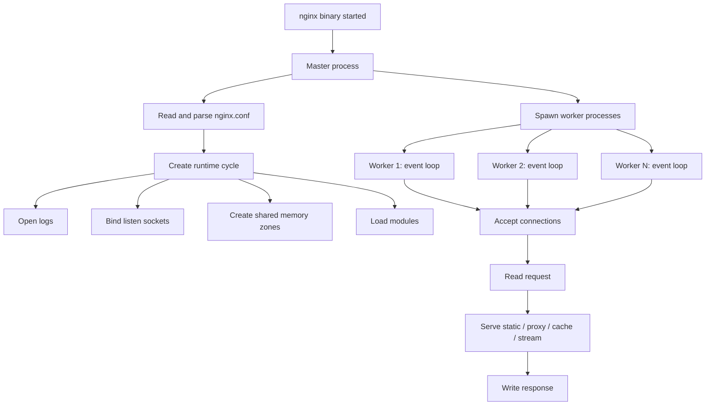
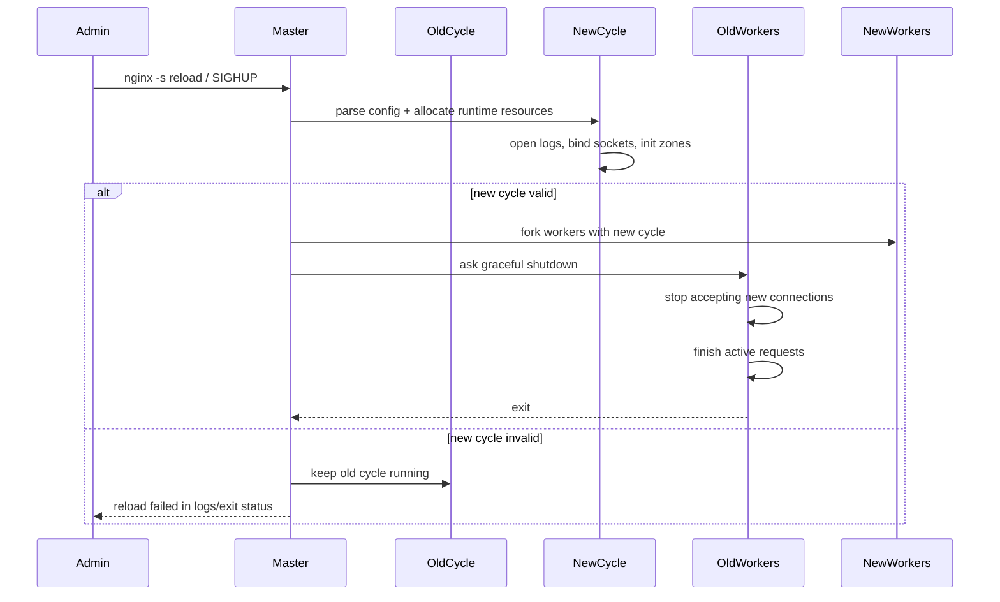
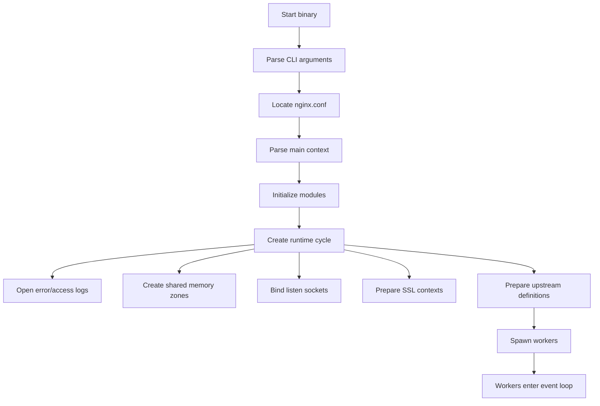
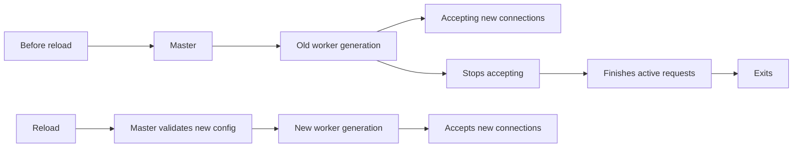

# Part 003 — Master/Worker Runtime: Cara NGINX Hidup, Reload, Fork, dan Melayani Koneksi

NGINX sering terlihat seperti satu binary kecil yang hanya membaca `nginx.conf`. Mental model itu terlalu dangkal untuk production.

Di production, NGINX adalah **runtime system**:

1. ada proses yang bertanggung jawab membaca konfigurasi dan mengelola lifecycle;
2. ada proses yang benar-benar menerima koneksi dan memproses request;
3. ada resource yang sengaja diwariskan antar proses;
4. ada shared memory yang dipakai lintas worker;
5. ada reload protocol yang menjaga worker lama tetap hidup sampai koneksi lama selesai;
6. ada failure mode ketika reload, log rotation, binary upgrade, socket binding, certificate rotation, atau worker shutdown tidak dipahami dengan benar.

Part ini membangun mental model tersebut dari bawah.

Dokumentasi resmi NGINX menyatakan bahwa NGINX memiliki satu master process dan beberapa worker process. Master membaca dan mengevaluasi konfigurasi serta memelihara worker; worker melakukan pemrosesan request. NGINX memakai event-based model dan mekanisme OS-dependent untuk mendistribusikan request secara efisien ke worker.

Referensi resmi:

- `https://nginx.org/en/docs/beginners_guide.html`
- `https://nginx.org/en/docs/ngx_core_module.html`
- `https://nginx.org/en/docs/control.html`
- `https://nginx.org/en/docs/dev/development_guide.html`

---

## 1. Mental model utama

NGINX bukan aplikasi multi-threaded request-per-thread seperti model server klasik.

NGINX adalah proses master yang menyiapkan runtime, lalu melahirkan worker event-driven yang menangani banyak koneksi secara non-blocking.



Pemisahan master dan worker adalah alasan NGINX bisa melakukan beberapa hal penting:

- reload konfigurasi tanpa langsung mematikan koneksi aktif;
- membuka socket privileged seperti port `80`/`443` sebelum worker turun privilege;
- menjaga worker tetap berjalan meskipun worker tertentu crash;
- melakukan log reopening untuk rotasi log;
- menjalankan beberapa worker process untuk memanfaatkan multi-core;
- memisahkan lifecycle konfigurasi dari lifecycle koneksi.

Kalimat pentingnya:

> Master mengatur bentuk dunia. Worker hidup di dalam dunia itu dan memproses traffic.

---

## 2. Runtime entities di NGINX

### 2.1 Master process

Master process bertanggung jawab untuk:

- membaca file konfigurasi;
- mengevaluasi directive;
- membuka file log;
- binding listen socket;
- menyiapkan shared memory zone;
- memuat dynamic module;
- fork worker process;
- menerima signal kontrol;
- reload konfigurasi;
- graceful shutdown;
- binary upgrade;
- menjaga worker lifecycle.

Master biasanya berjalan sebagai `root` ketika perlu bind port privileged atau melakukan operasi filesystem tertentu. Worker kemudian dapat berjalan sebagai user non-privileged melalui directive `user`.

Contoh:

```nginx
user nginx nginx;
worker_processes auto;

error_log /var/log/nginx/error.log warn;
pid /run/nginx.pid;

events {
    worker_connections 4096;
}

http {
    include /etc/nginx/mime.types;

    server {
        listen 80;
        server_name example.com;

        location / {
            return 200 "ok\n";
        }
    }
}
```

Di config ini:

- master membaca config;
- master membuka `/var/log/nginx/error.log`;
- master membuat PID file `/run/nginx.pid`;
- master bind port `80`;
- master fork worker;
- worker menjalankan event loop;
- worker melayani request HTTP.

### 2.2 Worker process

Worker process melakukan kerja utama:

- menerima koneksi client;
- membaca request;
- menjalankan state machine HTTP/stream/mail;
- memilih `server` dan `location`;
- melayani static file;
- meneruskan request ke upstream;
- membaca response upstream;
- menulis response ke client;
- menulis access log;
- memakai shared memory zone untuk rate limit, cache metadata, upstream state, dan fitur lain;
- menjalankan timer untuk timeout.

Worker tidak seharusnya melakukan blocking operation lama. Desain NGINX mengandalkan event loop. Satu worker bisa menangani ribuan koneksi karena tidak membuat satu thread per koneksi.

### 2.3 Cache manager dan cache loader

Jika proxy cache aktif, NGINX dapat menjalankan helper process seperti cache manager dan cache loader.

Secara konseptual:

- **cache loader** membaca metadata cache dari disk setelah start agar cache zone mengetahui item yang sudah ada;
- **cache manager** menjaga ukuran cache agar sesuai batas `max_size`, menghapus object lama, dan mengatur pressure storage.

Ini penting karena cache bukan sekadar directory berisi file. Ada metadata, index, loader behavior, eviction, dan disk pressure.

Kita akan bahas detail di Phase Content Cache.

### 2.4 Shared memory zone

Beberapa fitur NGINX butuh state bersama antar worker. Contoh:

- `limit_req_zone` untuk rate limiting;
- `limit_conn_zone` untuk connection limiting;
- `proxy_cache_path keys_zone=...` untuk cache metadata;
- upstream shared zone pada beberapa skenario;
- SSL session cache shared;
- status/metrics zone pada fitur tertentu.

Tanpa shared memory, setiap worker hanya tahu state dirinya sendiri. Itu berbahaya untuk policy yang harus konsisten lintas worker.

Contoh:

```nginx
http {
    limit_req_zone $binary_remote_addr zone=api_rate:20m rate=10r/s;

    server {
        listen 80;

        location /api/ {
            limit_req zone=api_rate burst=20 nodelay;
            proxy_pass http://api_backend;
        }
    }
}
```

`api_rate` bukan variable biasa. Ia adalah shared memory zone. Semua worker menggunakan state yang sama untuk menghitung rate per key.

---

## 3. Apa itu runtime cycle?

Dalam development guide NGINX, konsep internal penting disebut **cycle**. Secara sederhana, cycle adalah runtime context yang dibuat dari konfigurasi tertentu.

Satu cycle berisi hal-hal seperti:

- memory pool untuk cycle itu;
- konfigurasi module;
- log object;
- connection array;
- shared memory;
- module list;
- listening sockets;
- file descriptor mapping.

Saat reload, NGINX tidak sekadar “mengubah variable config”. Master membuat cycle baru dari konfigurasi baru.



Ini menjelaskan kenapa reload NGINX umumnya aman:

- config baru diuji dan resource baru dicoba dulu;
- kalau gagal, old cycle tetap jalan;
- worker lama tidak langsung dibunuh;
- worker baru mengambil traffic baru setelah berhasil dibuat.

Tetapi “umumnya aman” bukan berarti selalu tidak berdampak. Dampaknya tergantung koneksi aktif, long-lived stream, WebSocket, file descriptor, port binding, dan apakah config baru kompatibel dengan resource lama.

---

## 4. Startup pipeline

Saat NGINX start, pipeline besarnya seperti ini:



### 4.1 Parse config

NGINX config bukan script imperative biasa. Ia adalah declarative module configuration.

Directive seperti ini:

```nginx
worker_processes auto;
```

mempengaruhi main context.

Directive seperti ini:

```nginx
events {
    worker_connections 4096;
}
```

mempengaruhi event module.

Directive seperti ini:

```nginx
http {
    server {
        listen 443 ssl;
        server_name api.example.com;
    }
}
```

mempengaruhi HTTP module, virtual server table, listening socket, SNI certificate mapping, dan request routing behavior.

### 4.2 Bind listen sockets

Socket bind adalah salah satu tahap paling kritis.

Config dapat valid secara sintaks tetapi gagal runtime karena:

- port sudah dipakai proses lain;
- user tidak punya privilege bind port;
- IP address tidak ada di host;
- IPv6 tidak tersedia;
- `reuseport` salah dipahami;
- systemd socket activation tidak konsisten;
- container port mapping tidak sesuai;
- SELinux/AppArmor melarang operasi tertentu.

Contoh config valid secara sintaks, tetapi bisa gagal apply:

```nginx
server {
    listen 10.10.10.10:443 ssl;
    server_name example.com;

    ssl_certificate /etc/nginx/certs/example.crt;
    ssl_certificate_key /etc/nginx/certs/example.key;
}
```

Jika host tidak punya IP `10.10.10.10`, bind bisa gagal.

### 4.3 Open log files

NGINX membuka log file sebagai bagian dari runtime. Ini sebabnya rotasi log butuh signal `reopen`, bukan hanya rename file.

Jika file log di-rename oleh logrotate tetapi NGINX tidak diberi signal reopen, worker masih bisa menulis ke file descriptor lama.

### 4.4 Fork workers

Setelah runtime siap, master fork worker.

Worker mewarisi resource tertentu dari master, termasuk listening socket. Inilah yang membuat worker bisa menerima koneksi tanpa masing-masing bind ulang dari nol.

---

## 5. Signal handling: control plane NGINX

NGINX dikontrol dengan signal. `nginx -s reload` hanyalah wrapper yang mengirim signal ke master process.

Tabel yang perlu dihafal bukan sebagai trivia, tapi sebagai operational API.

| Action | CLI | Signal umum | Makna production |
|---|---|---|---|
| Fast shutdown | `nginx -s stop` | `TERM`/`INT` | Berhenti cepat. Bisa memutus koneksi aktif. |
| Graceful shutdown | `nginx -s quit` | `QUIT` | Stop menerima traffic baru, selesaikan koneksi aktif. |
| Reload config | `nginx -s reload` | `HUP` | Parse config baru, spawn worker baru, drain worker lama. |
| Reopen logs | `nginx -s reopen` | `USR1` | Tutup/buka ulang log file. Dipakai logrotate. |
| Binary upgrade | manual signal flow | `USR2` | Upgrade binary tanpa stop penuh. Advanced dan riskier. |
| Stop workers gracefully | manual | `WINCH` | Biasanya bagian binary upgrade/testing. |

Playbook minimal:

```bash
# validasi config
nginx -t

# reload jika valid
nginx -s reload

# graceful shutdown
nginx -s quit

# reopen log setelah logrotate
nginx -s reopen
```

Untuk systemd-based deployment:

```bash
systemctl reload nginx
systemctl status nginx
journalctl -u nginx --since "10 minutes ago"
```

Jangan menganggap semua distro memakai unit file identik. Selalu cek:

```bash
systemctl cat nginx
```

---

## 6. Graceful reload secara detail

Reload adalah salah satu fitur operasional NGINX yang paling sering dipakai dan paling sering disalahpahami.

Flow-nya:

1. admin mengirim reload;
2. master menerima signal;
3. master membaca config baru;
4. master melakukan syntax validation dan runtime resource initialization;
5. jika gagal, master tetap memakai config lama;
6. jika berhasil, master spawn worker baru;
7. worker baru menerima koneksi baru;
8. worker lama berhenti menerima koneksi baru;
9. worker lama menyelesaikan request/koneksi yang sudah ada;
10. worker lama exit.

### 6.1 Reload bukan restart

Restart mematikan proses lama dan start proses baru.

Reload membuat generasi worker baru sambil generasi worker lama drain.



### 6.2 Reload bisa gagal tanpa outage

Ini kekuatan besar NGINX.

Contoh config typo:

```nginx
worker_processes auto
```

Kurang `;` membuat config invalid. Saat reload, master gagal membuat cycle baru dan terus memakai old cycle.

Namun jangan jadikan ini alasan untuk tidak punya CI validation. Reload gagal tetap incident jika perubahan yang diharapkan tidak aktif, certificate tidak berganti, route tidak berubah, atau mitigation security tidak apply.

### 6.3 Reload bisa berhasil tetapi tetap berdampak

Reload dapat berdampak jika:

- banyak long-lived connection seperti WebSocket/SSE;
- `worker_shutdown_timeout` terlalu pendek;
- worker lama menahan file descriptor lama;
- certificate file baru salah chain tetapi config tetap valid;
- upstream DNS berubah tetapi resolver behavior tidak sesuai ekspektasi;
- cache zone berubah sehingga metadata cache reset;
- shared memory zone size/name berubah;
- listener berubah sehingga traffic baru masuk ke socket berbeda;
- service manager melakukan restart, bukan reload;
- container orchestrator membunuh pod terlalu cepat.

### 6.4 Long-lived connection adalah musuh graceful reload

Jika request normal selesai dalam 50 ms, worker lama cepat exit.

Jika ada WebSocket bertahan 6 jam, worker lama bisa bertahan lama juga, kecuali dibatasi.

Directive yang relevan:

```nginx
worker_shutdown_timeout 30s;
```

Maknanya: setelah shutdown graceful dimulai, worker diberi batas waktu untuk menyelesaikan koneksi. Setelah timeout, koneksi yang tersisa bisa ditutup.

Trade-off:

- terlalu pendek: long request/WebSocket/SSE bisa putus saat deploy;
- terlalu panjang: worker lama menumpuk, file descriptor/log/cert lama bertahan;
- tanpa pemahaman: deploy dianggap “hang” padahal worker sedang drain.

---

## 7. Worker process sizing

Directive utama:

```nginx
worker_processes auto;
```

`auto` biasanya pilihan baseline yang baik untuk production modern karena NGINX menyesuaikan jumlah worker dengan CPU core yang tersedia.

Namun sizing worker bukan sekadar “semakin banyak semakin baik”.

### 7.1 CPU-bound vs I/O-bound

NGINX sering I/O-bound, tetapi bisa menjadi CPU-bound ketika:

- TLS handshake tinggi;
- gzip compression berat;
- banyak regex location/rewrite/map kompleks;
- header processing berat;
- njs/Lua scripting;
- WAF inspection;
- HTTP/2/HTTP/3 overhead tinggi;
- logging synchronous ke storage lambat;
- banyak small response dengan crypto overhead.

Jika CPU-bound, `worker_processes auto` membantu memanfaatkan core.

Jika bottleneck ada di upstream, disk, network, conntrack, atau kernel limit, menambah worker tidak menyelesaikan akar masalah.

### 7.2 Worker CPU affinity

NGINX punya directive `worker_cpu_affinity` untuk pin worker ke CPU tertentu.

Ini advanced. Jangan dipakai hanya karena terlihat low-level.

Gunakan jika:

- traffic sangat tinggi;
- NUMA/topology CPU relevan;
- profiling menunjukkan cache miss/context switch issue;
- benchmark realistis membuktikan manfaat;
- tim operasi memahami konsekuensi.

Default modern biasanya cukup baik.

### 7.3 Worker priority

Directive `worker_priority` dapat mengubah nice priority worker.

Ini juga jarang perlu. Jika kamu merasa perlu menaikkan priority NGINX, biasanya ada pertanyaan lebih fundamental:

- apakah host melakukan terlalu banyak hal?
- apakah noisy neighbor terjadi?
- apakah CPU quota container terlalu kecil?
- apakah TLS/compression/WAF perlu dipindah atau dituning?
- apakah ada process lain yang seharusnya dipisah?

---

## 8. `worker_connections` bukan jumlah user maksimum

Directive:

```nginx
events {
    worker_connections 4096;
}
```

Banyak engineer mengira total kapasitas = `worker_processes * worker_connections` = jumlah client.

Itu tidak selalu benar.

`worker_connections` adalah batas koneksi per worker. Koneksi itu mencakup lebih dari client connection.

Untuk reverse proxy, satu request aktif bisa memakai:

- 1 koneksi client;
- 1 koneksi upstream;
- potensi file descriptor log/cache/temp file;
- socket DNS/resolver pada kondisi tertentu;
- koneksi keepalive yang idle.

Model kasar:

```txt
max_active_client_connections
≈ worker_processes * worker_connections / connection_cost_per_client
```

Untuk reverse proxy sederhana:

```txt
connection_cost_per_client ≈ 2
```

Karena ada client side dan upstream side.

Contoh:

```nginx
worker_processes 4;

events {
    worker_connections 4096;
}
```

Upper bound koneksi object:

```txt
4 * 4096 = 16384 connection slots
```

Tapi jika setiap request aktif juga membuka upstream connection:

```txt
client aktif realistis ≈ 16384 / 2 = 8192
```

Belum termasuk keepalive idle, WebSocket, file descriptor, cache temp file, dan OS limit.

### 8.1 File descriptor limit

`worker_connections` tidak berguna jika `ulimit -n` terlalu rendah.

Cek:

```bash
cat /proc/$(pgrep -o nginx)/limits | grep "open files"
```

Di systemd, limit bisa diatur di unit override:

```ini
[Service]
LimitNOFILE=1048576
```

Kemudian:

```bash
systemctl daemon-reload
systemctl restart nginx
```

Dalam NGINX main context, ada juga:

```nginx
worker_rlimit_nofile 1048576;
```

Namun limit OS/service manager tetap harus mendukung.

### 8.2 Production sizing formula awal

Untuk baseline reverse proxy:

```txt
required_worker_connections
>= peak_client_connections_per_worker
 + peak_upstream_connections_per_worker
 + idle_keepalive_budget_per_worker
 + safety_margin
```

Bentuk praktis:

```txt
worker_connections >= ceil((peak_client_conn * 2.5) / worker_processes)
```

`2.5` bukan hukum fisika. Itu starting heuristic untuk menghitung client + upstream + overhead. Validasi dengan metrics.

---

## 9. Event module dan connection processing method

NGINX memakai event module yang berbeda tergantung OS dan build.

Contoh method:

- `epoll` di Linux;
- `kqueue` di FreeBSD/macOS;
- `eventport` di Solaris;
- `poll`/`select` sebagai fallback.

Biasanya kamu tidak perlu memaksa `use epoll;` di Linux modern karena NGINX memilih method terbaik yang tersedia.

Contoh eksplisit:

```nginx
events {
    use epoll;
    worker_connections 8192;
}
```

Jangan copy ini tanpa alasan. Config eksplisit yang salah bisa mengurangi portability dan membuat image/container kurang fleksibel.

---

## 10. Accept strategy: `accept_mutex` dan `reuseport`

Ketika ada banyak worker, pertanyaannya: siapa yang menerima koneksi baru?

Directive yang relevan:

```nginx
events {
    accept_mutex off;
}
```

Menurut dokumentasi core NGINX, jika `accept_mutex` aktif, worker menerima koneksi baru secara bergiliran. Jika tidak, semua worker dapat diberi notifikasi koneksi baru; pada volume rendah, sebagian worker bisa membuang resource karena bangun tetapi tidak menerima apa pun.

Namun dokumentasi juga mencatat bahwa tidak perlu mengaktifkan `accept_mutex` pada sistem yang mendukung `EPOLLEXCLUSIVE` atau ketika menggunakan `reuseport`.

### 10.1 Mental model

Tanpa koordinasi, banyak worker bisa bangun untuk event yang sama. Ini dikenal sebagai thundering herd problem.

Modern Linux dan NGINX sudah punya mekanisme yang mengurangi masalah ini.

### 10.2 `reuseport`

Directive `listen ... reuseport` membuat setiap worker memiliki listening socket sendiri untuk address/port yang sama, dan kernel mendistribusikan koneksi.

Contoh:

```nginx
server {
    listen 443 ssl reuseport;
    server_name example.com;

    ssl_certificate /etc/nginx/certs/example.crt;
    ssl_certificate_key /etc/nginx/certs/example.key;
}
```

Gunakan dengan hati-hati:

- bisa meningkatkan distribusi accept pada traffic tinggi;
- bisa mengubah observability socket;
- harus diuji saat reload;
- tidak selalu perlu;
- behavior bergantung OS.

---

## 11. Privilege model

NGINX sering start sebagai root karena perlu bind port privileged dan membuka resource tertentu. Worker bisa turun ke user non-root.

Contoh:

```nginx
user nginx nginx;
```

Prinsip production:

- master boleh punya privilege minimal yang diperlukan;
- worker harus non-root jika memungkinkan;
- directory static/certs/log/cache/temp harus punya ownership/permission tepat;
- private key certificate harus tidak readable oleh user yang tidak perlu;
- container image jangan menjalankan semuanya sebagai root kecuali ada alasan kuat;
- capability seperti `CAP_NET_BIND_SERVICE` bisa dipakai agar proses non-root bind port rendah.

Contoh container non-root approach:

```dockerfile
FROM nginx:stable-alpine

RUN addgroup -S app && adduser -S app -G app
COPY nginx.conf /etc/nginx/nginx.conf

# Option A: listen on high port inside container
EXPOSE 8080
USER app
```

Config:

```nginx
worker_processes auto;

events {
    worker_connections 4096;
}

http {
    server {
        listen 8080;
        location / {
            return 200 "ok\n";
        }
    }
}
```

Dalam Kubernetes, Service/Ingress/LoadBalancer dapat mengekspos port 80/443 di luar meskipun container mendengar di 8080.

---

## 12. Shared zones dan reload compatibility

Shared memory zone punya nama dan ukuran.

Contoh:

```nginx
limit_req_zone $binary_remote_addr zone=api_rate:10m rate=100r/s;
```

Jika kamu mengubah ukuran zone:

```nginx
limit_req_zone $binary_remote_addr zone=api_rate:20m rate=100r/s;
```

Reload bisa memiliki konsekuensi pada shared state. Dalam beberapa kasus, perubahan zone tidak bisa dilakukan seamless seperti perubahan header biasa.

Prinsip:

- treat shared zone definition as stateful infrastructure;
- jangan ubah nama/ukuran zone sembarangan saat traffic tinggi;
- pahami bahwa state rate limit/cache/upstream dapat reset atau berubah;
- rollout perubahan shared zone dengan observability.

---

## 13. Binary upgrade: advanced, bukan default deploy strategy

NGINX mendukung binary upgrade tanpa full stop melalui signal sequence tertentu. Ini powerful, tetapi bukan hal yang perlu dipakai oleh semua tim.

Di environment modern, binary upgrade sering diganti oleh:

- blue-green VM replacement;
- rolling update container;
- Kubernetes deployment rollout;
- immutable image;
- load balancer drain;
- package upgrade dengan maintenance window kecil.

Binary upgrade manual punya risiko:

- pid file berubah;
- oldbin process tertinggal;
- module ABI mismatch;
- dynamic module tidak kompatibel;
- observability bingung karena dua master generation;
- rollback salah signal.

Gunakan hanya jika:

- kamu benar-benar butuh in-place upgrade;
- punya runbook jelas;
- sudah diuji di staging dengan traffic realistis;
- punya akses shell dan monitoring detail;
- tim operasi memahami signal flow.

---

## 14. Failure model runtime NGINX

Bagian ini penting karena top engineer tidak hanya tahu happy path.

### 14.1 Config syntax invalid

Gejala:

```txt
nginx: [emerg] unexpected end of file, expecting ";" or "}"
nginx: configuration file /etc/nginx/nginx.conf test failed
```

Dampak:

- `nginx -t` gagal;
- reload gagal;
- old config tetap berjalan jika reload dari master yang sudah aktif;
- restart bisa gagal total karena tidak ada old process.

Mitigasi:

- wajib `nginx -t` di CI;
- wajib smoke test container image;
- jangan restart jika hanya perlu reload;
- simpan last-known-good config.

### 14.2 Config valid, resource invalid

Contoh:

- certificate key path salah permission;
- upstream DNS tidak resolve saat startup pada config tertentu;
- port bind gagal;
- log path tidak writable;
- cache directory tidak ada;
- shared memory zone terlalu kecil.

Mitigasi:

```bash
nginx -t
nginx -T | less
```

`nginx -T` mencetak config penuh setelah include diproses. Ini sangat berguna untuk debugging config generated.

### 14.3 Worker crash loop

Gejala:

- master hidup;
- worker terus mati dan dibuat ulang;
- error log penuh alert/crit;
- traffic intermittent.

Penyebab mungkin:

- bug module pihak ketiga;
- incompatible dynamic module;
- resource exhaustion;
- kernel/socket issue;
- njs/Lua/native module crash;
- WAF module crash.

Mitigasi:

- kurangi module custom;
- jalankan core dump analysis jika perlu;
- rollback module/image;
- aktifkan debug log selektif;
- bedakan crash NGINX core vs module eksternal.

### 14.4 Old workers tidak exit setelah reload

Penyebab:

- WebSocket/SSE long-lived;
- upstream streaming response;
- slow clients;
- keepalive sangat panjang;
- `worker_shutdown_timeout` tidak diatur;
- request besar/upload lama.

Cek:

```bash
ps -o pid,ppid,etime,cmd -C nginx
```

Mitigasi:

- set `worker_shutdown_timeout` sesuai SLA;
- desain deploy drain untuk long-lived connection;
- pisahkan endpoint WebSocket ke pool khusus;
- observasi active connection sebelum reload massal.

### 14.5 File descriptor exhaustion

Gejala:

```txt
[alert] ... socket() failed (24: Too many open files)
[crit] ... accept4() failed (24: Too many open files)
```

Penyebab:

- `worker_connections` tinggi tetapi `ulimit` rendah;
- terlalu banyak keepalive idle;
- upstream lambat membuat koneksi menumpuk;
- WebSocket/SSE tidak dipisah;
- load test tidak realistis.

Mitigasi:

- naikkan `LimitNOFILE`;
- tune `worker_connections`;
- batasi keepalive;
- observasi active/reading/writing/waiting;
- batasi long-lived traffic.

---

## 15. Production baseline runtime config

Ini bukan config final untuk semua sistem. Ini baseline runtime yang masuk akal untuk reverse proxy HTTP biasa.

```nginx
user nginx nginx;
worker_processes auto;
worker_rlimit_nofile 1048576;
worker_shutdown_timeout 30s;

pid /run/nginx.pid;

error_log /var/log/nginx/error.log warn;

events {
    worker_connections 8192;
    multi_accept off;
}

http {
    include /etc/nginx/mime.types;
    default_type application/octet-stream;

    log_format main_json escape=json
        '{'
        '"time":"$time_iso8601",'
        '"remote_addr":"$remote_addr",'
        '"request":"$request",'
        '"status":$status,'
        '"body_bytes_sent":$body_bytes_sent,'
        '"request_time":$request_time,'
        '"upstream_addr":"$upstream_addr",'
        '"upstream_status":"$upstream_status",'
        '"upstream_response_time":"$upstream_response_time"'
        '}';

    access_log /var/log/nginx/access.log main_json;

    sendfile on;
    tcp_nopush on;
    tcp_nodelay on;

    keepalive_timeout 30s;
    keepalive_requests 1000;

    server_tokens off;

    server {
        listen 8080;
        server_name _;

        location = /healthz {
            access_log off;
            return 200 "ok\n";
        }

        location / {
            return 404;
        }
    }
}
```

### Kenapa baseline ini seperti itu?

- `worker_processes auto`: gunakan core yang tersedia.
- `worker_rlimit_nofile`: jangan biarkan file descriptor menjadi bottleneck diam-diam.
- `worker_shutdown_timeout`: batasi generasi worker lama saat reload/deploy.
- `multi_accept off`: baseline konservatif, hindari satu worker mengambil terlalu banyak koneksi sekaligus sebelum ada alasan tuning.
- JSON log: memudahkan parsing dan RCA.
- `server_tokens off`: kurangi informasi versi di response.
- default server hanya healthz dan 404: mencegah host tak dikenal dilayani diam-diam.

---

## 16. Operational playbook: safe reload

### 16.1 Preflight

```bash
# tampilkan versi dan compile flags
nginx -V

# validasi config
nginx -t

# tampilkan expanded config
nginx -T > /tmp/nginx-expanded.conf

# cek proses
ps -o pid,ppid,user,etime,cmd -C nginx

# cek listening socket
ss -lntp | grep nginx
```

### 16.2 Reload

```bash
nginx -s reload
```

atau:

```bash
systemctl reload nginx
```

### 16.3 Post-check

```bash
# lihat error terbaru
tail -n 100 /var/log/nginx/error.log

# cek process generation
ps -o pid,ppid,user,etime,cmd -C nginx

# health check
curl -i http://127.0.0.1:8080/healthz
```

### 16.4 Rollback

Rollback NGINX config sebaiknya bukan edit manual panik.

Gunakan model:

```txt
/etc/nginx/releases/
  20260706-120000/
  20260706-121500/
  20260706-123000/
/etc/nginx/current -> /etc/nginx/releases/20260706-123000
```

Reload hanya menunjuk symlink `current` ke release baru.

Rollback:

```bash
ln -sfn /etc/nginx/releases/20260706-121500 /etc/nginx/current
nginx -t -c /etc/nginx/current/nginx.conf
nginx -s reload
```

---

## 17. Runtime invariants untuk production

Gunakan invariant berikut sebagai checklist mental.

### Invariant 1 — Config baru tidak boleh masuk tanpa validasi

Minimal:

```bash
nginx -t
```

Lebih baik:

```bash
nginx -T
curl smoke tests
container boot test
integration test routing
```

### Invariant 2 — Reload tidak boleh dianggap deployment selesai

Deployment selesai jika:

- config valid;
- worker baru aktif;
- worker lama drain sesuai ekspektasi;
- error log bersih;
- health check lulus;
- route penting merespons;
- metrics tidak memburuk.

### Invariant 3 — Long-lived traffic harus punya strategi sendiri

Jangan campur WebSocket/SSE/streaming upload dengan short API traffic tanpa memahami deploy dan drain behavior.

### Invariant 4 — Limit harus konsisten di NGINX, OS, container, orchestrator

Tidak cukup mengatur `worker_connections`. Harus konsisten dengan:

- `ulimit -n`;
- systemd `LimitNOFILE`;
- container runtime limit;
- Kubernetes resource limit;
- kernel networking limit;
- upstream capacity.

### Invariant 5 — Shared memory zone adalah state

Treat it like schema/config state, bukan sekadar angka.

---

## 18. Latihan praktis

### Lab 1 — Melihat process model

Jalankan NGINX lokal atau container, lalu:

```bash
ps -ef | grep nginx
```

Cari:

- master process;
- worker process;
- user master;
- user worker;
- parent-child relationship.

### Lab 2 — Reload sukses

Buat server sederhana:

```nginx
server {
    listen 8080;
    location / {
        return 200 "v1\n";
    }
}
```

Reload, lalu ubah menjadi:

```nginx
server {
    listen 8080;
    location / {
        return 200 "v2\n";
    }
}
```

Jalankan:

```bash
nginx -t && nginx -s reload
curl http://127.0.0.1:8080/
```

### Lab 3 — Reload gagal tetapi service tetap hidup

Masukkan config invalid:

```nginx
server {
    listen 8080
    location / {
        return 200 "broken\n";
    }
}
```

Lalu:

```bash
nginx -t
nginx -s reload
curl http://127.0.0.1:8080/
```

Amati bahwa config baru tidak apply jika reload gagal.

### Lab 4 — Old worker drain

Buat endpoint streaming atau WebSocket sederhana di upstream, proxy lewat NGINX, lalu reload NGINX saat koneksi masih aktif. Amati process list.

Pertanyaan:

- apakah old worker tetap ada?
- berapa lama?
- apa yang terjadi jika `worker_shutdown_timeout` diset 5s?

---

## 19. Kesimpulan

NGINX runtime harus dipahami sebagai generational event-driven runtime:

- master membaca config dan mengelola worker;
- worker memproses koneksi melalui event loop;
- reload membuat cycle baru, bukan mutasi config in-place sederhana;
- worker lama drain, worker baru menerima traffic baru;
- `worker_connections` adalah connection slots, bukan jumlah user;
- file descriptor, shared memory, long-lived connection, dan OS limit adalah bagian dari capacity model;
- safe reload membutuhkan preflight, post-check, dan rollback strategy.

Part berikutnya masuk lebih dalam ke **event loop dan connection lifecycle**: dari TCP accept, HTTP parsing, keepalive, upstream connection, buffering, backpressure, sampai access log final.
