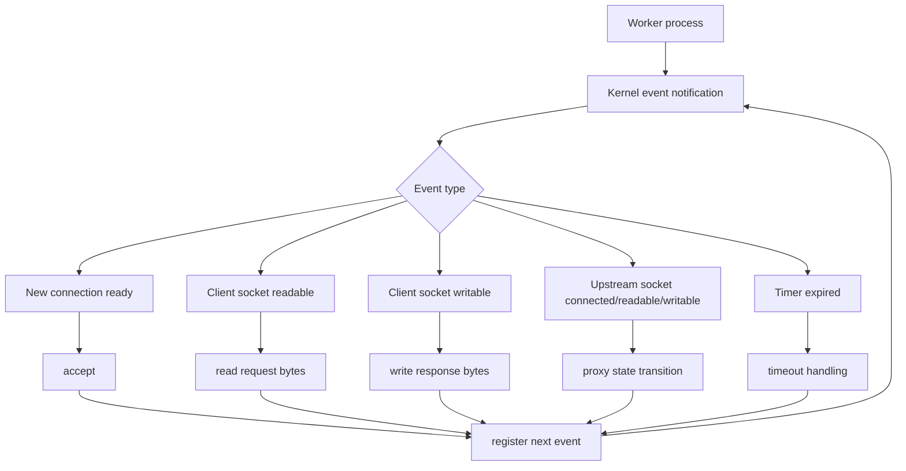
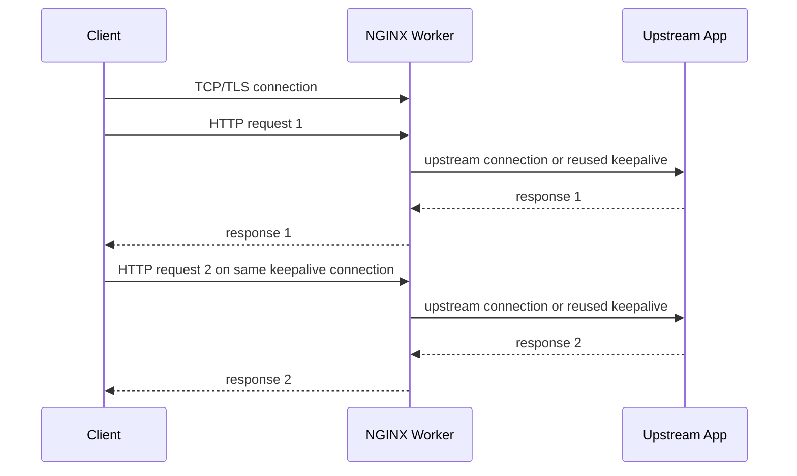
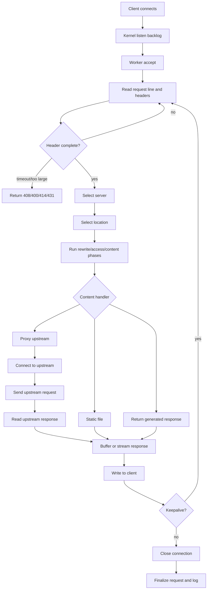
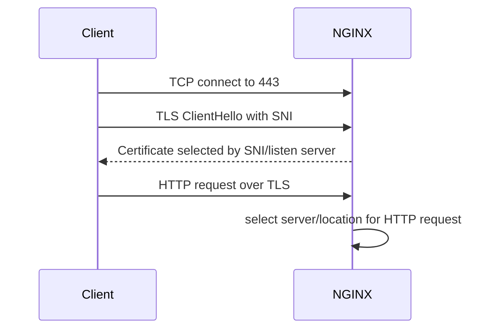
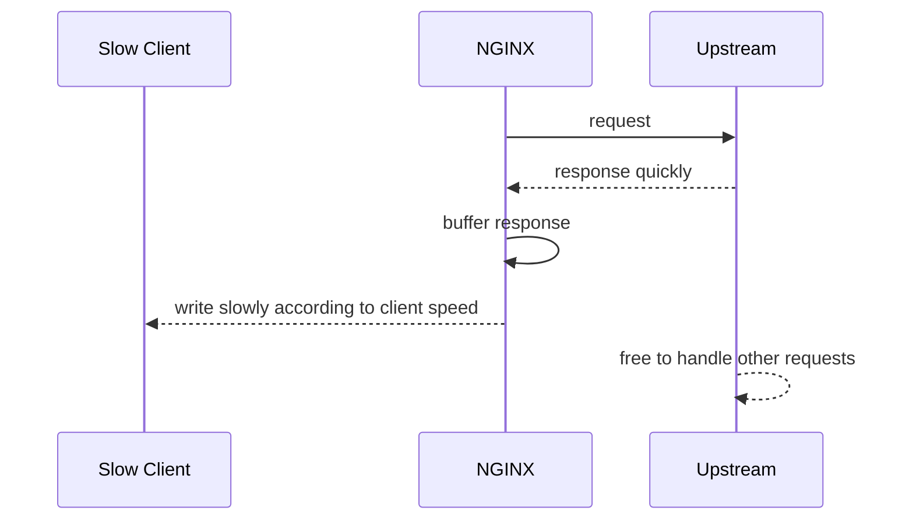
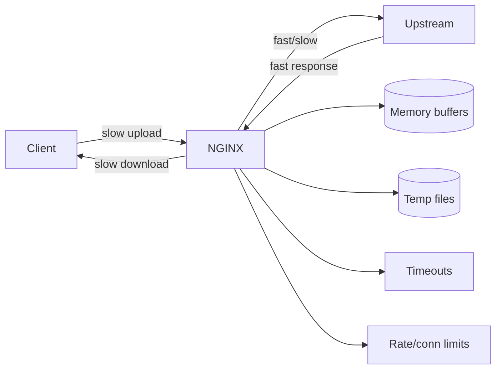

# Part 004 — Event Loop dan Connection Lifecycle: Dari Socket sampai Response

Part sebelumnya menjelaskan master/worker runtime. Sekarang kita masuk ke unit kerja paling penting: **connection lifecycle**.

NGINX tidak memproses traffic dengan model “satu request = satu thread”. NGINX memakai event-driven model. Worker menunggu event dari kernel, lalu melakukan pekerjaan kecil yang non-blocking: accept koneksi, read sebagian data, parse header, connect ke upstream, write response, menunggu socket siap lagi, dan seterusnya.

Mental model ini penting karena banyak konfigurasi NGINX sebenarnya adalah cara mengatur state machine koneksi:

- kapan koneksi diterima;
- berapa lama header boleh belum lengkap;
- berapa besar body boleh diterima;
- kapan upstream dianggap lambat;
- kapan response harus dibuffer;
- kapan client dianggap terlalu lambat;
- kapan koneksi keepalive ditutup;
- kapan request ditulis ke access log.

Referensi resmi:

- `https://nginx.org/en/docs/beginners_guide.html`
- `https://nginx.org/en/docs/http/ngx_http_core_module.html`
- `https://nginx.org/en/docs/http/ngx_http_proxy_module.html`
- `https://nginx.org/en/docs/ngx_core_module.html`
- `https://nginx.org/en/docs/dev/development_guide.html`

---

## 1. Mental model: worker sebagai event loop

Worker NGINX dapat digambarkan sebagai loop seperti ini:

```txt
while running:
    events = wait_for_kernel_events()
    for event in events:
        process_small_non_blocking_step(event)
        update_connection_state()
        register_next_interest()
```

Yang membuat NGINX efisien bukan karena ia “lebih cepat secara ajaib”, tetapi karena ia menghindari model blocking-per-connection.



Setiap koneksi adalah state object. Setiap request adalah state object di atas koneksi. Setiap upstream call juga punya state sendiri.

---

## 2. Connection, request, dan upstream connection adalah hal berbeda

Ini fondasi yang sering terlewat.

### 2.1 Client connection

Client connection adalah TCP/TLS connection dari client ke NGINX.

Satu client connection bisa membawa:

- satu HTTP/1.0 request;
- banyak HTTP/1.1 request via keepalive;
- banyak HTTP/2 stream multiplexed;
- satu WebSocket yang hidup lama;
- satu upload besar;
- satu slow client yang membuat worker menyimpan state lama.

### 2.2 Request

Request adalah unit HTTP semantics.

Request memiliki:

- method;
- URI;
- headers;
- body;
- selected virtual server;
- selected location;
- variables;
- phase execution;
- response status;
- upstream metadata;
- log record.

Satu connection bisa memiliki banyak request secara berurutan pada HTTP/1.1 keepalive.

### 2.3 Upstream connection

Upstream connection adalah koneksi dari NGINX ke backend.

Untuk reverse proxy, satu request biasanya membutuhkan satu upstream exchange. Namun upstream connection bisa reuse via upstream keepalive.



Kesalahan umum:

> “Ada 10.000 client connection berarti ada 10.000 request aktif.”

Tidak selalu.

Bisa saja:

- 10.000 idle keepalive connection;
- 100 active request;
- 9.900 waiting connection;
- atau 10.000 WebSocket aktif.

Implikasinya sangat berbeda.

---

## 3. Lifecycle request HTTP sederhana

Untuk request HTTP reverse proxy sederhana, flow-nya seperti ini:



Catatan penting: access log biasanya ditulis saat request selesai, bukan saat request masuk. Maka request yang stuck lama belum muncul di access log final.

Untuk investigasi request menggantung, error log, debug log, active metrics, dan tcp-level observation sering lebih berguna daripada hanya access log.

---

## 4. Accept stage: sebelum NGINX membaca HTTP

Sebelum NGINX tahu URI, header, atau server name, koneksi melewati beberapa lapisan:

1. packet datang ke NIC;
2. kernel network stack memproses;
3. socket listen menerima koneksi;
4. koneksi masuk backlog;
5. worker menerima event;
6. worker memanggil accept;
7. NGINX membuat connection object.

NGINX config yang relevan:

```nginx
server {
    listen 443 ssl backlog=65535;
    server_name example.com;
}
```

Namun `backlog` di NGINX hanya satu sisi. OS punya limit sendiri seperti `net.core.somaxconn`.

Prinsip:

```txt
actual_accept_capacity = min(NGINX listen backlog, kernel somaxconn, runtime scheduling, worker accept rate)
```

Jika accept lambat atau backlog penuh, client bisa mengalami:

- connection timeout;
- TCP reset;
- SYN retransmission;
- latency sebelum request bahkan sampai ke NGINX.

### 4.1 `multi_accept`

Directive:

```nginx
events {
    multi_accept off;
}
```

Jika `multi_accept on`, worker dapat menerima sebanyak mungkin koneksi baru setelah mendapat notifikasi.

Trade-off:

- bisa membantu saat burst koneksi;
- bisa membuat satu worker mengambil terlalu banyak koneksi;
- bisa mempengaruhi fairness antar worker;
- tidak selalu cocok untuk semua workload.

Baseline aman: `off`, kecuali benchmark production-like membuktikan manfaat.

---

## 5. Read header stage

Setelah accept, NGINX membaca request line dan header.

Directive relevan:

```nginx
http {
    client_header_timeout 10s;
    client_header_buffer_size 1k;
    large_client_header_buffers 4 8k;
}
```

### 5.1 `client_header_timeout`

Membatasi berapa lama NGINX menunggu client mengirim header lengkap.

Jika terlalu panjang:

- slowloris-style client bisa menahan connection slot;
- worker memory/state tertahan;
- file descriptor habis.

Jika terlalu pendek:

- client mobile/lambat bisa gagal;
- koneksi dari jaringan buruk bisa sering 408.

### 5.2 Header buffer

Header besar butuh buffer lebih besar.

Penyebab header besar:

- cookie terlalu banyak;
- JWT besar di header;
- tracing baggage membengkak;
- proxy chain menambah forwarded headers;
- user-agent panjang;
- custom metadata abuse.

Jangan langsung menaikkan buffer besar untuk semua traffic tanpa memahami penyebab.

Header besar adalah smell arsitektur.

---

## 6. Server selection dan TLS/SNI timing

Pada HTTPS, ada tahap TLS handshake sebelum HTTP request dibaca.

SNI dari client membantu NGINX memilih certificate berdasarkan hostname.

Flow ringkas:



Implikasi:

- certificate selection terjadi sebelum URI diketahui;
- `location` tidak bisa mempengaruhi certificate;
- server block default untuk `listen 443 ssl` penting;
- Host header dan SNI bisa berbeda;
- mTLS client certificate verification terjadi pada TLS layer, bukan setelah route biasa.

Kita akan bahas detail di Phase TLS.

---

## 7. Request body stage

Tidak semua request punya body.

Untuk request body seperti POST/PUT/upload, NGINX harus membaca body dari client sebelum atau sambil meneruskan ke upstream, tergantung buffering config.

Directive relevan:

```nginx
http {
    client_max_body_size 10m;
    client_body_timeout 30s;
    client_body_buffer_size 128k;
    client_body_temp_path /var/cache/nginx/client_temp;
}
```

### 7.1 `client_max_body_size`

Membatasi ukuran body.

Jika body melebihi batas, NGINX dapat mengembalikan `413 Request Entity Too Large`.

Baseline harus ditentukan per endpoint, bukan global membabi buta.

Contoh:

```nginx
server {
    listen 443 ssl;

    location /api/ {
        client_max_body_size 2m;
        proxy_pass http://api_backend;
    }

    location /uploads/ {
        client_max_body_size 200m;
        proxy_pass http://upload_backend;
    }
}
```

Ini lebih aman daripada:

```nginx
http {
    client_max_body_size 200m;
}
```

Karena global 200 MB memberi semua endpoint attack surface upload besar.

### 7.2 Request body buffering

Directive proxy:

```nginx
location /upload/ {
    proxy_request_buffering on;
    proxy_pass http://upload_backend;
}
```

Jika buffering aktif, NGINX bisa membaca body client terlebih dahulu ke memory/temp file sebelum mengirim ke upstream.

Kelebihan:

- upstream tidak perlu menahan koneksi dari slow client;
- upstream menerima body lebih stabil;
- bisa melindungi app server dari slow upload.

Kekurangan:

- disk temp file bisa penuh;
- latency upload-to-upstream bertambah;
- NGINX menjadi pressure point;
- large upload butuh capacity planning storage.

Jika buffering dimatikan:

```nginx
location /upload-stream/ {
    proxy_request_buffering off;
    proxy_pass http://upload_backend;
}
```

Kelebihan:

- streaming langsung;
- lebih cocok untuk beberapa workload upload besar;
- latency awal ke upstream lebih rendah.

Kekurangan:

- upstream terpapar slow client;
- retry semantics lebih sulit;
- connection upstream tertahan selama client upload;
- overload bisa berpindah ke backend.

---

## 8. Upstream stage

Untuk reverse proxy, NGINX menjadi client bagi upstream.

Flow:

1. pilih upstream peer;
2. dapatkan alamat IP/port;
3. connect;
4. kirim request line/header/body;
5. tunggu response header;
6. baca response body;
7. buffer atau stream ke client;
8. finalisasi request.

Directive penting:

```nginx
location /api/ {
    proxy_pass http://api_backend;

    proxy_connect_timeout 2s;
    proxy_send_timeout 30s;
    proxy_read_timeout 30s;

    proxy_http_version 1.1;
    proxy_set_header Host $host;
    proxy_set_header X-Request-ID $request_id;
    proxy_set_header X-Forwarded-For $proxy_add_x_forwarded_for;
    proxy_set_header X-Forwarded-Proto $scheme;
}
```

### 8.1 Connect timeout

`proxy_connect_timeout` membatasi waktu membuat koneksi ke upstream.

Jika terlalu panjang:

- request menunggu backend mati terlalu lama;
- worker connection slots tertahan;
- latency p95/p99 rusak.

Jika terlalu pendek:

- backend sehat tapi sedang GC/cold/network jitter bisa dianggap gagal.

### 8.2 Send timeout

`proxy_send_timeout` adalah timeout antar operasi write ke upstream, bukan total durasi request.

Ini relevan saat NGINX mengirim request body besar ke backend.

### 8.3 Read timeout

`proxy_read_timeout` adalah timeout antar operasi read dari upstream.

Ini sering disalahartikan sebagai “maksimal durasi request”. Untuk streaming/SSE, selama upstream terus mengirim data sebelum timeout, koneksi tetap hidup.

---

## 9. Response buffering dan slow client protection

Directive:

```nginx
location /api/ {
    proxy_buffering on;
    proxy_buffers 16 16k;
    proxy_buffer_size 16k;
    proxy_busy_buffers_size 64k;
    proxy_max_temp_file_size 1024m;
    proxy_pass http://api_backend;
}
```

Dengan buffering aktif, NGINX dapat membaca response dari upstream lebih cepat, menyimpannya di buffer/temp file, lalu mengirim ke client sesuai kecepatan client.

### 9.1 Kenapa buffering penting?

Misal:

- upstream menghasilkan response 5 MB dalam 100 ms;
- client mobile membaca response selama 30 detik.

Tanpa buffering, upstream connection bisa tertahan 30 detik.

Dengan buffering, upstream selesai cepat dan bisa melayani request lain. NGINX menanggung slow client.



### 9.2 Trade-off buffering

Buffering bukan selalu benar.

Aktifkan buffering untuk:

- API response umum;
- HTML/static proxied content;
- upstream yang harus dilindungi dari slow clients;
- cacheable response.

Matikan buffering untuk:

- WebSocket;
- SSE;
- long polling tertentu;
- streaming response;
- real-time chunked response.

Contoh SSE:

```nginx
location /events/ {
    proxy_pass http://event_backend;
    proxy_http_version 1.1;
    proxy_buffering off;
    proxy_read_timeout 1h;
}
```

---

## 10. Write-to-client stage dan `send_timeout`

Directive:

```nginx
http {
    send_timeout 30s;
}
```

`send_timeout` bukan total waktu mengirim response. Ia membatasi timeout antar operasi write ke client.

Jika client berhenti membaca cukup lama, NGINX dapat menutup koneksi.

Ini melindungi worker dari slow reader.

Namun terlalu agresif dapat memutus client jaringan buruk saat download besar.

---

## 11. Keepalive lifecycle

HTTP/1.1 keepalive memungkinkan satu TCP connection dipakai untuk banyak request.

Directive:

```nginx
http {
    keepalive_timeout 30s;
    keepalive_requests 1000;
}
```

### 11.1 Kelebihan keepalive

- mengurangi TCP handshake;
- mengurangi TLS handshake;
- mengurangi latency;
- meningkatkan throughput;
- mengurangi CPU crypto.

### 11.2 Biaya keepalive

- idle connection tetap memakai file descriptor;
- worker connection slot tertahan;
- memory connection state tetap ada;
- reload drain bisa lebih lama;
- load balancer depan bisa tidak seimbang jika connection reuse terlalu sticky.

### 11.3 Keepalive tidak boleh disetel berdasarkan feeling

Pertanyaan sizing:

```txt
idle_keepalive_connections = RPS * average_idle_reuse_window * client_reuse_factor
```

Jika traffic publik tinggi dan banyak client membuka idle connection, `keepalive_timeout 75s` bisa mahal.

Untuk API internal, keepalive lebih panjang bisa masuk akal.

Untuk edge publik, baseline konservatif sering lebih aman:

```nginx
keepalive_timeout 15s;
keepalive_requests 1000;
```

Atau:

```nginx
keepalive_timeout 30s;
keepalive_requests 1000;
```

Validasi dengan metrics active/waiting connections.

---

## 12. HTTP/2 multiplexing mengubah hitungan

HTTP/2 memungkinkan banyak stream dalam satu TCP connection.

Artinya:

- connection count bisa rendah;
- request concurrency tetap tinggi;
- head-of-line blocking pindah karakteristik;
- memory per connection bisa lebih besar;
- flow control menjadi relevan;
- satu koneksi bermasalah bisa membawa banyak stream.

Jangan mengukur kapasitas hanya dari connection count saat HTTP/2 aktif.

Metrics yang lebih berguna:

- request rate;
- active requests;
- response latency;
- upstream concurrency;
- error rate;
- worker CPU;
- memory;
- TLS handshakes;
- stream reset/error.

---

## 13. WebSocket lifecycle

WebSocket mengubah koneksi HTTP menjadi long-lived bidirectional stream.

Config dasar:

```nginx
map $http_upgrade $connection_upgrade {
    default upgrade;
    '' close;
}

server {
    listen 443 ssl;

    location /ws/ {
        proxy_pass http://ws_backend;
        proxy_http_version 1.1;
        proxy_set_header Upgrade $http_upgrade;
        proxy_set_header Connection $connection_upgrade;
        proxy_read_timeout 1h;
        proxy_send_timeout 1h;
        proxy_buffering off;
    }
}
```

Production implication:

- setiap WebSocket menahan client connection;
- biasanya juga menahan upstream connection;
- reload worker lama bisa bertahan lama;
- capacity dihitung sebagai concurrent sessions, bukan RPS saja;
- rate limit request biasa tidak cukup untuk WebSocket abuse;
- idle timeout harus diselaraskan dengan app heartbeat.

---

## 14. Backpressure: konsep yang harus dipahami

Backpressure terjadi ketika satu bagian pipeline lebih lambat dari bagian lain.

Contoh:

1. client upload lambat;
2. upstream membaca lambat;
3. upstream response cepat tapi client download lambat;
4. disk temp file lambat;
5. log write lambat;
6. kernel send buffer penuh;
7. upstream pool penuh.

NGINX berada di tengah dan harus memilih:

- buffer;
- stream;
- timeout;
- reject;
- retry;
- close;
- shed load.



Top engineer tidak bertanya “directive apa untuk proxy?”. Ia bertanya:

> Di mana backpressure akan ditahan, berapa lama, dengan resource apa, dan siapa yang gagal lebih dulu?

---

## 15. Memory model kasar per connection

NGINX efisien, tetapi bukan zero-memory.

Memory digunakan untuk:

- connection object;
- request object;
- header buffer;
- body buffer;
- proxy buffers;
- SSL state;
- HTTP/2 state;
- variables;
- module context;
- logging context;
- shared memory zone.

Rumus kasar:

```txt
worker_memory
≈ base_worker_memory
 + active_connections * per_connection_memory
 + active_requests * per_request_memory
 + buffered_responses * buffer_size
 + shared_zones_per_worker_mapping
```

Contoh bahaya:

```nginx
proxy_buffers 64 256k;
```

Secara teori satu request bisa memakai banyak buffer. Jika 5.000 request aktif terkena buffer besar, memory pressure bisa brutal.

Jangan copy buffer config dari internet tanpa menghitung.

### 15.1 Buffer tuning discipline

Mulai dari default/baseline.

Ubah jika ada bukti:

- response header terlalu besar;
- temp file terlalu sering;
- upstream blocked by slow client;
- memory masih cukup;
- latency membaik di test realistis.

Observasi:

- RSS worker;
- temp file directory usage;
- disk IO;
- upstream response time;
- client response time;
- 499/502/504/5xx.

---

## 16. Timeout taxonomy

Timeout NGINX harus dilihat sebagai protection boundary.

| Stage | Directive contoh | Apa yang dilindungi |
|---|---|---|
| Client header read | `client_header_timeout` | Slowloris/header drip |
| Client body read | `client_body_timeout` | Slow upload |
| Client response write | `send_timeout` | Slow reader |
| Client keepalive idle | `keepalive_timeout` | Idle FD retention |
| Upstream connect | `proxy_connect_timeout` | Dead/unreachable backend |
| Upstream request send | `proxy_send_timeout` | Backend tidak membaca |
| Upstream response read | `proxy_read_timeout` | Backend diam terlalu lama |
| Worker drain | `worker_shutdown_timeout` | Old worker saat reload |

Baseline API umum:

```nginx
http {
    client_header_timeout 10s;
    client_body_timeout 30s;
    send_timeout 30s;
    keepalive_timeout 30s;

    server {
        location /api/ {
            proxy_connect_timeout 2s;
            proxy_send_timeout 30s;
            proxy_read_timeout 30s;
            proxy_pass http://api_backend;
        }
    }
}
```

Jangan pakai timeout sama untuk semua endpoint.

Contoh endpoint berbeda:

```nginx
location /api/fast/ {
    proxy_connect_timeout 1s;
    proxy_read_timeout 5s;
    proxy_pass http://fast_api;
}

location /api/report/ {
    proxy_connect_timeout 2s;
    proxy_read_timeout 120s;
    proxy_pass http://report_backend;
}

location /events/ {
    proxy_read_timeout 1h;
    proxy_buffering off;
    proxy_pass http://event_backend;
}
```

---

## 17. Status code sebagai lifecycle evidence

Beberapa status sering terkait lifecycle stage tertentu.

| Status | Kemungkinan stage | Makna investigasi awal |
|---|---|---|
| 400 | Header parse | Request invalid, header terlalu aneh, Host buruk |
| 408 | Client header/body timeout | Client lambat/tidak selesai kirim request |
| 413 | Body size check | Body melebihi `client_max_body_size` |
| 414 | URI terlalu panjang | Request line/URI terlalu besar |
| 431 | Header terlalu besar | Header/cookie/JWT terlalu besar |
| 499 | Client closed request | Client/load balancer putus sebelum response selesai |
| 500 | Internal config/module issue | Error internal NGINX/app mapping tertentu |
| 502 | Bad gateway | Upstream connect/read/protocol gagal |
| 503 | Unavailable/limit | Upstream unavailable atau limiting tertentu |
| 504 | Gateway timeout | Upstream tidak merespons tepat waktu |

`499` adalah NGINX-specific non-standard status yang sangat penting untuk RCA. Ia menunjukkan client menutup koneksi sebelum NGINX selesai mengirim response.

Penyebab `499` bisa:

- user membatalkan request;
- browser timeout;
- load balancer depan timeout lebih pendek dari NGINX;
- mobile network putus;
- backend terlalu lambat sehingga client menyerah;
- deploy/reload layer depan.

Jangan langsung menyalahkan client. `499` sering gejala timeout contract antar layer yang tidak konsisten.

---

## 18. Access log timing dan observability

Access log ditulis saat request finalized.

Log format production minimal:

```nginx
log_format main_json escape=json
    '{'
    '"time":"$time_iso8601",'
    '"request_id":"$request_id",'
    '"remote_addr":"$remote_addr",'
    '"host":"$host",'
    '"method":"$request_method",'
    '"uri":"$request_uri",'
    '"status":$status,'
    '"bytes":$body_bytes_sent,'
    '"request_time":$request_time,'
    '"upstream_addr":"$upstream_addr",'
    '"upstream_status":"$upstream_status",'
    '"upstream_connect_time":"$upstream_connect_time",'
    '"upstream_header_time":"$upstream_header_time",'
    '"upstream_response_time":"$upstream_response_time",'
    '"http_user_agent":"$http_user_agent"'
    '}';
```

Interpretasi:

- `$request_time`: total waktu dari request diterima sampai selesai;
- `$upstream_connect_time`: waktu connect ke upstream;
- `$upstream_header_time`: waktu sampai header response upstream diterima;
- `$upstream_response_time`: waktu upstream response;
- `$upstream_status`: status dari upstream, bisa multiple saat retry;
- `$upstream_addr`: backend yang dipakai, bisa multiple saat retry.

Jika `$request_time` tinggi tetapi `$upstream_response_time` rendah, kemungkinan bottleneck ada di client write, buffering, atau edge layer.

Jika `$upstream_connect_time` tinggi, kemungkinan backend/network/connect saturation.

Jika `$upstream_header_time` tinggi, backend lambat menghasilkan response awal.

---

## 19. Failure modelling berdasarkan lifecycle

### 19.1 Client lambat mengirim header

Gejala:

- active connections naik;
- request tidak muncul di access log sampai timeout;
- 408 meningkat;
- worker connection slots habis.

Control:

```nginx
client_header_timeout 10s;
large_client_header_buffers 4 8k;
```

Tambahan:

- rate limit per IP;
- connection limit;
- WAF/LB layer depan;
- SYN flood protection di OS/LB.

### 19.2 Header/cookie terlalu besar

Gejala:

- 400/431;
- error log tentang header too large;
- terjadi pada user tertentu setelah login;
- cookie domain terlalu luas.

Control:

```nginx
large_client_header_buffers 4 16k;
```

Namun root cause bisa di aplikasi:

- JWT terlalu besar;
- cookie tidak dibersihkan;
- banyak microfrontend menulis cookie di domain yang sama.

### 19.3 Upstream lambat

Gejala:

- 504;
- `$upstream_response_time` tinggi;
- `$upstream_header_time` tinggi;
- active upstream connection naik;
- retry memperburuk load.

Control:

```nginx
proxy_connect_timeout 2s;
proxy_read_timeout 30s;
proxy_next_upstream error timeout http_502 http_503 http_504;
```

Namun retry harus memperhatikan idempotency. Jangan retry POST mutating secara sembarangan.

### 19.4 Slow client download

Gejala:

- `$request_time` tinggi;
- `$upstream_response_time` rendah;
- network egress lambat;
- 499 meningkat;
- send timeout.

Control:

```nginx
proxy_buffering on;
send_timeout 30s;
```

Jika banyak response besar, pertimbangkan:

- object storage/CDN;
- range support;
- separate download domain;
- bandwidth limiting;
- cache layer.

### 19.5 Temp file disk penuh

Gejala:

- error log write temp file failed;
- 500/502 naik;
- disk usage `/var/cache/nginx` penuh;
- latency naik drastis.

Control:

```nginx
proxy_temp_path /var/cache/nginx/proxy_temp 1 2;
proxy_max_temp_file_size 512m;
```

Mitigasi:

- pisahkan disk temp/cache/log;
- monitor inode dan bytes;
- batasi upload/response size;
- tune buffering;
- capacity plan.

---

## 20. Production config skeleton berbasis lifecycle

```nginx
worker_processes auto;
worker_rlimit_nofile 1048576;
worker_shutdown_timeout 30s;

error_log /var/log/nginx/error.log warn;

events {
    worker_connections 8192;
    multi_accept off;
}

http {
    include /etc/nginx/mime.types;
    default_type application/octet-stream;

    client_header_timeout 10s;
    client_body_timeout 30s;
    client_max_body_size 10m;
    client_body_buffer_size 128k;

    send_timeout 30s;
    keepalive_timeout 30s;
    keepalive_requests 1000;

    proxy_buffering on;
    proxy_buffer_size 16k;
    proxy_buffers 16 16k;
    proxy_busy_buffers_size 64k;
    proxy_temp_path /var/cache/nginx/proxy_temp 1 2;

    log_format main_json escape=json
        '{'
        '"time":"$time_iso8601",'
        '"request_id":"$request_id",'
        '"remote_addr":"$remote_addr",'
        '"host":"$host",'
        '"method":"$request_method",'
        '"uri":"$request_uri",'
        '"status":$status,'
        '"request_time":$request_time,'
        '"upstream_addr":"$upstream_addr",'
        '"upstream_status":"$upstream_status",'
        '"upstream_connect_time":"$upstream_connect_time",'
        '"upstream_header_time":"$upstream_header_time",'
        '"upstream_response_time":"$upstream_response_time"'
        '}';

    access_log /var/log/nginx/access.log main_json;

    upstream api_backend {
        server 127.0.0.1:9000;
        keepalive 64;
    }

    server {
        listen 8080;
        server_name api.local;

        location = /healthz {
            access_log off;
            return 200 "ok\n";
        }

        location /api/ {
            proxy_http_version 1.1;
            proxy_set_header Connection "";
            proxy_set_header Host $host;
            proxy_set_header X-Request-ID $request_id;
            proxy_set_header X-Forwarded-For $proxy_add_x_forwarded_for;
            proxy_set_header X-Forwarded-Proto $scheme;

            proxy_connect_timeout 2s;
            proxy_send_timeout 30s;
            proxy_read_timeout 30s;

            proxy_pass http://api_backend;
        }
    }
}
```

Catatan:

- `proxy_set_header Connection "";` sering dipakai bersama upstream keepalive agar hop-by-hop header tidak merusak reuse.
- Buffer values perlu divalidasi dengan workload nyata.
- Timeout harus disesuaikan per endpoint.
- `client_max_body_size` sebaiknya lebih spesifik per route untuk upload besar.

---

## 21. Debugging checklist by lifecycle

Saat incident, jangan mulai dari config random. Mulai dari stage.

### 21.1 Apakah koneksi sampai ke NGINX?

```bash
ss -lntp | grep nginx
curl -v http://127.0.0.1:8080/healthz
```

Jika local OK tapi external gagal:

- LB/security group/firewall;
- DNS;
- route;
- container port mapping;
- Kubernetes Service/Ingress.

### 21.2 Apakah request diparse?

Cek error log:

```bash
tail -f /var/log/nginx/error.log
```

Cari:

- client sent too long URI;
- client sent too large header;
- client timed out while reading client request headers;
- invalid host.

### 21.3 Apakah route benar?

Dump config:

```bash
nginx -T | less
```

Cek:

- `server_name`;
- default server;
- `location` matching;
- `proxy_pass` slash semantics;
- `return`/`rewrite` order;
- included snippets.

### 21.4 Apakah upstream bisa dicapai?

Dari host NGINX:

```bash
curl -v http://127.0.0.1:9000/healthz
nc -vz 127.0.0.1 9000
```

Cek log fields:

- `$upstream_addr` kosong berarti request mungkin tidak sampai proxy handler;
- `$upstream_status` kosong berarti upstream tidak dipakai atau gagal sebelum status;
- connect time tinggi berarti network/connect problem;
- response time tinggi berarti backend processing/streaming.

### 21.5 Apakah client terlalu lambat?

Bandingkan:

```txt
request_time vs upstream_response_time
```

Jika request time jauh lebih besar, client send/write/buffering bisa jadi masalah.

---

## 22. Latihan praktis

### Lab 1 — Observe keepalive

Jalankan:

```bash
curl -v http://127.0.0.1:8080/healthz
```

Perhatikan header connection dan reuse.

Gunakan:

```bash
ss -tanp | grep 8080
```

Amati state koneksi.

### Lab 2 — Simulasi slow upstream

Buat backend yang delay 10 detik, lalu set:

```nginx
proxy_read_timeout 3s;
```

Lihat status `504`.

Kemudian naikkan menjadi:

```nginx
proxy_read_timeout 15s;
```

Lihat request berhasil.

Pertanyaan:

- apakah menaikkan timeout selalu benar?
- apa dampaknya ke connection slots?
- apa dampaknya ke client timeout layer depan?

### Lab 3 — Simulasi body terlalu besar

Set:

```nginx
client_max_body_size 1m;
```

Kirim body 2 MB:

```bash
dd if=/dev/zero bs=1M count=2 | curl -X POST --data-binary @- http://127.0.0.1:8080/api/upload
```

Amati `413`.

### Lab 4 — Simulasi slow client download

Gunakan tool yang membatasi download rate atau network shaping. Amati perbedaan:

- `proxy_buffering on`;
- `proxy_buffering off`;
- `$request_time`;
- `$upstream_response_time`.

---

## 23. Kesimpulan

Event loop dan connection lifecycle adalah fondasi untuk memahami semua directive penting NGINX.

Inti part ini:

- worker memproses banyak koneksi melalui event-driven non-blocking loop;
- connection, request, dan upstream connection adalah entity berbeda;
- keepalive membuat satu koneksi membawa banyak request;
- HTTP/2 membuat connection count tidak sama dengan request concurrency;
- WebSocket/SSE membuat koneksi long-lived dan memengaruhi reload/capacity;
- buffering adalah mekanisme backpressure, bukan sekadar performance toggle;
- timeout adalah boundary protection per stage;
- access log adalah evidence setelah request selesai, bukan real-time truth;
- RCA production harus mengikuti lifecycle stage.

Part berikutnya akan membahas **bahasa konfigurasi NGINX dari first principles**: directive, block, context, include, inheritance, dan kenapa config NGINX sering terlihat sederhana tetapi memiliki semantic trap yang dalam.
