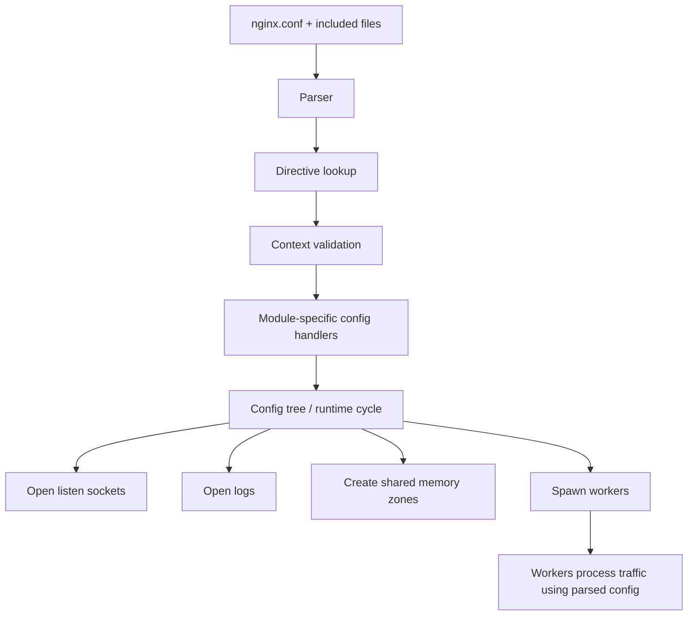
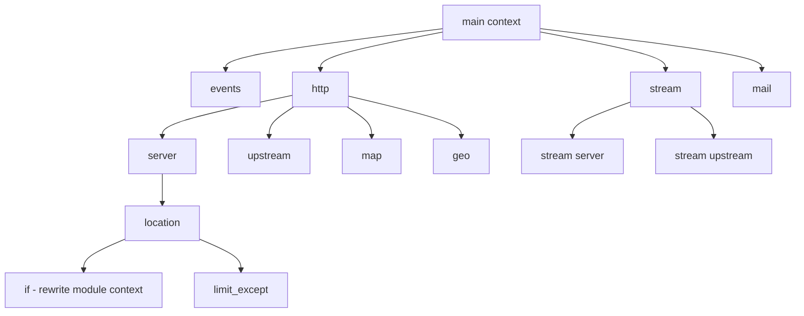
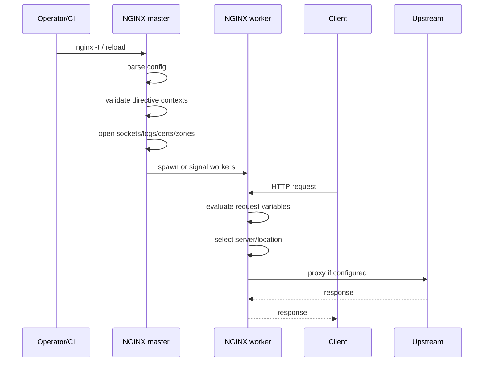
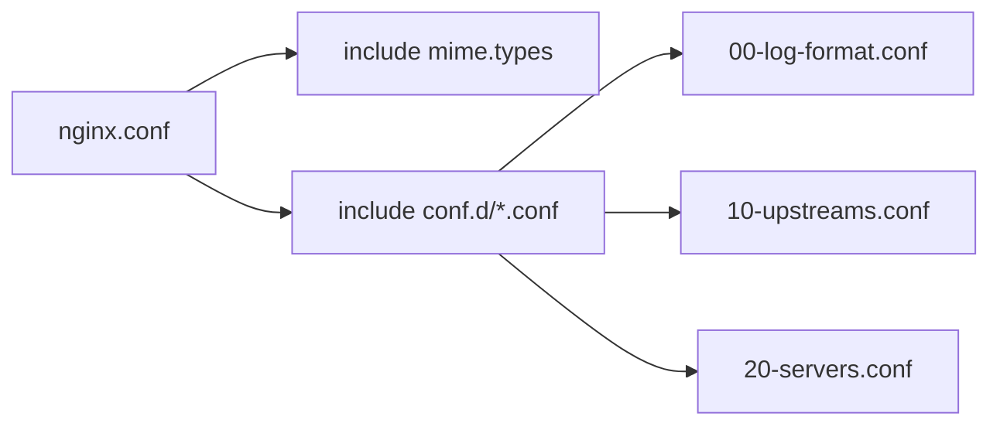

# Part 005 — Bahasa Konfigurasi NGINX dari First Principles

Banyak engineer bisa menulis konfigurasi NGINX yang "jalan". Sedikit yang bisa menjelaskan **kenapa** konfigurasi itu jalan, kapan ia dievaluasi, bagian mana yang diwariskan, bagian mana yang mengganti parent, dan bagian mana yang sebenarnya dimiliki oleh modul berbeda.

Itu masalah serius.

NGINX bukan framework yang mengeksekusi file konfigurasi baris demi baris seperti script. NGINX membaca konfigurasi, memvalidasi syntax/context/directive, membangun struktur konfigurasi internal, membuka resource runtime, lalu worker menggunakan hasilnya untuk memproses koneksi.

Part ini membangun mental model bahasa konfigurasi NGINX dari bawah.

Referensi resmi:

- `https://nginx.org/en/docs/beginners_guide.html`
- `https://docs.nginx.com/nginx/admin-guide/basic-functionality/managing-configuration-files/`
- `https://nginx.org/en/docs/ngx_core_module.html`
- `https://nginx.org/en/docs/http/ngx_http_core_module.html`
- `https://nginx.org/en/docs/dirindex.html`

---

## 1. Mental model utama

File `nginx.conf` bukan sekadar file teks.

Lebih tepatnya:

> `nginx.conf` adalah input untuk compiler konfigurasi NGINX yang membangun runtime traffic engine.



Konsekuensinya:

1. directive tidak "dijalankan" seperti statement imperative;
2. banyak error muncul saat parse/reload, bukan saat request;
3. beberapa nilai diputuskan saat startup/reload;
4. beberapa nilai baru dihitung saat request;
5. konteks menentukan apakah directive valid;
6. module menentukan makna directive;
7. reload aman hanya terjadi jika konfigurasi baru lolos validasi dan resource baru bisa dibuka.

Kalau mental model Anda masih "NGINX membaca dari atas ke bawah lalu menjalankan perintah", Anda akan mudah salah saat menghadapi `location`, `rewrite`, `include`, `map`, `proxy_pass`, `add_header`, `try_files`, dan `if`.

---

## 2. Bentuk paling dasar: directive

Unit terkecil konfigurasi NGINX adalah **directive**.

Ada dua bentuk besar:

```nginx
# simple directive
worker_processes auto;

# block directive
http {
    server {
        listen 80;
    }
}
```

Simple directive:

```nginx
name argument1 argument2 ...;
```

Block directive:

```nginx
name argument1 argument2 ... {
    nested_directives;
}
```

Aturan praktis:

- simple directive berakhir dengan `;`;
- block directive membuka `{` dan menutup `}`;
- directive berada dalam context tertentu;
- directive hanya valid jika module pemilik directive mengizinkannya di context tersebut;
- komentar dimulai dengan `#` sampai akhir baris;
- whitespace hanya pemisah token, bukan struktur seperti YAML.

Contoh minimal:

```nginx
worker_processes auto;

events {
    worker_connections 1024;
}

http {
    server {
        listen 80;
        server_name example.com;

        location / {
            return 200 "hello\n";
        }
    }
}
```

Ini bukan "program". Ini deklarasi bentuk runtime.

---

## 3. Context: ruang tempat directive boleh hidup

NGINX menggunakan context untuk mengatur scope.

Context umum:



Struktur HTTP paling umum:

```nginx
# main context
worker_processes auto;

events {
    # events context
    worker_connections 4096;
}

http {
    # http context
    include mime.types;

    upstream app_backend {
        # upstream context
        server 10.0.1.10:8080;
        server 10.0.1.11:8080;
    }

    server {
        # server context
        listen 443 ssl http2;
        server_name api.example.com;

        location /api/ {
            # location context
            proxy_pass http://app_backend;
        }
    }
}
```

Context bukan dekorasi. Context adalah bagian dari grammar.

Contoh salah:

```nginx
worker_connections 4096;
```

`worker_connections` bukan directive main context. Ia milik `events` context.

Contoh salah lain:

```nginx
http {
    location / {
        return 200;
    }
}
```

`location` tidak langsung valid di `http`; ia valid di dalam `server`.

---

## 4. Directive dimiliki module

Setiap directive datang dari module tertentu.

| Directive | Module/konteks konseptual | Fungsi |
|---|---|---|
| `worker_processes` | core | jumlah worker process |
| `worker_connections` | event core | batas koneksi per worker |
| `server` | HTTP core / stream core / mail core | mendefinisikan virtual server |
| `location` | HTTP core | memilih konfigurasi berdasarkan URI |
| `proxy_pass` | HTTP proxy module | meneruskan request ke upstream HTTP |
| `grpc_pass` | HTTP gRPC module | meneruskan request gRPC |
| `fastcgi_pass` | FastCGI module | meneruskan request FastCGI |
| `ssl_certificate` | SSL module | certificate TLS |
| `limit_req` | limit request module | rate limiting |
| `map` | map module | membuat variable hasil mapping |

Konsekuensi production:

1. **unknown directive** sering berarti module tidak tersedia, bukan sekadar typo.
2. Config yang valid di satu build NGINX bisa gagal di build lain.
3. Container image berbeda bisa membawa compile options berbeda.
4. Dynamic module perlu dimuat sebelum directive-nya dipakai.
5. Dokumentasi directive harus selalu dibaca bersama context dan module pemiliknya.

Cek build options:

```bash
nginx -V
```

Output `nginx -V` biasanya menunjukkan versi, compiler, configure arguments, module, path default, dan OpenSSL build/runtime info.

Untuk production, simpan output `nginx -V` sebagai artifact debugging. Ketika ada incident, pertanyaan "kenapa directive ini tidak ada?" sering dijawab oleh `nginx -V`, bukan oleh isi `nginx.conf`.

---

## 5. Parse-time vs runtime

Tidak semua hal dievaluasi pada waktu yang sama.

Ada yang diputuskan saat parse/startup/reload:

- syntax directive;
- apakah directive valid di context tersebut;
- apakah file include ditemukan;
- apakah listen socket bisa dibuka;
- apakah certificate file bisa dibaca;
- apakah shared memory zone bisa dibuat;
- apakah upstream block syntactically valid;
- apakah module directive tersedia.

Ada yang diputuskan saat request:

- nilai variable seperti `$host`, `$uri`, `$remote_addr`;
- hasil `map` berdasarkan variable input;
- location final setelah URI normalization/internal redirect;
- upstream response status;
- cache HIT/MISS/BYPASS;
- header yang dikirim upstream;
- request body size aktual;
- rate limit key aktual.



Kesalahan umum:

```nginx
set $backend "http://app_backend";
proxy_pass $backend;
```

Ini terlihat sederhana, tetapi penggunaan variable di `proxy_pass` mengubah beberapa semantics penting, termasuk bagaimana URI diteruskan dan bagaimana DNS/upstream resolution bekerja. Ini akan dibahas detail di part reverse proxy. Yang penting di sini: **variable membuat sebagian keputusan berpindah dari parse-time ke request-time**.

---

## 6. File utama dan include

NGINX biasanya mulai dari satu file utama:

```txt
/etc/nginx/nginx.conf
```

Tetapi lokasi aktual bergantung pada distribusi, package, compile options, dan container image.

Cek dengan:

```bash
nginx -V 2>&1 | tr ' ' '\n' | grep conf-path
```

Atau dump seluruh konfigurasi efektif:

```bash
nginx -T
```

`include` memasukkan file lain ke posisi tempat directive itu ditulis.

```nginx
http {
    include /etc/nginx/mime.types;
    include /etc/nginx/conf.d/*.conf;
}
```



Prinsip production:

- gunakan prefix angka jika urutan penting;
- jangan sembunyikan dependency antar file;
- jangan mencampur global defaults, upstreams, dan virtual servers tanpa struktur;
- jangan membuat include recursive atau terlalu dalam;
- gunakan `nginx -T` di CI agar konfigurasi efektif terlihat utuh;
- jangan bergantung pada asumsi packaging tanpa memverifikasi path.

Layout yang lebih aman:

```txt
/etc/nginx/
├── nginx.conf
├── mime.types
├── modules-enabled/
├── conf.d/
│   ├── 00-global-log-format.conf
│   ├── 05-global-maps.conf
│   ├── 10-upstreams.conf
│   ├── 20-security-defaults.conf
│   └── 90-servers.conf
├── snippets/
│   ├── proxy-common.conf
│   ├── security-headers.conf
│   └── tls-modern.conf
└── sites-enabled/
    ├── api.example.com.conf
    └── static.example.com.conf
```

Tetapi layout bukan agama. Yang penting adalah invariant:

> Orang yang membaca config harus bisa tahu directive mana global, mana default, mana per-host, mana per-location, dan mana snippet reusable.

---

## 7. `nginx -t` dan `nginx -T`

Dua command ini wajib masuk muscle memory.

Validasi syntax dan resource dasar:

```bash
nginx -t
```

Dump konfigurasi efektif:

```bash
nginx -T
```

Contoh pipeline deployment minimal:

```bash
set -euo pipefail

nginx -t
nginx -T > /tmp/nginx.effective.conf
systemctl reload nginx
```

Dalam CI container:

```bash
docker run --rm \
  -v "$PWD/nginx:/etc/nginx:ro" \
  nginx:stable \
  nginx -t
```

Yang dicek `nginx -t`:

- syntax;
- directive dikenal atau tidak;
- directive valid pada context;
- jumlah argument valid;
- sebagian resource path bisa dibuka;
- certificate/key dapat dibaca;
- sebagian conflict listen/server dapat terdeteksi.

Yang tidak bisa dijamin `nginx -t`:

- upstream benar-benar sehat;
- DNS runtime selalu resolve;
- certificate belum kedaluwarsa secara policy bisnis;
- routing tidak salah secara domain logic;
- cache key tidak bocor antar user;
- rate limit tidak terlalu agresif;
- header security sudah sesuai semua response path;
- load balancing sesuai kapasitas nyata.

`nginx -t` adalah pagar syntax, bukan bukti arsitektur benar.

---

## 8. Directive arguments: string, size, time, flag, enum

Directive NGINX menerima argument dalam bentuk token.

```nginx
autoindex off;
client_max_body_size 20m;
proxy_buffer_size 16k;
proxy_connect_timeout 3s;
proxy_read_timeout 60s;
keepalive_timeout 15s;
error_log /var/log/nginx/error.log warn;
listen 443 ssl http2;
root /srv/www/app/current/public;
```

Aturan praktis:

- jangan menganggap semua angka satuannya sama;
- baca dokumentasi directive untuk default unit;
- gunakan unit eksplisit (`s`, `m`, `k`) untuk mengurangi ambiguitas;
- quote string yang mengandung spasi atau karakter rawan;
- hindari variable di directive yang sebenarnya seharusnya static kecuali semantics-nya dipahami.

Contoh aman:

```nginx
add_header Content-Security-Policy "default-src 'self'; frame-ancestors 'none'" always;
```

Tanpa quote, token akan pecah dan directive menjadi invalid atau bermakna lain.

---

## 9. Variable bukan variable seperti bahasa pemrograman umum

NGINX memiliki variable seperti:

```nginx
$host
$uri
$request_uri
$remote_addr
$scheme
$server_name
$upstream_status
$upstream_response_time
```

Tetapi variable NGINX bukan variable mutable biasa. Banyak variable adalah nilai request/runtime yang disediakan module.

Contoh:

```nginx
log_format main '$remote_addr $host "$request" '
                '$status $body_bytes_sent '
                'upstream=$upstream_addr upstream_status=$upstream_status';
```

Variable bisa dipakai untuk logging, routing, cache key, rate limit key, header forwarding, conditional response, dynamic upstream selection, dan rewrite flow.

Tetapi variable membawa risiko:

1. evaluation timing berubah;
2. caching key bisa membesar atau bocor;
3. upstream selection bisa menjadi request-time;
4. DNS behavior bisa berubah;
5. config lebih sulit diverifikasi statically;
6. log terlihat benar tetapi routing salah.

Prinsip:

> Gunakan variable untuk data request. Jangan gunakan variable untuk menyembunyikan desain routing yang seharusnya eksplisit.

Contoh baik:

```nginx
map $http_upgrade $connection_upgrade {
    default upgrade;
    ''      close;
}
```

Contoh rawan:

```nginx
set $target http://$http_x_target;
proxy_pass $target;
```

Ini membuka permukaan SSRF/proxy abuse jika header tidak dikontrol ketat.

---

## 10. `map` sebagai tabel keputusan, bukan if-else acak

`map` biasanya berada di context `http`. Ia membuat variable baru berdasarkan variable input.

```nginx
map $http_upgrade $connection_upgrade {
    default upgrade;
    ''      close;
}

map $host $tenant_name {
    default "unknown";
    api.example.com "api";
    admin.example.com "admin";
}
```

Kemudian digunakan:

```nginx
proxy_set_header Connection $connection_upgrade;
add_header X-Tenant $tenant_name always;
```


Kenapa `map` sering lebih baik daripada `if`?

- decision table terlihat eksplisit;
- bisa ditempatkan di `http` sebagai global policy;
- mudah dites dengan request matrix;
- mengurangi nested imperative flow;
- memisahkan policy derivation dari action.

Tetapi `map` tetap harus diperlakukan sebagai policy table. Jangan biarkan ia menjadi dumping ground semua keputusan tanpa naming yang jelas.

---

## 11. `if` di NGINX: bukan if biasa

`if` di NGINX adalah directive dari rewrite module dan semantics-nya historis. Ia sering disalahgunakan seolah-olah seperti `if` di Java/Go/JavaScript.

Contoh yang relatif aman:

```nginx
if ($request_method = POST) {
    return 405;
}
```

Contoh yang rawan:

```nginx
location / {
    if ($http_x_debug = "1") {
        proxy_pass http://debug_backend;
    }

    proxy_pass http://normal_backend;
}
```

Jangan menjadikan `if` sebagai router umum. Gunakan `server_name` untuk host routing, `location` untuk path routing, `map` untuk derived policy, `return` untuk redirect/deny sederhana, upstream block untuk backend set, atau dedicated gateway/app logic jika keputusan sudah terlalu domain-specific.

Prinsip:

> Di NGINX, routing yang baik biasanya berbentuk declarative selection, bukan nested imperative branch.

Part rewrite dan routing akan membahas ini lebih detail.

---

## 12. Config bukan tempat semua business logic

NGINX powerful, tetapi bukan application framework.

Ia cocok untuk host/path routing, TLS termination, request/response header normalization, buffering, compression, cache, rate limiting, IP allow/deny, basic auth/mTLS, reverse proxy, load balancing, static asset serving, simple redirects, dan edge-level policy.

Ia buruk untuk workflow bisnis kompleks, authorization fine-grained berbasis domain object, conditional logic panjang, user-specific dynamic decision tanpa backend authority, transformation body kompleks, stateful orchestration, audit domain logic, dan compensation logic.

```mermaid
flowchart TD
    A[Decision needed] --> B{Can decision be made from transport metadata?}
    B -- yes --> C{Is rule stable and simple?}
    C -- yes --> D[NGINX config is reasonable]
    C -- no --> E[Move to policy service / app]
    B -- no --> F{Needs domain data?}
    F -- yes --> E
    F -- no --> G[Maybe map/location/header rule]
```



NGINX harus menjadi **traffic policy layer**, bukan tempat menyembunyikan domain model.

---

## 13. Production configuration skeleton

Skeleton awal:

```nginx
user nginx nginx;
worker_processes auto;
pid /run/nginx.pid;

error_log /var/log/nginx/error.log warn;

events {
    worker_connections 4096;
}

http {
    include /etc/nginx/mime.types;
    default_type application/octet-stream;

    log_format main escape=json
        '{'
        '"time":"$time_iso8601",'
        '"remote_addr":"$remote_addr",'
        '"host":"$host",'
        '"request":"$request",'
        '"status":$status,'
        '"body_bytes_sent":$body_bytes_sent,'
        '"request_time":$request_time,'
        '"upstream_addr":"$upstream_addr",'
        '"upstream_status":"$upstream_status",'
        '"upstream_response_time":"$upstream_response_time"'
        '}';

    access_log /var/log/nginx/access.log main;

    sendfile on;
    tcp_nopush on;

    keepalive_timeout 15s;
    client_max_body_size 10m;

    include /etc/nginx/conf.d/*.conf;
}
```

Contoh upstream + server:

```nginx
upstream app_backend {
    server 127.0.0.1:8080;
    keepalive 32;
}

server {
    listen 80;
    server_name api.local.test;

    location /healthz {
        access_log off;
        return 200 "ok\n";
    }

    location / {
        proxy_http_version 1.1;
        proxy_set_header Host $host;
        proxy_set_header X-Real-IP $remote_addr;
        proxy_set_header X-Forwarded-For $proxy_add_x_forwarded_for;
        proxy_set_header X-Forwarded-Proto $scheme;
        proxy_pass http://app_backend;
    }
}
```

Belum sempurna. Belum hardened. Belum TLS. Belum cache. Tetapi sudah memperlihatkan struktur inti: core runtime di main/events, HTTP defaults di `http`, backend pool di `upstream`, virtual host di `server`, dan route behavior di `location`.

---

## 14. Config smell yang harus langsung dicurigai

### 14.1 Semua config ditaruh dalam satu file panjang

Bukan otomatis salah, tetapi sulit di-review.

```txt
nginx.conf 2500 lines
```

Risiko: policy bercampur dengan host config, upstream sulit dilacak, duplicate directive tidak terlihat, rollback partial sulit, dan review PR noise tinggi.

### 14.2 Snippet dipakai tanpa tahu context

```nginx
include snippets/proxy-common.conf;
```

Jika snippet berisi directive `proxy_set_header`, ia valid di `http`, `server`, atau `location` tergantung directive. Tetapi efek inheritance-nya berbeda.

Nama snippet harus menjelaskan target context:

```txt
snippets/http-log-format.conf
snippets/server-security-headers.conf
snippets/location-proxy-common.conf
```

### 14.3 Variable dipakai untuk semua hal

```nginx
set $service "app";
set $backend "http://$service.internal";
proxy_pass $backend;
```

Risiko: DNS/request-time behavior berubah, upstream keepalive behavior bisa tidak sesuai ekspektasi, SSRF jika input datang dari client, dan static validation makin lemah.

### 14.4 Duplicate defaults tersebar

```nginx
proxy_read_timeout 60s;
# ... 400 lines later
proxy_read_timeout 300s;
```

Tidak semua duplicate salah. Tetapi duplicate tanpa alasan adalah tanda tidak ada ownership.

### 14.5 Menggunakan `if` untuk routing utama

```nginx
if ($host = api.example.com) {
    proxy_pass http://api;
}
```

Host routing seharusnya `server_name`, bukan `if`.

---

## 15. Cara membaca konfigurasi NGINX orang lain

Gunakan urutan ini:

1. Cari `nginx -T` jika ada, bukan hanya file partial.
2. Identifikasi main context: user, worker, logs, pid, modules.
3. Identifikasi `events`: worker connections dan event method jika eksplisit.
4. Identifikasi `http`: defaults, logs, maps, MIME, gzip, limits, cache zones.
5. Identifikasi `upstream`: backend pools, keepalive, weights, fail parameters.
6. Identifikasi `server`: listen, TLS, server_name, default_server.
7. Identifikasi `location`: routing, static/proxy/cache/rate-limit.
8. Cari `include`: pahami posisi include, bukan hanya isi file.
9. Cari `if`, `rewrite`, `return`: pahami control flow URI.
10. Cari variable di `proxy_pass`, `root`, `alias`, `add_header`, `proxy_set_header`.
11. Cari directive list yang inheritance-nya sering mengejutkan: `add_header`, `proxy_set_header`, `access_log`, `error_page`.
12. Cari hardcoded domain/IP/secret/path.
13. Cari perbedaan antara expected architecture dan actual config.

Checklist cepat:

```bash
nginx -T | grep -nE 'listen|server_name|location|proxy_pass|root|alias|rewrite|return|if|add_header|proxy_set_header|limit_req|proxy_cache'
```

Ini bukan pengganti review, tetapi mempercepat orientasi.

---

## 16. CI validation untuk konfigurasi

Minimum CI:

```bash
#!/usr/bin/env bash
set -euo pipefail

IMAGE="nginx:stable"
CONFIG_DIR="$PWD/nginx"

docker run --rm \
  -v "$CONFIG_DIR:/etc/nginx:ro" \
  "$IMAGE" \
  nginx -t
```

Lebih baik:

```bash
#!/usr/bin/env bash
set -euo pipefail

IMAGE="registry.example.com/platform/nginx-runtime:1.30"
CONFIG_DIR="$PWD/nginx"
OUT_DIR="$PWD/build/nginx"

mkdir -p "$OUT_DIR"

docker run --rm \
  -v "$CONFIG_DIR:/etc/nginx:ro" \
  "$IMAGE" \
  nginx -T > "$OUT_DIR/effective-nginx.conf"

docker run --rm \
  -v "$CONFIG_DIR:/etc/nginx:ro" \
  "$IMAGE" \
  nginx -t
```

Tambahkan policy checks:

```bash
# no accidental default_server without explicit marker
grep -R "default_server" nginx/ | grep -v "INTENTIONAL_DEFAULT_SERVER" && exit 1

# no direct proxy_pass from client-controlled header
grep -R "proxy_pass.*\$http_" nginx/ && exit 1

# no old TLS versions
grep -R "ssl_protocols.*TLSv1" nginx/ && exit 1
```

Policy grep bukan verifikasi sempurna. Tetapi cukup untuk menangkap kesalahan kelas tertentu sebelum production.

---

## 17. Lab: membangun config kecil yang bisa dites

Struktur:

```txt
lab-nginx-config/
├── nginx.conf
└── conf.d/
    ├── 10-upstream.conf
    └── 20-server.conf
```

`nginx.conf`:

```nginx
worker_processes auto;
error_log /var/log/nginx/error.log notice;

events {
    worker_connections 1024;
}

http {
    include /etc/nginx/mime.types;
    default_type application/octet-stream;

    log_format main '$remote_addr $host "$request" '
                    '$status request_time=$request_time '
                    'upstream=$upstream_addr upstream_status=$upstream_status';

    access_log /var/log/nginx/access.log main;

    include /etc/nginx/conf.d/*.conf;
}
```

`conf.d/10-upstream.conf`:

```nginx
upstream demo_backend {
    server host.docker.internal:8080;
    keepalive 16;
}
```

`conf.d/20-server.conf`:

```nginx
server {
    listen 8081;
    server_name _;

    location = /healthz {
        access_log off;
        return 200 "ok\n";
    }

    location / {
        proxy_http_version 1.1;
        proxy_set_header Host $host;
        proxy_set_header X-Real-IP $remote_addr;
        proxy_set_header X-Forwarded-For $proxy_add_x_forwarded_for;
        proxy_set_header X-Forwarded-Proto $scheme;
        proxy_pass http://demo_backend;
    }
}
```

Test config:

```bash
docker run --rm \
  -v "$PWD/lab-nginx-config:/etc/nginx:ro" \
  nginx:stable \
  nginx -t
```

Dump effective config:

```bash
docker run --rm \
  -v "$PWD/lab-nginx-config:/etc/nginx:ro" \
  nginx:stable \
  nginx -T
```

Eksperimen:

1. Pindahkan `worker_connections` ke main context. Lihat error.
2. Hapus `;` setelah `worker_processes auto`. Lihat error.
3. Letakkan `location /` langsung di `http`. Lihat error.
4. Pakai directive `grpc_pass` pada image yang mungkin tidak menyertakan module. Cek error.
5. Tambahkan include file yang tidak ada. Lihat error.
6. Tambahkan variable di `proxy_pass`. Amati perbedaan behavior pada part reverse proxy nanti.

Tujuannya bukan menghafal error message. Tujuannya membangun intuisi bahwa NGINX memiliki grammar, context, module ownership, dan timing.

---

## 18. Production invariants

Sebelum konfigurasi NGINX dianggap layak production, minimal invariant ini harus benar:

1. Semua config bisa divalidasi dengan runtime image yang sama dengan production.
2. `nginx -T` disimpan sebagai artifact build/deploy.
3. File include punya ownership dan urutan jelas.
4. Global default tidak disembunyikan di snippet location.
5. Snippet diberi nama sesuai target context.
6. Tidak ada `proxy_pass` berbasis input client tanpa allowlist ketat.
7. `if` tidak dipakai sebagai routing engine utama.
8. Semua `server` punya `server_name` eksplisit atau sengaja menjadi default.
9. Semua `listen` penting jelas port/protocol/default-nya.
10. Timeout, body size, buffering, header, dan log format punya default sadar.
11. Semua directive yang bergantung module diverifikasi oleh `nginx -V` atau image contract.
12. Config reload punya rollback path.
13. Config review memeriksa semantics, bukan hanya syntax.

---

## 19. Ringkasan

Bahasa konfigurasi NGINX terlihat kecil, tetapi semantics-nya dalam.

Mental model yang harus dibawa:

- directive adalah unit konfigurasi;
- block directive membuat context;
- context menentukan validitas;
- module menentukan arti directive;
- include adalah ekspansi konfigurasi, bukan namespace;
- parse-time berbeda dari request-time;
- variable menggeser sebagian keputusan ke runtime;
- `nginx -t` menjaga syntax/resource dasar, bukan membuktikan desain benar;
- config production harus bisa dibaca sebagai architecture artifact.

Kalimat kunci:

> NGINX config yang baik bukan yang paling pendek. NGINX config yang baik adalah yang semantics-nya eksplisit, scope-nya jelas, dan failure mode-nya bisa diprediksi.

Part berikutnya membahas context dan inheritance lebih dalam. Ini penting karena directive yang sama bisa terlihat "global", tetapi efek aktualnya bergantung pada aturan merge module-specific.
