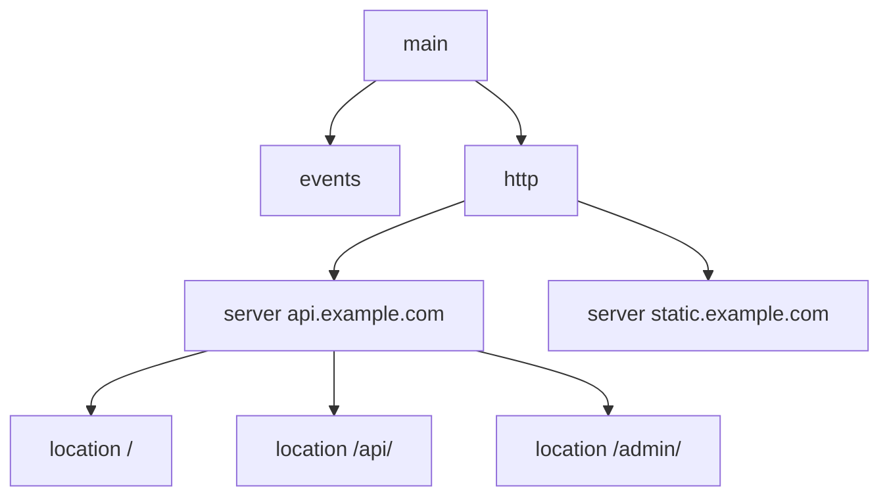
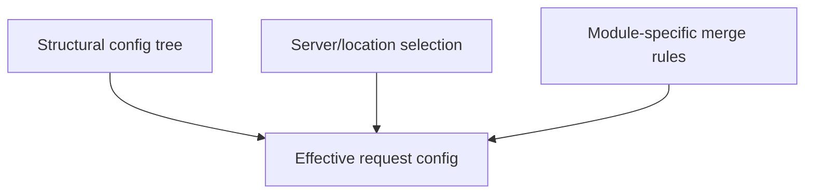
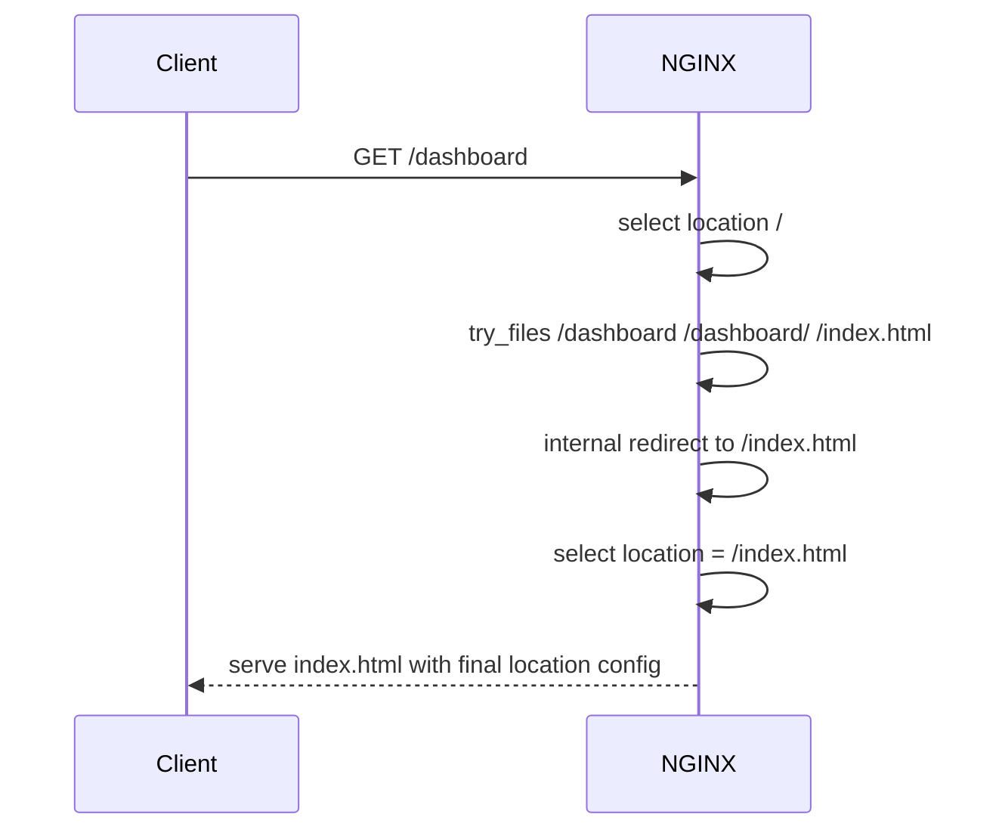

# Part 006 — Context, Directive, Inheritance: Kenapa Config Kecil Bisa Berbahaya

Part sebelumnya membahas bahasa konfigurasi NGINX dari first principles. Sekarang kita masuk ke sumber bug yang lebih halus: **inheritance**.

Banyak engineer mengira inheritance NGINX bekerja seperti CSS atau class inheritance sederhana. Itu salah.

Di NGINX, inheritance bukan satu aturan global. Setiap module mendefinisikan bagaimana konfigurasi parent dan child digabung. Ada directive yang diwariskan jika child kosong. Ada yang mengganti seluruh list. Ada yang boleh muncul berkali-kali. Ada yang tidak inherited. Ada yang hanya valid pada context tertentu. Ada yang terlihat inherited tetapi sebenarnya dibaca pada fase request tertentu.

Part ini membangun mental model yang lebih akurat.

Referensi resmi:

- `https://nginx.org/en/docs/beginners_guide.html`
- `https://docs.nginx.com/nginx/admin-guide/basic-functionality/managing-configuration-files/`
- `https://nginx.org/en/docs/http/ngx_http_core_module.html`
- `https://nginx.org/en/docs/http/ngx_http_headers_module.html`
- `https://nginx.org/en/docs/http/ngx_http_proxy_module.html`
- `https://nginx.org/en/docs/http/request_processing.html`

---

## 1. Mental model utama

NGINX context membentuk pohon konfigurasi.



Namun jangan membaca pohon ini sebagai "semua directive parent otomatis berlaku ke semua child".

Lebih tepat:

> Setiap module melakukan merge konfigurasi parent-child dengan aturan sendiri.

Pseudocode konseptual:

```txt
for each module:
    create main/http/server/location config
    parse directives into current context config
    merge child config with parent config using module-specific merge rules
```

Ada tiga lapisan yang harus dipisahkan:

1. **valid context**: directive boleh ditulis di mana?
2. **visibility**: child bisa melihat nilai parent atau tidak?
3. **merge behavior**: jika child punya nilai sendiri, apakah menambah, mengganti, atau mematikan parent?

Bug muncul saat tiga hal ini dicampur.

---

## 2. Context bukan namespace biasa

Contoh:

```nginx
http {
    proxy_read_timeout 30s;

    server {
        server_name api.example.com;

        location /slow/ {
            proxy_read_timeout 300s;
            proxy_pass http://slow_backend;
        }

        location /fast/ {
            proxy_pass http://fast_backend;
        }
    }
}
```

Secara intuisi, `/fast/` memakai `proxy_read_timeout 30s`, sedangkan `/slow/` memakai `300s`. Untuk directive ini, intuisi tersebut umumnya benar.

Tetapi jangan generalisasi ke semua directive.

Contoh berbeda:

```nginx
http {
    add_header X-Frame-Options DENY always;
    add_header X-Content-Type-Options nosniff always;

    server {
        location /api/ {
            add_header Cache-Control no-store always;
            proxy_pass http://api_backend;
        }
    }
}
```

Banyak engineer berharap `/api/` mengirim tiga header:

```txt
X-Frame-Options: DENY
X-Content-Type-Options: nosniff
Cache-Control: no-store
```

Tetapi untuk `add_header`, directive di level lebih rendah dapat menyebabkan header dari level sebelumnya tidak diwariskan jika level sekarang mendefinisikan `add_header` sendiri, tergantung versi dan directive inheritance setting yang tersedia. Dalam praktik lintas versi, pola aman adalah jangan mengandalkan additive inheritance implisit untuk security header.

Pola lebih aman:

```nginx
# snippets/security-headers.conf
add_header X-Frame-Options DENY always;
add_header X-Content-Type-Options nosniff always;
add_header Referrer-Policy no-referrer always;

# snippets/no-store.conf
add_header Cache-Control no-store always;

server {
    location /api/ {
        include snippets/security-headers.conf;
        include snippets/no-store.conf;
        proxy_pass http://api_backend;
    }
}
```

Atau definisikan header pada level yang tepat dan test actual response.

Pelajaran:

> Inheritance yang salah pada security header bukan sekadar bug kosmetik. Itu bisa menjadi vulnerability configuration drift.

---

## 3. Tiga jenis scope yang perlu dibedakan

### 3.1 Structural scope

Ini scope berdasarkan block:

```nginx
http {
    server {
        location / {
        }
    }
}
```

Structural scope menjawab: directive ditulis di node mana dalam pohon.

### 3.2 Request selection scope

Ini scope yang dipakai setelah request masuk:

```txt
request -> listen socket -> server selection -> location selection -> effective config
```

Request tidak "masuk ke semua server". Request dipetakan ke satu server lalu satu effective location tertentu, walaupun bisa terjadi internal redirect yang memilih location baru.

### 3.3 Module merge scope

Ini aturan module untuk menggabungkan nilai:

```txt
http value + server value + location value -> effective value
```

Tiga scope ini sering tumpang tindih, tetapi tidak sama.



---

## 4. Main, events, http, server, location

### 4.1 Main context

Main context adalah top-level, di luar block apapun.

```nginx
user nginx nginx;
worker_processes auto;
pid /run/nginx.pid;
error_log /var/log/nginx/error.log warn;
include /etc/nginx/modules-enabled/*.conf;
```

Main context cocok untuk worker lifecycle, process user, pid file, top-level error log, dynamic module loading, environment variables yang dipreservasi, dan global process settings.

Jangan taruh HTTP routing di main context.

### 4.2 Events context

```nginx
events {
    worker_connections 4096;
    multi_accept off;
}
```

Events context mengatur connection processing worker. Tidak ada `server` HTTP di sini.

### 4.3 HTTP context

```nginx
http {
    include mime.types;
    default_type application/octet-stream;

    log_format main '...';
    access_log /var/log/nginx/access.log main;

    upstream app_backend {
        server 127.0.0.1:8080;
    }

    server {
        listen 80;
        server_name example.com;
    }
}
```

HTTP context cocok untuk HTTP-wide defaults, MIME type, log format, maps, upstream definitions, cache zones, global rate limit zones, default proxy settings, dan include server configs.

### 4.4 Server context

```nginx
server {
    listen 443 ssl;
    server_name api.example.com;

    ssl_certificate /etc/nginx/certs/api.crt;
    ssl_certificate_key /etc/nginx/certs/api.key;

    location / {
        proxy_pass http://api_backend;
    }
}
```

Server context adalah virtual server. Ia dipilih berdasarkan listen address/port dan host/SNI/server_name rules.

### 4.5 Location context

```nginx
location /api/ {
    proxy_pass http://api_backend;
}
```

Location context adalah route-level configuration untuk URI tertentu. Ia bukan folder. Ia matching rule.

Ini penting:

```nginx
location /images/ {
    root /data;
}
```

Dengan `root`, request `/images/a.png` dicari di:

```txt
/data/images/a.png
```

Sedangkan:

```nginx
location /images/ {
    alias /data/;
}
```

Dengan `alias`, request `/images/a.png` dicari di:

```txt
/data/a.png
```

Itu bukan inheritance, tetapi contoh bagaimana context memengaruhi directive semantics.

---

## 5. Inheritance bukan copy-paste literal

Misal:

```nginx
http {
    client_max_body_size 10m;

    server {
        server_name upload.example.com;

        location /avatar/ {
            client_max_body_size 2m;
        }

        location /video/ {
            client_max_body_size 500m;
        }
    }
}
```

Effective values:

| Request | Effective `client_max_body_size` |
|---|---:|
| `/avatar/x` | `2m` |
| `/video/x` | `500m` |
| `/other/x` | `10m` jika matched location/server tidak override |

Ini terlihat seperti inheritance sederhana. Tetapi sebenarnya module HTTP core melakukan merge konfigurasi: jika child tidak mengisi nilai, parent dipakai; jika child mengisi, child menang.

Contoh lain:

```nginx
http {
    access_log /var/log/nginx/access.log main;

    server {
        access_log /var/log/nginx/api.access.log main;

        location /healthz {
            access_log off;
            return 200 "ok\n";
        }
    }
}
```

Effective behavior:

- default HTTP access log ada;
- server API mengganti/menentukan log khusus;
- healthz mematikan access log untuk route itu.

Tetapi jangan simpulkan semua directive punya `off` atau override behavior seperti ini.

---

## 6. Kategori merge behavior

Secara praktis, perlakukan directive dalam kategori berikut.

### 6.1 Scalar inherited-if-absent

```nginx
http {
    proxy_read_timeout 30s;

    server {
        location /slow/ {
            proxy_read_timeout 300s;
        }

        location /fast/ {
            proxy_pass http://fast;
        }
    }
}
```

Child memakai parent jika child tidak set. Jika child set, child menang. Banyak directive timeout, size, flag, dan mode bekerja seperti ini. Tetapi tetap cek dokumentasi.

### 6.2 List replacement if child defines any

Contoh penting: header/proxy header style directives.

```nginx
http {
    proxy_set_header Host $host;
    proxy_set_header X-Forwarded-For $proxy_add_x_forwarded_for;

    server {
        location /api/ {
            proxy_set_header X-Request-ID $request_id;
            proxy_pass http://api;
        }
    }
}
```

Banyak engineer berharap `/api/` memakai tiga header. Tetapi untuk `proxy_set_header`, dokumentasi menyatakan directive ini inherited dari previous level jika dan hanya jika tidak ada `proxy_set_header` pada current level. Jadi ketika child mendefinisikan satu `proxy_set_header`, daftar parent bisa tidak ikut.

Pola aman:

```nginx
# snippets/proxy-headers.conf
proxy_set_header Host $host;
proxy_set_header X-Real-IP $remote_addr;
proxy_set_header X-Forwarded-For $proxy_add_x_forwarded_for;
proxy_set_header X-Forwarded-Proto $scheme;

location /api/ {
    include snippets/proxy-headers.conf;
    proxy_set_header X-Request-ID $request_id;
    proxy_pass http://api;
}
```

Namun juga berhati-hati: include snippet di lokasi yang salah bisa mengubah semantics.

### 6.3 Additive repeated directive

Beberapa directive memang boleh muncul berkali-kali untuk membangun beberapa entry.

```nginx
upstream app_backend {
    server 10.0.1.10:8080 weight=2;
    server 10.0.1.11:8080 weight=1;
}
```

Di sini `server` dalam `upstream` menambah peer. Ini bukan inheritance parent-child, tetapi repeated directive dalam satu context.

Contoh lain:

```nginx
server {
    listen 80;
    listen 443 ssl;
}
```

Dua `listen` membuat server menerima di dua socket/protocol configuration.

### 6.4 Context-only directive

Ada directive yang hanya masuk akal di context tertentu dan tidak inherited ke child.

```nginx
upstream app_backend {
    server 127.0.0.1:8080;
}
```

`upstream` bukan default yang diwariskan ke server/location. Ia mendefinisikan named upstream group yang bisa direferensikan oleh `proxy_pass`.

### 6.5 Phase/action directive

Beberapa directive bukan sekadar nilai konfigurasi, tetapi action pada fase request.

```nginx
location /old/ {
    rewrite ^/old/(.*)$ /new/$1 last;
}
```

`rewrite` diproses oleh rewrite module pada fase tertentu. Ini harus dipahami sebagai control flow request, bukan inheritance biasa.

---

## 7. Case study: security header yang hilang

Config:

```nginx
http {
    add_header X-Frame-Options DENY always;
    add_header X-Content-Type-Options nosniff always;

    server {
        listen 443 ssl;
        server_name api.example.com;

        location / {
            proxy_pass http://api_backend;
        }

        location /download/ {
            add_header Content-Disposition attachment always;
            proxy_pass http://download_backend;
        }
    }
}
```

Expected oleh engineer:

```txt
/download/file
X-Frame-Options: DENY
X-Content-Type-Options: nosniff
Content-Disposition: attachment
```

Actual bisa berbeda:

```txt
/download/file
Content-Disposition: attachment
```

Kenapa? Karena `add_header` parent tidak selalu terus diwariskan jika child mendefinisikan `add_header` sendiri.

Perbaikan eksplisit:

```nginx
# snippets/security-headers.conf
add_header X-Frame-Options DENY always;
add_header X-Content-Type-Options nosniff always;

server {
    listen 443 ssl;
    server_name api.example.com;

    location / {
        include snippets/security-headers.conf;
        proxy_pass http://api_backend;
    }

    location /download/ {
        include snippets/security-headers.conf;
        add_header Content-Disposition attachment always;
        proxy_pass http://download_backend;
    }
}
```

Lebih baik lagi: buat automated test.

```bash
curl -skI https://api.example.com/download/test \
  | grep -Ei 'x-frame-options|x-content-type-options|content-disposition'
```

Invariant:

> Security header harus dites pada setiap response class penting, bukan diasumsikan inherited.

---

## 8. Case study: forwarded header hilang

Config:

```nginx
http {
    proxy_set_header Host $host;
    proxy_set_header X-Forwarded-For $proxy_add_x_forwarded_for;
    proxy_set_header X-Forwarded-Proto $scheme;

    server {
        location /api/ {
            proxy_set_header X-Request-ID $request_id;
            proxy_pass http://api_backend;
        }
    }
}
```

Expected:

```txt
Host: original host
X-Forwarded-For: client chain
X-Forwarded-Proto: https
X-Request-ID: generated id
```

Risk:

Jika `proxy_set_header` pada current level memutus inheritance parent, upstream hanya menerima custom header yang didefinisikan di location plus default proxy behavior tertentu, bukan semua header yang Anda kira.

Perbaikan:

```nginx
# snippets/proxy-forwarded-headers.conf
proxy_set_header Host $host;
proxy_set_header X-Real-IP $remote_addr;
proxy_set_header X-Forwarded-For $proxy_add_x_forwarded_for;
proxy_set_header X-Forwarded-Proto $scheme;
proxy_set_header X-Request-ID $request_id;

location /api/ {
    include snippets/proxy-forwarded-headers.conf;
    proxy_pass http://api_backend;
}
```

Atau jadikan `proxy_set_header` lengkap di satu level yang sama.

Pelajaran:

> Untuk directive list replacement, jangan patch satu entry di child dan berharap parent list ikut secara otomatis.

---

## 9. Case study: timeout override tidak sengaja

Config:

```nginx
http {
    proxy_connect_timeout 2s;
    proxy_send_timeout 10s;
    proxy_read_timeout 30s;

    server {
        server_name api.example.com;

        location /reports/ {
            proxy_read_timeout 300s;
            proxy_pass http://report_backend;
        }
    }
}
```

Ini relatif masuk akal: report endpoint boleh lebih lama membaca response.

Tetapi config berikut rawan:

```nginx
server {
    server_name api.example.com;

    proxy_read_timeout 300s;

    location / {
        proxy_pass http://api_backend;
    }
}
```

Satu directive di server context bisa memperpanjang timeout untuk seluruh location yang tidak override. Efeknya: koneksi upstream menggantung lebih lama, worker menyimpan resource lebih lama, client mendapat latency tail lebih panjang, overload lebih sulit terlihat, dan retry behavior di client berubah.

Pola lebih aman:

```nginx
http {
    proxy_connect_timeout 2s;
    proxy_send_timeout 10s;
    proxy_read_timeout 30s;
}

server {
    location / {
        proxy_pass http://api_backend;
    }

    location /reports/ {
        proxy_read_timeout 300s;
        proxy_pass http://report_backend;
    }
}
```

Default ketat di atas, pengecualian eksplisit di bawah.

---

## 10. Case study: `root` inherited ke location yang tidak Anda sadari

Config:

```nginx
server {
    listen 80;
    server_name example.com;

    root /srv/www/site/public;

    location / {
        try_files $uri $uri/ /index.html;
    }

    location /uploads/ {
        autoindex on;
    }
}
```

`location /uploads/` dapat memakai `root` dari server. Mungkin itu memang diinginkan. Mungkin juga tidak.

Jika `/srv/www/site/public/uploads/` berisi file sensitif atau directory listing terbuka, bug muncul bukan karena `autoindex` saja, tetapi karena kombinasi `root` inherited, `location` path matched, `autoindex on`, dan filesystem layout terlalu dekat dengan artifact sensitif.

Pola lebih eksplisit:

```nginx
server {
    listen 80;
    server_name example.com;

    location / {
        root /srv/www/site/public;
        try_files $uri $uri/ /index.html;
    }

    location /uploads/ {
        root /srv/www/public-uploads;
        autoindex off;
        try_files $uri =404;
    }
}
```

Atau gunakan `alias` dengan hati-hati saat path mapping memang harus mengganti prefix location.

---

## 11. Server selection bukan inheritance

Config:

```nginx
http {
    server {
        listen 80 default_server;
        server_name _;
        return 444;
    }

    server {
        listen 80;
        server_name api.example.com;

        location / {
            proxy_pass http://api_backend;
        }
    }
}
```

Default server bukan parent dari server lain. Ia adalah fallback selection untuk listen address/port ketika Host tidak cocok.

Jangan berpikir:

```txt
default_server settings inherited by api.example.com
```

Yang benar:

```txt
request with unmatched Host -> default server
request with Host api.example.com -> api server
```

Ini akan dibahas detail di Part 008. Untuk sekarang, cukup pahami bahwa server block setara sebagai kandidat selection, bukan hierarchy parent-child.

---

## 12. Location selection bukan inheritance filesystem

Config:

```nginx
location /api/ {
    proxy_set_header X-Service api;
    proxy_pass http://api_backend;
}

location /api/admin/ {
    proxy_pass http://admin_backend;
}
```

Banyak orang mengira `/api/admin/` otomatis "nested" di `/api/`. Secara struktur, keduanya sibling location dalam server. Request `/api/admin/users` dipilih oleh location matching algorithm, bukan karena `/api/admin/` mewarisi isi `/api/`.

Jika `/api/admin/` butuh header yang sama, tulis eksplisit atau include snippet:

```nginx
location /api/ {
    include snippets/api-proxy-headers.conf;
    proxy_pass http://api_backend;
}

location /api/admin/ {
    include snippets/api-proxy-headers.conf;
    proxy_set_header X-Admin-Route true;
    proxy_pass http://admin_backend;
}
```

Prinsip:

> Prefix location bukan parent-child inheritance. Ia adalah kandidat matching.

---

## 13. Internal redirect bisa mengganti effective location

Contoh:

```nginx
server {
    root /srv/www/app;

    location / {
        try_files $uri $uri/ /index.html;
    }

    location = /index.html {
        add_header Cache-Control no-store always;
    }
}
```

Request `/dashboard`:

1. awalnya match `location /`;
2. `try_files` tidak menemukan `/dashboard`;
3. fallback ke `/index.html`;
4. NGINX dapat melakukan internal redirect ke URI `/index.html`;
5. effective location bisa berubah ke `location = /index.html`.

Ini berarti config effective akhir tidak selalu location awal.



Ini bukan inheritance, tetapi request processing flow.

Kenapa penting?

- header bisa berbeda setelah internal redirect;
- access control bisa berubah;
- cache behavior bisa berubah;
- logging bisa terlihat membingungkan;
- SPA fallback bisa membuka file yang tidak diinginkan jika salah config.

---

## 14. Snippet design: jangan membuat context ambiguity

Snippet buruk:

```nginx
# snippets/common.conf
proxy_set_header Host $host;
add_header X-Frame-Options DENY always;
client_max_body_size 20m;
```

Masalah: directive proxy, directive security header, directive body size, target context tidak jelas, dan inheritance side-effect tidak jelas.

Snippet lebih baik:

```txt
snippets/http/proxy-defaults.conf
snippets/location/proxy-forwarded-headers.conf
snippets/server/security-headers.conf
snippets/location/no-store-cache.conf
snippets/server/tls-modern.conf
```

Contoh:

```nginx
# snippets/location/proxy-forwarded-headers.conf
proxy_http_version 1.1;
proxy_set_header Host $host;
proxy_set_header X-Real-IP $remote_addr;
proxy_set_header X-Forwarded-For $proxy_add_x_forwarded_for;
proxy_set_header X-Forwarded-Proto $scheme;
proxy_set_header X-Request-ID $request_id;
```

Lalu:

```nginx
location /api/ {
    include snippets/location/proxy-forwarded-headers.conf;
    proxy_pass http://api_backend;
}
```

Invariant snippet:

1. Nama snippet menyebut target context.
2. Isi snippet tidak mencampur policy yang tidak terkait.
3. Snippet tidak mengandung `location` kecuali memang fragment server-level.
4. Snippet tidak mengandung `server` kecuali memang virtual host template.
5. Snippet yang berisi security control diuji pada actual response.
6. Snippet yang berisi proxy headers tidak dipatch sebagian di child tanpa sadar.

---

## 15. Pattern: defaults high, exceptions low

Pattern yang sehat:

```nginx
http {
    # Safe global defaults
    client_max_body_size 10m;
    proxy_connect_timeout 2s;
    proxy_send_timeout 10s;
    proxy_read_timeout 30s;

    server {
        server_name api.example.com;

        location / {
            proxy_pass http://api_backend;
        }

        location /upload/ {
            client_max_body_size 100m;
            proxy_read_timeout 120s;
            proxy_pass http://upload_backend;
        }
    }
}
```

Kenapa bagus?

- default konservatif;
- exception terlihat dekat route;
- blast radius kecil;
- review mudah;
- route lambat/besar tampak eksplisit.

Pattern buruk:

```nginx
http {
    client_max_body_size 500m;
    proxy_read_timeout 300s;

    server {
        location / {
            proxy_pass http://api_backend;
        }
    }
}
```

Ini membuat semua endpoint mewarisi limit longgar. Biasanya bukan yang diinginkan.

---

## 16. Pattern: complete list at effective level

Untuk directive dengan list replacement risk, tulis daftar lengkap di level effective.

Buruk:

```nginx
http {
    proxy_set_header Host $host;
    proxy_set_header X-Forwarded-For $proxy_add_x_forwarded_for;

    server {
        location /api/ {
            proxy_set_header X-Request-ID $request_id;
            proxy_pass http://api;
        }
    }
}
```

Baik:

```nginx
location /api/ {
    proxy_set_header Host $host;
    proxy_set_header X-Real-IP $remote_addr;
    proxy_set_header X-Forwarded-For $proxy_add_x_forwarded_for;
    proxy_set_header X-Forwarded-Proto $scheme;
    proxy_set_header X-Request-ID $request_id;

    proxy_pass http://api;
}
```

Atau:

```nginx
location /api/ {
    include snippets/location/proxy-forwarded-headers.conf;
    proxy_pass http://api;
}
```

Prinsip:

> Jika directive membentuk daftar critical, jangan bergantung pada tebakan inheritance. Buat effective list eksplisit.

---

## 17. Pattern: deny-by-default server

Default server sebaiknya eksplisit.

```nginx
server {
    listen 80 default_server;
    server_name _;
    return 444;
}

server {
    listen 80;
    server_name api.example.com;

    location / {
        proxy_pass http://api_backend;
    }
}
```

Untuk TLS:

```nginx
server {
    listen 443 ssl default_server;
    server_name _;

    ssl_certificate /etc/nginx/certs/default.crt;
    ssl_certificate_key /etc/nginx/certs/default.key;

    return 444;
}
```

Catatan: TLS default server tetap butuh certificate karena handshake terjadi sebelum HTTP Host processing. SNI membantu memilih certificate, tetapi fallback masih perlu dipikirkan.

Default server bukan inheritance mechanism. Ia guardrail selection.

---

## 18. Pattern: route-specific ownership

Untuk sistem besar, tiap route penting harus punya ownership jelas.

```nginx
location /reports/ {
    # Owner: data-platform
    # Reason: report generation can take longer than normal API calls.
    # SLO: p95 < 20s, hard timeout 120s.
    proxy_read_timeout 120s;
    proxy_pass http://report_backend;
}
```

Komentar ini bukan noise. Ia menjelaskan kenapa inheritance default dilanggar.

Komentar buruk:

```nginx
# set timeout
proxy_read_timeout 120s;
```

Komentar baik menjelaskan alasan, bukan mengulang directive.

---

## 19. Decision matrix: di level mana directive harus ditaruh?

| Kebutuhan | Level yang biasanya tepat | Catatan |
|---|---|---|
| Worker count | `main` | process-level |
| Worker connections | `events` | event loop capacity |
| MIME types | `http` | global HTTP default |
| Log format | `http` | format didefinisikan global |
| Access log default | `http` atau `server` | pilih sesuai ownership |
| TLS cert | `server` | per host/SNI |
| Security header | `server` atau `location` eksplisit | test actual response |
| Proxy headers | `location` atau snippet location | hindari partial override |
| Timeout default | `http` | exception di location |
| Long timeout | `location` | route-specific |
| Body size default | `http` | exception upload route |
| Cache zone | `http` | shared memory zone |
| Cache enable | `location` | route/content-specific |
| Rate limit zone | `http` | define key/zone |
| Rate limit apply | `server`/`location` | apply policy |
| Upstream pool | `http` | named backend set |
| Static root | `server` atau `location` | eksplisit untuk sensitive paths |

---

## 20. Testing effective inheritance

Jangan hanya baca config. Uji response.

### 20.1 Test headers

```bash
curl -skI https://api.example.com/ \
  | sort

curl -skI https://api.example.com/download/file \
  | sort
```

Bandingkan header security, cache, content disposition.

### 20.2 Test proxy headers dengan echo upstream

Jalankan upstream echo:

```bash
docker run --rm -p 8080:80 mendhak/http-https-echo
```

Lalu request via NGINX:

```bash
curl -s http://localhost:8081/api/test | jq '.headers'
```

Pastikan header yang diharapkan benar-benar sampai.

### 20.3 Test body size

```bash
python3 - <<'PY'
from pathlib import Path
Path('/tmp/payload.bin').write_bytes(b'a' * 11 * 1024 * 1024)
PY

curl -i -X POST --data-binary @/tmp/payload.bin http://localhost:8081/upload/
```

Pastikan route normal menolak payload besar dan route upload menerima sesuai policy.

### 20.4 Test timeout

Gunakan upstream lambat dan pastikan timeout sesuai route.

```bash
curl -i http://localhost:8081/slow
```

Jangan validasi timeout hanya dengan membaca directive.

---

## 21. Anti-pattern: inheritance sebagai dokumentasi palsu

Config:

```nginx
http {
    # All services use these proxy headers
    proxy_set_header Host $host;
    proxy_set_header X-Forwarded-For $proxy_add_x_forwarded_for;

    include conf.d/*.conf;
}
```

Komentar itu bisa palsu jika file include berisi:

```nginx
location /api/ {
    proxy_set_header X-Request-ID $request_id;
    proxy_pass http://api;
}
```

Dokumentasi terbaik adalah effective behavior yang diuji.

Simpan:

- `nginx -T` output;
- curl smoke test;
- header expectations;
- route matrix;
- upstream echo test untuk proxy headers;
- lint policy untuk risky directives.

---

## 22. Inheritance review checklist

Saat review PR NGINX config, tanya:

1. Directive ini valid di context mana?
2. Apakah directive ini scalar, list, additive, action, atau context-only?
3. Jika ditaruh di `http`, siapa saja yang mewarisi?
4. Jika ditaruh di `server`, location mana yang ikut terdampak?
5. Jika ditaruh di `location`, apakah ia mengganti list parent?
6. Apakah security header masih muncul pada route yang override header?
7. Apakah proxy forwarded headers masih lengkap pada route custom?
8. Apakah timeout longgar hanya untuk route yang butuh?
9. Apakah body size longgar hanya untuk upload route?
10. Apakah default server dipakai untuk fallback atau disalahpahami sebagai parent?
11. Apakah prefix location dianggap nested padahal sibling?
12. Apakah internal redirect mengubah effective location?
13. Apakah snippet jelas target context-nya?
14. Apakah config sudah diuji dengan request aktual?

---

## 23. Lab: membuktikan inheritance sendiri

Buat config:

```nginx
events {}

http {
    add_header X-Global global always;
    proxy_set_header X-Global-Proxy global;

    server {
        listen 8080;
        server_name _;

        add_header X-Server server always;

        location /a {
            return 200 "a\n";
        }

        location /b {
            add_header X-Location location always;
            return 200 "b\n";
        }
    }
}
```

Run:

```bash
docker run --rm -p 8080:8080 \
  -v "$PWD/nginx.conf:/etc/nginx/nginx.conf:ro" \
  nginx:stable
```

Test:

```bash
curl -i http://localhost:8080/a
curl -i http://localhost:8080/b
```

Amati header.

Lalu ubah config untuk proxy headers dan echo upstream. Catat mana yang inherited dan mana yang hilang.

Tujuan lab:

- menghilangkan asumsi;
- membangun intuisi effective config;
- menjadikan curl sebagai alat verifikasi inheritance;
- memperkuat bahwa dokumentasi directive harus dibaca per module.

---

## 24. Production invariant

Untuk inheritance di NGINX, invariant production yang baik:

1. Default global bersifat aman dan konservatif.
2. Exception diletakkan sedekat mungkin dengan route yang membutuhkan.
3. Directive list critical ditulis lengkap pada effective level.
4. Security header dites per response path penting.
5. Proxy forwarded headers dites dengan echo upstream.
6. Prefix location tidak dianggap parent-child.
7. Default server tidak dianggap parent.
8. Snippet punya target context eksplisit.
9. Perubahan directive di `http` diperlakukan sebagai perubahan blast radius besar.
10. `nginx -T` selalu direview untuk melihat config efektif.
11. Review config membahas inheritance semantics, bukan hanya syntax.
12. Perubahan inheritance-sensitive punya smoke test.

---

## 25. Ringkasan

Context dan inheritance adalah inti dari konfigurasi NGINX production.

Mental model yang harus dibawa:

- context membentuk pohon konfigurasi;
- request memilih server/location tertentu;
- module menggabungkan config parent-child dengan aturan sendiri;
- inheritance bukan copy-paste literal;
- beberapa list directive mengganti parent jika child mendefinisikan nilai sendiri;
- security header dan proxy header adalah area rawan;
- prefix location bukan nested inheritance;
- default server bukan parent;
- internal redirect bisa mengganti effective location;
- snippet harus didesain berdasarkan target context;
- effective behavior harus diuji dengan request nyata.

Kalimat kunci:

> Di NGINX, bug paling mahal sering bukan directive yang tidak dikenal, tetapi directive yang valid, berhasil reload, terlihat benar, namun effective scope-nya berbeda dari yang diasumsikan.

Part berikutnya akan masuk ke request processing pipeline: bagaimana request bergerak dari listener, server selection, location selection, rewrite/internal redirect, content handler, upstream, response filter, sampai log.
