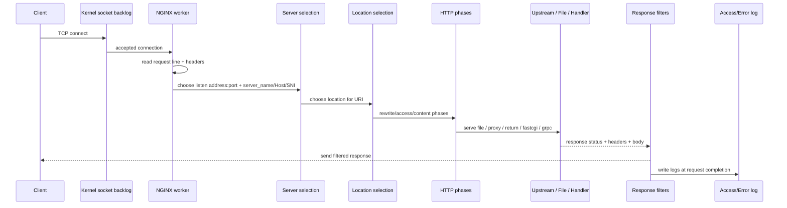
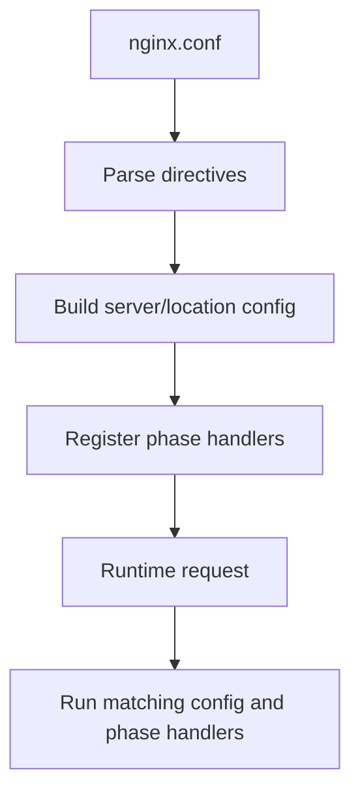
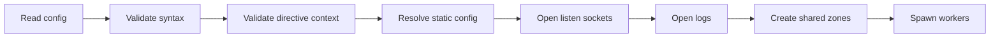
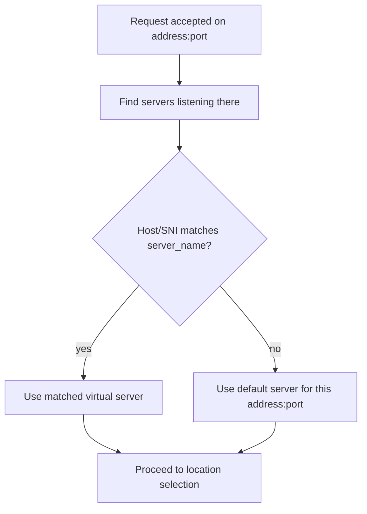
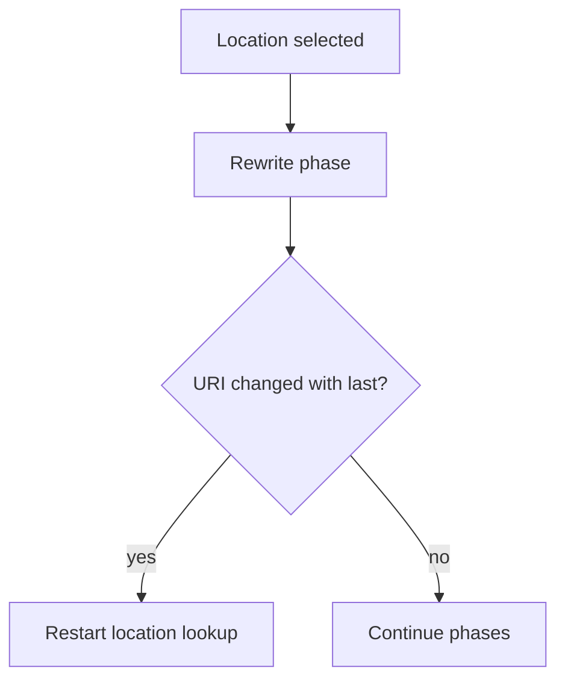
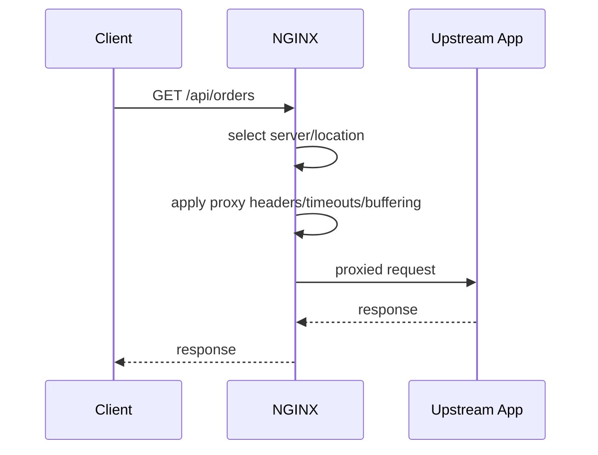
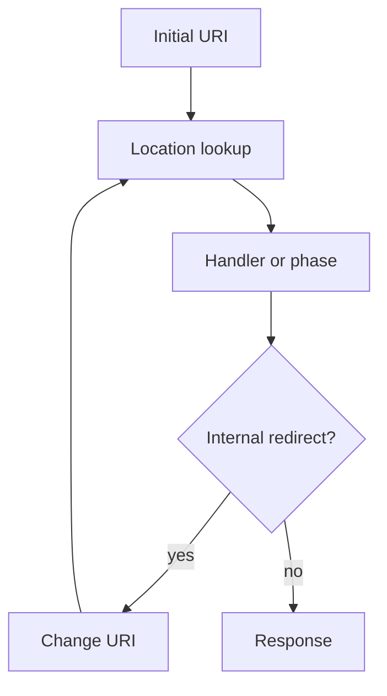

# Part 007 — Request Processing Pipeline

NGINX sering terlihat sederhana karena konfigurasi dasarnya kecil:

```nginx
server {
    listen 80;
    server_name example.com;

    location /api/ {
        proxy_pass http://app;
    }
}
```

Tapi request yang masuk tidak diproses dengan cara "baca file config dari atas ke bawah lalu jalankan blok yang cocok".

Mental model yang lebih tepat:

> NGINX menerima koneksi, memilih konfigurasi virtual server, memilih lokasi, menjalankan beberapa fase HTTP, memanggil content handler, melewatkan response melalui filter, lalu menulis log.

Part ini menjelaskan pipeline itu sebagai alur produksi. Tujuannya bukan supaya Anda hafal semua internal C API NGINX, tetapi supaya Anda dapat menjawab pertanyaan penting:

- Mengapa request masuk ke server block yang salah?
- Mengapa location yang Anda kira paling spesifik tidak dipilih?
- Mengapa `rewrite` berjalan sebelum `proxy_pass`?
- Mengapa `add_header` tidak muncul pada error response?
- Mengapa upstream menerima Host/IP yang salah?
- Mengapa reload config sukses tapi traffic gagal?
- Di titik mana observability harus ditempatkan?

Referensi resmi:

- `https://nginx.org/en/docs/http/request_processing.html`
- `https://nginx.org/en/docs/http/server_names.html`
- `https://nginx.org/en/docs/http/ngx_http_core_module.html`
- `https://nginx.org/en/docs/http/ngx_http_rewrite_module.html`
- `https://nginx.org/en/docs/http/ngx_http_proxy_module.html`
- `https://nginx.org/en/docs/http/ngx_http_log_module.html`

---

## 1. Request pipeline dalam satu gambar



Sederhananya:

```txt
connection
  -> listener
  -> request line/header parse
  -> server block selection
  -> location block selection
  -> rewrite/access/content phases
  -> upstream/static/internal redirect
  -> response filters
  -> log
```

Yang membuat NGINX sulit bukan jumlah fasenya, tetapi **kapan konfigurasi tertentu mulai berlaku**.

Contoh:

- `listen` memengaruhi pemilihan awal koneksi.
- `server_name` memengaruhi pemilihan virtual server setelah Host/SNI diketahui.
- `location` memengaruhi handler untuk URI.
- `rewrite` dapat mengubah URI dan memaksa pencarian location ulang.
- `proxy_set_header` hanya relevan jika request akhirnya masuk ke proxy handler.
- `access_log` sering dieksekusi di akhir, setelah status final diketahui.

Kalau Anda salah menaruh directive, NGINX belum tentu error. Ia bisa valid secara syntax tetapi salah secara traffic.

---

## 2. Pipeline bukan call stack aplikasi biasa

Di aplikasi Java/Node/Go, request biasanya masuk ke middleware chain yang eksplisit:

```txt
middleware A -> middleware B -> controller -> response
```

NGINX berbeda.

NGINX memiliki konfigurasi deklaratif. Directive dari module berbeda mendaftarkan handler ke fase tertentu. Saat request datang, NGINX menjalankan fase HTTP berdasarkan konfigurasi hasil parse.

Mental modelnya seperti compiler + runtime:



Konsekuensi praktis:

1. Urutan baris config tidak selalu sama dengan urutan runtime.
2. Context lebih penting daripada posisi visual.
3. `include` hanya memperluas file config, bukan membuat scope baru.
4. Beberapa directive hanya menyimpan nilai config.
5. Beberapa directive mendaftarkan handler runtime.
6. Internal redirect dapat mengulang sebagian pipeline.

Contoh yang sering salah:

```nginx
location / {
    add_header X-App root;
    proxy_pass http://app;
}

location /health {
    return 200 "ok\n";
}
```

`/health` tidak otomatis mewarisi semua hal dari `location /` hanya karena secara visual berada "di bawah" atau lebih spesifik. Ia adalah location berbeda dengan config hasil merge sendiri.

---

## 3. Stage 0 — konfigurasi sudah diparse sebelum request masuk

Sebelum request pertama diproses, NGINX sudah melakukan banyak hal:



Artinya, banyak kegagalan terjadi saat startup/reload:

- directive tidak dikenal;
- directive diletakkan di context salah;
- port tidak bisa bind;
- file certificate tidak bisa dibaca;
- log path tidak bisa dibuka;
- duplicate listen conflict;
- shared memory zone conflict;
- syntax include error.

Contoh:

```bash
nginx -t
```

Production invariant:

> Tidak ada perubahan konfigurasi NGINX yang boleh masuk tanpa `nginx -t` terhadap full effective config.

Lebih baik lagi, pipeline CI menjalankan:

```bash
nginx -t -c /path/to/generated/nginx.conf
```

Tetapi validasi config tidak membuktikan traffic benar. Ia hanya membuktikan konfigurasi dapat diparse dan resource awal dapat dibuka.

---

## 4. Stage 1 — koneksi masuk ke listener

Request HTTP dimulai dari koneksi TCP atau QUIC, bukan dari URL.

Pada HTTP/1.1 over TCP:

```txt
client -> TCP SYN -> OS accept queue -> NGINX worker accept -> request bytes
```

Directive yang relevan:

```nginx
server {
    listen 80;
}

server {
    listen 443 ssl;
}
```

NGINX pertama-tama mengelompokkan kandidat berdasarkan address/port listener.

Contoh:

```nginx
server {
    listen 10.0.0.10:80;
    server_name app.internal;
}

server {
    listen 10.0.0.20:80;
    server_name app.internal;
}
```

Walaupun `server_name` sama, dua server block itu berada pada listener berbeda. Request ke `10.0.0.10:80` tidak akan diproses oleh server block yang hanya listen di `10.0.0.20:80`.

### 4.1. Listener adalah boundary pertama

Jangan berpikir:

```txt
Host header -> server block
```

Lebih tepat:

```txt
local address:port -> candidate server set -> Host/SNI matching
```

Ini penting pada:

- multi-IP host;
- IPv4 + IPv6;
- port 80 dan 443;
- internal dan external listener;
- separate admin listener;
- blue/green edge;
- service mesh sidecar;
- Kubernetes NodePort/hostNetwork;
- local UNIX socket reverse proxy.

### 4.2. Default server melekat ke listen address:port

Default server bukan global.

```nginx
server {
    listen 80 default_server;
    server_name _;
    return 444;
}

server {
    listen 443 ssl default_server;
    server_name _;
    return 444;
}
```

`default_server` untuk `:80` dan `:443` adalah dua hal berbeda. Jika Anda hanya membuat catch-all di port 80, request HTTPS yang tidak cocok tetap butuh default server sendiri di port 443.

---

## 5. Stage 2 — HTTP request line dan headers dibaca

Setelah koneksi diterima, NGINX membaca request line dan header.

Contoh request HTTP/1.1:

```http
GET /api/orders?status=open HTTP/1.1
Host: api.example.com
User-Agent: curl/8.0
Accept: */*
```

Komponen penting:

| Komponen | Dipakai untuk |
|---|---|
| Method | policy, routing, proxy behavior, logging |
| URI path | location matching |
| Query string | upstream forwarding, cache key, log, app behavior |
| Host header | virtual server selection |
| Headers lain | routing, auth, cache, real IP, upstream contract |

NGINX tidak perlu membaca body untuk memilih server/location. Body dibaca kemudian, bergantung handler dan buffering.

### 5.1. URI yang dipakai untuk matching bukan selalu string mentah

NGINX memiliki variabel seperti:

- `$request_uri`: URI asli termasuk query string;
- `$uri`: normalized/current URI tanpa query string;
- `$args`: query string;
- `$is_args`: `?` jika args ada.

Contoh:

```nginx
log_format main '$request "$request_uri" uri=$uri args="$args"';
```

Dalam routing production, bedakan:

```txt
$request_uri = apa yang dikirim client
$uri         = URI normal/current yang dipakai setelah normalisasi/internal redirect
```

Banyak bug proxy dan cache key muncul karena dua variabel ini dicampur.

---

## 6. Stage 3 — pemilihan server block

Setelah listener diketahui dan Host/SNI tersedia, NGINX memilih server block.

Dokumentasi resmi menjelaskan bahwa jika beberapa server block match IP/port yang sama, NGINX menguji Host header terhadap `server_name`. Bila tidak cocok atau Host tidak ada, request masuk ke default server untuk port tersebut.

Pipeline sederhana:



Contoh:

```nginx
server {
    listen 80 default_server;
    server_name _;
    return 444;
}

server {
    listen 80;
    server_name api.example.com;

    location / {
        proxy_pass http://api_app;
    }
}
```

Request:

```bash
curl -H 'Host: api.example.com' http://127.0.0.1/
```

Masuk ke `api.example.com`.

Request:

```bash
curl -H 'Host: unknown.example.com' http://127.0.0.1/
```

Masuk ke default server dan dikembalikan `444`.

### 6.1. Server selection adalah security boundary

Default server tidak boleh dianggap sebagai formalitas.

Default server menentukan perilaku untuk:

- request tanpa Host;
- Host typo;
- Host injection;
- direct-to-IP traffic;
- domain yang belum dikonfigurasi;
- scanning traffic;
- stale DNS yang masih mengarah ke edge lama.

Production baseline:

```nginx
server {
    listen 80 default_server;
    server_name _;
    return 444;
}

server {
    listen 443 ssl default_server;
    server_name _;

    ssl_certificate     /etc/nginx/certs/default.crt;
    ssl_certificate_key /etc/nginx/certs/default.key;

    return 444;
}
```

Catatan: untuk HTTPS, NGINX tetap memerlukan certificate valid untuk handshake pada default TLS server. Jika tidak, kegagalan bisa terjadi sebelum HTTP request diproses.

---

## 7. Stage 4 — pemilihan location

Setelah server block dipilih, NGINX memilih `location` berdasarkan URI.

Contoh:

```nginx
server {
    listen 80;
    server_name example.com;

    location = /healthz {
        return 200 "ok\n";
    }

    location /api/ {
        proxy_pass http://api_app;
    }

    location / {
        root /srv/www;
        try_files $uri $uri/ /index.html;
    }
}
```

Untuk request:

```txt
GET /api/orders HTTP/1.1
Host: example.com
```

NGINX memilih `location /api/`.

Untuk:

```txt
GET /healthz HTTP/1.1
Host: example.com
```

NGINX memilih exact location `= /healthz`.

Part 009 akan membahas algoritma location matching secara detail. Di part ini, cukup pahami posisi location dalam pipeline:

```txt
server selected -> location selected -> phase handlers run using location config
```

### 7.1. Location adalah unit policy utama

Sebagian besar policy production diletakkan di location:

- proxy target;
- static root;
- body size limit;
- auth behavior;
- caching;
- buffering;
- timeout;
- header forwarding;
- CORS;
- rate limit;
- custom logging.

Karena itu, salah memilih location berarti salah policy.

Contoh bug:

```nginx
location /api {
    proxy_pass http://api_app;
}

location /api/admin/ {
    deny all;
}
```

Kelihatannya `/api/admin/` dilindungi. Tapi Anda tetap harus memvalidasi location algorithm, slash semantics, regex precedence, dan rewrite behavior. Security tidak boleh bergantung pada tebakan visual.

---

## 8. Stage 5 — rewrite phase

`rewrite` bukan sekadar redirect. Ia dapat mengubah URI internal sebelum content handler dipilih final.

Contoh:

```nginx
server {
    listen 80;
    server_name example.com;

    rewrite ^/old/(.*)$ /new/$1 last;

    location /new/ {
        proxy_pass http://new_app;
    }
}
```

`last` menyebabkan NGINX melakukan pencarian location ulang terhadap URI baru.

Perbedaan penting:

| Aksi | Makna |
|---|---|
| `return` | selesai cepat, kirim response |
| `rewrite ... permanent` | redirect eksternal 301 |
| `rewrite ... redirect` | redirect eksternal 302 |
| `rewrite ... last` | ubah URI dan cari location lagi |
| `rewrite ... break` | ubah URI, lanjut di context sekarang |

Mental model:



### 8.1. Rewrite adalah tempat mudah membuat loop

Contoh buruk:

```nginx
rewrite ^/(.*)$ /$1 last;
```

Secara logika, URI tidak berubah bermakna, tetapi NGINX bisa tetap masuk ke alur rewrite/location berulang sampai batas internal redirect tercapai.

Gunakan `return` untuk redirect canonical sederhana:

```nginx
server {
    listen 80;
    server_name example.com;
    return 301 https://example.com$request_uri;
}
```

Jangan memakai `rewrite` kalau `return` cukup.

---

## 9. Stage 6 — access phase

Access phase adalah tempat NGINX mengambil keputusan boleh/tidak request lanjut.

Contoh directive/module:

- `allow` / `deny`;
- `auth_basic`;
- `auth_request`;
- `limit_req`;
- `limit_conn`;
- mTLS client certificate checks;
- JWT/auth modules tertentu;
- WAF modules.

Contoh:

```nginx
location /admin/ {
    allow 10.0.0.0/8;
    deny all;

    proxy_pass http://admin_app;
}
```

Mental model:

```txt
if request violates edge policy -> stop before upstream
else -> continue to content handler
```

### 9.1. Edge access control bukan pengganti authorization aplikasi

NGINX cocok untuk:

- network boundary;
- coarse-grained allowlist;
- request size protection;
- rate limiting;
- mTLS identity boundary;
- blocking obviously invalid traffic;
- centralizing simple auth gate.

NGINX tidak cocok sebagai satu-satunya tempat untuk:

- object-level authorization;
- tenant-level permission;
- complex workflow authorization;
- audit-grade policy reasoning;
- dynamic user entitlement yang butuh domain data.

Invariant:

> NGINX boleh mempersempit permukaan akses, tetapi aplikasi tetap harus menjaga invariant otorisasinya sendiri.

---

## 10. Stage 7 — content phase

Content phase adalah titik request benar-benar dijawab.

Content handler bisa berupa:

| Handler | Contoh directive |
|---|---|
| Static file | `root`, `alias`, `try_files` |
| Immediate response | `return` |
| Reverse proxy | `proxy_pass` |
| FastCGI | `fastcgi_pass` |
| gRPC | `grpc_pass` |
| uWSGI | `uwsgi_pass` |
| Mirror/subrequest | `mirror`, `auth_request` |
| njs/custom module | module-specific |

Contoh reverse proxy:

```nginx
location /api/ {
    proxy_pass http://api_app;
}
```

Contoh static:

```nginx
location /assets/ {
    root /srv/www;
}
```

Contoh immediate response:

```nginx
location = /healthz {
    access_log off;
    return 200 "ok\n";
}
```

### 10.1. Satu location biasanya punya satu dominant content handler

Jangan mencampur mental model:

```nginx
location /mixed/ {
    root /srv/www;
    proxy_pass http://app;
}
```

Walaupun beberapa directive mungkin valid, desain seperti ini membingungkan. Pilih role location dengan jelas:

```txt
location ini menjawab dari file?
location ini meneruskan ke upstream?
location ini hanya redirect/return?
location ini internal-only?
```

Production config yang baik mudah dijelaskan dalam satu kalimat per location.

---

## 11. Stage 8 — upstream interaction

Jika content handler adalah proxy, NGINX menjadi client terhadap upstream.



Directive penting:

```nginx
location /api/ {
    proxy_http_version 1.1;
    proxy_set_header Host $host;
    proxy_set_header X-Real-IP $remote_addr;
    proxy_set_header X-Forwarded-For $proxy_add_x_forwarded_for;
    proxy_set_header X-Forwarded-Proto $scheme;

    proxy_connect_timeout 3s;
    proxy_send_timeout 30s;
    proxy_read_timeout 30s;

    proxy_pass http://api_app;
}
```

Masalah umum:

- Host header salah;
- scheme forwarding salah;
- real client IP tidak dipercaya dengan benar;
- timeout terlalu besar sehingga edge menahan koneksi terlalu lama;
- timeout terlalu kecil sehingga slow upstream dianggap gagal;
- buffering tidak cocok untuk streaming;
- retry menyebabkan duplicate write;
- upstream keepalive tidak dikonfigurasi;
- DNS upstream statis tidak berubah saat service discovery berubah.

### 11.1. Edge contract vs upstream contract

NGINX punya dua kontrak berbeda:

```txt
Client -> NGINX contract
NGINX -> Upstream contract
```

Contoh: client mengirim Host `api.example.com`, tetapi upstream internal butuh Host `orders-service.internal`.

```nginx
location /orders/ {
    proxy_set_header Host orders-service.internal;
    proxy_pass http://orders_service;
}
```

Jangan asal forward semua header client. Edge harus menormalisasi contract.

---

## 12. Stage 9 — response header/body filters

Sebelum response dikirim balik ke client, NGINX dapat menjalankan filter:

- add/modify headers;
- gzip compression;
- chunked encoding;
- range handling;
- caching behavior;
- sub_filter;
- HTTP/2 framing;
- logging variables finalization.

Contoh:

```nginx
location /api/ {
    proxy_pass http://api_app;
    add_header X-Edge nginx always;
}
```

Perhatikan `always`. Tanpa `always`, `add_header` hanya berlaku pada status tertentu sesuai semantics directive. Ini sering membuat engineer bingung karena header muncul untuk 200 tetapi hilang untuk 404/500.

### 12.1. Response filter bukan tempat memperbaiki domain error

NGINX bisa menambahkan header atau memetakan error:

```nginx
proxy_intercept_errors on;
error_page 502 503 504 /edge-error.html;
```

Tapi jangan menjadikan NGINX sebagai tempat menyembunyikan semua error aplikasi. Gunakan dengan tujuan jelas:

- custom error page untuk user experience;
- mencegah bocornya upstream stack trace;
- graceful degradation;
- cache stale fallback;
- observability classification.

---

## 13. Stage 10 — logging saat request selesai

Access log biasanya ditulis saat request selesai, ketika status, bytes sent, upstream timing, dan final variables sudah diketahui.

Contoh log format production:

```nginx
log_format edge_json escape=json
  '{'
    '"time":"$time_iso8601",'
    '"remote_addr":"$remote_addr",'
    '"request_id":"$request_id",'
    '"host":"$host",'
    '"method":"$request_method",'
    '"uri":"$uri",'
    '"request_uri":"$request_uri",'
    '"status":$status,'
    '"body_bytes_sent":$body_bytes_sent,'
    '"request_time":$request_time,'
    '"upstream_addr":"$upstream_addr",'
    '"upstream_status":"$upstream_status",'
    '"upstream_response_time":"$upstream_response_time"'
  '}';

access_log /var/log/nginx/access.json edge_json;
```

Access log adalah rekaman final request. Error log adalah rekaman event internal, warning, dan kegagalan runtime.

Production debugging biasanya membutuhkan keduanya:

```txt
access log: request apa, status apa, berapa lama, upstream mana
error log: kenapa gagal, connection refused, timeout, invalid header, permission denied
```

---

## 14. Internal redirect: pipeline bisa berputar

Request pipeline tidak selalu linear. NGINX memiliki internal redirect.

Contoh `try_files`:

```nginx
location / {
    root /srv/app;
    try_files $uri $uri/ /index.html;
}
```

Jika `/foo` tidak ada sebagai file atau directory, NGINX melakukan internal redirect ke `/index.html`.

Contoh `error_page`:

```nginx
error_page 404 /custom-404.html;

location = /custom-404.html {
    root /srv/errors;
    internal;
}
```

Contoh rewrite:

```nginx
rewrite ^/v1/(.*)$ /api/$1 last;
```

Mental model:



Internal redirect berguna, tetapi membawa risiko:

- loop;
- policy bypass jika target internal tidak dilindungi;
- log membingungkan karena `$uri` berubah;
- cache key berubah;
- request masuk ke location lain dengan directive berbeda;
- `proxy_pass` URI semantics berubah.

Invariant:

> Setiap internal redirect harus dianggap seperti routing baru dengan policy baru.

---

## 15. Subrequest: request di dalam request

Beberapa module membuat subrequest, misalnya:

- `auth_request`;
- `mirror`;
- SSI;
- beberapa internal handlers.

Contoh `auth_request`:

```nginx
location /private/ {
    auth_request /_auth;
    proxy_pass http://private_app;
}

location = /_auth {
    internal;
    proxy_pass http://auth_service/verify;
    proxy_pass_request_body off;
    proxy_set_header Content-Length "";
    proxy_set_header X-Original-URI $request_uri;
}
```

Pipeline utama:

```txt
client request -> /private/ -> subrequest /_auth -> auth result -> maybe proxy to private_app
```

Subrequest bukan redirect client. Client tidak melihatnya. Tetapi upstream auth service melihat request tambahan.

Operational consequence:

- latency bertambah;
- upstream auth menjadi dependency edge;
- failure mode harus ditentukan;
- logging perlu membedakan main request dan subrequest;
- header/body forwarding harus sengaja dibatasi.

---

## 16. Request body: tidak selalu langsung dibaca

NGINX tidak selalu membaca body saat awal request. Body handling tergantung handler.

Contoh upload besar:

```nginx
location /upload/ {
    client_max_body_size 100m;
    proxy_request_buffering on;
    proxy_pass http://upload_app;
}
```

Dengan `proxy_request_buffering on`, NGINX bisa membaca dan buffer body sebelum mengirim ke upstream. Dengan buffering off, body dapat distream ke upstream.

Trade-off:

| Mode | Kelebihan | Risiko |
|---|---|---|
| Buffering on | upstream terlindungi dari slow client; retry lebih mungkin | disk/temp pressure; latency upload besar |
| Buffering off | streaming lebih cepat; cocok upload besar tertentu | upstream terekspos slow client; retry terbatas |

Request body adalah bagian dari pipeline yang sering terlupakan karena routing tidak membutuhkannya. Tetapi untuk API upload, ia menjadi sumber utama bottleneck.

---

## 17. State yang terlihat oleh upstream

Saat NGINX meneruskan request, upstream tidak melihat client asli secara langsung. Ia melihat request baru dari NGINX.

Contoh upstream menerima:

```http
GET /orders HTTP/1.1
Host: api.example.com
X-Real-IP: 203.0.113.10
X-Forwarded-For: 203.0.113.10, 10.0.1.5
X-Forwarded-Proto: https
```

Header forwarding harus didesain sebagai contract.

Baseline umum:

```nginx
proxy_set_header Host $host;
proxy_set_header X-Real-IP $remote_addr;
proxy_set_header X-Forwarded-For $proxy_add_x_forwarded_for;
proxy_set_header X-Forwarded-Proto $scheme;
proxy_set_header X-Request-ID $request_id;
```

Tetapi kalau NGINX berada di belakang load balancer lain, `$remote_addr` mungkin IP load balancer, bukan IP client. Maka perlu `real_ip` module:

```nginx
set_real_ip_from 10.0.0.0/8;
real_ip_header X-Forwarded-For;
real_ip_recursive on;
```

Jangan aktifkan `real_ip` tanpa trust boundary. Kalau Anda mempercayai `X-Forwarded-For` dari internet, client bisa memalsukan IP.

---

## 18. Pipeline untuk beberapa role umum

### 18.1. Static website

```txt
accept connection
-> select server
-> select location /
-> try_files
-> maybe internal redirect /index.html
-> static file handler
-> response filters
-> access log
```

Config:

```nginx
server {
    listen 443 ssl;
    server_name www.example.com;

    root /srv/www/current;

    location / {
        try_files $uri $uri/ /index.html;
    }

    location /assets/ {
        try_files $uri =404;
        expires 1y;
        add_header Cache-Control "public, immutable";
    }
}
```

### 18.2. API reverse proxy

```txt
accept connection
-> select server api.example.com
-> select location /v1/
-> access/rate limit
-> proxy handler
-> upstream response
-> filters
-> log with upstream timings
```

Config:

```nginx
upstream api_v1 {
    server 10.0.10.11:8080;
    server 10.0.10.12:8080;
    keepalive 64;
}

server {
    listen 443 ssl;
    server_name api.example.com;

    location /v1/ {
        limit_req zone=api burst=20 nodelay;
        proxy_http_version 1.1;
        proxy_set_header Connection "";
        proxy_set_header Host $host;
        proxy_set_header X-Request-ID $request_id;
        proxy_pass http://api_v1;
    }
}
```

### 18.3. Auth gateway

```txt
main request
-> auth subrequest
-> if 2xx continue
-> if 401/403 stop
-> else maybe error
```

Config:

```nginx
location /app/ {
    auth_request /_auth;
    proxy_pass http://app;
}

location = /_auth {
    internal;
    proxy_pass http://auth/verify;
    proxy_pass_request_body off;
    proxy_set_header Content-Length "";
    proxy_set_header X-Original-URI $request_uri;
}
```

### 18.4. Cache proxy

```txt
select location
-> compute cache key
-> check cache zone
-> HIT: serve from cache
-> MISS: proxy upstream
-> store maybe
-> log cache status
```

Config:

```nginx
proxy_cache_path /var/cache/nginx/api levels=1:2 keys_zone=api_cache:100m max_size=10g inactive=1h;

server {
    listen 443 ssl;
    server_name api.example.com;

    location /public/ {
        proxy_cache api_cache;
        proxy_cache_key "$scheme$request_method$host$request_uri";
        add_header X-Cache $upstream_cache_status always;
        proxy_pass http://api;
    }
}
```

---

## 19. Debugging pipeline: dari luar ke dalam

Saat request salah route, jangan langsung melihat `proxy_pass`.

Gunakan urutan investigasi:

```txt
1. Apakah request sampai ke host/port yang benar?
2. Listener mana yang menerima?
3. Server block mana yang dipilih?
4. Location mana yang dipilih?
5. Apakah rewrite/internal redirect terjadi?
6. Apakah access/auth/rate limit menghentikan request?
7. Apakah content handler static/proxy/return yang menjawab?
8. Jika proxy, upstream mana yang dipilih?
9. Timeout/buffering/header apa yang berlaku?
10. Apa status final di access log dan error log?
```

### 19.1. Tambahkan header debug secara terbatas

Di non-production atau endpoint internal:

```nginx
add_header X-Debug-Server $server_name always;
add_header X-Debug-URI $uri always;
add_header X-Debug-Request-URI $request_uri always;
add_header X-Debug-Upstream $upstream_addr always;
```

Jangan expose detail internal ke public production tanpa kontrol. Header debug bisa membocorkan topology.

### 19.2. Gunakan log format sementara

```nginx
log_format route_debug '$remote_addr host=$host server=$server_name '
                       'request="$request" uri=$uri request_uri=$request_uri '
                       'status=$status upstream=$upstream_addr '
                       'upstream_status=$upstream_status rt=$request_time urt=$upstream_response_time';

access_log /var/log/nginx/route_debug.log route_debug;
```

Pastikan rotasi log disiapkan. Debug log yang terlalu verbose dapat menjadi incident baru.

---

## 20. Failure mode berdasarkan stage

| Stage | Failure | Gejala | Root Cause Umum |
|---|---|---|---|
| Config parse | reload gagal | config lama tetap aktif | syntax/context/resource error |
| Listener | connection refused | client tidak bisa connect | NGINX down, port salah, firewall |
| Server selection | wrong app/cert | Host typo, default server | missing `server_name`, SNI mismatch |
| Location selection | wrong handler | static instead of proxy | location precedence salah |
| Rewrite | loop/404 | too many redirects/internal redirects | rewrite rule salah |
| Access | 403/401/429 | request diblok | allowlist/rate/auth salah |
| Body read | 413/timeout | upload gagal | body size/temp path/buffering |
| Upstream connect | 502 | connection refused/no route | app down, DNS, port salah |
| Upstream read | 504 | timeout | slow app, timeout terlalu kecil |
| Response filter | missing header | header tidak muncul | `add_header` inheritance/status |
| Log | blind incident | data kurang | log format tidak mencatat upstream |

Production skill adalah bisa memetakan gejala ke stage dengan cepat.

---

## 21. Config pattern: explicit pipeline comments

Untuk sistem besar, tulis config dengan komentar yang mengikuti pipeline.

```nginx
server {
    # 1. Listener and virtual host identity
    listen 443 ssl;
    server_name api.example.com;

    # 2. TLS identity
    ssl_certificate     /etc/nginx/certs/api.crt;
    ssl_certificate_key /etc/nginx/certs/api.key;

    # 3. Server-wide safety defaults
    client_max_body_size 10m;

    # 4. Health endpoint: local response, no upstream
    location = /healthz {
        access_log off;
        return 200 "ok\n";
    }

    # 5. API traffic: protected reverse proxy
    location /v1/ {
        limit_req zone=api burst=50 nodelay;

        proxy_http_version 1.1;
        proxy_set_header Connection "";
        proxy_set_header Host $host;
        proxy_set_header X-Request-ID $request_id;
        proxy_set_header X-Forwarded-Proto $scheme;
        proxy_set_header X-Forwarded-For $proxy_add_x_forwarded_for;

        proxy_connect_timeout 3s;
        proxy_send_timeout 30s;
        proxy_read_timeout 30s;

        proxy_pass http://api_v1;
    }
}
```

Komentar bukan kosmetik. Ia memaksa engineer menyatakan role tiap blok.

---

## 22. Anti-pattern pipeline

### 22.1. Catch-all app tanpa default server

```nginx
server {
    listen 80;
    server_name app.example.com;
    proxy_pass http://app; # salah context juga, tapi pola ini sering muncul dalam variasi lain
}
```

Masalah:

- unknown Host bisa masuk ke app;
- direct IP traffic bisa diterima;
- Host header attack lebih mudah;
- observability default traffic hilang.

### 22.2. Semua route dalam regex location

```nginx
location ~ ^/(api|admin|assets|files)/ {
    proxy_pass http://app;
}
```

Masalah:

- precedence sulit dipahami;
- policy per path sulit dibedakan;
- security review berat;
- route baru rawan collateral impact.

### 22.3. Rewrite sebagai router utama

```nginx
rewrite ^/api/(.*)$ /$1 break;
proxy_pass http://app;
```

Masalah:

- URI contract tidak jelas;
- log membingungkan;
- cache key rawan salah;
- app menerima path berbeda dari yang client lihat;
- internal redirect risk.

### 22.4. Forward all client headers blindly

NGINX tidak memiliki directive `proxy_pass_all_headers off/on` seperti yang sering dibayangkan orang. Tetapi anti-pattern-nya adalah membiarkan upstream mempercayai header client tanpa normalisasi.

Contoh risiko:

```txt
Client sends: X-Forwarded-Proto: https
Edge receives over plain HTTP
App thinks request is secure
```

Edge harus menetapkan header authoritative:

```nginx
proxy_set_header X-Forwarded-Proto $scheme;
```

---

## 23. Production checklist

Gunakan checklist ini saat mereview konfigurasi request pipeline:

```txt
[ ] Setiap listen address/port punya default_server eksplisit.
[ ] Default server tidak meneruskan unknown Host ke aplikasi utama.
[ ] HTTP dan HTTPS default server dipisahkan.
[ ] Setiap server_name eksplisit dan sesuai DNS/certificate.
[ ] Setiap location punya role tunggal yang mudah dijelaskan.
[ ] Exact health endpoint tidak bergantung upstream.
[ ] Rewrite hanya dipakai jika return/try_files tidak cukup.
[ ] Internal location diberi `internal` bila tidak boleh diakses client.
[ ] Header forwarded ke upstream ditetapkan secara authoritative.
[ ] Real IP hanya dipercaya dari proxy yang eksplisit trusted.
[ ] Timeout connect/send/read didefinisikan sengaja.
[ ] Body size limit didefinisikan per server/location sesuai kebutuhan.
[ ] Access log mencatat host, uri, status, request_time, upstream_addr, upstream_status, upstream_response_time.
[ ] Error log level sesuai environment.
[ ] Debug header/log tidak bocor ke public tanpa kontrol.
```

---

## 24. Lab: trace request melewati pipeline

Buat file:

```nginx
# /etc/nginx/conf.d/pipeline-lab.conf

log_format pipeline '$remote_addr host=$host server=$server_name '
                    'request="$request" uri=$uri request_uri=$request_uri '
                    'status=$status upstream=$upstream_addr '
                    'ustatus=$upstream_status rt=$request_time urt=$upstream_response_time';

server {
    listen 8080 default_server;
    server_name _;

    access_log /var/log/nginx/pipeline-lab.log pipeline;

    return 444;
}

server {
    listen 8080;
    server_name lab.local;

    access_log /var/log/nginx/pipeline-lab.log pipeline;

    location = /healthz {
        return 200 "ok\n";
    }

    location /old/ {
        rewrite ^/old/(.*)$ /new/$1 last;
    }

    location /new/ {
        return 200 "new uri=$uri request_uri=$request_uri\n";
    }

    location / {
        return 200 "root uri=$uri request_uri=$request_uri\n";
    }
}
```

Validasi:

```bash
nginx -t
nginx -s reload
```

Test:

```bash
curl -i http://127.0.0.1:8080/healthz -H 'Host: lab.local'
curl -i http://127.0.0.1:8080/old/test?a=1 -H 'Host: lab.local'
curl -i http://127.0.0.1:8080/anything -H 'Host: lab.local'
curl -i http://127.0.0.1:8080/anything -H 'Host: unknown.local'
```

Perhatikan log:

```bash
tail -f /var/log/nginx/pipeline-lab.log
```

Yang harus Anda lihat:

- `Host: lab.local` memilih server kedua;
- `/healthz` dijawab exact location;
- `/old/test` rewrite ke `/new/test`;
- `$request_uri` tetap menyimpan URI original;
- `$uri` mencerminkan URI current setelah rewrite;
- unknown Host masuk default server.

---

## 25. Mental model akhir

Simpan model ini:

```txt
NGINX request processing is not "find a block and run it".
It is:
listener -> virtual server -> location -> phases -> handler -> filters -> log.
```

Atau dalam bentuk production reasoning:

```txt
Which socket accepted the connection?
Which server identity won?
Which URI policy won?
Which phase stopped or transformed the request?
Which handler generated the response?
Which filters changed the response?
What did the final logs prove?
```

Kalau Anda bisa menjawab tujuh pertanyaan itu, Anda tidak lagi mengoperasikan NGINX dengan trial-and-error. Anda sedang membaca traffic engine-nya.

Part berikutnya membahas server selection secara lebih detail: `listen`, `server_name`, `default_server`, wildcard, regex, SNI, dan catch-all design.
