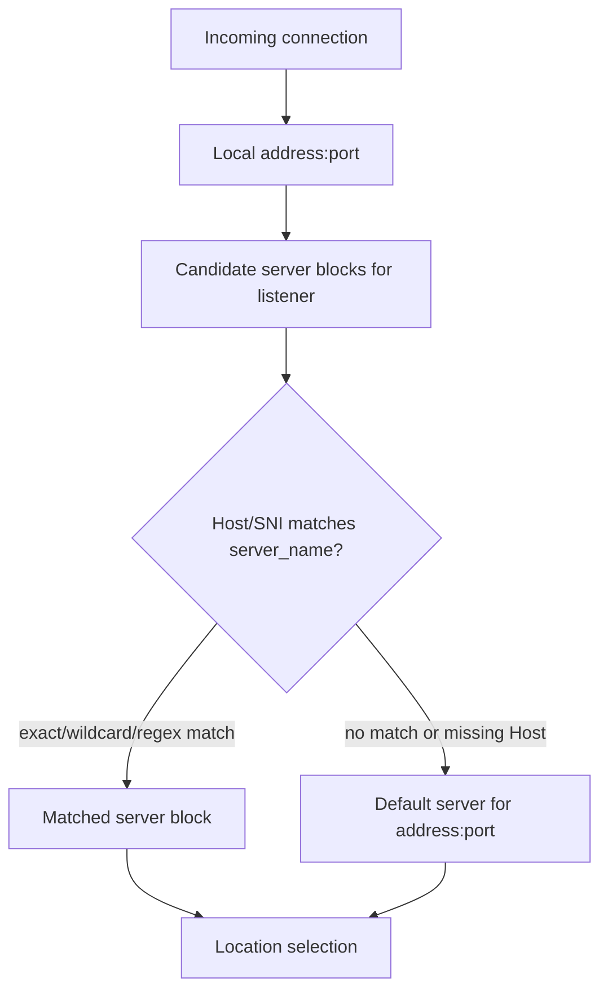
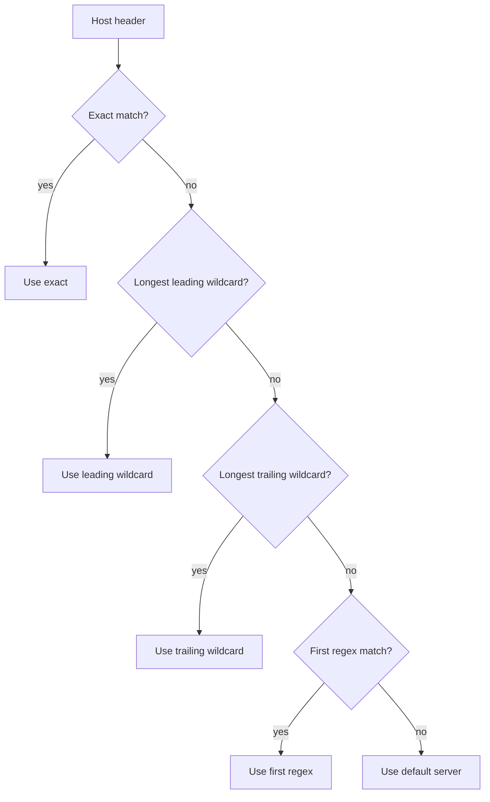
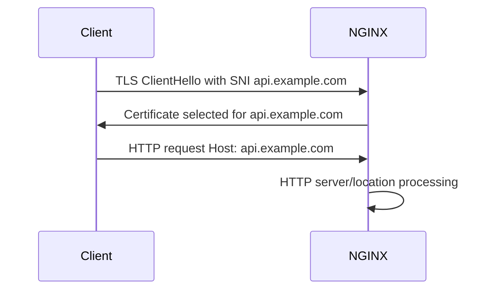

# Part 008 — Server Selection, `server_name`, dan `default_server`

Salah satu bug NGINX paling mahal biasanya terlihat sederhana:

> "Kenapa request domain A masuk ke aplikasi domain B?"

Atau:

> "Kenapa certificate yang keluar bukan certificate domain ini?"

Atau:

> "Kenapa direct IP traffic bisa sampai ke aplikasi production?"

Penyebabnya sering bukan `proxy_pass`, bukan upstream, bukan DNS, tetapi **server selection**.

Part ini membahas cara NGINX memilih `server {}` block secara detail. Ini adalah boundary awal sebelum `location`, `rewrite`, proxy, cache, dan security policy bekerja.

Referensi resmi:

- `https://nginx.org/en/docs/http/request_processing.html`
- `https://nginx.org/en/docs/http/server_names.html`
- `https://nginx.org/en/docs/http/ngx_http_core_module.html#listen`
- `https://nginx.org/en/docs/http/ngx_http_core_module.html#server_name`
- `https://nginx.org/en/docs/http/configuring_https_servers.html`

---

## 1. Mental model utama

NGINX tidak memilih server block hanya berdasarkan `server_name`.

Urutan konseptualnya:

```txt
1. koneksi masuk ke local address:port tertentu
2. NGINX mencari server block yang listen di address:port itu
3. dari kandidat itu, NGINX cocokkan Host/SNI dengan server_name
4. jika tidak ada match, gunakan default server untuk address:port tersebut
```

Dalam bentuk diagram:



Kalimat paling penting:

> `default_server` melekat pada `listen address:port`, bukan pada seluruh proses NGINX.

---

## 2. `listen` adalah boundary pertama

Contoh paling sederhana:

```nginx
server {
    listen 80;
    server_name example.com;
}
```

`listen 80` berarti server block ini menjadi kandidat untuk koneksi yang datang ke port 80 pada address yang sesuai.

Bentuk umum:

```nginx
listen 80;
listen 127.0.0.1:8080;
listen 10.0.0.10:443 ssl;
listen [::]:80;
listen unix:/run/nginx/app.sock;
```

### 2.1. Port-only listen

```nginx
server {
    listen 80;
    server_name app.example.com;
}
```

Secara praktis, ini mendengarkan port 80 pada address default/wildcard sesuai platform dan konfigurasi.

Cocok untuk banyak deployment sederhana, tetapi pada host multi-IP, production edge, atau shared node, lebih aman eksplisit.

### 2.2. IP + port listen

```nginx
server {
    listen 10.0.1.10:80;
    server_name internal.example.com;
}

server {
    listen 203.0.113.10:80;
    server_name public.example.com;
}
```

Keduanya bisa punya `server_name` sama sekalipun, karena kandidat awal dipisahkan oleh local address/port.

### 2.3. IPv4 dan IPv6 bukan hal yang sama

```nginx
server {
    listen 80 default_server;
    listen [::]:80 default_server;
    server_name _;
    return 444;
}
```

Jika Anda hanya membuat default server IPv4, IPv6 traffic bisa mengikuti default berbeda. Pada production dual-stack, default server harus dirancang untuk keduanya.

### 2.4. HTTPS listener memerlukan `ssl`

```nginx
server {
    listen 443 ssl;
    server_name api.example.com;

    ssl_certificate     /etc/nginx/certs/api.crt;
    ssl_certificate_key /etc/nginx/certs/api.key;
}
```

Tanpa konfigurasi TLS yang benar, request HTTPS bisa gagal sebelum HTTP Host header diproses.

---

## 3. Apa itu default server?

Default server adalah server block yang dipakai jika tidak ada `server_name` yang cocok untuk listener tersebut.

Contoh:

```nginx
server {
    listen 80 default_server;
    server_name _;
    return 444;
}

server {
    listen 80;
    server_name app.example.com;
    return 200 "app\n";
}
```

Test:

```bash
curl -i http://127.0.0.1/ -H 'Host: app.example.com'
curl -i http://127.0.0.1/ -H 'Host: unknown.example.com'
```

Hasil konseptual:

```txt
Host app.example.com     -> server app.example.com
Host unknown.example.com -> default server
```

### 3.1. Jika `default_server` tidak ditulis

Jika tidak ada `default_server` eksplisit, NGINX menggunakan server pertama untuk address/port tersebut sebagai default.

Ini legal, tetapi buruk untuk production.

Anti-pattern:

```nginx
server {
    listen 80;
    server_name app.example.com;
    proxy_pass http://app; # proxy_pass di sini juga salah context; ini hanya ilustrasi risiko first-server default
}
```

Risikonya:

- Host tidak dikenal masuk ke aplikasi pertama;
- direct IP traffic masuk ke aplikasi;
- scanning traffic mencemari log app;
- domain typo mengarah ke app salah;
- cert/default behavior tidak eksplisit;
- hasil bergantung urutan include file.

Production invariant:

> Selalu definisikan `default_server` eksplisit untuk setiap listener public.

### 3.2. `server_name _;` bukan magic catch-all

Banyak engineer mengira:

```nginx
server_name _;
```

berarti wildcard/catch-all. Tidak.

`_` hanyalah nama server yang tidak mungkin dipakai normal. Catch-all terjadi karena server block itu adalah default server, bukan karena `_` punya arti khusus.

Yang menentukan catch-all:

```nginx
listen 80 default_server;
```

Bukan:

```nginx
server_name _;
```

Anda bisa menulis:

```nginx
server {
    listen 80 default_server;
    server_name invalid.local;
    return 444;
}
```

Itu tetap catch-all untuk unmatched Host pada listener tersebut.

---

## 4. Desain default server yang aman

Untuk public edge, default server sebaiknya tidak meneruskan request ke aplikasi bisnis.

Baseline:

```nginx
server {
    listen 80 default_server;
    listen [::]:80 default_server;
    server_name _;

    access_log /var/log/nginx/default-http-access.log main;
    return 444;
}
```

Untuk HTTPS:

```nginx
server {
    listen 443 ssl default_server;
    listen [::]:443 ssl default_server;
    server_name _;

    ssl_certificate     /etc/nginx/certs/default.crt;
    ssl_certificate_key /etc/nginx/certs/default.key;

    access_log /var/log/nginx/default-https-access.log main;
    return 444;
}
```

### 4.1. Mengapa HTTPS default butuh certificate?

TLS handshake terjadi sebelum HTTP request lengkap tersedia. SNI dikirim saat TLS handshake, tetapi jika SNI tidak ada atau tidak cocok, NGINX tetap perlu certificate default untuk menyelesaikan atau menolak handshake sesuai konfigurasi.

Jika default TLS server tidak dirancang, gejalanya bisa membingungkan:

- client melihat certificate salah;
- handshake gagal;
- request tidak pernah masuk access log HTTP;
- monitoring hanya melihat TLS error;
- aplikasi tidak pernah menerima request.

### 4.2. `return 444` vs 404/403

`444` adalah status non-standard NGINX untuk menutup koneksi tanpa response.

Cocok untuk:

- unknown Host;
- direct IP scan;
- traffic tidak valid;
- default public catch-all.

Namun untuk internal platform, kadang lebih baik return 404/421/403 agar debugging lebih jelas.

Contoh internal:

```nginx
server {
    listen 8080 default_server;
    server_name _;
    return 404 "unknown virtual host\n";
}
```

Pilih berdasarkan operational goal:

| Goal | Default response |
|---|---|
| Public noise reduction | `444` |
| Developer debugging | `404` with text |
| Explicit forbidden | `403` |
| Misdirected HTTP/2-style semantics | `421` jika sesuai |

---

## 5. `server_name` exact match

Exact name adalah bentuk paling aman dan paling umum.

```nginx
server {
    listen 443 ssl;
    server_name api.example.com;
}
```

Multiple exact names:

```nginx
server {
    listen 443 ssl;
    server_name example.com www.example.com;
}
```

Nama pertama menjadi primary server name untuk beberapa konteks/variabel.

Production guidance:

```txt
Gunakan exact server_name untuk host penting.
Gunakan wildcard hanya jika benar-benar multi-tenant/subdomain-wide.
Gunakan regex sebagai opsi terakhir.
```

### 5.1. Canonical host redirect

Pola umum:

```nginx
server {
    listen 443 ssl;
    server_name www.example.com;

    ssl_certificate     /etc/nginx/certs/example.crt;
    ssl_certificate_key /etc/nginx/certs/example.key;

    return 301 https://example.com$request_uri;
}

server {
    listen 443 ssl;
    server_name example.com;

    ssl_certificate     /etc/nginx/certs/example.crt;
    ssl_certificate_key /etc/nginx/certs/example.key;

    location / {
        proxy_pass http://app;
    }
}
```

Pisahkan redirect host canonical dari app server. Jangan mencampur semua host behavior dalam satu block tanpa alasan kuat.

---

## 6. Wildcard server names

NGINX mendukung wildcard name pada awal atau akhir nama.

Contoh leading wildcard:

```nginx
server_name *.example.com;
```

Cocok untuk:

```txt
api.example.com
admin.example.com
tenant-a.example.com
```

Contoh trailing wildcard:

```nginx
server_name mail.*;
```

Cocok untuk:

```txt
mail.example
mail.local
```

Dalam praktik production modern, trailing wildcard jarang lebih baik daripada exact name.

### 6.1. Wildcard bukan regex

Wildcard NGINX bukan arbitrary pattern matching.

Valid:

```nginx
server_name *.example.com;
server_name example.*;
```

Bukan berarti Anda bisa menulis semua pola kompleks sebagai wildcard. Untuk pola kompleks, NGINX menyediakan regex server name, tetapi itu membawa biaya dan risiko.

### 6.2. Special wildcard `.example.com`

NGINX mendukung special wildcard:

```nginx
server_name .example.com;
```

Ini dapat mencakup:

```txt
example.com
*.example.com
```

Gunakan dengan hati-hati. Ia ringkas, tetapi bisa menyembunyikan fakta bahwa apex dan subdomain diperlakukan sama.

Untuk production critical host, explicit lebih mudah diaudit:

```nginx
server_name example.com *.example.com;
```

---

## 7. Regex server names

Regex server name diawali `~`.

```nginx
server {
    listen 443 ssl;
    server_name ~^(?<tenant>[a-z0-9-]+)\.example\.com$;

    location / {
        proxy_set_header X-Tenant $tenant;
        proxy_pass http://tenant_router;
    }
}
```

Regex berguna untuk multi-tenant routing, tetapi jangan jadikan default.

Risiko:

- lebih sulit dibaca;
- urutan regex matters;
- capture bisa disalahgunakan;
- typo regex dapat memperluas cakupan host;
- performance lookup tidak sebaik exact hash;
- security review lebih sulit;
- certificate/SNI tetap harus mencakup nama-nama itu.

### 7.1. Regex harus di-quote bila berisi `{` atau `}`

Contoh:

```nginx
server_name "~^(?<tenant>[a-z0-9-]{3,30})\.example\.com$";
```

Quoting menghindari parser config salah membaca karakter khusus.

### 7.2. Capture dari server_name

Named capture bisa dipakai sebagai variable:

```nginx
server_name ~^(?<subdomain>.+)\.example\.com$;

location / {
    proxy_set_header X-Subdomain $subdomain;
    proxy_pass http://router;
}
```

Jangan langsung map capture ke filesystem path tanpa validasi ketat.

Berbahaya:

```nginx
root /srv/tenants/$subdomain;
```

Lebih aman:

```nginx
map $host $tenant_root {
    default "";
    tenant-a.example.com /srv/tenants/tenant-a;
    tenant-b.example.com /srv/tenants/tenant-b;
}
```

Atau gunakan aplikasi/router yang memvalidasi tenant.

---

## 8. Urutan pemilihan `server_name`

Jika ada banyak server name yang cocok, NGINX menggunakan prioritas resmi:

```txt
1. exact name
2. longest wildcard name starting with an asterisk, e.g. *.example.org
3. longest wildcard name ending with an asterisk, e.g. mail.*
4. first matching regular expression in file order
```

Diagram:



### 8.1. Example: exact beats wildcard

```nginx
server {
    listen 80;
    server_name *.example.com;
    return 200 "wildcard\n";
}

server {
    listen 80;
    server_name api.example.com;
    return 200 "exact\n";
}
```

Request:

```bash
curl -H 'Host: api.example.com' http://127.0.0.1/
```

Hasil:

```txt
exact
```

Exact match menang walaupun block wildcard muncul lebih dulu.

### 8.2. Regex order matters

```nginx
server {
    listen 80;
    server_name ~^(.+)\.example\.com$;
    return 200 "generic regex\n";
}

server {
    listen 80;
    server_name ~^api\.example\.com$;
    return 200 "api regex\n";
}
```

Jika request `api.example.com` tidak ditangkap exact/wildcard sebelumnya, regex pertama yang match menang. Dalam contoh ini, generic regex menang.

Production rule:

> Jangan letakkan regex generik sebelum regex spesifik.

Lebih baik: jangan gunakan regex untuk host spesifik. Gunakan exact name.

---

## 9. Host header normalization dan risiko

Host header berasal dari client. Ia tidak boleh dianggap trustable kecuali sudah melalui boundary yang Anda kontrol.

Contoh request:

```http
GET / HTTP/1.1
Host: api.example.com
```

NGINX memakai Host untuk virtual server selection. Tetapi Host juga sering diteruskan ke upstream.

Pola aman:

```nginx
proxy_set_header Host $host;
```

Atau untuk upstream internal yang butuh host tertentu:

```nginx
proxy_set_header Host orders.internal;
```

### 9.1. `$host` vs `$http_host` vs `$server_name`

Variabel penting:

| Variable | Makna praktis |
|---|---|
| `$http_host` | nilai Host header mentah dari client, jika ada |
| `$host` | normalized host: Host header atau server name fallback |
| `$server_name` | primary name dari server block terpilih |

Untuk forwarding umum, `$host` biasanya lebih aman daripada `$http_host`, tetapi tetap pahami contract-nya.

Contoh log debug:

```nginx
log_format host_debug 'host="$host" http_host="$http_host" server_name="$server_name" request="$request"';
```

### 9.2. Jangan pakai Host untuk path/file tanpa guard

Berbahaya:

```nginx
root /srv/sites/$host;
```

Jika tidak dikontrol, Host dapat menjadi input path selection. Ini memperluas attack surface.

Lebih aman:

```nginx
map $host $site_root {
    default "";
    example.com /srv/sites/example;
    docs.example.com /srv/sites/docs;
}

server {
    listen 443 ssl;
    server_name example.com docs.example.com;

    if ($site_root = "") {
        return 444;
    }

    root $site_root;
}
```

Catatan: penggunaan `if` punya batasan yang akan dibahas terpisah. Untuk gate sederhana `return`, pola ini bisa diterima, tetapi tetap desain dengan hati-hati.

---

## 10. SNI dan HTTPS server selection

Pada HTTPS, ada dua level identity:

```txt
TLS SNI -> pilih certificate/TLS context
HTTP Host -> pilih virtual host/request behavior
```

SNI dikirim client saat TLS handshake. Host header dikirim setelah handshake di dalam HTTP request.



### 10.1. SNI dan Host bisa berbeda

Client bisa mengirim:

```txt
SNI:  api.example.com
Host: admin.example.com
```

Atau:

```txt
SNI:  none
Host: api.example.com
```

Apa yang terjadi bergantung konfigurasi TLS/server. Jangan menganggap SNI dan Host selalu sama.

Untuk security-sensitive edge, Anda dapat menolak mismatch melalui logic tambahan, misalnya `map` dan `return`, atau memaksa canonical host per server.

### 10.2. Certificate harus sesuai server_name yang dilayani

Contoh:

```nginx
server {
    listen 443 ssl;
    server_name api.example.com;

    ssl_certificate     /etc/nginx/certs/api.example.com/fullchain.pem;
    ssl_certificate_key /etc/nginx/certs/api.example.com/key.pem;
}
```

Jika wildcard server melayani `*.example.com`, certificate juga harus valid untuk pola itu.

```nginx
server {
    listen 443 ssl;
    server_name *.example.com;

    ssl_certificate     /etc/nginx/certs/wildcard-example/fullchain.pem;
    ssl_certificate_key /etc/nginx/certs/wildcard-example/key.pem;
}
```

Jangan mencampur host yang tidak tercakup certificate hanya karena `server_name` bisa match.

---

## 11. Directives yang bergantung pada default server

Beberapa keputusan terjadi sangat awal, sebelum server name final diketahui. Akibatnya, konfigurasi pada default server untuk address/port bisa memengaruhi request yang nanti match server lain.

Contoh kategori:

- TLS protocol negotiation;
- early request line/header parsing buffers;
- behavior sebelum Host header diketahui;
- default certificate;
- fallback server behavior.

Production implication:

> Default server harus memiliki baseline aman, bukan config asal-asalan.

Jangan membuat default server minimal yang tidak mencerminkan policy edge.

Contoh lebih baik:

```nginx
server {
    listen 443 ssl default_server;
    server_name _;

    ssl_certificate     /etc/nginx/certs/default/fullchain.pem;
    ssl_certificate_key /etc/nginx/certs/default/key.pem;

    ssl_protocols TLSv1.2 TLSv1.3;
    client_header_timeout 10s;
    client_body_timeout 10s;
    large_client_header_buffers 4 8k;

    return 444;
}
```

---

## 12. Multi-app production layout

Struktur yang jelas:

```nginx
# 00-default.conf
server {
    listen 80 default_server;
    listen [::]:80 default_server;
    server_name _;
    return 444;
}

server {
    listen 443 ssl default_server;
    listen [::]:443 ssl default_server;
    server_name _;
    ssl_certificate     /etc/nginx/certs/default.crt;
    ssl_certificate_key /etc/nginx/certs/default.key;
    return 444;
}
```

```nginx
# 10-api.conf
server {
    listen 443 ssl;
    listen [::]:443 ssl;
    server_name api.example.com;

    ssl_certificate     /etc/nginx/certs/api.crt;
    ssl_certificate_key /etc/nginx/certs/api.key;

    location / {
        proxy_pass http://api_app;
    }
}
```

```nginx
# 20-web.conf
server {
    listen 443 ssl;
    listen [::]:443 ssl;
    server_name example.com www.example.com;

    ssl_certificate     /etc/nginx/certs/web.crt;
    ssl_certificate_key /etc/nginx/certs/web.key;

    location / {
        root /srv/www/current;
        try_files $uri $uri/ /index.html;
    }
}
```

Naming `00-default.conf` bukan requirement NGINX, tetapi membantu memastikan default server eksplisit dan mudah ditemukan. Jangan mengandalkan urutan file sebagai satu-satunya kontrol; tetap gunakan `default_server`.

---

## 13. Multi-tenant host routing

Misalnya Anda punya tenant:

```txt
a.example.com
b.example.com
c.example.com
```

Opsi 1: exact names via generated config.

```nginx
server {
    listen 443 ssl;
    server_name a.example.com b.example.com c.example.com;

    location / {
        proxy_pass http://tenant_router;
    }
}
```

Opsi 2: wildcard.

```nginx
server {
    listen 443 ssl;
    server_name *.example.com;

    location / {
        proxy_set_header X-Tenant-Host $host;
        proxy_pass http://tenant_router;
    }
}
```

Opsi 3: regex capture.

```nginx
server {
    listen 443 ssl;
    server_name "~^(?<tenant>[a-z0-9-]{3,40})\.example\.com$";

    location / {
        proxy_set_header X-Tenant $tenant;
        proxy_pass http://tenant_router;
    }
}
```

Decision matrix:

| Approach | Kapan cocok | Risiko |
|---|---|---|
| Exact generated | tenant finite, config automation ada | reload churn jika tenant sering berubah |
| Wildcard | semua subdomain valid masuk router | app/router harus validasi tenant |
| Regex | butuh extract tenant di edge | regex/capture risk, audit lebih sulit |

Invariant multi-tenant:

> Wildcard/regex server_name hanya routing awal. Validitas tenant tetap harus diverifikasi oleh sistem authoritative.

---

## 14. Host collision dan duplicate names

Masalah yang sering terjadi:

```nginx
server {
    listen 443 ssl;
    server_name api.example.com;
}

server {
    listen 443 ssl;
    server_name api.example.com;
}
```

Duplicate server names pada listener sama menyebabkan ambiguity. NGINX biasanya memberi warning dan mengabaikan conflicting server name tertentu.

Jangan abaikan warning saat reload.

Production reload pipeline harus memperlakukan warning tertentu sebagai failure, meskipun `nginx -t` exit sukses. Minimal, parse output:

```bash
nginx -t 2>&1 | tee /tmp/nginx-test.log
```

Cari:

```txt
conflicting server name
```

### 14.1. Collision antara wildcard dan exact

Exact name menang, sehingga ini bisa valid:

```nginx
server {
    listen 443 ssl;
    server_name *.example.com;
}

server {
    listen 443 ssl;
    server_name api.example.com;
}
```

Namun secara operasional, dokumentasikan alasan exact override.

---

## 15. Server selection dan DNS

DNS tidak memilih server block NGINX.

DNS hanya mengarahkan client ke IP.

```txt
api.example.com -> 203.0.113.10
```

Setelah client connect ke `203.0.113.10:443`, NGINX memilih server block berdasarkan listener dan SNI/Host.

Masalah umum:

```txt
DNS benar, tapi NGINX server_name tidak ada
DNS lama masih mengarah ke edge, tapi server_name sudah dihapus
DNS wildcard mengarah semua subdomain, tapi NGINX default server tidak aman
```

Operational rule:

> DNS, certificate, `server_name`, and application routing must be deployed as one contract.

Checklist perubahan domain:

```txt
[ ] DNS record dibuat/diubah.
[ ] Certificate mencakup domain.
[ ] NGINX server_name mencakup domain.
[ ] Default server behavior aman jika domain belum aktif.
[ ] App/upstream tahu host/domain baru.
[ ] Monitoring synthetic check pakai Host/SNI benar.
[ ] Rollback domain jelas.
```

---

## 16. Server selection dan Kubernetes/Ingress

Dalam Kubernetes Ingress, field `host` pada Ingress pada akhirnya diterjemahkan menjadi semacam virtual host config di controller NGINX.

Mental model tetap sama:

```txt
listener -> host rule -> path rule -> service backend
```

Namun boundary-nya bergeser:

- Anda tidak selalu menulis `server {}` manual;
- controller menghasilkan config;
- collision antar Ingress resource harus dikelola;
- wildcard host punya batasan Kubernetes/Ingress spec;
- TLS secret harus match host;
- default backend menjadi default server equivalent.

Jangan berpikir Ingress menghapus konsep NGINX server selection. Ia hanya mengotomatisasi pembentukan config.

---

## 17. Observability untuk server selection

Tambahkan log field yang membuktikan server selection.

```nginx
log_format vhost_json escape=json
  '{'
    '"time":"$time_iso8601",'
    '"remote_addr":"$remote_addr",'
    '"ssl_server_name":"$ssl_server_name",'
    '"host":"$host",'
    '"http_host":"$http_host",'
    '"server_name":"$server_name",'
    '"request":"$request",'
    '"status":$status,'
    '"request_time":$request_time'
  '}';

access_log /var/log/nginx/vhost-access.json vhost_json;
```

Field penting:

| Field | Untuk apa |
|---|---|
| `$ssl_server_name` | SNI dari TLS client |
| `$host` | host normalized yang dipakai NGINX |
| `$http_host` | Host header mentah |
| `$server_name` | primary name server terpilih |
| `$server_addr` | local server address |
| `$server_port` | local server port |

Dengan field ini, Anda bisa menjawab:

```txt
Client connect ke listener mana?
SNI apa yang dikirim?
Host header apa yang dikirim?
Server block apa yang menang?
```

---

## 18. Debugging playbook: request masuk server block salah

Gejala:

```txt
curl -H 'Host: api.example.com' http://IP/ masuk ke web app
```

Langkah investigasi:

### 18.1. Cek effective config

```bash
nginx -T | less
```

Cari:

```bash
nginx -T 2>/dev/null | grep -n "server_name api.example.com"
```

### 18.2. Cek listen address/port

Pastikan server block yang punya `api.example.com` juga listen pada address/port yang diterima request.

```nginx
server {
    listen 127.0.0.1:8080;
    server_name api.example.com;
}
```

Tidak akan menang untuk request ke public `203.0.113.10:80`.

### 18.3. Cek duplicate/conflict warning

```bash
nginx -t
```

Cari warning:

```txt
conflicting server name "api.example.com" on 0.0.0.0:443, ignored
```

### 18.4. Cek Host/SNI client

HTTP:

```bash
curl -v http://203.0.113.10/ -H 'Host: api.example.com'
```

HTTPS dengan SNI:

```bash
curl -vk --resolve api.example.com:443:203.0.113.10 https://api.example.com/
```

Jangan test HTTPS hanya dengan:

```bash
curl -vk https://203.0.113.10/ -H 'Host: api.example.com'
```

Karena SNI tetap IP atau kosong, bukan `api.example.com`.

### 18.5. Cek access log field

Pastikan log mencatat:

```txt
ssl_server_name, host, http_host, server_name, server_addr, server_port
```

Tanpa field ini, Anda menebak.

---

## 19. Lab: server selection terbukti

Buat file:

```nginx
# /etc/nginx/conf.d/server-selection-lab.conf

log_format server_select 'addr=$server_addr port=$server_port '
                         'sni=$ssl_server_name host=$host http_host=$http_host '
                         'server=$server_name request="$request" status=$status';

server {
    listen 8081 default_server;
    server_name _;
    access_log /var/log/nginx/server-selection-lab.log server_select;
    return 200 "default\n";
}

server {
    listen 8081;
    server_name exact.local;
    access_log /var/log/nginx/server-selection-lab.log server_select;
    return 200 "exact\n";
}

server {
    listen 8081;
    server_name *.wild.local;
    access_log /var/log/nginx/server-selection-lab.log server_select;
    return 200 "wildcard\n";
}

server {
    listen 8081;
    server_name "~^user-[0-9]+\.regex\.local$";
    access_log /var/log/nginx/server-selection-lab.log server_select;
    return 200 "regex\n";
}
```

Reload:

```bash
nginx -t
nginx -s reload
```

Test:

```bash
curl -i http://127.0.0.1:8081/ -H 'Host: exact.local'
curl -i http://127.0.0.1:8081/ -H 'Host: api.wild.local'
curl -i http://127.0.0.1:8081/ -H 'Host: user-123.regex.local'
curl -i http://127.0.0.1:8081/ -H 'Host: unknown.local'
```

Expected:

```txt
exact.local            -> exact
api.wild.local         -> wildcard
user-123.regex.local   -> regex
unknown.local          -> default
```

Log:

```bash
tail -f /var/log/nginx/server-selection-lab.log
```

Amati `server=$server_name` dan `host=$host`.

---

## 20. Production patterns

### 20.1. Pattern: public HTTP redirect + default deny

```nginx
server {
    listen 80 default_server;
    listen [::]:80 default_server;
    server_name _;
    return 444;
}

server {
    listen 80;
    listen [::]:80;
    server_name example.com www.example.com api.example.com;
    return 301 https://$host$request_uri;
}
```

Catatan: redirect menggunakan `$host` hanya untuk host yang sudah match server block ini. Unknown host tetap masuk default dan tidak di-redirect.

### 20.2. Pattern: separate app server blocks

```nginx
server {
    listen 443 ssl;
    server_name api.example.com;
    # api certificate/config
    location / { proxy_pass http://api; }
}

server {
    listen 443 ssl;
    server_name admin.example.com;
    # admin certificate/config
    location / { proxy_pass http://admin; }
}
```

Lebih verbose, tetapi lebih mudah diaudit.

### 20.3. Pattern: wildcard to tenant router

```nginx
server {
    listen 443 ssl;
    server_name *.tenant.example.com;

    location / {
        proxy_set_header Host $host;
        proxy_set_header X-Forwarded-Host $host;
        proxy_pass http://tenant_router;
    }
}
```

Router/app wajib memvalidasi tenant exists/enabled.

### 20.4. Pattern: internal-only listener

```nginx
server {
    listen 127.0.0.1:9000;
    server_name internal.local;

    location /status {
        stub_status;
        access_log off;
    }
}
```

Jangan expose admin/status server ke wildcard public listener.

---

## 21. Anti-patterns

### 21.1. Aplikasi utama sebagai implicit default

```nginx
server {
    listen 443 ssl;
    server_name app.example.com;
    location / { proxy_pass http://app; }
}
```

Jika ini server pertama di `:443`, unknown Host bisa masuk ke app.

### 21.2. Catch-all wildcard untuk semua host

```nginx
server_name *;
```

Ini bukan pola yang benar untuk NGINX server_name. Gunakan default server untuk catch-all unmatched traffic.

### 21.3. Regex generik sebelum exact logic

```nginx
server_name ~^(.+)$;
```

Ini hampir selalu tanda desain buruk. Anda menjadikan edge menerima semua Host.

### 21.4. `$http_host` diteruskan mentah ke upstream

```nginx
proxy_set_header Host $http_host;
```

Kadang valid jika memang butuh Host mentah, tetapi default production lebih baik memakai `$host` atau nilai eksplisit.

### 21.5. DNS wildcard tanpa default server aman

```txt
*.example.com -> edge IP
```

Tetapi NGINX tidak punya default safe deny. Akibatnya semua subdomain typo/abandoned bisa masuk ke aplikasi.

---

## 22. Review checklist

```txt
[ ] Setiap public listener punya default_server eksplisit.
[ ] IPv4 dan IPv6 default server sama-sama dirancang.
[ ] Port 80 dan 443 punya default behavior terpisah.
[ ] Default HTTPS server punya certificate aman.
[ ] Aplikasi utama bukan implicit default.
[ ] Exact server_name dipakai untuk host critical.
[ ] Wildcard server_name hanya dipakai bila app/router memvalidasi tenant.
[ ] Regex server_name dihindari kecuali ada alasan kuat.
[ ] Regex generik tidak mendahului regex spesifik.
[ ] Duplicate/conflicting server_name warning dimonitor.
[ ] DNS, certificate, server_name, dan app routing dideploy sebagai satu contract.
[ ] Access log mencatat SNI, Host, server_name, server_addr, server_port.
[ ] HTTPS testing memakai `curl --resolve` agar SNI benar.
[ ] Unknown Host tidak diteruskan ke upstream bisnis.
```

---

## 23. Mental model akhir

Simpan ini:

```txt
server_name does not receive traffic by itself.
listen receives traffic.
server_name selects among candidates.
default_server handles the rest.
```

Untuk debugging:

```txt
wrong app? check listener -> default server -> server_name -> Host/SNI -> location.
wrong cert? check TLS listener -> SNI -> default cert -> certificate coverage.
unknown traffic reaching app? check implicit default and wildcard names.
```

Jika Anda menguasai server selection, banyak incident NGINX berhenti terlihat misterius. Anda akan tahu bahwa routing HTTP dimulai jauh sebelum `location` dan `proxy_pass`.

Part berikutnya membahas `location` matching algorithm: exact, prefix, `^~`, regex, nested location, dan mengapa algoritma ini sering menjadi sumber bug security.
