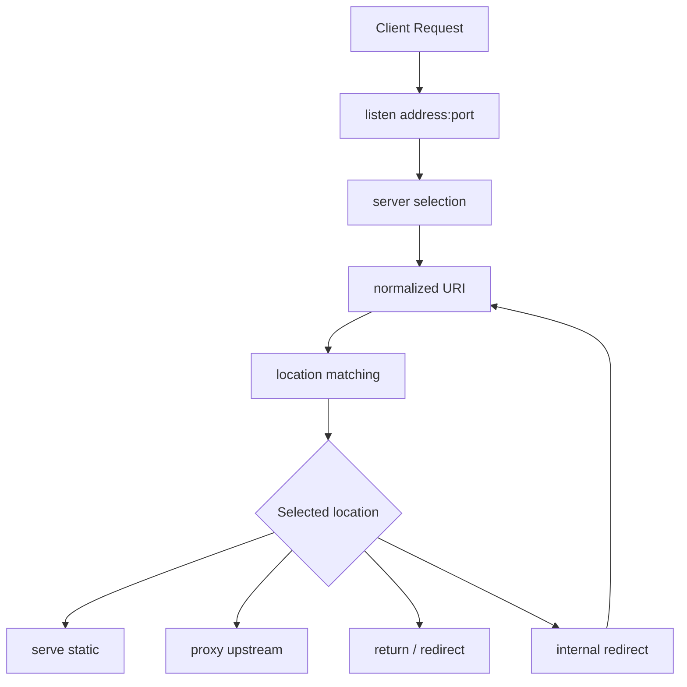
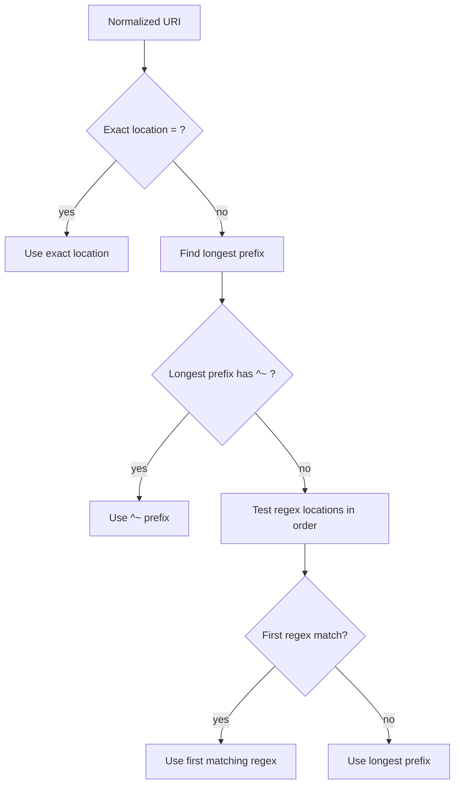

# Part 009 — Location Matching Algorithm

> Target part ini: setelah selesai, kamu bisa membaca blok `location` NGINX seperti membaca routing table. Kamu tahu **blok mana yang akan menang**, kenapa ia menang, apa efek `=`, `^~`, `~`, `~*`, dan `@`, serta bagaimana mencegah bug production seperti salah upstream, static file leakage, regex shadowing, dan SPA fallback yang menelan API request.

Banyak engineer belajar NGINX dari pola ini:

```nginx
location /api/ {
    proxy_pass http://api_backend;
}

location / {
    root /srv/app;
    try_files $uri /index.html;
}
```

Config itu terlihat sederhana. Namun di production, pertanyaan pentingnya bukan “apakah ada `location /api/`?”, melainkan:

```txt
Untuk URI tertentu, location mana yang benar-benar dipilih oleh NGINX?
```

NGINX tidak mengevaluasi `location` seperti router Express, Spring MVC, Laravel, atau Vue Router. Ia punya algoritma spesifik:

1. normalisasi URI;
2. cari prefix location;
3. ingat prefix terpanjang;
4. exact match bisa menghentikan pencarian;
5. `^~` bisa menghentikan regex search;
6. regex location diuji berdasarkan urutan kemunculan;
7. jika regex tidak cocok, gunakan prefix terpanjang;
8. internal redirect dapat menjalankan proses matching ulang.

Kalau mental model ini tidak jelas, konfigurasi NGINX mudah berubah menjadi teka-teki.

---

## 1. Model inti: location adalah classifier

`server` memilih virtual host. `location` mengklasifikasikan URI di dalam virtual host tersebut.



Jadi, `location` bukan sekadar “blok config”. Ia adalah **routing classifier**.

Setiap classifier punya risiko:

| Risiko | Contoh |
|---|---|
| Salah match | `/apiary` ikut masuk `location /api` |
| Regex shadowing | regex generik menang atas prefix yang dimaksud |
| Security bypass | `/private/../public` dinormalisasi tidak seperti yang diasumsikan |
| SPA fallback menelan API | `/api/users` jatuh ke `/index.html` |
| Static leakage | `alias`/`root` dipilih di location yang tidak dimaksud |
| Internal redirect loop | `try_files`/`error_page` mengarah ke URI yang match location sama |

Production NGINX harus dirancang seolah `location` adalah state machine eksplisit.

---

## 2. Bentuk dasar `location`

Bentuk umum:

```nginx
location [modifier] pattern {
    # directives
}
```

Modifier yang paling penting:

| Modifier | Jenis | Makna ringkas |
|---|---|---|
| none | prefix | Cocok jika URI diawali pattern |
| `=` | exact | Cocok hanya jika URI sama persis |
| `^~` | prefix terminal | Prefix match; jika menjadi prefix terpanjang, regex tidak diuji |
| `~` | regex case-sensitive | Cocok berdasarkan regular expression case-sensitive |
| `~*` | regex case-insensitive | Cocok berdasarkan regular expression case-insensitive |
| `@` | named location | Tidak dipilih dari client URI; hanya untuk internal redirect |

Contoh:

```nginx
server {
    listen 80;
    server_name example.com;

    location = /healthz {
        return 204;
    }

    location ^~ /assets/ {
        root /srv/www;
    }

    location ~* \.php$ {
        return 403;
    }

    location / {
        proxy_pass http://app;
    }

    location @fallback {
        proxy_pass http://fallback_app;
    }
}
```

Jangan baca urutan blok di atas seperti urutan `if/else`. Untuk prefix location, urutan tulis bukan prioritas utama. Untuk regex location, urutan tulis penting.

---

## 3. NGINX mencocokkan normalized URI, bukan selalu raw request target

Sebelum location matching, NGINX menggunakan URI yang sudah dinormalisasi.

Konsekuensi praktis:

- encoded character tertentu dapat didecode;
- referensi path seperti `.` dan `..` dapat diselesaikan;
- multiple slash dapat dikompresi jika `merge_slashes on`;
- `$uri` tidak selalu sama dengan `$request_uri`;
- query string bukan bagian dari location matching.

Contoh request:

```txt
GET /api/users?id=123 HTTP/1.1
```

Yang dicocokkan oleh `location` adalah path/URI, bukan query string:

```txt
/api/users
```

Bukan:

```txt
/api/users?id=123
```

Ini penting karena engineer sering mencoba membuat location seperti:

```nginx
# Salah mental model: query string tidak dipakai untuk location matching.
location /search?q=nginx {
    proxy_pass http://search;
}
```

Gunakan variable seperti `$arg_q`, `map`, atau logic upstream untuk query-based routing.

---

## 4. Algoritma resmi dalam bentuk executable mental model

Pseudo-code yang cukup akurat untuk mayoritas konfigurasi HTTP:

```txt
input: normalized_uri

1. cari semua prefix location yang cocok
2. jika ada exact location (=) yang sama persis:
       gunakan exact location dan stop
3. simpan prefix location terpanjang
4. jika prefix terpanjang memakai ^~:
       gunakan prefix tersebut dan stop
5. uji regex location satu per satu sesuai urutan di file config
6. jika ada regex pertama yang cocok:
       gunakan regex tersebut dan stop
7. jika tidak ada regex yang cocok:
       gunakan prefix terpanjang
```

Diagramnya:



Kunci pemahaman:

```txt
prefix chooses by longest string.
regex chooses by first matching regex in config order.
^~ says: if this prefix wins prefix search, do not let regex override it.
= says: if exact match, stop immediately.
```

---

## 5. Exact match: `location = /path`

Exact location hanya cocok jika URI sama persis.

```nginx
location = /healthz {
    access_log off;
    return 204;
}
```

Cocok:

```txt
/healthz
```

Tidak cocok:

```txt
/healthz/
/healthz/check
/healthz?x=1   # path cocok /healthz, query tidak dihitung; jadi ini tetap cocok
```

Catatan terakhir penting: query string tidak ikut matching, jadi request `/healthz?x=1` tetap match exact `/healthz`.

Exact location sangat berguna untuk endpoint yang harus murah dan deterministik:

```nginx
location = /nginx_status {
    stub_status;
    allow 10.0.0.0/8;
    deny all;
}

location = /favicon.ico {
    access_log off;
    log_not_found off;
    root /srv/www/public;
}

location = /robots.txt {
    root /srv/www/public;
}
```

Manfaat exact location:

| Manfaat | Penjelasan |
|---|---|
| Menghindari regex | pencarian bisa berhenti cepat |
| Menghindari fallback | `/healthz` tidak jatuh ke SPA/app |
| Lebih jelas | endpoint critical tidak terseret location generik |
| Security | status/admin endpoint bisa dikunci eksplisit |

Production rule:

```txt
Endpoint operasional seperti /healthz, /readyz, /metrics, /nginx_status sebaiknya exact atau prefix terminal yang sangat eksplisit.
```

---

## 6. Prefix location tanpa modifier

Prefix location cocok jika URI diawali string tertentu.

```nginx
location /api/ {
    proxy_pass http://api;
}

location / {
    proxy_pass http://web;
}
```

Request:

| URI | Prefix yang cocok | Pemenang prefix |
|---|---|---|
| `/` | `/` | `/` |
| `/home` | `/` | `/` |
| `/api/users` | `/`, `/api/` | `/api/` |
| `/api` | `/` | `/` |

Perhatikan `/api` tidak match `/api/` karena tidak ada slash setelah `api`.

Kalau kamu ingin `/api` dan `/api/` masuk API, buat eksplisit:

```nginx
location = /api {
    return 308 /api/;
}

location /api/ {
    proxy_pass http://api;
}
```

Atau:

```nginx
location ~ ^/api/?(?:$|/) {
    proxy_pass http://api;
}
```

Tapi solusi regex biasanya lebih sulit diaudit. Untuk production, exact redirect + prefix slash sering lebih jelas.

---

## 7. Prefix bukan path segment matcher

Ini salah satu footgun paling umum.

```nginx
location /api {
    proxy_pass http://api;
}
```

Akan cocok dengan:

```txt
/api
/api/users
/apiary
/apiv2
/api-malicious
```

Karena itu prefix `/api` bukan berarti segment `/api`.

Jika maksudnya segment API, gunakan:

```nginx
location = /api {
    return 308 /api/;
}

location /api/ {
    proxy_pass http://api;
}
```

Rule sederhana:

```txt
Untuk route berbasis direktori/segment, biasanya gunakan trailing slash: /api/ bukan /api.
```

Namun ini juga harus sinkron dengan `proxy_pass` URI semantics yang akan dibahas detail di Part 031.

---

## 8. Longest prefix wins

Contoh:

```nginx
location / {
    return 200 "root\n";
}

location /api/ {
    return 200 "api\n";
}

location /api/admin/ {
    return 200 "admin\n";
}
```

Request:

| URI | Hasil |
|---|---|
| `/x` | `location /` |
| `/api/users` | `location /api/` |
| `/api/admin/users` | `location /api/admin/` |

Urutan tulis tidak menentukan pemenang prefix. Yang menentukan adalah prefix terpanjang.

Artinya config ini tetap memilih `/api/admin/` untuk `/api/admin/users` walaupun ditulis setelah atau sebelum `/api/`:

```nginx
location /api/ { ... }
location /api/admin/ { ... }
```

Tetapi jangan jadikan ini alasan membuat config acak. Tetap tulis dari spesifik ke generik untuk keterbacaan manusia.

---

## 9. Regex location: `~` dan `~*`

Regex location memakai regular expression.

```nginx
location ~ \.php$ {
    return 403;
}

location ~* \.(png|jpg|jpeg|gif|webp)$ {
    expires 30d;
    root /srv/www;
}
```

Modifier:

| Modifier | Makna |
|---|---|
| `~` | regex case-sensitive |
| `~*` | regex case-insensitive |

Cocok/tidak cocok:

| Location | URI | Cocok? |
|---|---|---|
| `~ \.php$` | `/index.php` | ya |
| `~ \.php$` | `/INDEX.PHP` | tidak |
| `~* \.php$` | `/INDEX.PHP` | ya |

Regex memberi fleksibilitas, tapi menambah biaya mental:

- urutan regex penting;
- regex generik bisa menyalip route bisnis;
- regex yang tidak anchored bisa cocok terlalu luas;
- regex kompleks sulit dibaca saat incident;
- capture bisa memengaruhi variable seperti `$1`, `$2`;
- regex tidak selalu perlu untuk masalah yang bisa diselesaikan prefix.

Rule production:

```txt
Gunakan prefix untuk struktur route utama.
Gunakan regex untuk class of files, extension, atau policy yang benar-benar membutuhkan pattern matching.
```

---

## 10. Regex diuji setelah prefix, tetapi bisa mengalahkan prefix

Contoh:

```nginx
location /api/ {
    return 200 "api-prefix\n";
}

location ~ \.json$ {
    return 200 "json-regex\n";
}
```

Request:

```txt
/api/users.json
```

Alurnya:

1. prefix `/api/` cocok dan disimpan sebagai prefix terpanjang;
2. karena prefix tidak memakai `^~`, NGINX lanjut menguji regex;
3. regex `\.json$` cocok;
4. pemenang akhir adalah regex.

Hasil:

```txt
json-regex
```

Ini sering mengejutkan.

Jika `/api/` harus selalu menang atas regex file extension, gunakan `^~`:

```nginx
location ^~ /api/ {
    proxy_pass http://api;
}

location ~* \.(png|jpg|css|js|json)$ {
    root /srv/assets;
}
```

Sekarang `/api/users.json` masuk API, bukan static/asset regex.

---

## 11. `^~`: prefix terminal, bukan regex negatif

`^~` sering disalahartikan sebagai “regex-ish”. Padahal ia adalah prefix location dengan instruksi tambahan:

```txt
Jika prefix ini menjadi prefix terpanjang, jangan uji regex.
```

Contoh:

```nginx
location ^~ /assets/ {
    root /srv/www;
    expires 30d;
}

location ~* \.php$ {
    return 403;
}
```

Request:

```txt
/assets/index.php
```

Pemenang:

```txt
location ^~ /assets/
```

Ini bisa benar atau salah tergantung tujuan.

Kalau `/assets/index.php` tidak boleh pernah disajikan, jangan gunakan `^~ /assets/` secara membabi buta. Kamu perlu desain policy:

```nginx
location ~* \.php$ {
    return 403;
}

location /assets/ {
    root /srv/www;
    expires 30d;
}
```

Dengan config ini, regex `.php` bisa mengalahkan prefix `/assets/`.

Kesimpulan:

| Tujuan | Pilihan |
|---|---|
| Route API harus tidak ditimpa regex static | `location ^~ /api/` |
| File extension berbahaya harus bisa menimpa prefix | jangan pakai `^~` pada prefix tersebut |
| Static asset path dijamin hanya berisi file aman | `^~` bisa dipakai |
| Tidak yakin | jangan pakai `^~` sampai policy jelas |

`^~` adalah alat untuk **mengunci prioritas prefix**, bukan “best practice universal”.

---

## 12. Regex order matters

Contoh:

```nginx
location ~* \.(jpg|jpeg|png|gif|webp|css|js)$ {
    return 200 "generic-asset\n";
}

location ~* ^/private/.*\.jpg$ {
    return 403;
}
```

Request:

```txt
/private/id-card.jpg
```

Regex pertama cocok, maka regex kedua tidak diuji.

Hasil:

```txt
generic-asset
```

Itu bug security.

Urutan yang lebih aman:

```nginx
location ~* ^/private/.*\.(jpg|jpeg|png|gif|webp|css|js)$ {
    return 403;
}

location ~* \.(jpg|jpeg|png|gif|webp|css|js)$ {
    root /srv/www;
    expires 30d;
}
```

Rule:

```txt
Regex location harus ditulis dari policy paling spesifik/deny menuju policy generik/allow.
```

Tetapi lebih baik lagi: jangan biarkan private content berada di root static yang sama dengan public content.

---

## 13. Anchoring regex: jangan biarkan pattern bocor

Regex ini terlalu longgar:

```nginx
location ~ admin {
    return 403;
}
```

Ia cocok dengan:

```txt
/admin
/user/admin-panel
/assets/admin-icon.png
/notadmin
```

Regex yang lebih jelas:

```nginx
location ~ ^/admin(?:/|$) {
    return 403;
}
```

Makna:

```txt
URI harus diawali /admin, lalu setelah itu slash atau akhir string.
```

Untuk extension:

```nginx
location ~* \.(?:css|js|png|jpg|jpeg|gif|webp|svg)$ {
    root /srv/www;
    expires 30d;
}
```

Gunakan anchor `$` untuk extension agar `/file.jpg/evil` tidak dianggap sama dengan `/file.jpg`.

---

## 14. Named location: `location @name`

Named location tidak dipilih langsung dari URI client.

```nginx
location / {
    try_files $uri @app;
}

location @app {
    proxy_pass http://app;
}
```

Client tidak bisa request:

```txt
GET /@app HTTP/1.1
```

lalu berharap masuk `location @app`. Named location adalah target internal untuk directive seperti:

- `try_files`;
- `error_page`;
- beberapa internal redirect flow.

Named location berguna untuk memisahkan flow:

```nginx
location / {
    try_files $uri $uri/ @backend;
}

location @backend {
    proxy_set_header Host $host;
    proxy_set_header X-Request-Id $request_id;
    proxy_pass http://app;
}
```

Manfaatnya:

| Tanpa named location | Dengan named location |
|---|---|
| fallback bercampur dengan static logic | fallback punya blok jelas |
| directive proxy tersebar | proxy policy terkonsolidasi |
| sulit debugging internal redirect | flow eksplisit |

---

## 15. Internal redirect dapat menjalankan location matching ulang

Beberapa directive tidak sekadar “mengembalikan response”. Mereka bisa mengubah URI internal dan membuat NGINX menjalankan location matching lagi.

Contoh `try_files`:

```nginx
location / {
    root /srv/spa;
    try_files $uri $uri/ /index.html;
}

location = /index.html {
    root /srv/spa;
    add_header Cache-Control "no-store";
}
```

Jika request `/dashboard` tidak menemukan file, NGINX internal redirect ke `/index.html`, lalu location matching ulang dapat memilih `location = /index.html`.

Contoh `error_page`:

```nginx
location /api/ {
    proxy_pass http://api;
    error_page 502 503 504 = @api_fallback;
}

location @api_fallback {
    return 503 '{"error":"service_unavailable"}';
}
```

Internal redirect membuat config lebih kuat, tetapi juga bisa membuat loop jika tidak hati-hati.

Loop pattern:

```nginx
location / {
    try_files $uri /index.html;
}

location = /index.html {
    try_files $uri /index.html;
}
```

Jika `/index.html` tidak ada, fallback ke dirinya sendiri.

Rule:

```txt
Setiap internal redirect harus punya terminal behavior yang jelas: serve file, proxy, return, atau named location yang tidak memantul balik tanpa kondisi baru.
```

---

## 16. Case sensitivity: prefix vs regex

Regex jelas:

```nginx
location ~  \.jpg$ { ... }  # case-sensitive
location ~* \.jpg$ { ... }  # case-insensitive
```

Prefix matching umumnya diperlakukan sebagai string prefix matching terhadap normalized URI. Di platform tertentu dengan filesystem case-insensitive, perilaku static file lookup bisa menambah kebingungan, tetapi jangan desain routing production yang bergantung pada perbedaan OS.

Prinsip production:

```txt
Normalisasi canonical URL di edge.
Jangan biarkan /API, /Api, /api punya makna bisnis berbeda kecuali benar-benar disengaja.
```

Contoh canonicalization:

```nginx
location ~ ^/API(?:/|$) {
    return 308 /api/;
}
```

Namun canonicalization berbasis regex harus dipakai hati-hati agar tidak merusak path case-sensitive untuk object key atau asset.

---

## 17. Pattern production: API + SPA + static assets

Kasus umum: satu host melayani SPA dan API.

Desain yang aman:

```nginx
server {
    listen 443 ssl http2;
    server_name app.example.com;

    # Operational endpoints: exact and cheap.
    location = /healthz {
        access_log off;
        return 204;
    }

    # API route: terminal prefix; do not let asset regex steal /api/*.json.
    location ^~ /api/ {
        proxy_set_header Host $host;
        proxy_set_header X-Request-Id $request_id;
        proxy_set_header X-Forwarded-For $proxy_add_x_forwarded_for;
        proxy_set_header X-Forwarded-Proto $scheme;
        proxy_pass http://api_backend;
    }

    # Static immutable assets.
    location ^~ /assets/ {
        root /srv/spa;
        try_files $uri =404;
        expires 1y;
        add_header Cache-Control "public, immutable";
    }

    # Block accidental source/config leakage.
    location ~* /(?:\.git|\.env|package-lock\.json|pnpm-lock\.yaml|yarn\.lock|composer\.json)$ {
        return 404;
    }

    # SPA shell.
    location / {
        root /srv/spa;
        try_files $uri $uri/ /index.html;
    }
}
```

Kenapa seperti ini?

| Blok | Alasan |
|---|---|
| `= /healthz` | tidak masuk SPA/backend |
| `^~ /api/` | API tidak ditimpa regex asset |
| `^~ /assets/` | immutable assets cepat dan predictable |
| deny regex | security policy untuk file sensitif |
| `/` | fallback terakhir |

Potensi masalah: deny regex untuk dotfiles tidak akan menimpa `^~ /assets/`. Jika `/assets/.env` mungkin ada, maka jangan gunakan `^~ /assets/`, atau tambahkan deny lebih spesifik sebelum desain static path. Lebih baik: pastikan build artifact tidak pernah mengandung file sensitif.

---

## 18. Pattern production: multi-backend path router

Contoh service gateway ringan:

```nginx
upstream users_api { server users:8080; }
upstream orders_api { server orders:8080; }
upstream billing_api { server billing:8080; }

server {
    listen 443 ssl http2;
    server_name api.example.com;

    location = /healthz {
        return 204;
    }

    location ^~ /v1/users/ {
        proxy_pass http://users_api;
    }

    location ^~ /v1/orders/ {
        proxy_pass http://orders_api;
    }

    location ^~ /v1/billing/ {
        proxy_pass http://billing_api;
    }

    location / {
        return 404;
    }
}
```

Kenapa tidak pakai regex besar?

```nginx
# Lebih sulit diaudit.
location ~ ^/v1/(users|orders|billing)/(.*)$ {
    proxy_pass http://$1_api;
}
```

Masalahnya:

- upstream name dengan variable punya konsekuensi resolver/runtime berbeda;
- validasi path makin rumit;
- typo bisa menjadi runtime error;
- observability per service lebih kabur;
- security review lebih sulit.

Untuk edge production, eksplisit sering lebih baik daripada “pintar”.

---

## 19. Pattern production: extension policy

Misalnya ingin memblok eksekusi PHP dan file source di static host:

```nginx
server {
    listen 443 ssl http2;
    server_name static.example.com;
    root /srv/static;

    # Deny sensitive files first among regex locations.
    location ~* (?:^|/)\.(?:git|svn|hg)(?:/|$) {
        return 404;
    }

    location ~* \.(?:php|phar|phtml|cgi|pl|py|rb)$ {
        return 404;
    }

    location ~* \.(?:css|js|png|jpg|jpeg|gif|webp|svg|ico|woff2?)$ {
        try_files $uri =404;
        expires 30d;
        add_header Cache-Control "public";
    }

    location / {
        try_files $uri =404;
    }
}
```

Di sini regex deny ditulis sebelum regex allow.

Namun desain paling aman tetap:

```txt
Serve hanya build artifact dari directory output, bukan repository root.
```

NGINX policy adalah lapisan pertahanan, bukan pengganti hygiene deployment.

---

## 20. `location /` sebagai fallback wajib

Hampir semua server block production sebaiknya punya fallback eksplisit:

```nginx
location / {
    return 404;
}
```

Atau:

```nginx
location / {
    proxy_pass http://app;
}
```

Atau:

```nginx
location / {
    root /srv/spa;
    try_files $uri $uri/ /index.html;
}
```

Jangan biarkan fallback terjadi karena kebetulan ada default behavior dari module/directive lain. `location /` membuat intensi jelas:

```txt
Semua URI yang tidak diklasifikasikan secara spesifik akan masuk ke sini.
```

Untuk API host, fallback biasanya `404` atau `444`, bukan proxy ke aplikasi utama.

```nginx
server {
    server_name api.example.com;

    location ^~ /v1/ {
        proxy_pass http://api_v1;
    }

    location / {
        return 404;
    }
}
```

Kenapa?

- unknown path tidak membebani upstream;
- scanning noise berhenti di edge;
- log lebih jelas;
- API contract lebih ketat.

---

## 21. Anti-pattern: satu regex untuk semua routing

Config seperti ini terlihat ringkas:

```nginx
location ~ ^/(api|admin|assets|uploads)/(.*)$ {
    proxy_pass http://app;
}
```

Tapi biasanya buruk untuk platform besar:

| Masalah | Dampak |
|---|---|
| Satu blok terlalu banyak tanggung jawab | policy API/static/admin bercampur |
| Regex harus dipahami semua engineer | review sulit |
| Observability lemah | semua masuk location sama |
| Sulit memberi timeout berbeda | API upload vs admin vs static butuh behavior berbeda |
| Sulit hardening | deny/allow path saling tumpang tindih |

Lebih baik:

```nginx
location ^~ /api/ { ... }
location ^~ /admin/ { ... }
location ^~ /assets/ { ... }
location ^~ /uploads/ { ... }
location / { return 404; }
```

Routing table yang verbose tetapi eksplisit lebih mudah dioperasikan daripada regex pintar yang tidak ada yang berani ubah.

---

## 22. Anti-pattern: SPA fallback terlalu rakus

Config umum:

```nginx
location / {
    root /srv/spa;
    try_files $uri /index.html;
}
```

Jika API route tidak didefinisikan dengan benar, request ini:

```txt
/api/users
```

bisa dibalas HTML shell SPA, bukan 404/API error.

Dampaknya:

- frontend mendapat HTML saat mengharapkan JSON;
- monitoring melihat status 200 padahal API route rusak;
- cache/CDN bisa menyimpan response yang salah;
- incident terlihat seperti bug frontend.

Desain lebih aman:

```nginx
location ^~ /api/ {
    proxy_pass http://api;
}

location = /api {
    return 308 /api/;
}

location / {
    root /srv/spa;
    try_files $uri $uri/ /index.html;
}
```

Untuk API-only host:

```nginx
location / {
    return 404;
}
```

---

## 23. Anti-pattern: `alias` di regex location tanpa disiplin

`alias` akan dibahas detail di Part 017, tetapi location matching sudah berperan besar.

Contoh berisiko:

```nginx
location ~ ^/files/(.*)$ {
    alias /data/uploads/$1;
}
```

Masalah:

- regex capture perlu benar;
- path normalization harus dipahami;
- karakter aneh/encoded bisa mengejutkan;
- access control path sering bocor.

Lebih aman jika struktur memungkinkan:

```nginx
location /files/ {
    alias /data/uploads/;
    try_files $uri =404;
}
```

Dan jangan gabungkan upload private/public dalam satu namespace tanpa policy eksplisit.

---

## 24. Debugging location: buat NGINX memberi tahu pemenangnya

Saat ragu, jangan menebak. Tambahkan temporary header di environment non-production:

```nginx
location = /healthz {
    add_header X-Debug-Location "exact-healthz" always;
    return 204;
}

location ^~ /api/ {
    add_header X-Debug-Location "api-prefix" always;
    proxy_pass http://api;
}

location ~* \.json$ {
    add_header X-Debug-Location "json-regex" always;
    return 200 "json\n";
}

location / {
    add_header X-Debug-Location "root-prefix" always;
    return 200 "root\n";
}
```

Test:

```bash
curl -i https://example.test/api/users.json
```

Atau gunakan custom access log:

```nginx
log_format route_debug escape=json
  '{'
  '"time":"$time_iso8601",'
  '"host":"$host",'
  '"uri":"$uri",'
  '"request_uri":"$request_uri",'
  '"status":$status,'
  '"upstream":"$upstream_addr"'
  '}';

access_log /var/log/nginx/route_debug.log route_debug;
```

NGINX tidak punya built-in `$location_name` universal. Karena itu, header/log marker manual kadang berguna saat menguji routing table.

---

## 25. Testing matrix untuk location matching

Untuk setiap server block production, buat matrix URI.

Contoh:

| URI | Expected location | Expected status/upstream |
|---|---|---|
| `/` | SPA/root | 200 `/index.html` |
| `/healthz` | exact healthz | 204 |
| `/api` | exact API redirect | 308 `/api/` |
| `/api/` | API prefix | upstream api |
| `/api/users.json` | API prefix | upstream api |
| `/assets/app.js` | assets prefix | 200 static |
| `/assets/.env` | blocked or 404 | 404 |
| `/foo.php` | deny regex | 404/403 |
| `/unknown` | SPA or 404 | sesuai contract |

Automasi sederhana:

```bash
#!/usr/bin/env bash
set -euo pipefail

base="https://app.example.test"

check() {
  local path="$1"
  local expected="$2"
  local got
  got=$(curl -sk -o /dev/null -w "%{http_code}" "$base$path")
  if [ "$got" != "$expected" ]; then
    echo "FAIL $path expected=$expected got=$got"
    exit 1
  fi
  echo "OK $path $got"
}

check /healthz 204
check /api 308
check /api/users 200
check /assets/app.js 200
check /foo.php 404
```

Routing adalah contract. Contract harus dites.

---

## 26. Decision matrix

| Kebutuhan | Gunakan | Hindari |
|---|---|---|
| Endpoint exact seperti `/healthz` | `location = /healthz` | prefix generik |
| Route berbasis path segment | `location /api/` + exact `/api` redirect | `location /api` tanpa slash |
| Prefix harus tidak ditimpa regex | `location ^~ /api/` | regex extension global yang bisa menang |
| Deny file extension berbahaya | regex deny awal | `^~` pada prefix yang harus tetap bisa dideny |
| Static immutable directory | `^~ /assets/` jika artifact aman | serving dari repo root |
| SPA fallback | `location /` dengan `try_files` | fallback sebelum API route |
| Internal fallback | named location `@app` | rewrite chain tidak jelas |
| Complex business routing | upstream/app router atau explicit prefix | regex besar penuh capture |

---

## 27. Checklist production

```txt
[ ] Setiap server block punya `location /` fallback eksplisit.
[ ] Endpoint operasional memakai exact match jika memungkinkan.
[ ] Path segment route memakai trailing slash atau exact redirect.
[ ] Tidak ada `location /api` jika maksudnya hanya segment `/api`.
[ ] Regex location diurutkan dari deny/spesifik ke allow/generik.
[ ] Regex penting memakai anchor `^`, `$`, atau boundary yang jelas.
[ ] `^~` hanya dipakai jika regex memang tidak boleh mengalahkan prefix tersebut.
[ ] SPA fallback tidak menelan API route.
[ ] Static root tidak menunjuk repository root.
[ ] Internal redirect punya terminal behavior dan tidak loop.
[ ] Named location dipakai untuk fallback internal yang kompleks.
[ ] Routing matrix diuji dengan curl/CI.
[ ] Debug header/log dapat diaktifkan sementara untuk membuktikan location pemenang.
```

---

## 28. Mental model akhir

Simpan ini:

```txt
location matching is not top-to-bottom routing.
Prefix locations compete by longest prefix.
Regex locations compete by first match after prefix search.
Exact match stops everything.
^~ protects a winning prefix from regex override.
Named locations are internal targets, not client-facing routes.
```

Kalau ada request masuk ke upstream yang salah, debug dengan urutan:

```txt
server selection -> normalized URI -> exact? -> longest prefix -> ^~? -> regex order -> fallback -> internal redirect
```

Part berikutnya membahas variables, `map`, `geo`, dan timing evaluasi. Ini penting karena setelah kamu tahu location mana yang menang, pertanyaan berikutnya adalah: nilai variable apa yang dipakai saat directive di dalam location itu berjalan?

---

## References

- NGINX `ngx_http_core_module` official documentation: https://nginx.org/en/docs/http/ngx_http_core_module.html
- NGINX request processing official documentation: https://nginx.org/en/docs/http/request_processing.html
- NGINX beginner's guide: https://nginx.org/en/docs/beginners_guide.html
