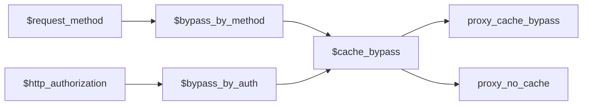
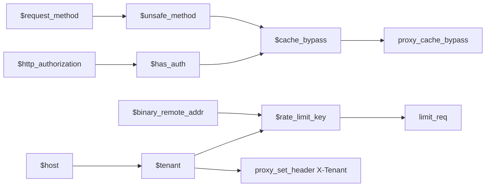

# Part 010 — Variables, `map`, `geo`, and Evaluation Timing

> Target part ini: setelah selesai, kamu memahami bahwa variable NGINX bukan local variable seperti JavaScript/Java/Go. Variable adalah **request-scoped computed value** yang disediakan module, dibuat saat konfigurasi diparse, dan sering dievaluasi saat digunakan. Kamu juga bisa memakai `map` dan `geo` sebagai decision table production-grade tanpa jatuh ke config imperative yang rapuh.

Banyak konfigurasi NGINX rusak karena engineer membawa mental model bahasa pemrograman umum:

```nginx
set $backend "app_a";
if ($http_x_canary = "1") {
    set $backend "app_b";
}
proxy_pass http://$backend;
```

Kadang berjalan. Kadang menjadi sumber bug tersembunyi.

NGINX bukan runtime imperative request handler seperti Express middleware. Konfigurasi NGINX adalah declarative module configuration. Variable adalah mekanisme agar directive dapat memakai nilai request-time seperti host, URI, header, remote address, upstream result, atau decision table.

Mental model yang benar:

```txt
Directive defines behavior.
Variable supplies request-specific values to that behavior.
map/geo defines lookup tables that produce variables.
Evaluation happens when a module/directive needs the value, not because the file is read top-to-bottom like code.
```

---

## 1. Kenapa variable penting di NGINX production?

Variable dipakai untuk:

| Kebutuhan | Variable terkait |
|---|---|
| Routing | `$host`, `$uri`, `$request_uri`, `$arg_*`, `$http_*` |
| Proxy header | `$proxy_add_x_forwarded_for`, `$scheme`, `$request_id` |
| Logging | `$status`, `$request_time`, `$upstream_response_time` |
| Cache | `$scheme`, `$host`, `$request_uri`, `$cookie_*`, `$arg_*` |
| Rate limit key | `$binary_remote_addr`, `$server_name`, `$http_authorization` |
| Access policy | `$remote_addr`, variable dari `geo`, variable dari `map` |
| Canary | `$cookie_*`, `$http_*`, variable dari `split_clients`/`map` |
| Multi-tenant | `$host`, capture dari `server_name`, `map` host → tenant |

Tetapi variable juga bisa merusak sistem:

| Salah pakai | Dampak |
|---|---|
| `$http_host` dipercaya mentah | host header injection / cache poisoning |
| `$remote_addr` dipakai di belakang LB tanpa realip | rate limit salah client |
| `$request_uri` dipakai untuk filesystem path | encoded/query behavior mengejutkan |
| variable dalam `proxy_pass` tanpa resolver strategy | runtime DNS/upstream issue |
| regex capture dipakai lintas blok | nilai capture berubah/tidak jelas |
| `if + set` dianggap seperti program biasa | phase behavior sulit diprediksi |

Variable adalah alat tajam. Pakai sebagai data flow, bukan imperative script.

---

## 2. Tiga waktu yang harus dibedakan

Dalam NGINX, ada tiga waktu penting:

```txt
1. Parse time       : ketika nginx membaca config.
2. Reload time      : ketika config baru divalidasi dan worker baru dibuat.
3. Request time     : ketika request tertentu diproses worker.
```

Contoh:

```nginx
map $http_upgrade $connection_upgrade {
    default upgrade;
    ''      close;
}

server {
    location /ws/ {
        proxy_set_header Upgrade $http_upgrade;
        proxy_set_header Connection $connection_upgrade;
        proxy_pass http://websocket_backend;
    }
}
```

Yang terjadi:

| Waktu | Apa yang terjadi |
|---|---|
| Parse/reload | NGINX membaca definisi `map` dan mendaftarkan variable `$connection_upgrade` |
| Request time | Untuk setiap request, saat `$connection_upgrade` dibutuhkan, nilainya dihitung dari `$http_upgrade` |

`map` bukan loop yang dieksekusi saat config dibaca. Ia adalah lookup table yang menghasilkan variable.

---

## 3. Jenis variable di NGINX

Tidak semua variable berasal dari tempat yang sama.

| Jenis | Contoh | Sumber nilai |
|---|---|---|
| Core request | `$uri`, `$request_uri`, `$args`, `$is_args` | core HTTP request parser |
| Header input | `$http_user_agent`, `$http_authorization`, `$http_x_request_id` | request header client |
| Cookie | `$cookie_session`, `$cookie_ab_test` | Cookie header |
| Query arg | `$arg_page`, `$arg_sort` | query string |
| Connection/client | `$remote_addr`, `$binary_remote_addr`, `$connection` | connection metadata |
| Server | `$server_name`, `$server_port`, `$scheme` | selected server/request context |
| Upstream | `$upstream_addr`, `$upstream_status`, `$upstream_response_time` | proxy/upstream module result |
| Generated | `$request_id`, variable dari `map`, `geo`, `set` | module-generated |
| Regex capture | `$1`, `$2`, named capture | regex match dari server/location/rewrite/map |

Production lesson:

```txt
Variable name alone does not tell you whether the value is trustworthy.
You must know who supplied it, when it is evaluated, and whether it was normalized.
```

---

## 4. `$uri` vs `$request_uri`

Ini salah satu perbedaan paling penting.

| Variable | Makna praktis |
|---|---|
| `$request_uri` | original request URI lengkap dengan query string, relatif mentah |
| `$uri` | normalized current URI yang dipakai NGINX untuk processing internal |

Contoh request:

```txt
GET /a/../b/%63?id=1 HTTP/1.1
```

Secara mental:

```txt
$request_uri  ≈ /a/../b/%63?id=1
$uri          ≈ /b/c
$args         ≈ id=1
```

Gunakan sesuai tujuan:

| Tujuan | Pilihan umum |
|---|---|
| Cache key yang membedakan query | `$scheme$host$request_uri` |
| Filesystem/static lookup | `$uri` melalui `try_files`, bukan concat mentah |
| Redirect preserving query | `$request_uri` atau `$uri$is_args$args` sesuai kebutuhan |
| Logging raw request target | `$request_uri` |
| Routing path normalized | `$uri`/location |

Anti-pattern:

```nginx
# Jangan bangun filesystem path dari request_uri mentah.
try_files $request_uri =404;
```

`$request_uri` membawa query string dan encoding yang tidak cocok untuk filesystem lookup.

---

## 5. `$host` vs `$http_host` vs `$server_name`

Ketiganya sering tertukar.

| Variable | Mental model |
|---|---|
| `$http_host` | isi header `Host` mentah dari client |
| `$host` | host yang dinormalisasi/ditentukan NGINX dari request line/Host/server name |
| `$server_name` | nama server block yang memproses request |

Implikasi:

```nginx
proxy_set_header Host $host;
```

biasanya lebih aman daripada:

```nginx
proxy_set_header Host $http_host;
```

Karena `$http_host` berasal langsung dari client header. Untuk beberapa kasus, kamu memang perlu preserve Host asli, tetapi itu keputusan trust-boundary, bukan default membabi buta.

Untuk cache key:

```nginx
proxy_cache_key "$scheme$host$request_uri";
```

lebih aman daripada cache key yang memakai header mentah tanpa validasi.

Namun `$host` juga bukan pengganti validasi tenant. Kalau multi-tenant, buat allowlist eksplisit:

```nginx
map $host $tenant_id {
    default "";
    app-a.example.com app_a;
    app-b.example.com app_b;
}

server {
    if ($tenant_id = "") { return 444; }
    proxy_set_header X-Tenant-Id $tenant_id;
    proxy_pass http://tenant_router;
}
```

Catatan: penggunaan `if` untuk `return` termasuk pola yang umum dan relatif aman. Jangan gunakan `if` sebagai bahasa pemrograman penuh di dalam location.

---

## 6. Header variables: `$http_*`

NGINX mengekspos request header sebagai variable dengan pola:

```txt
Header: X-Request-Id
Variable: $http_x_request_id
```

Contoh:

```nginx
proxy_set_header X-Request-Id $http_x_request_id;
```

Tapi ada masalah: client bisa memalsukan header.

Pattern yang lebih defensif:

```nginx
map $http_x_request_id $req_id {
    default $http_x_request_id;
    ""      $request_id;
}

proxy_set_header X-Request-Id $req_id;
```

Ini menerima request id dari caller jika ada, tetapi membuat id baru jika kosong.

Untuk boundary public, sering lebih aman membuat header internal baru:

```nginx
proxy_set_header X-Request-Id $request_id;
proxy_set_header X-External-Request-Id $http_x_request_id;
```

Jangan pernah menganggap `$http_*` sebagai nilai terpercaya hanya karena sudah menjadi variable.

---

## 7. `map`: decision table request-time

`map` membuat variable baru berdasarkan nilai satu atau lebih source expression.

Bentuk dasar:

```nginx
map $source $target {
    default value_default;
    key1    value1;
    key2    value2;
}
```

Contoh:

```nginx
map $http_upgrade $connection_upgrade {
    default upgrade;
    ""      close;
}
```

Jika header `Upgrade` ada:

```txt
$connection_upgrade = upgrade
```

Jika kosong:

```txt
$connection_upgrade = close
```

Penting:

```txt
map didefinisikan di context http.
map menghasilkan variable.
variable map dievaluasi ketika digunakan.
Deklarasi banyak map tidak otomatis menambah biaya request jika variablenya tidak dipakai.
```

Ini menjadikan `map` sangat cocok untuk menggantikan banyak `if`.

---

## 8. `map` sebagai pengganti branching imperative

Daripada:

```nginx
set $cache_bypass 0;

if ($request_method = POST) {
    set $cache_bypass 1;
}

if ($http_authorization != "") {
    set $cache_bypass 1;
}
```

Lebih jelas:

```nginx
map $request_method $bypass_by_method {
    default 0;
    POST    1;
    PUT     1;
    PATCH   1;
    DELETE  1;
}

map $http_authorization $bypass_by_auth {
    default 1;
    ""      0;
}

map "$bypass_by_method:$bypass_by_auth" $cache_bypass {
    default 1;
    "0:0"   0;
}
```

Lalu:

```nginx
proxy_cache_bypass $cache_bypass;
proxy_no_cache     $cache_bypass;
```

Ini adalah data-flow style:



Keunggulan:

- rule terlihat sebagai table;
- mudah dites;
- tidak tergantung urutan imperative `set`;
- bisa direview oleh platform/security;
- mudah dilog.

---

## 9. Prioritas matching di `map`

`map` bukan sekadar dictionary. Ia mendukung beberapa jenis key.

Contoh:

```nginx
map $host $tenant {
    hostnames;

    default             "";
    example.com         main;
    api.example.com     api;
    *.internal.example.com internal;
    ~^(.+)\.customer\.example\.com$ customer_$1;
}
```

Secara praktis, prioritas matching perlu dipahami:

1. string exact tanpa mask;
2. longest prefix mask jika `hostnames`/mask dipakai;
3. longest suffix mask;
4. regex pertama yang cocok sesuai urutan;
5. `default`;
6. jika `default` tidak ada, nilai default adalah empty string.

Rule production:

```txt
Letakkan exact key untuk domain penting.
Letakkan regex hanya setelah exact/wildcard yang lebih jelas.
Jangan biarkan default diam-diam mengarah ke tenant valid.
```

Default aman:

```nginx
map $host $tenant {
    hostnames;
    default "";
    app-a.example.com app_a;
    app-b.example.com app_b;
}

server {
    if ($tenant = "") { return 444; }
    proxy_set_header X-Tenant $tenant;
    proxy_pass http://tenant_router;
}
```

Default berbahaya:

```nginx
map $host $tenant {
    default app_a;
    app-b.example.com app_b;
}
```

Dengan config itu, unknown host masuk tenant `app_a`.

---

## 10. Regex capture dalam `map`

`map` bisa memakai regex dan capture:

```nginx
map $host $customer_slug {
    default "";
    ~^(?<slug>[a-z0-9-]+)\.customer\.example\.com$ $slug;
}
```

Lalu:

```nginx
proxy_set_header X-Customer-Slug $customer_slug;
```

Ini berguna, tetapi harus dibatasi:

```nginx
~^(?<slug>[a-z0-9][a-z0-9-]{0,62})\.customer\.example\.com$ $slug;
```

Jangan pakai regex terlalu longgar:

```nginx
~^(.+)\.customer\.example\.com$ $1;
```

Karena kamu membuka ruang karakter yang mungkin tidak valid sebagai tenant id internal.

Production rule:

```txt
Regex map yang menghasilkan identifier internal harus sekaligus melakukan validation.
```

---

## 11. `map` dan nilai kosong

Nilai kosong sangat penting di NGINX.

Contoh:

```nginx
map $http_authorization $has_auth {
    default 1;
    ""      0;
}
```

Jika header tidak ada, variable `$http_authorization` kosong, bukan `null` seperti bahasa pemrograman.

Gunakan empty string secara eksplisit:

```nginx
"" 0;
```

Jangan tulis:

```nginx
null 0;
```

Kecuali memang ingin mencocokkan literal string `null`.

---

## 12. `map` multi-source

Modern NGINX mendukung source expression yang bisa terdiri dari beberapa variable/string.

Contoh decision table:

```nginx
map "$request_method:$http_authorization" $cache_policy {
    default bypass;
    "GET:"  cache;
    "HEAD:" cache;
}
```

Makna:

| Method | Authorization | Policy |
|---|---|---|
| GET | kosong | cache |
| HEAD | kosong | cache |
| GET | ada | bypass |
| POST | kosong/ada | bypass |

Untuk rule yang makin banyak, pisahkan menjadi beberapa map kecil lalu gabungkan. Ini lebih mudah dipahami daripada satu map raksasa.

---

## 13. `volatile`: ketika hasil map tidak boleh dicache dalam request

NGINX dapat menyimpan hasil variable tertentu selama request agar tidak dihitung berulang. Untuk `map`, directive `volatile` dapat menandai variable sebagai tidak cacheable.

Kapan relevan?

- source variable bisa berubah selama request karena rewrite/internal redirect;
- kamu sengaja ingin map mengikuti nilai terbaru;
- kamu tahu directive yang memakai variable berjalan setelah perubahan tersebut.

Contoh konseptual:

```nginx
map $uri $route_class {
    volatile;
    default other;
    ~^/api/ api;
}
```

Jangan gunakan `volatile` sebagai default. Ia adalah alat spesifik untuk kasus ketika timing evaluasi benar-benar dipahami.

Rule:

```txt
Default: map biasa.
Gunakan volatile hanya jika kamu dapat menjelaskan variable mana yang berubah, kapan berubah, dan directive mana yang membaca hasilnya.
```

---

## 14. `geo`: decision table berbasis IP

`geo` membuat variable berdasarkan IP address.

Bentuk dasar:

```nginx
geo $client_region {
    default ZZ;
    10.0.0.0/8 PRIVATE;
    192.168.0.0/16 PRIVATE;
    203.0.113.0/24 ID_TEST;
}
```

Secara default, address diambil dari `$remote_addr`. Kamu juga bisa menyediakan source address variable:

```nginx
geo $arg_remote_addr $geo_from_arg {
    default 0;
    203.0.113.0/24 1;
}
```

Tetapi untuk production, jarang sekali aman memakai IP dari query arg. Biasanya source-nya adalah `$remote_addr` setelah real IP chain dikonfigurasi dengan benar.

---

## 15. `geo` dan real client IP

Di belakang load balancer, `$remote_addr` mungkin IP load balancer, bukan client.

```txt
Client -> CDN/LB -> NGINX
                 remote_addr = IP CDN/LB
```

Jika kamu membuat rate limit/geofence dari `$remote_addr` tanpa realip, semua client terlihat sebagai beberapa IP proxy.

Pattern:

```nginx
set_real_ip_from 10.0.0.0/8;
real_ip_header X-Forwarded-For;
real_ip_recursive on;

geo $trusted_network {
    default 0;
    10.0.0.0/8 1;
    192.168.0.0/16 1;
}
```

Detail real IP akan dibahas lebih dalam di Part 032. Untuk part ini, pegang invariant:

```txt
geo is only as correct as the source IP variable it reads.
```

Kalau source IP salah, semua policy berbasis `geo` salah.

---

## 16. Menggabungkan `geo` dan `map`

Contoh: allow admin hanya dari private network dan path admin.

```nginx
geo $is_private_network {
    default 0;
    10.0.0.0/8 1;
    172.16.0.0/12 1;
    192.168.0.0/16 1;
}

map "$is_private_network:$uri" $admin_policy {
    default deny;
    ~^1:/admin(?:/|$) allow;
}

server {
    location /admin/ {
        if ($admin_policy = deny) { return 403; }
        proxy_pass http://admin_app;
    }
}
```

Ini bukan satu-satunya cara. Untuk access control sederhana, `allow`/`deny` mungkin lebih tepat. Tetapi kombinasi `geo + map` berguna ketika policy bergantung pada beberapa dimensi:

- IP range;
- host;
- URI;
- method;
- header;
- environment;
- tenant.

Rule:

```txt
geo classifies network.
map combines classifications into policy.
directive enforces policy.
```

---

## 17. Variable dalam directive: tidak semua directive sama

Beberapa directive menerima variable, beberapa tidak, dan beberapa menerima variable tetapi mengubah semantik.

Contoh umum yang menerima variable:

```nginx
proxy_set_header X-Request-Id $request_id;
add_header X-Cache-Status $upstream_cache_status always;
proxy_cache_key "$scheme$host$request_uri";
access_log /var/log/nginx/access.log main if=$loggable;
```

Contoh yang perlu hati-hati:

```nginx
proxy_pass http://$backend;
```

Variable dalam `proxy_pass` dapat mengubah cara NGINX melakukan resolving dan memilih upstream. Ini akan dibahas mendalam di Part 031 dan Part 041. Untuk sekarang, rule-nya:

```txt
Variable in a directive is not just string interpolation.
It may change module behavior.
```

Selalu cek dokumentasi directive sebelum memasukkan variable.

---

## 18. `set`: kapan boleh, kapan jangan

`set` berasal dari rewrite module dan membuat/menetapkan variable.

Contoh sederhana:

```nginx
set $app_env production;
proxy_set_header X-App-Env $app_env;
```

Ini tidak masalah, tetapi sering tidak perlu.

Yang berisiko adalah menggunakan `set` + banyak `if` sebagai program:

```nginx
set $route app;

if ($http_x_admin = 1) {
    set $route admin;
}

if ($arg_debug = 1) {
    set $route debug;
}

proxy_pass http://$route;
```

Masalah:

- urutan dan phase rewrite harus dipahami;
- branch makin sulit diuji;
- variable upstream punya konsekuensi resolver;
- default bisa salah saat condition tidak terpenuhi;
- future maintainer membaca ini seperti kode imperative padahal bukan.

Lebih baik gunakan `map`:

```nginx
map "$http_x_admin:$arg_debug" $route {
    default app;
    "1:"   admin;
    ":1"   debug;
}
```

Lalu enforce dengan explicit upstream jika memungkinkan.

---

## 19. Tentang `if` di NGINX

Kalimat populer “if is evil” sering terlalu disederhanakan. Yang lebih akurat:

```txt
`if` di context location bukan general-purpose control flow.
Gunakan untuk hal sederhana seperti `return`/`rewrite` yang dipahami efeknya.
Untuk decision table, gunakan `map`.
```

Relatif aman:

```nginx
if ($host = "") { return 444; }
if ($request_method !~ ^(GET|HEAD|POST)$) { return 405; }
```

Lebih rapuh:

```nginx
if ($condition) {
    proxy_pass http://a;
}
```

Banyak directive tidak boleh atau tidak bermakna di dalam `if`. Jangan jadikan `if` sebagai struktur aplikasi.

Pattern yang lebih baik:

```nginx
map $request_method $method_allowed {
    default 0;
    GET 1;
    HEAD 1;
    POST 1;
}

server {
    if ($method_allowed = 0) { return 405; }

    location / {
        proxy_pass http://app;
    }
}
```

---

## 20. Variable untuk logging: buat policy terlihat

Setiap decision variable penting harus bisa dilog.

Contoh:

```nginx
log_format edge_json escape=json
  '{'
  '"time":"$time_iso8601",'
  '"request_id":"$request_id",'
  '"remote_addr":"$remote_addr",'
  '"host":"$host",'
  '"method":"$request_method",'
  '"uri":"$uri",'
  '"request_uri":"$request_uri",'
  '"tenant":"$tenant",'
  '"cache_bypass":"$cache_bypass",'
  '"status":$status,'
  '"upstream_status":"$upstream_status",'
  '"request_time":$request_time,'
  '"upstream_response_time":"$upstream_response_time"'
  '}';

access_log /var/log/nginx/edge.log edge_json;
```

Jika kamu memakai `map` untuk routing/cache/security tetapi tidak melog hasilnya, incident response akan buta.

Rule:

```txt
Any variable that changes routing, caching, access, or rate limiting should be observable.
```

---

## 21. Variable untuk conditional logging

Jangan log semua noise jika tidak perlu. Gunakan `map`:

```nginx
map $uri $loggable_uri {
    default 1;
    /healthz 0;
    /readyz 0;
}

map $status $loggable_status {
    default 1;
    204 0;
}

map "$loggable_uri:$loggable_status" $loggable {
    default 1;
    "0:0" 0;
}

access_log /var/log/nginx/access.log main if=$loggable;
```

Namun jangan menghilangkan log yang dibutuhkan untuk security atau compliance. Conditional logging harus disetujui berdasarkan observability requirements, bukan hanya mengurangi volume.

---

## 22. Variable untuk cache key: desain sebagai schema

Cache key adalah schema database kecil.

```nginx
proxy_cache_key "$scheme:$host:$request_uri";
```

Pertanyaan desain:

| Pertanyaan | Contoh risiko |
|---|---|
| Apakah query string bagian dari variasi response? | `/products?page=1` vs `/products?page=2` |
| Apakah Authorization memengaruhi response? | user-specific response bocor |
| Apakah Accept-Language memengaruhi response? | salah bahasa |
| Apakah Host tervalidasi? | cache poisoning |
| Apakah trailing slash canonical? | duplicate cache entries |

Contoh cache bypass:

```nginx
map $http_authorization $has_auth {
    default 1;
    "" 0;
}

map $request_method $unsafe_method {
    default 1;
    GET 0;
    HEAD 0;
}

map "$has_auth:$unsafe_method" $cache_bypass {
    default 1;
    "0:0" 0;
}

proxy_cache_bypass $cache_bypass;
proxy_no_cache     $cache_bypass;
```

Cache akan dibahas detail di Phase 5, tetapi variable/key discipline dimulai di sini.

---

## 23. Variable untuk rate limit key

Rate limit key menentukan siapa yang dibatasi.

```nginx
limit_req_zone $binary_remote_addr zone=per_ip:10m rate=10r/s;
```

Ini umum, tetapi di belakang proxy harus benar real IP-nya.

Per-tenant rate limit:

```nginx
map $host $tenant {
    default "unknown";
    api-a.example.com a;
    api-b.example.com b;
}

limit_req_zone $tenant zone=per_tenant:10m rate=100r/s;
```

Gabungan tenant + IP:

```nginx
limit_req_zone "$tenant:$binary_remote_addr" zone=per_tenant_ip:20m rate=10r/s;
```

Pertanyaan invariant:

```txt
Who pays for this request?
Who can abuse this endpoint?
Which identity is stable enough to be a key?
```

Jangan memakai header client mentah sebagai rate limit key tanpa validasi.

---

## 24. Variable untuk canary routing

Contoh header-based canary:

```nginx
map $http_x_canary $backend_pool {
    default app_stable;
    "1"     app_canary;
}

upstream app_stable { server stable:8080; }
upstream app_canary { server canary:8080; }

server {
    location / {
        proxy_pass http://$backend_pool;
    }
}
```

Ini ilustrasi, tetapi ada caveat: variable upstream di `proxy_pass` perlu resolver/semantik yang dipahami. Alternatif yang lebih eksplisit:

```nginx
location / {
    error_page 418 = @canary;

    if ($http_x_canary = "1") { return 418; }

    proxy_pass http://app_stable;
}

location @canary {
    proxy_pass http://app_canary;
}
```

Atau gunakan `split_clients`/Ingress/controller/traffic manager sesuai platform.

Rule:

```txt
Canary routing must be easy to observe, easy to disable, and safe under partial failure.
```

---

## 25. Variable capture dari regex location

Contoh:

```nginx
location ~ ^/users/(\d+)/orders/(\d+)$ {
    proxy_set_header X-User-Id $1;
    proxy_set_header X-Order-Id $2;
    proxy_pass http://orders;
}
```

Ini bisa bekerja, tetapi capture positional rapuh:

- `$1` dan `$2` sulit dibaca;
- perubahan regex bisa menukar makna;
- capture bisa berasal dari regex lain jika tidak hati-hati;
- nilai belum tentu tervalidasi untuk semua kebutuhan bisnis.

Lebih jelas dengan named capture jika didukung di tempat tersebut:

```nginx
location ~ ^/users/(?<user_id>\d+)/orders/(?<order_id>\d+)$ {
    proxy_set_header X-User-Id $user_id;
    proxy_set_header X-Order-Id $order_id;
    proxy_pass http://orders;
}
```

Tetapi jangan pindahkan domain validation penting hanya ke NGINX. Upstream tetap harus memvalidasi authorization dan ownership.

NGINX boleh membantu routing. Ia tidak boleh menjadi satu-satunya penegak invariant bisnis kritis.

---

## 26. Config pattern: host allowlist dengan `map`

```nginx
map $host $known_host {
    hostnames;
    default 0;
    app.example.com 1;
    api.example.com 1;
    admin.example.com 1;
}

server {
    listen 443 ssl http2 default_server;
    server_name _;
    return 444;
}

server {
    listen 443 ssl http2;
    server_name app.example.com api.example.com admin.example.com;

    if ($known_host = 0) { return 444; }

    location / {
        proxy_pass http://app;
    }
}
```

Kenapa map jika `server_name` sudah ada?

- bisa dipakai untuk log;
- bisa dipakai untuk policy tambahan;
- defense-in-depth terhadap Host ambiguity;
- jelas untuk multi-tenant mapping.

Namun jangan mengganti server selection yang benar dengan map. Keduanya punya peran berbeda:

```txt
server_name selects virtual server.
map validates/classifies host within policy.
```

---

## 27. Config pattern: WebSocket connection header

Classic pattern:

```nginx
map $http_upgrade $connection_upgrade {
    default upgrade;
    ""      close;
}

server {
    location /ws/ {
        proxy_http_version 1.1;
        proxy_set_header Upgrade $http_upgrade;
        proxy_set_header Connection $connection_upgrade;
        proxy_pass http://ws_backend;
    }
}
```

Kenapa tidak hardcode?

```nginx
proxy_set_header Connection "upgrade";
```

Karena tidak semua request adalah upgrade request. `map` menjaga header sesuai input.

Ini contoh bagus penggunaan `map`:

- source jelas;
- output kecil;
- dipakai di directive yang tepat;
- mudah diuji.

---

## 28. Config pattern: method policy

```nginx
map $request_method $method_allowed {
    default 0;
    GET     1;
    HEAD    1;
    POST    1;
}

server {
    if ($method_allowed = 0) {
        return 405;
    }

    location / {
        proxy_pass http://app;
    }
}
```

Untuk API yang berbeda per path, jangan buat satu global method policy jika route punya kontrak berbeda. Letakkan policy sesuai boundary:

```nginx
location ^~ /public/ {
    limit_except GET HEAD { deny all; }
    proxy_pass http://public_api;
}

location ^~ /commands/ {
    proxy_pass http://command_api;
}
```

`map` cocok untuk klasifikasi umum. Directive seperti `limit_except` cocok untuk method restriction per location.

---

## 29. Failure mode: variable kosong diam-diam

Misalnya:

```nginx
map $host $backend {
    api.example.com api_backend;
}

location / {
    proxy_pass http://$backend;
}
```

Jika host tidak cocok, `$backend` kosong. Dampaknya bisa berupa runtime error atau behavior tidak sesuai.

Selalu definisikan default eksplisit:

```nginx
map $host $backend {
    default "";
    api.example.com api_backend;
}

server {
    if ($backend = "") { return 444; }

    location / {
        proxy_pass http://$backend;
    }
}
```

Lebih baik lagi, hindari dynamic `proxy_pass` jika upstream bisa dibuat eksplisit.

---

## 30. Failure mode: map regex terlalu generik

```nginx
map $host $tenant {
    default "";
    ~^(.+)\.example\.com$ $1;
}
```

Ini menerima:

```txt
admin.example.com
www.example.com
evil..example.com? tergantung Host normalization
unicode/punycode edge cases
```

Gunakan allowlist untuk tenant production:

```nginx
map $host $tenant {
    default "";
    customer-a.example.com customer_a;
    customer-b.example.com customer_b;
}
```

Atau regex ketat + upstream validation:

```nginx
map $host $tenant_slug {
    default "";
    ~^(?<slug>[a-z0-9][a-z0-9-]{2,40})\.customer\.example\.com$ $slug;
}
```

---

## 31. Failure mode: source variable tidak stabil

Contoh:

```nginx
map $uri $route_class {
    default web;
    ~^/api/ api;
}
```

Jika request mengalami internal redirect dari `/dashboard` ke `/index.html`, nilai `$uri` bisa berubah sesuai current URI. Tergantung kapan `$route_class` pertama kali dievaluasi dan apakah variable cacheable, hasilnya bisa mengejutkan bila kamu tidak memahami timing.

Untuk policy yang harus berdasarkan request awal, pertimbangkan source yang lebih stabil seperti `$request_uri` atau capture nilai awal di boundary yang jelas. Tetapi jangan pakai `$request_uri` untuk filesystem path.

Rule:

```txt
Choose variable source based on invariant:
- original request target?
- normalized current URI?
- selected host?
- trusted client identity?
- upstream result?
```

---

## 32. Testing variable dan map

Buat endpoint debug di environment non-production:

```nginx
location = /__debug/vars {
    default_type application/json;
    return 200 '{
      "host":"$host",
      "http_host":"$http_host",
      "server_name":"$server_name",
      "uri":"$uri",
      "request_uri":"$request_uri",
      "tenant":"$tenant",
      "cache_bypass":"$cache_bypass",
      "remote_addr":"$remote_addr"
    }';
}
```

Atau log JSON seperti di atas.

Test matrix:

```bash
curl -sk https://app.example.test/__debug/vars \
  -H 'Host: app.example.com'

curl -sk 'https://app.example.test/__debug/vars?x=1' \
  -H 'Host: unknown.example.com'

curl -sk https://app.example.test/api/users \
  -H 'Authorization: Bearer test'
```

Jangan aktifkan debug endpoint di public production.

---

## 33. Production design style: variable graph

Untuk konfigurasi kompleks, gambar variable graph.



Jika graph-nya terlalu sulit dijelaskan, config-nya mungkin terlalu pintar.

Invariant:

```txt
Every derived variable should have:
- source variable;
- valid values;
- default behavior;
- consumer directive;
- log visibility;
- test cases.
```

---

## 34. Checklist production

```txt
[ ] Setiap `map` punya `default` eksplisit.
[ ] Default untuk security/tenant/routing tidak mengarah ke resource valid tanpa sengaja.
[ ] Header client mentah `$http_*` tidak dipercaya tanpa validasi.
[ ] `$host`, `$http_host`, dan `$server_name` digunakan sesuai makna.
[ ] `$uri` dan `$request_uri` tidak tertukar.
[ ] Query arg memakai `$arg_name`, bukan location matching.
[ ] `geo` membaca IP yang benar setelah realip chain dipahami.
[ ] `map` dipakai untuk decision table, bukan banyak `if + set`.
[ ] Regex map di-anchor dan membatasi karakter output.
[ ] Variable yang memengaruhi routing/cache/security/rate limit dilog.
[ ] Dynamic `proxy_pass` dengan variable dihindari kecuali resolver/semantiknya dipahami.
[ ] Variable source dipilih berdasarkan invariant: original URI, normalized URI, host, IP, header, atau upstream result.
[ ] Debug endpoint/header hanya ada di environment aman.
```

---

## 35. Mental model akhir

Simpan ini:

```txt
NGINX variables are request-time values, not ordinary program variables.
map and geo are declarative lookup tables.
Evaluation happens when values are used.
The source variable determines trust and timing.
The consumer directive determines operational meaning.
```

Cara berpikir production:

```txt
source -> classification -> derived variable -> enforcement directive -> log evidence
```

Kalau sebuah variable mengubah keputusan penting tetapi tidak jelas sumber, default, timing, consumer, dan log-nya, config tersebut belum production-grade.

Part berikutnya membahas layout konfigurasi production: bagaimana menyusun `nginx.conf`, `conf.d`, snippet, include, naming, environment split, dan validasi agar semua mental model ini bisa dipertahankan ketika config tumbuh besar.

---

## References

- NGINX `ngx_http_map_module` official documentation: https://nginx.org/en/docs/http/ngx_http_map_module.html
- NGINX `ngx_http_geo_module` official documentation: https://nginx.org/en/docs/http/ngx_http_geo_module.html
- NGINX `ngx_http_core_module` official documentation: https://nginx.org/en/docs/http/ngx_http_core_module.html
- NGINX variable index: https://nginx.org/en/docs/varindex.html
