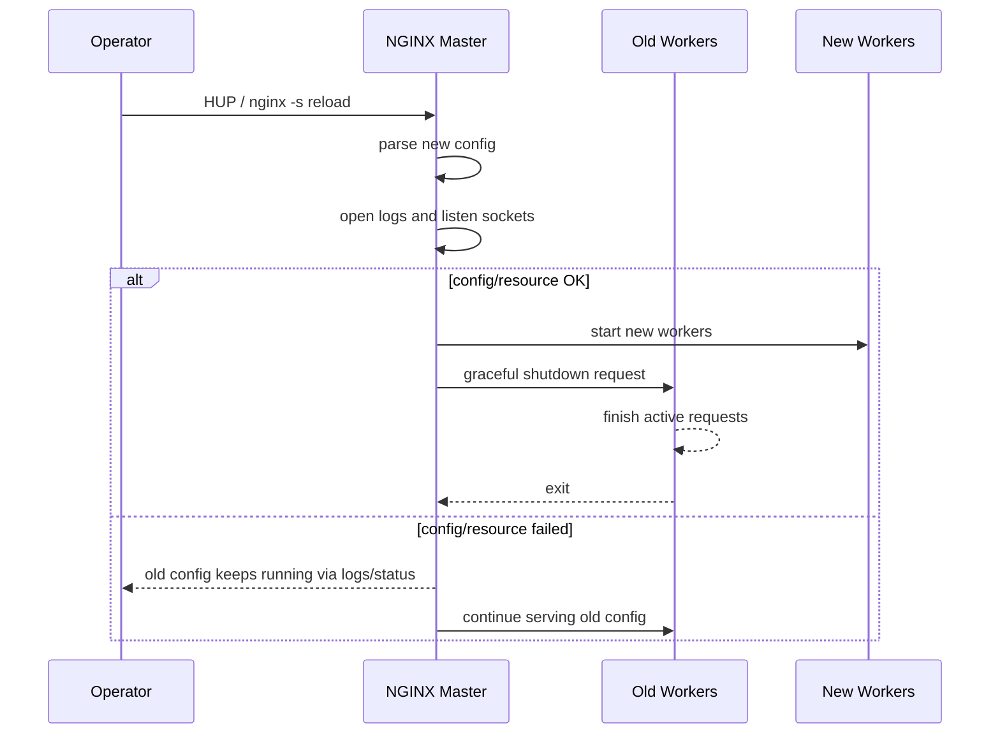

# Part 012 — NGINX CLI, Signals, Test, Reload, and Rollback

> Target part ini: kamu bisa mengoperasikan NGINX seperti production traffic process, bukan seperti service yang asal direstart. Kamu memahami apa arti `nginx -t`, `nginx -T`, `nginx -s reload`, signal HUP/QUIT/TERM/USR1/USR2/WINCH, kapan reload aman, kapan restart berbahaya, dan bagaimana membuat rollback yang bisa dilakukan saat incident.

NGINX sering disebut bisa reload tanpa downtime. Pernyataan itu benar dalam konteks tertentu, tetapi sering disalahartikan.

Yang benar:

```txt
NGINX can gracefully reload a valid new configuration by starting new workers and asking old workers to shut down gracefully.
```

Yang salah:

```txt
nginx -s reload always means my deployment succeeded.
```

Reload bukan bukti sukses. Reload adalah permintaan ke master process untuk mencoba memuat konfigurasi baru. Config bisa gagal dibaca. Socket bisa gagal dibuka. Certificate bisa tidak bisa dibaca. Module bisa hilang. File include bisa salah context. Bahkan jika reload berhasil, behavior traffic masih bisa salah.

Operational mental model:

```txt
Generate config
  -> validate syntax/resources
  -> dump effective config
  -> switch artifact
  -> signal master
  -> observe worker generation
  -> probe behavior
  -> rollback if needed
```

---

## 1. Command line yang wajib dikuasai

Beberapa command paling penting:

```bash
nginx -t
nginx -T
nginx -s reload
nginx -s quit
nginx -s stop
nginx -s reopen
nginx -c /path/to/nginx.conf
nginx -p /path/to/prefix
```

Makna ringkas:

| Command | Makna operasional |
|---|---|
| `nginx -t` | Test konfigurasi tanpa menjalankan worker baru secara permanen. |
| `nginx -T` | Test konfigurasi dan dump effective configuration ke stdout. |
| `nginx -s reload` | Kirim signal reload ke master process. |
| `nginx -s quit` | Graceful shutdown. |
| `nginx -s stop` | Fast shutdown. |
| `nginx -s reopen` | Reopen log files; umum setelah log rotation. |
| `nginx -c file` | Gunakan config file tertentu. |
| `nginx -p prefix` | Set path prefix untuk file relatif/runtime. |

Pola penting:

```bash
nginx -t -c /etc/nginx/nginx.conf
```

lebih baik daripada langsung:

```bash
nginx -s reload
```

Untuk CI atau deploy pipeline, gunakan config path eksplisit:

```bash
nginx -t -c "$RENDERED_DIR/nginx.conf" -p "$RENDERED_DIR"
nginx -T -c "$RENDERED_DIR/nginx.conf" -p "$RENDERED_DIR" > "$ARTIFACT_DIR/nginx.effective.conf"
```

`-p` berguna ketika kamu ingin menguji config di direktori isolated, bukan menggunakan path runtime default.

---

## 2. Signal model: NGINX dikontrol lewat master process

NGINX memiliki master process dan worker process. Signal dikirim ke master process untuk operasi besar seperti reload, shutdown, log reopen, dan binary upgrade.

Mapping umum:

| Intent | CLI | Signal umum | Efek |
|---|---|---|---|
| Fast shutdown | `nginx -s stop` | `TERM` atau `INT` | Keluar cepat. Koneksi aktif bisa terputus. |
| Graceful shutdown | `nginx -s quit` | `QUIT` | Berhenti menerima koneksi baru dan selesaikan koneksi aktif. |
| Reload config | `nginx -s reload` | `HUP` | Baca config baru, start worker baru, graceful shutdown worker lama. |
| Reopen logs | `nginx -s reopen` | `USR1` | Tutup dan buka ulang file log. |
| Binary upgrade | manual | `USR2` | Jalankan binary baru berdampingan dengan master lama. |
| Graceful worker stop | manual | `WINCH` | Minta worker berhenti graceful; sering terkait upgrade procedure. |

Diagram reload:



Critical point:

```txt
A failed reload should keep the old workers/config running.
But your deployment pipeline still failed.
```

Jangan menganggap “traffic masih jalan” berarti deployment sukses. Bisa jadi NGINX menolak config baru dan tetap melayani dengan config lama.

---

## 3. `nginx -t` bukan sekadar formalitas

`nginx -t` memeriksa konfigurasi. Ia bisa menangkap:

1. Syntax error.
2. Directive di context yang salah.
3. File include tidak ditemukan.
4. Certificate/key tidak bisa dibuka pada banyak konfigurasi TLS.
5. Konflik resource tertentu.
6. Module directive tidak dikenal.
7. Beberapa kesalahan path dan permission.

Contoh:

```bash
sudo nginx -t
```

Output sukses biasanya seperti:

```txt
nginx: the configuration file /etc/nginx/nginx.conf syntax is ok
nginx: configuration file /etc/nginx/nginx.conf test is successful
```

Namun `nginx -t` tidak membuktikan:

| Hal | Kenapa tidak terbukti |
|---|---|
| Routing benar | Syntax valid tidak berarti location yang dipilih benar. |
| Upstream sehat | Backend bisa down setelah config valid. |
| Timeout cocok | Valid secara syntax, salah secara latency budget. |
| Retry aman | Config valid bisa duplicate write. |
| Header security lengkap | Bisa hilang karena inheritance atau context. |
| Cache key aman | Valid tetapi bisa cache poisoning. |
| CORS benar | Valid tetapi policy salah. |

Jadi pipeline minimal:

```txt
nginx -t
  + nginx -T artifact
  + policy checks
  + smoke tests
  + production probes after reload
```

---

## 4. `nginx -T`: effective config sebagai artifact

`nginx -T` sangat penting karena ia menampilkan konfigurasi final setelah include diproses.

Gunakan saat:

1. CI validation.
2. Deployment artifact capture.
3. Incident RCA.
4. Membandingkan pre/post deploy.
5. Mencari directive yang berasal dari snippet tersembunyi.

Contoh:

```bash
sudo nginx -T > /var/lib/nginx-config-artifacts/nginx-effective-$(date +%Y%m%d-%H%M%S).conf
```

Dalam pipeline:

```bash
set -euo pipefail

nginx -t -c "$RENDERED/nginx.conf" -p "$RENDERED"
nginx -T -c "$RENDERED/nginx.conf" -p "$RENDERED" > "$ARTIFACT/nginx.effective.conf"
```

Jangan menyimpan dump ini sembarangan jika config berisi path sensitif, internal hostname, upstream IP, atau certificate path. Biasanya aman disimpan di artifact store internal dengan access control yang sama seperti config repo.

Rule:

```txt
If you cannot show the effective config during incident,
you do not truly know what NGINX is running.
```

---

## 5. Safe reload algorithm

Berikut algoritma reload yang layak untuk production VM/bare metal.

```bash
#!/usr/bin/env bash
set -euo pipefail

RELEASE_ID="${1:?usage: deploy-nginx.sh RELEASE_ID}"
RELEASE_DIR="/opt/nginx-config/releases/$RELEASE_ID"
CURRENT_LINK="/etc/nginx/current"
ARTIFACT_DIR="/var/lib/nginx-config-artifacts/$RELEASE_ID"

mkdir -p "$ARTIFACT_DIR"

# 1. Validate candidate config before touching current symlink.
nginx -t -c "$RELEASE_DIR/nginx.conf" -p "$RELEASE_DIR"

# 2. Capture effective config for audit/RCA.
nginx -T -c "$RELEASE_DIR/nginx.conf" -p "$RELEASE_DIR" \
  > "$ARTIFACT_DIR/nginx.effective.conf"

# 3. Optional policy checks against effective config.
/opt/nginx-config/bin/check-policy.sh "$ARTIFACT_DIR/nginx.effective.conf"

# 4. Switch current config atomically.
ln -sfn "$RELEASE_DIR" "$CURRENT_LINK.new"
mv -Tf "$CURRENT_LINK.new" "$CURRENT_LINK"

# 5. Reload running master.
nginx -s reload -c "$CURRENT_LINK/nginx.conf" -p "$CURRENT_LINK"

# 6. Post-reload probes.
/opt/nginx-config/bin/probe.sh
```

Catatan penting: tidak semua packaging NGINX akan memakai `-c` dan `-p` di service manager dengan cara yang sama. Jika NGINX dijalankan oleh systemd dari `/etc/nginx/nginx.conf`, maka symlink dan ExecStart/ExecReload harus konsisten. Jangan membuat deploy script memakai satu config path sementara process runtime memakai path lain.

Production invariant:

```txt
The config path tested must be the config path reloaded.
```

Jika tidak, kamu hanya menguji file A tetapi me-reload file B.

---

## 6. Reload success criteria

Reload dianggap sukses hanya jika semua lapisan ini lolos:

| Layer | Check |
|---|---|
| Syntax/resource | `nginx -t` sukses |
| Effective artifact | `nginx -T` tersimpan |
| Policy | Tidak melanggar guardrail internal |
| Signal accepted | `nginx -s reload` tidak error di command level |
| Master logs | Tidak ada emerg/crit terkait reload |
| Worker generation | Worker baru muncul, worker lama drain |
| Listener | Port tetap terbuka |
| Synthetic probe | Host/path utama benar |
| Business probe | Endpoint penting memberi response yang diharapkan |
| Metrics | 5xx/latency tidak melonjak setelah window pendek |

Command-level success tidak cukup. `nginx -s reload` bisa hanya berarti signal terkirim.

Gunakan log:

```bash
journalctl -u nginx -n 100 --no-pager
```

atau:

```bash
tail -n 100 /var/log/nginx/error.log
```

Cari pola seperti:

```txt
signal process started
reconfiguring
start worker process
gracefully shutting down
configuration file ... test is successful
```

Dan cari kegagalan:

```txt
[emerg]
[crit]
bind() failed
open() failed
unknown directive
invalid number of arguments
cannot load certificate
```

---

## 7. Rollback bukan edit manual

Rollback manual yang buruk:

```txt
SSH ke server
vim /etc/nginx/conf.d/app.conf
hapus perubahan terakhir berdasarkan ingatan
nginx -s reload
```

Ini bukan rollback. Ini improvisasi.

Rollback production:

```txt
Switch current symlink back to known-good release
validate known-good release
reload
probe
```

Contoh:

```bash
#!/usr/bin/env bash
set -euo pipefail

PREVIOUS_RELEASE="${1:?usage: rollback-nginx.sh PREVIOUS_RELEASE}"
RELEASE_DIR="/opt/nginx-config/releases/$PREVIOUS_RELEASE"
CURRENT_LINK="/etc/nginx/current"

nginx -t -c "$RELEASE_DIR/nginx.conf" -p "$RELEASE_DIR"

ln -sfn "$RELEASE_DIR" "$CURRENT_LINK.new"
mv -Tf "$CURRENT_LINK.new" "$CURRENT_LINK"

nginx -s reload -c "$CURRENT_LINK/nginx.conf" -p "$CURRENT_LINK"

/opt/nginx-config/bin/probe.sh
```

Rollback release harus sudah tersimpan, bukan dibuat ulang saat incident.

Simpan minimal:

```txt
release id
source commit
rendered config directory
nginx -T dump
policy result
smoke result
operator/deployer
activation timestamp
```

---

## 8. Graceful shutdown vs fast shutdown

Ada dua cara berhenti:

```bash
nginx -s quit   # graceful
nginx -s stop   # fast
```

Gunakan `quit` untuk normal operation:

```txt
stop accepting new work
finish active requests
exit cleanly
```

Gunakan `stop` hanya ketika kamu memang menerima risiko memutus koneksi aktif:

```txt
incident containment
stuck process
container termination fallback
host shutdown emergency
```

Untuk API pendek, perbedaannya mungkin tidak terasa. Untuk WebSocket, SSE, upload besar, download besar, dan long polling, perbedaannya besar.

Mental model:

```txt
reload and graceful quit protect active clients.
fast stop protects the operator from a stuck process.
```

Keduanya valid, tetapi untuk tujuan berbeda.

---

## 9. Worker lama tidak selalu hilang cepat

Setelah reload, worker lama diminta graceful shutdown. Tetapi graceful berarti menunggu request/koneksi selesai. Jika kamu punya koneksi panjang, worker lama bisa hidup lama.

Contoh penyebab:

1. WebSocket.
2. Server-Sent Events.
3. Upload/download besar.
4. Upstream lambat.
5. Client lambat.
6. Timeout terlalu panjang.
7. Long polling.

Gejala:

```bash
ps -ef | grep nginx
```

Kamu melihat dua generasi worker sementara waktu.

Ini tidak selalu bug. Tetapi jika worker lama hidup terlalu lama, cek:

1. Apakah ada streaming endpoint?
2. Apakah `proxy_read_timeout` terlalu besar?
3. Apakah graceful shutdown timeout perlu dikonfigurasi?
4. Apakah deployment terlalu sering sehingga worker generation menumpuk?

Jika kamu melakukan reload setiap beberapa detik di sistem dengan koneksi panjang, kamu bisa menciptakan pressure sendiri.

Operational rule:

```txt
Reload frequency must respect connection lifetime.
```

---

## 10. Reopen logs untuk log rotation

`nginx -s reopen` meminta NGINX membuka ulang file log.

Ini penting saat logrotate:

```txt
1. Rename current log file.
2. Create new empty log file or let NGINX create it.
3. Send reopen signal.
4. NGINX writes to new file descriptor.
```

Tanpa reopen, process bisa tetap menulis ke file descriptor lama walaupun nama file sudah dipindahkan.

Contoh logrotate style:

```txt
/var/log/nginx/*.log {
    daily
    rotate 14
    compress
    missingok
    notifempty
    create 0640 nginx adm
    sharedscripts
    postrotate
        [ -s /run/nginx.pid ] && kill -USR1 `cat /run/nginx.pid`
    endscript
}
```

Jika distro kamu sudah menyediakan logrotate config, pahami saja mekanismenya. Jangan menambahkan rotasi kedua yang bertabrakan.

---

## 11. systemd: reload harus konsisten dengan config path

Pada banyak Linux distribution, NGINX dikontrol lewat systemd:

```bash
sudo systemctl status nginx
sudo systemctl reload nginx
sudo systemctl restart nginx
sudo systemctl stop nginx
```

Perbedaan penting:

| Command | Makna |
|---|---|
| `systemctl reload nginx` | Biasanya mengirim reload/HUP sesuai unit file. |
| `systemctl restart nginx` | Stop lalu start; bisa memutus koneksi lebih besar. |
| `systemctl stop nginx` | Menghentikan service. |

Jangan mengasumsikan semua distro memakai ExecReload yang sama. Cek:

```bash
systemctl cat nginx
```

Cari:

```txt
ExecStart=
ExecReload=
PIDFile=
```

Jika kamu mengganti config path menggunakan symlink release, pastikan systemd unit menjalankan NGINX dengan path yang sama.

Contoh prinsip:

```txt
ExecStart uses /etc/nginx/current/nginx.conf
ExecReload reloads the same running master
CI validates /etc/nginx/current/nginx.conf candidate before switch
```

Jangan membuat deploy script yang reload via `nginx -s reload -c X` sementara master awal start dengan config Y dan PID file Z. Itu membuat operasi sulit diprediksi.

---

## 12. Container: reload bukan selalu restart container

Di container, banyak orang memilih restart container untuk menerapkan config. Itu sederhana, tetapi bukan selalu terbaik.

Ada tiga model:

### Model A — Immutable image

```txt
Config baked into image
New config = new image = new container rollout
```

Cocok untuk Kubernetes/immutable deployment.

Kelebihan:

1. Artifact jelas.
2. Rollback via image/tag/deployment revision.
3. Tidak ada mutable config dalam container.

Kekurangan:

1. Perubahan config butuh build/rollout.
2. Untuk bare Docker, restart bisa memutus koneksi.

### Model B — Mounted config + reload

```txt
Config mounted as volume
Validate config
Send HUP to NGINX master inside container
```

Cocok untuk VM dengan container runtime sederhana.

Kelebihan:

1. Reload bisa graceful.
2. Tidak perlu rebuild image untuk perubahan kecil.

Kekurangan:

1. Artifact ownership lebih rumit.
2. Perlu mekanisme signal yang benar.
3. Volume drift bisa terjadi.

### Model C — Controller-managed reload

```txt
Controller watches config source
Renders config
Validates
Reloads NGINX
Publishes status
```

Cocok untuk platform internal atau ingress controller.

Kelebihan:

1. Automation konsisten.
2. Status reload bisa dipantau.
3. Cocok untuk multi-tenant.

Kekurangan:

1. Controller bug bisa berdampak luas.
2. Perlu observability dan rate limit reload.

Rule:

```txt
In containers, choose either immutable rollout or disciplined reload.
Do not choose ad-hoc mutation.
```

---

## 13. Kubernetes: jangan samakan NGINX biasa dan Ingress Controller

Jika kamu menjalankan NGINX manual sebagai Deployment, kamu bertanggung jawab atas config render, validation, reload, dan rollout.

Jika kamu memakai NGINX Ingress Controller, controller bertanggung jawab membaca Kubernetes resources, menghasilkan config, dan melakukan reload/updates sesuai implementasi controller.

Dua hal ini berbeda:

```txt
nginx container with your config
```

vs

```txt
NGINX Ingress Controller managing NGINX config from Kubernetes API
```

Operational implication:

| Area | NGINX manual | Ingress Controller |
|---|---|---|
| Source of truth | File/template kamu | Kubernetes resources |
| Validation | Pipeline kamu | Admission/controller + pipeline kamu |
| Reload | Script/signal kamu | Controller |
| Rollback | Config artifact/image | Kubernetes rollout/resource rollback |
| Observability | Kamu desain | Controller metrics/logs + NGINX logs |

Part Kubernetes akan dibahas lebih jauh di Part 103–104. Untuk sekarang, pegang prinsip ini:

```txt
Do not debug Ingress Controller as if you hand-wrote nginx.conf,
and do not operate hand-written nginx.conf as if a controller will save you.
```

---

## 14. Binary upgrade: tahu ada, jangan jadikan default

NGINX mendukung binary upgrade dengan signal seperti `USR2` dan prosedur master lama/baru. Ini berguna untuk upgrade binary dengan downtime minimal.

Namun untuk banyak tim modern, terutama di container/Kubernetes, strategi yang lebih umum adalah:

```txt
build new image/package
roll out new instances
health check
drain old instances
rollback via orchestrator if needed
```

Binary upgrade manual lebih kompleks karena ada dua master process sementara, PID file berubah, dan operator harus paham rollback procedure.

Gunakan binary upgrade manual hanya jika:

1. Kamu menjalankan NGINX di VM/bare metal.
2. Kamu butuh upgrade binary tanpa restart service kasar.
3. Tim operasi memahami prosedurnya.
4. Ada runbook yang sudah diuji.

Jika tidak, pilih package/container rollout yang lebih mudah diamati.

---

## 15. Failure modes saat reload

| Failure | Contoh | Gejala | Respon |
|---|---|---|---|
| Syntax error | `proxy_pass` kurang argumen | `nginx -t` gagal | Jangan reload |
| Wrong context | `map` di dalam `server` | `nginx -t` gagal | Pindahkan ke `http` |
| Missing include | File snippet tidak ada | `nginx -t` gagal | Perbaiki artifact |
| Cert unreadable | Permission key salah | `nginx -t`/reload gagal | Perbaiki permission/secret mount |
| Bind conflict | Port dipakai process lain | Reload/start gagal | Cek listener dan systemd |
| Unknown directive | Module tidak tersedia | `nginx -t` gagal | Install/load module atau hapus directive |
| Valid but wrong routing | Slash `proxy_pass` salah | Smoke test gagal | Rollback |
| Valid but overload | Timeout/retry buruk | Latency/5xx naik | Rollback atau hotfix |
| Worker drain lama | WebSocket/SSE | Old workers bertahan | Cek timeout/reload frequency |
| Log rotation broken | Tidak reopen | Disk/log path aneh | Kirim USR1/reopen |

Kategori penting:

```txt
Config parse failure is usually safe because old config keeps running.
Behavior failure is dangerous because new config is live.
```

Karena itu smoke/probe setelah reload sama pentingnya dengan `nginx -t`.

---

## 16. Deployment runbook ringkas

Gunakan runbook seperti ini untuk perubahan production.

### Sebelum deploy

```txt
1. Review diff source config.
2. Render candidate config.
3. Run nginx -t.
4. Run nginx -T and store effective config.
5. Run policy checks.
6. Run routing golden tests.
7. Confirm rollback release exists.
```

### Saat deploy

```txt
1. Switch artifact atomically.
2. Send reload.
3. Watch error log/journal.
4. Confirm new workers started.
5. Confirm old workers draining normally.
6. Run synthetic probes.
7. Watch 5xx, latency, upstream errors.
```

### Setelah deploy

```txt
1. Store deployment metadata.
2. Keep previous release available.
3. Compare key metrics before/after.
4. Document any anomaly.
```

### Rollback trigger

```txt
Rollback if:
- synthetic probe fails
- 5xx rises beyond threshold
- latency budget breaks
- error log shows emerg/crit from new config
- unknown host/path reaches upstream unexpectedly
- cert/TLS behavior breaks
```

---

## 17. Minimal practical commands

Untuk satu server:

```bash
sudo nginx -t
sudo nginx -T > /tmp/nginx.effective.conf
sudo nginx -s reload
sudo tail -n 100 /var/log/nginx/error.log
```

Dengan systemd:

```bash
sudo nginx -t
sudo systemctl reload nginx
sudo journalctl -u nginx -n 100 --no-pager
```

Graceful shutdown:

```bash
sudo nginx -s quit
```

Fast shutdown:

```bash
sudo nginx -s stop
```

Reopen logs:

```bash
sudo nginx -s reopen
```

Cek process:

```bash
ps -o pid,ppid,stat,cmd -C nginx
```

Cek listener:

```bash
ss -ltnp | grep nginx
```

Probe Host tertentu:

```bash
curl -i \
  --resolve public-api.example.com:443:127.0.0.1 \
  https://public-api.example.com/healthz
```

Probe default server:

```bash
curl -i \
  -H 'Host: unknown.example.com' \
  http://127.0.0.1/
```

---

## 18. What excellent engineers do differently

Engineer biasa:

```txt
edit config
nginx -t
reload
```

Engineer kuat:

```txt
model blast radius
render candidate
validate syntax
inspect effective config
run policy checks
run behavior tests
activate atomically
reload
observe worker lifecycle
probe real contracts
rollback by artifact if needed
```

Perbedaannya bukan tool. Perbedaannya adalah memperlakukan NGINX sebagai bagian dari control plane traffic.

NGINX bukan “file config di server”. NGINX adalah executable policy untuk traffic masuk.

---

## 19. Kesimpulan

Pegang invariant ini:

```txt
1. Test before reload.
2. Dump effective config before activation.
3. Reload is not proof of behavior correctness.
4. Graceful reload starts new workers and drains old workers.
5. Fast stop and graceful quit solve different problems.
6. Reopen logs after rotation.
7. Rollback must switch to a known-good artifact, not manual editing.
8. The tested config path must be the running config path.
9. Long-lived connections change reload behavior.
10. Treat NGINX operations as deployment engineering.
```

Part berikutnya akan masuk ke build/package/module strategy: bagaimana memilih NGINX dari package distro, official package, source build, dynamic modules, container image, atau NGINX Plus tanpa mencampur asumsi fitur.

---

## References

- NGINX Documentation — Command-line Parameters: https://nginx.org/en/docs/switches.html
- NGINX Documentation — Controlling nginx: https://nginx.org/en/docs/control.html
- NGINX Documentation — Beginner's Guide: https://nginx.org/en/docs/beginners_guide.html
- NGINX Documentation — Core Module: https://nginx.org/en/docs/ngx_core_module.html
