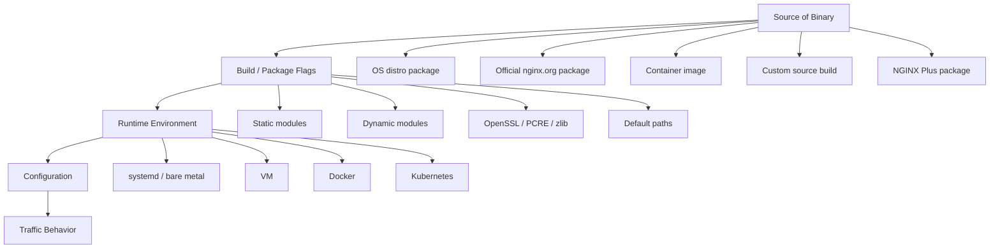
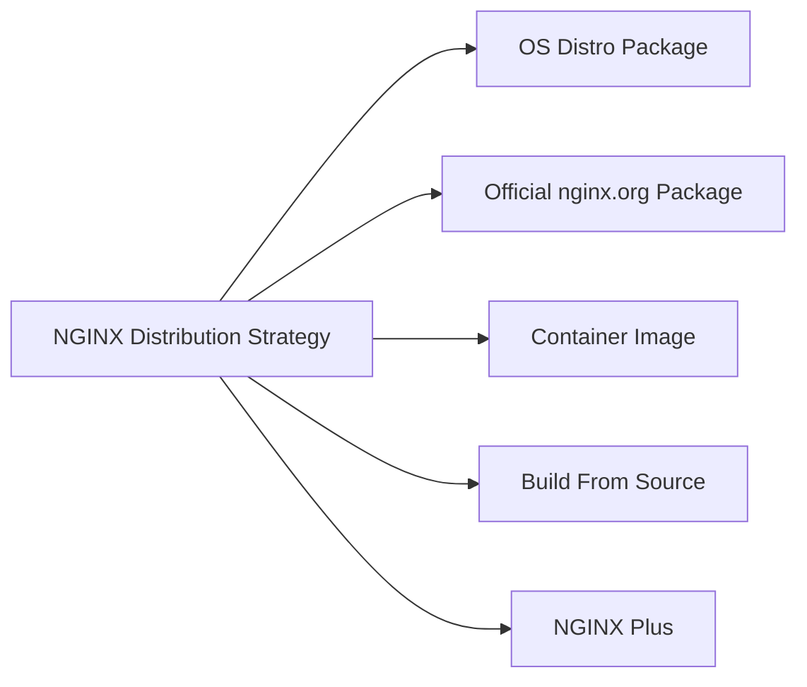
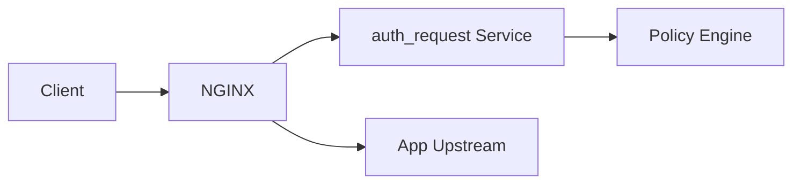
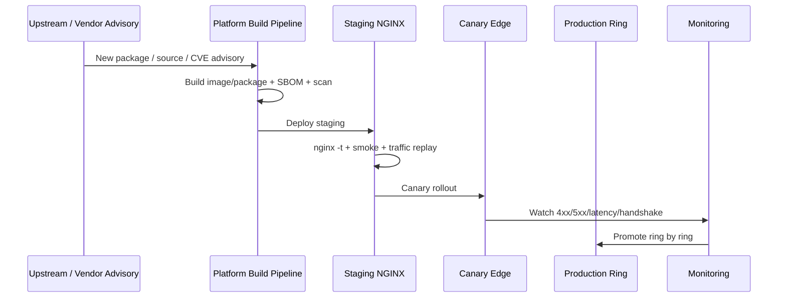

# Part 013 — Build, Package, and Module Strategy

Di level basic, pertanyaan instalasi NGINX biasanya sederhana:

> “Install pakai `apt install nginx` saja?”

Di production, pertanyaannya berubah total:

> “Binary NGINX ini berasal dari mana, fitur apa yang aktif, modul apa yang dimuat, OpenSSL apa yang dipakai, patch security masuk lewat jalur apa, bagaimana rollback dilakukan, dan apakah config kita portable ke environment berikutnya?”

Part ini membahas **strategi distribusi NGINX**. Bukan sekadar cara install.

NGINX yang sama secara nama bisa punya perilaku berbeda karena dibangun dengan:

- versi NGINX berbeda,
- compile flag berbeda,
- modul statis/dinamis berbeda,
- path default berbeda,
- dependency OpenSSL/PCRE/zlib berbeda,
- systemd unit berbeda,
- user runtime berbeda,
- image/container base berbeda,
- kebijakan security update berbeda.

Kalau kita tidak mengontrol hal-hal ini, kita sebenarnya tidak benar-benar mengontrol edge traffic layer.

---

## 1. Mental Model: NGINX Binary Is Part of Your Architecture

Konfigurasi NGINX sering dianggap sebagai arsitektur. Itu benar, tapi belum cukup.

Arsitektur NGINX production minimal terdiri dari empat lapis:



Konfigurasi seperti ini:

```nginx
http {
    server {
        listen 443 ssl http2;
        server_name api.example.com;
    }
}
```

baru valid jika binary NGINX mendukung modul yang dibutuhkan.

Contoh:

- `ssl` butuh HTTP SSL module.
- HTTP/2 butuh HTTP/2 support.
- HTTP/3 butuh modul HTTP/3 yang saat ini harus dibangun eksplisit dan masih perlu perhatian khusus.
- `stream {}` butuh stream module.
- `auth_jwt` bukan fitur NGINX Open Source core.
- beberapa module third-party hanya ada jika binary dibangun dengan module itu.

Jadi invariant pertama:

> **Config correctness depends on binary capability.**

Bukan hanya `nginx -t`.

---

## 2. Stable vs Mainline: Jangan Salah Membaca Nama

NGINX upstream menyediakan dua jalur utama:

| Channel | Makna praktis | Cocok untuk |
|---|---|---|
| Stable | Fitur dari mainline sebelumnya yang sudah dibundel sebagai stable branch | production konservatif |
| Mainline | development aktif dengan fitur/bugfix terbaru | environment yang butuh fitur baru atau patch tertentu lebih cepat |

Per 2026-07-06, halaman download resmi NGINX menampilkan:

- mainline: `nginx-1.31.2`,
- stable: `nginx-1.30.3`.

Jangan mengasumsikan “stable” selalu lebih aman untuk semua kasus. Kadang mainline membawa bugfix/security fix lebih cepat. Tetapi jangan juga menganggap mainline selalu cocok untuk semua production.

Decision rule yang lebih sehat:

```txt
Pilih stable jika:
- fitur yang dibutuhkan sudah tersedia,
- patch cadence internal cukup cepat,
- risk appetite rendah,
- environment banyak dan homogen.

Pilih mainline jika:
- butuh fitur baru tertentu,
- butuh bugfix yang belum masuk stable,
- punya test suite traffic-level yang kuat,
- rollout bisa bertahap dan mudah rollback.
```

Top 1% engineer tidak bertanya “stable atau mainline lebih bagus?”.

Mereka bertanya:

> “Failure apa yang ingin kita minimalkan: feature gap, regression risk, CVE exposure window, atau operability drift?”

---

## 3. Lima Cara Umum Mendapatkan NGINX

Secara production, ada lima strategi umum:



Mari kita bedah satu per satu.

---

## 4. OS Distro Package

Contoh:

```bash
sudo apt install nginx
sudo dnf install nginx
sudo apk add nginx
```

### 4.1 Kelebihan

- Integrasi systemd biasanya rapi.
- Path mengikuti konvensi distro.
- Security update masuk lewat patch management OS.
- Mudah untuk tim ops tradisional.
- Cocok untuk baseline server standar.

### 4.2 Kekurangan

- Versi bisa tertinggal jauh dari upstream.
- Compile flag bisa berbeda dari official upstream.
- Modul yang tersedia tergantung maintainer distro.
- Dokumentasi upstream kadang tidak 100% cocok dengan layout distro.
- Upgrade fitur tidak selalu sejalan dengan kebutuhan aplikasi.

### 4.3 Risiko Utama

Risiko terbesar bukan “versi lama”. Risiko terbesar adalah **false assumption**.

Contoh:

```bash
nginx -V
```

Output ini jauh lebih penting daripada `nginx -v`.

`nginx -v` hanya memberi versi singkat.

`nginx -V` memberi:

- compiler,
- configure arguments,
- path default,
- module statis,
- module dinamis,
- TLS library yang dipakai saat build.

Checklist setelah install OS package:

```bash
nginx -v
nginx -V 2>&1 | tr ' ' '\n' | sort
nginx -t
systemctl cat nginx
systemctl status nginx --no-pager
```

### 4.4 Kapan OS Package Cukup?

Gunakan OS distro package jika:

- NGINX dipakai sebagai static web server sederhana,
- fitur yang dibutuhkan tersedia,
- compliance organisasi mewajibkan patch lewat OS vendor,
- environment tidak butuh fitur baru upstream,
- operasional lebih penting daripada novelty.

Jangan gunakan OS package secara buta jika:

- butuh HTTP/3 experimental testing,
- butuh module tertentu,
- butuh version parity antar OS berbeda,
- ingin container dan VM memakai binary identik,
- harus mengikuti CVE fix upstream sangat cepat.

---

## 5. Official nginx.org Package

NGINX menyediakan paket official untuk beberapa distribusi Linux.

Mental modelnya:

> OS package mengikuti kebijakan distro. Official nginx.org package mengikuti kebijakan distribusi NGINX upstream.

### 5.1 Kelebihan

- Lebih dekat dengan upstream NGINX.
- Versi biasanya lebih baru.
- Dokumentasi upstream lebih mudah dipetakan.
- Cocok untuk standardisasi lintas distro.
- Ada official repo untuk mainline/stable.

### 5.2 Kekurangan

- Anda mengambil tanggung jawab lebih besar atas lifecycle paket.
- Harus memastikan repository pinning benar.
- Harus mengontrol upgrade cadence sendiri.
- Integrasi distro mungkin tidak selalu sama dengan paket distro default.

### 5.3 Pinning Itu Wajib

Anti-pattern:

```bash
apt update
apt upgrade -y
```

pada host edge tanpa pinning dan tanpa canary.

Yang lebih aman:

```txt
1. Pin major/minor channel.
2. Bangun staging node dengan paket baru.
3. Jalankan nginx -t dan nginx -T diff.
4. Jalankan smoke test traffic-level.
5. Canary sebagian traffic.
6. Rollout bertahap.
7. Simpan package sebelumnya untuk rollback.
```

NGINX upgrade bukan sekadar binary replacement. Ia dapat mengubah:

- validasi config,
- default behavior baru,
- modul behavior,
- bug compatibility,
- security hardening,
- interaksi TLS library.

---

## 6. Container Image Strategy

Di Kubernetes atau containerized platform, NGINX sering dipakai sebagai:

- reverse proxy sidecar,
- edge container,
- static asset container,
- ingress data plane,
- gateway layer,
- per-service adapter.

Container membuat packaging lebih repeatable, tapi tidak otomatis membuatnya aman.

### 6.1 Tiga Pola Image

| Pola | Contoh | Kelebihan | Risiko |
|---|---|---|---|
| Official base image + config mount | `nginx:stable` + ConfigMap/volume | cepat dan familiar | tag mutable, config/image drift |
| Internal hardened image | `registry.local/platform/nginx:1.30.3-r4` | reproducible, policy baked-in | butuh pipeline build |
| App-specific NGINX image | static assets + nginx config | self-contained artifact | banyak variasi image |

### 6.2 Jangan Pakai Floating Tag untuk Production

Anti-pattern:

```yaml
image: nginx:latest
```

Lebih baik:

```yaml
image: registry.example.com/platform/nginx:1.30.3-debian12-r20260706
```

Lebih kuat lagi:

```yaml
image: registry.example.com/platform/nginx@sha256:<digest>
```

Tag menjawab “nama apa?”.

Digest menjawab “artifact persis yang mana?”.

### 6.3 Container NGINX Invariant

Production container NGINX sebaiknya memenuhi invariant berikut:

```txt
- tidak berjalan sebagai root kecuali binding port rendah benar-benar diperlukan,
- root filesystem bisa read-only,
- log keluar ke stdout/stderr atau collector yang jelas,
- temp/cache path eksplisit writable,
- pid path eksplisit,
- config divalidasi saat startup,
- health endpoint sederhana tersedia,
- image punya SBOM,
- image discan CVE,
- image pin by digest di deployment penting,
- module list dicatat di build metadata.
```

Contoh container layout:

```txt
/etc/nginx/nginx.conf
/etc/nginx/conf.d/*.conf
/var/cache/nginx              writable
/var/run/nginx                writable
/usr/share/nginx/html         read-only
/var/log/nginx/access.log     symlink to stdout
/var/log/nginx/error.log      symlink to stderr
```

### 6.4 Read-Only Filesystem Trap

Config ini sering gagal saat container dibuat read-only:

```nginx
client_body_temp_path /var/cache/nginx/client_temp;
proxy_temp_path       /var/cache/nginx/proxy_temp;
fastcgi_temp_path     /var/cache/nginx/fastcgi_temp;
uwsgi_temp_path       /var/cache/nginx/uwsgi_temp;
scgi_temp_path        /var/cache/nginx/scgi_temp;
```

Jika path temp tidak writable, upload besar, buffering, atau proxy response tertentu bisa gagal.

Di Kubernetes:

```yaml
securityContext:
  readOnlyRootFilesystem: true
  runAsNonRoot: true
  allowPrivilegeEscalation: false

volumeMounts:
  - name: nginx-cache
    mountPath: /var/cache/nginx
  - name: nginx-run
    mountPath: /var/run

volumes:
  - name: nginx-cache
    emptyDir: {}
  - name: nginx-run
    emptyDir: {}
```

NGINX bukan stateless murni. Ia bisa memakai disk untuk temp file, cache, pid, unix socket, dan logs.

---

## 7. Build From Source

Build from source memberi kontrol tertinggi dan tanggung jawab tertinggi.

Gunakan jika:

- butuh module yang tidak ada di package,
- butuh patch khusus,
- butuh dependency khusus,
- butuh build hardening tertentu,
- butuh eksperimen fitur seperti HTTP/3 dengan konfigurasi spesifik,
- perlu binary identik lintas distro/container.

Jangan gunakan jika alasan utamanya hanya:

> “Biar kelihatan advanced.”

Source build tanpa pipeline reproducible biasanya lebih buruk daripada package resmi.

### 7.1 Anatomy of Source Build

Build NGINX umumnya:

```bash
./configure \
  --prefix=/etc/nginx \
  --sbin-path=/usr/sbin/nginx \
  --modules-path=/usr/lib/nginx/modules \
  --conf-path=/etc/nginx/nginx.conf \
  --error-log-path=/var/log/nginx/error.log \
  --http-log-path=/var/log/nginx/access.log \
  --pid-path=/var/run/nginx.pid \
  --lock-path=/var/run/nginx.lock \
  --with-http_ssl_module \
  --with-http_v2_module \
  --with-stream \
  --with-stream_ssl_module \
  --with-pcre-jit

make -j"$(nproc)"
make install
```

Directive `./configure` menentukan bukan hanya fitur, tetapi path default dan modul yang tersedia.

### 7.2 Configure Flags Are Architecture

Contoh flag berdampak besar:

| Flag | Dampak |
|---|---|
| `--prefix` | root default untuk file relatif |
| `--conf-path` | lokasi config utama |
| `--modules-path` | lokasi dynamic module |
| `--with-http_ssl_module` | TLS untuk HTTP |
| `--with-http_v2_module` | HTTP/2 |
| `--with-http_v3_module` | HTTP/3 experimental support |
| `--with-stream` | TCP/UDP stream proxy |
| `--with-stream_ssl_module` | TLS di stream |
| `--with-pcre-jit` | regex performance improvement |
| `--add-module` | third-party static module |
| `--add-dynamic-module` | third-party dynamic module |

Kalau `nginx -T` adalah snapshot config, maka `nginx -V` adalah snapshot kapabilitas binary.

Simpan keduanya saat incident.

```bash
nginx -V 2>&1 | tee /var/tmp/nginx-build-info.txt
nginx -T > /var/tmp/nginx-effective-config.txt
```

---

## 8. Static Module vs Dynamic Module

NGINX module bisa dibangun:

- statis: masuk ke binary,
- dinamis: file `.so` yang dimuat dengan `load_module`.

### 8.1 Static Module

Kelebihan:

- deployment sederhana,
- tidak ada file module terpisah,
- semua kapabilitas melekat di binary,
- cocok untuk image immutable.

Kekurangan:

- upgrade module berarti rebuild binary,
- binary bisa membesar,
- sulit menonaktifkan fitur tanpa rebuild.

### 8.2 Dynamic Module

Contoh:

```nginx
load_module modules/ngx_http_image_filter_module.so;
load_module modules/ngx_stream_module.so;
```

Kelebihan:

- lebih modular,
- module bisa dipaketkan terpisah,
- cocok untuk fitur opsional.

Kekurangan:

- module harus kompatibel dengan binary,
- file `.so` harus tersedia di path benar,
- startup gagal jika module tidak bisa dimuat,
- upgrade binary/module harus diperlakukan sebagai satu unit kompatibilitas.

### 8.3 Module Compatibility Rule

Rule production:

> **Binary NGINX dan dynamic module harus dianggap sebagai satu release unit.**

Jangan upgrade NGINX binary tanpa memverifikasi module:

```bash
nginx -t
nginx -V 2>&1 | grep modules
ls -lah /usr/lib/nginx/modules
```

Jika menggunakan container image, masukkan module dalam image yang sama, bukan mount manual dari host.

---

## 9. Third-Party Module Risk Model

Third-party module bisa sangat berguna, tetapi ia memperluas trust boundary.

Evaluasi dengan pertanyaan berikut:

```txt
- Apakah module aktif dikembangkan?
- Apakah kompatibel dengan versi NGINX target?
- Apakah ada test suite?
- Apakah module menyentuh parsing request/header/body?
- Apakah module menyimpan state?
- Apakah module melakukan network call?
- Apakah module menggunakan dependency native rentan CVE?
- Apakah ada alternatif native NGINX?
- Bagaimana rollback jika module crash/segfault?
```

Semakin dekat module ke parsing request, TLS, body buffering, atau memory allocation, semakin besar blast radius-nya.

### 9.1 Red Flag

Red flag module:

- tidak ada release jelas,
- dokumentasi minim,
- issue security tidak ditangani,
- butuh patch NGINX core,
- tidak kompatibel dengan mainline/stable terbaru,
- tidak ada maintainer aktif,
- contoh config hanya dari blog lama,
- gagal build di CI modern.

### 9.2 Safer Pattern

Kadang lebih aman memindahkan logic ke service lain:



Daripada memasukkan logic kompleks ke module native, gunakan:

- `auth_request`,
- sidecar policy service,
- external gateway,
- upstream service middleware,
- njs untuk transformasi ringan.

NGINX harus tetap menjadi fast path. Jangan ubah edge menjadi application framework kecuali alasan dan risikonya jelas.

---

## 10. Dependency Strategy: OpenSSL, PCRE, zlib

NGINX bukan binary yang hidup sendiri.

Ia bergantung pada dependency penting:

| Dependency | Fungsi |
|---|---|
| OpenSSL / compatible TLS library | TLS, certificate, handshake, ciphers |
| PCRE / PCRE2 | regex matching, rewrite, location regex |
| zlib | gzip compression |
| libc | runtime ABI |

### 10.1 OpenSSL Coupling

TLS behavior tidak hanya ditentukan oleh config NGINX.

Ia juga dipengaruhi oleh TLS library yang dipakai saat build/runtime.

Contoh implikasi:

- cipher availability,
- protocol support,
- certificate validation behavior,
- 0-RTT support untuk HTTP/3/QUIC path tertentu,
- CVE exposure di OpenSSL.

Jangan hanya patch NGINX. Patch juga dependency-nya.

### 10.2 Regex Cost

`server_name` regex, `location` regex, `rewrite`, dan `map` dengan regex dapat bergantung pada PCRE behavior/performance.

Gunakan regex secara disiplin:

- hindari regex jika prefix/exact cukup,
- audit regex di hot path,
- gunakan `map` untuk klasifikasi eksplisit,
- aktifkan JIT jika build mendukung dan workload cocok,
- benchmark dengan data realistis.

---

## 11. Reproducible Build and Release Discipline

Untuk production serius, binary NGINX perlu diperlakukan seperti service artifact.

Minimal metadata setiap release:

```yaml
nginx_release:
  version: "1.30.3"
  channel: "stable"
  source: "official-nginx-package"
  distro: "debian12"
  image: "registry.example.com/platform/nginx:1.30.3-r20260706"
  digest: "sha256:..."
  built_at: "2026-07-06T00:00:00Z"
  modules:
    - ngx_http_ssl_module
    - ngx_http_v2_module
    - ngx_stream_module
  openssl: "..."
  pcre: "..."
  zlib: "..."
  sbom: "s3://.../sbom.json"
  config_tested_with:
    - learn-nginx-in-action-baseline
```

### 11.1 Artifact Immutability

Jangan rebuild image dengan tag yang sama.

Anti-pattern:

```txt
registry.example.com/nginx:prod
```

Pattern:

```txt
registry.example.com/nginx:1.30.3-r20260706-001
registry.example.com/nginx@sha256:<digest>
```

Release NGINX harus bisa dijawab:

> “Traffic incident ini berjalan di binary persis yang mana?”

Kalau tidak bisa dijawab, RCA akan lemah.

---

## 12. Security Patch Flow

Patch flow yang sehat:



Security patch bukan hanya “upgrade cepat”.

Ia harus menyeimbangkan:

- exposure window,
- regression risk,
- config compatibility,
- module compatibility,
- rollback ability,
- observability signal.

### 12.1 Emergency Patch Mode

Untuk CVE kritikal di edge path:

```txt
1. Freeze unrelated changes.
2. Build patched binary/image.
3. Keep config identical.
4. Run config validation.
5. Run synthetic requests for critical routes.
6. Canary low percentage.
7. Expand rollout quickly but observably.
8. Keep previous image/package ready.
9. Write post-patch diff: binary, modules, dependency, config.
```

Jangan gabungkan security patch dengan refactor config besar.

Satu variabel perubahan jauh lebih mudah di-debug daripada lima.

---

## 13. Rollback Strategy

Rollback NGINX punya dua dimensi:

| Dimensi | Contoh |
|---|---|
| Config rollback | revert `.conf` atau ConfigMap |
| Binary rollback | revert package/image |

Keduanya tidak selalu independen.

Config baru bisa memakai directive yang hanya ada di binary baru.

Binary lama bisa gagal menjalankan config baru.

Karena itu, setiap release perlu matrix kompatibilitas:

```txt
new config + new binary: expected pass
old config + new binary: should pass
new config + old binary: may fail; document if not supported
old config + old binary: rollback baseline
```

Di CI:

```bash
# Test current config against candidate binary
candidate-nginx -t -c /workspace/nginx.conf

# Dump effective config
candidate-nginx -T -c /workspace/nginx.conf > effective.conf
```

Untuk container:

```bash
docker run --rm \
  -v "$PWD/nginx.conf:/etc/nginx/nginx.conf:ro" \
  registry.example.com/platform/nginx:1.30.3-r20260706 \
  nginx -t
```

---

## 14. Path Strategy: Do Not Let Defaults Surprise You

Path default dipengaruhi oleh build/package.

Periksa:

```bash
nginx -V 2>&1 | tr ' ' '\n' | grep -- '--.*path'
```

Hal yang harus eksplisit di production:

```nginx
user nginx;
worker_processes auto;
pid /run/nginx.pid;
error_log /var/log/nginx/error.log warn;

http {
    access_log /var/log/nginx/access.log main;

    client_body_temp_path /var/cache/nginx/client_temp;
    proxy_temp_path       /var/cache/nginx/proxy_temp;

    include /etc/nginx/mime.types;
    include /etc/nginx/conf.d/*.conf;
}
```

Tujuan eksplisit bukan supaya panjang.

Tujuannya supaya config portable antar package/image/source build.

---

## 15. Choosing a Strategy: Decision Matrix

| Kondisi | Rekomendasi |
|---|---|
| Simple VM static/reverse proxy | OS distro package atau official package |
| Butuh upstream parity dan versi baru | official nginx.org package |
| Kubernetes/app platform | internal hardened container image |
| Butuh third-party module | build from source atau custom image terkontrol |
| Butuh commercial feature/support | evaluasi NGINX Plus |
| Compliance OS-vendor-driven | OS package dengan vendor patch flow |
| Banyak environment berbeda | container atau official package pinned |
| Edge critical high-risk | artifact immutable + staged rollout |

### 15.1 Rule Praktis

```txt
Default untuk platform modern:
- buat internal hardened NGINX image,
- pin versi dan digest,
- simpan nginx -V metadata,
- config mount/templating lewat pipeline,
- validasi nginx -t di CI,
- rollout bertahap.

Default untuk VM tradisional:
- pakai official package atau distro package,
- pin channel,
- record nginx -V,
- manage config via IaC,
- test reload dan rollback.
```

---

## 16. Production Lab: Build an Internal NGINX Runtime Contract

Kita tidak akan membangun full source build di sini. Kita akan membangun **runtime contract** yang bisa dipakai baik untuk package maupun container.

### 16.1 Buat Script Inventory

```bash
#!/usr/bin/env bash
set -euo pipefail

out="nginx-runtime-inventory-$(date +%Y%m%dT%H%M%S).txt"

{
  echo "# nginx version"
  nginx -v 2>&1

  echo
  echo "# nginx build"
  nginx -V 2>&1

  echo
  echo "# config test"
  nginx -t 2>&1

  echo
  echo "# effective config"
  nginx -T 2>&1

  echo
  echo "# module directory"
  modules_path=$(nginx -V 2>&1 | tr ' ' '\n' | sed -n 's/^--modules-path=//p' | head -n1)
  if [ -n "${modules_path:-}" ] && [ -d "$modules_path" ]; then
    ls -lah "$modules_path"
  else
    echo "no modules path detected or directory missing"
  fi
} > "$out"

echo "written $out"
```

### 16.2 Buat Minimal Runtime Manifest

```yaml
runtime:
  name: nginx-edge
  expected_user: nginx
  config_path: /etc/nginx/nginx.conf
  modules_path: /usr/lib/nginx/modules
  temp_paths:
    - /var/cache/nginx/client_temp
    - /var/cache/nginx/proxy_temp
  required_modules:
    - http_ssl
    - http_v2
    - stream
  startup_validation:
    - nginx -t
  reload_command:
    - nginx -s reload
  rollback_policy:
    config: revert git commit and reload
    binary: rollback package/image and restart node/pod
```

### 16.3 CI Gate

```bash
#!/usr/bin/env bash
set -euo pipefail

IMAGE="registry.example.com/platform/nginx:1.30.3-r20260706"
CONFIG_DIR="$PWD/nginx"

docker run --rm \
  -v "$CONFIG_DIR:/etc/nginx:ro" \
  "$IMAGE" \
  nginx -t
```

Tambahkan smoke test:

```bash
docker run --rm -d --name nginx-candidate \
  -p 8080:8080 \
  -v "$CONFIG_DIR:/etc/nginx:ro" \
  "$IMAGE"

curl -fsS http://127.0.0.1:8080/healthz
curl -fsS -H 'Host: app.example.test' http://127.0.0.1:8080/

docker rm -f nginx-candidate
```

---

## 17. Common Failure Modes

### 17.1 Config Valid di Laptop, Gagal di Server

Penyebab umum:

- versi NGINX berbeda,
- module tidak tersedia,
- path include berbeda,
- user runtime berbeda,
- SELinux/AppArmor berbeda,
- file permission berbeda,
- TLS library berbeda.

Mitigasi:

```txt
- test dengan binary yang sama seperti production,
- gunakan container candidate untuk validation,
- record nginx -V,
- jangan rely pada default path.
```

### 17.2 Upgrade Package Menghapus Module Compatibility

Gejala:

```txt
nginx: [emerg] dlopen() "/usr/lib/nginx/modules/xxx.so" failed
```

Mitigasi:

```txt
- version lock binary dan module,
- package module dari repo yang sama,
- smoke test startup,
- deploy canary.
```

### 17.3 Container Restart Loop Karena Read-Only FS

Gejala:

```txt
mkdir() "/var/cache/nginx/client_temp" failed
open() "/var/run/nginx.pid" failed
```

Mitigasi:

```txt
- mount writable temp dirs,
- set pid path writable,
- symlink logs ke stdout/stderr,
- test dengan same securityContext.
```

### 17.4 Mainline Upgrade Mengubah Behavior yang Tidak Diantisipasi

Mitigasi:

```txt
- baca changelog,
- jalankan traffic replay,
- canary,
- jangan gabungkan config refactor dengan binary upgrade.
```

---

## 18. Review Checklist

Sebelum menyetujui perubahan distribusi NGINX, jawab:

```txt
[ ] Binary source jelas?
[ ] Version dan channel jelas?
[ ] nginx -V disimpan?
[ ] Required modules tersedia?
[ ] Dynamic modules kompatibel?
[ ] OpenSSL/dependency strategy jelas?
[ ] Config diuji dengan candidate binary?
[ ] Rollback binary tersedia?
[ ] Rollback config tersedia?
[ ] Container tag immutable atau digest-pinned?
[ ] Writable paths eksplisit?
[ ] Logs masuk ke jalur observability?
[ ] CVE scan dan SBOM tersedia?
[ ] Canary plan tersedia?
[ ] Monitoring signal untuk rollout tersedia?
```

---

## 19. Kesimpulan

NGINX production bukan hanya file `.conf`.

Ia adalah kombinasi dari:

```txt
binary + modules + dependencies + runtime + config + rollout discipline
```

Jika salah satu tidak dikontrol, edge layer menjadi opaque.

Mental model yang harus dibawa:

> **NGINX config expresses intent. NGINX binary determines capability. Runtime environment determines whether that capability survives production.**

Di part berikutnya, kita akan membedakan secara eksplisit NGINX Open Source dan NGINX Plus. Ini penting karena banyak desain buruk lahir dari membaca dokumentasi Plus lalu mengira semua fitur tersedia di Open Source, atau sebaliknya menghindari Plus padahal problem yang dipecahkan adalah problem control-plane dan operability, bukan sekadar directive.

---

## Referensi

- NGINX official documentation — `https://nginx.org/en/docs/`
- NGINX official download page — `https://nginx.org/en/download.html`
- NGINX building from sources — `https://nginx.org/en/docs/configure.html`
- NGINX Linux packages — `https://nginx.org/en/linux_packages.html`
- F5 NGINX installing NGINX Open Source — `https://docs.nginx.com/nginx/admin-guide/installing-nginx/installing-nginx-open-source/`
- F5 NGINX dynamic modules — `https://docs.nginx.com/nginx/admin-guide/dynamic-modules/`
- F5 NGINX Docker deployment — `https://docs.nginx.com/nginx/admin-guide/installing-nginx/installing-nginx-docker/`
