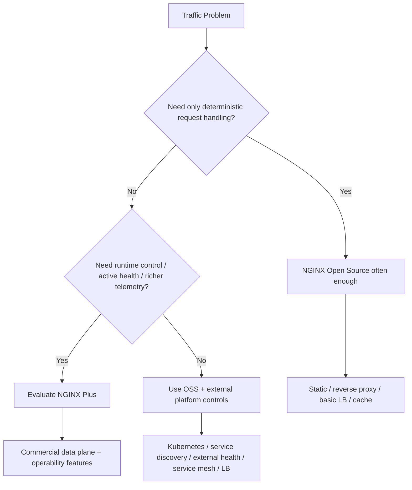
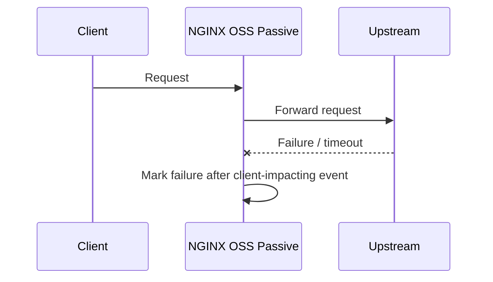
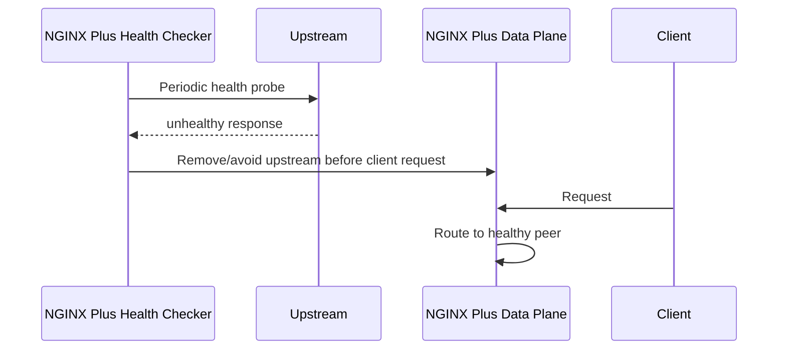
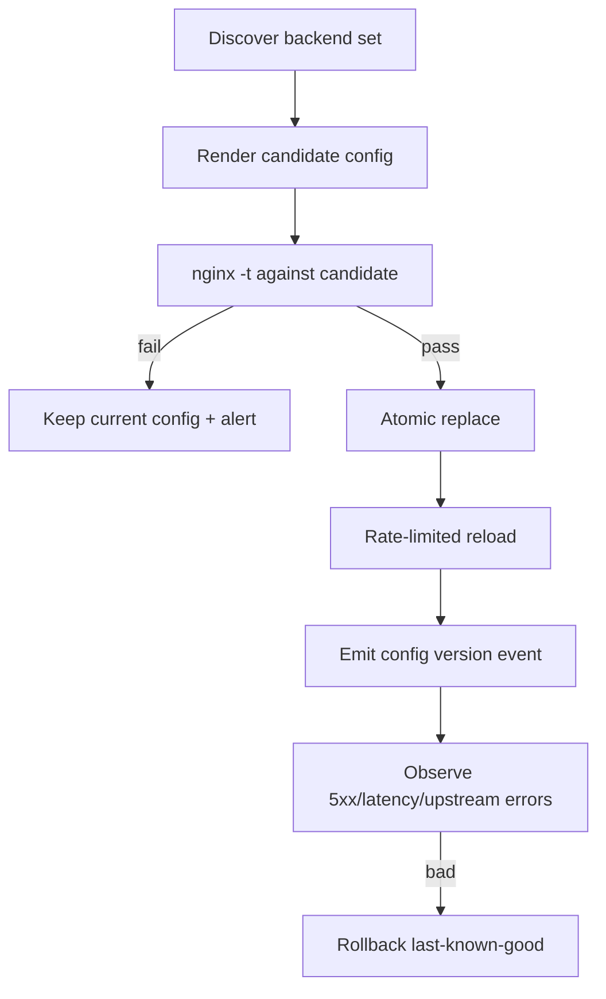
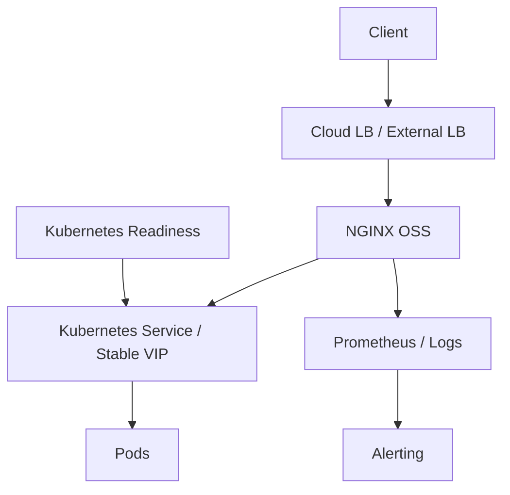
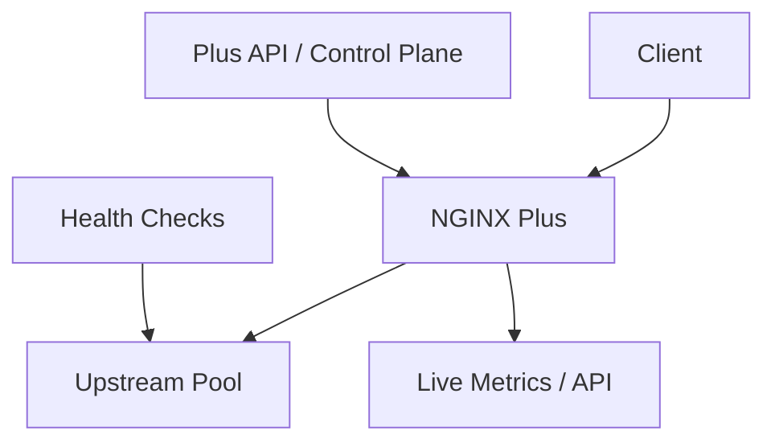
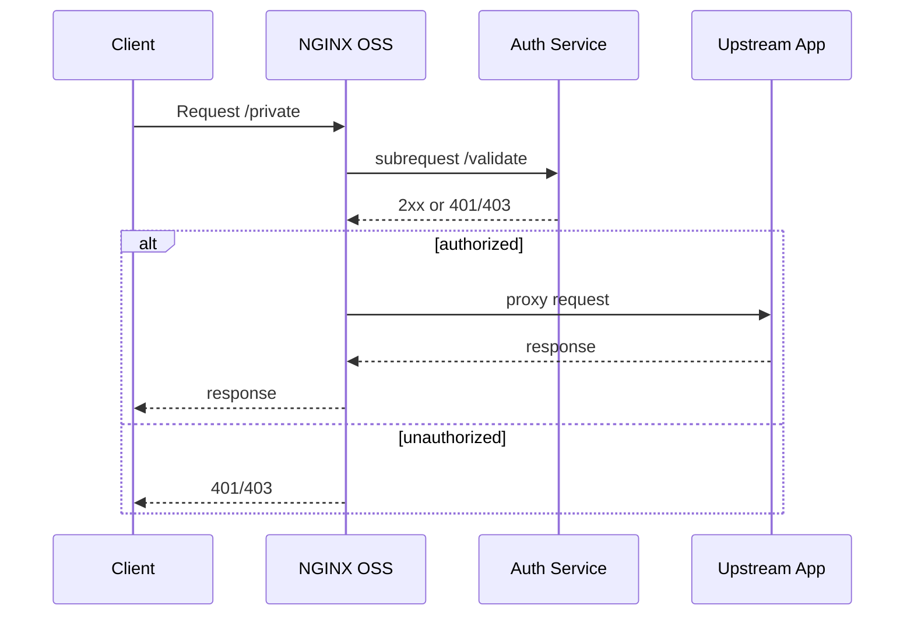

# Part 014 — Open Source vs NGINX Plus Boundaries

Part ini bukan debat ideologis “open source vs commercial”.

Part ini adalah boundary map.

Tujuannya sederhana:

> Jangan mendesain production architecture berdasarkan fitur yang ternyata tidak tersedia di edition yang dipakai.

Banyak incident NGINX bukan karena NGINX lemah. Banyak yang terjadi karena tim membaca contoh config dari konteks NGINX Plus, Kubernetes Ingress, NGINX Gateway Fabric, OpenResty, atau blog lama, lalu mengira semuanya berlaku untuk NGINX Open Source core.

Di seri ini, kita akan memakai pendekatan:

```txt
1. Open Source-first untuk konsep dan baseline.
2. NGINX Plus diberi label eksplisit jika fitur berbeda.
3. Workaround Open Source dibahas sebagai pola arsitektur, bukan pretending parity.
4. Keputusan Plus dievaluasi berdasarkan operability dan risk reduction, bukan sekadar daftar fitur.
```

---

## 1. Mental Model: NGINX Open Source Is Data Plane, NGINX Plus Adds Operability Plane

NGINX Open Source sangat kuat sebagai data plane:

- menerima koneksi,
- memproses HTTP request,
- static serving,
- reverse proxy,
- load balancing dasar,
- caching,
- TLS termination,
- TCP/UDP stream proxy,
- rate limiting,
- access control dasar,
- logging,
- extensibility via module.

NGINX Plus menambahkan banyak kemampuan yang lebih dekat ke **operability/control plane**:

- active health checks,
- advanced session persistence,
- live activity monitoring/API,
- dynamic upstream reconfiguration tanpa reload,
- key-value store,
- beberapa fitur security/commercial module,
- commercial support,
- tested dynamic module ecosystem,
- high availability features tertentu,
- runtime state sharing pada konteks tertentu.

Cara berpikirnya:



NGINX Plus bukan “lebih cepat NGINX”. Ia adalah paket kemampuan tambahan yang sering berguna ketika traffic layer perlu dikelola sebagai platform.

---

## 2. Capabilities That Are Usually Safe to Assume in NGINX Open Source

Baseline Open Source yang umumnya menjadi fondasi seri ini:

| Area | Contoh kemampuan |
|---|---|
| Web server | static file, `root`, `alias`, `try_files`, index |
| Reverse proxy | `proxy_pass`, header control, buffering, timeout |
| HTTP load balancing | round-robin, least connections, ip hash, hash |
| TLS | HTTPS termination, SNI, certificates |
| HTTP/2 | jika module/build mendukung |
| HTTP/3 | experimental module, tidak built by default; perlu build/rollout hati-hati |
| Cache | `proxy_cache`, cache key, stale behavior, lock, revalidation patterns |
| Rate limiting | `limit_req`, `limit_conn` |
| Access control | `allow`, `deny`, `auth_basic`, `auth_request` jika module tersedia |
| Stream | TCP/UDP proxy jika stream module tersedia |
| Logging | access log, error log, custom log format |
| Basic metrics | `stub_status` jika module tersedia |
| Extensibility | dynamic/static modules, njs jika tersedia |

Tetapi kata kuncinya: **jika module/build mendukung**.

Selalu cek:

```bash
nginx -V 2>&1
```

---

## 3. Capabilities Commonly Associated with NGINX Plus

Berikut fitur yang sering menjadi alasan evaluasi NGINX Plus.

### 3.1 Active Health Checks

NGINX Open Source punya passive failure handling. Artinya upstream dianggap bermasalah berdasarkan kegagalan request aktual.

NGINX Plus dapat melakukan active health checks: mengirim request khusus secara periodik ke upstream dan memverifikasi response.

Mental model:





Implikasi:

- Passive health checks bisa cukup untuk sistem kecil atau stateless.
- Active health checks mengurangi client-visible failure saat backend sudah sakit sebelum traffic nyata masuk.
- Active checks juga bisa salah jika health endpoint tidak merepresentasikan kesiapan nyata.

Plus tidak otomatis menyelesaikan bad health semantics.

Health endpoint tetap harus didesain benar.

### 3.2 Advanced Session Persistence

Open Source bisa memakai `ip_hash` atau hashing-based routing untuk stickiness dasar.

NGINX Plus menyediakan metode session persistence yang lebih eksplisit seperti sticky session mode tertentu.

Gunakan session persistence dengan curiga.

Sticky session sering menutupi masalah state management:

```txt
Gejala:
- user harus selalu ke backend sama,
- session disimpan lokal di memory node,
- cache lokal per instance,
- upload multi-step bergantung node,
- websocket state tidak bisa pindah.

Pertanyaan arsitektural:
- bisakah state dipindah ke Redis/database?
- bisakah backend dibuat stateless?
- apakah sticky hanya transisi migrasi?
- apa yang terjadi saat node sticky mati?
```

Sticky session adalah tool, bukan desain ideal default.

### 3.3 Dynamic Upstream Reconfiguration

NGINX Open Source biasanya mengubah upstream lewat config reload.

NGINX Plus menyediakan API untuk mengelola server upstream secara runtime tanpa reload pada fitur tertentu.

Perbedaan mental model:

```txt
Open Source:
config file -> nginx -t -> reload -> new workers

NGINX Plus:
runtime API -> update upstream state -> no full reload for supported operations
```

Kapan ini penting?

- backend membership berubah sangat sering,
- service discovery tidak cocok dengan reload frequency,
- reload blast radius ingin dikurangi,
- platform team butuh control plane yang mengubah upstream secara dinamis,
- state/metrics upstream perlu dipertahankan lebih baik.

Tapi API runtime juga menambah:

- authentication/authorization requirement,
- audit trail requirement,
- drift risk antara declarative config dan runtime state,
- operational complexity.

### 3.4 Live Activity Monitoring and API

NGINX Open Source punya `stub_status` untuk metric dasar.

NGINX Plus punya status/API yang lebih kaya dan dashboard/live activity monitoring.

Perbedaan praktis:

| Kebutuhan | OSS | Plus |
|---|---|---|
| koneksi aktif/basic counters | `stub_status` | tersedia dan lebih luas |
| upstream peer-level runtime state | terbatas | lebih kaya |
| API JSON resmi untuk status/control | terbatas di OSS core | Plus API |
| dashboard built-in | tidak core | tersedia di Plus context |

Namun jangan salah:

> Dashboard bukan observability strategy.

Observability production tetap butuh:

- logs terstruktur,
- metrics ke monitoring system,
- alert berbasis SLO,
- correlation ID,
- incident playbook,
- traffic-level debugging.

### 3.5 JWT Authentication

F5 documentation menyatakan JWT authentication tersedia dengan NGINX Plus.

Di Open Source, pola umum biasanya:

- validasi JWT di upstream service,
- external auth via `auth_request`,
- API gateway lain,
- njs/custom module dengan risiko dan batasan,
- service mesh/policy layer.

Jangan menaruh validasi security-critical ke snippet yang tidak jelas provenance-nya.

JWT validation terlihat sederhana, tapi detailnya berat:

- signature algorithm enforcement,
- `kid` handling,
- JWKS rotation,
- expiration/nbf/leeway,
- audience/issuer validation,
- fail-closed behavior,
- cache key security,
- clock skew,
- error response consistency.

Kalau butuh JWT di edge, evaluasi dengan disiplin.

### 3.6 Cache Purge and Cache Operations

NGINX Open Source punya caching kuat.

Namun operasi cache seperti purge yang aman, konsisten, dan observable di multi-node environment bisa menjadi rumit.

NGINX Plus punya fitur/pola cache purge documented, tetapi desain cache purge tetap harus mempertimbangkan:

- cache key determinism,
- authorization purge endpoint,
- multi-node invalidation,
- race condition,
- stale serving policy,
- observability HIT/MISS/STALE/BYPASS,
- rollback konten.

Plus memberi primitive. Ia tidak menggantikan desain cache invalidation.

---

## 4. Feature Boundary Matrix

Matrix ini sengaja praktis, bukan legal-contract. Selalu cek dokumentasi versi yang dipakai.

| Area | NGINX Open Source | NGINX Plus | Catatan desain |
|---|---|---|---|
| Static file serving | Ya | Ya | OSS cukup untuk mayoritas static serving |
| Reverse proxy | Ya | Ya | OSS sangat kuat |
| Basic HTTP load balancing | Ya | Ya | OSS cukup untuk banyak workload |
| Advanced LB methods | Sebagian | Lebih lengkap | Least time/slow start/session persistence tertentu perlu dicek edition |
| Passive health checks | Ya | Ya | OSS mendeteksi lewat request gagal |
| Active health checks | Tidak sebagai core OSS | Ya | Plus berguna untuk mengurangi client-visible failure |
| Dynamic upstream API | Tidak core OSS | Ya | Berguna untuk control plane runtime |
| Basic status metrics | `stub_status` | Ya | Plus lebih kaya |
| Live activity dashboard | Tidak core OSS | Ya | Jangan jadikan dashboard sebagai satu-satunya observability |
| JWT auth at edge | Tidak core OSS | Ya | Alternatif OSS: `auth_request`/upstream/policy service |
| Cache | Ya | Ya | Operasi purge/management berbeda |
| TCP/UDP stream proxy | Ya jika module tersedia | Ya | Cek build/module |
| Commercial support | Community/vendor distro | Ya | Bisa menjadi alasan utama untuk regulated/high-risk org |
| Tested commercial dynamic modules | Terbatas | Ya | Penting untuk supply-chain risk |

---

## 5. The Dangerous Middle: Reimplementing Plus Poorly with Scripts

Salah satu anti-pattern paling mahal:

> “Kita tidak pakai Plus, jadi kita buat sendiri active health check + dynamic upstream update dengan script yang edit config dan reload tiap beberapa detik.”

Contoh buruk:

```bash
while true; do
  ./discover-backends > /etc/nginx/conf.d/upstreams.conf
  nginx -s reload
  sleep 5
done
```

Masalah:

- reload terlalu sering,
- race saat file ditulis parsial,
- tidak ada lock,
- tidak ada audit,
- tidak ada rollback,
- worker lama menumpuk jika long-lived connection,
- upstream state hilang,
- config transient sulit direproduksi,
- incident analysis kabur.

Versi yang lebih sehat jika tetap OSS:

```txt
1. Generate config ke file temporary.
2. Validate dengan nginx -t.
3. Atomic move jika valid.
4. Reload dengan rate limit.
5. Record config hash.
6. Emit deployment event.
7. Monitor reload failure, worker count, 5xx, latency.
8. Rollback ke last-known-good config.
```

Pseudo-flow:



Kalau kebutuhan dynamic control-plane sangat tinggi, evaluasi Plus, Ingress Controller, Gateway API controller, service mesh, atau dedicated LB/control-plane. Jangan membangun mini-control-plane rapuh tanpa sadar.

---

## 6. Open Source Workarounds: Valid, but Name the Trade-Off

Open Source bukan berarti tidak bisa. Tetapi setiap workaround harus diberi nama trade-off.

### 6.1 Active Health Check Alternative

Alternatif OSS:

- passive health checks,
- external load balancer health check di depan NGINX,
- orchestrator readiness/liveness checks,
- service discovery hanya memasukkan endpoint ready,
- sidecar/controller generate upstream config,
- app-level retry/idempotency.

Trade-off:

```txt
- client mungkin melihat failure pertama,
- readiness semantics pindah ke orchestrator,
- reload diperlukan untuk membership change,
- observability harus dibangun sendiri.
```

### 6.2 Dynamic Upstream Alternative

Alternatif OSS:

- DNS-based service discovery dengan resolver,
- config generation + reload,
- Kubernetes Service/ClusterIP sebagai stable upstream,
- sidecar Envoy/HAProxy untuk dynamic service discovery,
- NGINX Ingress Controller.

Trade-off:

```txt
- DNS caching semantics harus dipahami,
- reload cadence harus dikontrol,
- runtime state terbatas,
- debugging bisa pindah ke layer lain.
```

### 6.3 JWT Alternative

Alternatif OSS:

```nginx
location /private/ {
    auth_request /_auth;
    proxy_pass http://app;
}

location = /_auth {
    internal;
    proxy_pass http://auth-service/validate;
    proxy_pass_request_body off;
    proxy_set_header Content-Length "";
    proxy_set_header Authorization $http_authorization;
    proxy_set_header X-Original-URI $request_uri;
}
```

Trade-off:

```txt
- extra network hop,
- auth service harus highly available,
- caching auth decision harus hati-hati,
- fail-open/fail-closed harus eksplisit,
- latency budget bertambah.
```

Ini bisa sangat baik jika didesain benar.

Tetapi jangan mengira ini sama dengan native JWT module behavior.

---

## 7. Cost Model: Jangan Bandingkan License vs Free Saja

Keputusan Plus sering dibahas salah:

> “OSS gratis, Plus berbayar.”

Itu terlalu dangkal.

Cost model sebenarnya:

```txt
Total cost = license + engineering time + incident risk + compliance burden + support need + opportunity cost + operational complexity
```

### 7.1 Kapan OSS Biasanya Lebih Masuk Akal

NGINX Open Source biasanya cukup jika:

- topology sederhana,
- backend membership stabil,
- passive health check cukup,
- orchestrator sudah menangani readiness,
- observability bisa dibangun sendiri,
- tim punya keahlian NGINX kuat,
- tidak butuh commercial support,
- compliance tidak mewajibkan vendor support.

### 7.2 Kapan Plus Layak Dievaluasi Serius

NGINX Plus layak dievaluasi jika:

- NGINX adalah critical edge tier dengan traffic besar,
- client-visible failure dari passive health unacceptable,
- upstream membership sering berubah,
- butuh API control-plane resmi,
- butuh metrics/status lebih kaya,
- regulated environment butuh commercial support,
- tim kecil tapi blast radius besar,
- sticky/session behavior advanced diperlukan sebagai transisi,
- WAF/security/commercial modules masuk requirement.

### 7.3 Pertanyaan yang Lebih Bagus dari “Perlu Plus?”

Tanyakan:

```txt
- Failure apa yang Plus kurangi?
- Berapa biaya failure itu per tahun?
- Workaround OSS apa yang akan kita bangun?
- Siapa yang maintain workaround itu?
- Bagaimana kita test workaround itu?
- Bagaimana audit dan rollback-nya?
- Apakah Plus mengurangi kompleksitas atau hanya memindahkannya?
- Apakah fitur Plus terkunci ke arsitektur sulit keluar?
```

---

## 8. Documentation Hygiene: Label Every Snippet

Dalam engineering handbook internal, setiap snippet NGINX harus diberi label edition/context.

Contoh header snippet:

```md
Edition: NGINX Open Source
Runtime: VM/systemd
Requires modules: http_ssl, http_v2
Tested with: nginx 1.30.x stable
```

Atau:

```md
Edition: NGINX Plus
Runtime: Kubernetes Gateway Fabric data plane
Requires: Plus subscription/JWT license
Feature dependency: active health checks, sticky cookie
```

Tanpa label, snippet menjadi bom waktu.

### 8.1 Snippet Metadata Template

```yaml
nginx_snippet:
  edition: oss # oss | plus | ingress | gateway-fabric | openresty
  version_tested: "1.30.3"
  modules_required:
    - http_ssl
    - http_v2
  runtime:
    - systemd
    - container
  reload_required: true
  failure_mode:
    - startup_fail_if_module_missing
    - route_mismatch_if_header_absent
  owner: platform-edge
```

---

## 9. Avoiding Lock-In Without Avoiding Useful Features

Menghindari lock-in bukan berarti menolak semua fitur commercial.

Menghindari lock-in berarti:

- isolasi fitur edition-specific,
- punya abstraction boundary,
- tahu fallback behavior,
- punya migration path,
- tidak menyebar directive Plus ke semua config tanpa kontrol.

### 9.1 Config Isolation Pattern

```txt
/etc/nginx/
  nginx.conf
  conf.d/
    00-log-format.conf
    10-common-proxy.conf
    20-upstreams-oss.conf
    20-upstreams-plus.conf
    30-routes.conf
    90-status-oss.conf
    90-status-plus.conf
```

Atau lebih jelas:

```txt
platform/nginx/
  common/
  oss/
  plus/
  ingress/
  gateway-fabric/
```

Rule:

```txt
Common config tidak boleh bergantung pada Plus-only directive.
Plus-only config harus punya owner, justification, dan test.
```

### 9.2 Feature Flagging at Config Generation Layer

```jinja2

    # Plus-specific active health checks / sticky / API config

    # OSS-compatible passive health / hash / external check pattern

```

Tetapi jangan over-template.

Config generation yang terlalu pintar bisa menjadi bahasa pemrograman jelek.

---

## 10. Decision Records for Edition-Specific Features

Setiap penggunaan fitur Plus sebaiknya punya ADR ringan:

```md
# ADR: Use NGINX Plus Active Health Checks for API Edge

## Context
API edge routes traffic to 40 backend nodes. Passive failure detection caused client-visible 502 during partial backend degradation.

## Decision
Use NGINX Plus active health checks for upstream group `api_backend`.

## Alternatives
- OSS passive health + Kubernetes readiness only
- External L7 load balancer
- Envoy Gateway
- App-level retry only

## Consequences
- Requires Plus license and runtime API protection
- Better pre-request detection of unhealthy peers
- Health endpoint semantics become critical
- Config includes Plus-only directives

## Rollback
Switch to OSS upstream block with passive failure handling and Kubernetes readiness.
```

ADR seperti ini mencegah “tribal knowledge” menjadi dependency production.

---

## 11. Practical Architecture Patterns

### 11.1 OSS Edge with External Platform Control



Cocok jika:

- Kubernetes/service discovery sudah kuat,
- NGINX tidak perlu tahu individual pod,
- reload jarang,
- observability external sudah matang.

### 11.2 NGINX Plus as Programmable Edge Data Plane



Cocok jika:

- NGINX sendiri menjadi platform LB utama,
- active health dan runtime upstream control penting,
- team butuh vendor-supported edge tier,
- traffic layer critical dan kompleks.

### 11.3 OSS with Auth Service



Cocok jika:

- policy logic kompleks,
- organisasi sudah punya auth platform,
- ingin portability antar gateway,
- latency tambahan masih acceptable.

---

## 12. Failure Modes by Edition Assumption

### 12.1 Plus Directive in OSS Binary

Gejala:

```txt
nginx: [emerg] unknown directive "sticky"
nginx: [emerg] unknown directive "health_check"
nginx: [emerg] unknown directive "auth_jwt"
```

Root cause:

```txt
Config dibuat dari dokumentasi/contoh Plus, dijalankan pada OSS binary.
```

Mitigasi:

```txt
- label snippet by edition,
- validate config dengan binary target,
- CI matrix OSS/Plus jika mendukung keduanya,
- isolasi config edition-specific.
```

### 12.2 OSS Workaround Becomes Hidden Control Plane

Gejala:

```txt
- reload terlalu sering,
- upstream flapping,
- 502 saat discovery update,
- config state tidak sesuai source of truth,
- engineer tidak tahu siapa mengubah upstream.
```

Root cause:

```txt
Script workaround untuk dynamic upstream berevolusi menjadi control plane tanpa desain control plane.
```

Mitigasi:

```txt
- treat config generator as production system,
- add audit/log/rollback,
- rate limit reload,
- evaluate Plus or dedicated controller.
```

### 12.3 Plus Adopted Without Operational Ownership

Gejala:

```txt
- API/dashboard terbuka internal terlalu luas,
- runtime state berubah tanpa Git trace,
- team tidak tahu source of truth,
- license renewal menjadi outage risk,
- feature dipakai tapi tidak dimonitor.
```

Root cause:

```txt
Plus dianggap hanya binary upgrade, bukan operational model baru.
```

Mitigasi:

```txt
- protect API/dashboard,
- define source of truth,
- write ADR,
- monitor license/runtime health,
- train on feature semantics.
```

---

## 13. CI/CD Guardrails

### 13.1 Detect Edition Accidentally

```bash
#!/usr/bin/env bash
set -euo pipefail

if nginx -V 2>&1 | grep -qi 'nginx-plus'; then
  echo "edition=plus"
else
  echo "edition=oss-or-distro"
fi
```

Jangan hanya mengandalkan string ini untuk compliance. Gunakan metadata build resmi di pipeline Anda.

### 13.2 Validate Forbidden Directives for OSS

```bash
#!/usr/bin/env bash
set -euo pipefail

CONFIG_DIR="${1:-/etc/nginx}"

forbidden=(
  "health_check"
  "sticky"
  "auth_jwt"
  "keyval"
)

for d in "${forbidden[@]}"; do
  if grep -R --line-number -E "(^|[[:space:]])${d}([[:space:];])" "$CONFIG_DIR"; then
    echo "Forbidden or edition-specific directive detected for OSS profile: $d" >&2
    exit 1
  fi
done

nginx -t
```

Ini bukan parser sempurna, tapi berguna sebagai guardrail awal.

Lebih kuat: jalankan `nginx -t` dengan binary target.

### 13.3 Matrix Test

```yaml
profiles:
  - name: oss
    image: registry.example.com/platform/nginx-oss:1.30.3-r1
    config_variant: oss
  - name: plus
    image: registry.example.com/platform/nginx-plus:rXX-r1
    config_variant: plus
```

Setiap profile menjalankan:

```bash
nginx -t
nginx -T
smoke-test.sh
```

---

## 14. Production Decision Checklist

Sebelum memilih OSS atau Plus untuk sistem tertentu:

```txt
Traffic and topology
[ ] Berapa RPS/connection concurrency?
[ ] Apakah upstream membership sering berubah?
[ ] Apakah long-lived connection dominan?
[ ] Apakah backend stateful?
[ ] Apakah client-visible first failure acceptable?

Health and resilience
[ ] Passive health cukup?
[ ] Active health dibutuhkan?
[ ] Health endpoint benar-benar merepresentasikan readiness?
[ ] Apa policy saat partial dependency degradation?

Operations
[ ] Apakah reload sering?
[ ] Apakah dynamic upstream update diperlukan?
[ ] Apakah runtime state harus dipertahankan?
[ ] Apakah ada dashboard/API requirement?
[ ] Siapa owner edge runtime?

Security and compliance
[ ] Apakah perlu vendor support?
[ ] Apakah perlu commercial WAF/security module?
[ ] Apakah JWT/OIDC perlu di edge?
[ ] Apakah audit/runtime API control tersedia?

Cost and risk
[ ] Berapa biaya incident edge outage?
[ ] Berapa biaya membangun workaround OSS?
[ ] Apakah Plus mengurangi atau menambah kompleksitas?
[ ] Apa exit strategy jika pindah edition?
```

---

## 15. Kesimpulan

NGINX Open Source sangat kuat dan cukup untuk banyak production system.

NGINX Plus bukan pengganti pemahaman NGINX. Ia menambah primitive operasional dan fitur commercial yang bisa mengurangi risiko tertentu jika dipakai dengan benar.

Kesalahan terbesar adalah dua ekstrem:

```txt
1. Mengira OSS tidak production-grade.
2. Mengira Plus menyelesaikan desain health, cache, security, dan observability secara otomatis.
```

Mental model yang benar:

> **Choose edition based on failure modes, operational ownership, and control-plane needs — not based on prestige, habit, or one attractive directive.**

Dengan part ini, kita menutup Phase 1 bagian strategi distribusi dan boundary edition. Part berikutnya adalah **Production Baseline Lab**: kita akan menyusun skeleton NGINX production yang aman untuk dikembangkan ke static serving, reverse proxy, load balancing, cache, TLS, dan observability.

---

## Referensi

- NGINX official documentation — `https://nginx.org/en/docs/`
- F5 NGINX Admin Guide — `https://docs.nginx.com/nginx/admin-guide/`
- F5 NGINX HTTP Load Balancing — `https://docs.nginx.com/nginx/admin-guide/load-balancer/http-load-balancer/`
- F5 NGINX HTTP Health Checks — `https://docs.nginx.com/nginx/admin-guide/load-balancer/http-health-check/`
- F5 NGINX Dynamic Configuration API — `https://docs.nginx.com/nginx/admin-guide/load-balancer/dynamic-configuration-api/`
- F5 NGINX Live Activity Monitoring — `https://docs.nginx.com/nginx/admin-guide/monitoring/live-activity-monitoring/`
- F5 NGINX JWT Authentication — `https://docs.nginx.com/nginx/admin-guide/security-controls/configuring-jwt-authentication/`
- F5 NGINX Content Caching — `https://docs.nginx.com/nginx/admin-guide/content-cache/content-caching/`
