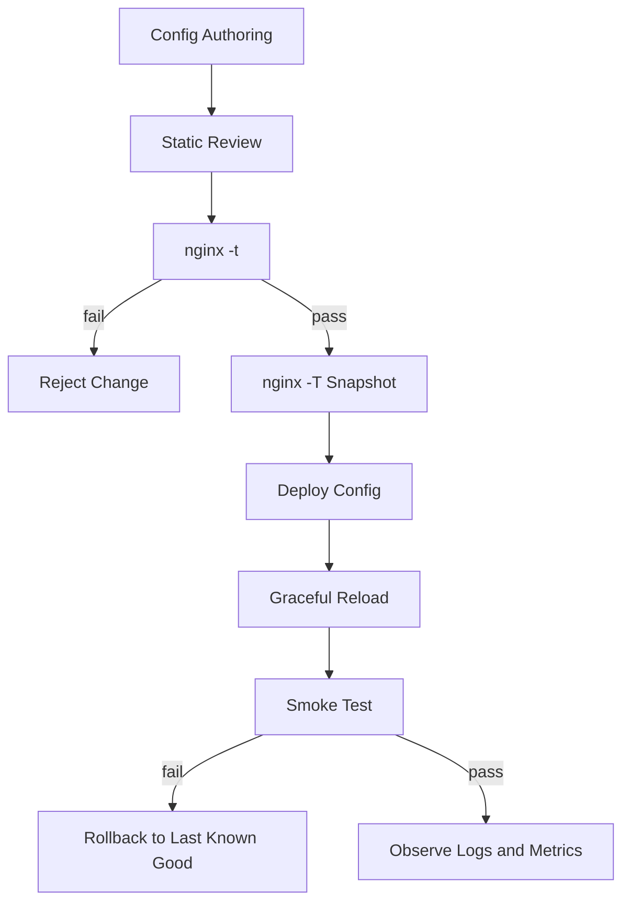
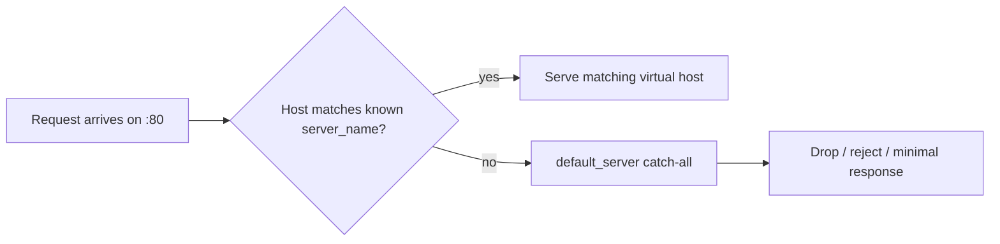
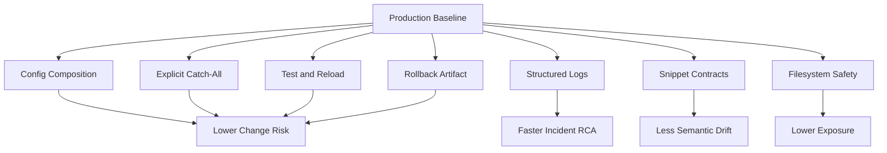

# Part 015 — Production Baseline Lab

> Goal part ini sederhana: sebelum NGINX dipakai untuk routing bisnis, TLS, cache, atau load balancing, kita harus punya **baseline skeleton** yang aman untuk dibaca, diuji, di-reload, di-rollback, dan dioperasikan saat incident.

Part sebelumnya membangun mental model: config language, context, inheritance, request pipeline, server selection, location matching, variable evaluation, layout, CLI, reload, dan batas Open Source vs Plus. Part ini menyatukan semuanya menjadi **lab baseline production**.

Kita belum akan membuat reverse proxy kompleks. Kita akan membuat fondasi yang bisa dipakai untuk seluruh seri berikutnya.

---

## 1. Apa yang sedang kita bangun?

Kita akan membangun struktur NGINX seperti ini:

```txt
/etc/nginx/
├── nginx.conf
├── conf.d/
│   ├── 00-core-http.conf
│   ├── 10-log-format.conf
│   ├── 20-security-baseline.conf
│   └── 90-default-catchall.conf
├── snippets/
│   ├── headers-security-baseline.conf
│   ├── proxy-common.conf
│   └── static-common.conf
├── sites-available/
│   └── app.example.local.conf
├── sites-enabled/
│   └── app.example.local.conf -> ../sites-available/app.example.local.conf
└── modules-enabled/
```

Di container, beberapa distro tidak memakai `sites-available` dan `sites-enabled`. Itu tidak masalah. Yang penting bukan nama foldernya, tetapi **invariant arsitekturalnya**:

1. `nginx.conf` hanya bootstrap global.
2. Default/catch-all server eksplisit.
3. Semua virtual host punya file sendiri.
4. Snippet hanya berisi fragment yang aman di-include di context tertentu.
5. Config bisa diuji dengan `nginx -t`.
6. Full generated config bisa dilihat dengan `nginx -T`.
7. Reload tidak dilakukan sebelum test lulus.
8. Rollback memakai artefak config yang sudah diketahui valid.

NGINX secara resmi memakai configuration file yang berisi directive sederhana dan block directive/context seperti `events`, `http`, `server`, dan `location`. NGINX juga mendukung perintah `nginx -t` untuk test konfigurasi dan `nginx -s reload` untuk reload konfigurasi. Lihat referensi resmi:

- https://nginx.org/en/docs/beginners_guide.html
- https://nginx.org/en/docs/switches.html
- https://nginx.org/en/docs/control.html

---

## 2. Baseline production bukan sekadar “config yang jalan”

Config yang jalan di laptop belum tentu layak production.

Production baseline harus menjawab pertanyaan berikut:

| Pertanyaan | Kenapa penting |
|---|---|
| Request tanpa `Host` valid jatuh ke mana? | Mencegah domain asing ikut dilayani oleh server block yang salah. |
| Bagaimana reload dilakukan? | Menghindari restart kasar yang memutus koneksi aktif. |
| Bagaimana rollback dilakukan? | Incident harus bisa dibalik tanpa debugging improvisasi. |
| Apakah log cukup untuk RCA? | Tanpa upstream time/status/request id, debugging 502/504 jadi spekulatif. |
| Apakah snippet bisa di-include sembarangan? | Snippet salah context bisa merusak semantics config. |
| Apakah default security header konsisten? | Header yang hilang di satu location bisa membuka celah berbeda antar path. |
| Apakah ada server default eksplisit? | Jika tidak, default server implisit bisa berubah karena urutan include. |

Mental modelnya:



Baseline yang baik membuat jalur sukses dan jalur gagal sama-sama jelas.

---

## 3. Lab environment minimal

Kita akan menulis config yang bisa dipakai di VM Linux biasa. Jika memakai container, path bisa disesuaikan.

Cek binary dan compile options:

```bash
nginx -v
nginx -V
```

`nginx -v` menunjukkan versi. `nginx -V` menunjukkan compile flags dan modul yang tersedia.

Contoh inspeksi:

```bash
nginx version: nginx/1.30.3
built with OpenSSL ...
configure arguments: --with-http_ssl_module --with-http_v2_module ...
```

Jangan menganggap modul tersedia hanya karena tutorial memakainya. Misalnya, HTTP/2, stream, realip, stub_status, dan dynamic module tertentu bergantung pada build/package.

Invariant:

```txt
A config is only portable across environments if the required modules are present in all environments.
```

---

## 4. Buat direktori baseline

```bash
sudo mkdir -p /etc/nginx/conf.d
sudo mkdir -p /etc/nginx/snippets
sudo mkdir -p /etc/nginx/sites-available
sudo mkdir -p /etc/nginx/sites-enabled
sudo mkdir -p /var/www/app.example.local/public
sudo mkdir -p /var/log/nginx
```

Buat halaman smoke test:

```bash
cat <<'HTML' | sudo tee /var/www/app.example.local/public/index.html
<!doctype html>
<html lang="en">
<head>
  <meta charset="utf-8">
  <title>NGINX Baseline</title>
</head>
<body>
  <h1>NGINX baseline works</h1>
</body>
</html>
HTML
```

Ownership tergantung distro dan deployment model. Untuk static file read-only, NGINX worker cukup butuh read permission.

Contoh sederhana:

```bash
sudo chown -R root:root /var/www/app.example.local
sudo find /var/www/app.example.local -type d -exec chmod 755 {} \;
sudo find /var/www/app.example.local -type f -exec chmod 644 {} \;
```

Jangan memberi write permission ke user worker NGINX kecuali benar-benar diperlukan. Edge tier yang bisa menulis ke document root adalah pola yang mudah berubah menjadi vulnerability.

---

## 5. `nginx.conf` sebagai bootstrap, bukan tempat semua logic

File utama:

```nginx
# /etc/nginx/nginx.conf
user nginx;
worker_processes auto;

error_log /var/log/nginx/error.log warn;
pid /run/nginx.pid;

events {
    worker_connections 1024;
}

http {
    include /etc/nginx/mime.types;
    default_type application/octet-stream;

    include /etc/nginx/conf.d/*.conf;
    include /etc/nginx/sites-enabled/*.conf;
}
```

Di beberapa distro, user worker adalah `www-data`, bukan `nginx`.

Cek:

```bash
ps aux | grep nginx
id nginx
id www-data
```

Jika user tidak ada, sesuaikan:

```nginx
user www-data;
```

Kenapa `nginx.conf` minimal?

Karena file utama harus menjadi **root composition**, bukan tempat semua policy. Jika semua logic masuk ke `nginx.conf`, maka:

1. Review menjadi berat.
2. Perubahan kecil berisiko menyentuh global config.
3. Include ordering sulit dikontrol.
4. Rollback partial lebih sulit.
5. Ownership antar tim kabur.

---

## 6. Core HTTP defaults

Buat file:

```nginx
# /etc/nginx/conf.d/00-core-http.conf

sendfile on;
tcp_nopush on;
tcp_nodelay on;

keepalive_timeout 65s;
keepalive_requests 1000;

server_tokens off;

client_max_body_size 10m;
client_body_timeout 30s;
client_header_timeout 30s;
send_timeout 30s;

types_hash_max_size 4096;
```

Penjelasan singkat:

| Directive | Tujuan baseline |
|---|---|
| `sendfile on` | Mengirim file dari kernel path lebih efisien untuk static content. |
| `tcp_nopush on` | Mengoptimalkan pengiriman packet saat `sendfile` aktif pada platform yang mendukung. |
| `tcp_nodelay on` | Mengurangi delay untuk keepalive connection. |
| `keepalive_timeout` | Membatasi koneksi idle agar worker connection tidak tertahan terlalu lama. |
| `keepalive_requests` | Membatasi jumlah request per keepalive connection. |
| `server_tokens off` | Mengurangi informasi versi di response/error page. |
| `client_max_body_size` | Membatasi body upload default. |
| timeout client | Mengurangi risiko slow client menahan resource terlalu lama. |

Nilai di atas bukan angka sakral. Ia adalah starting point. Production tuning harus melihat workload, latency budget, upstream behavior, dan traffic shape.

Invariant:

```txt
Every timeout is a resource ownership decision.
```

Timeout terlalu pendek membuat false failure. Timeout terlalu panjang membuat resource tertahan saat upstream/client buruk.

---

## 7. Log format yang berguna untuk root cause analysis

Buat file:

```nginx
# /etc/nginx/conf.d/10-log-format.conf

log_format main_ext escape=json
    '{'
      '"time":"$time_iso8601",'
      '"remote_addr":"$remote_addr",'
      '"request_id":"$request_id",'
      '"host":"$host",'
      '"method":"$request_method",'
      '"uri":"$uri",'
      '"args":"$args",'
      '"status":$status,'
      '"body_bytes_sent":$body_bytes_sent,'
      '"request_time":$request_time,'
      '"referer":"$http_referer",'
      '"user_agent":"$http_user_agent",'
      '"upstream_addr":"$upstream_addr",'
      '"upstream_status":"$upstream_status",'
      '"upstream_response_time":"$upstream_response_time"'
    '}';

access_log /var/log/nginx/access.log main_ext;
```

Kenapa JSON log?

Karena access log adalah event stream. Jika log masih plain text tanpa struktur, query incident menjadi parsing darurat.

Field minimal yang berguna:

| Field | Untuk apa |
|---|---|
| `$request_id` | Korelasi antar log edge dan upstream. |
| `$host` | Membuktikan server block mana yang menerima request. |
| `$uri` | URI normalized setelah processing tertentu. |
| `$request_time` | Total waktu request di NGINX. |
| `$upstream_addr` | Backend yang dipilih. |
| `$upstream_status` | Status dari upstream. |
| `$upstream_response_time` | Waktu response upstream. |

Pada static server murni, upstream field akan kosong. Itu normal. Format tetap dipakai agar migration ke reverse proxy tidak perlu mengganti pipeline observability.

---

## 8. Security baseline snippet

Buat snippet:

```nginx
# /etc/nginx/snippets/headers-security-baseline.conf

add_header X-Content-Type-Options "nosniff" always;
add_header Referrer-Policy "strict-origin-when-cross-origin" always;
add_header X-Frame-Options "SAMEORIGIN" always;
add_header Permissions-Policy "geolocation=(), microphone=(), camera=()" always;
```

Jangan otomatis menambahkan HSTS di baseline global jika belum yakin seluruh domain/subdomain wajib HTTPS. HSTS adalah policy browser jangka panjang. Salah rollout bisa mengunci client ke HTTPS ketika environment belum siap.

Kita akan bahas HSTS mendalam di part TLS.

Catatan penting tentang `add_header`: NGINX punya aturan inheritance spesifik. Jika `add_header` didefinisikan di level lebih dalam, header dari level atas tidak otomatis bergabung seperti yang sering diasumsikan. Ini salah satu alasan security header lebih aman di-include sebagai snippet eksplisit pada server/location yang benar-benar diinginkan.

---

## 9. Static common snippet

Buat snippet:

```nginx
# /etc/nginx/snippets/static-common.conf

location = /favicon.ico {
    log_not_found off;
    access_log off;
}

location = /robots.txt {
    log_not_found off;
    access_log off;
}

location ~ /\. {
    deny all;
}
```

Kenapa block hidden files?

Karena banyak leak production berasal dari file yang “tidak dimaksudkan untuk diserve” tetapi berada di bawah document root:

```txt
.env
.git/config
.git/HEAD
.ssh/
.htpasswd
backup.sql
```

NGINX tidak tahu mana file sensitif jika kita menaruhnya di document root. Baseline yang benar tetap: **jangan taruh secret di document root**. Deny rule hanya defense-in-depth.

---

## 10. Proxy common snippet untuk future use

Walaupun part ini belum membuat reverse proxy, kita siapkan snippet umum yang nanti dipakai.

```nginx
# /etc/nginx/snippets/proxy-common.conf

proxy_http_version 1.1;

proxy_set_header Host $host;
proxy_set_header X-Request-ID $request_id;
proxy_set_header X-Real-IP $remote_addr;
proxy_set_header X-Forwarded-For $proxy_add_x_forwarded_for;
proxy_set_header X-Forwarded-Proto $scheme;

proxy_connect_timeout 5s;
proxy_send_timeout 30s;
proxy_read_timeout 30s;
```

Kenapa belum dipakai?

Karena snippet harus punya **context contract**.

Snippet ini aman untuk `location` yang melakukan `proxy_pass`, bukan untuk static file location. Jika snippet tidak punya contract, tim lain bisa memasukkannya ke tempat salah dan menciptakan config yang valid secara syntax tetapi salah secara semantics.

Tambahkan komentar di setiap snippet:

```nginx
# Context: inside location that proxies HTTP traffic.
# Do not include in static-only locations.
```

---

## 11. Default catch-all server

Buat file:

```nginx
# /etc/nginx/conf.d/90-default-catchall.conf

server {
    listen 80 default_server;
    server_name _;

    access_log /var/log/nginx/default-catchall.access.log main_ext;

    return 444;
}
```

`444` adalah status khusus NGINX untuk menutup koneksi tanpa response. Gunakan hati-hati. Untuk environment yang membutuhkan visibility lebih jelas, pakai `return 404;` atau `return 421;` tergantung policy.

Tujuan catch-all:

1. Domain asing tidak diam-diam masuk ke app utama.
2. Request tanpa Host valid tidak dilayani sebagai app.
3. Misconfigured DNS lebih mudah terlihat.
4. Urutan include tidak menjadi default behavior implisit.

Mental model:



Dalam dokumentasi request processing, NGINX memilih server berdasarkan address/port lalu `Host` terhadap `server_name`; jika tidak ada yang cocok, request diproses oleh default server untuk address/port tersebut. Karena itu default server sebaiknya eksplisit, bukan kebetulan urutan file.

Referensi:

- https://nginx.org/en/docs/http/request_processing.html

---

## 12. App virtual host baseline

Buat file:

```nginx
# /etc/nginx/sites-available/app.example.local.conf

server {
    listen 80;
    server_name app.example.local;

    root /var/www/app.example.local/public;
    index index.html;

    include /etc/nginx/snippets/headers-security-baseline.conf;
    include /etc/nginx/snippets/static-common.conf;

    access_log /var/log/nginx/app.example.local.access.log main_ext;
    error_log /var/log/nginx/app.example.local.error.log warn;

    location / {
        try_files $uri $uri/ =404;
    }
}
```

Enable site:

```bash
sudo ln -s ../sites-available/app.example.local.conf /etc/nginx/sites-enabled/app.example.local.conf
```

Test:

```bash
sudo nginx -t
```

Jika lulus:

```bash
sudo nginx -s reload
```

Smoke test tanpa DNS:

```bash
curl -i -H 'Host: app.example.local' http://127.0.0.1/
```

Ekspektasi:

```txt
HTTP/1.1 200 OK
Server: nginx
X-Content-Type-Options: nosniff
Referrer-Policy: strict-origin-when-cross-origin
...
```

Test host asing:

```bash
curl -i -H 'Host: unknown.example.local' http://127.0.0.1/
```

Jika memakai `return 444`, curl biasanya menunjukkan empty reply / connection closed.

---

## 13. Kenapa `try_files $uri $uri/ =404`?

Untuk baseline static server, kita ingin mapping jelas:

```txt
URL path -> filesystem candidate -> response
```

`try_files $uri $uri/ =404;` berarti:

1. Coba file sesuai URI.
2. Coba directory sesuai URI dan index handling.
3. Jika tidak ada, return 404.

Contoh:

| Request | Kandidat |
|---|---|
| `/` | `/var/www/app.example.local/public/` lalu `index.html` |
| `/app.js` | `/var/www/app.example.local/public/app.js` |
| `/docs/` | `/var/www/app.example.local/public/docs/` lalu index jika ada |
| `/missing` | 404 |

Untuk SPA, fallback biasanya menjadi `/index.html`, tetapi itu bukan baseline universal. SPA fallback akan dibahas di part berikutnya karena mudah menutupi 404 asset yang sebenarnya bug.

---

## 14. Validate generated config dengan `nginx -T`

`nginx -t` menjawab: “apakah config valid?”

`nginx -T` menjawab: “apa config final setelah include?”

Jalankan:

```bash
sudo nginx -T > /tmp/nginx.rendered.conf
```

Cari server block:

```bash
grep -n "server_name app.example.local" /tmp/nginx.rendered.conf
grep -n "default_server" /tmp/nginx.rendered.conf
```

Di CI, snapshot `nginx -T` berguna untuk mendeteksi include ordering dan duplikasi server block.

Minimal check:

```bash
sudo nginx -t
sudo nginx -T >/tmp/nginx.rendered.conf
```

Lebih baik lagi: jalankan container ephemeral dengan config yang sama.

```bash
docker run --rm \
  -v "$PWD/nginx:/etc/nginx:ro" \
  nginx:stable \
  nginx -t
```

Tetapi hati-hati: image official mungkin punya modul/path/user yang berbeda dari server production. CI harus menggunakan image/package yang semirip mungkin dengan runtime production.

---

## 15. Safe reload workflow

Reload yang aman bukan:

```bash
sudo systemctl restart nginx
```

Restart menghentikan proses dan memulai ulang. Untuk banyak kasus, itu memutus koneksi aktif. Reload lebih aman karena NGINX master process memvalidasi config baru, mencoba membuka log dan listen socket baru, lalu hanya jika sukses menjalankan worker baru dan graceful shutdown worker lama.

Workflow:

```bash
sudo nginx -t && sudo nginx -s reload
```

Untuk systemd:

```bash
sudo nginx -t && sudo systemctl reload nginx
```

Perbedaan penting:

| Action | Dampak |
|---|---|
| `reload` | Re-read config, graceful worker transition. |
| `restart` | Stop/start service, lebih disruptif. |
| `quit` | Graceful shutdown. |
| `stop` | Fast shutdown. |
| `reopen` | Reopen log files, dipakai setelah log rotation. |

Referensi resmi:

- https://nginx.org/en/docs/control.html
- https://docs.nginx.com/nginx/admin-guide/basic-functionality/runtime-control/

---

## 16. Rollback workflow

Production change tanpa rollback path adalah hutang operasional.

Simpan artefak config sebelum deploy:

```bash
sudo tar -C /etc -czf /var/backups/nginx-config-$(date +%Y%m%d%H%M%S).tar.gz nginx
```

Deploy config baru:

```bash
sudo nginx -t
sudo nginx -s reload
```

Jika smoke test gagal:

```bash
sudo tar -C /etc -xzf /var/backups/nginx-config-YYYYMMDDHHMMSS.tar.gz
sudo nginx -t
sudo nginx -s reload
```

Rollback harus memakai config yang sudah diketahui valid. Jangan rollback sambil mengedit manual di tengah incident kecuali tidak ada pilihan lain.

Invariant:

```txt
Rollback is not editing backward. Rollback is restoring a known-good artifact.
```

---

## 17. Smoke test checklist

Setelah reload:

```bash
curl -i -H 'Host: app.example.local' http://127.0.0.1/
curl -i -H 'Host: app.example.local' http://127.0.0.1/missing
curl -i -H 'Host: unknown.example.local' http://127.0.0.1/
```

Cek log:

```bash
sudo tail -n 20 /var/log/nginx/app.example.local.access.log
sudo tail -n 20 /var/log/nginx/app.example.local.error.log
sudo tail -n 20 /var/log/nginx/default-catchall.access.log
```

Cek proses:

```bash
ps -o pid,ppid,user,cmd -C nginx
```

Cek listening socket:

```bash
ss -ltnp | grep nginx
```

Cek full config:

```bash
sudo nginx -T | less
```

---

## 18. Failure injection kecil

Baseline belum terbukti sampai kita melihat ia gagal dengan cara yang aman.

### 18.1 Syntax error

Tambahkan sementara directive rusak:

```nginx
broken_directive on;
```

Test:

```bash
sudo nginx -t
```

Ekspektasi: test gagal dan reload tidak dijalankan.

### 18.2 Duplicate listen/default ambiguity

Tambahkan server lain dengan `listen 80 default_server;`.

Ekspektasi: NGINX menolak duplicate default server untuk address/port yang sama.

### 18.3 Wrong root path

Ubah root ke path tidak ada:

```nginx
root /var/www/does-not-exist;
```

`nginx -t` bisa tetap lulus karena syntax benar. Smoke test harus menangkap 404/403.

Ini pelajaran penting:

```txt
nginx -t validates syntax and config loadability, not business correctness.
```

---

## 19. Anti-pattern yang harus dihindari sejak baseline

### Anti-pattern 1 — Semua config di satu file

Ini terlihat sederhana sampai jumlah domain, upstream, cert, dan rule bertambah.

Dampaknya:

- Review sulit.
- Blast radius besar.
- Merge conflict sering.
- Tidak ada ownership boundary.

### Anti-pattern 2 — Tidak punya default server eksplisit

NGINX tetap akan memilih default. Jika Anda tidak menetapkannya, urutan include bisa menentukan behavior.

### Anti-pattern 3 — Snippet tanpa context contract

Snippet `proxy_set_header` di-include ke static location. Snippet `add_header` override header parent. Snippet `root` mengubah path secara diam-diam. Semua ini valid secara syntax tetapi berbahaya secara semantics.

### Anti-pattern 4 — Restart untuk semua perubahan

Restart sebagai default operation membuat edge tier lebih rapuh. Biasakan test lalu reload.

### Anti-pattern 5 — Log minimal default

Default access log cukup untuk traffic kecil, tetapi lemah untuk incident multi-upstream. Gunakan log format yang dari awal siap RCA.

---

## 20. Production baseline checklist

Gunakan checklist ini sebelum lanjut ke reverse proxy, cache, TLS, atau Kubernetes.

```txt
[ ] nginx -V sudah dicek dan modul penting diketahui
[ ] nginx.conf minimal sebagai root composition
[ ] default_server eksplisit tersedia
[ ] app server block punya server_name eksplisit
[ ] root document tidak berisi secret/source/internal file
[ ] hidden file access diblokir
[ ] access log punya request_id, host, request_time, upstream fields
[ ] error log dipisah minimal per app penting
[ ] nginx -t masuk workflow wajib
[ ] nginx -T bisa diambil sebagai rendered snapshot
[ ] reload memakai graceful reload, bukan restart default
[ ] rollback artifact tersedia
[ ] smoke test mencakup known host, unknown host, missing path
[ ] snippet punya context contract
```

---

## 21. Mini decision record

Tuliskan keputusan baseline sebagai ADR kecil:

```md
# ADR: NGINX Production Baseline

## Decision
We use a composition-based NGINX configuration layout with explicit catch-all server, structured logs, test-before-reload workflow, and known-good config rollback.

## Rationale
NGINX is an edge component. Misconfiguration affects availability, security, and routing correctness. The baseline optimizes for safe change, inspectability, and incident rollback.

## Consequences
- More files than minimal examples.
- Requires CI validation.
- Snippet context must be documented.
- Teams must avoid ad-hoc edits directly in production.
```

Engineering maturity tidak terlihat dari jumlah directive, tetapi dari kemampuan menjelaskan, menguji, dan membalik perubahan.

---

## 22. Ringkasan mental model

Baseline production NGINX adalah kombinasi dari:

1. **Composition** — config dipecah berdasarkan ownership dan semantics.
2. **Explicit default** — request asing punya jalur jelas.
3. **Safe reload** — test sebelum reload, reload sebelum restart.
4. **Rollback artifact** — kembali ke known-good state.
5. **Observability from day one** — log siap RCA sebelum incident.
6. **Context discipline** — snippet tidak boleh ambigu.
7. **Filesystem safety** — document root hanya berisi file yang memang boleh diserve.



---

## 23. Apa yang akan dipakai di part berikutnya

Part berikutnya membuka Phase 2: static web server dan filesystem semantics.

Kita akan membedah:

- bagaimana NGINX mengubah URI menjadi path;
- perbedaan `root` dan `alias`;
- bagaimana `index` bekerja;
- bagaimana `try_files` melakukan internal redirect;
- kenapa static serving bisa menjadi security boundary;
- kenapa SPA fallback sering menyembunyikan bug asset dan API routing.

Baseline lab ini akan menjadi fondasi untuk semua konfigurasi berikutnya.

