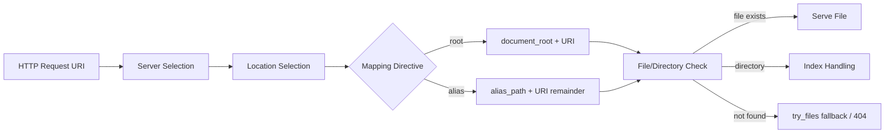
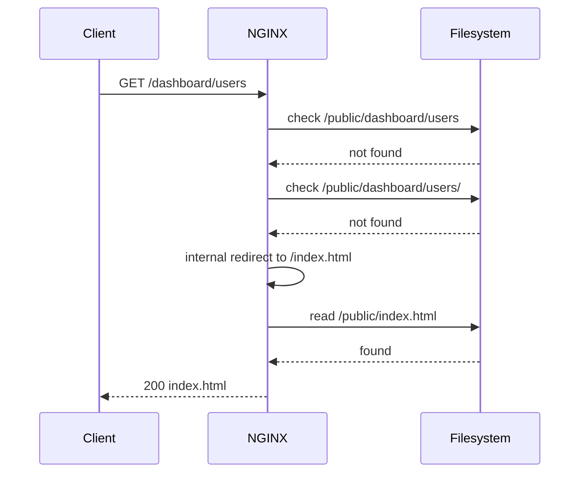

# Part 016 — Static File Serving Internals

> Static serving terlihat sederhana: request masuk, file keluar. Di production, ini adalah boundary antara URL publik dan filesystem internal. Salah memahami `root`, `alias`, `index`, atau `try_files` bisa menghasilkan 404 misterius, source leak, cache salah, atau routing yang menutupi bug.

Part ini membahas NGINX sebagai static file server dari level mekanisme, bukan copy-paste config.

Referensi resmi utama:

- NGINX static content guide: https://docs.nginx.com/nginx/admin-guide/web-server/serving-static-content/
- NGINX core module directives: https://nginx.org/en/docs/http/ngx_http_core_module.html
- NGINX beginner guide static serving: https://nginx.org/en/docs/beginners_guide.html

---

## 1. Mental model: URI bukan path

Kesalahan pertama: menganggap URL path sama dengan filesystem path.

Request:

```txt
GET /assets/app.js HTTP/1.1
Host: app.example.local
```

URI-nya:

```txt
/assets/app.js
```

Filesystem path bisa menjadi:

```txt
/var/www/app.example.local/public/assets/app.js
```

Tapi itu hanya benar jika config memetakannya begitu.

Static serving adalah fungsi mapping:

```txt
(server, location, uri, directive) -> candidate filesystem path -> response
```

Diagram:



NGINX tidak “mencari file di seluruh server”. Ia menjalankan mapping berdasarkan server block dan location yang terpilih.

---

## 2. Baseline static server

Kita mulai dari konfigurasi paling eksplisit:

```nginx
server {
    listen 80;
    server_name static.example.local;

    root /var/www/static.example.local/public;
    index index.html;

    location / {
        try_files $uri $uri/ =404;
    }
}
```

Struktur file:

```txt
/var/www/static.example.local/public/
├── index.html
├── assets/
│   ├── app.js
│   └── app.css
└── docs/
    └── index.html
```

Mapping:

| Request | Candidate path | Result |
|---|---|---|
| `/` | `/var/www/static.example.local/public/` + index | `index.html` |
| `/assets/app.js` | `/var/www/static.example.local/public/assets/app.js` | file served |
| `/docs/` | `/var/www/static.example.local/public/docs/` + index | `docs/index.html` |
| `/missing` | `/var/www/static.example.local/public/missing` | 404 |

Di sini `root` berada di `server` context, lalu dipakai oleh `location /` karena inherited.

---

## 3. `root`: append full URI to document root

Directive `root` menetapkan root directory untuk request. Path file dibentuk dengan menambahkan URI ke nilai root.

Contoh:

```nginx
location /images/ {
    root /data/www;
}
```

Request:

```txt
/images/logo.png
```

Path:

```txt
/data/www/images/logo.png
```

Formula:

```txt
root_path + uri
```

Maka:

```txt
/data/www + /images/logo.png
= /data/www/images/logo.png
```

Ini terlihat obvious, tetapi banyak bug muncul karena engineer berharap `/images/` diganti oleh `/data/www/`. Itu bukan `root`; itu `alias`.

---

## 4. `alias`: replace matched location prefix

Directive `alias` mengganti prefix location dengan path alias.

Contoh:

```nginx
location /images/ {
    alias /data/images/;
}
```

Request:

```txt
/images/logo.png
```

Path:

```txt
/data/images/logo.png
```

Formula mental:

```txt
alias_path + uri_remainder_after_matched_location
```

Jika matched prefix adalah `/images/`, remainder untuk `/images/logo.png` adalah `logo.png`.

Maka:

```txt
/data/images/ + logo.png
= /data/images/logo.png
```

Perbedaan dengan `root`:

| Directive | Location | Request | Result path |
|---|---|---|---|
| `root /data/www;` | `/images/` | `/images/logo.png` | `/data/www/images/logo.png` |
| `alias /data/images/;` | `/images/` | `/images/logo.png` | `/data/images/logo.png` |

`root` mempertahankan URI penuh. `alias` mengganti prefix location.

---

## 5. Trailing slash adalah bagian dari contract

Ini config yang benar:

```nginx
location /media/ {
    alias /srv/media/;
}
```

Request:

```txt
/media/cat.jpg
```

Path:

```txt
/srv/media/cat.jpg
```

Sekarang lihat ini:

```nginx
location /media/ {
    alias /srv/media;
}
```

Request yang sama bisa membentuk path yang tidak intuitif, bergantung pada cara remainder digabung.

Rule praktis:

```txt
If location ends with /, alias should normally end with /.
```

Contoh aman:

```nginx
location /downloads/ {
    alias /mnt/object-export/downloads/;
    try_files $uri =404;
}
```

Namun dengan `alias`, penggunaan `$uri` di `try_files` bisa membingungkan karena `$uri` masih URI request, bukan remainder path. Kita akan bahas lebih dalam di part berikutnya tentang `root` vs `alias` footguns. Untuk part ini, cukup pegang invariant:

```txt
alias changes path construction semantics. Do not treat it like root.
```

---

## 6. `index`: directory request bukan file request

Directive `index` menentukan file index untuk request yang mengarah ke directory.

Config:

```nginx
root /var/www/site/public;
index index.html index.htm;

location / {
    try_files $uri $uri/ =404;
}
```

Request:

```txt
/docs/
```

Jika `/var/www/site/public/docs/` adalah directory, NGINX mencari:

```txt
/var/www/site/public/docs/index.html
/var/www/site/public/docs/index.htm
```

Mental model:

```txt
URI /docs/ -> directory candidate -> index candidate list -> serve first found
```

Penting:

- `index` bukan fallback universal.
- `index` berlaku saat request mengarah ke directory.
- Untuk SPA fallback, gunakan `try_files ... /index.html`, bukan berharap `index` menyelesaikan semua route.

---

## 7. `try_files`: existence check + internal fallback

Directive `try_files` mengecek keberadaan file berdasarkan urutan argumen dan memproses fallback terakhir jika tidak ada yang cocok.

Config:

```nginx
location / {
    try_files $uri $uri/ =404;
}
```

Untuk request `/assets/app.js`, NGINX mencoba:

```txt
$uri   -> /assets/app.js
$uri/  -> /assets/app.js/
=404   -> jika tidak ada
```

Dengan `root /var/www/site/public;`, kandidat filesystem:

```txt
/var/www/site/public/assets/app.js
/var/www/site/public/assets/app.js/
```

Untuk request `/docs`, jika `/docs` adalah directory, `$uri/` dapat mengarah ke `/docs/` dan memicu index handling.

`try_files` sering dipakai untuk:

1. static file direct hit;
2. directory index;
3. SPA fallback;
4. PHP front controller;
5. named location fallback;
6. custom error response.

Tapi setiap pola punya semantics berbeda.

---

## 8. `try_files` fallback variants

### 8.1 Return status

```nginx
location / {
    try_files $uri $uri/ =404;
}
```

Ini paling jelas untuk static site biasa.

### 8.2 Fallback ke file

```nginx
location / {
    try_files $uri $uri/ /index.html;
}
```

Ini umum untuk SPA.

Tetapi hati-hati:

```txt
/assets/missing.js -> /index.html
```

Browser menerima HTML saat mengharapkan JavaScript. Ini bisa membuat error aneh di frontend.

Pola lebih aman:

```nginx
location /assets/ {
    try_files $uri =404;
}

location / {
    try_files $uri $uri/ /index.html;
}
```

### 8.3 Fallback ke named location

```nginx
location / {
    try_files $uri $uri/ @app;
}

location @app {
    proxy_pass http://backend;
}
```

Ini bagus ketika static hit dilayani NGINX, dynamic miss dikirim ke app.

### 8.4 Fallback ke URI internal

```nginx
location / {
    try_files $uri $uri/ /fallback.html;
}
```

Fallback terakhir diproses sebagai internal redirect ke URI tersebut.

Mental model:



---

## 9. Static serving dan security boundary

NGINX static serving expose filesystem melalui HTTP. Maka document root harus dianggap public boundary.

Bad layout:

```txt
/var/www/app/
├── .env
├── .git/
├── composer.json
├── package.json
├── src/
├── storage/
└── public/
    └── index.html
```

Jika `root /var/www/app;`, file internal bisa terekspose.

Better layout:

```txt
/var/www/app/
├── releases/
│   └── 20260706-001/
│       ├── public/
│       │   ├── index.html
│       │   └── assets/
│       └── internal/
└── current -> releases/20260706-001
```

Config:

```nginx
root /var/www/app/current/public;
```

Invariant:

```txt
The NGINX document root should point at the smallest directory that is intentionally public.
```

Deny rules membantu, tetapi layout yang benar lebih kuat daripada blocklist.

---

## 10. File permission failure: 404 vs 403 vs 500-ish confusion

Static serving bukan hanya “file ada atau tidak”. NGINX worker harus bisa traverse directory dan read file.

Untuk melayani:

```txt
/var/www/site/public/assets/app.js
```

Worker butuh:

| Path | Permission needed |
|---|---|
| `/var` | execute/traverse on directory |
| `/var/www` | execute/traverse |
| `/var/www/site` | execute/traverse |
| `/var/www/site/public` | execute/traverse |
| `/var/www/site/public/assets` | execute/traverse |
| `app.js` | read |

Contoh cek:

```bash
sudo -u nginx test -r /var/www/site/public/assets/app.js && echo readable
```

Jika user worker adalah `www-data`:

```bash
sudo -u www-data test -r /var/www/site/public/assets/app.js && echo readable
```

Debug:

```bash
namei -l /var/www/site/public/assets/app.js
```

Error log sering lebih jujur daripada access log:

```bash
tail -f /var/log/nginx/error.log
```

Common symptoms:

| Symptom | Kemungkinan |
|---|---|
| 403 directory index forbidden | Directory diminta, index tidak ada, autoindex off. |
| 403 permission denied | Worker tidak bisa traverse/read path. |
| 404 file not found | Mapping path salah atau file tidak ada. |
| 200 HTML untuk JS file | SPA fallback menutupi missing asset. |

---

## 11. Directory listing dan `autoindex`

Secara default, directory listing tidak seharusnya dinyalakan untuk public app kecuali ada kebutuhan eksplisit.

Contoh yang harus dihindari:

```nginx
location /downloads/ {
    root /var/www/site/public;
    autoindex on;
}
```

`autoindex on` membuat NGINX menampilkan daftar isi directory. Ini berguna untuk repository internal sederhana, tetapi berbahaya untuk app public.

Pola aman:

```nginx
location /downloads/ {
    root /var/www/site/public;
    autoindex off;
    try_files $uri =404;
}
```

Jika butuh directory listing internal, pisahkan host dan access control:

```nginx
server {
    listen 80;
    server_name internal-files.example.local;

    allow 10.0.0.0/8;
    deny all;

    root /srv/internal-files;
    autoindex on;
}
```

Jangan campur public app dan internal file browser dalam server block yang sama tanpa alasan kuat.

---

## 12. Internal redirects: kenapa response bisa berasal dari location lain

NGINX bisa melakukan internal redirect melalui beberapa mekanisme:

- `try_files` fallback ke URI;
- `error_page` ke URI;
- `rewrite ... last`;
- index resolution tertentu;
- named location.

Contoh:

```nginx
location / {
    try_files $uri /index.html;
}

location = /index.html {
    add_header X-Entry-Point spa always;
}
```

Request:

```txt
/dashboard
```

Alur:

```txt
/dashboard -> not found -> internal redirect /index.html -> exact location /index.html
```

Artinya header, auth, cache, atau logging bisa berubah karena request akhirnya diproses oleh location lain.

Invariant:

```txt
When using internal redirects, reason about the final location, not only the initial location.
```

Ini penting saat nanti kita membahas `error_page`, SPA routing, PHP front controller, dan reverse proxy fallback.

---

## 13. MIME type: file benar, header salah

Static file serving tidak selesai saat file ditemukan. Response juga harus punya `Content-Type` benar.

Biasanya config utama berisi:

```nginx
include /etc/nginx/mime.types;
default_type application/octet-stream;
```

Jika `mime.types` tidak di-include, file `.js`, `.css`, `.svg`, `.wasm`, dan lain-lain bisa dikirim dengan type salah.

Contoh test:

```bash
curl -I -H 'Host: static.example.local' http://127.0.0.1/assets/app.js
```

Ekspektasi:

```txt
Content-Type: application/javascript
```

Untuk file modern seperti `.wasm`, pastikan MIME tersedia di package/distro. Jika tidak, tambahkan eksplisit:

```nginx
types {
    application/wasm wasm;
}
```

Namun jangan mengganti seluruh `types` tanpa sadar. Block `types` di context lebih dalam dapat mengubah mapping untuk scope tersebut.

---

## 14. Conditional request: `ETag` dan `Last-Modified`

Static file server yang baik membantu browser dan CDN melakukan revalidation.

Umumnya NGINX dapat mengirim `Last-Modified` berdasarkan mtime file dan mendukung conditional request. `ETag` juga tersedia lewat directive `etag` pada core module.

Contoh:

```nginx
etag on;
```

Test:

```bash
curl -I http://127.0.0.1/assets/app.js -H 'Host: static.example.local'
```

Lihat:

```txt
Last-Modified: ...
ETag: ...
```

Lalu revalidate:

```bash
curl -I \
  -H 'Host: static.example.local' \
  -H 'If-None-Match: "etag-value"' \
  http://127.0.0.1/assets/app.js
```

Jika cocok, response bisa `304 Not Modified`.

Caching akan dibahas mendalam pada phase content cache. Untuk sekarang, pahami bahwa static serving juga membawa contract cache.

---

## 15. Cache-Control untuk static assets

Static assets biasanya terbagi dua:

1. **fingerprinted assets**: `/assets/app.8f3a1c.js`
2. **entry documents**: `/index.html`

Fingerprint asset boleh long cache:

```nginx
location /assets/ {
    try_files $uri =404;
    add_header Cache-Control "public, max-age=31536000, immutable" always;
}
```

HTML entry point biasanya tidak boleh immutable:

```nginx
location = /index.html {
    add_header Cache-Control "no-cache" always;
}
```

Kenapa?

Jika `index.html` dicache terlalu lama, user bisa terus menunjuk asset lama atau manifest lama. Jika asset fingerprint dicache pendek, kita kehilangan manfaat build pipeline.

Mental model:

```txt
HTML is a pointer. Fingerprinted assets are content-addressed blobs.
```

---

## 16. Static release layout dengan symlink

Untuk deploy static app, gunakan release directory:

```txt
/var/www/app/
├── releases/
│   ├── 20260706-120000/
│   │   └── public/
│   └── 20260706-130000/
│       └── public/
└── current -> releases/20260706-130000
```

Config:

```nginx
root /var/www/app/current/public;
```

Deploy:

```bash
sudo ln -sfn /var/www/app/releases/20260706-130000 /var/www/app/current
sudo nginx -t
sudo nginx -s reload
```

Untuk static file murni, reload mungkin tidak selalu diperlukan jika root path tetap sama dan symlink berubah. Tetapi reload tetap sering dilakukan untuk menyinkronkan operational event, log, dan config validation. Yang penting: pahami apa yang berubah.

Rollback:

```bash
sudo ln -sfn /var/www/app/releases/20260706-120000 /var/www/app/current
sudo nginx -t
sudo nginx -s reload
```

Invariant:

```txt
A static release should be immutable. current is the movable pointer.
```

---

## 17. SPA static server: benar tetapi tidak universal

Pola umum:

```nginx
server {
    listen 80;
    server_name spa.example.local;

    root /var/www/spa/current/public;
    index index.html;

    location /assets/ {
        try_files $uri =404;
        add_header Cache-Control "public, max-age=31536000, immutable" always;
    }

    location / {
        try_files $uri $uri/ /index.html;
    }
}
```

Bagus untuk client-side route:

```txt
/dashboard/users -> /index.html
```

Tapi jangan gunakan untuk API path:

```nginx
location /api/ {
    proxy_pass http://backend;
}

location / {
    try_files $uri $uri/ /index.html;
}
```

Jika `/api/` tidak dipisah, missing API route bisa menjadi `index.html`, bukan 404/502 yang benar.

Pola eksplisit:

```nginx
location /api/ {
    return 501;
}

location /assets/ {
    try_files $uri =404;
}

location / {
    try_files $uri $uri/ /index.html;
}
```

Di production, `/api/` tentu diproxy ke backend. Untuk static-only baseline, lebih baik sengaja return `501` daripada diam-diam fallback ke SPA.

---

## 18. Multiple apps under one host

Contoh:

```txt
https://example.local/admin/
https://example.local/customer/
```

Config root-based:

```nginx
server {
    listen 80;
    server_name example.local;
    root /var/www/example/public;

    location /admin/ {
        try_files $uri $uri/ /admin/index.html;
    }

    location /customer/ {
        try_files $uri $uri/ /customer/index.html;
    }
}
```

Filesystem:

```txt
/var/www/example/public/
├── admin/
│   ├── index.html
│   └── assets/
└── customer/
    ├── index.html
    └── assets/
```

Jika filesystem berbeda:

```nginx
location /admin/ {
    alias /srv/apps/admin/public/;
    try_files $uri $uri/ /admin/index.html;
}
```

Ini mulai rawan karena fallback `/admin/index.html` adalah URI, bukan path alias langsung. Part berikutnya akan membahas alias footgun ini secara khusus.

Prinsip:

```txt
Prefer root when URL structure mirrors filesystem structure.
Use alias only when URL prefix intentionally maps to a different filesystem subtree.
```

---

## 19. Debugging static file path

Saat 404/403, jangan menebak. Lacak mapping.

Checklist:

```txt
[ ] server_name yang benar terpilih?
[ ] location yang benar terpilih?
[ ] root/alias berasal dari context mana?
[ ] URI normal setelah rewrite/internal redirect apa?
[ ] path kandidat di filesystem apa?
[ ] file/directory ada?
[ ] permission traverse/read cukup?
[ ] index file ada?
[ ] try_files fallback ke mana?
[ ] error log mengatakan apa?
```

Command praktis:

```bash
curl -i -H 'Host: static.example.local' http://127.0.0.1/assets/app.js
sudo nginx -T | sed -n '/server_name static.example.local/,/}/p'
namei -l /var/www/static.example.local/public/assets/app.js
sudo tail -n 50 /var/log/nginx/error.log
```

Untuk debugging location, sementara tambahkan header:

```nginx
location /assets/ {
    add_header X-Debug-Location assets always;
    try_files $uri =404;
}

location / {
    add_header X-Debug-Location root always;
    try_files $uri $uri/ =404;
}
```

Jangan biarkan debug header permanen di public production jika mengungkap detail internal.

---

## 20. Production static server reference config

Contoh konfigurasi static site non-SPA:

```nginx
server {
    listen 80;
    server_name static.example.local;

    root /var/www/static.example.local/current/public;
    index index.html;

    include /etc/nginx/snippets/headers-security-baseline.conf;

    access_log /var/log/nginx/static.example.local.access.log main_ext;
    error_log /var/log/nginx/static.example.local.error.log warn;

    location ~ /\. {
        deny all;
    }

    location /assets/ {
        try_files $uri =404;
        add_header Cache-Control "public, max-age=31536000, immutable" always;
    }

    location = /index.html {
        try_files $uri =404;
        add_header Cache-Control "no-cache" always;
    }

    location / {
        try_files $uri $uri/ =404;
    }
}
```

Contoh konfigurasi SPA:

```nginx
server {
    listen 80;
    server_name spa.example.local;

    root /var/www/spa.example.local/current/public;
    index index.html;

    include /etc/nginx/snippets/headers-security-baseline.conf;

    access_log /var/log/nginx/spa.example.local.access.log main_ext;
    error_log /var/log/nginx/spa.example.local.error.log warn;

    location ~ /\. {
        deny all;
    }

    location /assets/ {
        try_files $uri =404;
        add_header Cache-Control "public, max-age=31536000, immutable" always;
    }

    location /api/ {
        return 501;
    }

    location = /index.html {
        try_files $uri =404;
        add_header Cache-Control "no-cache" always;
    }

    location / {
        try_files $uri $uri/ /index.html;
    }
}
```

---

## 21. Common bugs and root causes

| Bug | Root cause | Fix |
|---|---|---|
| `/images/logo.png` 404 dengan `root /data/images` di `location /images/` | `root` append full URI, menghasilkan `/data/images/images/logo.png` | Pakai `root /data` atau `alias /data/images/` |
| SPA route jalan, asset missing dapat HTML | Fallback `/index.html` terlalu luas | Pisahkan `/assets/` dengan `try_files $uri =404` |
| 403 pada directory | Index tidak ada atau autoindex off | Tambahkan index file atau return 404 eksplisit |
| File ada tapi 403 | Permission traverse/read kurang | Perbaiki directory execute bit dan file read bit |
| Security header hilang di assets | `add_header` inheritance berubah karena location punya add_header sendiri | Include header snippet di location atau susun ulang policy |
| Wrong app served for unknown host | Tidak ada catch-all default server | Tambahkan `default_server` eksplisit |
| `.env` bisa diakses | Document root terlalu tinggi atau deny rule tidak ada | Root ke `public/`, block hidden files |

---

## 22. Latihan kecil

### Exercise 1 — Predict path

Config:

```nginx
root /srv/www;
location /img/ {
    root /data;
}
```

Request:

```txt
/img/a.png
```

Path?

Jawaban:

```txt
/data/img/a.png
```

### Exercise 2 — Predict path with alias

Config:

```nginx
location /img/ {
    alias /data/images/;
}
```

Request:

```txt
/img/a.png
```

Path?

Jawaban:

```txt
/data/images/a.png
```

### Exercise 3 — SPA fallback bug

Config:

```nginx
location / {
    try_files $uri $uri/ /index.html;
}
```

Request:

```txt
/assets/missing.js
```

Jika file tidak ada, response apa?

Jawaban:

```txt
/index.html
```

Itu mungkin `200 text/html`, bukan 404 JavaScript. Untuk asset path, pisahkan location.

---

## 23. Static file serving invariant

Pegang invariant ini:

```txt
1. URI is not filesystem path.
2. root appends the full URI.
3. alias replaces the matched location prefix.
4. index applies to directory requests.
5. try_files checks candidates in order and then internally falls back.
6. Internal redirect means the final location may differ from the initial one.
7. Document root must be the smallest intentionally public directory.
8. Static fallback must not hide missing assets or API failures.
```

Jika invariant ini kuat, config static NGINX tidak lagi terasa seperti magic.

---

## 24. Penutup

Static serving adalah tempat terbaik untuk belajar NGINX karena semua mekanisme dasarnya terlihat jelas:

- server selection;
- location matching;
- directive inheritance;
- URI normalization;
- filesystem mapping;
- internal redirect;
- response header policy;
- cache contract;
- logging dan debugging.

Part berikutnya akan membedah **`root` vs `alias` footguns** secara lebih tajam, karena di situlah banyak konfigurasi yang “kelihatan benar” berubah menjadi bug production.

