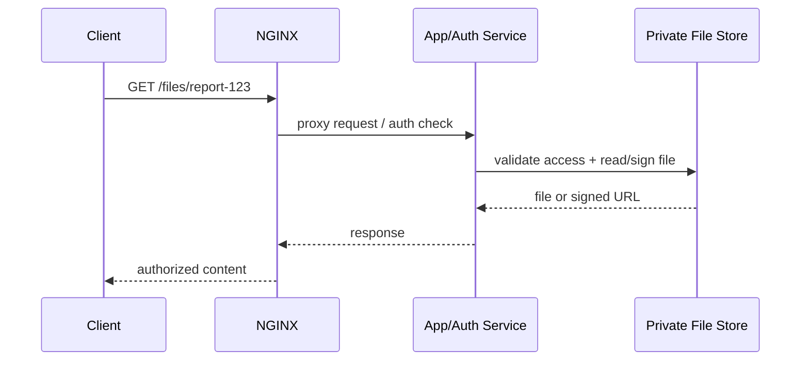

# Part 017 — `root` vs `alias`: Footguns, Path Traversal Risk, dan Layout Aman

> `root` dan `alias` sama-sama terlihat seperti “folder tempat file berada”. Itu framing yang salah. `root` adalah document root yang ditambah URI penuh. `alias` adalah replacement untuk bagian URI yang match pada location. Perbedaan kecil ini adalah sumber 404 misterius, source leak, file exposure, dan config yang susah diaudit.

Part ini membangun mental model yang presisi: bagaimana URI dipetakan menjadi path, kapan `root` lebih aman, kapan `alias` diperlukan, dan bagaimana membuat layout static file yang tidak membuka boundary internal.

Referensi resmi utama:

- NGINX core module directives: https://nginx.org/en/docs/http/ngx_http_core_module.html
- NGINX static content guide: https://docs.nginx.com/nginx/admin-guide/web-server/serving-static-content/
- NGINX beginner guide: https://nginx.org/en/docs/beginners_guide.html

---

## 1. Masalah sebenarnya: public namespace vs private filesystem

Nginx static serving selalu menjembatani dua namespace:

```txt
Public URL namespace:
  /assets/app.js
  /downloads/report.pdf
  /media/user-123/avatar.png

Private filesystem namespace:
  /srv/www/app/releases/2026-07-06/public/assets/app.js
  /srv/private/download-bundles/report.pdf
  /mnt/object-cache/user-123/avatar.png
```

Tujuan production config bukan hanya “bisa serve file”. Tujuannya:

1. URL publik tidak membocorkan struktur filesystem.
2. URI tidak bisa keluar dari direktori yang diizinkan.
3. File internal seperti source map, backup, `.env`, `.git`, template, atau config tidak ikut tersaji.
4. Kesalahan deploy menghasilkan 404/403 yang mudah didiagnosis, bukan silent fallback ke file yang salah.
5. Mapping bisa dibaca saat incident tanpa harus menjalankan seluruh aplikasi.

`root` dan `alias` adalah dua primitive mapping yang berbeda.

---

## 2. Definisi operasional

### 2.1 `root`

Dengan `root`, NGINX membentuk path dengan cara:

```txt
filesystem_path = root_value + full_request_uri
```

Contoh:

```nginx
server {
    root /srv/www/app/public;

    location /assets/ {
        try_files $uri =404;
    }
}
```

Request:

```txt
GET /assets/app.js
```

Candidate path:

```txt
/srv/www/app/public/assets/app.js
```

`/assets/app.js` tetap dipakai penuh.

### 2.2 `alias`

Dengan `alias`, NGINX mengganti bagian URI yang match pada `location` dengan path `alias`.

```nginx
location /assets/ {
    alias /srv/cdn/app-assets/;
    try_files $uri =404;
}
```

Request:

```txt
GET /assets/app.js
```

Intuisi mapping yang diinginkan:

```txt
/assets/        -> /srv/cdn/app-assets/
/assets/app.js -> /srv/cdn/app-assets/app.js
```

Jadi `alias` cocok ketika URL prefix berbeda dari direktori fisik.

Diagram:

```mermaid
flowchart TD
    A[Request URI /assets/app.js] --> B{Directive}
    B -->|root /srv/www/public| C[/srv/www/public + /assets/app.js]
    B -->|alias /srv/cdn/app-assets/| D[/srv/cdn/app-assets/ + app.js]
    C --> E[/srv/www/public/assets/app.js]
    D --> F[/srv/cdn/app-assets/app.js]
```

---

## 3. Rule of thumb yang benar

Gunakan `root` sebagai default. Gunakan `alias` hanya saat URL prefix tidak sama dengan filesystem prefix.

| Situasi | Pilihan | Alasan |
|---|---|---|
| Satu web app dengan `public/` sebagai document root | `root` | URL path dan filesystem layout sejajar |
| `/assets/*` sebenarnya disimpan di `/srv/cdn/app-assets/*` | `alias` | URL prefix harus diganti |
| Multi-app di subpath tetapi direktori fisik berbeda | `alias` atau subdomain | `root` akan memaksa layout mengikuti URL |
| SPA fallback ke `/index.html` | biasanya `root` | lebih mudah menjaga fallback tetap di document root |
| File user upload dari mount terpisah | `alias` dengan whitelist ketat | namespace publik berbeda dari storage path |
| PHP/FastCGI campur static alias | hindari | mapping script path sering salah dan berbahaya |

Kesalahan umum adalah memakai `alias` sebagai “root khusus location”. Itu bisa bekerja, tapi sering membuat `try_files`, trailing slash, regex location, dan internal redirect menjadi sulit diprediksi.

---

## 4. Trailing slash bukan kosmetik

Perhatikan dua config berikut.

### 4.1 Benar: prefix location dan alias sama-sama pakai slash

```nginx
location /assets/ {
    alias /srv/app-assets/;
    try_files $uri =404;
}
```

Mapping yang diinginkan:

```txt
/assets/app.js -> /srv/app-assets/app.js
```

### 4.2 Berbahaya: slash tidak konsisten

```nginx
location /assets/ {
    alias /srv/app-assets;
    try_files $uri =404;
}
```

Secara mental, ini rawan menghasilkan path concatenation yang tidak terlihat jelas saat review.

Standar production:

```txt
Jika location prefix berakhir dengan `/`, alias juga harus berakhir dengan `/`.
```

Gunakan invariant ini dalam review config. Jangan mengandalkan “kelihatannya jalan”.

---

## 5. Footgun: `root` di dalam location yang seharusnya `alias`

Misal file asset ada di:

```txt
/srv/app/current/public-assets/app.js
```

URL publik yang diinginkan:

```txt
/assets/app.js
```

Config salah:

```nginx
location /assets/ {
    root /srv/app/current/public-assets;
    try_files $uri =404;
}
```

Request:

```txt
/assets/app.js
```

Candidate path:

```txt
/srv/app/current/public-assets/assets/app.js
```

Ada `/assets/` ganda.

Config benar:

```nginx
location /assets/ {
    alias /srv/app/current/public-assets/;
    try_files $uri =404;
}
```

Mapping:

```txt
/assets/app.js -> /srv/app/current/public-assets/app.js
```

---

## 6. Footgun: `alias` di location tanpa trailing slash

Config:

```nginx
location /img {
    alias /data/images/;
}
```

Problem: `/img` juga bisa match URI seperti:

```txt
/img
/img/logo.png
/imgbackup/logo.png
```

Karena `/img` adalah prefix location, bukan segment boundary.

Lebih aman:

```nginx
location /img/ {
    alias /data/images/;
    try_files $uri =404;
}
```

Tambahkan redirect canonical jika perlu:

```nginx
location = /img {
    return 301 /img/;
}

location /img/ {
    alias /data/images/;
    try_files $uri =404;
}
```

Invariant:

```txt
Prefix static directory sebaiknya menggunakan segment boundary eksplisit: /prefix/ bukan /prefix.
```

---

## 7. Footgun: regex location + alias tanpa capture eksplisit

Regex location dengan `alias` membutuhkan kehati-hatian tinggi.

Contoh buruk:

```nginx
location ~ ^/users/.+/avatar\.png$ {
    alias /srv/avatars/;
}
```

Apa nama file fisiknya? Tidak jelas dari config. Tidak ada capture yang membentuk path.

Lebih eksplisit:

```nginx
location ~ ^/users/([a-zA-Z0-9_-]+)/avatar\.png$ {
    alias /srv/avatars/$1.png;
}
```

Namun pattern seperti ini tetap harus dibatasi ketat:

1. Capture hanya karakter aman.
2. Jangan gunakan `.*` untuk path yang masuk filesystem.
3. Jangan izinkan slash kecuali memang diperlukan.
4. Jangan gabungkan dengan fallback dinamis yang bisa membuka file tak terduga.

Untuk production, prefer desain URL yang tidak perlu regex alias:

```nginx
location /avatars/ {
    alias /srv/avatars/;
    try_files $uri =404;
}
```

Lalu aplikasi menghasilkan URL:

```txt
/avatars/user-123.png
```

Bukan:

```txt
/users/user-123/avatar.png
```

Bila struktur URL harus indah, pertimbangkan reverse proxy ke service yang mengotorisasi akses file, bukan static alias regex.

---

## 8. `try_files` dengan `alias`: jangan asal copy `$uri`

Banyak contoh memakai:

```nginx
try_files $uri $uri/ =404;
```

Ini aman dan natural ketika menggunakan `root`.

Dengan `alias`, hasilnya bisa membingungkan karena `$uri` adalah URI request, bukan “sisa path setelah alias”. Pada banyak kasus prefix location tetap dipotong oleh mekanisme alias, tetapi rule mental yang aman adalah:

```txt
Dalam location alias, jaga try_files sesederhana mungkin dan test mapping aktual dengan nginx -T + real request.
```

Contoh pattern aman untuk file static biasa:

```nginx
location /downloads/ {
    alias /srv/downloads/public/;
    try_files $uri =404;
}
```

Contoh pattern yang mulai rawan:

```nginx
location /downloads/ {
    alias /srv/downloads/public/;
    try_files $uri $uri/ /fallback.html;
}
```

Masalahnya: `/fallback.html` adalah URI untuk internal redirect, bukan path relatif alias. Jika ada `root` di server, fallback bisa pindah ke document root lain.

Lebih eksplisit:

```nginx
location /downloads/ {
    alias /srv/downloads/public/;
    try_files $uri =404;
}

location = /download-not-found.html {
    root /srv/www/errors;
    internal;
}
```

Atau gunakan named location:

```nginx
location /downloads/ {
    alias /srv/downloads/public/;
    try_files $uri @download_not_found;
}

location @download_not_found {
    return 404;
}
```

---

## 9. Path traversal: apa yang NGINX bantu, apa yang tetap tanggung jawab kita

Nginx melakukan normalisasi URI tertentu, tetapi jangan desain security dengan asumsi “server pasti menyelamatkan kita”. Static file exposure biasanya muncul dari kombinasi:

1. Root terlalu tinggi.
2. Alias menunjuk ke direktori yang juga berisi file internal.
3. Regex capture terlalu longgar.
4. Symlink mengarah keluar dari boundary.
5. Fallback mengubah 404 menjadi file lain.
6. Directory listing aktif.
7. Build artifact menyertakan file yang tidak seharusnya public.

Contoh root terlalu tinggi:

```nginx
server {
    root /srv/app/current;

    location / {
        try_files $uri $uri/ =404;
    }
}
```

Jika `/srv/app/current` berisi:

```txt
/srv/app/current/
├── public/
├── src/
├── config/
├── .env
├── package.json
└── node_modules/
```

Maka document root terlalu luas. Config yang benar:

```nginx
server {
    root /srv/app/current/public;

    location / {
        try_files $uri $uri/ =404;
    }
}
```

Security invariant:

```txt
Document root harus menunjuk ke direktori yang isinya memang boleh public, bukan ke root project.
```

---

## 10. Dotfiles dan hidden files

Walaupun root sudah benar, deploy artifact kadang menyertakan:

```txt
.env
.git/
.gitignore
.npmrc
.htpasswd
.DS_Store
```

Tambahkan deny rule eksplisit:

```nginx
location ~ /\. {
    deny all;
}
```

Namun hati-hati: regex location bisa override prefix location jika tidak menggunakan `^~`. Untuk static subtree yang sangat sensitif, gabungkan dengan location design yang tegas.

Contoh:

```nginx
location ^~ /assets/ {
    root /srv/app/current/public;
    try_files $uri =404;
}

location ~ /\. {
    deny all;
}
```

`^~` membuat regex location tidak mengambil alih request yang sudah match prefix `/assets/`. Ini bisa baik atau buruk tergantung policy. Jika `/assets/.env` tidak boleh diserve, jangan menaruh file itu di public asset sejak awal. Rule deny adalah guardrail, bukan pengganti build hygiene.

---

## 11. Symlink: boundary yang sering dilupakan

Misal:

```txt
/srv/www/public/downloads -> /srv/private/reports
```

Jika NGINX mengikuti symlink dan permission mengizinkan, file private bisa tersaji lewat static path.

Gunakan prinsip:

```txt
Static serving boundary harus divalidasi di filesystem layout, permission, dan deploy pipeline; bukan hanya di nginx.conf.
```

Checklist:

1. `find public -type l -ls` saat CI/CD.
2. Jangan izinkan symlink ke `/etc`, `/home`, `/var/lib/app-private`, atau mount internal.
3. Pertimbangkan `disable_symlinks` untuk boundary tertentu bila sesuai dengan environment.
4. Jalankan NGINX worker dengan user non-root.
5. Pastikan permission membaca hanya subtree yang memang public.

Contoh defensive directive:

```nginx
location / {
    root /srv/app/current/public;
    disable_symlinks if_not_owner from=/srv/app/current/public;
    try_files $uri $uri/ =404;
}
```

Jangan aktifkan tanpa test. Directive ini bisa punya dampak performa dan kompatibilitas terhadap deployment berbasis symlink release.

---

## 12. Layout production yang aman

### 12.1 Layout buruk

```txt
/srv/app/current/
├── app.jar
├── application.yml
├── public/
├── secrets/
├── logs/
└── tmp/
```

Config buruk:

```nginx
root /srv/app/current;
```

Mengapa buruk:

1. Root terlalu tinggi.
2. Secret/config/log/tmp berada di bawah document root.
3. Kesalahan location bisa expose file internal.

### 12.2 Layout lebih aman

```txt
/srv/app/
├── releases/
│   └── 2026-07-06-120000/
│       ├── app.jar
│       ├── config/
│       └── public/
│           ├── index.html
│           └── assets/
├── current -> /srv/app/releases/2026-07-06-120000
└── shared/
    ├── logs/
    └── uploads-private/
```

Config:

```nginx
server {
    listen 80;
    server_name app.example.local;

    root /srv/app/current/public;

    location / {
        try_files $uri $uri/ =404;
    }
}
```

Dengan layout ini, bahkan jika URL meminta `/config/application.yml`, candidate path menjadi:

```txt
/srv/app/current/public/config/application.yml
```

File tersebut tidak ada karena config berada di luar `public/`.

---

## 13. Pattern: satu document root, banyak static prefix

Jika semua file public berada di satu root:

```txt
/srv/app/current/public/
├── index.html
├── assets/
├── images/
└── docs/
```

Config paling mudah diaudit:

```nginx
server {
    root /srv/app/current/public;

    location /assets/ {
        try_files $uri =404;
        access_log off;
        expires 1y;
        add_header Cache-Control "public, immutable";
    }

    location /images/ {
        try_files $uri =404;
    }

    location /docs/ {
        try_files $uri $uri/ =404;
    }

    location / {
        try_files $uri $uri/ =404;
    }
}
```

Ini lebih mudah daripada banyak `alias` karena semua URI tetap berada di document root yang sama.

---

## 14. Pattern: mount eksternal untuk uploads public

Misal user-uploaded public files disimpan di mount berbeda:

```txt
/mnt/public-uploads/
└── avatars/
    └── user-123.png
```

URL:

```txt
/uploads/avatars/user-123.png
```

Config:

```nginx
location /uploads/ {
    alias /mnt/public-uploads/;
    try_files $uri =404;

    types {
        image/png png;
        image/jpeg jpg jpeg;
        image/webp webp;
    }
    default_type application/octet-stream;

    add_header X-Content-Type-Options nosniff always;
}
```

Tapi jangan berhenti di config. Upload pipeline harus memastikan:

1. Filename dinormalisasi.
2. Ekstensi sesuai MIME yang diizinkan.
3. File executable/script tidak masuk directory public.
4. Metadata privacy sudah dibersihkan bila diperlukan.
5. Antivirus/content scanning dilakukan jika threat model membutuhkannya.

NGINX bukan upload sanitizer. Ia hanya menyajikan file yang ada.

---

## 15. Pattern: private files melalui authorization service

Jika file memerlukan authorization per user, jangan langsung expose folder private dengan `alias` lalu berharap `secure_link`/header checks sederhana cukup.

Lebih aman:



Atau gunakan `X-Accel-Redirect` dengan internal location:

```nginx
location /download/ {
    proxy_pass http://app_backend;
}

location /internal-files/ {
    internal;
    alias /srv/private-files/;
}
```

Aplikasi mengembalikan header:

```txt
X-Accel-Redirect: /internal-files/report-123.pdf
```

Keuntungan:

1. URL internal tidak bisa diakses langsung client karena `internal`.
2. Authorization tetap di aplikasi.
3. NGINX tetap efisien melayani file setelah akses diputuskan.

Risiko:

1. Aplikasi harus membangun path internal secara aman.
2. Jangan membiarkan user mengontrol nilai `X-Accel-Redirect` mentah.
3. Location internal harus menunjuk ke subtree yang benar-benar private-readonly.

---

## 16. `alias` dan upstream fallback: jangan campur tanpa boundary

Config rawan:

```nginx
location /media/ {
    alias /mnt/media/;
    try_files $uri @app;
}

location @app {
    proxy_pass http://app_backend;
}
```

Masalah:

1. File missing berubah menjadi request aplikasi.
2. Aplikasi mungkin mengembalikan HTML 200 untuk path media yang hilang.
3. Cache/CDN bisa menyimpan response salah.
4. Debugging sulit karena missing file tidak tampak sebagai 404.

Lebih jelas:

```nginx
location /media/ {
    alias /mnt/media/;
    try_files $uri =404;
}
```

Jika memang perlu dynamic image generation:

```nginx
location /media/ {
    alias /mnt/media/;
    try_files $uri @generate_media;
}

location @generate_media {
    proxy_pass http://media_generator;
    proxy_set_header X-Original-URI $request_uri;
}
```

Dan tambahkan invariant:

```txt
Hanya /media/* yang masuk media_generator. Jangan fallback ke app umum.
```

---

## 17. Diagnostics: cara membuktikan mapping

Saat 404 atau file salah tersaji, jangan menebak. Buktikan mapping.

### 17.1 Print config efektif

```bash
nginx -T
```

Cari:

```bash
nginx -T 2>&1 | grep -nE 'server_name|location|root|alias|try_files'
```

### 17.2 Gunakan custom log sementara

```nginx
log_format static_debug '$remote_addr host=$host uri=$uri request_uri=$request_uri '
                        'document_root=$document_root realpath_root=$realpath_root '
                        'request_filename=$request_filename status=$status';

access_log /var/log/nginx/static-debug.log static_debug;
```

Variable penting:

| Variable | Kegunaan |
|---|---|
| `$uri` | URI normalisasi yang dipakai NGINX secara internal |
| `$request_uri` | URI asli termasuk query string |
| `$document_root` | root/alias efektif untuk request tertentu |
| `$realpath_root` | root setelah resolusi symlink |
| `$request_filename` | path file berdasarkan root/alias dan URI |

Jangan biarkan debug log verbose permanen di high-traffic environment.

### 17.3 Test file dan permission sebagai user NGINX

Cari user worker:

```bash
ps -eo user,comm | grep nginx
```

Test akses:

```bash
sudo -u nginx test -r /srv/app/current/public/assets/app.js && echo readable
```

Pada Debian/Ubuntu user bisa `www-data`, pada RHEL/CentOS bisa `nginx`. Jangan hardcode asumsi.

---

## 18. Decision matrix

| Pertanyaan | Jika jawabannya ya | Keputusan |
|---|---|---|
| Apakah URL path sejajar dengan folder public? | Ya | Gunakan `root` |
| Apakah URL prefix harus diganti ke folder lain? | Ya | Gunakan `alias` |
| Apakah file perlu authorization user-specific? | Ya | Jangan direct static; gunakan app + `X-Accel-Redirect` atau signed URL |
| Apakah location memakai regex? | Ya | Hindari `alias` kecuali capture benar-benar eksplisit |
| Apakah fallback ke app umum diperlukan? | Biasanya tidak | Prefer `=404` untuk static subtree |
| Apakah folder mengandung file non-public? | Ya | Jangan jadikan root/alias target |
| Apakah ada symlink? | Ya | Audit symlink dan permission |

---

## 19. Review checklist untuk PR nginx.conf

Gunakan checklist ini saat review:

```txt
[ ] root tidak menunjuk ke root project, home directory, atau folder yang berisi secret/config/source.
[ ] alias hanya dipakai ketika URL prefix berbeda dari filesystem prefix.
[ ] location prefix alias berakhir dengan slash dan alias path juga berakhir dengan slash.
[ ] Tidak ada location /prefix tanpa slash yang bisa match /prefix-bad.
[ ] Regex location dengan alias memakai capture ketat, bukan .*
[ ] Static subtree tidak fallback ke app umum kecuali ada alasan eksplisit.
[ ] try_files di static subtree berakhir dengan =404 atau named location yang jelas.
[ ] Dotfiles tidak ikut tersaji.
[ ] Directory listing tidak aktif kecuali benar-benar disengaja.
[ ] Symlink public subtree diaudit.
[ ] Worker user tidak punya read permission ke folder private yang tidak perlu.
[ ] Test curl mencakup happy path, missing file, dotfile, prefix confusion, dan traversal-like URI.
```

---

## 20. Lab: membuktikan `root` vs `alias`

Buat struktur:

```bash
sudo mkdir -p /srv/lab/root/public/assets
sudo mkdir -p /srv/lab/alias-assets

echo 'root asset'  | sudo tee /srv/lab/root/public/assets/app.txt
echo 'alias asset' | sudo tee /srv/lab/alias-assets/app.txt
```

Config:

```nginx
server {
    listen 8080;
    server_name _;

    root /srv/lab/root/public;

    location /root-assets/ {
        # Intentionally wrong for demonstration.
        root /srv/lab/root/public;
        try_files $uri =404;
    }

    location /assets/ {
        try_files $uri =404;
    }

    location /cdn/ {
        alias /srv/lab/alias-assets/;
        try_files $uri =404;
    }
}
```

Test:

```bash
curl -i http://localhost:8080/assets/app.txt
curl -i http://localhost:8080/cdn/app.txt
curl -i http://localhost:8080/root-assets/app.txt
```

Expected:

```txt
/assets/app.txt      -> 200 root asset
/cdn/app.txt         -> 200 alias asset
/root-assets/app.txt -> likely 404, because root appends /root-assets/app.txt
```

Tambahkan debug log dari section 17 untuk melihat `$request_filename`.

---

## 21. Anti-pattern catalog

### Anti-pattern 1: root project sebagai root web

```nginx
root /srv/app/current;
```

Lebih baik:

```nginx
root /srv/app/current/public;
```

### Anti-pattern 2: alias tanpa slash symmetry

```nginx
location /files/ {
    alias /mnt/files;
}
```

Lebih baik:

```nginx
location /files/ {
    alias /mnt/files/;
    try_files $uri =404;
}
```

### Anti-pattern 3: prefix tanpa segment boundary

```nginx
location /api {
    proxy_pass http://api;
}
```

Lebih jelas:

```nginx
location = /api {
    return 301 /api/;
}

location /api/ {
    proxy_pass http://api;
}
```

Prinsip ini juga berlaku pada static alias.

### Anti-pattern 4: static miss fallback ke SPA global

```nginx
location /assets/ {
    try_files $uri /index.html;
}
```

Ini bisa membuat `/assets/missing.js` mengembalikan HTML 200, lalu browser gagal dengan error MIME.

Lebih baik:

```nginx
location /assets/ {
    try_files $uri =404;
}

location / {
    try_files $uri $uri/ /index.html;
}
```

### Anti-pattern 5: regex alias dengan `.*`

```nginx
location ~ ^/files/(.*)$ {
    alias /srv/files/$1;
}
```

Lebih baik:

```nginx
location /files/ {
    alias /srv/files-public/;
    try_files $uri =404;
}
```

Atau jika harus regex, batasi karakter:

```nginx
location ~ ^/files/([a-zA-Z0-9_-]+)\.pdf$ {
    alias /srv/files-public/$1.pdf;
}
```

---

## 22. Mental model akhir

Pikirkan `root` dan `alias` seperti dua fungsi berbeda:

```txt
root(uri)  = root_path + uri
alias(uri) = alias_path + uri_after_matched_location_prefix
```

Jika kita hanya mengingat satu hal:

```txt
root mempertahankan URI penuh.
alias mengganti prefix location.
```

Konsekuensi production-nya besar:

1. `root` lebih mudah diaudit untuk satu document root.
2. `alias` kuat untuk mount eksternal, tapi harus dipakai dengan boundary yang ketat.
3. Static subtree sebaiknya deterministik: file ada → serve, file tidak ada → 404.
4. Authorization bukan tugas static alias.
5. Layout filesystem adalah security control utama.

---

## 23. Ringkasan

`root` dan `alias` bukan variasi sintaks. Mereka membentuk path dengan aturan berbeda. Top 1% engineer tidak menghafal snippet; mereka bisa melihat config dan langsung menurunkan mapping URI ke filesystem, lalu menilai apakah ada leak, ambiguity, fallback salah, atau operational risk.

Gunakan `root` untuk document root normal. Gunakan `alias` hanya ketika URL prefix harus diganti ke direktori lain. Jaga slash symmetry, hindari regex longgar, jangan expose folder private, dan test `$request_filename` saat debugging.

Part berikutnya membahas `try_files`, internal redirects, named locations, dan SPA routing secara lebih dalam. Di sana kita akan melihat bahwa fallback bukan sekadar “kalau file tidak ada, buka index.html”; fallback adalah perubahan control flow di dalam request pipeline NGINX.
