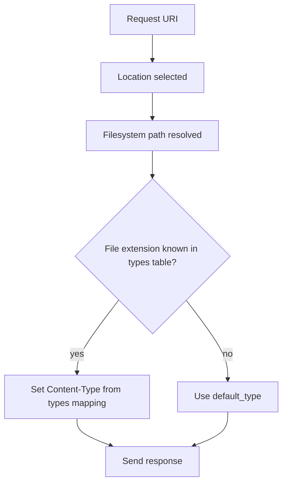

# Part 019 — MIME Types, `default_type`, dan Content Negotiation

> Browser tidak hanya membaca bytes. Browser membaca bytes melalui kontrak metadata. `Content-Type` yang salah bisa membuat JavaScript gagal load, CSS diabaikan, download berubah menjadi render, SVG menjadi attack surface, JSON disalahartikan, atau browser melakukan MIME sniffing yang membuka celah security. Di NGINX, MIME type bukan detail kosmetik; ia adalah bagian dari protocol contract.

Part ini membahas bagaimana NGINX menentukan `Content-Type`, apa fungsi `mime.types`, kapan `default_type` dipakai, bagaimana `types` block mengubah mapping, dan bagaimana merancang content negotiation yang aman tanpa menganggap NGINX seperti framework aplikasi.

Referensi resmi utama:

- NGINX core module `types`, `default_type`, `try_files`, `add_header`: https://nginx.org/en/docs/http/ngx_http_core_module.html
- NGINX static content guide: https://docs.nginx.com/nginx/admin-guide/web-server/serving-static-content/
- NGINX beginner guide static serving: https://nginx.org/en/docs/beginners_guide.html

---

## 1. Mental model: `Content-Type` adalah contract, bukan label

Ketika NGINX melayani static file, ia harus mengirim response seperti:

```http
HTTP/1.1 200 OK
Content-Type: text/css
Content-Length: 10432
Cache-Control: public, max-age=31536000, immutable

body bytes...
```

`Content-Type` menjawab pertanyaan:

```txt
"bytes ini harus ditafsirkan sebagai apa?"
```

Bukan:

```txt
"nama file ini kelihatannya apa?"
```

NGINX biasanya menentukan MIME type dari extension file. Mapping extension → MIME type diambil dari `types` table, umumnya melalui file `mime.types`.

Alur sederhananya:



Kalau extension tidak dikenali, NGINX memakai `default_type`.

Default bawaan NGINX untuk `default_type` adalah:

```nginx
default_type text/plain;
```

Namun banyak production config mengubahnya menjadi:

```nginx
default_type application/octet-stream;
```

Ini bukan sekadar preferensi. Perbedaannya penting:

| Default | Dampak |
|---|---|
| `text/plain` | Unknown file bisa dirender sebagai text di browser. Ini lebih ramah debugging tetapi bisa membuka accidental exposure. |
| `application/octet-stream` | Unknown file diperlakukan sebagai binary/download-like. Ini biasanya lebih defensif untuk static asset hosting. |

Mental model production:

```txt
known extension     -> explicit Content-Type
unknown extension   -> safe default, usually octet-stream
sensitive extension -> deny, not merely change MIME type
```

---

## 2. Baseline MIME config

Baseline yang umum:

```nginx
http {
    include       /etc/nginx/mime.types;
    default_type  application/octet-stream;

    server {
        listen 80;
        server_name static.example.com;

        root /srv/www/static;

        location / {
            try_files $uri =404;
        }
    }
}
```

Artinya:

1. NGINX memuat mapping dari `/etc/nginx/mime.types`.
2. Jika extension ditemukan, gunakan mapping itu.
3. Jika extension tidak ditemukan, gunakan `application/octet-stream`.
4. Jika file tidak ada, kembalikan 404.

Jangan menaruh `default_type` sebagai pengganti `mime.types`.

Buruk:

```nginx
http {
    default_type text/html;
}
```

Konsekuensi:

- `.css` bisa dikirim sebagai HTML jika tidak ada `types` mapping.
- `.js` bisa ditolak browser karena strict MIME checking.
- `.json` bisa dirender sebagai HTML/text.
- Unknown files terlihat aman padahal tidak diklasifikasi dengan benar.

Lebih baik:

```nginx
http {
    include       mime.types;
    default_type  application/octet-stream;
}
```

---

## 3. `types` block: table lokal, bukan runtime condition

Directive `types` mendefinisikan mapping extension ke MIME type.

Contoh:

```nginx
types {
    text/html                  html htm;
    text/css                   css;
    application/javascript     js mjs;
    application/json           json;
    image/svg+xml              svg svgz;
    application/wasm           wasm;
}
```

Bentuk mentalnya:

```txt
extension -> media type
```

Bukan:

```txt
path -> media type
client -> media type
Accept header -> media type
```

`types` bisa ditempatkan di beberapa context seperti `http`, `server`, dan `location`. Semakin dalam context-nya, semakin lokal efeknya.

Contoh override di satu location:

```nginx
server {
    root /srv/www/app;

    location /downloads/ {
        types { }
        default_type application/octet-stream;
        try_files $uri =404;
    }
}
```

`types { }` kosong berarti: jangan gunakan mapping extension biasa di location ini. Semua file di `/downloads/` akan jatuh ke `default_type application/octet-stream`.

Ini berguna untuk download area, tetapi berbahaya jika digunakan sembarangan.

---

## 4. MIME correctness untuk web modern

Beberapa type yang penting untuk static application:

| Extension | MIME type yang umum/benar | Catatan |
|---|---|---|
| `.html` | `text/html` | Entry point dokumen. |
| `.css` | `text/css` | Browser biasanya strict. |
| `.js` | `application/javascript` | Hindari legacy ambiguity. |
| `.mjs` | `application/javascript` | Module script butuh MIME JS valid. |
| `.json` | `application/json` | API/static manifest. |
| `.map` | `application/json` | Source map; pertimbangkan jangan publish di prod. |
| `.svg` | `image/svg+xml` | Bisa mengandung script/link; perlakukan sebagai aktif-ish content. |
| `.wasm` | `application/wasm` | Required untuk WebAssembly streaming compile. |
| `.webmanifest` | `application/manifest+json` | PWA manifest. |
| `.avif` | `image/avif` | Pastikan mapping tersedia di distro lama. |
| `.webp` | `image/webp` | Pastikan mapping tersedia. |
| `.woff2` | `font/woff2` | Font modern. |
| `.ttf` | `font/ttf` atau `application/font-sfnt` | Mapping bervariasi. |
| `.wasm.gz` | Bergantung strategi | Jangan hanya mengandalkan double extension. |

Masalah production sering muncul karena `mime.types` bawaan OS tertinggal dari kebutuhan asset modern. Distro lama bisa tidak mengenali `.wasm`, `.mjs`, `.avif`, atau `.webmanifest`.

Strategi aman:

```nginx
http {
    include mime.types;

    types {
        application/javascript     mjs;
        application/wasm           wasm;
        application/manifest+json  webmanifest;
        image/avif                 avif;
        font/woff2                 woff2;
    }

    default_type application/octet-stream;
}
```

Namun perhatikan: mendefinisikan `types` di context yang sama dapat mengganti/menambah tergantung cara config digabung. Untuk menghindari ambiguity, banyak team lebih memilih membuat file `mime.override.types` yang eksplisit dan diuji melalui smoke test.

---

## 5. MDX/static docs special case

Untuk situs dokumentasi modern, file yang dilayani bisa meliputi:

```txt
/index.html
/assets/app.abc123.js
/assets/app.abc123.css
/assets/chunk.def456.mjs
/assets/icon.svg
/assets/app.wasm
/manifest.webmanifest
/robots.txt
/sitemap.xml
```

Contract yang diinginkan:

```txt
HTML              -> text/html
JS/MJS            -> application/javascript
CSS               -> text/css
SVG               -> image/svg+xml
WASM              -> application/wasm
manifest          -> application/manifest+json
robots/sitemap    -> text/plain / application/xml
unknown           -> application/octet-stream or 404
```

Production smoke test:

```bash
curl -sI https://docs.example.com/ | grep -i '^content-type:'
curl -sI https://docs.example.com/assets/app.js | grep -i '^content-type:'
curl -sI https://docs.example.com/assets/app.css | grep -i '^content-type:'
curl -sI https://docs.example.com/app.wasm | grep -i '^content-type:'
curl -sI https://docs.example.com/manifest.webmanifest | grep -i '^content-type:'
```

Expected:

```txt
Content-Type: text/html
Content-Type: application/javascript
Content-Type: text/css
Content-Type: application/wasm
Content-Type: application/manifest+json
```

Invariant:

```txt
No frontend asset should depend on browser MIME sniffing to work.
```

---

## 6. `X-Content-Type-Options: nosniff`

Browser historically tried to infer content type from bytes when header looked suspicious. This is called MIME sniffing.

For production static sites, you normally want:

```nginx
add_header X-Content-Type-Options nosniff always;
```

Why?

```txt
If Content-Type is wrong, fail closed instead of guessing.
```

This changes failure mode:

| Without `nosniff` | With `nosniff` |
|---|---|
| Browser may guess. | Browser should respect declared type more strictly. |
| Misconfig can hide longer. | Misconfig fails visibly. |
| Some attacks become easier. | Safer default. |

But `nosniff` is not magic. If you set correct security header but wrong MIME type, browser may correctly refuse to execute/load the asset.

Bad:

```nginx
include mime.types;
default_type text/plain;
add_header X-Content-Type-Options nosniff always;
```

Then `.mjs` missing from `mime.types` might be served as `text/plain`, and module scripts can fail.

Good:

```nginx
include mime.types;

types {
    application/javascript mjs;
    application/wasm       wasm;
}

default_type application/octet-stream;
add_header X-Content-Type-Options nosniff always;
```

---

## 7. Security model: MIME is not access control

Changing MIME type does not protect sensitive files.

Wrong mental model:

```txt
"If .env is served as text/plain, it is less dangerous."
```

Correct mental model:

```txt
"If .env is served at all, the system is already broken."
```

Deny sensitive files explicitly:

```nginx
location ~ (?i)(^|/)\.(?!well-known/) {
    deny all;
}

location ~* \.(?:env|ini|log|sql|sqlite|db|bak|backup|old|orig|swp|pem|key|crt)$ {
    deny all;
}
```

But avoid overusing regex if you can solve this structurally:

```txt
/srv/www/public        -> only deploy public assets here
/srv/app/config        -> never under NGINX root/alias
/srv/app/secrets       -> never under NGINX root/alias
```

Best security boundary:

```txt
Do not put private files under the served filesystem root.
```

MIME type is a classification contract. Filesystem layout is the security boundary.

---

## 8. SVG: image that behaves like a document

SVG is tricky because it is an image format built on XML and can contain references, scripts, links, and embedded content depending on rendering context.

Baseline:

```nginx
types {
    image/svg+xml svg svgz;
}
```

Security decision depends on source:

| SVG source | Recommended handling |
|---|---|
| Build-generated trusted icons | Serve as static asset. |
| User-uploaded SVG | Treat as active content risk; sanitize or disallow. |
| Third-party SVG | Review/sanitize before serving inline. |
| Unknown SVG from public upload | Prefer reject or force download from isolated domain. |

If you host user-uploaded files, do not serve them from the same origin as your application unless you deeply understand browser origin consequences.

Better architecture:

```txt
app.example.com        -> app cookies, authenticated UI
uploads.example-cdn.com -> untrusted uploads, no app cookies
```

For untrusted downloads:

```nginx
server {
    server_name uploads.example-cdn.com;
    root /srv/uploads/public;

    add_header X-Content-Type-Options nosniff always;
    add_header Content-Security-Policy "default-src 'none'; sandbox" always;

    location / {
        types { }
        default_type application/octet-stream;
        try_files $uri =404;
    }
}
```

That config intentionally avoids rendering user files as active documents.

---

## 9. JSON, APIs, and static JSON files

Static JSON must be served as:

```http
Content-Type: application/json
```

Config:

```nginx
types {
    application/json json map;
}
```

Be careful with `.map` source maps. They are often JSON and useful for debugging, but may expose:

- original source code structure
- comments
- internal paths
- sometimes secrets accidentally bundled by bad build process

Production options:

Option A — publish source maps intentionally:

```nginx
location ~* \.map$ {
    default_type application/json;
    try_files $uri =404;
}
```

Option B — block source maps from public:

```nginx
location ~* \.map$ {
    return 404;
}
```

Option C — serve source maps only from protected internal domain:

```nginx
server {
    server_name sourcemaps.internal.example.com;
    allow 10.0.0.0/8;
    deny all;

    root /srv/sourcemaps;
    location / {
        try_files $uri =404;
    }
}
```

Decision rule:

```txt
Source map exposure is not a MIME problem. It is an artifact governance problem.
```

---

## 10. WASM and streaming compile

WebAssembly should be served as:

```http
Content-Type: application/wasm
```

If served as `application/octet-stream`, the browser may still fetch it, but streaming compilation optimizations may fail or degrade depending on API and browser behavior.

Config:

```nginx
types {
    application/wasm wasm;
}
```

Smoke test:

```bash
curl -sI https://app.example.com/assets/module.wasm | grep -i '^content-type:'
```

Expected:

```txt
Content-Type: application/wasm
```

Production invariant:

```txt
Performance-critical browser features should not rely on fallback interpretation.
```

---

## 11. Font files and CORS

Fonts often require correct MIME type and sometimes CORS headers depending on how they are loaded and from which origin.

Common mappings:

```nginx
types {
    font/woff2  woff2;
    font/woff   woff;
    font/ttf    ttf;
    font/otf    otf;
}
```

If fonts are served from asset domain:

```nginx
location ~* \.(?:woff2|woff|ttf|otf)$ {
    add_header Access-Control-Allow-Origin "https://app.example.com" always;
    add_header X-Content-Type-Options nosniff always;
    expires 1y;
    add_header Cache-Control "public, max-age=31536000, immutable" always;
    try_files $uri =404;
}
```

Do not solve font CORS by blindly adding:

```nginx
add_header Access-Control-Allow-Origin *;
```

to all paths. CORS is a resource sharing policy, not a patch for missing MIME types.

---

## 12. Content-Disposition: render vs download

MIME type says what bytes are. `Content-Disposition` influences whether browser renders inline or downloads.

Example download area:

```nginx
location /downloads/ {
    root /srv/www;

    types { }
    default_type application/octet-stream;

    add_header Content-Disposition "attachment" always;
    add_header X-Content-Type-Options nosniff always;

    try_files $uri =404;
}
```

This is useful for generated reports, exports, and arbitrary attachments.

But avoid one global policy:

```nginx
add_header Content-Disposition "attachment" always;
```

That would break normal web assets.

Better split by URI ownership:

```txt
/assets/      -> renderable public assets
/downloads/   -> forced download
/uploads/     -> isolated domain or forced download
```

---

## 13. Content negotiation: what NGINX does and does not do

Content negotiation means selecting a representation based on request metadata, often headers like:

```http
Accept: text/html,application/xhtml+xml
Accept-Encoding: gzip, br
Accept-Language: en-US,en;q=0.9,id;q=0.8
```

Important: NGINX static serving does not behave like a full application content negotiation engine by default.

NGINX can:

- serve a file by URI
- map extension to MIME type
- choose routes based on variables/header via `map`
- serve precompressed files with proper module/configuration
- add `Vary` headers
- proxy negotiation decisions to upstream

NGINX should not be treated as:

- a template renderer
- a language negotiation framework
- an API serializer
- a general policy engine for representation selection

Mental model:

```txt
NGINX is excellent at deterministic edge routing.
Application is usually better at semantic representation negotiation.
```

---

## 14. Accept-Encoding vs MIME type

`Content-Type` and `Content-Encoding` are different contracts.

Example compressed JavaScript:

```http
Content-Type: application/javascript
Content-Encoding: gzip
```

This means:

```txt
After gzip decoding, the bytes are JavaScript.
```

It does not mean:

```txt
The file type is gzip.
```

Common mistake with precompressed files:

```txt
app.js.gz served as application/gzip
```

For browser asset delivery, the client requested `/app.js`, NGINX may serve compressed representation internally, but response should still indicate:

```http
Content-Type: application/javascript
Content-Encoding: gzip
```

This will be covered deeper in Part 021, but the MIME invariant belongs here.

---

## 15. `Vary` is part of negotiation correctness

If response varies by header, caches must know.

For compressed responses:

```http
Vary: Accept-Encoding
```

For language variants:

```http
Vary: Accept-Language
```

For auth/user-specific response:

```http
Vary: Authorization, Cookie
```

But be careful: adding too many `Vary` values explodes cache cardinality.

Edge rule:

```txt
Only vary on headers that actually change the response representation.
```

Bad:

```nginx
add_header Vary "*" always;
```

Better:

```nginx
gzip_vary on;
```

or explicit:

```nginx
add_header Vary "Accept-Encoding" always;
```

when you know the response differs by encoding.

---

## 16. Language negotiation: prefer explicit paths

For static sites, prefer explicit language paths:

```txt
/en/docs/...
/id/docs/...
/ja/docs/...
```

Instead of making NGINX infer language from `Accept-Language` for every request.

Why?

- URLs become shareable.
- Cache keys are simpler.
- Debugging is easier.
- SEO is clearer.
- User choice can override browser setting.

Possible redirect at root only:

```nginx
map $http_accept_language $preferred_lang {
    default en;
    ~*^id id;
    ~*^ja ja;
}

server {
    location = / {
        return 302 /$preferred_lang/;
    }

    location / {
        try_files $uri $uri/ =404;
    }
}
```

But avoid negotiating every asset path:

```txt
/app.js should not have language variants unless intentionally designed.
```

---

## 17. API content negotiation at NGINX boundary

For APIs, let application own representation selection when possible.

NGINX can enforce coarse contract:

```nginx
location /api/ {
    proxy_set_header Accept $http_accept;
    proxy_set_header Content-Type $content_type;
    proxy_pass http://api_backend;
}
```

NGINX can reject obviously invalid input:

```nginx
if ($request_method = POST) {
    # Avoid complex policy here; use application or API gateway policy engine for semantics.
}
```

But do not build a complex API negotiation engine with dozens of nested `if`, regex, and rewrites.

Better boundary:

```txt
NGINX: route, limit, normalize, protect, observe
App: validate, authorize, serialize, negotiate business representation
```

---

## 18. `add_header` inheritance trap with security headers

Security header config often suffers from inheritance surprises.

Example:

```nginx
server {
    add_header X-Content-Type-Options nosniff always;

    location /assets/ {
        add_header Cache-Control "public, max-age=31536000, immutable" always;
        try_files $uri =404;
    }
}
```

Depending on directive inheritance rules, defining `add_header` inside `location` can mean headers from outer level are not inherited as you expect.

Safer pattern: use snippets deliberately.

```nginx
# snippets/security-headers.conf
add_header X-Content-Type-Options nosniff always;
add_header Referrer-Policy strict-origin-when-cross-origin always;
```

```nginx
location /assets/ {
    include snippets/security-headers.conf;
    add_header Cache-Control "public, max-age=31536000, immutable" always;
    try_files $uri =404;
}
```

But even snippet inclusion should be reviewed. Duplicating headers can also cause problems.

Production invariant:

```txt
Every location class must have an explicit header contract.
```

---

## 19. MIME testing matrix

For every static host, define expected MIME behavior.

Example matrix:

| URL | Expected status | Expected Content-Type | Expected notes |
|---|---:|---|---|
| `/` | 200 | `text/html` | Entry point. |
| `/assets/app.js` | 200 | `application/javascript` | No sniff reliance. |
| `/assets/app.css` | 200 | `text/css` | Cache immutable if hashed. |
| `/assets/module.wasm` | 200 | `application/wasm` | WASM streaming-ready. |
| `/manifest.webmanifest` | 200 | `application/manifest+json` | PWA contract. |
| `/assets/app.js.map` | 404 or `application/json` | Deliberate source map policy. |
| `/.env` | 403/404 | irrelevant | Must not be served. |
| `/unknown.weird` | 404 or octet-stream | Deliberate fallback. |

Shell smoke test:

```bash
#!/usr/bin/env bash
set -euo pipefail

base="https://static.example.com"

check_type() {
  path="$1"
  expected="$2"
  actual="$(curl -fsSI "$base$path" | awk -F': ' 'tolower($1)=="content-type" {print tolower($2)}' | tr -d '\r')"
  case "$actual" in
    "$expected"*) echo "OK $path -> $actual" ;;
    *) echo "FAIL $path expected $expected got $actual" >&2; exit 1 ;;
  esac
}

check_type /assets/app.js application/javascript
check_type /assets/app.css text/css
check_type /assets/module.wasm application/wasm
check_type /manifest.webmanifest application/manifest+json
```

This catches config drift before users see a broken frontend.

---

## 20. Production config example: static app with MIME contract

```nginx
http {
    include       mime.types;
    default_type  application/octet-stream;

    # Modern asset extensions that may be missing in older mime.types files.
    types {
        application/javascript     mjs;
        application/wasm           wasm;
        application/manifest+json  webmanifest;
        image/avif                 avif;
        font/woff2                 woff2;
    }

    server {
        listen 80;
        server_name app.example.com;

        root /srv/www/app/current/public;

        # Default security headers for document responses.
        add_header X-Content-Type-Options nosniff always;
        add_header Referrer-Policy strict-origin-when-cross-origin always;

        location = / {
            try_files /index.html =404;
        }

        location /assets/ {
            try_files $uri =404;
            add_header X-Content-Type-Options nosniff always;
            add_header Cache-Control "public, max-age=31536000, immutable" always;
        }

        location = /manifest.webmanifest {
            try_files $uri =404;
            add_header X-Content-Type-Options nosniff always;
            add_header Cache-Control "public, max-age=3600" always;
        }

        location ~* \.map$ {
            return 404;
        }

        location ~ (?i)(^|/)\.(?!well-known/) {
            return 404;
        }

        location / {
            try_files $uri $uri/ /index.html;
        }
    }
}
```

Read the config as a set of contracts:

```txt
/assets/              -> hashed public assets, strict file existence, long cache
/manifest.webmanifest -> known PWA metadata, shorter cache
*.map                 -> not public
hidden files          -> not public
/                     -> SPA fallback to index.html
unknown extension     -> octet-stream only if actually served
```

---

## 21. Anti-patterns

### Anti-pattern 1: global `default_type text/html`

```nginx
default_type text/html;
```

This turns unknown files into HTML-like responses. It can hide broken asset mapping and make security behavior confusing.

Use:

```nginx
default_type application/octet-stream;
```

unless you have a very specific reason.

### Anti-pattern 2: SPA fallback for every path including assets

```nginx
location / {
    try_files $uri /index.html;
}
```

Problem:

```txt
/assets/missing.js -> 200 text/html
```

Browser then says something like:

```txt
Expected JavaScript module but server responded with MIME type text/html.
```

Better:

```nginx
location /assets/ {
    try_files $uri =404;
}

location / {
    try_files $uri $uri/ /index.html;
}
```

### Anti-pattern 3: treating user upload extension as trustworthy

```txt
user uploads file named photo.jpg
server serves image/jpeg
actual content is HTML/SVG/script-like payload
```

Extension-based MIME mapping is fine for build-controlled static assets. It is not enough for untrusted uploads.

### Anti-pattern 4: global wildcard CORS for assets and APIs

```nginx
add_header Access-Control-Allow-Origin * always;
```

Do not mix MIME correctness with cross-origin policy. Solve each contract separately.

### Anti-pattern 5: source maps accidentally published

```txt
/assets/app.js.map -> 200 application/json
```

This may be intended. It may also leak internal source. Decide explicitly.

---

## 22. Debugging checklist

When asset loading breaks:

1. Check status:

```bash
curl -sI https://app.example.com/assets/app.js | head
```

2. Check `Content-Type`:

```bash
curl -sI https://app.example.com/assets/app.js | grep -i content-type
```

3. Check whether SPA fallback returned HTML:

```bash
curl -s https://app.example.com/assets/missing.js | head
```

4. Check config dump:

```bash
nginx -T | grep -n "mime.types\|default_type\|types" -A20 -B5
```

5. Check location routing:

```bash
nginx -T | grep -n "location /assets" -A20
```

6. Check actual deployed file:

```bash
ls -l /srv/www/app/current/public/assets/app.js
file /srv/www/app/current/public/assets/app.js
```

7. Check browser devtools network panel:

```txt
status
content-type
content-encoding
cache-control
x-content-type-options
actual response body preview
```

Most MIME bugs are actually one of these:

```txt
missing file -> SPA fallback -> HTML returned as JS/CSS
missing mapping -> default_type used
wrong context -> types override too local/global
old distro mime.types -> modern extension not known
source map/upload policy -> security governance issue
```

---

## 23. Decision table

| Scenario | Preferred NGINX behavior |
|---|---|
| Build-controlled hashed JS/CSS assets | Correct MIME, long immutable cache, `nosniff`. |
| SPA app routes | Fallback to `index.html` only outside strict asset prefixes. |
| Missing asset | 404, not HTML fallback. |
| Unknown extension in public static root | Usually 404 or `application/octet-stream`. |
| User uploads | Isolated domain, forced download or sanitized allowlist. |
| Source maps | Explicit publish/block/internal policy. |
| WASM | `application/wasm`. |
| Fonts | Correct font MIME + scoped CORS if cross-origin. |
| Language negotiation | Prefer explicit language paths. |
| API representation | Let application negotiate; NGINX enforces edge contract. |

---

## 24. Invariants for production review

Use these invariants in config review:

```txt
1. Every public extension class has a deliberate Content-Type.
2. Unknown extension behavior is deliberate.
3. Missing frontend assets return 404, not index.html.
4. Sensitive files are denied by filesystem layout first, config second.
5. User uploads are not served from the same trust boundary as application assets.
6. nosniff is enabled where browser-rendered assets are served.
7. Source map exposure is explicitly decided.
8. MIME type is not used as authorization or confidentiality control.
9. Content-Type and Content-Encoding are tested independently.
10. Any response variation has a matching cache/Vary strategy.
```

---

## 25. Mini lab

Create a test root:

```bash
sudo mkdir -p /srv/labs/mime/public/assets
cat <<'HTML' | sudo tee /srv/labs/mime/public/index.html
<!doctype html>
<html>
  <head>
    <link rel="stylesheet" href="/assets/app.css">
    <script type="module" src="/assets/app.mjs"></script>
  </head>
  <body>Hello MIME</body>
</html>
HTML

echo 'body { font-family: sans-serif; }' | sudo tee /srv/labs/mime/public/assets/app.css
echo 'console.log("module loaded")' | sudo tee /srv/labs/mime/public/assets/app.mjs
echo '(module)' | sudo tee /srv/labs/mime/public/assets/module.wasm
```

Config:

```nginx
server {
    listen 8080;
    server_name _;

    root /srv/labs/mime/public;

    include mime.types;
    default_type application/octet-stream;

    types {
        application/javascript mjs;
        application/wasm wasm;
    }

    add_header X-Content-Type-Options nosniff always;

    location /assets/ {
        try_files $uri =404;
    }

    location / {
        try_files $uri $uri/ /index.html;
    }
}
```

Test:

```bash
curl -sI http://localhost:8080/assets/app.css | grep -i content-type
curl -sI http://localhost:8080/assets/app.mjs | grep -i content-type
curl -sI http://localhost:8080/assets/module.wasm | grep -i content-type
curl -sI http://localhost:8080/assets/missing.js | head
```

Expected:

```txt
/assets/app.css       -> text/css
/assets/app.mjs       -> application/javascript
/assets/module.wasm   -> application/wasm
/assets/missing.js    -> 404, not 200 text/html
```

Break it intentionally:

```nginx
location / {
    try_files $uri /index.html;
}
```

Then test:

```bash
curl -sI http://localhost:8080/assets/missing.js
```

If it returns `200` and `text/html`, you have reproduced one of the most common SPA static hosting bugs.

---

## 26. What to remember

`Content-Type` is not decoration. It is part of the protocol contract between edge and client.

For NGINX production static serving:

```txt
include mime.types
add missing modern types deliberately
use safe default_type
separate asset paths from SPA fallback
deny sensitive files structurally
turn on nosniff
smoke test Content-Type in CI/CD
```

The best NGINX configs are boring because every response class has an explicit contract.

Next: Part 020 moves from “what bytes mean” to “how bytes are moved”: `sendfile`, AIO, `directio`, and `open_file_cache`.
