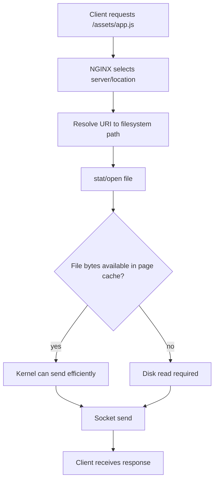
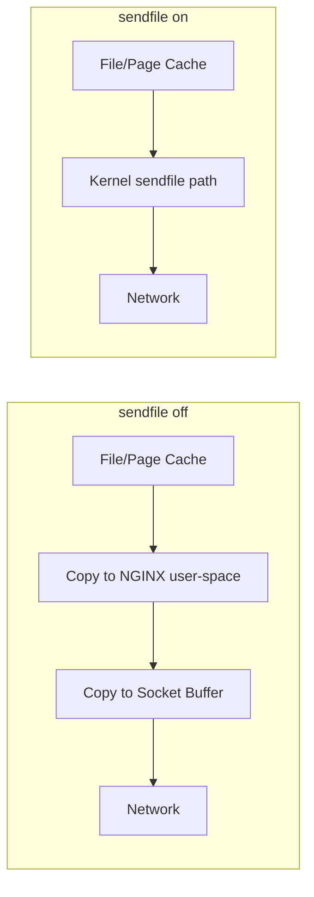
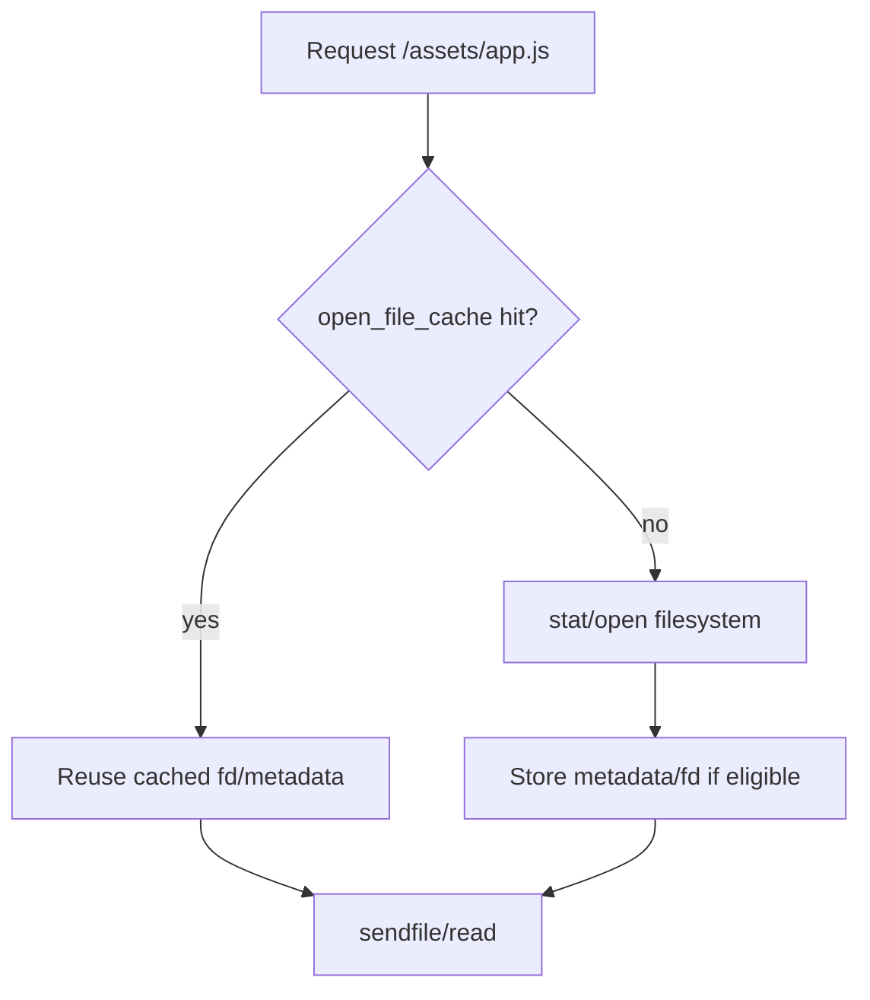
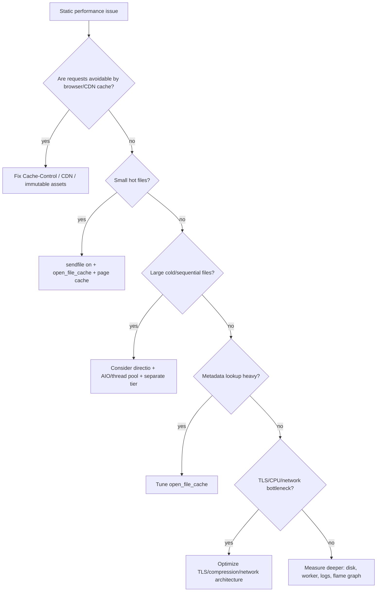

# Part 020 — `sendfile`, AIO, `directio`, `open_file_cache`: Performance Static Assets

> NGINX sangat cepat bukan karena ada satu directive ajaib. Ia cepat ketika request path, filesystem, kernel, network stack, cache policy, dan workload cocok. `sendfile on` bisa sangat baik untuk static assets. `directio` bisa membantu large files tetapi mengubah path I/O. `open_file_cache` bisa mengurangi metadata lookup tetapi bisa menahan stale assumptions. Optimasi yang benar dimulai dari model data path, bukan dari menyalin config blog.

Part ini membahas static file performance dari sudut pandang production: bagaimana bytes bergerak dari disk/page cache ke socket, kapan worker bisa blocking, kapan kernel membantu, kapan cache metadata berguna, dan bagaimana membuat tuning yang bisa diaudit.

Referensi resmi utama:

- NGINX core module `sendfile`, `aio`, `directio`, `open_file_cache`, `tcp_nopush`: https://nginx.org/en/docs/http/ngx_http_core_module.html
- NGINX serving static content guide: https://docs.nginx.com/nginx/admin-guide/web-server/serving-static-content/
- NGINX command-line/config testing: https://nginx.org/en/docs/switches.html

---

## 1. Mental model: static file serving adalah data path

Saat NGINX melayani file statis, alurnya kira-kira:



Optimasi static file bisa menyerang beberapa titik:

| Area | Directive/Mechanism | Tujuan |
|---|---|---|
| Copy path | `sendfile` | Mengurangi copy user-space untuk file → socket. |
| Packet behavior | `tcp_nopush`, `tcp_nodelay` | Mengatur kapan packet dikirim. |
| Disk I/O | `aio`, `directio` | Menghindari worker blocking untuk large reads. |
| Metadata lookup | `open_file_cache` | Cache descriptor/metadata/error lookup. |
| Browser/CDN cache | `Cache-Control`, `ETag` | Mengurangi request ke NGINX. |
| OS page cache | Kernel behavior | Menghindari disk read berulang. |

Part ini fokus pada empat mekanisme NGINX-level:

```txt
sendfile
AIO
directio
open_file_cache
```

---

## 2. First principle: jangan optimasi layer yang salah

Jika browser/CDN selalu mengambil file yang sama berkali-kali karena `Cache-Control` buruk, `sendfile` tidak menyelesaikan masalah utama.

Jika file tidak pernah masuk page cache karena dataset jauh lebih besar dari RAM dan akses random, `open_file_cache` tidak menyelesaikan disk throughput.

Jika bottleneck ada di TLS CPU, tuning `directio` mungkin tidak terlihat.

Jika bottleneck ada di upstream proxy, static tuning irrelevant.

Urutan berpikir:

```txt
1. Apakah request ini harus sampai ke NGINX?
2. Jika sampai, apakah NGINX harus menyentuh filesystem?
3. Jika menyentuh filesystem, apakah metadata lookup mahal?
4. Jika file dibaca, apakah bytes sudah di page cache?
5. Jika bytes dikirim, apakah socket/network/TLS menjadi bottleneck?
6. Jika optimasi diterapkan, apakah failure mode-nya berubah?
```

Production engineer tidak bertanya “directive apa yang cepat?”. Ia bertanya:

```txt
Di data path mana biaya dominan terjadi?
```

---

## 3. `sendfile`: mengirim file tanpa copy user-space biasa

Baseline:

```nginx
http {
    sendfile on;

    server {
        root /srv/www/static;
        location /assets/ {
            try_files $uri =404;
        }
    }
}
```

Dengan `sendfile off`, alur konseptualnya:

```txt
disk/page cache -> kernel buffer -> NGINX worker user-space -> kernel socket buffer -> network
```

Dengan `sendfile on`, kernel bisa mengirim dari file/page cache ke socket secara lebih langsung:

```txt
disk/page cache -> kernel socket path -> network
```

Diagram:



`sendfile on` biasanya bagus untuk static assets karena:

- mengurangi copy
- mengurangi CPU overhead
- cocok dengan kernel page cache
- sederhana
- stabil untuk common workloads

Tapi `sendfile` bukan jaminan selalu optimal. Ia bergantung pada OS, filesystem, TLS stack, file size, page cache behavior, dan deployment environment.

---

## 4. `sendfile_max_chunk`: fairness untuk worker

Directive:

```nginx
sendfile_max_chunk 1m;
```

Tujuan: membatasi jumlah data yang dikirim dalam satu panggilan `sendfile` agar satu koneksi besar tidak memonopoli worker terlalu lama.

Tanpa fairness, large download bisa mengganggu latency request kecil.

Mental model:

```txt
NGINX worker is event-driven.
A single long operation should not starve other events.
```

Contoh:

```nginx
http {
    sendfile on;
    sendfile_max_chunk 1m;
}
```

Trade-off:

| Chunk lebih besar | Chunk lebih kecil |
|---|---|
| Throughput besar bisa bagus. | Fairness lebih baik. |
| Bisa menahan worker lebih lama. | Lebih banyak event loop iteration. |
| Cocok untuk dedicated download node. | Cocok untuk mixed workload. |

Jangan mengubah angka ini tanpa benchmark workload nyata.

---

## 5. `tcp_nopush` dan `tcp_nodelay`: packet timing

Common config:

```nginx
sendfile on;
tcp_nopush on;
tcp_nodelay on;
```

Mental model:

- `tcp_nopush` membantu mengirim response headers dan awal file dalam packet yang lebih optimal ketika `sendfile` aktif.
- `tcp_nodelay` berkaitan dengan pengiriman data tanpa menunggu Nagle delay pada koneksi tertentu, terutama keepalive/interactive patterns.

Jangan hafal sebagai mantra. Pahami intent:

```txt
sendfile    -> file-to-socket data path
tcp_nopush  -> packet coalescing for file response
tcp_nodelay -> avoid latency delay for small writes / keepalive patterns
```

Untuk static asset server umum, baseline di atas lazim. Untuk workload khusus, ukur.

---

## 6. Page cache: optimasi terbesar sering bukan di NGINX

NGINX tidak membaca setiap file langsung dari disk setiap kali. Kernel page cache menyimpan file content yang sering dibaca di memory.

Jika file hot ada di page cache:

```txt
request -> stat/open -> send from memory-backed page cache -> socket
```

Jika file cold:

```txt
request -> stat/open -> disk read -> page cache -> socket
```

Karena itu, static asset performance dipengaruhi oleh:

- RAM tersedia
- working set size
- deployment churn
- cache invalidation pattern
- disk type
- filesystem
- container volume type
- page cache sharing antar container/process

NGINX directive tidak bisa mengubah fakta bahwa cold disk read mahal.

Practical implication:

```txt
Hashed assets + long browser/CDN cache + small hot working set = high edge efficiency.
```

---

## 7. `open_file_cache`: cache descriptor, metadata, dan lookup error

Directive family:

```nginx
open_file_cache          max=10000 inactive=60s;
open_file_cache_valid    120s;
open_file_cache_min_uses 2;
open_file_cache_errors   on;
```

Apa yang bisa dicache?

- open file descriptors
- file size / modification time metadata
- directory existence info
- lookup errors seperti file not found atau permission denied, jika `open_file_cache_errors on`

Mental model:

```txt
open_file_cache does not cache file body.
It caches knowledge about files and sometimes open handles.
```

File body tetap urusan kernel page cache.

Diagram:



---

## 8. Kapan `open_file_cache` membantu

`open_file_cache` membantu ketika:

- banyak request ke file yang sama
- banyak static assets kecil
- filesystem metadata lookup mahal
- NGINX root ada di network filesystem atau overlay filesystem yang metadata-nya relatif mahal
- banyak 404 repetitif, dan Anda sengaja cache error lookup

Contoh untuk static asset host:

```nginx
http {
    open_file_cache          max=20000 inactive=60s;
    open_file_cache_valid    120s;
    open_file_cache_min_uses 2;
    open_file_cache_errors   on;

    server {
        root /srv/www/app/current/public;

        location /assets/ {
            try_files $uri =404;
        }
    }
}
```

Interpretasi:

```txt
max=20000       -> jumlah entry maksimal
inactive=60s    -> entry tanpa akses selama 60s bisa dikeluarkan
valid=120s      -> metadata divalidasi ulang setiap 120s
min_uses=2      -> cache setelah cukup sering digunakan
errors=on       -> cache negative lookup juga
```

---

## 9. `open_file_cache` risk: stale metadata dan deployment model

Jika deployment mengganti file di tempat, caching metadata bisa menimbulkan kejutan.

Buruk:

```txt
/srv/www/app/app.js overwritten in-place during deploy
```

Lebih baik:

```txt
/srv/www/app/releases/2026-07-06-120000/public/...
/srv/www/app/current -> symlink to release
```

Namun symlink switch juga butuh dipahami. Jika NGINX memegang open file descriptor ke file lama, request tertentu bisa tetap melayani file lama sampai cache/FD tidak dipakai lagi.

Untuk hashed immutable assets, ini biasanya baik-baik saja:

```txt
/assets/app.abc123.js old release
/assets/app.def456.js new release
```

Keduanya bisa coexist.

Untuk non-hashed mutable paths, lebih berisiko:

```txt
/assets/app.js
/config.json
/index.html
```

Decision:

| File class | open_file_cache suitability |
|---|---|
| Hashed immutable assets | Very suitable. |
| Large stable downloads | Suitable. |
| Frequently overwritten files | Be careful. |
| `index.html` changing every deploy | Use shorter validation or no aggressive caching. |
| Generated files on disk | Usually avoid or scope carefully. |
| User uploads changing in place | Avoid in-place overwrite; design immutable object paths. |

---

## 10. Negative caching: `open_file_cache_errors on`

This can cache “file not found” results.

Benefit:

```txt
Repeated bot requests for /wp-login.php do not hit filesystem every time.
```

Risk:

```txt
A file that appears shortly after a negative lookup may still be treated as missing until validation.
```

Example:

```nginx
open_file_cache_errors on;
open_file_cache_valid 60s;
```

If `/assets/new.js` is requested before deploy finishes and returns 404, NGINX may cache that error briefly. After the file appears, clients may still see 404 until cache revalidation.

Mitigation:

- use atomic deploys
- do not publish references before files exist
- use hashed assets
- keep validation interval reasonable
- avoid negative caching on paths where files appear dynamically

Pattern:

```nginx
# Static build assets: OK
location /assets/ {
    open_file_cache          max=20000 inactive=60s;
    open_file_cache_valid    120s;
    open_file_cache_min_uses 2;
    open_file_cache_errors   on;
    try_files $uri =404;
}

# Dynamic export files: avoid negative error caching here
location /exports/ {
    open_file_cache off;
    try_files $uri =404;
}
```

---

## 11. `aio`: asynchronous file I/O

Directive:

```nginx
aio on;
```

or:

```nginx
aio threads;
```

AIO is about avoiding worker blocking on file reads.

Without AIO:

```txt
worker attempts file read
if disk blocks, worker can be blocked
other events handled later
```

With suitable AIO/thread configuration:

```txt
worker schedules file read
I/O completes asynchronously or in thread pool
worker can continue processing events
```

This matters more for:

- large files
- cold files
- slow disks
- mixed workloads where static large downloads share workers with latency-sensitive requests

It matters less for:

- small hot assets already in page cache
- CDN-backed static assets with low origin hit rate
- workloads where network is dominant bottleneck

---

## 12. Linux AIO, `directio`, and reality

On Linux, kernel AIO historically has important constraints. In NGINX documentation, Linux AIO usage for file reads is tied to `directio`; otherwise reads may block. That is why examples often combine:

```nginx
location /video/ {
    sendfile on;
    aio on;
    directio 8m;
}
```

The intent:

```txt
small files/ranges -> sendfile/page cache path
large files >= directio threshold -> direct I/O/AIO path
```

`directio` enables direct I/O for files larger than or equal to configured size. It also changes interaction with `sendfile`: direct I/O and sendfile are not simply additive for the same request path. The official docs note that `directio` automatically disables `sendfile` for a request where it applies.

Mental model:

```txt
sendfile path: page cache friendly, good for hot static files
directio path: bypass page cache for large files, avoid polluting cache
aio path: avoid blocking worker for certain file reads
```

---

## 13. `directio`: avoid page cache pollution for large files

Example:

```nginx
location /media/ {
    root /srv;

    sendfile on;
    aio on;
    directio 8m;

    try_files $uri =404;
}
```

This says:

```txt
For files >= 8m, use direct I/O behavior.
For smaller files, normal sendfile/page cache path may apply.
```

Why use it?

Imagine this workload:

```txt
/assets/app.js       hot, small, requested constantly
/media/movie-1.mp4   huge, requested by few clients
/media/movie-2.mp4   huge, requested by few clients
```

If huge cold media files flood page cache, they can evict hot app assets.

`directio` can help protect page cache from large streaming/download objects.

But trade-offs:

| Benefit | Cost/Risk |
|---|---|
| Reduces page cache pollution. | Can reduce benefit for repeated large file requests. |
| Better for huge streaming/download files. | Alignment constraints matter. |
| Can combine with AIO strategy. | More complex behavior. |
| Protects hot small assets. | Wrong threshold can hurt. |

Rule:

```txt
Use directio for large cold/sequential files, not blindly for all static assets.
```

---

## 14. `directio_alignment`

Directive:

```nginx
directio_alignment 512;
```

On some filesystems/platforms, direct I/O requires alignment. For XFS on Linux, larger alignment such as 4K may be relevant.

Example:

```nginx
location /media/ {
    aio on;
    directio 8m;
    directio_alignment 4k;
}
```

Do not tune this from memory. Check your filesystem/platform behavior.

---

## 15. Thread pools: `aio threads`

Modern NGINX can use thread pools for file I/O when built with thread support.

Example:

```nginx
thread_pool media_pool threads=32 max_queue=65536;

http {
    aio threads=media_pool;

    server {
        location /media/ {
            root /srv;
            sendfile on;
            try_files $uri =404;
        }
    }
}
```

Mental model:

```txt
worker event loop stays responsive
blocking file operations can be delegated to thread pool
```

But this is not free:

- thread pool queue can grow
- too many threads can increase context switching
- disk can still saturate
- latency can increase under queueing
- memory pressure can rise

Use thread pools when you have evidence that file I/O blocking affects worker responsiveness.

Observability signs:

```txt
high request latency for small files during large downloads
worker CPU not saturated but requests stall
high disk await / iowait
large cold files served from origin
```

---

## 16. Static workload classes

Different static workloads need different tuning.

### Class A — Build assets

```txt
/assets/app.abc123.js
/assets/app.def456.css
/assets/logo.svg
```

Traits:

- small to medium
- immutable
- hot
- page cache friendly
- browser/CDN cache friendly

Baseline:

```nginx
sendfile on;
tcp_nopush on;
open_file_cache max=20000 inactive=60s;
open_file_cache_valid 120s;
open_file_cache_min_uses 2;
open_file_cache_errors on;
```

Avoid:

```nginx
directio 4k;
```

for tiny assets. It can bypass page cache benefit.

### Class B — Public downloads

```txt
/downloads/tool-v1.2.3-linux-amd64.tar.gz
/downloads/dataset-2026-07.csv
```

Traits:

- medium to large
- stable
- sequential
- sometimes cold

Possible:

```nginx
sendfile on;
sendfile_max_chunk 1m;
open_file_cache max=5000 inactive=120s;
```

If very large and cold:

```nginx
aio on;
directio 16m;
```

### Class C — Media streaming

```txt
/media/video.mp4
/media/segment-00001.ts
```

Traits:

- large
- range requests
- sequential/partial reads
- page cache behavior important

Possible:

```nginx
sendfile on;
aio on;
directio 8m;
```

But media delivery has more concerns: range, slice, cache, CDN, and origin shield. We will revisit in Part 064.

### Class D — Generated files

```txt
/exports/report-123.csv
/invoices/invoice-456.pdf
```

Traits:

- may appear dynamically
- may be permission-sensitive
- may change lifecycle state
- negative caching can hurt

Use careful scoping:

```nginx
location /exports/ {
    open_file_cache off;
    try_files $uri =404;
}
```

---

## 17. Range requests and large files

Clients can request byte ranges:

```http
Range: bytes=1000000-2000000
```

This is common for:

- video seeking
- resumable downloads
- partial content fetches
- large object delivery

NGINX can serve range responses for static files. Performance depends on disk access pattern and cache behavior.

Potential risk:

```txt
Many clients request many random ranges across huge files.
```

This can turn sequential serving into random I/O pressure.

Practical mitigations:

- use CDN for public large objects
- separate media/download host from app asset host
- set different worker/resource limits
- monitor disk read latency and throughput
- consider object storage/CDN instead of local disk if workload is large

Do not tune `sendfile` alone for a workload that needs a delivery architecture.

---

## 18. TLS changes the data path

With HTTPS, bytes are encrypted before going over the network. Depending on NGINX version, OpenSSL/kernel support, and platform, the practical benefit of `sendfile` can differ from plain HTTP.

Do not assume plain HTTP benchmark equals HTTPS production.

Benchmark both:

```bash
wrk -t4 -c200 -d60s http://static.example.com/assets/app.js
wrk -t4 -c200 -d60s https://static.example.com/assets/app.js
```

Measure:

```txt
requests/sec
latency distribution
CPU user/system
TLS handshake rate
network throughput
disk reads
page cache hit behavior
```

If HTTPS CPU dominates, static file I/O tuning may be secondary.

---

## 19. Container and Kubernetes caveats

In containers, static files might live on:

- image layer
- bind mount
- persistent volume
- network filesystem
- object-storage-backed FUSE mount
- Kubernetes ConfigMap/Secret volume
- projected volume

Each has different metadata and read behavior.

Do not assume local ext4 behavior.

Risk examples:

| Substrate | Risk |
|---|---|
| Overlay filesystem | Metadata lookup overhead, layer behavior. |
| Network filesystem | Latency spikes, stale attributes, throughput limits. |
| ConfigMap volume | Not for high-volume static asset serving. |
| Object FUSE mount | Unexpected read latency and consistency semantics. |
| EmptyDir warmed at startup | Startup complexity but predictable local reads. |

For high-volume static serving in Kubernetes, common better patterns:

```txt
1. Bake assets into container image for immutable releases.
2. Serve from CDN/object storage when global scale matters.
3. Use initContainer to materialize assets to local volume when needed.
4. Avoid serving hot assets from slow network mounts.
```

---

## 20. Deployment strategy and `open_file_cache`

Immutable release layout:

```txt
/srv/www/app/releases/20260706T120000/public
/srv/www/app/releases/20260706T130000/public
/srv/www/app/current -> /srv/www/app/releases/20260706T130000/public
```

Config:

```nginx
root /srv/www/app/current;
```

This is common, but think about what NGINX caches:

```txt
path resolution
metadata
open file descriptors
negative lookup errors
```

Safer static asset strategy:

```txt
Hashed assets are immutable and can coexist across releases.
index.html is small and changes often.
```

Config split:

```nginx
location /assets/ {
    open_file_cache          max=20000 inactive=60s;
    open_file_cache_valid    120s;
    open_file_cache_min_uses 2;
    open_file_cache_errors   on;
    try_files $uri =404;
}

location = /index.html {
    open_file_cache off;
    try_files $uri =404;
}

location / {
    try_files $uri $uri/ /index.html;
}
```

This reduces stale entrypoint risk while keeping hot asset benefit.

---

## 21. Production baseline: static asset server

```nginx
worker_processes auto;

events {
    worker_connections 4096;
}

http {
    include mime.types;
    default_type application/octet-stream;

    sendfile on;
    sendfile_max_chunk 1m;
    tcp_nopush on;
    tcp_nodelay on;

    open_file_cache          max=20000 inactive=60s;
    open_file_cache_valid    120s;
    open_file_cache_min_uses 2;
    open_file_cache_errors   on;

    server {
        listen 80;
        server_name static.example.com;

        root /srv/www/app/current/public;

        add_header X-Content-Type-Options nosniff always;

        location /assets/ {
            try_files $uri =404;
            add_header Cache-Control "public, max-age=31536000, immutable" always;
        }

        location = /index.html {
            open_file_cache off;
            try_files $uri =404;
            add_header Cache-Control "no-cache" always;
        }

        location / {
            try_files $uri $uri/ /index.html;
        }
    }
}
```

Interpretation:

```txt
sendfile on              -> efficient common static data path
sendfile_max_chunk 1m    -> fairness guard
tcp_nopush/tcp_nodelay   -> packet behavior baseline
open_file_cache          -> metadata/fd caching for hot assets
/assets/ immutable cache -> reduce repeat requests
/index.html no-cache     -> fast deploy visibility
```

---

## 22. Production baseline: large downloads/media

```nginx
worker_processes auto;

thread_pool media_pool threads=32 max_queue=65536;

events {
    worker_connections 8192;
}

http {
    include mime.types;
    default_type application/octet-stream;

    sendfile on;
    sendfile_max_chunk 1m;
    tcp_nopush on;

    server {
        listen 80;
        server_name downloads.example.com;

        root /srv/downloads;

        location /files/ {
            aio threads=media_pool;
            directio 16m;
            directio_alignment 4k;

            open_file_cache          max=5000 inactive=120s;
            open_file_cache_valid    300s;
            open_file_cache_min_uses 1;
            open_file_cache_errors   on;

            add_header Content-Disposition "attachment" always;
            try_files $uri =404;
        }
    }
}
```

This is not a universal recommendation. It is a workload-specific shape:

```txt
large stable files
potential cold reads
protect page cache
avoid worker blocking through thread pool/directio strategy
```

For small frontend assets, this would be overkill and possibly harmful.

---

## 23. Measurement: what to observe

You cannot validate static performance with `curl` alone.

Observe NGINX:

```txt
access log request_time
bytes_sent
status
request_uri
sent_http_content_type
sent_http_cache_control
```

Observe OS:

```bash
pidstat -p $(pgrep -d, nginx) 1
iostat -xz 1
vmstat 1
sar -n DEV 1
ss -s
```

Observe files/page cache indirectly:

```bash
vmtouch -v /srv/www/app/current/public/assets/app.js  # if available
free -h
cat /proc/meminfo | grep -E 'Cached|Buffers|Dirty|Writeback'
```

Benchmark:

```bash
wrk -t4 -c200 -d60s http://localhost/assets/app.js
wrk -t4 -c200 -d60s http://localhost/downloads/big.bin
```

For large files, also measure throughput:

```bash
curl -o /dev/null -w '%{speed_download}\n' http://localhost/downloads/big.bin
```

Important metrics:

| Symptom | Possible bottleneck |
|---|---|
| High system CPU | send path, kernel, TLS, network stack. |
| High user CPU | TLS/compression/user-space work. |
| High iowait | disk reads blocking. |
| High disk await | storage latency. |
| High 404 rate | bot traffic or wrong deploy references. |
| High small asset latency during downloads | worker fairness or disk contention. |
| Sudden stale files | deploy/cache/open FD behavior. |

---

## 24. Benchmark traps

### Trap 1: benchmarking hot page cache only

If you run the same test repeatedly, file is probably hot in page cache.

Result:

```txt
Looks extremely fast, but says little about cold reads.
```

Test hot and cold separately.

### Trap 2: testing HTTP but deploying HTTPS

TLS changes CPU/data path. Test production protocol.

### Trap 3: testing one file but production has many

One hot file benchmark does not represent large working set.

### Trap 4: ignoring client/network limit

Your laptop or network may be the bottleneck, not NGINX.

### Trap 5: measuring average latency only

Use percentiles:

```txt
p50, p90, p95, p99, max
```

### Trap 6: changing many directives at once

Change one variable, measure, rollback if needed.

---

## 25. Failure modes

### Failure mode: missing file cached as error

Cause:

```nginx
open_file_cache_errors on;
open_file_cache_valid 300s;
```

During deploy, request arrives before file exists. 404 cached.

Mitigation:

```txt
atomic deploy
publish references after assets exist
shorter valid interval
no negative caching for dynamic paths
```

### Failure mode: hot assets evicted by huge downloads

Cause:

```txt
large sequential files pollute page cache
```

Mitigation:

```txt
separate host/tier
CDN/object storage
directio for large files
cache-control for client/CDN
```

### Failure mode: workers stall during cold disk reads

Cause:

```txt
blocking file I/O under event-driven workers
```

Mitigation:

```txt
aio/thread pools for appropriate paths
separate workload
improve storage
warm cache
```

### Failure mode: stale entrypoint after deploy

Cause:

```txt
open_file_cache too aggressive for index.html or mutable files
```

Mitigation:

```nginx
location = /index.html {
    open_file_cache off;
    add_header Cache-Control "no-cache" always;
}
```

### Failure mode: performance regression after enabling directio globally

Cause:

```txt
direct I/O bypasses page cache for files that benefit from page cache
```

Mitigation:

```txt
scope directio only to large file location
set threshold
benchmark hot/cold separately
```

---

## 26. Tuning decision tree



---

## 27. Config review checklist

For static performance review, ask:

```txt
1. What class of files does this server serve?
2. Are assets immutable/hash-named?
3. Is browser/CDN cache configured before NGINX micro-optimizations?
4. Is sendfile enabled for normal static paths?
5. Is open_file_cache scoped safely to stable paths?
6. Are generated/mutable paths excluded from aggressive file caching?
7. Are large files separated or given different I/O strategy?
8. Is directio scoped by location and threshold?
9. Does the benchmark include HTTPS if production uses HTTPS?
10. Are hot and cold cache scenarios tested separately?
11. Are p95/p99 latency and disk await observed?
12. Can the tuning be rolled back quickly?
```

---

## 28. Mini lab: compare baseline behavior

Create files:

```bash
sudo mkdir -p /srv/labs/static/assets /srv/labs/static/downloads
base64 /dev/urandom | head -c 1048576 | sudo tee /srv/labs/static/assets/app.bin >/dev/null
base64 /dev/urandom | head -c 104857600 | sudo tee /srv/labs/static/downloads/big.bin >/dev/null
```

Config:

```nginx
server {
    listen 8080;
    server_name _;

    root /srv/labs/static;

    sendfile on;
    sendfile_max_chunk 1m;
    tcp_nopush on;
    tcp_nodelay on;

    open_file_cache          max=10000 inactive=60s;
    open_file_cache_valid    60s;
    open_file_cache_min_uses 2;
    open_file_cache_errors   on;

    location /assets/ {
        try_files $uri =404;
    }

    location /downloads/ {
        aio threads;
        directio 16m;
        try_files $uri =404;
    }
}
```

Validate:

```bash
sudo nginx -t
sudo nginx -s reload
```

Test small hot asset:

```bash
wrk -t4 -c100 -d30s http://localhost:8080/assets/app.bin
```

Test large file:

```bash
curl -o /dev/null -w 'speed=%{speed_download}\n time=%{time_total}\n' \
  http://localhost:8080/downloads/big.bin
```

Observe while testing:

```bash
iostat -xz 1
pidstat -p $(pgrep -d, nginx) 1
```

Change one thing at a time:

```nginx
sendfile off;
```

then:

```nginx
open_file_cache off;
```

then remove:

```nginx
directio 16m;
```

The point is not to find a universal winner. The point is to build intuition:

```txt
small hot asset behavior != large cold download behavior
```

---

## 29. What to remember

Static file performance in NGINX is a data path problem.

Practical defaults:

```nginx
sendfile on;
tcp_nopush on;
tcp_nodelay on;
sendfile_max_chunk 1m;
```

Useful for stable hot static assets:

```nginx
open_file_cache          max=20000 inactive=60s;
open_file_cache_valid    120s;
open_file_cache_min_uses 2;
open_file_cache_errors   on;
```

Useful only for appropriate large-file workloads:

```nginx
aio on;          # or aio threads;
directio 8m;     # threshold matters
```

Core invariant:

```txt
Do not optimize NGINX static serving without classifying the workload.
```

For frontend hashed assets, page cache + sendfile + browser/CDN cache is usually the winning model. For large cold downloads, protect worker responsiveness and page cache. For generated/mutable files, be conservative with metadata/error caching.

Next: Part 021 covers compression strategy: gzip, Brotli options, precompressed assets, `Content-Encoding`, `Vary`, CPU trade-offs, and when compression belongs at NGINX vs build pipeline vs CDN.
