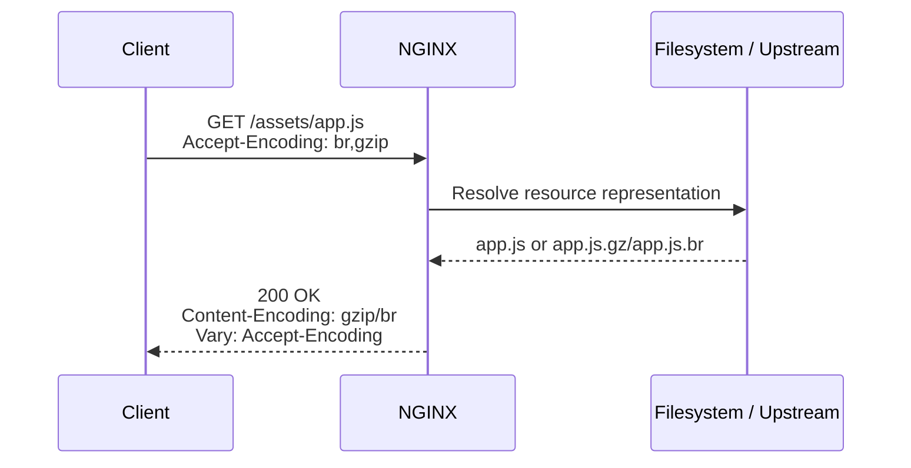
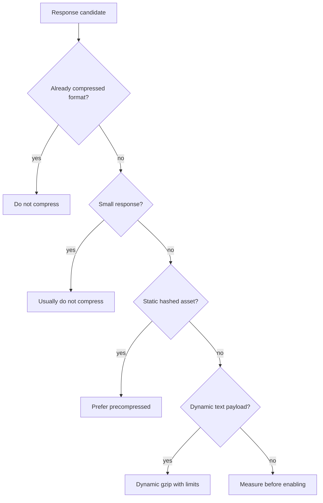
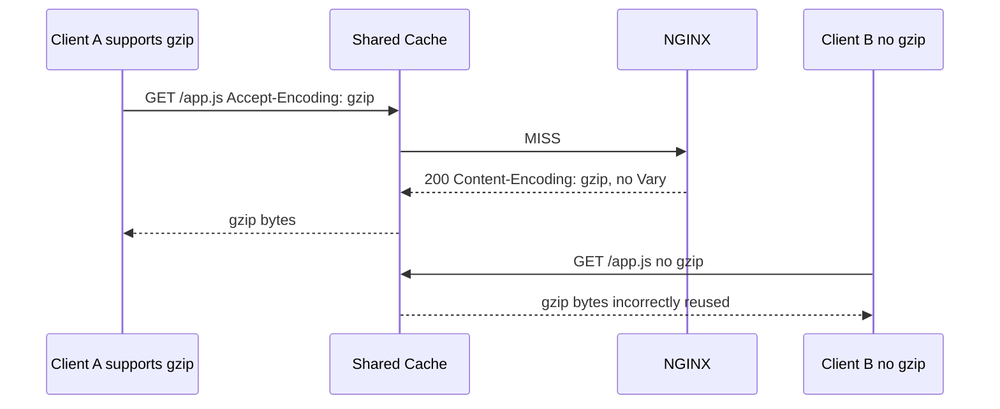

# Part 021 — Compression Strategy: gzip, Brotli, dan Precompressed Assets

> Compression bukan sekadar `gzip on;`. Compression adalah trade-off antara bandwidth, CPU, latency, cache correctness, compatibility, dan operational predictability. NGINX bisa melakukan dynamic compression, melayani file yang sudah diprecompress, melakukan decompression untuk client lama, dan berinteraksi dengan browser/CDN cache melalui `Vary: Accept-Encoding`. Production-grade compression harus didesain sebagai bagian dari response contract, bukan sebagai dekorasi performa.

Part ini membahas bagaimana menggunakan compression di NGINX secara aman dan efisien: kapan memakai gzip dinamis, kapan memakai precompressed assets, bagaimana memperlakukan Brotli, kapan tidak melakukan compression, dan failure mode apa yang harus dihindari.

Referensi resmi utama:

- NGINX gzip module: https://nginx.org/en/docs/http/ngx_http_gzip_module.html
- NGINX gzip static module: https://nginx.org/en/docs/http/ngx_http_gzip_static_module.html
- NGINX gunzip module: https://nginx.org/en/docs/http/ngx_http_gunzip_module.html
- F5 NGINX compression guide: https://docs.nginx.com/nginx/admin-guide/web-server/compression/
- F5 NGINX Brotli dynamic module: https://docs.nginx.com/nginx/admin-guide/dynamic-modules/brotli/
- NGINX headers module: https://nginx.org/en/docs/http/ngx_http_headers_module.html

---

## 1. Mental model: compression adalah transformasi representation

HTTP response bukan hanya bytes. Ia adalah representation dari resource.

Untuk URL yang sama:

```txt
/assets/app.1a2b3c.js
```

server bisa mengirim beberapa representation:

| Representation | Header penting | Contoh |
|---|---|---|
| Uncompressed | tanpa `Content-Encoding` | `app.1a2b3c.js` |
| gzip-compressed | `Content-Encoding: gzip` | `app.1a2b3c.js.gz` atau gzip dinamis |
| br-compressed | `Content-Encoding: br` | `app.1a2b3c.js.br` atau Brotli dinamis |

Client memberi tahu kemampuan melalui:

```http
Accept-Encoding: br, gzip, deflate
```

Server memilih representation lalu wajib menjaga cache semantics dengan benar, terutama:

```http
Vary: Accept-Encoding
Content-Encoding: gzip
Content-Type: application/javascript
Cache-Control: public, max-age=31536000, immutable
```

Tanpa `Vary: Accept-Encoding`, shared cache bisa menyimpan response gzip lalu memberikannya ke client yang tidak mendukung gzip. Itu bug correctness, bukan sekadar bug performa.



Invariant penting:

> Compression mengubah payload bytes. Karena payload bytes berubah, metadata response juga harus benar.

---

## 2. Ada tiga strategi compression

Secara production, jangan berpikir hanya “enable gzip”. Pilih strategi per jenis response.

| Strategi | Cara kerja | Cocok untuk | Risiko utama |
|---|---|---|---|
| Dynamic gzip | NGINX compress saat response dikirim | HTML/API kecil-menengah, konten dinamis | CPU spike, latency tambahan |
| Precompressed gzip | Build pipeline menghasilkan `.gz`; NGINX serve file tersebut | Static assets versioned | Build complexity, stale artifact |
| Brotli optional | Module tambahan untuk `.br` atau dynamic Brotli | Static assets modern browser | Bukan core default NGINX OSS, rollout harus eksplisit |

Rule of thumb:

```txt
Static hashed assets  -> precompress saat build
HTML dynamic          -> dynamic gzip ringan
JSON API              -> selective gzip, ukur CPU & latency
Large already-compressed media -> jangan compress
Tiny response         -> jangan compress
Secret-bearing response over TLS -> hati-hati BREACH-like risk
```

---

## 3. Apa yang sebaiknya tidak dikompresi

Banyak production config salah karena `gzip_types *;` atau terlalu agresif.

Jangan kompres secara default:

| Content | Alasan |
|---|---|
| JPEG/PNG/WebP/AVIF | Sudah compressed; CPU terbuang, ukuran bisa naik |
| MP4/ZIP/GZ/BR/PDF tertentu | Sering sudah compressed atau tidak worth it |
| Very small response | Overhead header + CPU lebih besar dari benefit |
| Highly sensitive dynamic response | Risiko side-channel pada kombinasi secret + attacker-controlled input |
| Streaming/SSE tertentu | Compression buffering bisa mengubah latency behavior |

Compression adalah latency-bandwidth trade.



---

## 4. Dynamic gzip: baseline yang masuk akal

Contoh baseline untuk dynamic gzip:

```nginx
http {
    gzip on;
    gzip_vary on;
    gzip_comp_level 5;
    gzip_min_length 1024;
    gzip_http_version 1.1;

    gzip_types
        text/plain
        text/css
        text/xml
        application/json
        application/javascript
        application/xml
        application/rss+xml
        image/svg+xml;
}
```

Catatan penting:

1. `gzip on;` mengaktifkan gzip compression.
2. `gzip_vary on;` menambahkan `Vary: Accept-Encoding`.
3. `gzip_min_length` menghindari compression untuk response terlalu kecil.
4. `gzip_types` mengontrol MIME type tambahan; `text/html` dikompresi secara default saat gzip aktif menurut dokumentasi NGINX.
5. Jangan memasukkan image/video/archive modern tanpa alasan terukur.

Config yang buruk:

```nginx
# Buruk: terlalu agresif, bisa boros CPU dan salah untuk banyak binary type.
gzip on;
gzip_types *;
gzip_comp_level 9;
```

Masalahnya bukan hanya “level 9 lambat”. Masalahnya adalah tidak ada policy per representation.

---

## 5. `gzip_comp_level`: jangan mengejar angka tertinggi

Compression level tinggi tidak selalu berarti user experience lebih baik.

| Level | Karakter umum | Cocok untuk |
|---|---|---|
| 1-3 | CPU lebih rendah, rasio lebih rendah | high RPS dynamic API |
| 4-6 | kompromi umum | HTML/CSS/JS dynamic atau mixed workload |
| 7-9 | CPU mahal, rasio tambahan kecil | jarang cocok untuk dynamic runtime |

Untuk static assets, level tinggi lebih masuk akal dilakukan di build pipeline, bukan saat request.

```txt
Request-time compression:
  user latency pays CPU cost

Build-time compression:
  CI/CD pays CPU cost once
  every request gets benefit
```

Production heuristic:

```txt
Dynamic gzip level 4-6
Precompression level can be higher
Brotli static can use higher quality because it is offline
```

Tetap ukur. Heuristic bukan pengganti benchmark.

---

## 6. `gzip_min_length`: kecil bukan berarti gratis

`gzip_min_length` menentukan ukuran minimum response yang akan dikompresi.

```nginx
gzip_min_length 1024;
```

Kenapa perlu?

Response kecil punya overhead:

- CPU untuk compress.
- Header tambahan.
- Potensi buffering.
- Variasi cache representation.

Untuk response 100 byte, compression sering tidak berguna.

Namun ada detail penting: dokumentasi NGINX menyebut panjang response ditentukan hanya dari `Content-Length` response header. Kalau response tidak punya `Content-Length`, behavior bisa tidak sesuai dugaan.

Praktiknya:

- Static files biasanya punya size jelas.
- Upstream streaming/chunked response perlu diuji.
- Jangan membuat asumsi bahwa semua dynamic response akan terkena `gzip_min_length` secara intuitif.

---

## 7. `gzip_types`: desain berdasarkan representation, bukan ekstensi file

NGINX memilih gzip berdasarkan MIME type response, bukan langsung berdasarkan ekstensi file.

```nginx
gzip_types
    text/plain
    text/css
    application/json
    application/javascript
    application/xml
    image/svg+xml;
```

Pastikan Part 019 tentang MIME type sudah benar. Kalau `.js` salah dikirim sebagai `application/octet-stream`, compression dan cache policy bisa ikut salah.

Checklist:

| File | Expected `Content-Type` | Compress? |
|---|---|---|
| `.html` | `text/html` | yes |
| `.css` | `text/css` | yes |
| `.js` | `application/javascript` | yes |
| `.json` | `application/json` | yes |
| `.svg` | `image/svg+xml` | yes |
| `.png` | `image/png` | no |
| `.webp` | `image/webp` | no |
| `.mp4` | `video/mp4` | no |
| `.zip` | `application/zip` | no |

---

## 8. `gzip_vary`: wajib untuk shared cache correctness

Aktifkan:

```nginx
gzip_vary on;
```

Response compressed harus memberi tahu cache bahwa representation bergantung pada `Accept-Encoding`.

Tanpa `Vary`, shared cache bisa melakukan ini:



Dengan `Vary: Accept-Encoding`, cache key representation menjadi aman.

---

## 9. `gzip_proxied`: compression untuk response dari upstream

Ketika NGINX reverse proxy ke upstream, dynamic gzip punya trade-off tambahan.

Contoh selective:

```nginx
gzip_proxied expired no-cache no-store private auth;
```

Makna praktis:

- Jangan otomatis compress semua proxied response.
- Gunakan sinyal cache/header untuk menentukan response mana yang pantas.
- Pahami bahwa response dari upstream bisa sudah compressed.

Untuk API internal yang selalu JSON dan high-volume, Anda mungkin memilih:

```nginx
location /api/ {
    proxy_pass http://app_backend;

    gzip on;
    gzip_types application/json;
    gzip_min_length 2048;
    gzip_comp_level 4;
    gzip_vary on;
}
```

Tapi jangan lupa mengukur:

| Metric | Yang dicari |
|---|---|
| p95/p99 latency | Apakah CPU compression menambah tail latency? |
| worker CPU | Apakah worker saturasi? |
| egress bandwidth | Apakah ada pengurangan signifikan? |
| upstream latency | Apakah buffering/compression mengubah timing? |
| error rate | Apakah client/proxy tertentu bermasalah? |

---

## 10. Precompressed gzip dengan `gzip_static`

Untuk static assets, strategi terbaik sering bukan dynamic gzip, tapi precompressed assets.

Build pipeline menghasilkan:

```txt
/dist/assets/app.1a2b3c.js
/dist/assets/app.1a2b3c.js.gz
/dist/assets/app.1a2b3c.css
/dist/assets/app.1a2b3c.css.gz
```

NGINX config:

```nginx
server {
    listen 443 ssl;
    server_name static.example.com;

    root /srv/www/app/current/public;

    location /assets/ {
        gzip_static on;
        gzip_vary on;

        add_header Cache-Control "public, max-age=31536000, immutable" always;
        try_files $uri =404;
    }
}
```

`gzip_static` akan mencoba melayani file `.gz` precompressed jika tersedia dan client mendukung gzip.

Hal penting dari dokumentasi resmi:

- `ngx_http_gzip_static_module` mengirim file precompressed dengan ekstensi `.gz` alih-alih file regular.
- Module ini tidak selalu built by default; saat build from source perlu `--with-http_gzip_static_module`.
- Di package distro/container tertentu, cek `nginx -V`.

Cek module:

```bash
nginx -V 2>&1 | tr ' ' '\n' | grep gzip_static
```

Jika tidak ada, config `gzip_static on;` bisa gagal saat `nginx -t`.

---

## 11. `gzip_static always`: jarang, gunakan dengan sadar

`gzip_static` punya mode `always`.

```nginx
gzip_static always;
```

Artinya NGINX dapat mengirim `.gz` tanpa mengecek apakah client mendukung gzip. Ini bukan baseline untuk public web.

Kapan mungkin relevan?

- Anda menggabungkannya dengan `gunzip on;` agar NGINX bisa decompress untuk client yang tidak support gzip.
- Anda berada di controlled environment yang semua client pasti support gzip.
- Anda ingin disk hanya menyimpan compressed representation.

Untuk kebanyakan static web public:

```nginx
gzip_static on;
```

lebih aman daripada `always`.

---

## 12. `gunzip`: decompression untuk client lama

`gunzip` module bisa melakukan decompression response gzip untuk client yang tidak mendukung gzip.

Contoh:

```nginx
location /assets/ {
    gzip_static always;
    gunzip on;
    gzip_vary on;

    try_files $uri =404;
}
```

Ini berarti storage dapat menyimpan `.gz`, lalu NGINX decompress jika perlu.

Trade-off:

| Benefit | Cost |
|---|---|
| Bisa menyimpan compressed-only artifact | CPU decompression runtime |
| Bisa melayani client lama | Complexity naik |
| Bisa konsisten dengan upstream compressed response | Lebih banyak edge case |

Untuk sistem modern, lebih sering cukup menyimpan file original + `.gz`.

---

## 13. Brotli: bagus, tapi jangan diasumsikan core NGINX OSS

Brotli sering memberi rasio lebih baik untuk text assets dibanding gzip, terutama untuk JS/CSS/HTML. Namun dari perspektif NGINX production, penting membedakan statusnya:

| Capability | Status praktis |
|---|---|
| gzip dynamic | module resmi NGINX |
| gzip static | module resmi NGINX, bisa perlu build flag/package |
| Brotli module di NGINX Plus | tersedia sebagai dynamic module F5 NGINX Plus |
| Brotli di NGINX OSS | umumnya via third-party module/package, bukan core default NGINX OSS |

Jadi dalam handbook production, Brotli harus diperlakukan sebagai optional capability.

Jangan menulis runbook seperti ini:

```nginx
# Jangan dijadikan baseline universal.
brotli on;
brotli_static on;
```

Kecuali platform Anda memang menyediakan module tersebut, sudah divalidasi di `nginx -t`, dan sudah masuk lifecycle patching.

---

## 14. Precompressed Brotli assets

Untuk modern frontend assets, pola ideal sering:

```txt
app.1a2b3c.js
app.1a2b3c.js.gz
app.1a2b3c.js.br
```

Prioritas representation biasanya:

```txt
br > gzip > identity
```

Namun NGINX Open Source core tidak otomatis serve `.br` tanpa module. Anda perlu salah satu:

1. NGINX Plus Brotli dynamic module.
2. Third-party Brotli module yang dikelola platform Anda.
3. CDN di depan NGINX yang menangani Brotli.
4. Tidak memakai Brotli di NGINX dan cukup gzip static.

Decision matrix:

| Kondisi | Pilihan masuk akal |
|---|---|
| Static frontend high traffic, browser modern, CDN tidak handle Brotli | Brotli static module layak dipertimbangkan |
| API dynamic high RPS | Brotli dynamic sering terlalu mahal; ukur dulu |
| Small internal app | gzip cukup |
| Platform tidak siap compile/load module | jangan paksa Brotli |
| Security patching third-party module tidak jelas | hindari |

---

## 15. Build pipeline untuk precompression

Contoh build artifact:

```bash
# Example only; sesuaikan dengan pipeline Anda.
find dist/assets -type f \
  \( -name '*.js' -o -name '*.css' -o -name '*.svg' -o -name '*.json' -o -name '*.html' \) \
  -size +1024c \
  -exec gzip -k -9 {} \;
```

Untuk Brotli jika tool tersedia:

```bash
find dist/assets -type f \
  \( -name '*.js' -o -name '*.css' -o -name '*.svg' -o -name '*.json' -o -name '*.html' \) \
  -size +1024c \
  -exec brotli -k -q 11 {} \;
```

Invariant build:

```txt
For every immutable asset served as compressed:
  original exists
  gzip exists if gzip_static expected
  br exists if brotli_static expected
  content hash in filename reflects original source bytes
  deployment is atomic
```

Atomic deployment penting. Jangan sampai NGINX melihat `.js` baru tapi `.js.gz` lama.

Pola aman:

```txt
/srv/www/app/releases/20260706-120001/public/assets/...
/srv/www/app/current -> releases/20260706-120001
```

Reload NGINX tidak selalu diperlukan untuk ganti symlink static content, tapi smoke test tetap diperlukan.

---

## 16. Cache key dan compression representation

Browser cache memperlakukan URL + Vary sebagai representation selector.

Untuk static hashed asset:

```http
GET /assets/app.1a2b3c.js
Accept-Encoding: br,gzip
```

Response:

```http
HTTP/1.1 200 OK
Content-Type: application/javascript
Content-Encoding: gzip
Vary: Accept-Encoding
Cache-Control: public, max-age=31536000, immutable
```

Untuk client tanpa gzip:

```http
HTTP/1.1 200 OK
Content-Type: application/javascript
Vary: Accept-Encoding
Cache-Control: public, max-age=31536000, immutable
```

Keduanya URL sama, payload bytes berbeda. `Vary` membuat cache tahu bahwa `Accept-Encoding` mempengaruhi pilihan representation.

---

## 17. Jangan double-compress

Double compression bisa terjadi kalau upstream sudah mengirim:

```http
Content-Encoding: gzip
```

lalu edge mencoba compress lagi.

NGINX umumnya tidak akan gzip response yang sudah memiliki `Content-Encoding`, tetapi arsitektur kompleks tetap perlu guardrail:

- Jangan compress binary atau archive.
- Jangan meminta upstream compress jika edge yang bertanggung jawab.
- Jangan biarkan CDN dan NGINX punya policy saling bertentangan.
- Log `Content-Encoding` dan `$gzip_ratio` saat investigasi.

Contoh upstream contract:

```nginx
location /api/ {
    proxy_pass http://api_backend;

    # Edge owns compression policy.
    proxy_set_header Accept-Encoding "";

    gzip on;
    gzip_types application/json;
    gzip_min_length 2048;
    gzip_vary on;
}
```

`proxy_set_header Accept-Encoding "";` mencegah upstream mengirim compressed response sehingga NGINX bisa mengontrol compression. Ini cocok jika edge memang owner compression. Jangan gunakan tanpa memahami konsekuensi, karena upstream mungkin lebih efisien untuk payload tertentu.

---

## 18. Compression dan streaming

Compression sering butuh buffering. Untuk response streaming seperti SSE:

```http
Content-Type: text/event-stream
```

compression bisa membuat event tidak segera sampai ke client karena compressor/buffer menunggu data.

Untuk SSE, biasanya:

```nginx
location /events/ {
    proxy_pass http://app_backend;

    proxy_http_version 1.1;
    proxy_buffering off;
    gzip off;
}
```

Untuk WebSocket, compression bukan via NGINX gzip HTTP response biasa; WebSocket punya extension sendiri seperti permessage-deflate yang dikontrol berbeda. Jangan menganggap `gzip on;` mempercepat WebSocket payload.

---

## 19. Compression dan TLS side-channel

Ada keluarga serangan side-channel seperti BREACH/CRIME yang memanfaatkan ukuran compressed response ketika secret dan attacker-controlled input berada dalam response yang sama.

Prinsip defensif:

| Response type | Compression policy |
|---|---|
| Public static assets | aman dikompresi |
| Public HTML tanpa secret | umumnya aman |
| Authenticated HTML dengan CSRF token dan reflected input | hati-hati |
| API JSON berisi secret/token | hindari atau evaluasi serius |
| Admin pages | bisa `gzip off` bila risiko lebih penting dari bandwidth |

Contoh selective disable:

```nginx
location /admin/ {
    proxy_pass http://admin_backend;
    gzip off;
}
```

Ini bukan berarti semua authenticated response wajib tanpa compression. Artinya compression adalah security-relevant control, bukan hanya performance knob.

---

## 20. Compression dan range request

Large files dan range request perlu hati-hati.

Masalah umum:

- Video/file besar sudah compressed.
- Client sering memakai `Range`.
- Dynamic gzip terhadap range response bisa mengubah semantics.
- Precompressed `.gz` untuk large downloadable file bisa menyulitkan partial fetch.

Untuk media/download besar, lebih aman:

```nginx
location /media/ {
    root /srv/media;
    gzip off;
    sendfile on;
    tcp_nopush on;
    try_files $uri =404;
}
```

Jangan menerapkan policy `/assets/` ke `/downloads/` tanpa membedakan access pattern.

---

## 21. Observability: ukur compression, jangan percaya feeling

Tambahkan log field yang membantu:

```nginx
log_format edge_json escape=json
  '{'
    '"time":"$time_iso8601",'
    '"remote_addr":"$remote_addr",'
    '"host":"$host",'
    '"request":"$request",'
    '"status":$status,'
    '"body_bytes_sent":$body_bytes_sent,'
    '"content_type":"$sent_http_content_type",'
    '"content_encoding":"$sent_http_content_encoding",'
    '"vary":"$sent_http_vary",'
    '"gzip_ratio":"$gzip_ratio",'
    '"request_time":$request_time'
  '}';
```

Gunakan untuk menjawab:

| Pertanyaan | Field |
|---|---|
| Apakah response benar-benar compressed? | `$sent_http_content_encoding` |
| MIME type apa yang compressed? | `$sent_http_content_type` |
| Apakah Vary keluar? | `$sent_http_vary` |
| Rasio compression berapa? | `$gzip_ratio` |
| Apakah latency naik? | `$request_time` |
| Apakah bytes turun? | `$body_bytes_sent` |

Catatan: `$gzip_ratio` berguna untuk response yang dikompresi oleh gzip module. Untuk precompressed static, interpretasi bisa berbeda; validasi dengan header dan bytes aktual.

---

## 22. Test compression dengan `curl`

Cek identity:

```bash
curl -I https://example.com/assets/app.1a2b3c.js
```

Cek gzip:

```bash
curl -I \
  -H 'Accept-Encoding: gzip' \
  https://example.com/assets/app.1a2b3c.js
```

Expected:

```http
Content-Encoding: gzip
Vary: Accept-Encoding
Cache-Control: public, max-age=31536000, immutable
```

Cek body compressed:

```bash
curl -s \
  -H 'Accept-Encoding: gzip' \
  https://example.com/assets/app.1a2b3c.js \
  --output /tmp/app.js.gz

file /tmp/app.js.gz
```

Cek client tanpa gzip:

```bash
curl -I \
  -H 'Accept-Encoding:' \
  https://example.com/assets/app.1a2b3c.js
```

Expected:

```txt
No Content-Encoding: gzip
Still has correct Content-Type
Still has appropriate Cache-Control
```

Cek Brotli jika platform mendukung:

```bash
curl -I \
  -H 'Accept-Encoding: br' \
  https://example.com/assets/app.1a2b3c.js
```

Expected only if Brotli module/CDN is configured:

```http
Content-Encoding: br
Vary: Accept-Encoding
```

---

## 23. Production config: static assets dengan gzip static

Baseline Open Source-friendly:

```nginx
http {
    include /etc/nginx/mime.types;
    default_type application/octet-stream;

    gzip on;
    gzip_vary on;
    gzip_comp_level 5;
    gzip_min_length 1024;
    gzip_types
        text/plain
        text/css
        application/json
        application/javascript
        application/xml
        image/svg+xml;

    server {
        listen 443 ssl http2;
        server_name app.example.com;

        root /srv/www/app/current/public;

        location /assets/ {
            gzip_static on;
            gzip_vary on;

            add_header Cache-Control "public, max-age=31536000, immutable" always;
            try_files $uri =404;
        }

        location / {
            try_files $uri $uri/ /index.html;
        }
    }
}
```

Kenapa dynamic gzip tetap di `http`?

- Untuk HTML fallback.
- Untuk non-precompressed text response.
- Untuk proxied text response jika nanti ditambah.

Kenapa `gzip_static on` di `/assets/`?

- Karena assets biasanya immutable dan bisa diprecompress offline.
- Karena request-time CPU tidak perlu dipakai untuk file yang sama berkali-kali.

---

## 24. Production config: API JSON selective gzip

```nginx
upstream api_backend {
    server 10.0.10.11:8080;
    server 10.0.10.12:8080;
    keepalive 64;
}

server {
    listen 443 ssl http2;
    server_name api.example.com;

    location /v1/ {
        proxy_pass http://api_backend;
        proxy_http_version 1.1;
        proxy_set_header Connection "";
        proxy_set_header Host $host;
        proxy_set_header X-Request-ID $request_id;
        proxy_set_header X-Forwarded-For $proxy_add_x_forwarded_for;
        proxy_set_header X-Forwarded-Proto $scheme;

        # Edge owns compression for API responses.
        proxy_set_header Accept-Encoding "";

        gzip on;
        gzip_vary on;
        gzip_min_length 2048;
        gzip_comp_level 4;
        gzip_types application/json;
    }
}
```

Caveat:

- Jangan pakai untuk SSE endpoint.
- Jangan pakai untuk download endpoint.
- Jangan pakai untuk response secret-heavy tanpa threat assessment.
- Jangan hilangkan upstream `Accept-Encoding` jika upstream memang didesain mengirim compressed payload tertentu.

---

## 25. Anti-patterns compression

### Anti-pattern 1 — `gzip_types *`

```nginx
gzip_types *;
```

Masalah:

- Mengompresi format yang sudah compressed.
- CPU terbuang.
- Bisa memperburuk latency.
- Sulit audit.

### Anti-pattern 2 — dynamic compression level 9 untuk semua response

```nginx
gzip_comp_level 9;
```

Masalah:

- Tail latency naik.
- Worker CPU saturasi.
- Benefit ukuran sering kecil dibanding level 5/6.

### Anti-pattern 3 — lupa `Vary`

```nginx
gzip on;
# gzip_vary tidak aktif
```

Masalah:

- Shared cache bisa salah menyajikan representation.

### Anti-pattern 4 — compress SSE

```nginx
location /events/ {
    gzip on;
    proxy_buffering on;
}
```

Masalah:

- Event bisa terlambat flush.
- Client merasa koneksi lambat/patah.

### Anti-pattern 5 — Brotli tanpa module lifecycle

```nginx
brotli on;
```

Masalah:

- Bisa gagal `nginx -t` kalau module tidak ada.
- Third-party module bisa tertinggal patch/security.
- Image/container rebuild bisa silently menghilangkan module.

---

## 26. Failure modes dan diagnosis

| Symptom | Kemungkinan sebab | Cek |
|---|---|---|
| Tidak ada `Content-Encoding: gzip` | MIME type tidak masuk `gzip_types`, response kecil, client tidak request gzip, module off | `curl -I -H 'Accept-Encoding: gzip'`, log `$sent_http_content_type` |
| Browser menerima gzip bytes rusak | `Vary`/cache salah, manual header salah | Cek shared cache/CDN, `Content-Encoding` |
| CPU NGINX naik setelah deploy | gzip dynamic terlalu agresif | `$gzip_ratio`, CPU worker, RPS per MIME |
| SSE terlambat | gzip/buffering aktif | disable gzip + buffering di endpoint streaming |
| `.gz` tidak dilayani | `gzip_static` module tidak tersedia atau file `.gz` tidak ada | `nginx -V`, `ls`, `curl` |
| Brotli tidak aktif | module tidak loaded/config tidak valid/CDN override | `nginx -T`, headers, module package |
| File download corrupt | Content-Encoding/header manual salah | compare checksum identity vs decoded |

---

## 27. Review checklist

Sebelum merge config compression:

```txt
[ ] MIME type sudah benar dari Part 019.
[ ] `gzip_vary on` aktif untuk compressed response.
[ ] `gzip_types` hanya mencakup compressible text-like types.
[ ] `gzip_min_length` tidak terlalu kecil.
[ ] `gzip_comp_level` tidak ekstrem untuk dynamic response.
[ ] Static hashed assets memakai precompression bila traffic signifikan.
[ ] `gzip_static` module tersedia dan divalidasi dengan `nginx -V` / `nginx -t`.
[ ] Brotli tidak diasumsikan kecuali module/CDN jelas.
[ ] SSE/WebSocket/download endpoint tidak ikut policy sembarangan.
[ ] Sensitive dynamic response sudah dievaluasi.
[ ] Headers diuji dengan `curl` untuk gzip, br, dan identity.
[ ] Log dapat menunjukkan `Content-Encoding`, `Vary`, dan gzip ratio.
```

---

## 28. Latihan production

### Latihan 1 — Static asset compression

Buat directory:

```txt
/srv/www/compression-lab/public/assets/app.js
/srv/www/compression-lab/public/index.html
```

Generate `.gz` untuk `app.js`.

Config:

```nginx
server {
    listen 8080;
    server_name compression.local;

    root /srv/www/compression-lab/public;

    gzip on;
    gzip_vary on;
    gzip_types application/javascript text/css image/svg+xml;
    gzip_min_length 1024;

    location /assets/ {
        gzip_static on;
        add_header Cache-Control "public, max-age=31536000, immutable" always;
        try_files $uri =404;
    }
}
```

Test:

```bash
nginx -t
curl -I -H 'Host: compression.local' -H 'Accept-Encoding: gzip' http://127.0.0.1:8080/assets/app.js
curl -I -H 'Host: compression.local' -H 'Accept-Encoding:' http://127.0.0.1:8080/assets/app.js
```

### Latihan 2 — Break `Vary`

Matikan `gzip_vary`, taruh cache proxy/CDN di depan jika ada, lalu observasi header. Tujuan latihan bukan merusak production, tapi memahami mengapa `Vary` adalah correctness invariant.

### Latihan 3 — CPU impact

Uji response JSON besar dengan:

```bash
wrk -t4 -c100 -d60s http://127.0.0.1:8080/api/large-json
```

Bandingkan:

```txt
gzip off
gzip_comp_level 1
gzip_comp_level 5
gzip_comp_level 9
```

Catat:

- RPS.
- p95/p99 latency.
- CPU.
- bytes sent.
- gzip ratio.

---

## 29. Key takeaways

1. Compression adalah representation transform, bukan toggle performa.
2. `gzip_vary on` adalah correctness control untuk cache.
3. Static hashed assets sebaiknya diprecompress saat build, bukan selalu compressed saat request.
4. Dynamic gzip harus selective berdasarkan MIME type, ukuran, endpoint, dan CPU budget.
5. Brotli bagus, tetapi bukan fitur core default NGINX OSS; perlakukan sebagai optional platform capability.
6. Jangan compress media/archive/very small/streaming response tanpa alasan kuat.
7. Jangan mengejar `gzip_comp_level 9` untuk dynamic traffic kecuali benchmark membuktikan layak.
8. Observability compression harus melihat header, ratio, bytes, CPU, dan latency.

Part berikutnya membahas **browser cache semantics**: `Cache-Control`, `Expires`, `ETag`, `Last-Modified`, conditional request, immutable assets, HTML revalidation, dan bagaimana NGINX header inheritance bisa membuat cache policy bocor ke tempat yang salah.
