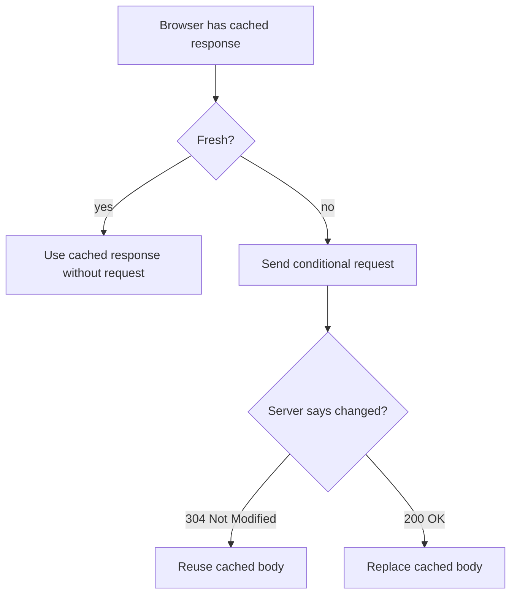
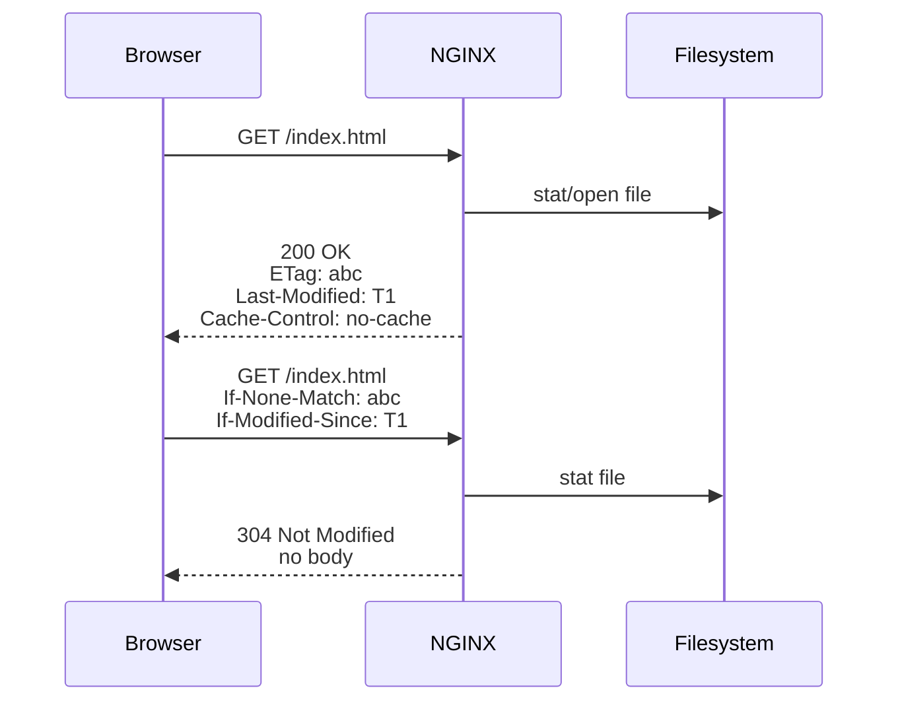
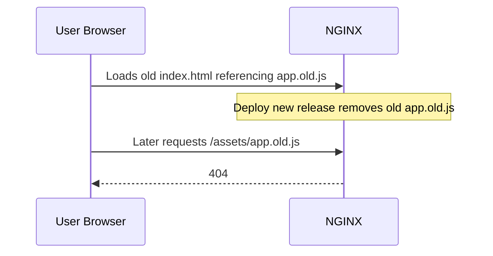

# Part 022 — Browser Cache Semantics: `Cache-Control`, `ETag`, `Last-Modified`

> Cache policy adalah bagian dari API contract. Salah cache header bisa membuat bug yang tidak bisa di-fix dengan reload NGINX, karena browser/CDN sudah menyimpan keputusan lama. Untuk static assets, cache yang agresif bisa sangat baik. Untuk HTML dan authenticated content, cache yang agresif bisa menjadi incident. Production-grade NGINX harus membedakan freshness, validation, invalidation, dan representation negotiation.

Part ini membahas browser cache semantics dari sudut pandang NGINX: bagaimana `expires`, `add_header`, `etag`, `Last-Modified`, conditional request, immutable assets, SPA HTML, error page, dan proxied response harus dirancang agar cepat tanpa mengorbankan correctness.

Referensi resmi utama:

- NGINX headers module `expires`, `add_header`: https://nginx.org/en/docs/http/ngx_http_headers_module.html
- NGINX core module `etag`, `if_modified_since`, `try_files`: https://nginx.org/en/docs/http/ngx_http_core_module.html
- NGINX static content guide: https://docs.nginx.com/nginx/admin-guide/web-server/serving-static-content/
- NGINX gzip module `gzip_vary`: https://nginx.org/en/docs/http/ngx_http_gzip_module.html

---

## 1. Mental model: cache adalah kontrak waktu

Ketika NGINX mengirim response, ia bukan hanya mengirim bytes. Ia memberi instruksi ke client/cache:

```http
Cache-Control: public, max-age=31536000, immutable
ETag: "686ac0f2-1f4ab"
Last-Modified: Mon, 06 Jul 2026 03:12:18 GMT
Vary: Accept-Encoding
```

Instruksi ini menjawab beberapa pertanyaan:

| Pertanyaan | Header terkait |
|---|---|
| Boleh disimpan? | `Cache-Control` |
| Berapa lama dianggap fresh? | `max-age`, `s-maxage`, `Expires` |
| Harus validasi ulang? | `no-cache`, `must-revalidate` |
| Tidak boleh disimpan sama sekali? | `no-store` |
| Bagaimana validasi ulang? | `ETag`, `Last-Modified` |
| Representation bergantung pada request header apa? | `Vary` |

Diagram sederhana:



Kesalahan umum: menganggap cache hanya soal “cepat”. Padahal cache adalah distributed state yang Anda kirim ke luar sistem.

---

## 2. Freshness vs validation

Ada dua konsep besar:

| Konsep | Arti | Contoh |
|---|---|---|
| Freshness | Cache boleh dipakai tanpa bertanya ke server | `max-age=31536000` |
| Validation | Cache harus bertanya apakah masih valid | `ETag` + `If-None-Match` |

Contoh response fresh lama:

```http
Cache-Control: public, max-age=31536000, immutable
```

Browser tidak perlu request ulang selama masih fresh.

Contoh response perlu revalidation:

```http
Cache-Control: no-cache
ETag: "abc123"
```

`no-cache` bukan berarti “jangan simpan”. Artinya cache boleh menyimpan, tetapi harus revalidate sebelum dipakai.

Untuk benar-benar melarang penyimpanan:

```http
Cache-Control: no-store
```

---

## 3. Browser cache bukan proxy cache

Part ini fokus browser/private cache dan static file serving. NGINX proxy cache akan dibahas khusus di Phase 5.

Perbedaan penting:

| Area | Browser cache | Proxy/CDN cache |
|---|---|---|
| Lokasi | User agent | Shared infrastructure |
| Risiko data user | User sendiri | Bisa bocor antar user jika salah |
| Header penting | `Cache-Control`, `ETag`, `Last-Modified` | plus `s-maxage`, `private`, `Vary`, surrogate policy |
| Invalidation | Hard karena di client | Bisa purge/ban tergantung platform |

Walau Part ini fokus browser, header yang Anda kirim sering juga dibaca CDN. Jadi desainnya tetap harus shared-cache-safe.

---

## 4. `Cache-Control`: directive yang harus dipahami

Directive umum:

| Directive | Makna praktis |
|---|---|
| `public` | boleh disimpan shared cache |
| `private` | hanya private cache seperti browser user |
| `max-age=N` | fresh selama N detik |
| `s-maxage=N` | fresh duration khusus shared cache |
| `no-cache` | boleh simpan, wajib revalidate sebelum pakai |
| `no-store` | jangan simpan sama sekali |
| `must-revalidate` | setelah stale, cache harus validasi sebelum pakai |
| `immutable` | selama fresh, resource tidak berubah |

Pola umum:

| Resource | Policy |
|---|---|
| Content-hashed JS/CSS/image | `public, max-age=31536000, immutable` |
| HTML shell SPA | `no-cache` atau `max-age=0, must-revalidate` |
| API authenticated | `private, no-cache` atau `no-store` tergantung sensitivitas |
| Error page | pendek atau no-cache |
| Download private | `private, no-store` bila sensitif |

---

## 5. `Expires` vs `Cache-Control`

`Expires` adalah HTTP/1.0-era absolute timestamp.

```http
Expires: Tue, 06 Jul 2027 03:12:18 GMT
```

`Cache-Control: max-age` lebih modern dan relatif terhadap waktu response.

NGINX directive `expires` dapat mengatur `Expires` dan `Cache-Control` sekaligus.

Contoh:

```nginx
location /assets/ {
    expires 1y;
}
```

NGINX akan menghasilkan header cache sesuai nilai `expires`.

Namun untuk production modern, sering lebih eksplisit memakai `add_header Cache-Control ... always;`, terutama untuk policy seperti `immutable`.

```nginx
location /assets/ {
    add_header Cache-Control "public, max-age=31536000, immutable" always;
}
```

Keduanya bisa dikombinasikan, tetapi jangan membuat policy kontradiktif.

---

## 6. `expires` directive: cepat tapi harus dipahami

Contoh dari headers module:

```nginx
location /images/ {
    expires 30d;
}
```

Makna praktis:

- Nilai positif atau zero menghasilkan `Cache-Control: max-age=t`.
- Nilai negatif menghasilkan `Cache-Control: no-cache`.
- `expires epoch` menghasilkan waktu lama di masa lalu dan `no-cache`.
- `expires max` menghasilkan expiry jauh di masa depan.
- `expires off` menonaktifkan modifikasi header `Expires`/`Cache-Control` oleh directive ini.

Contoh variable-driven policy:

```nginx
map $sent_http_content_type $expires_policy {
    default                 off;
    text/html               -1;
    text/css                1y;
    application/javascript  1y;
    ~image/                 30d;
}

server {
    location / {
        expires $expires_policy;
    }
}
```

Ini kuat, tetapi hati-hati: policy berdasarkan `Content-Type` bergantung pada MIME resolution yang benar.

---

## 7. `add_header`: inheritance dan status code trap

`add_header` terlihat sederhana, tapi sering menjadi sumber bug.

Contoh:

```nginx
location /assets/ {
    add_header Cache-Control "public, max-age=31536000, immutable";
}
```

Masalah: tanpa `always`, `add_header` hanya berlaku pada status code tertentu sesuai dokumentasi NGINX. Untuk error response tertentu, header mungkin tidak ditambahkan.

Versi lebih eksplisit:

```nginx
location /assets/ {
    add_header Cache-Control "public, max-age=31536000, immutable" always;
}
```

Namun `always` juga bisa berbahaya jika error page 404/500 ikut mendapat long cache.

Karena itu, untuk immutable assets, pastikan missing asset mengembalikan 404 yang tidak di-cache lama atau dipisahkan dengan error handling.

Contoh hati-hati:

```nginx
location /assets/ {
    try_files $uri =404;
    add_header Cache-Control "public, max-age=31536000, immutable" always;
}

error_page 404 /404.html;
location = /404.html {
    internal;
    add_header Cache-Control "no-cache" always;
}
```

Tetapi ingat: internal error redirect dan header inheritance perlu diuji. Jangan percaya intent; lihat header aktual dengan `curl -I`.

---

## 8. Header inheritance: satu `add_header` bisa menghapus warisan lain

Di NGINX, `add_header` diwariskan dari level sebelumnya hanya jika level saat ini tidak mendefinisikan `add_header` sama sekali.

Contoh problem:

```nginx
server {
    add_header X-Frame-Options "DENY" always;
    add_header X-Content-Type-Options "nosniff" always;

    location /assets/ {
        add_header Cache-Control "public, max-age=31536000, immutable" always;
    }
}
```

Banyak orang berharap `/assets/` memiliki tiga header:

```txt
X-Frame-Options
X-Content-Type-Options
Cache-Control
```

Tetapi karena `location /assets/` mendefinisikan `add_header`, header dari parent bisa tidak diwariskan.

Pola aman:

```nginx
# snippets/security-headers.conf
add_header X-Frame-Options "DENY" always;
add_header X-Content-Type-Options "nosniff" always;
add_header Referrer-Policy "strict-origin-when-cross-origin" always;

server {
    include snippets/security-headers.conf;

    location /assets/ {
        include snippets/security-headers.conf;
        add_header Cache-Control "public, max-age=31536000, immutable" always;
        try_files $uri =404;
    }
}
```

Ini terasa repetitive, tapi lebih audit-friendly daripada berharap inheritance.

---

## 9. `ETag`: validator kuat secara praktis, tapi pahami boundary

`ETag` adalah validator resource representation.

Response:

```http
ETag: "686ac0f2-1f4ab"
```

Request berikutnya:

```http
If-None-Match: "686ac0f2-1f4ab"
```

Jika sama:

```http
HTTP/1.1 304 Not Modified
```

NGINX core module punya directive:

```nginx
etag on;
```

Default umumnya `on` untuk static resources menurut dokumentasi core module.

Kapan ETag berguna:

- HTML yang perlu revalidate.
- Static files tanpa content-hashed filename.
- File yang sering dicek tetapi jarang berubah.

Kapan hati-hati:

- Multi-node static serving dengan metadata file berbeda.
- Build/deploy yang preserve content tapi ubah mtime/inode/size behavior.
- CDN yang melakukan transform/compression sendiri.

Jika semua static asset sudah content-hashed dan long-cache immutable, ETag tidak terlalu penting untuk assets itu karena browser jarang revalidate selama fresh.

---

## 10. `Last-Modified`: validator berbasis waktu

NGINX dapat mengirim:

```http
Last-Modified: Mon, 06 Jul 2026 03:12:18 GMT
```

Client bisa mengirim:

```http
If-Modified-Since: Mon, 06 Jul 2026 03:12:18 GMT
```

Jika file belum berubah:

```http
304 Not Modified
```

Directive terkait:

```nginx
if_modified_since exact;
```

Opsi umum:

| Option | Makna praktis |
|---|---|
| `exact` | cocok hanya jika waktu sama persis |
| `before` | cocok jika resource belum dimodifikasi sejak waktu request |
| `off` | disable check `If-Modified-Since` |

Untuk kebanyakan static file serving, default sudah cukup. Jangan ubah kecuali ada alasan jelas.

---

## 11. Conditional request lifecycle

Flow:



Manfaat 304:

- Mengurangi bandwidth.
- Tetap memberi server kesempatan memutuskan apakah resource berubah.
- Cocok untuk HTML entrypoint yang harus update cepat.

Namun 304 tetap butuh request. Jika Anda punya millions of users, `no-cache` untuk semua asset berarti banyak conditional requests tetap masuk ke edge.

---

## 12. Immutable hashed assets: policy paling agresif yang aman

Jika filename mengandung content hash:

```txt
/assets/app.1a2b3c4d.js
/assets/vendor.9f8e7d6c.css
/assets/logo.aabbccdd.svg
```

Maka URL berubah saat content berubah. Ini memungkinkan:

```nginx
location /assets/ {
    try_files $uri =404;
    add_header Cache-Control "public, max-age=31536000, immutable" always;
}
```

Kenapa aman?

```txt
content changes -> filename changes -> URL changes -> old cached URL no longer referenced
```

Invariant:

```txt
Never reuse the same hashed filename for different content.
```

Jika build system gagal menjaga invariant ini, long cache menjadi incident.

---

## 13. SPA/HTML entrypoint: jangan long-cache sembarangan

Untuk SPA:

```txt
/index.html
```

sering berisi referensi ke asset terbaru:

```html
<script src="/assets/app.1a2b3c.js"></script>
```

Jika `index.html` di-cache 1 tahun, user bisa terus memakai app lama.

Policy aman:

```nginx
location = /index.html {
    add_header Cache-Control "no-cache" always;
    try_files /index.html =404;
}
```

Atau:

```nginx
location = /index.html {
    add_header Cache-Control "max-age=0, must-revalidate" always;
    try_files /index.html =404;
}
```

Perbedaan praktis:

| Policy | Behavior |
|---|---|
| `no-cache` | boleh simpan, wajib revalidate sebelum pakai |
| `max-age=0, must-revalidate` | langsung stale, harus revalidate |
| `no-store` | jangan simpan sama sekali; lebih berat |

Untuk public SPA shell, `no-cache` biasanya cukup.

---

## 14. SPA fallback dan cache leakage

Config sering terlihat begini:

```nginx
location / {
    try_files $uri $uri/ /index.html;
}
```

Jika Anda memberi cache policy di `location /`:

```nginx
location / {
    add_header Cache-Control "public, max-age=31536000, immutable" always;
    try_files $uri $uri/ /index.html;
}
```

Bug: fallback `/index.html` bisa ikut long-cache.

Pola lebih aman:

```nginx
location /assets/ {
    try_files $uri =404;
    add_header Cache-Control "public, max-age=31536000, immutable" always;
}

location = /index.html {
    try_files /index.html =404;
    add_header Cache-Control "no-cache" always;
}

location / {
    try_files $uri $uri/ /index.html;
}
```

Tetap test header untuk:

```bash
curl -I https://app.example.com/
curl -I https://app.example.com/index.html
curl -I https://app.example.com/some/spa/route
curl -I https://app.example.com/assets/app.1a2b3c.js
```

Pastikan SPA route tidak diam-diam mendapat immutable cache jika body-nya `index.html`.

---

## 15. Error pages: jangan cache incident terlalu lama

Jika asset missing:

```http
GET /assets/app.missing.js
```

Anda tidak ingin browser menyimpan 404 selama setahun karena `add_header ... always` ada di `/assets/`.

Ada dua pendekatan:

### Pendekatan A — jangan pakai `always` untuk immutable assets

```nginx
location /assets/ {
    try_files $uri =404;
    add_header Cache-Control "public, max-age=31536000, immutable";
}
```

Header hanya muncul untuk status code tertentu. Tapi ini bergantung pada daftar status NGINX.

### Pendekatan B — pisah error handling dengan eksplisit

```nginx
location /assets/ {
    try_files $uri @asset_missing;
    add_header Cache-Control "public, max-age=31536000, immutable" always;
}

location @asset_missing {
    add_header Cache-Control "no-cache" always;
    return 404;
}
```

Namun perhatikan inheritance/phase behavior. Selalu validasi dengan `curl -I`.

Production rule:

```txt
Every cache policy must be tested for 200, 301/302, 304, 404, and 500 paths.
```

---

## 16. Redirect cache policy

Redirect juga bisa di-cache.

Contoh canonical redirect:

```nginx
server {
    listen 80;
    server_name example.com;
    return 301 https://example.com$request_uri;
}
```

Browser bisa menyimpan 301. Itu baik jika canonical permanent benar. Berbahaya jika redirect sementara diberi 301 atau cache panjang.

Untuk redirect migration yang belum final:

```nginx
return 302 https://new.example.com$request_uri;
```

Atau eksplisit:

```nginx
add_header Cache-Control "no-cache" always;
return 302 https://new.example.com$request_uri;
```

Jangan jadikan 301 sebagai default untuk eksperimen.

---

## 17. `Vary` dan representation cache

Dari Part 021, compressed response perlu:

```http
Vary: Accept-Encoding
```

`Vary` memberi tahu cache bahwa response berbeda berdasarkan request header tertentu.

Common `Vary`:

| Header | Kapan relevan |
|---|---|
| `Accept-Encoding` | gzip/br/identity representation |
| `Origin` | CORS dynamic origin response |
| `Accept-Language` | localized content |
| `Authorization` | jarang sebagai vary; biasanya jangan shared-cache |

Hati-hati dengan `Vary: User-Agent`; cardinality tinggi dan bisa menghancurkan cache efficiency.

Untuk static assets, biasanya cukup:

```nginx
gzip_vary on;
```

Untuk CORS dynamic origin, akan dibahas lebih dalam di Part 026.

---

## 18. Authenticated content: default konservatif

Untuk authenticated pages/API, cache policy tergantung data.

Contoh private dashboard HTML:

```nginx
location /dashboard/ {
    proxy_pass http://app_backend;
    add_header Cache-Control "private, no-cache" always;
}
```

Untuk response sangat sensitif:

```nginx
location /billing/export/ {
    proxy_pass http://app_backend;
    add_header Cache-Control "no-store" always;
}
```

Perbedaan:

| Policy | Kapan |
|---|---|
| `private, no-cache` | browser user boleh simpan tapi harus revalidate |
| `no-store` | jangan simpan; cocok untuk sensitive data/export/token |
| `public` | hampir tidak cocok untuk user-specific response |

Jangan menaruh `public, max-age=...` di parent `server` untuk semua response.

---

## 19. Proxied response: siapa owner cache policy?

Ketika NGINX reverse proxy ke app, ada dua opsi:

### App owns cache policy

```nginx
location /api/ {
    proxy_pass http://app_backend;
}
```

App mengirim:

```http
Cache-Control: private, no-cache
```

NGINX hanya meneruskan.

### Edge owns cache policy

```nginx
location /public-api/ {
    proxy_pass http://app_backend;
    proxy_hide_header Cache-Control;
    proxy_hide_header Expires;
    add_header Cache-Control "public, max-age=60" always;
}
```

Ini harus dilakukan hati-hati. Edge mengambil alih kontrak HTTP dari app.

Decision rule:

```txt
If cache policy depends on domain/user/business semantics, app should usually own it.
If cache policy depends on edge/static representation semantics, NGINX can own it.
```

---

## 20. Cache policy by content type dengan `map`

Untuk static server besar, Anda bisa menggunakan `map`.

```nginx
map $sent_http_content_type $cache_control {
    default                 "no-cache";
    text/html               "no-cache";
    text/css                "public, max-age=31536000, immutable";
    application/javascript  "public, max-age=31536000, immutable";
    image/svg+xml           "public, max-age=31536000, immutable";
    ~image/                 "public, max-age=2592000";
}

server {
    location / {
        try_files $uri $uri/ /index.html;
        add_header Cache-Control $cache_control always;
    }
}
```

Namun ada trap: jika SPA route `/foo` fallback ke `/index.html`, `Content-Type` akan `text/html`, jadi policy `no-cache`. Itu bisa baik.

Tapi untuk missing files, error response content type bisa membuat policy tidak sesuai. Test status code.

Lebih audit-friendly untuk aplikasi kecil:

```nginx
/assets/   -> immutable
/index.html -> no-cache
/          -> fallback carefully
```

---

## 21. Cache busting: filename hash vs query string

Dua pola:

```txt
/assets/app.1a2b3c.js
/assets/app.js?v=1a2b3c
```

Content-hashed filename lebih kuat.

Kenapa?

| Aspect | Filename hash | Query string |
|---|---|---|
| CDN compatibility | sangat baik | kadang policy khusus |
| Human audit | jelas | bisa tersembunyi |
| Static file lookup | natural | same file path |
| Rollback | mudah | tergantung HTML query |
| Cache key ambiguity | rendah | tergantung proxy/CDN config |

Recommendation:

```txt
Use content hash in filename for immutable assets.
Use HTML revalidation to point to latest hashed assets.
```

---

## 22. Deployment invariants untuk long cache

Long cache aman hanya jika deployment memenuhi invariant.

```txt
Invariant 1: Hashed filenames are content-addressed.
Invariant 2: Old assets remain available after new HTML deploy.
Invariant 3: HTML is revalidated frequently.
Invariant 4: Rollback does not reference deleted assets.
Invariant 5: Missing assets are not cached for a long time.
```

Kenapa old assets harus tetap ada?

Sequence:



Untuk zero-downtime frontend deploy, simpan beberapa release asset atau deploy assets sebelum HTML.

Pola aman:

```txt
1. Upload new assets
2. Verify assets exist
3. Switch HTML/index to reference new assets
4. Keep old assets for rollback/cache tail window
5. Garbage collect old assets after safe retention
```

---

## 23. Testing cache headers

Minimal test matrix:

```bash
# HTML
curl -I https://app.example.com/
curl -I https://app.example.com/index.html
curl -I https://app.example.com/some/spa/route

# Immutable assets
curl -I https://app.example.com/assets/app.1a2b3c.js

# Missing asset
curl -I https://app.example.com/assets/missing.js

# Compression representation
curl -I -H 'Accept-Encoding: gzip' https://app.example.com/assets/app.1a2b3c.js
curl -I -H 'Accept-Encoding:' https://app.example.com/assets/app.1a2b3c.js

# Conditional request
curl -I https://app.example.com/index.html
curl -I -H 'If-None-Match: "<etag-from-previous-response>"' https://app.example.com/index.html
```

Expected:

| Path | Expected cache policy |
|---|---|
| `/assets/app.hash.js` | long public immutable |
| `/index.html` | no-cache/revalidate |
| `/some/spa/route` | same as HTML fallback |
| `/assets/missing.js` | no-cache or short |
| 500 page | no-cache/no-store depending sensitivity |
| gzip variant | has `Vary: Accept-Encoding` |

---

## 24. Observability: log what matters

Add fields:

```nginx
log_format edge_json escape=json
  '{'
    '"time":"$time_iso8601",'
    '"request":"$request",'
    '"status":$status,'
    '"uri":"$uri",'
    '"sent_cache_control":"$sent_http_cache_control",'
    '"sent_expires":"$sent_http_expires",'
    '"sent_etag":"$sent_http_etag",'
    '"sent_last_modified":"$sent_http_last_modified",'
    '"sent_vary":"$sent_http_vary",'
    '"sent_content_encoding":"$sent_http_content_encoding",'
    '"sent_content_type":"$sent_http_content_type"'
  '}';
```

Pertanyaan yang bisa dijawab:

| Pertanyaan | Field |
|---|---|
| Apakah HTML long-cache? | `$sent_http_cache_control` |
| Apakah missing asset ikut immutable? | status + cache header |
| Apakah ETag keluar? | `$sent_http_etag` |
| Apakah compression variant aman? | `$sent_http_vary`, `$sent_http_content_encoding` |
| Apakah MIME policy benar? | `$sent_http_content_type` |

---

## 25. Production config: SPA static cache policy

```nginx
server {
    listen 443 ssl http2;
    server_name app.example.com;

    root /srv/www/app/current/public;

    include snippets/security-headers.conf;

    location /assets/ {
        include snippets/security-headers.conf;

        try_files $uri @asset_missing;

        gzip_static on;
        gzip_vary on;

        add_header Cache-Control "public, max-age=31536000, immutable" always;
    }

    location @asset_missing {
        include snippets/security-headers.conf;
        add_header Cache-Control "no-cache" always;
        return 404;
    }

    location = /index.html {
        include snippets/security-headers.conf;
        try_files /index.html =404;
        add_header Cache-Control "no-cache" always;
    }

    location / {
        try_files $uri $uri/ /index.html;
    }
}
```

Review:

| Path | Result |
|---|---|
| `/assets/app.hash.js` | immutable |
| `/assets/missing.js` | 404 no-cache |
| `/index.html` | no-cache |
| `/deep/spa/route` | internally serves index; verify final cache header |

Important: depending on internal redirect behavior and config, validate `/deep/spa/route` headers directly. Do not infer.

---

## 26. Production config: mixed static and proxied app

```nginx
upstream app_backend {
    server 10.0.20.11:8080;
    server 10.0.20.12:8080;
    keepalive 64;
}

server {
    listen 443 ssl http2;
    server_name www.example.com;

    root /srv/www/app/current/public;

    location /assets/ {
        try_files $uri =404;
        gzip_static on;
        gzip_vary on;
        add_header Cache-Control "public, max-age=31536000, immutable" always;
    }

    location /static/ {
        try_files $uri =404;
        add_header Cache-Control "public, max-age=86400" always;
    }

    location / {
        proxy_pass http://app_backend;
        proxy_http_version 1.1;
        proxy_set_header Connection "";
        proxy_set_header Host $host;
        proxy_set_header X-Forwarded-For $proxy_add_x_forwarded_for;
        proxy_set_header X-Forwarded-Proto $scheme;

        # App owns dynamic cache policy.
    }
}
```

Kenapa app owns dynamic cache policy?

Karena app tahu:

- apakah response user-specific,
- apakah response punya authorization semantics,
- apakah data boleh disimpan,
- apakah response adalah public resource.

NGINX tahu filesystem/static representation. Jangan mencampur domain ownership tanpa alasan.

---

## 27. Common incidents

### Incident 1 — User stuck on old frontend

Cause:

```nginx
location / {
    add_header Cache-Control "public, max-age=31536000" always;
    try_files $uri $uri/ /index.html;
}
```

`index.html` ikut long-cache.

Fix:

- HTML `no-cache`.
- Assets immutable only if hashed.
- Test SPA route header.

### Incident 2 — Missing JS cached as 404

Cause:

```nginx
location /assets/ {
    add_header Cache-Control "public, max-age=31536000, immutable" always;
    try_files $uri =404;
}
```

Fix:

- Separate missing asset handling.
- Avoid long cache for 404.
- Keep old assets during rollout.

### Incident 3 — Security headers disappear on assets

Cause: `add_header Cache-Control` in child location resets inherited `add_header` set.

Fix:

- Repeat/include security headers in child location.
- Test actual headers.

### Incident 4 — CDN caches user-specific API

Cause:

```http
Cache-Control: public, max-age=300
```

on authenticated response.

Fix:

- `private, no-cache` or `no-store`.
- Ensure CDN respects `Authorization`/cache rules.
- Add tests for authenticated response headers.

### Incident 5 — ETag mismatch across nodes

Cause:

- same content deployed with different file metadata,
- inconsistent artifact packaging,
- mixed release nodes.

Fix:

- atomic deploy,
- identical artifact across nodes,
- content-hashed filenames,
- consider disabling ETag where CDN/cluster behavior is problematic.

---

## 28. Review checklist

```txt
[ ] Assets with long cache have content hash in filename.
[ ] HTML entrypoint is revalidated, not long-cached.
[ ] SPA fallback route has correct cache policy.
[ ] Missing assets do not get long immutable cache.
[ ] Error pages do not get unsafe cache policy.
[ ] Authenticated content is private/no-cache/no-store as appropriate.
[ ] `add_header` inheritance has been reviewed.
[ ] `always` is used intentionally, not blindly.
[ ] `Vary: Accept-Encoding` exists for compressed variants.
[ ] `ETag`/`Last-Modified` behavior is understood and tested.
[ ] CDN/shared cache behavior is considered if present.
[ ] Curl test matrix covers 200, 301/302, 304, 404, 500.
```

---

## 29. Lab: build a safe cache policy

Create files:

```txt
/srv/www/cache-lab/public/index.html
/srv/www/cache-lab/public/assets/app.abc123.js
/srv/www/cache-lab/public/assets/style.def456.css
```

Config:

```nginx
server {
    listen 8080;
    server_name cache.local;
    root /srv/www/cache-lab/public;

    location /assets/ {
        try_files $uri @asset_missing;
        add_header Cache-Control "public, max-age=31536000, immutable" always;
    }

    location @asset_missing {
        add_header Cache-Control "no-cache" always;
        return 404;
    }

    location = /index.html {
        try_files /index.html =404;
        add_header Cache-Control "no-cache" always;
    }

    location / {
        try_files $uri $uri/ /index.html;
    }
}
```

Test:

```bash
nginx -t

curl -I -H 'Host: cache.local' http://127.0.0.1:8080/
curl -I -H 'Host: cache.local' http://127.0.0.1:8080/index.html
curl -I -H 'Host: cache.local' http://127.0.0.1:8080/deep/link
curl -I -H 'Host: cache.local' http://127.0.0.1:8080/assets/app.abc123.js
curl -I -H 'Host: cache.local' http://127.0.0.1:8080/assets/missing.js
```

Expected reasoning:

```txt
/                       -> HTML behavior, no-cache
/index.html             -> no-cache
/deep/link              -> SPA fallback, verify no-cache
/assets/app.abc123.js   -> immutable
/assets/missing.js      -> 404 no-cache
```

Then test validators:

```bash
curl -I -H 'Host: cache.local' http://127.0.0.1:8080/index.html
# Copy ETag or Last-Modified
curl -I -H 'Host: cache.local' -H 'If-None-Match: "<etag>"' http://127.0.0.1:8080/index.html
curl -I -H 'Host: cache.local' -H 'If-Modified-Since: <last-modified>' http://127.0.0.1:8080/index.html
```

Observe whether NGINX returns `304 Not Modified`.

---

## 30. Key takeaways

1. Cache policy is a distributed contract; once sent to browsers, it is hard to retract.
2. `max-age` controls freshness; `ETag`/`Last-Modified` support validation.
3. `no-cache` means “store but revalidate”, not “do not store”.
4. `no-store` means “do not store”.
5. Content-hashed assets can safely use `public, max-age=31536000, immutable`.
6. HTML entrypoints and SPA fallback should usually be revalidated.
7. `add_header` inheritance is dangerous if misunderstood.
8. `always` is powerful but can accidentally long-cache errors.
9. Compression requires `Vary: Accept-Encoding` to keep representation cache safe.
10. Test cache headers for success, redirect, not found, error, compressed, and conditional request paths.

Part berikutnya membahas **`error_page`, named locations, dan internal error flow**: bagaimana NGINX memindahkan request secara internal, bagaimana error handling bisa mengubah status/header/body, dan bagaimana mendesain error responses yang aman untuk API, SPA, reverse proxy, dan static hosting.
