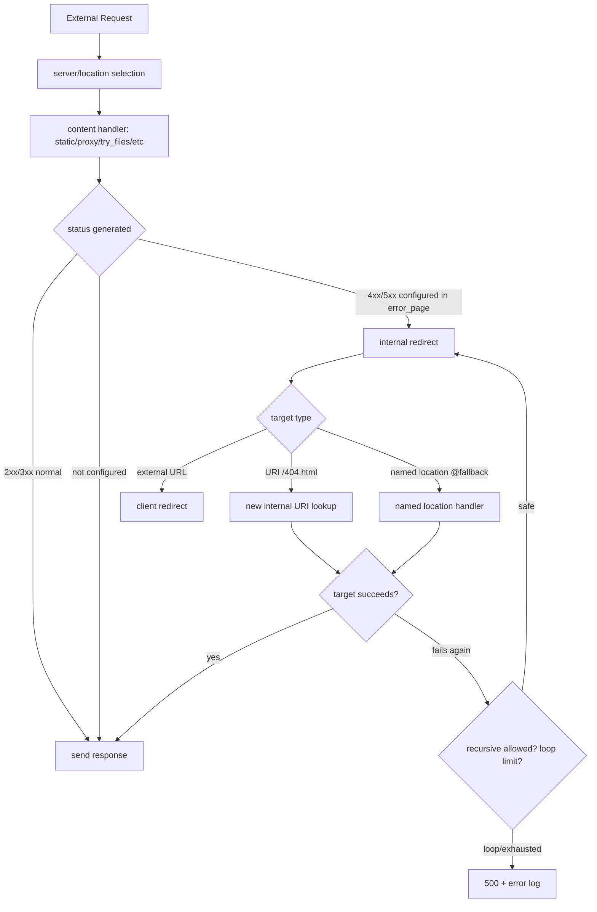

# Part 023 — `error_page`, Named Location, dan Internal Error Flow

> Target part ini: kamu bisa merancang error handling NGINX sebagai **control-flow yang eksplisit**, bukan sekadar menampilkan halaman `404.html`. Setelah part ini, kamu akan tahu kapan error harus dipertahankan, kapan boleh di-map, kapan harus diarahkan ke named location, dan bagaimana mencegah internal redirect loop yang sulit dilacak.

Di part sebelumnya kita sudah membahas static serving, path mapping, `try_files`, MIME, compression, dan browser cache. Sekarang kita masuk ke bagian yang terlihat kecil tetapi sering menentukan kualitas production: **apa yang terjadi ketika request gagal**.

Pada sistem production, error response bukan hanya UI. Error response adalah kontrak antara edge, client, upstream, monitoring, cache, security, dan incident response.

Pertanyaan yang harus dijawab:

- apakah error ini berasal dari client, NGINX, filesystem, upstream, atau policy?
- apakah status code asli harus dipertahankan?
- apakah halaman error boleh di-cache browser/CDN?
- apakah custom error page boleh diakses langsung oleh public?
- apakah internal redirect bisa membuat loop?
- apakah error response masih membawa security header yang benar?
- apakah log cukup untuk membedakan 404 normal, 404 dari fallback, dan 404 akibat deployment rusak?

NGINX menyediakan primitive utama bernama `error_page`.

Tetapi `error_page` bukan hanya “custom HTML”. Ia adalah salah satu mekanisme **internal redirect** di NGINX.

---

## 1. Mental Model: Error Handling sebagai State Transition

Bayangkan request masuk ke state machine berikut.



Core idea:

> `error_page` mengubah failure menjadi request flow baru di dalam NGINX.

Maka error handling harus diperlakukan seperti routing. Ia punya target, inheritance, status mapping, method semantics, loop risk, cache impact, dan observability.

---

## 2. Syntax Dasar `error_page`

Format dasar:

```nginx
error_page <status_code> ... [=<response_code>] <uri>;
```

Contoh umum:

```nginx
error_page 404 /404.html;
error_page 500 502 503 504 /50x.html;
```

Artinya:

- jika handler menghasilkan `404`, NGINX melakukan internal redirect ke `/404.html`;
- jika handler menghasilkan `500`, `502`, `503`, atau `504`, NGINX melakukan internal redirect ke `/50x.html`;
- status code asli biasanya tetap dipakai kecuali kamu mengubahnya dengan `=...`.

Contoh minimal yang benar:

```nginx
server {
    listen 80;
    server_name static.example.com;

    root /srv/www/static;

    error_page 404 /errors/404.html;
    error_page 500 502 503 504 /errors/50x.html;

    location / {
        try_files $uri $uri/ =404;
    }

    location /errors/ {
        internal;
        root /srv/www/static;
    }
}
```

Hal penting: `location /errors/` diberi `internal`.

Kenapa?

Karena error page adalah implementation detail. Client tidak perlu bisa membuka `/errors/404.html` secara langsung. Jika dibuka langsung, status-nya bisa menjadi `200`, yang merusak semantic, metrics, dan crawler behavior.

---

## 3. `internal`: Melindungi Target Error dari Direct Access

Directive `internal` membuat sebuah location hanya bisa digunakan oleh internal request. External request ke location itu akan mendapat `404`.

```nginx
location /errors/ {
    internal;
    root /srv/www/static;
}
```

Dengan config ini:

```bash
curl -i https://static.example.com/missing-page
```

Boleh menghasilkan:

```http
HTTP/2 404
content-type: text/html
...
```

Tetapi:

```bash
curl -i https://static.example.com/errors/404.html
```

Akan menghasilkan `404`, bukan custom page sebagai `200`.

Ini invariant production yang bagus:

> Error asset boleh dipakai untuk membentuk response, tetapi tidak boleh menjadi public route normal.

---

## 4. Internal Redirect Mengubah Method untuk Non-GET/HEAD

Saat `error_page` melakukan internal redirect ke URI, NGINX mengubah method menjadi `GET` untuk semua method selain `GET` dan `HEAD`.

Implikasi:

```nginx
error_page 413 /errors/payload-too-large.html;
```

Jika client mengirim `POST /upload` lalu terkena `413`, target `/errors/payload-too-large.html` akan diproses sebagai GET internal request.

Ini biasanya baik untuk static HTML error page.

Tetapi jika target error diarahkan ke application handler, jangan berasumsi method asli masih ada.

Bad mental model:

```nginx
error_page 401 /auth/error-handler;
```

Lalu upstream `/auth/error-handler` berharap menerima method asli `POST`. Itu rapuh.

Jika method penting, gunakan named location atau pass metadata eksplisit lewat header/variable sesuai desain.

---

## 5. `error_page` dengan Status Code Tetap

Ini pola paling umum:

```nginx
error_page 404 /errors/404.html;
```

Response tetap `404`, tetapi body diambil dari `/errors/404.html`.

Validasi:

```bash
curl -i https://example.com/not-found
```

Expected:

```http
HTTP/2 404
content-type: text/html
```

Bukan:

```http
HTTP/2 200
```

Rule:

> Custom error page tidak boleh mengubah semantic kecuali ada alasan eksplisit.

Untuk SEO, API client, browser cache, synthetic monitor, dan alerting, status code jauh lebih penting daripada tampilan HTML.

---

## 6. `error_page` dengan Status Code Mapping

NGINX memungkinkan status code diganti.

```nginx
error_page 404 =200 /empty.gif;
```

Ini berarti jika terjadi `404`, response akhirnya menjadi `200` dengan body dari `/empty.gif`.

Pola ini jarang layak dipakai untuk web/app modern. Ia bisa berguna untuk kompatibilitas legacy, tracking pixel lama, atau behavior khusus, tetapi berbahaya jika dipakai untuk menyembunyikan error.

Contoh yang lebih masuk akal:

```nginx
location /legacy-pixel.gif {
    error_page 404 =204 @empty;
    try_files /legacy-pixel.gif =404;
}

location @empty {
    return 204;
}
```

Tetapi untuk static page biasa:

```nginx
# Hindari untuk halaman normal
error_page 404 =200 /index.html;
```

Ini sering muncul di SPA deployment. Masalahnya: semua URL yang tidak valid menjadi `200`, termasuk asset missing, endpoint salah, dan typo.

Untuk SPA, fallback harus dibatasi ke navigation route, bukan seluruh request. Ini sudah dibahas di Part 018.

---

## 7. Named Location sebagai Error Handler

Named location memakai prefix `@`.

```nginx
error_page 404 @not_found;

location @not_found {
    return 404 "not found\n";
}
```

Named location tidak dipakai untuk request normal. Ia hanya target redirection internal.

Gunanya:

- membuat fallback logic tanpa mengekspos URI publik;
- meneruskan error ke upstream khusus;
- membangun response ringkas tanpa file static;
- menghindari perubahan URI/method tertentu pada beberapa flow;
- memisahkan location public dan location error handling.

Contoh reverse proxy fallback:

```nginx
upstream app_backend {
    server 127.0.0.1:8080;
}

server {
    listen 80;
    server_name app.example.com;

    location / {
        proxy_pass http://app_backend;
        proxy_intercept_errors on;
        error_page 404 @app_not_found;
        error_page 502 503 504 @temporary_failure;
    }

    location @app_not_found {
        add_header Cache-Control "no-store" always;
        return 404 '{"error":"not_found"}\n';
    }

    location @temporary_failure {
        add_header Cache-Control "no-store" always;
        add_header Retry-After "30" always;
        return 503 '{"error":"temporarily_unavailable"}\n';
    }
}
```

Catatan penting: `proxy_intercept_errors` akan dibahas lebih dalam di reverse proxy phase. Untuk sekarang cukup pahami bahwa upstream error tidak selalu otomatis diubah oleh `error_page` pada context proxy kecuali interception diaktifkan untuk response tertentu.

---

## 8. URI Error Page vs Named Location

Gunakan URI static jika error page adalah file.

```nginx
error_page 404 /errors/404.html;

location /errors/ {
    internal;
    root /srv/www/site;
}
```

Gunakan named location jika error handling adalah logic.

```nginx
error_page 429 @rate_limited;

location @rate_limited {
    add_header Retry-After "60" always;
    return 429 "too many requests\n";
}
```

Perbandingan:

| Target | Cocok untuk | Risiko utama |
|---|---|---|
| URI static | HTML error page, branded error, fallback file | lupa `internal`, salah `root/alias`, response jadi `200` saat direct access |
| Named location | return body, fallback upstream, policy response | terlalu banyak logic, observability kurang, tidak bisa direct test via URL |
| External URL | redirect ke lokasi lain | bisa salah semantic, redirect loop, dependency ke service luar |

---

## 9. Inheritance Trap pada `error_page`

`error_page` diwariskan dari level sebelumnya hanya jika level saat ini tidak mendefinisikan `error_page` sama sekali.

Contoh rapuh:

```nginx
server {
    error_page 404 /errors/404.html;
    error_page 500 502 503 504 /errors/50x.html;

    location /api/ {
        error_page 404 @api_404;
        proxy_pass http://api_backend;
    }
}
```

Di `location /api/`, kamu mungkin mengira `500 502 503 504` masih diwariskan dari server. Tetapi karena location itu mendefinisikan `error_page`, inheritance parent bisa tidak berlaku untuk directive yang sama.

Pola aman:

```nginx
server {
    error_page 404 /errors/404.html;
    error_page 500 502 503 504 /errors/50x.html;

    location /api/ {
        error_page 404 @api_404;
        error_page 500 502 503 504 @api_50x;
        proxy_pass http://api_backend;
    }
}
```

Atau pakai snippet yang eksplisit:

```nginx
# snippets/error-pages-web.conf
error_page 404 /errors/404.html;
error_page 500 502 503 504 /errors/50x.html;
```

```nginx
server {
    include snippets/error-pages-web.conf;

    location /admin/ {
        include snippets/error-pages-web.conf;
        auth_basic "restricted";
    }
}
```

Jangan mengandalkan “sepertinya diwariskan”. Untuk error behavior, explicit lebih aman.

---

## 10. Jangan Membuat Error Page yang Bisa Error Lagi

Bad config:

```nginx
server {
    root /srv/www/app;

    error_page 404 /errors/404.html;

    location / {
        try_files $uri =404;
    }
}
```

Jika `/srv/www/app/errors/404.html` tidak ada, maka flow-nya:

```txt
/missing -> 404 -> internal redirect /errors/404.html -> file missing -> 404 -> error_page lagi -> ...
```

NGINX punya limit internal redirect untuk mencegah loop, tetapi mencapai limit itu berarti client mendapat `500` dan error log menjadi noisy.

Pola aman:

```nginx
server {
    root /srv/www/app;

    error_page 404 /errors/404.html;

    location = /errors/404.html {
        internal;
        root /srv/www/app;
        log_not_found off;
    }
}
```

Lebih defensive:

```nginx
location = /errors/404.html {
    internal;
    root /srv/www/app;
    default_type text/html;
}
```

Dan di deployment pipeline:

```bash
test -f /srv/www/app/errors/404.html
test -f /srv/www/app/errors/50x.html
nginx -t
```

Invariant:

> Error page asset adalah dependency production. Jika tidak ada, deployment harus gagal sebelum reload.

---

## 11. Recursive Error Pages

Directive:

```nginx
recursive_error_pages on;
```

Default-nya off.

Jangan mengaktifkan ini kecuali kamu benar-benar paham flow-nya.

Dengan `recursive_error_pages on`, error yang terjadi saat memproses error page bisa diproses lagi oleh `error_page`. Ini berguna untuk beberapa chain khusus, tetapi meningkatkan risiko loop dan debugging sulit.

Contoh yang biasanya tidak perlu:

```nginx
recursive_error_pages on;
error_page 401 @login;
error_page 403 @forbidden;
```

Lebih baik desain handler-nya eksplisit dan pendek.

Rule production:

> Error handling harus dangkal. Jika error flow membutuhkan banyak tahap, kemungkinan besar boundary-nya salah.

---

## 12. Error Page untuk API: Jangan Kirim HTML ke Machine Client

Untuk API, HTML error page sering menjadi bug.

Bad:

```nginx
location /api/ {
    proxy_pass http://api_backend;
    error_page 404 /errors/404.html;
}
```

Client API mungkin mengharapkan JSON:

```json
{"error":"not_found"}
```

Tetapi menerima HTML:

```html
<html>...</html>
```

Pola lebih aman:

```nginx
location /api/ {
    proxy_pass http://api_backend;
    proxy_intercept_errors on;

    error_page 404 @api_404;
    error_page 500 502 503 504 @api_50x;
}

location @api_404 {
    default_type application/json;
    add_header Cache-Control "no-store" always;
    return 404 '{"error":"not_found"}\n';
}

location @api_50x {
    default_type application/json;
    add_header Cache-Control "no-store" always;
    return 503 '{"error":"service_unavailable"}\n';
}
```

Prinsip:

> Error format adalah bagian dari API contract.

Jika `/api/` adalah JSON API, error dari NGINX juga harus JSON. Jika `/` adalah website, error boleh HTML.

---

## 13. Error Page dan Cache-Control

Error response harus punya cache policy eksplisit.

Untuk static website:

```nginx
location = /errors/404.html {
    internal;
    root /srv/www/app;
    add_header Cache-Control "no-store" always;
}
```

Untuk 404 yang memang stabil, misalnya asset fingerprint missing, kadang boleh cache pendek:

```nginx
location = /errors/404.html {
    internal;
    root /srv/www/app;
    add_header Cache-Control "max-age=60" always;
}
```

Tetapi untuk `500/502/503/504`, default aman adalah `no-store`.

```nginx
location = /errors/50x.html {
    internal;
    root /srv/www/app;
    add_header Cache-Control "no-store" always;
}
```

Kenapa `always` penting?

Karena tanpa `always`, beberapa header tidak ditambahkan untuk semua status code. Ini sudah disinggung di Part 022.

Error response yang tidak punya `Cache-Control` bisa di-cache oleh intermediate layer secara tidak sengaja, tergantung chain yang ada di depan/belakang NGINX.

---

## 14. Error Page dan Security Header

Masalah umum:

```nginx
server {
    add_header X-Frame-Options DENY;
    add_header X-Content-Type-Options nosniff;

    error_page 404 /errors/404.html;
}
```

Tanpa `always`, header mungkin tidak muncul pada response error tertentu.

Pola lebih benar:

```nginx
server {
    add_header X-Frame-Options "DENY" always;
    add_header X-Content-Type-Options "nosniff" always;
    add_header Referrer-Policy "no-referrer" always;

    error_page 404 /errors/404.html;
}
```

Tetapi ingat inheritance trap `add_header`: jika location error page mendefinisikan `add_header` sendiri, parent header bisa tidak diwariskan seperti yang kamu kira.

Pola aman memakai snippet:

```nginx
# snippets/security-headers.conf
add_header X-Frame-Options "DENY" always;
add_header X-Content-Type-Options "nosniff" always;
add_header Referrer-Policy "no-referrer" always;
```

```nginx
server {
    include snippets/security-headers.conf;

    location = /errors/404.html {
        internal;
        include snippets/security-headers.conf;
        add_header Cache-Control "no-store" always;
        root /srv/www/app;
    }
}
```

Yes, ini repetitif. Tetapi untuk security headers, explicit repetition sering lebih aman daripada inheritance surprise.

---

## 15. Error Handling untuk Static Site

Reference config:

```nginx
server {
    listen 80;
    server_name docs.example.com;

    root /srv/www/docs/current;
    index index.html;

    include snippets/security-headers.conf;

    error_page 404 /errors/404.html;
    error_page 500 502 503 504 /errors/50x.html;

    location / {
        try_files $uri $uri/ =404;
    }

    location = /errors/404.html {
        internal;
        root /srv/www/docs/current;
        default_type text/html;
        add_header Cache-Control "no-store" always;
        include snippets/security-headers.conf;
    }

    location = /errors/50x.html {
        internal;
        root /srv/www/docs/current;
        default_type text/html;
        add_header Cache-Control "no-store" always;
        include snippets/security-headers.conf;
    }
}
```

Test matrix:

```bash
# normal page
curl -i http://docs.example.com/

# missing page should be 404, not 200
curl -i http://docs.example.com/missing

# error page should not be directly visible as normal public content
curl -i http://docs.example.com/errors/404.html

# response should include security and cache headers
curl -I http://docs.example.com/missing
```

Expected:

```txt
/missing                  -> 404
/errors/404.html direct   -> 404
Cache-Control             -> no-store
X-Content-Type-Options    -> nosniff
```

---

## 16. Error Handling untuk SPA

Bad SPA pattern:

```nginx
location / {
    try_files $uri /index.html;
}
```

Semua missing path menjadi `200`. Ini bisa diterima untuk pure client-side routing, tetapi sangat sering salah jika static assets, API, atau file download hidup di host yang sama.

Lebih baik:

```nginx
location /assets/ {
    try_files $uri =404;
    expires 1y;
    add_header Cache-Control "public, immutable" always;
}

location /api/ {
    return 404;
}

location / {
    try_files $uri $uri/ /index.html;
}

error_page 404 /errors/404.html;
```

Jika ingin navigation fallback lebih ketat, gunakan convention path:

```nginx
location /app/ {
    try_files $uri $uri/ /app/index.html;
}

location /assets/ {
    try_files $uri =404;
}
```

Invariant:

> SPA fallback bukan error handling global. Ia adalah routing policy untuk navigation path tertentu.

---

## 17. Error Handling untuk Maintenance Mode

Maintenance mode sering lebih aman dilakukan di edge.

```nginx
map $http_x_maintenance_bypass $maintenance_bypass {
    default 0;
    "internal-secret" 1;
}

server {
    listen 80;
    server_name app.example.com;

    set $maintenance 0;

    if (-f /etc/nginx/maintenance/app.enabled) {
        set $maintenance 1;
    }

    if ($maintenance_bypass) {
        set $maintenance 0;
    }

    location / {
        if ($maintenance) {
            return 503;
        }

        proxy_pass http://app_backend;
    }

    error_page 503 @maintenance;

    location @maintenance {
        add_header Retry-After "300" always;
        add_header Cache-Control "no-store" always;
        default_type text/html;
        return 503 "<h1>Maintenance</h1><p>Please retry later.</p>\n";
    }
}
```

Catatan:

- penggunaan `if` di NGINX harus hati-hati; `return` di dalam `if` adalah salah satu penggunaan yang umumnya aman;
- untuk policy lebih kompleks, lebih baik gunakan `map`, include generated config, atau routing dari layer platform;
- `Retry-After` membantu client dan crawler memahami bahwa kondisi ini sementara.

---

## 18. Error Page dan `return`

Kadang custom file tidak perlu. Untuk API atau machine endpoint, `return` cukup.

```nginx
location @rate_limited {
    add_header Retry-After "60" always;
    default_type application/json;
    return 429 '{"error":"rate_limited"}\n';
}
```

Keuntungan:

- tidak bergantung filesystem;
- response kecil dan deterministik;
- cocok untuk API;
- mudah diuji.

Kekurangan:

- tidak cocok untuk branded HTML panjang;
- escaping string bisa berantakan;
- tidak ideal untuk konten multi-bahasa.

Decision:

| Use case | Pilihan |
|---|---|
| API JSON error | `return` di named location |
| Branded website error | static HTML + `internal` |
| Maintenance sederhana | named location + `return 503` atau static HTML |
| Error page multi-language | upstream/app handler atau static per locale |
| Legacy fallback | `error_page ... =code ...` dengan test ketat |

---

## 19. Observability: Bedakan Original Status dan Final Status

Untuk debugging error flow, log harus membantu menjawab:

- request awalnya apa?
- status final apa?
- upstream status apa?
- apakah terjadi internal redirect?
- berapa request time?
- location mana yang kira-kira menang?

Contoh log format:

```nginx
log_format edge_json escape=json
  '{'
    '"time":"$time_iso8601",'
    '"request_id":"$request_id",'
    '"remote_addr":"$remote_addr",'
    '"host":"$host",'
    '"method":"$request_method",'
    '"uri":"$uri",'
    '"request_uri":"$request_uri",'
    '"status":$status,'
    '"body_bytes_sent":$body_bytes_sent,'
    '"request_time":$request_time,'
    '"upstream_status":"$upstream_status",'
    '"upstream_response_time":"$upstream_response_time",'
    '"referer":"$http_referer",'
    '"user_agent":"$http_user_agent"'
  '}';
```

`$uri` bisa berubah karena internal rewrite/redirect, sedangkan `$request_uri` menyimpan original URI dengan query string.

Untuk debugging, perbedaan ini sangat berguna.

Jika access log menunjukkan:

```json
{"request_uri":"/missing","uri":"/errors/404.html","status":404}
```

Maka kamu tahu response final memakai internal error page.

---

## 20. Failure Mode Catalogue

### Failure 1 — Direct access ke error page menghasilkan 200

Symptom:

```bash
curl -i https://example.com/errors/404.html
HTTP/2 200
```

Root cause:

```nginx
location /errors/ {
    root /srv/www/app;
}
```

Fix:

```nginx
location /errors/ {
    internal;
    root /srv/www/app;
}
```

### Failure 2 — Missing route menjadi 200

Symptom:

```bash
curl -i https://example.com/typo
HTTP/2 200
```

Root cause:

```nginx
error_page 404 =200 /index.html;
```

Fix:

- gunakan SPA fallback hanya untuk navigation route;
- jangan map 404 global ke 200;
- asset/API missing harus tetap 404.

### Failure 3 — Error page loop menjadi 500

Symptom:

```txt
rewrite or internal redirection cycle
```

Root cause:

- `/errors/404.html` tidak ada;
- target error page juga menghasilkan error yang sama;
- `recursive_error_pages on` memperparah loop.

Fix:

- test file saat deploy;
- exact location untuk error asset;
- jangan aktifkan recursive error pages kecuali perlu.

### Failure 4 — API menerima HTML error

Symptom:

```txt
JSON parser error: unexpected '<'
```

Root cause:

API location memakai HTML error page global.

Fix:

```nginx
location /api/ {
    error_page 404 @api_404;
}

location @api_404 {
    default_type application/json;
    return 404 '{"error":"not_found"}\n';
}
```

### Failure 5 — Security header hilang pada 404/500

Symptom:

```bash
curl -I https://example.com/missing
# missing X-Content-Type-Options
```

Root cause:

`add_header` tanpa `always`, atau inheritance tertimpa di location error page.

Fix:

```nginx
add_header X-Content-Type-Options "nosniff" always;
```

Dan ulangi/include di location error page jika perlu.

---

## 21. Production Pattern: Web + API di Host yang Sama

```nginx
server {
    listen 80;
    server_name app.example.com;

    root /srv/www/app/current;
    index index.html;

    include snippets/security-headers.conf;

    # Web errors
    error_page 404 /errors/404.html;
    error_page 500 502 503 504 /errors/50x.html;

    location /assets/ {
        try_files $uri =404;
        expires 1y;
        add_header Cache-Control "public, immutable" always;
        include snippets/security-headers.conf;
    }

    location /api/ {
        proxy_pass http://api_backend;
        proxy_intercept_errors on;

        error_page 404 @api_404;
        error_page 500 502 503 504 @api_50x;
    }

    location / {
        try_files $uri $uri/ /index.html;
    }

    location = /errors/404.html {
        internal;
        root /srv/www/app/current;
        add_header Cache-Control "no-store" always;
        include snippets/security-headers.conf;
    }

    location = /errors/50x.html {
        internal;
        root /srv/www/app/current;
        add_header Cache-Control "no-store" always;
        include snippets/security-headers.conf;
    }

    location @api_404 {
        default_type application/json;
        add_header Cache-Control "no-store" always;
        include snippets/security-headers.conf;
        return 404 '{"error":"not_found"}\n';
    }

    location @api_50x {
        default_type application/json;
        add_header Cache-Control "no-store" always;
        add_header Retry-After "30" always;
        include snippets/security-headers.conf;
        return 503 '{"error":"service_unavailable"}\n';
    }
}
```

Perhatikan boundary:

- `/assets/` missing tetap 404;
- `/api/` error response JSON;
- `/` navigation boleh fallback ke SPA;
- `/errors/*` tidak public;
- security/cache headers eksplisit.

---

## 22. Test Suite untuk Error Flow

Buat smoke test sederhana:

```bash
#!/usr/bin/env bash
set -euo pipefail

base="https://app.example.com"

assert_status() {
  local path="$1"
  local expected="$2"
  local actual
  actual=$(curl -sk -o /dev/null -w '%{http_code}' "$base$path")
  if [ "$actual" != "$expected" ]; then
    echo "FAIL $path expected=$expected actual=$actual"
    exit 1
  fi
  echo "OK   $path -> $actual"
}

assert_header_present() {
  local path="$1"
  local header="$2"
  if ! curl -skI "$base$path" | grep -qi "^$header:"; then
    echo "FAIL $path missing header $header"
    exit 1
  fi
  echo "OK   $path has $header"
}

assert_status "/missing-page" "200"      # if SPA fallback expected
assert_status "/assets/missing.js" "404"
assert_status "/api/missing" "404"
assert_status "/errors/404.html" "404"

assert_header_present "/assets/missing.js" "X-Content-Type-Options"
assert_header_present "/api/missing" "Cache-Control"
```

Catatan: sesuaikan expected `/missing-page` dengan arsitekturmu. Untuk static non-SPA, seharusnya `404`; untuk SPA navigation fallback, bisa `200`.

Yang penting: test membuat policy eksplisit.

---

## 23. Design Checklist

Sebelum merge config error handling, cek:

- Apakah error page target memakai `internal`?
- Apakah status code asli dipertahankan?
- Jika ada status mapping, apakah alasannya eksplisit?
- Apakah API error tetap JSON?
- Apakah web error tetap HTML?
- Apakah error asset ada di deployment artifact?
- Apakah direct access ke `/errors/*` tidak menghasilkan `200`?
- Apakah 404 asset tidak berubah menjadi SPA `index.html`?
- Apakah 50x punya `Cache-Control: no-store`?
- Apakah security headers muncul di error response?
- Apakah `error_page` inheritance tidak diasumsikan secara diam-diam?
- Apakah access log bisa membantu membedakan original URI dan internal URI?
- Apakah tidak ada recursive loop?

---

## 24. Mental Model Akhir

`error_page` adalah routing internal untuk failure.

Cara berpikir yang salah:

```txt
error_page = custom html
```

Cara berpikir yang benar:

```txt
error_page = failure state transition
```

State transition itu harus menjaga:

- semantic status code;
- content type;
- cache policy;
- security headers;
- direct access boundary;
- API/web contract;
- observability;
- loop safety.

Jika kamu menguasai ini, error handling NGINX berubah dari dekorasi UI menjadi bagian dari reliability architecture.

---

## Referensi Resmi

- NGINX Core Module — `error_page`, `internal`, named location, internal redirects: https://nginx.org/en/docs/http/ngx_http_core_module.html
- NGINX Rewrite Module — `return`, `rewrite`, processing loop: https://nginx.org/en/docs/http/ngx_http_rewrite_module.html
- NGINX Admin Guide — Configuring NGINX as a Web Server, Handle Errors: https://docs.nginx.com/nginx/admin-guide/web-server/web-server/

---

## Berikutnya

Part berikutnya akan membahas canonical redirects: HTTP ke HTTPS, host normalization, trailing slash, redirect code, dan bagaimana mencegah redirect loop saat NGINX berada di belakang load balancer/CDN.
