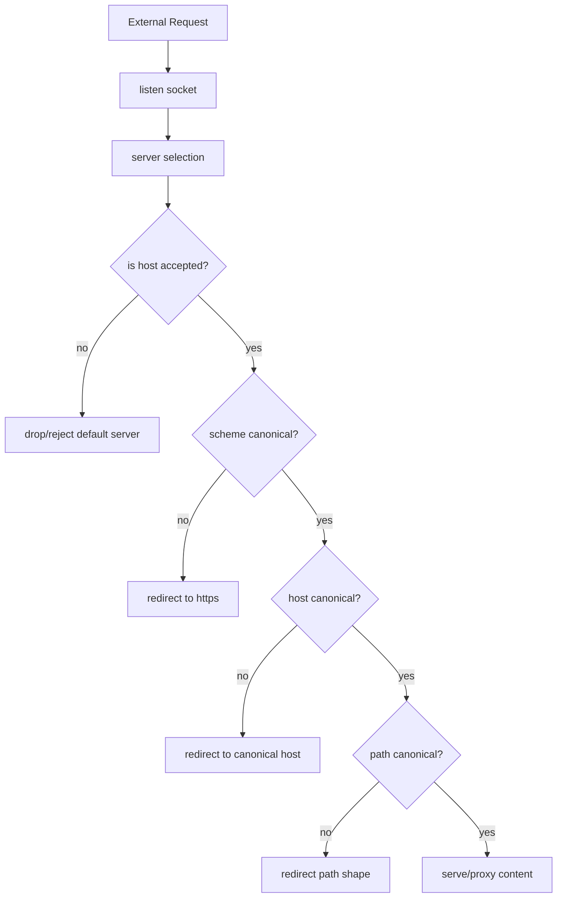

# Part 024 — Canonical Redirects: HTTP→HTTPS, Host Normalization, dan Trailing Slash

> Target part ini: kamu bisa merancang redirect NGINX yang deterministic, aman, tidak membuat loop, tidak membuka open redirect, dan tidak mencampur canonicalization dengan business routing.

Redirect terlihat sederhana:

```nginx
return 301 https://example.com$request_uri;
```

Tetapi di production, redirect adalah bagian dari **traffic normalization**. Ia menentukan URL mana yang dianggap canonical oleh browser, search engine, cache layer, analytics, security policy, dan client automation.

Masalah redirect yang buruk biasanya tidak langsung kelihatan di local test. Ia muncul sebagai:

- infinite redirect loop;
- SEO duplicate content;
- browser menyimpan redirect permanen yang salah;
- asset tidak bisa dimuat karena mixed scheme;
- CDN cache menyimpan variant yang tidak diinginkan;
- API client gagal mengikuti redirect;
- host header injection;
- staging environment mengarah ke production;
- request dari load balancer selalu kembali ke HTTP karena NGINX tidak paham original scheme.

Karena itu, canonical redirect harus dirancang sebagai policy, bukan sekadar snippet.

---

## 1. Mental Model: Redirect sebagai Normalization State Machine



Canonicalization harus terjadi sebelum content handling.

Jika request belum berada dalam bentuk canonical, jangan masuk ke app/static handler dulu. Normalize dulu.

Tetapi setiap normalization step harus punya exit condition yang jelas. Kalau tidak, loop.

---

## 2. Canonical URL Contract

Sebelum menulis config, jawab dulu:

```txt
scheme: https
host:   example.com
path:   normalized by app, except selected trailing slash rules
query:  preserve unless explicitly removed
```

Contoh decision:

| Dimension | Decision |
|---|---|
| HTTP | redirect ke HTTPS |
| `www.example.com` | redirect ke `example.com` |
| unknown host | reject/drop, jangan redirect sembarang |
| trailing slash | hanya normalize untuk directory-like routes tertentu |
| query string | preserve by default |
| redirect code | 308 untuk method-preserving permanent, 301 untuk classic web canonical |
| API redirect | minimal; lebih baik reject daripada redirect untuk method-sensitive endpoint |

Tanpa contract seperti ini, config akan tumbuh menjadi kumpulan `if`, `rewrite`, dan copy-paste server block.

---

## 3. Gunakan `return`, Bukan `rewrite`, untuk Redirect Sederhana

Untuk canonical redirect sederhana, gunakan `return`.

```nginx
server {
    listen 80;
    server_name example.com www.example.com;

    return 301 https://example.com$request_uri;
}
```

Kenapa `return`?

- langsung mengirim response;
- tidak masuk loop rewrite-location seperti `rewrite`;
- lebih mudah dibaca;
- lebih sedikit side effect;
- cocok untuk host/scheme redirect.

Hindari:

```nginx
rewrite ^ https://example.com$request_uri permanent;
```

`rewrite` lebih cocok untuk transformasi URI berbasis regex yang memang perlu lanjut ke location processing atau perlu capture path kompleks.

Rule:

> Jika tujuannya mengirim redirect final, default ke `return`.

---

## 4. HTTP ke HTTPS Redirect

Pola minimal:

```nginx
server {
    listen 80;
    server_name example.com;

    return 301 https://example.com$request_uri;
}
```

Jika canonical host adalah non-www:

```nginx
server {
    listen 80;
    server_name example.com www.example.com;

    return 301 https://example.com$request_uri;
}
```

Lalu HTTPS canonical server:

```nginx
server {
    listen 443 ssl http2;
    server_name example.com;

    ssl_certificate     /etc/nginx/certs/example.com/fullchain.pem;
    ssl_certificate_key /etc/nginx/certs/example.com/privkey.pem;

    root /srv/www/app/current;

    location / {
        try_files $uri $uri/ /index.html;
    }
}
```

Dan HTTPS non-canonical host:

```nginx
server {
    listen 443 ssl http2;
    server_name www.example.com;

    ssl_certificate     /etc/nginx/certs/example.com/fullchain.pem;
    ssl_certificate_key /etc/nginx/certs/example.com/privkey.pem;

    return 301 https://example.com$request_uri;
}
```

Kenapa HTTPS `www` block tetap butuh certificate?

Karena TLS handshake terjadi sebelum HTTP redirect. Browser harus bisa memvalidasi certificate untuk `www.example.com` sebelum menerima response redirect.

---

## 5. Jangan Redirect Unknown Host ke Canonical Host secara Blind

Bad:

```nginx
server {
    listen 80 default_server;
    return 301 https://example.com$request_uri;
}
```

Masalah:

- semua Host header yang salah diarahkan ke domainmu;
- bisa mencemari analytics/log;
- bisa memperkuat host header abuse;
- bisa membuat domain asing yang mengarah ke IP kamu terlihat valid;
- bisa membingungkan security scanner dan crawler.

Lebih aman:

```nginx
server {
    listen 80 default_server;
    server_name _;
    return 444;
}
```

Atau jika butuh response standar:

```nginx
server {
    listen 80 default_server;
    server_name _;
    return 400;
}
```

Untuk HTTPS default server, kamu tetap butuh certificate fallback. Gunakan certificate yang memang sesuai strategi platform, lalu reject setelah handshake.

```nginx
server {
    listen 443 ssl default_server;
    server_name _;

    ssl_certificate     /etc/nginx/certs/default/fullchain.pem;
    ssl_certificate_key /etc/nginx/certs/default/privkey.pem;

    return 421;
}
```

`421 Misdirected Request` sering cocok untuk host/sni mismatch di HTTP/2/TLS context, tetapi dukungan dan behavior client perlu diuji. Untuk general public web, `400` juga sering cukup.

Invariant:

> Redirect hanya untuk host yang kamu akui sebagai milikmu. Unknown host sebaiknya ditolak, bukan dinormalisasi.

---

## 6. `server_name`, Default Server, dan Redirect Correctness

NGINX memilih server block berdasarkan `listen` address/port, lalu `Host` terhadap `server_name`. Jika tidak ada match, request masuk ke default server untuk port tersebut.

Maka canonical redirect harus memperhatikan default server.

Pola aman:

```nginx
# 1. Reject unknown HTTP host
server {
    listen 80 default_server;
    server_name _;
    return 444;
}

# 2. Redirect known HTTP hosts
server {
    listen 80;
    server_name example.com www.example.com;
    return 301 https://example.com$request_uri;
}

# 3. Reject unknown HTTPS host
server {
    listen 443 ssl default_server;
    server_name _;
    ssl_certificate     /etc/nginx/certs/default/fullchain.pem;
    ssl_certificate_key /etc/nginx/certs/default/privkey.pem;
    return 421;
}

# 4. Redirect known HTTPS non-canonical host
server {
    listen 443 ssl http2;
    server_name www.example.com;
    ssl_certificate     /etc/nginx/certs/example.com/fullchain.pem;
    ssl_certificate_key /etc/nginx/certs/example.com/privkey.pem;
    return 301 https://example.com$request_uri;
}

# 5. Serve canonical HTTPS host
server {
    listen 443 ssl http2;
    server_name example.com;
    ssl_certificate     /etc/nginx/certs/example.com/fullchain.pem;
    ssl_certificate_key /etc/nginx/certs/example.com/privkey.pem;

    root /srv/www/app/current;

    location / {
        try_files $uri $uri/ /index.html;
    }
}
```

Urutannya di file tidak boleh menjadi satu-satunya pengaman. Gunakan `default_server` eksplisit.

---

## 7. `$host` vs `$http_host` vs Literal Host

Untuk canonical redirect, prefer literal host:

```nginx
return 301 https://example.com$request_uri;
```

Jangan gunakan input client jika target harus canonical.

Bad:

```nginx
return 301 https://$host$request_uri;
```

Ini hanya mengubah scheme tetapi mempertahankan host dari request. Jika request datang dengan `Host: attacker.example`, redirect bisa mengarah ke host yang tidak kamu inginkan jika request masuk ke block yang salah.

Lebih buruk:

```nginx
return 301 https://$http_host$request_uri;
```

`$http_host` berasal langsung dari header `Host`. Ia bisa mengandung port dan bentuk yang tidak kamu canonicalize.

Gunakan variable hanya jika sudah dikonstruksi dari whitelist.

Contoh dengan `map`:

```nginx
map $host $canonical_host {
    default "";
    example.com example.com;
    www.example.com example.com;
    example.net example.net;
    www.example.net example.net;
}

server {
    listen 80;
    server_name example.com www.example.com example.net www.example.net;

    if ($canonical_host = "") {
        return 444;
    }

    return 301 https://$canonical_host$request_uri;
}
```

Namun untuk sedikit host, server block eksplisit biasanya lebih jelas.

---

## 8. Preserve Query String dengan `$request_uri`

`$request_uri` berisi original URI lengkap dengan query string.

```nginx
return 301 https://example.com$request_uri;
```

Request:

```txt
http://www.example.com/search?q=nginx&page=2
```

Redirect:

```txt
https://example.com/search?q=nginx&page=2
```

Jika menggunakan `$uri`, query string hilang.

```nginx
return 301 https://example.com$uri;
```

Redirect menjadi:

```txt
https://example.com/search
```

Untuk canonical host/scheme, preserve query by default.

Untuk deliberate query stripping, buat policy eksplisit:

```nginx
location = /login {
    return 302 https://auth.example.com/login;
}
```

Jangan strip query secara tidak sengaja.

---

## 9. 301 vs 308 vs 302 vs 307

Redirect code bukan kosmetik.

| Code | Permanent? | Method preserving? | Typical use |
|---|---:|---:|---|
| 301 | Ya | Historically ambiguous untuk non-GET | Classic web canonical redirects |
| 302 | Tidak | Historically ambiguous | Temporary redirect, legacy behavior |
| 307 | Tidak | Ya | Temporary method-preserving redirect |
| 308 | Ya | Ya | Permanent method-preserving redirect |

Untuk website GET-heavy, `301` masih umum.

Untuk API atau endpoint yang bisa menerima POST/PUT/PATCH, hindari redirect permanen yang bisa mengubah method di client tertentu. Lebih baik:

- jangan redirect API write endpoint;
- reject wrong scheme/host;
- atau gunakan `308` jika benar-benar harus method-preserving permanent redirect dan client compatibility sudah jelas.

Contoh:

```nginx
server {
    listen 80;
    server_name api.example.com;

    return 308 https://api.example.com$request_uri;
}
```

Tetapi untuk public API, banyak platform memilih dokumentasi tegas “gunakan HTTPS” dan menolak HTTP, bukan mengandalkan redirect.

---

## 10. Redirect Loop di Belakang Load Balancer/CDN

Skenario:

```txt
Client --HTTPS--> CDN/LB --HTTP--> NGINX
```

NGINX melihat request sebagai HTTP karena TLS terminate di CDN/LB.

Bad config:

```nginx
if ($scheme = http) {
    return 301 https://example.com$request_uri;
}
```

Flow:

```txt
Client requests https://example.com/page
CDN forwards http://nginx/page
NGINX sees $scheme=http
NGINX redirects to https://example.com/page
Client requests https://example.com/page again
... loop
```

Solusi: jangan memakai `$scheme` jika NGINX berada di belakang TLS terminator dan tidak menerima original scheme secara native.

Gunakan signal tepercaya dari proxy depan, misalnya `X-Forwarded-Proto`, hanya dari trusted source.

```nginx
map $http_x_forwarded_proto $redirect_to_https {
    default 1;
    https 0;
}

server {
    listen 80;
    server_name example.com;

    if ($redirect_to_https) {
        return 301 https://example.com$request_uri;
    }

    location / {
        proxy_pass http://app_backend;
    }
}
```

Tetapi ini hanya aman jika request ke NGINX tidak bisa langsung dikirim oleh public client yang memalsukan `X-Forwarded-Proto`.

Lebih baik secara arsitektur:

- NGINX hanya accessible dari LB/CDN security group/private network;
- real IP/forwarded header trust dibatasi;
- edge TLS policy jelas: siapa yang terminate TLS final?

Rule:

> Header forwarded hanya boleh dipercaya jika network path yang menulis header itu juga dipercaya.

---

## 11. Host Normalization www → non-www

Canonical non-www:

```nginx
server {
    listen 443 ssl http2;
    server_name www.example.com;

    ssl_certificate     /etc/nginx/certs/example.com/fullchain.pem;
    ssl_certificate_key /etc/nginx/certs/example.com/privkey.pem;

    return 301 https://example.com$request_uri;
}
```

Canonical www:

```nginx
server {
    listen 443 ssl http2;
    server_name example.com;

    ssl_certificate     /etc/nginx/certs/example.com/fullchain.pem;
    ssl_certificate_key /etc/nginx/certs/example.com/privkey.pem;

    return 301 https://www.example.com$request_uri;
}
```

Jangan jalankan dua-duanya.

Bad:

```nginx
# Block A
return 301 https://www.example.com$request_uri;

# Block B
return 301 https://example.com$request_uri;
```

Jika server selection salah atau config digabung sembarangan, bisa ping-pong.

Test:

```bash
curl -I http://www.example.com/a
curl -I https://www.example.com/a
curl -I http://example.com/a
curl -I https://example.com/a
```

Hanya satu path final yang boleh menghasilkan `200`.

---

## 12. Trailing Slash Canonicalization

NGINX punya special behavior: jika sebuah prefix location berakhir dengan slash dan request diproses oleh proxy/FastCGI/uWSGI/SCGI/memcached/gRPC pass, request ke URI tanpa slash bisa mendapat redirect permanen ke URI dengan slash.

Contoh:

```nginx
location /user/ {
    proxy_pass http://user_backend;
}
```

Request:

```txt
/user
```

Dapat diarahkan ke:

```txt
/user/
```

Jika tidak ingin behavior itu, definisikan exact match:

```nginx
location = /user {
    proxy_pass http://login_backend;
}

location /user/ {
    proxy_pass http://user_backend;
}
```

Untuk static site, canonical trailing slash sering terkait directory/index.

Contoh policy directory-like:

```nginx
location = /docs {
    return 301 /docs/;
}

location /docs/ {
    try_files $uri $uri/ =404;
}
```

Jangan normalize trailing slash global dengan regex agresif:

```nginx
# Risky
rewrite ^/(.*)/$ /$1 permanent;
```

Masalah:

- bisa merusak directory route;
- bisa mengubah signed URL;
- bisa mengubah object storage key;
- bisa merusak app route yang membedakan slash;
- bisa membuat loop dengan upstream/app redirect.

Rule:

> Trailing slash adalah contract per route group, bukan global beautification.

---

## 13. Path Normalization dan `merge_slashes`

NGINX secara default menggabungkan beberapa slash berturut-turut dalam URI menjadi satu untuk matching.

Ini membantu mencegah request seperti:

```txt
//scripts/app.js
```

melewati prefix location yang diharapkan.

Jangan matikan `merge_slashes` kecuali ada kebutuhan spesifik seperti path yang memang menyimpan `/` sebagai data encoded/custom.

Bad default:

```nginx
merge_slashes off;
```

Jika dimatikan, kamu harus menguji location matching, upstream route, cache key, dan security control secara jauh lebih ketat.

Path normalization bukan hanya estetika. Ia memengaruhi authorization, cache key, static file mapping, dan routing.

---

## 14. Redirect dan HSTS

HSTS membuat browser mengingat bahwa domain harus diakses via HTTPS.

```nginx
add_header Strict-Transport-Security "max-age=31536000; includeSubDomains" always;
```

Jangan aktifkan `preload` sebelum yakin semua subdomain benar-benar siap HTTPS.

Untuk canonical redirect, urutan reasoning:

1. HTTP request diarahkan ke HTTPS.
2. HTTPS response mengirim HSTS.
3. Browser berikutnya langsung memakai HTTPS.

HSTS bukan pengganti HTTP→HTTPS redirect untuk first visit. Redirect masih dibutuhkan untuk request HTTP awal dan client yang belum punya HSTS state.

Production caution:

- `includeSubDomains` bisa merusak subdomain legacy;
- `preload` sulit dibatalkan cepat;
- staging/dev domain jangan ikut HSTS policy production.

---

## 15. Canonical Redirect untuk Multi-Domain

Jika satu deployment melayani beberapa domain canonical:

```nginx
map $host $canonical_host {
    default "";

    example.com     example.com;
    www.example.com example.com;

    example.net     example.net;
    www.example.net example.net;
}

server {
    listen 80;
    server_name example.com www.example.com example.net www.example.net;

    if ($canonical_host = "") {
        return 444;
    }

    return 301 https://$canonical_host$request_uri;
}
```

HTTPS side:

```nginx
server {
    listen 443 ssl http2;
    server_name www.example.com;
    return 301 https://example.com$request_uri;
}

server {
    listen 443 ssl http2;
    server_name www.example.net;
    return 301 https://example.net$request_uri;
}
```

Untuk banyak domain, config generation lebih aman daripada manual copy-paste.

Input source of truth:

```yaml
sites:
  - canonical: example.com
    aliases:
      - www.example.com
  - canonical: example.net
    aliases:
      - www.example.net
```

Generated config harus diuji dengan matrix.

---

## 16. Redirect untuk Locale dan Region

Hati-hati dengan redirect otomatis berbasis IP atau `Accept-Language`.

Bad:

```nginx
if ($http_accept_language ~* ^id) {
    return 302 /id$request_uri;
}
```

Masalah:

- redirect loop jika `/id/...` juga cocok;
- cache variation kompleks;
- user tidak bisa memilih locale lain;
- crawler bisa mendapat variant tidak stabil;
- `Accept-Language` bukan identitas user.

Lebih aman:

```nginx
location = / {
    return 302 /en/;
}

location /en/ {
    try_files $uri $uri/ =404;
}

location /id/ {
    try_files $uri $uri/ =404;
}
```

Untuk personalization serius, lakukan di app layer dengan cookie/user preference. NGINX sebaiknya hanya melakukan redirect deterministic.

---

## 17. Open Redirect Risk

Open redirect terjadi ketika target redirect dipengaruhi input user tanpa whitelist.

Bad:

```nginx
location /redirect {
    return 302 $arg_next;
}
```

Request:

```txt
/redirect?next=https://evil.example/phish
```

Akan redirect ke attacker.

Lebih aman:

```nginx
map $arg_next $safe_next {
    default /;
    ~^/[a-zA-Z0-9/_?=&.-]*$ $arg_next;
}

location /redirect {
    return 302 $safe_next;
}
```

Namun untuk auth redirects, lebih baik validasi di application layer karena rules sering kompleks.

Rule:

> Redirect target yang berasal dari user input wajib melalui allowlist, bukan regex asal cocok.

---

## 18. Redirect dan API

Untuk browser website, redirect adalah normal.

Untuk API, redirect sering bermasalah.

Client API bisa:

- tidak mengikuti redirect;
- mengikuti redirect tapi mengubah method;
- tidak mengirim ulang Authorization header ke host baru;
- memperlakukan redirect sebagai error;
- membuat retry/write duplicate jika behavior tidak jelas.

Untuk API, prefer:

```nginx
server {
    listen 80;
    server_name api.example.com;
    return 400 '{"error":"https_required"}\n';
}
```

Atau:

```nginx
server {
    listen 80;
    server_name api.example.com;
    return 308 https://api.example.com$request_uri;
}
```

Decision tergantung client ecosystem. Untuk internal APIs, reject bisa lebih deterministic. Untuk public APIs, redirect HTTPS bisa membantu developer experience, tetapi dokumentasi harus jelas.

---

## 19. Production Reference: Website Canonical Redirect

```nginx
# 00-default-http.conf
server {
    listen 80 default_server;
    server_name _;
    return 444;
}

# 00-default-https.conf
server {
    listen 443 ssl default_server;
    server_name _;

    ssl_certificate     /etc/nginx/certs/default/fullchain.pem;
    ssl_certificate_key /etc/nginx/certs/default/privkey.pem;

    return 421;
}

# example-http-redirect.conf
server {
    listen 80;
    server_name example.com www.example.com;

    return 301 https://example.com$request_uri;
}

# example-https-www-redirect.conf
server {
    listen 443 ssl http2;
    server_name www.example.com;

    ssl_certificate     /etc/nginx/certs/example.com/fullchain.pem;
    ssl_certificate_key /etc/nginx/certs/example.com/privkey.pem;

    return 301 https://example.com$request_uri;
}

# example-https-canonical.conf
server {
    listen 443 ssl http2;
    server_name example.com;

    ssl_certificate     /etc/nginx/certs/example.com/fullchain.pem;
    ssl_certificate_key /etc/nginx/certs/example.com/privkey.pem;

    root /srv/www/example/current;
    index index.html;

    add_header Strict-Transport-Security "max-age=31536000" always;
    add_header X-Content-Type-Options "nosniff" always;

    location = /docs {
        return 301 /docs/;
    }

    location / {
        try_files $uri $uri/ /index.html;
    }
}
```

Properties:

- unknown HTTP host ditolak;
- unknown HTTPS host ditolak setelah handshake;
- known HTTP host diarahkan ke canonical HTTPS host;
- HTTPS alias diarahkan ke canonical host;
- canonical host melayani content;
- trailing slash hanya dinormalisasi untuk `/docs`;
- HSTS hanya dikirim pada HTTPS canonical response.

---

## 20. Redirect Test Matrix

Gunakan `curl -I -L` dengan hati-hati. Untuk mendeteksi setiap hop, jangan langsung `-L` dulu.

```bash
curl -I http://example.com/path?a=1
curl -I http://www.example.com/path?a=1
curl -I https://www.example.com/path?a=1
curl -I https://example.com/path?a=1
curl -I http://unknown.example/path -H 'Host: unknown.example'
```

Expected:

```txt
http://example.com/path?a=1      -> 301 https://example.com/path?a=1
http://www.example.com/path?a=1  -> 301 https://example.com/path?a=1
https://www.example.com/path?a=1 -> 301 https://example.com/path?a=1
https://example.com/path?a=1     -> 200/404 depending content
unknown host                     -> 444/400/421, not redirect
```

Untuk mengikuti semua hop:

```bash
curl -skIL --max-redirs 10 http://www.example.com/path?a=1
```

Expected hanya satu atau dua hop, bukan chain panjang.

Automated test:

```bash
#!/usr/bin/env bash
set -euo pipefail

assert_location() {
  local url="$1"
  local expected="$2"
  local actual
  actual=$(curl -skI "$url" | awk 'BEGIN{IGNORECASE=1} /^location:/ {print $2}' | tr -d '\r')
  if [ "$actual" != "$expected" ]; then
    echo "FAIL $url expected=$expected actual=$actual"
    exit 1
  fi
  echo "OK   $url -> $actual"
}

assert_code() {
  local url="$1"
  local expected="$2"
  local actual
  actual=$(curl -sk -o /dev/null -w '%{http_code}' "$url")
  if [ "$actual" != "$expected" ]; then
    echo "FAIL $url expected=$expected actual=$actual"
    exit 1
  fi
  echo "OK   $url -> $actual"
}

assert_location "http://example.com/a?x=1" "https://example.com/a?x=1"
assert_location "http://www.example.com/a?x=1" "https://example.com/a?x=1"
assert_location "https://www.example.com/a?x=1" "https://example.com/a?x=1"
assert_code "https://example.com/" "200"
```

---

## 21. Debugging Redirect Loop

Jika browser berkata `ERR_TOO_MANY_REDIRECTS`, jangan mulai dari config diff. Mulai dari hop trace.

```bash
curl -skIL --max-redirs 20 https://example.com/path
```

Lihat pola:

```txt
https://example.com/path -> https://example.com/path
```

Artinya same URL loop. Biasanya condition redirect selalu true.

```txt
http://example.com/path -> https://example.com/path -> http://example.com/path
```

Artinya ada proxy/LB/app yang saling beda pandangan scheme.

```txt
https://example.com/path -> https://www.example.com/path -> https://example.com/path
```

Artinya host canonicalization konflik.

```txt
https://example.com/docs -> https://example.com/docs/ -> https://example.com/docs
```

Artinya trailing slash policy konflik antara NGINX dan app/upstream.

Debug fields:

```nginx
log_format redirect_debug escape=json
  '{'
    '"time":"$time_iso8601",'
    '"host":"$host",'
    '"http_host":"$http_host",'
    '"scheme":"$scheme",'
    '"xff_proto":"$http_x_forwarded_proto",'
    '"request_uri":"$request_uri",'
    '"status":$status,'
    '"sent_location":"$sent_http_location"'
  '}';
```

Tambahkan sementara di environment staging atau canary.

---

## 22. Common Failure Modes

### Failure 1 — Redirect mempertahankan host attacker

Bad:

```nginx
return 301 https://$host$request_uri;
```

Fix:

```nginx
return 301 https://example.com$request_uri;
```

Atau whitelist via `map`.

### Failure 2 — Query string hilang

Bad:

```nginx
return 301 https://example.com$uri;
```

Fix:

```nginx
return 301 https://example.com$request_uri;
```

### Failure 3 — HTTPS redirect loop di belakang LB

Bad:

```nginx
if ($scheme = http) { return 301 https://example.com$request_uri; }
```

Fix:

- terminate TLS di NGINX, atau
- gunakan trusted forwarded proto dari LB, atau
- buat LB melakukan redirect sebelum NGINX.

### Failure 4 — Unknown host ikut redirect

Bad:

```nginx
server {
    listen 80 default_server;
    return 301 https://example.com$request_uri;
}
```

Fix:

```nginx
server {
    listen 80 default_server;
    return 444;
}
```

### Failure 5 — Permanent redirect salah ter-cache browser

Bad:

```nginx
return 301 https://new-domain.example$request_uri;
```

Dipakai untuk testing sementara.

Fix:

- gunakan `302`/`307` saat eksperimen;
- pakai 301/308 hanya setelah policy final;
- uji dengan clean profile/browser atau curl.

---

## 23. Decision Matrix

| Situation | Recommended response |
|---|---|
| HTTP website request ke known host | `301` ke canonical HTTPS URL |
| HTTP API request | `308` atau reject; pilih berdasarkan client compatibility |
| HTTPS alias host | `301` ke canonical host, certificate harus valid untuk alias |
| Unknown host | `444`, `400`, atau `421`, jangan redirect blind |
| Temporary migration | `302`/`307` dulu sebelum permanent |
| Method-sensitive redirect | prefer `307/308` atau avoid redirect |
| User-controlled next URL | validate/allowlist di app atau strict map |
| Trailing slash | per route group, jangan global agresif |
| Behind TLS-terminating LB | jangan pakai `$scheme` tanpa memahami original scheme |

---

## 24. Production Checklist

Sebelum merge canonical redirect config:

- Apakah canonical scheme/host/path sudah ditulis sebagai contract?
- Apakah unknown host ditolak?
- Apakah default server eksplisit per listen port?
- Apakah redirect target memakai literal canonical host atau whitelist?
- Apakah query string preserve dengan `$request_uri`?
- Apakah HTTPS alias punya certificate valid?
- Apakah API behavior terhadap redirect sudah diputuskan?
- Apakah permanent redirect tidak dipakai untuk eksperimen?
- Apakah NGINX berada di belakang LB/CDN? Jika ya, bagaimana original scheme diketahui?
- Apakah `X-Forwarded-Proto` hanya dipercaya dari source yang trusted?
- Apakah trailing slash policy tidak konflik dengan app?
- Apakah test matrix mencakup HTTP/HTTPS + www/non-www + unknown host?
- Apakah redirect hop count kecil dan deterministic?

---

## 25. Mental Model Akhir

Redirect yang bagus bukan config pendek. Redirect yang bagus adalah **normalization boundary**.

Cara berpikir yang salah:

```txt
Redirect = pindahkan user ke URL lain
```

Cara berpikir yang benar:

```txt
Redirect = enforce canonical contract before request enters content/application handler
```

Canonical redirect harus menjaga:

- host ownership;
- scheme correctness;
- method semantics;
- query preservation;
- TLS/SNI reality;
- load balancer topology;
- SEO/cache behavior;
- loop prevention;
- security against open redirect and host header abuse.

Jika desain redirect-mu deterministic, routing setelahnya menjadi jauh lebih sederhana.

---

## Referensi Resmi

- NGINX Request Processing — server selection, Host matching, default server: https://nginx.org/en/docs/http/request_processing.html
- NGINX Server Names — exact, wildcard, regex names, virtual server selection: https://nginx.org/en/docs/http/server_names.html
- NGINX Rewrite Module — `return`, redirect URL, `rewrite`, processing loop: https://nginx.org/en/docs/http/ngx_http_rewrite_module.html
- NGINX Core Module — `port_in_redirect`, `server_name_in_redirect`, `merge_slashes`, trailing slash behavior for proxied prefix locations: https://nginx.org/en/docs/http/ngx_http_core_module.html

---

## Berikutnya

Part berikutnya akan membahas `rewrite` vs `return` secara lebih dalam: kapan URI rewrite benar-benar dibutuhkan, bagaimana `last` dan `break` bekerja, kenapa rewrite loop terjadi, dan bagaimana menjaga routing discipline.
