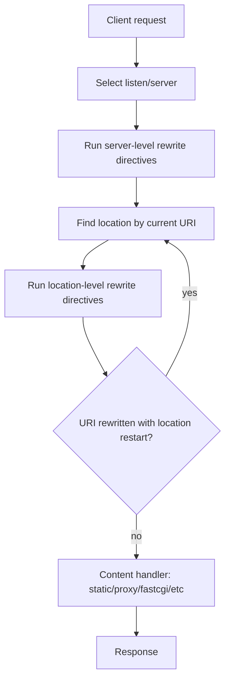
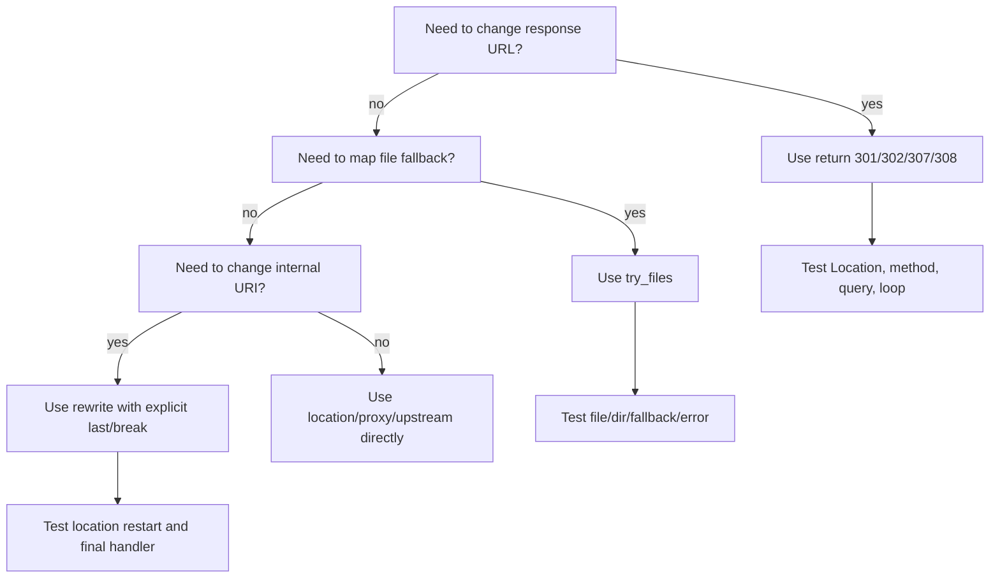

# Part 025 — `rewrite` vs `return`: Routing Discipline agar Tidak Membuat Loop

Di Part 024 kita membahas canonical redirects: host normalization, scheme normalization, dan redirect loop prevention. Sekarang kita masuk ke primitive yang sering dipakai untuk itu: `return` dan `rewrite`.

Masalahnya, banyak konfigurasi NGINX production rusak bukan karena regex-nya salah, tetapi karena tim memperlakukan `rewrite` seperti `return`, atau memperlakukan `return` seperti router internal.

Mental model yang benar:

```txt
return  = hentikan request sekarang dan hasilkan response
rewrite = ubah URI internal, lalu lanjutkan request processing sesuai flag
```

Keduanya sama-sama bisa terlihat seperti "routing", tetapi efeknya sangat berbeda.

---

## 1. Tujuan Part Ini

Setelah bagian ini, kamu harus bisa:

1. membedakan redirect eksternal, internal rewrite, internal redirect, dan upstream routing;
2. memilih `return` atau `rewrite` berdasarkan intent, bukan kebiasaan;
3. memahami kapan `rewrite` memicu pencarian `location` ulang;
4. menghindari loop, double redirect, dan routing shadow;
5. mendesain URL normalization yang bisa diuji;
6. membuat konfigurasi redirect yang aman untuk SEO, browser cache, API, dan proxy chain;
7. memahami kenapa `if` di NGINX sering menjadi sumber bug;
8. menulis test matrix untuk perubahan URL routing.

---

## 2. Vocabulary: Jangan Campur Empat Hal Ini

Sebelum melihat directive, pisahkan empat konsep ini.

| Konsep | Terlihat oleh client? | Mengubah URL browser? | Mengubah URI internal? | Contoh |
|---|---:|---:|---:|---|
| External redirect | Ya | Ya | Tidak relevan | HTTP 301/302/307/308 |
| Internal rewrite | Tidak langsung | Tidak | Ya | `/old` diproses sebagai `/new` |
| Internal redirect | Tidak langsung | Tidak | Ya, lewat target internal | `error_page 404 /fallback.html` |
| Upstream routing | Tidak langsung | Tidak | Biasanya tidak | `proxy_pass http://api` |

Kesalahan umum:

```nginx
# Terlihat seperti routing internal,
# padahal ini memberi response ke client.
return 301 /new-path;
```

```nginx
# Terlihat seperti redirect,
# padahal ini hanya mengubah URI internal kecuali flag redirect/permanent dipakai.
rewrite ^/old/(.*)$ /new/$1 last;
```

---

## 3. Mental Model Request Flow

`rewrite` module bukan fitur terpisah dari request lifecycle. Ia berjalan pada phase tertentu.

Model sederhana:



Yang penting: `rewrite` dapat menyebabkan request masuk ulang ke location matching. Jadi satu konfigurasi kecil bisa mengubah seluruh jalur request.

---

## 4. `return`: Primitive untuk Mengakhiri Request

`return` adalah directive paling jelas untuk redirect atau response langsung.

Contoh:

```nginx
server {
    listen 80;
    server_name example.com www.example.com;

    return 308 https://example.com$request_uri;
}
```

Maknanya:

1. request diterima;
2. NGINX langsung menghasilkan response;
3. tidak perlu mencari static file;
4. tidak perlu proxy ke upstream;
5. tidak perlu menjalankan routing tambahan.

Untuk redirect sederhana, `return` hampir selalu lebih baik daripada `rewrite`.

---

## 5. Bentuk Umum `return`

Pola umum:

```nginx
return <code>;
return <code> <text>;
return <code> <url>;
return <url>;
```

Contoh response langsung:

```nginx
location = /healthz {
    access_log off;
    default_type text/plain;
    return 200 'ok\n';
}
```

Contoh forbidden:

```nginx
location ~ /\.git {
    return 404;
}
```

Contoh redirect:

```nginx
location = /old-docs {
    return 301 /docs;
}
```

Contoh absolute redirect:

```nginx
return 308 https://www.example.com$request_uri;
```

---

## 6. `rewrite`: Primitive untuk Mengubah URI

Bentuk umum:

```nginx
rewrite <regex> <replacement> [flag];
```

Contoh:

```nginx
rewrite ^/users/(\d+)$ /api/users/$1 last;
```

Maknanya:

1. cocokkan current URI dengan regex;
2. jika cocok, ganti URI dengan replacement;
3. lanjutkan request processing sesuai flag.

`rewrite` bukan sekadar redirect. Ia adalah mutasi URI.

---

## 7. Flag `rewrite`: `last`, `break`, `redirect`, `permanent`

| Flag | Efek Utama | Kapan Dipakai |
|---|---|---|
| `last` | ubah URI lalu cari `location` lagi | internal rewrite ke route lain |
| `break` | ubah URI lalu berhenti memproses rewrite set saat ini | rewrite lokal dalam location yang sama |
| `redirect` | kirim temporary redirect ke client | redirect 302 eksplisit |
| `permanent` | kirim permanent redirect ke client | redirect 301 eksplisit |

Secara production discipline, gunakan:

```txt
return 301/308  -> redirect canonical yang jelas
rewrite ... last -> internal routing yang memang perlu location search ulang
rewrite ... break -> rare; hanya jika paham content handler berikutnya
rewrite ... permanent/redirect -> legacy style, biasanya kalah jelas dari return
```

---

## 8. Contoh Salah: Redirect dengan `rewrite permanent`

Ini umum ditemukan:

```nginx
rewrite ^/(.*)$ https://example.com/$1 permanent;
```

Bisa bekerja, tetapi bukan bentuk paling jelas.

Lebih baik:

```nginx
return 308 https://example.com$request_uri;
```

Kenapa lebih baik?

1. tidak perlu regex;
2. tidak ada capture group;
3. intent langsung terlihat;
4. lebih mudah diuji;
5. lebih kecil peluang bug path/query string;
6. tidak mencampur URI mutation dengan response generation.

---

## 9. Status Code Redirect: 301, 302, 307, 308

Pilih status code berdasarkan kontrak.

| Code | Permanent? | Method/body preserved? | Biasanya untuk |
|---:|---:|---:|---|
| 301 | Ya | Tidak selalu aman secara historis | URL lama ke URL baru untuk GET pages |
| 302 | Tidak | Tidak selalu aman secara historis | redirect sementara legacy |
| 307 | Tidak | Ya | temporary redirect untuk API/method-sensitive |
| 308 | Ya | Ya | canonical permanent redirect modern |

Untuk HTTP→HTTPS canonical redirect, sering lebih aman memakai `308` jika client ecosystem mendukungnya.

```nginx
server {
    listen 80;
    server_name example.com;
    return 308 https://example.com$request_uri;
}
```

Untuk legacy browser/client, 301 masih sering dipakai. Yang penting: pilih dengan sadar.

---

## 10. `$uri` vs `$request_uri`: Redirect Bisa Rusak karena Variable

Dua variable ini sering tertukar.

| Variable | Isi | Query string? | Normalized? | Cocok untuk |
|---|---|---:|---:|---|
| `$request_uri` | original request URI | Ya | Tidak sepenuhnya | canonical redirect preserve exact path/query |
| `$uri` | normalized current URI | Tidak | Ya | internal routing/static lookup |

Contoh preserving query string:

```nginx
return 308 https://example.com$request_uri;
```

Jika memakai `$uri`, query string bisa hilang:

```nginx
# Risky jika ingin preserve query.
return 308 https://example.com$uri;
```

Tambahkan `$is_args$args` bila memang membangun dari `$uri`:

```nginx
return 308 https://example.com$uri$is_args$args;
```

---

## 11. Routing Discipline: Satu Intent, Satu Layer

Rule besar:

```txt
Host/scheme normalization  -> server block dengan return
Path canonicalization      -> exact/prefix location dengan return
Internal app routing       -> try_files atau rewrite last secara terbatas
Upstream selection         -> proxy_pass/upstream/map, bukan rewrite abuse
```

Contoh layering sehat:

```nginx
# Layer 1: scheme normalization
server {
    listen 80;
    server_name example.com www.example.com;
    return 308 https://example.com$request_uri;
}

# Layer 2: host canonicalization
server {
    listen 443 ssl http2;
    server_name www.example.com;
    return 308 https://example.com$request_uri;
}

# Layer 3: actual app
server {
    listen 443 ssl http2;
    server_name example.com;

    location = /old-docs {
        return 301 /docs;
    }

    location / {
        try_files $uri $uri/ /index.html;
    }
}
```

Jangan gabungkan semua rule ke satu `if` atau satu regex monster.

---

## 12. `rewrite` di `server` vs `location`

`rewrite` bisa berada di `server` atau `location` context.

### Server-level rewrite

Berjalan sebelum location dipilih berdasarkan URI.

```nginx
server {
    listen 443 ssl;
    server_name example.com;

    rewrite ^/legacy/(.*)$ /archive/$1 last;

    location /archive/ {
        proxy_pass http://archive_app;
    }
}
```

Risiko: server-level rewrite dapat membuat request masuk ke location yang tidak terlihat dari posisi rule.

### Location-level rewrite

Berjalan setelah location dipilih.

```nginx
location /legacy/ {
    rewrite ^/legacy/(.*)$ /archive/$1 last;
}
```

Lebih mudah dibaca karena scope intent lebih kecil.

---

## 13. `last` vs `break`: Bedanya Sangat Penting

Misal:

```nginx
location /legacy/ {
    rewrite ^/legacy/(.*)$ /archive/$1 last;
}

location /archive/ {
    proxy_pass http://archive_app;
}
```

Dengan `last`, URI berubah menjadi `/archive/...`, lalu NGINX mencari location ulang. Request masuk ke `location /archive/`.

Bandingkan:

```nginx
location /legacy/ {
    rewrite ^/legacy/(.*)$ /archive/$1 break;
    proxy_pass http://legacy_app;
}
```

Dengan `break`, URI berubah, tetapi request tetap berada di processing context sekarang. Jika ada `proxy_pass`, ia tetap memakai handler di location `/legacy/`.

Ini sering menjadi sumber bug:

```txt
URI terlihat sudah /archive/,
tetapi upstream yang dipakai masih legacy_app.
```

---

## 14. Internal Rewrite vs `try_files`

Untuk static/SPAs, `try_files` sering lebih jelas daripada `rewrite`.

Kurang ideal:

```nginx
location / {
    rewrite ^ /index.html last;
}
```

Lebih baik:

```nginx
location / {
    try_files $uri $uri/ /index.html;
}
```

`try_files` menyatakan invariant:

1. cari file sesuai URI;
2. cari directory sesuai URI;
3. fallback ke `/index.html`.

`rewrite` hanya mengatakan: ubah URI. Ia tidak mengekspresikan pengecekan filesystem.

---

## 15. Loop: Musuh Utama `rewrite`

Contoh loop:

```nginx
location / {
    rewrite ^/(.*)$ /$1 last;
}
```

URI tidak berubah secara bermakna, tetapi location search bisa berulang.

Contoh lain:

```nginx
location /a/ {
    rewrite ^/a/(.*)$ /b/$1 last;
}

location /b/ {
    rewrite ^/b/(.*)$ /a/$1 last;
}
```

Alurnya:

```mermaid
flowchart LR
    A[/a/x] --> B[rewrite to /b/x]
    B --> C[location /b/]
    C --> D[rewrite to /a/x]
    D --> E[location /a/]
    E --> B
```

NGINX punya batas internal redirect/rewrite cycle, tetapi jangan menjadikan itu desain.

---

## 16. Cara Mendesain Rewrite Tanpa Loop

Gunakan invariant ini:

```txt
Setiap rewrite harus bergerak dari state yang lebih tidak canonical
ke state yang lebih canonical, dan rule canonical tidak boleh match ulang.
```

Contoh aman:

```nginx
location /legacy/ {
    rewrite ^/legacy/(.*)$ /new/$1 last;
}

location /new/ {
    proxy_pass http://new_app;
}
```

`/new/` tidak match `/legacy/`, jadi arah rewrite satu arah.

Untuk trailing slash:

```nginx
location = /docs {
    return 308 /docs/;
}

location /docs/ {
    try_files $uri $uri/ =404;
}
```

Exact match menghindari `/docs/` redirect ke dirinya sendiri.

---

## 17. `if` di NGINX: Bukan `if` Biasa

`if` di NGINX sering disalahpahami sebagai control-flow umum. Ia bagian dari rewrite module dan aman hanya untuk pola terbatas.

Pola relatif aman:

```nginx
if ($request_method = POST) {
    return 405;
}
```

Pola berisiko:

```nginx
location / {
    if ($http_origin ~* example.com) {
        add_header Access-Control-Allow-Origin $http_origin;
    }

    proxy_pass http://app;
}
```

Masalahnya bukan sekadar `if`, tetapi menggabungkan rewrite-phase conditional dengan directive yang punya semantics phase/context berbeda.

Production discipline:

```txt
Gunakan if terutama untuk return/rewrite sederhana.
Untuk mapping value, gunakan map di http context.
Untuk routing, gunakan location/map/upstream.
Untuk header conditional, gunakan map + add_header.
```

---

## 18. Contoh: Redirect Berdasarkan Host

Kurang ideal:

```nginx
server {
    listen 443 ssl;
    server_name example.com www.example.com;

    if ($host = www.example.com) {
        return 308 https://example.com$request_uri;
    }

    location / {
        proxy_pass http://app;
    }
}
```

Lebih baik:

```nginx
server {
    listen 443 ssl;
    server_name www.example.com;
    return 308 https://example.com$request_uri;
}

server {
    listen 443 ssl;
    server_name example.com;

    location / {
        proxy_pass http://app;
    }
}
```

Kenapa?

1. host routing adalah tugas `server_name`;
2. tidak perlu runtime conditional;
3. lebih mudah diverifikasi dengan `curl -H 'Host: ...'`;
4. mengurangi risiko host canonicalization bercampur dengan app routing.

---

## 19. Contoh: HTTP ke HTTPS di Belakang Load Balancer

Jika NGINX menerima traffic dari load balancer yang sudah terminate TLS, `$scheme` mungkin `http` meski original client memakai HTTPS.

Buruk:

```nginx
if ($scheme = http) {
    return 308 https://$host$request_uri;
}
```

Di belakang proxy, desain harus eksplisit terhadap trust boundary:

```nginx
map $http_x_forwarded_proto $redirect_to_https {
    default 1;
    https   0;
}

server {
    listen 8080;
    server_name example.com;

    if ($redirect_to_https) {
        return 308 https://example.com$request_uri;
    }

    location / {
        proxy_pass http://app;
    }
}
```

Tetapi ini hanya aman jika `X-Forwarded-Proto` datang dari trusted load balancer dan tidak bisa dipalsukan client langsung.

Lebih baik lagi: pisahkan listener private/public, firewall, dan real-ip policy.

---

## 20. Redirect Canonical dengan Query String

Pola aman:

```nginx
location = /search {
    return 308 /catalog$request_uri;
}
```

Tapi hati-hati: ini menghasilkan `/catalog/search?...`, bukan `/catalog?...`.

Jika intent-nya mengganti path exact:

```nginx
location = /search {
    return 308 /catalog$is_args$args;
}
```

Rule:

```txt
Gunakan $request_uri untuk preserve seluruh original URI.
Gunakan $uri$is_args$args ketika kamu sengaja mengganti path.
```

---

## 21. Rewrite untuk API Versioning: Jangan Sembunyikan Kontrak Terlalu Banyak

Contoh internal rewrite:

```nginx
location /api/ {
    rewrite ^/api/(.*)$ /v1/$1 last;
}

location /v1/ {
    proxy_pass http://api_v1;
}
```

Ini membuat client memanggil `/api/users`, tetapi backend melihat `/v1/users`.

Pertanyaan arsitektural:

1. Apakah API public contract memang `/api`?
2. Apakah `/v1` seharusnya diketahui client?
3. Apakah observability akan merekam original URI atau rewritten URI?
4. Apakah auth policy diterapkan sebelum atau sesudah rewrite?
5. Apakah rate limit key memakai original path atau target path?

Kadang lebih jelas memakai `proxy_pass` URI replacement:

```nginx
location /api/ {
    proxy_pass http://api_v1/v1/;
}
```

Tetapi `proxy_pass` URI semantics punya footgun sendiri dan akan dibahas detail di reverse proxy phase.

---

## 22. Regex Discipline

Regex memberi kekuatan, tetapi juga mengurangi auditability.

Gunakan regex jika:

1. pattern memang tidak bisa diekspresikan dengan exact/prefix location;
2. capture group diperlukan;
3. ada test untuk positive dan negative case;
4. ada komentar intent;
5. rule tidak berada di hot path yang bisa diselesaikan dengan prefix.

Hindari regex untuk:

1. host canonicalization sederhana;
2. HTTP→HTTPS redirect;
3. trailing slash exact path;
4. static file fallback;
5. routing API prefix standar.

---

## 23. Regex Capture: Named Capture Lebih Mudah Dibaca

Kurang jelas:

```nginx
rewrite ^/u/(\d+)/posts/(\d+)$ /users/$1/posts/$2 last;
```

Lebih jelas:

```nginx
rewrite ^/u/(?<user_id>\d+)/posts/(?<post_id>\d+)$ /users/$user_id/posts/$post_id last;
```

Namun, jangan terlalu kreatif. Named capture membantu readability, tetapi tetap harus diuji.

---

## 24. Percent-Encoding dan Normalization

URL routing tidak hanya string matching.

Pertimbangkan:

```txt
/a%2Fb
/a/b
/a//b
/a/../b
/a%20b
```

NGINX memiliki normalized internal URI untuk beberapa operasi. Jika kamu menulis redirect berbasis `$request_uri`, kamu preserve bentuk request original. Jika kamu menulis routing berbasis `$uri`, kamu bekerja pada URI yang sudah diproses.

Rule:

```txt
Canonical redirect biasanya preserve original request_uri.
Internal security-sensitive routing harus diuji dengan encoded path.
Jangan membuat access control hanya dengan regex path tanpa memahami normalization.
```

---

## 25. Access Control Tidak Boleh Bergantung pada Rewrite yang Rapuh

Buruk:

```nginx
rewrite ^/private/(.*)$ /public/$1 last;

location /public/ {
    proxy_pass http://app;
}
```

Jika ada path variant atau encoded path yang tidak match seperti yang diasumsikan, access boundary bisa bocor.

Lebih aman:

```nginx
location /private/ {
    return 404;
}

location /public/ {
    proxy_pass http://app;
}
```

Security boundary harus eksplisit dan lebih awal dari routing convenience.

---

## 26. `return 404` vs `deny all`

Untuk hidden path:

```nginx
location ~ /\. {
    return 404;
}
```

Atau:

```nginx
location ~ /\. {
    deny all;
}
```

Perbedaan:

| Approach | Response | Signal ke attacker |
|---|---:|---|
| `return 404` | Not Found | menyembunyikan eksistensi |
| `deny all` | Forbidden | mengakui path ada/terlarang |

Untuk source leakage defense, `404` sering lebih baik.

---

## 27. Jangan Gunakan `rewrite` untuk Maintenance Mode

Buruk:

```nginx
if (-f /tmp/maintenance) {
    rewrite ^ /maintenance.html last;
}
```

Lebih eksplisit:

```nginx
map $maintenance_mode $maintenance_target {
    default "";
    on      /maintenance.html;
}

server {
    location / {
        if ($maintenance_target) {
            return 503;
        }

        try_files $uri $uri/ /index.html;
    }

    error_page 503 /maintenance.html;

    location = /maintenance.html {
        root /srv/www/errors;
        internal;
    }
}
```

Namun NGINX tidak otomatis tahu `$maintenance_mode`; itu bisa berasal dari generated config, env-substitution, atau include file yang diganti deployment system.

Untuk production, maintenance mode sebaiknya menjadi explicit config state yang tervalidasi dan bisa dirollback.

---

## 28. Safer Redirect Library Pattern

Untuk banyak redirect legacy, jangan taruh ratusan regex random di server block utama.

Pola lebih baik:

```nginx
# conf.d/maps/legacy-redirects.map
map $uri $legacy_redirect_target {
    default "";
    /old-about /about;
    /old-contact /contact;
    /old-pricing /pricing;
}

server {
    listen 443 ssl http2;
    server_name example.com;

    if ($legacy_redirect_target != "") {
        return 301 $legacy_redirect_target$is_args$args;
    }

    location / {
        proxy_pass http://app;
    }
}
```

Catatan: `if` untuk `return` sederhana adalah salah satu penggunaan yang masih wajar.

Kelebihan:

1. redirect table bisa direview;
2. tidak semua redirect menjadi regex;
3. mudah membuat generated file dari CSV;
4. test bisa membaca map dan mengecek semua target;
5. perubahan redirect tidak mengotori app routing.

---

## 29. Large Redirect Table: Kapan NGINX Cocok?

NGINX cocok untuk:

1. canonical redirects;
2. small-to-medium legacy redirect set;
3. generated static redirect table;
4. high-volume simple path redirects.

NGINX kurang ideal untuk:

1. redirect rule yang butuh database lookup real-time;
2. rule yang butuh ownership non-engineering tanpa deployment;
3. redirect dengan business workflow kompleks;
4. per-user redirect logic;
5. A/B decision yang perlu experiment analytics mendalam.

Kalau redirect menjadi domain bisnis, jangan sembunyikan semua di NGINX config.

---

## 30. Observability: Log Original dan Final State

Untuk rewrite/redirect debugging, log minimal:

```nginx
log_format edge_json escape=json
  '{'
    '"ts":"$time_iso8601",'
    '"request":"$request",'
    '"host":"$host",'
    '"request_uri":"$request_uri",'
    '"uri":"$uri",'
    '"args":"$args",'
    '"status":$status,'
    '"sent_location":"$sent_http_location",'
    '"request_id":"$request_id"'
  '}';

access_log /var/log/nginx/access.json edge_json;
```

Kenapa `$request_uri` dan `$uri` dua-duanya penting?

```txt
$request_uri = apa yang client minta
$uri         = apa yang NGINX gunakan setelah normalization/rewrite
```

Saat incident redirect loop, dua field ini mempercepat root cause analysis.

---

## 31. Debugging Rewrite

Aktifkan rewrite log hanya saat perlu, karena bisa verbose.

```nginx
rewrite_log on;
error_log /var/log/nginx/error.log notice;
```

Untuk debugging targeted, lebih baik gunakan environment/lab atau temporary config dengan traffic terbatas.

Checklist debugging:

1. jalankan `nginx -T` untuk melihat effective config;
2. cari semua `rewrite`, `return`, `error_page`, `try_files`;
3. cek `server_name` dan default server;
4. cek exact/prefix/regex location priority;
5. uji dengan `curl -v -L --max-redirs 5`;
6. log `$request_uri`, `$uri`, `$sent_http_location`;
7. cek apakah redirect terjadi di CDN/load balancer juga.

---

## 32. Test Matrix untuk Redirect dan Rewrite

Buat test seperti ini sebelum deploy.

| Case | Input | Expected |
|---|---|---|
| HTTP canonical | `http://example.com/a?x=1` | `308 https://example.com/a?x=1` |
| www canonical | `https://www.example.com/a` | `308 https://example.com/a` |
| trailing slash | `/docs` | `308 /docs/` |
| canonical no-op | `/docs/` | no redirect |
| legacy redirect | `/old-about?ref=x` | `301 /about?ref=x` |
| unknown path | `/unknown` | app/static handling, not redirect loop |
| encoded path | `/a%2Fb` | expected explicit behavior |
| double slash | `//docs` | expected explicit behavior |
| POST endpoint | `POST /api/orders` | no 301/302 accidental method rewrite |

Example shell test:

```bash
curl -I http://example.com/docs
curl -I -L --max-redirs 5 http://example.com/docs
curl -i -X POST http://example.com/api/orders
```

---

## 33. Production Pattern: Canonical Redirect Server Blocks

```nginx
# 1. Plain HTTP goes to HTTPS canonical host.
server {
    listen 80 default_server;
    listen [::]:80 default_server;
    server_name _;

    return 308 https://example.com$request_uri;
}

# 2. Non-canonical HTTPS host goes to canonical host.
server {
    listen 443 ssl http2;
    listen [::]:443 ssl http2;
    server_name www.example.com;

    ssl_certificate     /etc/nginx/tls/example/fullchain.pem;
    ssl_certificate_key /etc/nginx/tls/example/privkey.pem;

    return 308 https://example.com$request_uri;
}

# 3. Canonical app.
server {
    listen 443 ssl http2;
    listen [::]:443 ssl http2;
    server_name example.com;

    ssl_certificate     /etc/nginx/tls/example/fullchain.pem;
    ssl_certificate_key /etc/nginx/tls/example/privkey.pem;

    location = /old-api {
        return 301 /api;
    }

    location / {
        proxy_pass http://app_backend;
    }
}
```

Invariant:

```txt
Redirect-only server block tidak punya app routing.
App server block tidak bertanggung jawab atas host/scheme canonicalization.
```

---

## 34. Production Pattern: Internal Rewrite for Version Bridge

Gunakan jika kamu punya legacy public path tetapi ingin route ke internal path baru tanpa mengubah browser URL.

```nginx
server {
    listen 443 ssl http2;
    server_name api.example.com;

    location /legacy/v1/ {
        rewrite ^/legacy/v1/(.*)$ /v1/$1 last;
    }

    location /v1/ {
        proxy_pass http://api_v1;
        proxy_set_header X-Original-URI $request_uri;
        proxy_set_header X-Rewritten-URI $uri;
    }
}
```

Gunakan header observability jika upstream perlu tahu original request.

---

## 35. Anti-Pattern: Regex Router Besar

Buruk:

```nginx
location / {
    rewrite ^/api/(.*)$ /backend/api/$1 last;
    rewrite ^/assets/(.*)$ /static/$1 last;
    rewrite ^/admin/(.*)$ /control/$1 last;
    rewrite ^/(.*)$ /index.html last;
}
```

Masalah:

1. semua request masuk ke location yang sama;
2. prioritas routing tersembunyi dalam urutan rewrite;
3. static vs proxy vs admin boundary kabur;
4. fallback `/index.html` bisa menangkap terlalu banyak;
5. observability sulit.

Lebih baik:

```nginx
location /api/ {
    proxy_pass http://api;
}

location /assets/ {
    root /srv/www/app;
    try_files $uri =404;
}

location /admin/ {
    proxy_pass http://admin;
}

location / {
    try_files $uri $uri/ /index.html;
}
```

---

## 36. Anti-Pattern: Redirect Loop dengan Proxy Header

Contoh kejadian nyata:

```nginx
server {
    listen 8080;

    if ($scheme = http) {
        return 301 https://$host$request_uri;
    }

    proxy_pass http://app;
}
```

Di balik TLS-terminating load balancer:

```txt
Client HTTPS -> LB terminates TLS -> NGINX receives HTTP -> NGINX redirects HTTPS -> Client HTTPS -> LB -> NGINX HTTP -> redirect again
```

Solusi bukan sekadar mengganti variable. Solusinya adalah desain trust boundary.

```nginx
# Hanya percaya X-Forwarded-Proto dari network LB yang dipercaya.
map $http_x_forwarded_proto $needs_https_redirect {
    default 1;
    https 0;
}
```

Lalu pastikan client tidak bisa bypass LB dan mengirim header palsu langsung ke NGINX.

---

## 37. Interaction dengan `error_page`

`error_page` juga bisa membuat internal redirect.

```nginx
error_page 404 /404.html;

location = /404.html {
    root /srv/www/errors;
    internal;
}
```

Jika target error page juga terkena rewrite, bisa muncul flow sulit dibaca.

Buruk:

```nginx
location / {
    rewrite ^ /index.html last;
}

error_page 404 /404.html;
```

Jika `/404.html` masuk lagi ke `location /` dan di-rewrite ke `/index.html`, error page tidak pernah tampil.

Gunakan exact internal location:

```nginx
location = /404.html {
    root /srv/www/errors;
    internal;
}
```

---

## 38. Interaction dengan Cache

Redirect response bisa di-cache oleh browser, CDN, atau proxy.

Risiko:

1. salah 301 bisa bertahan lama;
2. query string bisa ikut tersebar;
3. `Location` bisa membuka open redirect;
4. temporary redirect yang harusnya 302 berubah jadi 301 karena copy-paste;
5. browser cache menyulitkan rollback.

Untuk rollout redirect besar:

```txt
Mulai dengan 302/307 untuk validasi.
Observasi logs.
Baru naikkan ke 301/308 setelah yakin.
```

---

## 39. Open Redirect Defense

Jangan membangun `Location` dari untrusted input tanpa allowlist.

Buruk:

```nginx
location /redirect {
    return 302 $arg_next;
}
```

Attacker bisa:

```txt
/redirect?next=https://evil.example/phish
```

Lebih aman:

```nginx
map $arg_next $safe_next {
    default "";
    /dashboard /dashboard;
    /profile   /profile;
}

location = /redirect {
    if ($safe_next = "") {
        return 400;
    }

    return 302 $safe_next;
}
```

Lebih baik lagi: letakkan redirect decision di aplikasi jika perlu session/user-specific logic.

---

## 40. Review Checklist

Sebelum merge config yang mengubah `return`/`rewrite`, jawab:

1. Apakah ini external redirect atau internal rewrite?
2. Apakah browser URL harus berubah?
3. Apakah method/body harus preserved?
4. Apakah query string harus preserved?
5. Apakah rule bisa match target hasilnya sendiri?
6. Apakah ada interaksi dengan CDN/load balancer redirect?
7. Apakah ada `error_page` atau `try_files` yang memicu internal redirect tambahan?
8. Apakah ada regex yang seharusnya exact/prefix location?
9. Apakah open redirect mungkin terjadi?
10. Apakah log bisa menunjukkan original URI, final URI, dan Location header?
11. Apakah rollback bisa membatalkan efek browser cache 301/308?
12. Apakah API POST/PUT/PATCH terkena redirect method-changing?

---

## 41. Mini Lab

Struktur:

```txt
lab-rewrite/
├── nginx.conf
├── conf.d/
│   ├── 00-maps.conf
│   ├── 10-redirects.conf
│   └── 20-app.conf
└── www/
    ├── index.html
    ├── docs/index.html
    └── errors/404.html
```

`00-maps.conf`:

```nginx
map $uri $legacy_redirect_target {
    default "";
    /old-home /;
    /old-docs /docs/;
}
```

`10-redirects.conf`:

```nginx
server {
    listen 8080 default_server;
    server_name _;

    if ($legacy_redirect_target != "") {
        return 301 $legacy_redirect_target$is_args$args;
    }

    location = /docs {
        return 308 /docs/;
    }

    location /legacy/ {
        rewrite ^/legacy/(.*)$ /$1 last;
    }

    location / {
        root /srv/www;
        try_files $uri $uri/ /index.html;
    }
}
```

Tests:

```bash
curl -I 'http://localhost:8080/old-docs?x=1'
curl -I 'http://localhost:8080/docs'
curl -I 'http://localhost:8080/docs/'
curl -I 'http://localhost:8080/legacy/docs/'
curl -I -L --max-redirs 5 'http://localhost:8080/legacy/docs/'
```

Expected:

```txt
/old-docs?x=1 -> 301 /docs/?x=1
/docs         -> 308 /docs/
/docs/        -> 200 or index handling
/legacy/docs/ -> internally rewritten, no browser Location unless app returns one
```

---

## 42. Decision Matrix

| Need | Preferred Primitive |
|---|---|
| HTTP to HTTPS | `return 308 https://...` in port 80 server |
| www to apex | separate server block + `return` |
| exact old URL to new URL | exact `location` + `return 301/308` |
| preserve browser URL but change internal handler | `rewrite ... last` or `try_files` |
| SPA fallback | `try_files $uri $uri/ /index.html` |
| static fallback | `try_files` |
| many exact legacy redirects | `map` + `return` |
| conditional value selection | `map` |
| complex business redirect | application/service logic |
| auth/security boundary | explicit `location`, `allow/deny`, auth module; not fragile rewrite |

---

## 43. Final Mental Model



Top 1% NGINX practice bukan menghafal semua regex trick. Praktiknya adalah menjaga routing layer tetap deterministik, dapat diuji, dan dapat dirollback.

---

## 44. Ringkasan

`return` adalah terminasi request. Gunakan untuk redirect dan response langsung.

`rewrite` adalah mutasi URI. Gunakan hanya ketika kamu memang perlu mengubah jalur internal request.

`try_files` adalah primitive filesystem fallback. Gunakan untuk static site, SPA, dan fallback yang berbasis keberadaan file.

`map` adalah primitive decision table. Gunakan untuk value selection dan redirect table yang bisa diaudit.

Hindari regex router besar, redirect berbasis untrusted input, dan canonicalization yang bergantung pada `if` kompleks.

Routing NGINX yang baik memiliki invariant:

```txt
Satu intent berada di satu layer.
Redirect-only block tidak melayani app.
App block tidak menanggung semua canonicalization.
Internal rewrite satu arah dan tidak match ulang.
```

---

## 45. Referensi Resmi

- NGINX `ngx_http_rewrite_module`: https://nginx.org/en/docs/http/ngx_http_rewrite_module.html
- NGINX `ngx_http_core_module`: https://nginx.org/en/docs/http/ngx_http_core_module.html
- NGINX Request Processing: https://nginx.org/en/docs/http/request_processing.html
- NGINX Command-line Parameters: https://nginx.org/en/docs/switches.html

