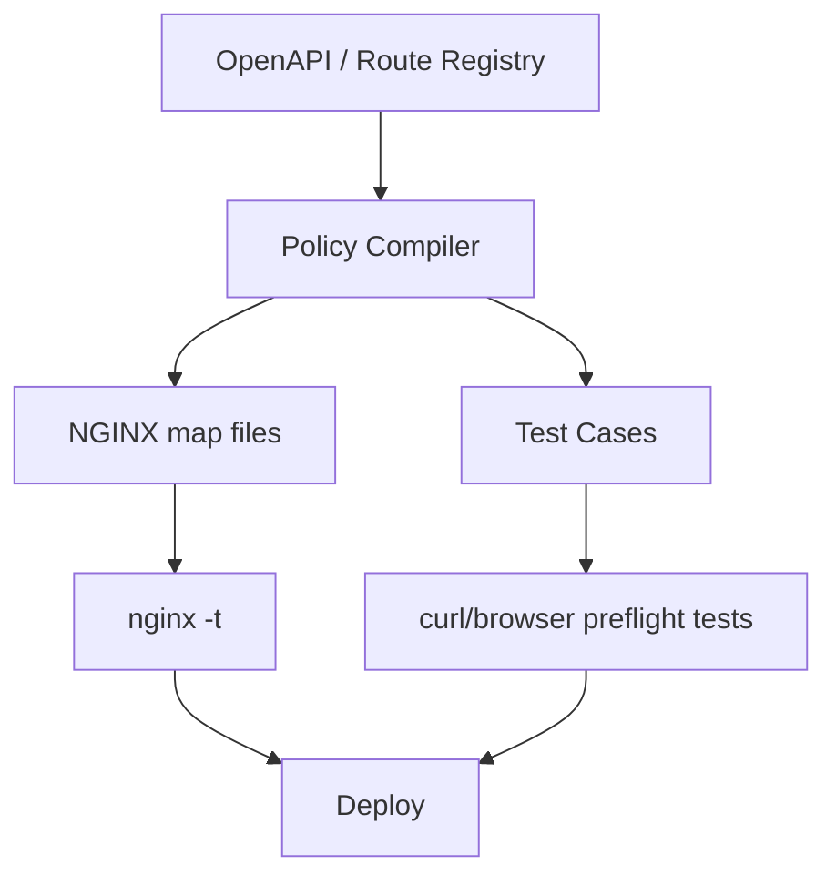
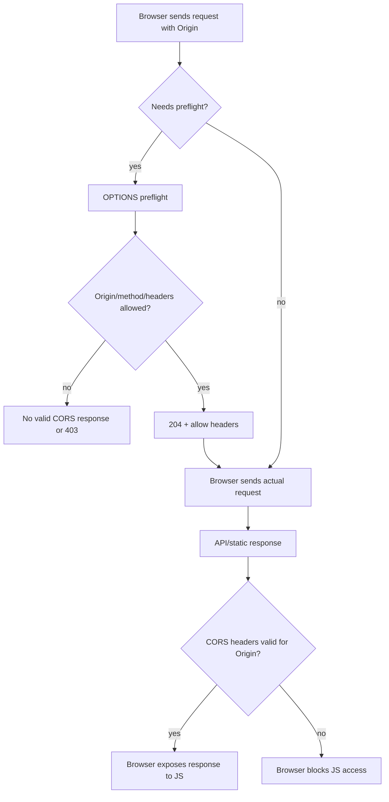

# Part 026 — CORS dan OPTIONS Preflight di Edge tanpa Membuka Permukaan Serangan

CORS sering diperlakukan seperti masalah header:

```txt
Tambahkan Access-Control-Allow-Origin, selesai.
```

Itu cara berpikir yang berbahaya.

CORS adalah kontrak antara browser, origin frontend, dan server. NGINX hanya salah satu tempat untuk menegakkan kontrak itu. Jika CORS dipasang tanpa model security yang jelas, hasilnya bisa berupa data leakage, credential exposure, cache poisoning, atau API yang terlihat aman di curl tetapi gagal di browser.

---

## 1. Tujuan Part Ini

Setelah bagian ini, kamu harus bisa:

1. memahami CORS sebagai browser-enforced policy, bukan authorization;
2. membedakan simple request dan preflight request;
3. menangani `OPTIONS` secara aman di NGINX;
4. membuat allowlist origin dengan `map`, bukan wildcard sembarangan;
5. memahami kenapa `Access-Control-Allow-Origin: *` tidak cocok dengan credentials;
6. menambahkan `Vary: Origin` saat response bergantung pada origin;
7. menghindari `if` + `add_header` footgun;
8. memutuskan kapan CORS lebih baik di app, gateway, atau NGINX;
9. membuat test matrix untuk browser-like CORS behavior;
10. menghindari cache dan CDN interaction yang salah.

---

## 2. CORS Bukan Auth

CORS menjawab pertanyaan:

```txt
Apakah browser boleh mengekspos response dari origin B
ke JavaScript yang berjalan di origin A?
```

CORS tidak menjawab:

```txt
Apakah user ini boleh membaca data?
Apakah token valid?
Apakah tenant ini boleh akses resource?
Apakah request berasal dari attacker?
```

Jadi ini salah:

```txt
Kami aman karena hanya allow origin frontend kami.
```

Yang benar:

```txt
CORS mengurangi permukaan browser cross-origin access,
tetapi authorization tetap harus ditegakkan di API.
```

Attacker tetap bisa memanggil API dari curl, server-side script, Postman, atau backend mereka sendiri. CORS hanya membatasi browser.

---

## 3. Origin: Unit Utama CORS

Origin adalah kombinasi:

```txt
scheme + host + port
```

Contoh berbeda origin:

| URL | Origin |
|---|---|
| `https://app.example.com` | `https://app.example.com` |
| `http://app.example.com` | berbeda karena scheme |
| `https://app.example.com:8443` | berbeda karena port |
| `https://api.example.com` | berbeda karena host |

CORS bekerja dengan header `Origin` dari browser.

Contoh request:

```http
GET /api/me HTTP/1.1
Host: api.example.com
Origin: https://app.example.com
```

Server bisa menjawab:

```http
Access-Control-Allow-Origin: https://app.example.com
```

Jika browser menilai response sesuai policy, JavaScript boleh membaca response.

---

## 4. Simple Request vs Preflight Request

Browser tidak selalu mengirim preflight.

### Simple-ish request

Contoh:

```http
GET /api/products HTTP/1.1
Origin: https://app.example.com
```

Server harus menambahkan CORS response header pada actual response:

```http
Access-Control-Allow-Origin: https://app.example.com
```

### Preflight request

Browser mengirim `OPTIONS` sebelum actual request jika request dianggap non-simple, misalnya memakai method tertentu atau custom header.

```http
OPTIONS /api/orders HTTP/1.1
Host: api.example.com
Origin: https://app.example.com
Access-Control-Request-Method: POST
Access-Control-Request-Headers: authorization,content-type
```

Server menjawab izin:

```http
HTTP/1.1 204 No Content
Access-Control-Allow-Origin: https://app.example.com
Access-Control-Allow-Methods: GET,POST,PUT,PATCH,DELETE,OPTIONS
Access-Control-Allow-Headers: authorization,content-type
Access-Control-Max-Age: 600
Vary: Origin
```

Baru setelah itu browser mengirim actual `POST`.

---

## 5. Header CORS Utama

| Header | Response untuk | Fungsi |
|---|---|---|
| `Access-Control-Allow-Origin` | preflight + actual | origin yang diizinkan membaca response |
| `Access-Control-Allow-Methods` | preflight | method yang diizinkan |
| `Access-Control-Allow-Headers` | preflight | request header yang diizinkan |
| `Access-Control-Allow-Credentials` | preflight + actual | apakah credentials boleh digunakan |
| `Access-Control-Expose-Headers` | actual | response header tambahan yang boleh dibaca JS |
| `Access-Control-Max-Age` | preflight | durasi cache preflight browser |
| `Vary: Origin` | cache-aware response | response berubah berdasarkan Origin |

---

## 6. Credentials: Cookie, Authorization, Client Certificate

Credentials dalam konteks browser bisa mencakup cookie, Authorization header, atau TLS client certificate behavior tertentu.

Jika frontend menggunakan:

```js
fetch('https://api.example.com/me', {
  credentials: 'include'
})
```

Server perlu:

```http
Access-Control-Allow-Credentials: true
Access-Control-Allow-Origin: https://app.example.com
```

Yang tidak boleh:

```http
Access-Control-Allow-Origin: *
Access-Control-Allow-Credentials: true
```

Wildcard origin dan credentials adalah kombinasi berbahaya dan ditolak browser modern.

---

## 7. CORS Edge Policy: Kapan di NGINX, Kapan di App?

CORS cocok di NGINX jika:

1. origin allowlist statis atau environment-level;
2. semua endpoint dalam server block punya policy yang sama;
3. preflight bisa dijawab tanpa business logic;
4. kamu ingin mengurangi beban upstream untuk `OPTIONS`;
5. API gateway/edge team adalah owner cross-origin policy.

CORS lebih baik di aplikasi jika:

1. policy berbeda per tenant/user/app;
2. allowed origin berasal dari database;
3. method/header allowed tergantung resource;
4. audit authorization dan CORS harus digabung;
5. response expose headers bergantung pada domain logic.

Rule:

```txt
NGINX cocok untuk static edge policy.
Aplikasi cocok untuk dynamic business policy.
```

---

## 8. Anti-Pattern: Wildcard untuk Semua

Buruk:

```nginx
add_header Access-Control-Allow-Origin * always;
add_header Access-Control-Allow-Methods 'GET,POST,PUT,PATCH,DELETE,OPTIONS' always;
add_header Access-Control-Allow-Headers '*' always;
```

Masalah:

1. terlalu luas;
2. tidak cocok dengan credentials;
3. membuat API terlihat public browser-readable;
4. menyembunyikan boundary sebenarnya;
5. raw `*` untuk headers/methods punya compatibility/security nuance;
6. tidak menambahkan `Vary: Origin` jika response sebenarnya dynamic.

Untuk public static assets, wildcard kadang valid. Untuk authenticated API, biasanya tidak.

---

## 9. Anti-Pattern: Reflect Origin Tanpa Allowlist

Buruk:

```nginx
add_header Access-Control-Allow-Origin $http_origin always;
add_header Access-Control-Allow-Credentials true always;
```

Ini berarti origin mana pun yang mengirim `Origin` akan diterima.

Attacker page:

```txt
https://evil.example
```

Mengirim:

```http
Origin: https://evil.example
```

NGINX membalas:

```http
Access-Control-Allow-Origin: https://evil.example
Access-Control-Allow-Credentials: true
```

Jika browser membawa cookie/session, ini bisa membuka data ke origin attacker bila authorization hanya berbasis cookie dan tidak ada CSRF/session protections yang memadai.

Reflect origin hanya aman jika origin sudah melewati allowlist.

---

## 10. Production Pattern: Origin Allowlist dengan `map`

Letakkan mapping di `http` context.

```nginx
map $http_origin $cors_allowed_origin {
    default "";

    "https://app.example.com"        $http_origin;
    "https://admin.example.com"      $http_origin;
    "https://partner.example.net"    $http_origin;
}
```

Maknanya:

```txt
Jika Origin adalah salah satu yang diizinkan,
set response origin ke origin tersebut.
Jika tidak, kosong.
```

Lalu gunakan di server/location:

```nginx
add_header Access-Control-Allow-Origin $cors_allowed_origin always;
add_header Vary Origin always;
```

Namun ada nuance: jika `$cors_allowed_origin` kosong, NGINX dapat mengirim header kosong tergantung versi/behavior dan directive. Dalam banyak setup, lebih baik memisahkan allowed/denied path secara eksplisit dengan conditional `return` untuk preflight dan membiarkan actual response tanpa valid CORS header.

---

## 11. Production Pattern: API dengan Credentials

Contoh baseline:

```nginx
# http context
map $http_origin $cors_allowed_origin {
    default "";
    "https://app.example.com"   $http_origin;
    "https://admin.example.com" $http_origin;
}

map $cors_allowed_origin $cors_is_allowed {
    default 0;
    ""      0;
    ~.+     1;
}

server {
    listen 443 ssl http2;
    server_name api.example.com;

    location /api/ {
        # Preflight
        if ($request_method = OPTIONS) {
            add_header Access-Control-Allow-Origin $cors_allowed_origin always;
            add_header Access-Control-Allow-Credentials true always;
            add_header Access-Control-Allow-Methods 'GET,POST,PUT,PATCH,DELETE,OPTIONS' always;
            add_header Access-Control-Allow-Headers 'authorization,content-type,x-request-id' always;
            add_header Access-Control-Max-Age 600 always;
            add_header Vary Origin always;
            add_header Content-Length 0;
            return 204;
        }

        # Actual response CORS headers
        add_header Access-Control-Allow-Origin $cors_allowed_origin always;
        add_header Access-Control-Allow-Credentials true always;
        add_header Access-Control-Expose-Headers 'x-request-id' always;
        add_header Vary Origin always;

        proxy_pass http://api_backend;
    }
}
```

Ini masih punya kelemahan: preflight dari origin yang tidak diizinkan dapat mendapat header kosong. Banyak browser akan menolak, tetapi logs dan policy lebih jelas jika kita menolak eksplisit.

---

## 12. Stricter Pattern: Tolak Preflight dari Origin Tidak Dikenal

```nginx
map $http_origin $cors_allowed_origin {
    default "";
    "https://app.example.com"   $http_origin;
    "https://admin.example.com" $http_origin;
}

map $cors_allowed_origin $cors_origin_allowed {
    default 1;
    ""      0;
}

server {
    listen 443 ssl http2;
    server_name api.example.com;

    location /api/ {
        if ($request_method = OPTIONS) {
            if ($cors_origin_allowed = 0) {
                return 403;
            }

            add_header Access-Control-Allow-Origin $cors_allowed_origin always;
            add_header Access-Control-Allow-Credentials true always;
            add_header Access-Control-Allow-Methods 'GET,POST,PUT,PATCH,DELETE,OPTIONS' always;
            add_header Access-Control-Allow-Headers 'authorization,content-type,x-request-id' always;
            add_header Access-Control-Max-Age 600 always;
            add_header Vary Origin always;
            add_header Content-Length 0;
            return 204;
        }

        add_header Access-Control-Allow-Origin $cors_allowed_origin always;
        add_header Access-Control-Allow-Credentials true always;
        add_header Access-Control-Expose-Headers 'x-request-id' always;
        add_header Vary Origin always;

        proxy_pass http://api_backend;
    }
}
```

Catatan penting: nested `if` di NGINX dapat menjadi problematik. Pattern di atas menunjukkan intent, tetapi untuk production besar biasanya lebih baik menghindari nested `if` dan memindahkan kombinasi state ke `map`, named location, atau memproses preflight di app/gateway yang lebih ekspresif.

---

## 13. Safer NGINX Pattern tanpa Nested `if`: Pisahkan Method State

NGINX config language tidak sefleksibel bahasa pemrograman biasa. Untuk CORS kompleks, gunakan `map` sebagai decision table.

```nginx
map $http_origin $cors_allowed_origin {
    default "";
    "https://app.example.com"   $http_origin;
    "https://admin.example.com" $http_origin;
}

map "$request_method:$cors_allowed_origin" $cors_preflight_status {
    default "";
    "OPTIONS:" 403;
    ~^OPTIONS:.+ 204;
}
```

Lalu:

```nginx
location /api/ {
    if ($cors_preflight_status = 403) {
        return 403;
    }

    if ($cors_preflight_status = 204) {
        add_header Access-Control-Allow-Origin $cors_allowed_origin always;
        add_header Access-Control-Allow-Credentials true always;
        add_header Access-Control-Allow-Methods 'GET,POST,PUT,PATCH,DELETE,OPTIONS' always;
        add_header Access-Control-Allow-Headers 'authorization,content-type,x-request-id' always;
        add_header Access-Control-Max-Age 600 always;
        add_header Vary Origin always;
        add_header Content-Length 0;
        return 204;
    }

    add_header Access-Control-Allow-Origin $cors_allowed_origin always;
    add_header Access-Control-Allow-Credentials true always;
    add_header Access-Control-Expose-Headers 'x-request-id' always;
    add_header Vary Origin always;

    proxy_pass http://api_backend;
}
```

Kita masih memakai `if`, tetapi hanya untuk `return`, yang jauh lebih aman daripada memakainya sebagai generic routing language.

---

## 14. `add_header` Inheritance Trap

`add_header` tidak selalu bersifat additive seperti yang banyak orang bayangkan.

Jika kamu punya:

```nginx
server {
    add_header X-Frame-Options DENY always;
    add_header X-Content-Type-Options nosniff always;

    location /api/ {
        add_header Access-Control-Allow-Origin https://app.example.com always;
        proxy_pass http://api;
    }
}
```

Directive `add_header` di `location` bisa membuat header dari parent tidak diwariskan, tergantung versi dan inheritance directive yang tersedia.

Akibatnya, menambahkan CORS di location bisa tanpa sengaja menghapus security headers.

Production discipline:

```txt
Jika menambah add_header di child context,
review seluruh header yang harus tetap ada di response context tersebut.
```

Atau gunakan snippet yang mengulang security headers di context yang memerlukan CORS.

---

## 15. `always`: Kenapa Penting

Tanpa `always`, `add_header` hanya berlaku untuk status code tertentu.

Untuk CORS actual response, error response juga sering perlu CORS header agar browser bisa membaca error payload. Tanpa itu, frontend hanya melihat CORS error, bukan error API yang sebenarnya.

Gunakan:

```nginx
add_header Access-Control-Allow-Origin $cors_allowed_origin always;
```

Trade-off:

1. membantu debugging frontend;
2. menjaga error contract;
3. tetapi jangan membuat unauthorized origin mendapat header yang valid.

---

## 16. `Vary: Origin`: Cache Correctness

Jika response header `Access-Control-Allow-Origin` bergantung pada request `Origin`, maka cache harus tahu bahwa response berbeda per origin.

Tambahkan:

```nginx
add_header Vary Origin always;
```

Tanpa `Vary: Origin`, proxy/CDN/browser cache bisa menyimpan response untuk satu origin lalu memberikannya ke origin lain dengan header yang salah.

Jika response juga bergantung pada `Accept-Encoding`, idealnya `Vary` harus mencakup keduanya. Hati-hati karena beberapa layer dapat menggabungkan atau mengganti `Vary`.

---

## 17. Preflight Harus Cepat, Tapi Tidak Boleh Bohong

Preflight idealnya dijawab di edge karena:

1. tidak perlu membangunkan upstream;
2. mengurangi latency;
3. mengurangi noise log aplikasi;
4. mudah dicache browser dengan `Access-Control-Max-Age`.

Tetapi preflight tidak boleh mengizinkan sesuatu yang actual request akan tolak secara struktural.

Buruk:

```http
Access-Control-Allow-Methods: GET,POST,PUT,PATCH,DELETE,OPTIONS
```

Padahal endpoint hanya mendukung `GET`.

Browser akan mengirim actual `DELETE`, lalu API mengembalikan 405. Ini bukan security breach langsung, tapi policy edge menjadi tidak akurat.

Untuk API besar, pertimbangkan:

1. CORS global longgar tapi auth ketat;
2. CORS per route di app;
3. generated NGINX config dari OpenAPI spec;
4. gateway policy engine.

---

## 18. Allow-Headers: Jangan Reflect Sembarangan

Buruk:

```nginx
add_header Access-Control-Allow-Headers $http_access_control_request_headers always;
```

Ini merefleksikan semua header yang diminta browser.

Lebih aman:

```nginx
add_header Access-Control-Allow-Headers 'authorization,content-type,x-request-id,x-csrf-token' always;
```

Jika benar-benar perlu dynamic allowlist, gunakan policy yang membatasi header.

Header seperti `authorization` punya implikasi lebih besar daripada `x-request-id`. Jangan satukan semua tanpa review.

---

## 19. Allow-Methods: Jangan Klaim Semua Jika Tidak Semua Didukung

Untuk read-only public API:

```nginx
add_header Access-Control-Allow-Methods 'GET,HEAD,OPTIONS' always;
```

Untuk authenticated CRUD API:

```nginx
add_header Access-Control-Allow-Methods 'GET,POST,PUT,PATCH,DELETE,OPTIONS' always;
```

Jika endpoint heterogen, global method list bisa misleading. Pilih antara:

1. location per API group;
2. app-level CORS;
3. generated edge config.

---

## 20. `Access-Control-Max-Age`: Cache Preflight dengan Sadar

Contoh:

```nginx
add_header Access-Control-Max-Age 600 always;
```

Trade-off:

| Nilai | Pro | Kontra |
|---:|---|---|
| rendah | cepat propagate policy change | lebih banyak preflight |
| tinggi | latency lebih rendah | rollback policy lebih lambat di browser |

Untuk sistem dengan policy sering berubah, jangan terlalu tinggi.

Untuk stable public API, nilai lebih tinggi bisa masuk akal.

---

## 21. CORS untuk Public Static Assets

Untuk font, image, wasm, atau public asset, wildcard bisa valid.

```nginx
location /assets/ {
    root /srv/www;
    try_files $uri =404;

    add_header Access-Control-Allow-Origin * always;
    add_header Cross-Origin-Resource-Policy cross-origin always;
}
```

Tetapi jangan copy pola ini ke authenticated API.

Static asset policy dan API policy harus dipisahkan.

---

## 22. CORS untuk Fonts

Browser sering membutuhkan CORS untuk font cross-origin.

```nginx
location ~* \.(woff2|woff|ttf|otf)$ {
    root /srv/www;
    try_files $uri =404;

    add_header Access-Control-Allow-Origin * always;
    expires 1y;
    add_header Cache-Control "public, immutable" always;
}
```

Jika font hanya untuk domain internal tertentu, gunakan allowlist origin, bukan wildcard.

---

## 23. CORS dan CSRF: Jangan Campur

CORS dan CSRF berbeda.

CORS membatasi browser membaca response cross-origin.

CSRF membatasi browser mengirim request yang memanfaatkan ambient credentials seperti cookie.

Jika API memakai cookie session:

1. CORS allowlist tetap perlu;
2. SameSite cookie policy perlu;
3. CSRF token mungkin perlu;
4. state-changing method harus protected;
5. Authorization tetap harus di backend.

Jangan menganggap CORS menggantikan CSRF defense.

---

## 24. CORS dan `Authorization` Header

Jika frontend mengirim bearer token:

```http
Authorization: Bearer <token>
```

Preflight biasanya akan meminta:

```http
Access-Control-Request-Headers: authorization
```

Server perlu:

```http
Access-Control-Allow-Headers: authorization,content-type
```

Tetapi mengizinkan header `authorization` secara CORS tidak memvalidasi token. Itu hanya memberi izin browser untuk mengirim actual request dengan header tersebut.

---

## 25. CORS dan Reverse Proxy

Jika NGINX berada di depan upstream yang juga menambahkan CORS header, bisa terjadi duplicate/conflicting headers.

Contoh buruk:

```http
Access-Control-Allow-Origin: https://app.example.com
Access-Control-Allow-Origin: *
```

Browser behavior bisa gagal atau tidak sesuai harapan.

Pilihan desain:

```txt
Option A: CORS hanya di NGINX; upstream tidak menulis CORS.
Option B: CORS hanya di app; NGINX tidak menulis CORS.
Option C: NGINX handles preflight, app handles actual response. Harus sangat disiplin.
```

Jika NGINX menjadi owner CORS, sembunyikan upstream CORS header:

```nginx
proxy_hide_header Access-Control-Allow-Origin;
proxy_hide_header Access-Control-Allow-Credentials;
proxy_hide_header Access-Control-Allow-Headers;
proxy_hide_header Access-Control-Allow-Methods;
```

Lalu tambahkan policy edge sendiri.

---

## 26. CORS dan Error Response

Tanpa `always`, error dari upstream mungkin tidak membawa CORS header.

Frontend melihat:

```txt
CORS error
```

Padahal server mengirim:

```txt
401 Unauthorized
```

Untuk developer experience dan observability frontend, actual error response dari allowed origin sebaiknya tetap membawa CORS header.

```nginx
add_header Access-Control-Allow-Origin $cors_allowed_origin always;
add_header Access-Control-Allow-Credentials true always;
```

Tetapi jangan menambahkan valid CORS header untuk origin yang tidak diizinkan.

---

## 27. CORS dan CDN/Cache

Jika API response bisa dicache dan CORS origin dynamic, wajib pikirkan cache key.

Minimal:

```nginx
add_header Vary Origin always;
```

Jika memakai NGINX proxy cache:

```nginx
proxy_cache_key "$scheme$request_method$host$request_uri$http_origin";
```

Tetapi memasukkan origin ke cache key dapat memperbanyak cache cardinality. Untuk public resources yang aman untuk semua origin, gunakan wildcard agar cache tidak terfragmentasi.

Decision:

| Resource | ACAO | Cache Key |
|---|---|---|
| public immutable asset | `*` | tanpa origin |
| public API but origin-restricted | reflected allowlist | include/`Vary: Origin` |
| authenticated API | biasanya no shared cache | origin-aware, private/no-store |

---

## 28. CORS dan SameSite Cookie

Jika cookie session dipakai cross-site, browser cookie policy juga menentukan apakah cookie dikirim.

Umumnya perlu:

```http
Set-Cookie: session=...; Secure; HttpOnly; SameSite=None
```

Tapi ini bukan konfigurasi CORS semata. NGINX bisa meneruskan atau memodifikasi cookie header, tetapi keputusan session security biasanya milik aplikasi/auth layer.

Jangan mencoba menyelesaikan cookie/session security hanya dengan CORS header.

---

## 29. Handling `OPTIONS` untuk Non-CORS

Tidak semua `OPTIONS` adalah CORS preflight.

CORS preflight biasanya memiliki:

```http
Origin: ...
Access-Control-Request-Method: ...
```

Jika request `OPTIONS` tidak punya header tersebut, itu mungkin health check, client introspection, atau generic HTTP options.

Jangan selalu menjawab semua `OPTIONS` dengan CORS response jika API membutuhkan behavior lain.

Pattern lebih ketat:

```nginx
map "$request_method:$http_origin:$http_access_control_request_method" $is_cors_preflight {
    default 0;
    ~^OPTIONS:https?://.+:.+ 1;
}
```

---

## 30. Logging CORS

Tambahkan field untuk debugging:

```nginx
log_format api_json escape=json
  '{'
    '"ts":"$time_iso8601",'
    '"method":"$request_method",'
    '"host":"$host",'
    '"uri":"$uri",'
    '"origin":"$http_origin",'
    '"acr_method":"$http_access_control_request_method",'
    '"acr_headers":"$http_access_control_request_headers",'
    '"cors_allowed_origin":"$cors_allowed_origin",'
    '"status":$status,'
    '"request_id":"$request_id"'
  '}';
```

Saat frontend berkata “CORS error”, log ini membantu membedakan:

1. origin tidak allowed;
2. method tidak allowed;
3. header tidak allowed;
4. actual response error tanpa CORS header;
5. CDN menghapus/mengubah header;
6. upstream mengirim duplicate CORS header.

---

## 31. Test dengan `curl`: Preflight

```bash
curl -i -X OPTIONS 'https://api.example.com/api/orders' \
  -H 'Origin: https://app.example.com' \
  -H 'Access-Control-Request-Method: POST' \
  -H 'Access-Control-Request-Headers: authorization,content-type'
```

Expected:

```http
HTTP/1.1 204 No Content
Access-Control-Allow-Origin: https://app.example.com
Access-Control-Allow-Credentials: true
Access-Control-Allow-Methods: GET,POST,PUT,PATCH,DELETE,OPTIONS
Access-Control-Allow-Headers: authorization,content-type,x-request-id
Access-Control-Max-Age: 600
Vary: Origin
```

Denied origin:

```bash
curl -i -X OPTIONS 'https://api.example.com/api/orders' \
  -H 'Origin: https://evil.example' \
  -H 'Access-Control-Request-Method: POST' \
  -H 'Access-Control-Request-Headers: authorization,content-type'
```

Expected:

```http
HTTP/1.1 403 Forbidden
```

Atau response tanpa valid CORS allow headers, tergantung policy. Untuk observability, 403 lebih jelas.

---

## 32. Test dengan `curl`: Actual Request

```bash
curl -i 'https://api.example.com/api/me' \
  -H 'Origin: https://app.example.com' \
  -H 'Authorization: Bearer test'
```

Expected:

```http
Access-Control-Allow-Origin: https://app.example.com
Access-Control-Allow-Credentials: true
Vary: Origin
```

Denied origin:

```bash
curl -i 'https://api.example.com/api/me' \
  -H 'Origin: https://evil.example' \
  -H 'Authorization: Bearer test'
```

Expected options:

1. no `Access-Control-Allow-Origin`; browser blocks JS access;
2. or explicit 403 at edge if policy says deny early.

Choose one and make it consistent.

---

## 33. Browser Test

`curl` is not the browser. It does not enforce CORS.

Minimal browser test:

```html
<script>
fetch('https://api.example.com/api/me', {
  method: 'GET',
  credentials: 'include',
  headers: {
    'X-Request-ID': crypto.randomUUID()
  }
})
  .then(async r => {
    console.log('status', r.status);
    console.log('x-request-id', r.headers.get('x-request-id'));
    console.log(await r.text());
  })
  .catch(e => console.error('fetch failed', e));
</script>
```

Test from:

1. allowed origin;
2. denied origin;
3. HTTP vs HTTPS;
4. port variant;
5. subdomain variant;
6. credential include vs omit.

---

## 34. Production Config Example: Static + API Split

```nginx
# http context
map $http_origin $api_cors_origin {
    default "";
    "https://app.example.com"   $http_origin;
    "https://admin.example.com" $http_origin;
}

server {
    listen 443 ssl http2;
    server_name example.com;

    # Public immutable assets: broad CORS is acceptable.
    location /assets/ {
        root /srv/www/app;
        try_files $uri =404;

        add_header Access-Control-Allow-Origin * always;
        add_header Cache-Control "public, max-age=31536000, immutable" always;
    }

    # API: origin allowlist and credentials.
    location /api/ {
        if ($request_method = OPTIONS) {
            add_header Access-Control-Allow-Origin $api_cors_origin always;
            add_header Access-Control-Allow-Credentials true always;
            add_header Access-Control-Allow-Methods 'GET,POST,PUT,PATCH,DELETE,OPTIONS' always;
            add_header Access-Control-Allow-Headers 'authorization,content-type,x-request-id,x-csrf-token' always;
            add_header Access-Control-Max-Age 600 always;
            add_header Vary Origin always;
            add_header Content-Length 0;
            return 204;
        }

        proxy_hide_header Access-Control-Allow-Origin;
        proxy_hide_header Access-Control-Allow-Credentials;
        proxy_hide_header Access-Control-Allow-Headers;
        proxy_hide_header Access-Control-Allow-Methods;

        add_header Access-Control-Allow-Origin $api_cors_origin always;
        add_header Access-Control-Allow-Credentials true always;
        add_header Access-Control-Expose-Headers 'x-request-id' always;
        add_header Vary Origin always;

        proxy_set_header Host $host;
        proxy_set_header X-Request-ID $request_id;
        proxy_pass http://api_backend;
    }
}
```

Review before production:

1. Should denied origins receive 403 or no CORS header?
2. Should `OPTIONS` be proxied for some endpoints?
3. Are security headers preserved after adding CORS headers?
4. Is `Vary` correct?
5. Are upstream CORS headers hidden?
6. Are credentials actually required?

---

## 35. Better Pattern for Large API: Generate CORS from API Contract

If you have OpenAPI specs, route ownership, and method definitions, generate CORS policy instead of hand-writing global method lists.

Pipeline:



Generated config can answer:

1. allowed origins per environment;
2. allowed methods per path group;
3. allowed headers per API family;
4. max-age per stability class;
5. expose headers per response contract.

This is platform engineering, not manual header copy-paste.

---

## 36. CORS Failure Modes

| Symptom | Likely Cause |
|---|---|
| Browser says CORS error, curl works | Missing/invalid CORS header |
| Preflight 404/405 | `OPTIONS` proxied to app that doesn't handle it |
| Preflight passes, actual fails | Missing CORS headers on actual response/error |
| Works without credentials, fails with credentials | wildcard origin or missing `Allow-Credentials` |
| Works for one origin, fails for another | allowlist mismatch or missing port/scheme |
| Random cache behavior | missing `Vary: Origin` |
| Duplicate ACAO header | both app and NGINX set CORS |
| Header not present on 401/500 | missing `always` |
| Security headers disappear | `add_header` inheritance trap |

---

## 37. Incident Playbook: “CORS Broken”

1. Reproduce preflight with `curl -i -X OPTIONS`.
2. Reproduce actual request with `curl -i` and `Origin` header.
3. Compare allowed origin exact string: scheme, host, port.
4. Check method in `Access-Control-Request-Method`.
5. Check requested headers casing/list.
6. Check whether response has duplicate CORS headers.
7. Check whether status is 401/403/500 and header missing because no `always`.
8. Check CDN/load balancer modifies headers.
9. Check NGINX effective config with `nginx -T`.
10. Check browser devtools Network tab for preflight and actual request separately.
11. Confirm whether credentials are used by frontend.
12. Confirm `Vary: Origin` and cache behavior.

---

## 38. Review Checklist

Sebelum merge CORS config:

1. Apakah CORS memang perlu di NGINX, bukan app?
2. Apakah API memakai credentials?
3. Apakah wildcard origin benar-benar aman untuk resource ini?
4. Apakah origin allowlist exact mencakup scheme dan port?
5. Apakah denied origin behavior eksplisit?
6. Apakah preflight dan actual response sama-sama punya policy?
7. Apakah error response dari allowed origin tetap membawa CORS header?
8. Apakah `Vary: Origin` ditambahkan bila origin dynamic?
9. Apakah `add_header` menghapus inherited security headers?
10. Apakah upstream CORS header disembunyikan atau dibiarkan sengaja?
11. Apakah `Access-Control-Allow-Headers` terlalu luas?
12. Apakah `Access-Control-Max-Age` sesuai risiko rollback?
13. Apakah OPTIONS non-CORS punya behavior yang benar?
14. Apakah ada test browser, bukan hanya curl?

---

## 39. Decision Matrix

| Scenario | Recommended CORS Strategy |
|---|---|
| Public static assets | `Access-Control-Allow-Origin: *` |
| Public font files | usually wildcard, cache long |
| Authenticated API with cookies | exact allowlist + credentials + CSRF/session protections |
| Bearer-token API for known SPA | exact allowlist + allow `authorization` |
| Multi-tenant dynamic origins | app/gateway dynamic policy, not static NGINX map unless generated |
| Partner API | explicit partner origin allowlist, low max-age during onboarding |
| Internal admin UI | strict origin list, no wildcard, credentials carefully reviewed |
| Highly dynamic per-user policy | application-level CORS |
| CDN-cached API | `Vary: Origin` and cache-key review |

---

## 40. Final Mental Model



NGINX hanya membantu di titik policy edge. Ia tidak menggantikan authorization, CSRF protection, token validation, tenant isolation, atau audit domain.

---

## 41. Ringkasan

CORS adalah browser-enforced access policy, bukan authentication dan bukan authorization.

Untuk public static assets, wildcard bisa masuk akal.

Untuk authenticated API, gunakan exact origin allowlist, `Access-Control-Allow-Credentials: true` hanya jika benar-benar perlu, dan jangan gabungkan credentials dengan wildcard origin.

Preflight `OPTIONS` bisa dijawab di NGINX untuk efisiensi, tetapi policy harus benar. Jangan mengizinkan method/header yang tidak sesuai dengan API contract.

Jika response CORS bergantung pada `Origin`, tambahkan `Vary: Origin` dan review cache behavior.

Jika app dan NGINX sama-sama menulis CORS header, pilih owner tunggal atau sembunyikan header upstream secara eksplisit.

CORS config yang matang bukan kumpulan header. Ia adalah contract boundary antara browser, frontend, edge, upstream, cache, dan security model.

---

## 42. Referensi Resmi

- MDN CORS Guide: https://developer.mozilla.org/en-US/docs/Web/HTTP/Guides/CORS
- MDN `Access-Control-Allow-Credentials`: https://developer.mozilla.org/en-US/docs/Web/HTTP/Reference/Headers/Access-Control-Allow-Credentials
- MDN `Access-Control-Allow-Methods`: https://developer.mozilla.org/en-US/docs/Web/HTTP/Reference/Headers/Access-Control-Allow-Methods
- MDN `Access-Control-Allow-Headers`: https://developer.mozilla.org/en-US/docs/Web/HTTP/Reference/Headers/Access-Control-Allow-Headers
- NGINX `ngx_http_headers_module`: https://nginx.org/en/docs/http/ngx_http_headers_module.html
- NGINX `ngx_http_map_module`: https://nginx.org/en/docs/http/ngx_http_map_module.html
- NGINX `ngx_http_rewrite_module`: https://nginx.org/en/docs/http/ngx_http_rewrite_module.html

