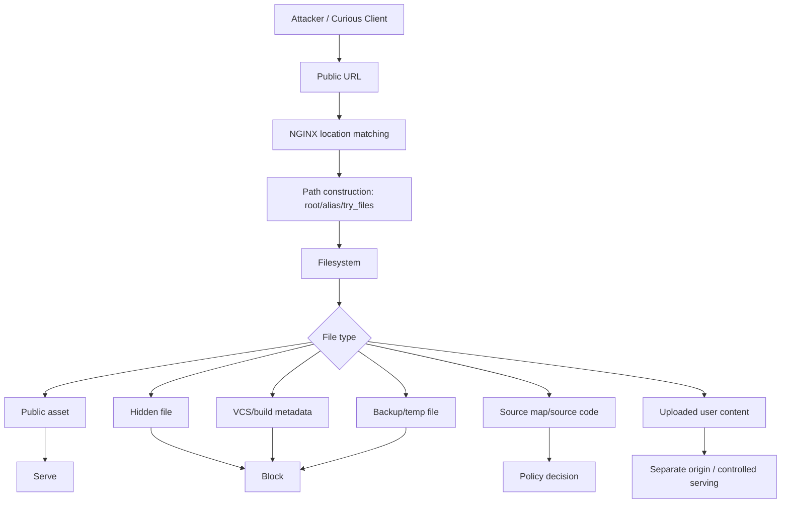

# Part 027 — Static Site Hardening: Directory Listing, Hidden Files, Source Leakage

Static site terdengar sederhana:

```txt
Client minta file → NGINX baca file → NGINX kirim file.
```

Di production, model itu kurang lengkap. Static server sebenarnya adalah **read API ke filesystem**. URL adalah input publik. Filesystem adalah database yang tidak punya row-level security, schema migration, audit policy, atau application guardrail. Kalau boundary-nya salah, NGINX dapat membocorkan file yang tidak pernah dimaksudkan sebagai public artifact.

Static hardening bukan tentang membuat konfigurasi terlihat aman. Static hardening adalah memastikan hanya file yang memang masuk **public release artifact** yang dapat diakses dari internet.

---

## 1. Tujuan Part Ini

Setelah bagian ini, kamu harus bisa:

1. melihat static serving sebagai public filesystem exposure;
2. membedakan public artifact, deployment artifact, source artifact, dan operational artifact;
3. mencegah directory listing yang tidak disengaja;
4. memblokir hidden files, VCS metadata, backup files, source maps, env files, lock files, dan build debris;
5. memahami risiko `root`, `alias`, symlink, dan path exposure;
6. mendesain default server yang aman untuk unknown host;
7. memakai security header secara realistis untuk static site;
8. memisahkan upload/public file boundary;
9. membuat log dan alert untuk static leakage attempts;
10. membuat checklist hardening yang bisa dipakai di code review dan CI.

---

## 2. Mental Model: Static Server sebagai Filesystem Read API

Sebuah static server punya tiga contract:

```txt
URL namespace       → path mapping
filesystem content  → public response
HTTP metadata       → browser behavior
```

Kalau salah satu contract kabur, failure mode-nya bisa serius:

| Contract | Salah konfigurasi | Dampak |
|---|---|---|
| URL namespace | `/assets/` salah map ke root project | source code atau config terbuka |
| Filesystem content | `.env`, `.git`, `*.bak` ikut deploy | secret leakage |
| HTTP metadata | MIME type salah atau `nosniff` tidak ada | browser bisa interpret file berbahaya |
| Cache metadata | HTML diberi immutable cache | user stuck di versi lama |
| Symlink | symlink keluar document root | file luar release terbuka |
| Default server | unknown host diarahkan ke app utama | host-header ambiguity dan traffic liar masuk tenant salah |

Hardening static site berarti mengubah filesystem dari:

```txt
semua yang ada di directory mungkin bisa di-serve
```

menjadi:

```txt
hanya release artifact yang diizinkan secara eksplisit yang bisa di-serve
```

---

## 3. Threat Model untuk Static Site

Threat model minimal:



Yang harus diasumsikan:

1. attacker akan mencoba common secret paths;
2. build pipeline bisa berubah dan tidak selalu bersih;
3. developer bisa meninggalkan `.env`, `.bak`, `.map`, `.sql`, atau `.zip`;
4. NGINX tidak tahu mana file yang sensitif kecuali diberi policy;
5. browser cache bisa memperpanjang dampak salah header;
6. static response sering tidak melewati application authorization;
7. CDN/proxy di depan NGINX bisa memperbesar blast radius.

---

## 4. Public Artifact vs Project Directory

Kesalahan paling umum:

```nginx
root /srv/my-app;
```

Padahal directory itu berisi:

```txt
/srv/my-app
├── .env
├── .git/
├── package.json
├── package-lock.json
├── src/
├── tests/
├── dist/
└── README.md
```

Yang benar: root diarahkan ke **public artifact directory**, bukan project root.

```nginx
server {
    listen 443 ssl http2;
    server_name example.com;

    root /srv/my-app/releases/20260706T100000Z/public;
    index index.html;

    location / {
        try_files $uri $uri/ =404;
    }
}
```

Lebih baik lagi, build pipeline menghasilkan directory yang memang hanya berisi file publik:

```txt
/public
├── index.html
├── assets/
│   ├── app.8cf1a9.js
│   ├── app.91db02.css
│   └── logo.3df2e1.svg
├── robots.txt
└── favicon.ico
```

Invariant:

```txt
NGINX root MUST point to a deploy artifact, not to a source repository.
```

---

## 5. Directory Listing: Jangan Mengandalkan Default Tanpa Intensi

NGINX punya `autoindex` module yang dapat membuat directory listing untuk request yang berakhir dengan `/` ketika index file tidak ditemukan. Default directive `autoindex` adalah `off`, tetapi di production tetap baik untuk menulis policy secara eksplisit pada location yang sensitif.

```nginx
location / {
    autoindex off;
    try_files $uri $uri/ =404;
}
```

Kenapa explicit `autoindex off` berguna?

1. reviewer langsung melihat intensi;
2. snippet shared tidak diam-diam mengaktifkan listing;
3. tenant config tidak override tanpa sadar;
4. konfigurasi lebih mudah diaudit otomatis.

Contoh konfigurasi yang sengaja mengaktifkan listing harus terlihat seperti exception, bukan default:

```nginx
location /public-downloads/ {
    alias /srv/downloads/public/;
    autoindex on;
    autoindex_format html;

    # Optional: tetap batasi tipe file dan akses.
    limit_except GET HEAD {
        deny all;
    }
}
```

Production rule:

```txt
autoindex on MUST require explicit business justification.
```

---

## 6. Hidden Files: `.env`, `.git`, `.well-known`, dan Regex Trap

File yang diawali titik sering sensitif:

```txt
.env
.git/
.git/config
.ssh/
.htpasswd
.npmrc
.yarnrc
.dockerignore
```

Tetapi tidak semua dot-path harus diblokir. Misalnya `/.well-known/` dipakai untuk standardized web metadata seperti ACME HTTP-01 challenge.

Baseline yang aman:

```nginx
# Block dotfiles, except well-known.
location ~ /\.(?!well-known(?:/|$)) {
    return 404;
}
```

Kenapa `return 404`, bukan `deny all`?

```txt
403 = resource mungkin ada, tetapi tidak boleh diakses
404 = resource tidak dikonfirmasi ada
```

Untuk static hardening, 404 biasanya lebih baik karena tidak memberi signal existence.

Kalau ACME challenge dipakai:

```nginx
location ^~ /.well-known/acme-challenge/ {
    root /var/lib/acme-challenges;
    default_type text/plain;
    try_files $uri =404;
}

location ~ /\.(?!well-known(?:/|$)) {
    return 404;
}
```

Jangan taruh `/.well-known/` terlalu luas kalau tidak perlu. Allow hanya path yang memang dipakai.

---

## 7. VCS Metadata dan Source Repository Leakage

File `.git` leakage termasuk insiden klasik. Kalau `.git` terbuka, attacker bisa mencoba mengambil object, commit history, branch, remote URL, dan kadang secret yang pernah ter-commit.

Blokir VCS directory secara eksplisit:

```nginx
location ~* /(?:\.git|\.svn|\.hg|CVS)(?:/|$) {
    return 404;
}
```

Tetapi jangan jadikan ini satu-satunya defense. Defense utama tetap:

```txt
public root must not contain VCS metadata.
```

NGINX rule adalah seatbelt, bukan rem utama.

CI check yang lebih kuat:

```bash
#!/usr/bin/env bash
set -euo pipefail

PUBLIC_DIR="${1:-public}"

if find "$PUBLIC_DIR" \
  \( -name '.git' -o -name '.svn' -o -name '.hg' -o -name 'CVS' \) \
  -print -quit | grep -q .; then
  echo "VCS metadata found in public artifact" >&2
  exit 1
fi
```

---

## 8. Backup, Temporary, and Editor Files

File seperti ini sering muncul saat hotfix manual, debugging, atau deployment script yang tidak atomic:

```txt
index.html.bak
config.old
app.js.orig
.env.save
main.css.tmp
nginx.conf~
.swp
.swo
```

Baseline block:

```nginx
location ~* (?:^|/)~|\.(?:bak|old|orig|save|swp|swo|tmp|temp|log)(?:$|\?) {
    return 404;
}
```

Lebih ketat untuk static site publik:

```nginx
location ~* \.(?:bak|old|orig|save|swp|swo|tmp|temp|log|sql|sqlite|db|dump|tar|tgz|gz|zip)(?:$|\?) {
    return 404;
}
```

Namun hati-hati: `.zip`, `.gz`, atau `.tar` bisa jadi memang public download. Untuk download server, buat location khusus:

```nginx
location ^~ /downloads/ {
    alias /srv/downloads/public/;
    try_files $uri =404;

    # Policy download memang berbeda dari web asset.
    default_type application/octet-stream;
    add_header Content-Disposition "attachment";
}
```

Invariant:

```txt
Do not rely on extension denylist as primary artifact control.
Use allowlisted build output whenever possible.
```

---

## 9. Source Maps: Debuggability vs Source Exposure

JavaScript source map (`.map`) berguna untuk debugging. Tetapi ia bisa membocorkan:

1. original source structure;
2. internal comments;
3. feature flag names;
4. API endpoint hints;
5. library versions;
6. unminified code;
7. sometimes secrets if build process buruk.

Ada tiga strategi:

| Strategi | Kapan dipakai | Risiko |
|---|---|---|
| Public source maps | open-source frontend, low sensitivity | source readable public |
| Private source maps | production error reporting service | perlu upload ke Sentry/observability, bukan public |
| No source maps | high-sensitivity frontend | debugging production lebih sulit |

Untuk private source maps:

```nginx
location ~* \.map$ {
    return 404;
}
```

CI check:

```bash
if find public -name '*.map' -print -quit | grep -q .; then
  echo "Source maps must not be published to public artifact" >&2
  exit 1
fi
```

Atau jika source maps sengaja public, tambahkan catatan release eksplisit. Jangan biarkan sebagai default tidak sadar.

---

## 10. Environment, Package, and Build Metadata

Static artifact sering membawa metadata yang tidak perlu:

```txt
.env
.env.production
package.json
package-lock.json
yarn.lock
pnpm-lock.yaml
composer.json
composer.lock
Gemfile
Gemfile.lock
Dockerfile
docker-compose.yml
Makefile
README.md
CHANGELOG.md
```

Sebagian tidak langsung secret, tetapi bisa membantu reconnaissance.

Baseline strict:

```nginx
location ~* /(?:package(?:-lock)?\.json|yarn\.lock|pnpm-lock\.yaml|composer\.(?:json|lock)|Gemfile(?:\.lock)?|Dockerfile|docker-compose\.ya?ml|Makefile|README(?:\.md)?|CHANGELOG(?:\.md)?)(?:$|\?) {
    return 404;
}

location ~* /\.env(?:\..*)?(?:$|\?) {
    return 404;
}
```

Tetapi lagi-lagi, lebih baik file ini tidak ada di public artifact.

---

## 11. `root`, `alias`, dan Path Exposure

Kita sudah membahas `root` vs `alias` sebelumnya. Untuk hardening, aturan praktisnya:

```txt
Use root for site-wide public artifact.
Use alias only for intentional mounted namespace.
```

Contoh aman:

```nginx
server {
    root /srv/www/example/current/public;

    location / {
        try_files $uri $uri/ =404;
    }

    location ^~ /media/ {
        alias /srv/media/example-public/;
        try_files $uri =404;
    }
}
```

Footgun:

```nginx
location /media/ {
    alias /srv/media;
}
```

Masalahnya:

1. trailing slash tidak simetris;
2. mapping path sulit ditebak;
3. reviewer bisa salah membaca namespace;
4. risk leakage lebih tinggi saat `try_files` ditambahkan belakangan.

Pattern yang lebih jelas:

```nginx
location ^~ /media/ {
    alias /srv/media/example-public/;
    try_files $uri =404;
}
```

Checklist untuk `alias`:

1. location prefix berakhir `/`;
2. alias path berakhir `/`;
3. memakai `^~` kalau tidak butuh regex override;
4. punya `try_files $uri =404`;
5. path alias menunjuk public artifact, bukan shared mutable directory;
6. tidak mencampur SPA fallback kecuali sudah diuji secara eksplisit.

---

## 12. Symlink Escape dan Release Strategy

Static deployments sering memakai symlink:

```txt
/srv/www/example/current -> /srv/www/example/releases/20260706T100000Z
```

Ini berguna untuk atomic switch. Tetapi symlink juga bisa menjadi jalan keluar dari document root jika write access kacau.

Contoh bahaya:

```txt
/srv/www/example/current/public/uploads/latest -> /etc
```

Kalau NGINX mengikuti symlink, file luar root bisa terbuka tergantung permission.

NGINX menyediakan directive `disable_symlinks` pada core module. Contoh:

```nginx
location / {
    root /srv/www/example/current/public;
    disable_symlinks if_not_owner from=/srv/www/example/current/public;
    try_files $uri $uri/ =404;
}
```

Catatan penting:

1. `disable_symlinks on` bisa bentrok dengan release strategy berbasis symlink;
2. `if_not_owner` mengizinkan symlink jika link dan target punya owner yang sama;
3. directive ini punya overhead karena NGINX perlu memeriksa komponen path;
4. tidak semua filesystem/platform punya kemampuan yang sama;
5. jangan mengganti OS permission discipline dengan directive ini.

Alternatif yang lebih deterministic:

```txt
Generate config with real release path → nginx -t → reload.
```

Contoh:

```nginx
root /srv/www/example/releases/20260706T100000Z/public;
```

Trade-off:

| Strategy | Kelebihan | Kekurangan |
|---|---|---|
| `current` symlink | deploy cepat, rollback cepat | perlu symlink discipline |
| generated real path | jelas, audit mudah | reload dibutuhkan untuk switch release |
| container image | artifact immutable | image rebuild untuk static change |
| object storage/CDN | scalable | NGINX tidak lagi source utama |

---

## 13. Permission Model: NGINX Harus Read-Only

NGINX worker user tidak boleh punya write access ke public root.

Contoh ownership:

```txt
owner: deploy
reader: nginx group
mode directories: 0750 or 0755 depending requirement
mode files:       0640 or 0644 depending requirement
```

Contoh:

```bash
chown -R deploy:nginx /srv/www/example/releases/20260706T100000Z/public
find /srv/www/example/releases/20260706T100000Z/public -type d -exec chmod 0750 {} \;
find /srv/www/example/releases/20260706T100000Z/public -type f -exec chmod 0640 {} \;
```

Kalau static file harus world-readable karena container/image layout, itu masih bisa diterima, tetapi jangan beri write permission:

```bash
find public -type d -exec chmod a-w {} \;
find public -type f -exec chmod a-w {} \;
```

Invariant:

```txt
A compromised NGINX worker should not be able to modify public content.
```

---

## 14. Upload Directory Bukan Static Asset Directory

User-uploaded content punya threat model berbeda dari build artifact.

Build artifact:

```txt
trusted by deployment pipeline
known file names
known MIME-ish behavior
versioned
immutable
```

User upload:

```txt
untrusted
attacker-controlled name
attacker-controlled bytes
possibly executable-looking
possibly HTML/SVG/script
mutable lifecycle
needs abuse controls
```

Jangan campur:

```txt
/srv/www/app/public/assets     ✅ build assets
/srv/www/app/public/uploads    ❌ user uploads under same origin
```

Lebih aman:

```txt
https://app.example.com          → application/static app
https://uploads.example-cdn.com  → uploaded objects, restricted metadata
```

Jika NGINX harus serve uploads, buat policy khusus:

```nginx
server {
    listen 443 ssl http2;
    server_name uploads.example.com;

    root /srv/uploads/public;

    location / {
        try_files $uri =404;

        default_type application/octet-stream;
        add_header X-Content-Type-Options "nosniff" always;
        add_header Content-Disposition "attachment" always;
    }

    location ~* \.(?:html?|svg|xml|js|mjs|css)$ {
        return 404;
    }
}
```

Trade-off: blocking SVG/HTML may be unacceptable for product features. Kalau begitu, jangan serve di origin yang punya cookies/session penting.

---

## 15. MIME Type dan `nosniff`

Static hardening tidak selesai dengan file blocking. Browser behavior juga penting.

Baseline:

```nginx
include /etc/nginx/mime.types;
default_type application/octet-stream;

add_header X-Content-Type-Options "nosniff" always;
```

`default_type application/octet-stream` lebih defensif daripada `text/plain` untuk unknown files, karena unknown file tidak otomatis diperlakukan sebagai text yang bisa inline dibaca/diinterpretasi.

Namun jangan asal menambahkan header di nested location tanpa paham inheritance:

```nginx
server {
    add_header X-Content-Type-Options "nosniff" always;
    add_header Referrer-Policy "strict-origin-when-cross-origin" always;

    location /assets/ {
        # Jika add_header baru ditaruh di sini, header parent bisa tidak diwariskan.
        add_header Cache-Control "public, max-age=31536000, immutable" always;
    }
}
```

Lebih aman gunakan snippet lengkap:

```nginx
# snippets/security-headers-static.conf
add_header X-Content-Type-Options "nosniff" always;
add_header Referrer-Policy "strict-origin-when-cross-origin" always;

# snippets/cache-immutable.conf
add_header X-Content-Type-Options "nosniff" always;
add_header Referrer-Policy "strict-origin-when-cross-origin" always;
add_header Cache-Control "public, max-age=31536000, immutable" always;
```

Ya, ini duplikasi. Tetapi duplikasi yang disengaja kadang lebih aman daripada inheritance yang ambigu.

---

## 16. Security Headers untuk Static Site

Baseline static security headers:

```nginx
add_header X-Content-Type-Options "nosniff" always;
add_header Referrer-Policy "strict-origin-when-cross-origin" always;
add_header X-Frame-Options "DENY" always;
```

CSP perlu dipilih sesuai aplikasi. Untuk purely static docs/site:

```nginx
add_header Content-Security-Policy "default-src 'self'; base-uri 'self'; object-src 'none'; frame-ancestors 'none'" always;
```

Untuk SPA modern, CSP bisa butuh allowance tambahan untuk API, fonts, images, analytics, Sentry, atau inline runtime. Jangan copy CSP tanpa testing.

Matrix:

| Header | Aman sebagai default? | Catatan |
|---|---:|---|
| `X-Content-Type-Options: nosniff` | Ya | Hampir selalu masuk akal |
| `Referrer-Policy` | Ya | Pilih policy sesuai analytics/privacy |
| `X-Frame-Options` | Biasanya | Bisa bentrok dengan embed product |
| `Content-Security-Policy` | Perlu desain | Sangat bagus, tetapi mudah merusak frontend |
| `Strict-Transport-Security` | Ya untuk HTTPS-only | Hati-hati includeSubDomains/preload |

Untuk HSTS:

```nginx
add_header Strict-Transport-Security "max-age=31536000; includeSubDomains" always;
```

Jangan aktifkan `includeSubDomains` kalau masih ada subdomain yang belum siap HTTPS.

---

## 17. Default Server sebagai Sinkhole

Unknown host tidak boleh jatuh ke static site utama.

Buruk:

```nginx
server {
    listen 80;
    server_name example.com;
    root /srv/www/example/public;
}
```

Jika ini menjadi default implicit, request ke host acak pada port itu bisa diproses oleh site ini.

Lebih baik:

```nginx
server {
    listen 80 default_server;
    listen 443 ssl default_server;
    server_name _;

    # Sertifikat dummy/internal sesuai environment.
    ssl_certificate     /etc/nginx/certs/default.crt;
    ssl_certificate_key /etc/nginx/certs/default.key;

    return 444;
}

server {
    listen 443 ssl http2;
    server_name example.com;

    root /srv/www/example/current/public;
    index index.html;

    location / {
        try_files $uri $uri/ =404;
    }
}
```

`444` adalah status khusus NGINX untuk menutup koneksi tanpa response. Gunakan jika cocok dengan observability dan load balancer di depan. Kalau upstream/load balancer membutuhkan response HTTP normal, pakai `return 404;` atau `return 421;` sesuai policy.

---

## 18. Error Page Jangan Bocorkan Struktur

Jangan biarkan error page custom memuat path internal, stack trace, build ID sensitif, atau template debug.

Aman:

```nginx
error_page 404 /__errors/404.html;
error_page 500 502 503 504 /__errors/50x.html;

location ^~ /__errors/ {
    internal;
    root /srv/www/error-pages;
    add_header Cache-Control "no-store" always;
}
```

Hindari:

```txt
File not found: /srv/www/example/releases/20260706T100000Z/public/private/config.json
```

Error response adalah bagian dari public API. Treat it as product surface.

---

## 19. Access Rules: `limit_except`, Methods, dan Static Surface

Static sites biasanya hanya butuh `GET` dan `HEAD`. `OPTIONS` mungkin perlu untuk CORS atau health/probe path, tetapi tidak harus global.

```nginx
location / {
    limit_except GET HEAD {
        deny all;
    }

    try_files $uri $uri/ =404;
}
```

Catatan:

1. beberapa monitoring melakukan `HEAD`;
2. CORS preflight memakai `OPTIONS`, tetapi static site murni sering tidak butuh;
3. jangan buka `PUT`, `DELETE`, atau WebDAV behavior kecuali sangat disengaja;
4. jika ada reverse proxy location untuk API, method policy-nya terpisah.

Untuk static-only origin:

```nginx
if ($request_method !~ ^(GET|HEAD)$) {
    return 405;
}
```

`if` untuk `return` adalah salah satu penggunaan yang relatif aman karena tidak mengubah rewrite flow kompleks.

---

## 20. Logging untuk Leakage Attempt

Static hardening harus observable. Tambahkan field yang membantu RCA:

```nginx
log_format static_json escape=json
  '{'
  '"ts":"$time_iso8601",'
  '"remote":"$remote_addr",'
  '"host":"$host",'
  '"method":"$request_method",'
  '"uri":"$uri",'
  '"args":"$args",'
  '"status":$status,'
  '"bytes":$body_bytes_sent,'
  '"ref":"$http_referer",'
  '"ua":"$http_user_agent"'
  '}';

access_log /var/log/nginx/static-access.log static_json;
```

Alert candidates:

| Signal | Meaning |
|---|---|
| spike `/.git/` | reconnaissance/scanner |
| requests to `.env` | secret probing |
| many `*.bak`/`*.old` | backup file probing |
| repeated 403/404 from one IP | scanner or broken client |
| source map requests | browser devtools, scanner, or leaked bundle reference |
| unknown hosts | DNS/Host header abuse or misconfigured LB |

Contoh rough grep saat incident:

```bash
zgrep -E '/(\.git|\.env|\.svn|\.hg|package-lock\.json|composer\.lock|.*\.bak)' \
  /var/log/nginx/static-access.log* | tail -100
```

---

## 21. Static Hardening Baseline Config

Contoh baseline yang bisa dijadikan starting point:

```nginx
server {
    listen 443 ssl http2;
    server_name example.com;

    root /srv/www/example/current/public;
    index index.html;

    include snippets/tls-example.conf;

    # Baseline security headers.
    add_header X-Content-Type-Options "nosniff" always;
    add_header Referrer-Policy "strict-origin-when-cross-origin" always;
    add_header X-Frame-Options "DENY" always;

    # Default unknown files.
    include /etc/nginx/mime.types;
    default_type application/octet-stream;

    # Block hidden files except ACME challenge if used elsewhere.
    location ~ /\.(?!well-known(?:/|$)) {
        return 404;
    }

    # Block VCS metadata.
    location ~* /(?:\.git|\.svn|\.hg|CVS)(?:/|$) {
        return 404;
    }

    # Block env and build metadata.
    location ~* /(?:\.env(?:\..*)?|package(?:-lock)?\.json|yarn\.lock|pnpm-lock\.yaml|composer\.(?:json|lock)|Dockerfile|docker-compose\.ya?ml|Makefile)(?:$|\?) {
        return 404;
    }

    # Block backup/temp/source-map unless explicitly allowed.
    location ~* \.(?:bak|old|orig|save|swp|swo|tmp|temp|log|sql|sqlite|db|dump|map)(?:$|\?) {
        return 404;
    }

    # Immutable hashed assets.
    location ^~ /assets/ {
        autoindex off;
        try_files $uri =404;
        add_header X-Content-Type-Options "nosniff" always;
        add_header Referrer-Policy "strict-origin-when-cross-origin" always;
        add_header Cache-Control "public, max-age=31536000, immutable" always;
    }

    # HTML and root documents.
    location / {
        autoindex off;
        limit_except GET HEAD {
            deny all;
        }
        try_files $uri $uri/ =404;
        add_header Cache-Control "no-cache" always;
    }

    error_page 404 /__errors/404.html;
    error_page 500 502 503 504 /__errors/50x.html;

    location ^~ /__errors/ {
        internal;
        root /srv/www/error-pages;
        add_header Cache-Control "no-store" always;
    }
}
```

Catatan: jika ada SPA fallback, ganti location `/` dengan policy yang tetap tidak menelan asset missing menjadi HTML 200. Pola itu sudah dibahas di Part 018.

---

## 22. CI Artifact Gate

NGINX config hardening harus dilengkapi build artifact gate.

Contoh script:

```bash
#!/usr/bin/env bash
set -euo pipefail

PUBLIC_DIR="${1:-public}"

fail() {
  echo "[static-artifact-check] $1" >&2
  exit 1
}

[ -d "$PUBLIC_DIR" ] || fail "public directory not found: $PUBLIC_DIR"

# VCS metadata.
if find "$PUBLIC_DIR" \( -name '.git' -o -name '.svn' -o -name '.hg' -o -name 'CVS' \) -print -quit | grep -q .; then
  fail "VCS metadata found"
fi

# Secrets and environment files.
if find "$PUBLIC_DIR" -type f \( -name '.env' -o -name '.env.*' -o -name '*.pem' -o -name '*.key' \) -print -quit | grep -q .; then
  fail "secret-looking file found"
fi

# Backup/temp files.
if find "$PUBLIC_DIR" -type f \
  \( -name '*.bak' -o -name '*.old' -o -name '*.orig' -o -name '*.save' -o -name '*.tmp' -o -name '*~' \) \
  -print -quit | grep -q .; then
  fail "backup/temp file found"
fi

# Source maps policy.
if [ "${ALLOW_PUBLIC_SOURCEMAPS:-false}" != "true" ]; then
  if find "$PUBLIC_DIR" -type f -name '*.map' -print -quit | grep -q .; then
    fail "source maps found but ALLOW_PUBLIC_SOURCEMAPS is not true"
  fi
fi

# Writable files should not be deployed.
if find "$PUBLIC_DIR" -perm -0002 -print -quit | grep -q .; then
  fail "world-writable file/directory found"
fi

echo "[static-artifact-check] OK"
```

Run sebelum image build atau sebelum rsync/deploy.

---

## 23. Smoke Test Matrix

Setelah deploy:

```bash
BASE=https://example.com

curl -i "$BASE/.env"
curl -i "$BASE/.git/config"
curl -i "$BASE/package.json"
curl -i "$BASE/assets/missing.js"
curl -i "$BASE/assets/app.js.map"
curl -I "$BASE/assets/app.8cf1a9.js"
curl -I "$BASE/"
curl -X POST -i "$BASE/"
```

Expected:

| Test | Expected |
|---|---|
| `/.env` | 404 |
| `/.git/config` | 404 |
| `/package.json` | 404 |
| missing asset | 404, not SPA HTML 200 |
| source map | 404 if private maps policy |
| hashed asset | 200 + immutable cache |
| `/` | 200 + no-cache/no-cache-like HTML policy |
| POST `/` | 403/405 according to policy |

Automated check:

```bash
assert_status() {
  url="$1"
  expected="$2"
  got="$(curl -sk -o /dev/null -w '%{http_code}' "$url")"
  [ "$got" = "$expected" ] || {
    echo "expected $expected got $got for $url" >&2
    exit 1
  }
}

assert_status "$BASE/.env" 404
assert_status "$BASE/.git/config" 404
assert_status "$BASE/package.json" 404
```

---

## 24. Incident Playbook: Suspected Static Leakage

Jika ada indikasi secret/source leakage:

```txt
1. Stop further exposure.
2. Preserve logs.
3. Identify exposed path and time window.
4. Remove/replace artifact.
5. Purge CDN/proxy/browser-cache-relevant layers.
6. Rotate any potentially exposed secret.
7. Audit release pipeline.
8. Add regression test.
```

Commands:

```bash
# Find suspicious files in deployed release.
find /srv/www/example/current/public \
  \( -name '.env*' -o -name '.git' -o -name '*.bak' -o -name '*.map' -o -name '*.key' -o -name '*.pem' \) \
  -print

# Find access attempts.
zgrep -E '/(\.env|\.git|.*\.bak|.*\.map|.*\.pem|.*\.key)' /var/log/nginx/*access*.log*
```

Do not assume “nobody downloaded it”. If logs show a 200 for sensitive artifact, treat it as exposed.

---

## 25. Review Checklist

Before approving a static NGINX config:

```txt
[ ] root points to public artifact, not repository root
[ ] default_server does not serve real tenant/site content
[ ] autoindex is off unless explicitly justified
[ ] dotfiles are blocked except required .well-known paths
[ ] VCS metadata is blocked and excluded in CI
[ ] env/secret/build metadata are blocked and excluded in CI
[ ] source maps policy is explicit
[ ] upload content is not served from privileged app origin
[ ] NGINX worker user cannot write public root
[ ] symlink policy is understood and tested
[ ] unknown MIME fallback is safe
[ ] nosniff is present
[ ] immutable cache only applies to versioned assets
[ ] HTML/root documents are not cached immutably
[ ] error pages do not reveal internal paths
[ ] leakage attempts are logged and alertable
```

---

## 26. Key Takeaways

Static serving is simple only when artifact discipline is strong.

Production invariant:

```txt
NGINX should expose a curated release artifact, not a filesystem tree.
```

Best hardening is layered:

1. build pipeline excludes non-public files;
2. NGINX blocks common leakage paths;
3. filesystem permissions make content read-only;
4. default server rejects unknown hosts;
5. browser-facing headers reduce interpretation risk;
6. logs make probing visible;
7. smoke tests prevent regression.

Kalau static hardening terasa seperti daftar regex, desainnya belum matang. Regex adalah guardrail. Boundary sebenarnya adalah release artifact dan ownership model.

---

## 27. Referensi

- NGINX Documentation — `ngx_http_autoindex_module`: https://nginx.org/en/docs/http/ngx_http_autoindex_module.html
- NGINX Documentation — `ngx_http_core_module`: https://nginx.org/en/docs/http/ngx_http_core_module.html
- F5 NGINX Documentation — Serving Static Content: https://docs.nginx.com/nginx/admin-guide/web-server/serving-static-content/
- NGINX Documentation — How nginx processes a request: https://nginx.org/en/docs/http/request_processing.html
