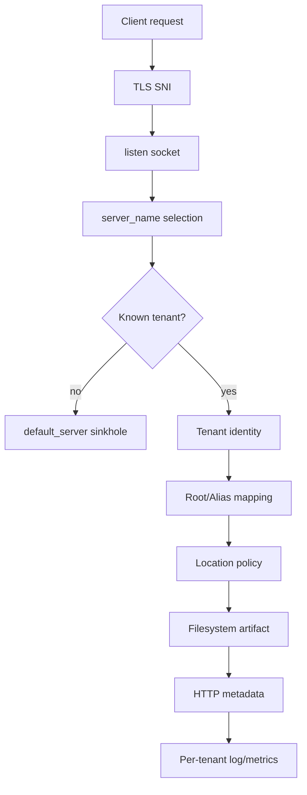
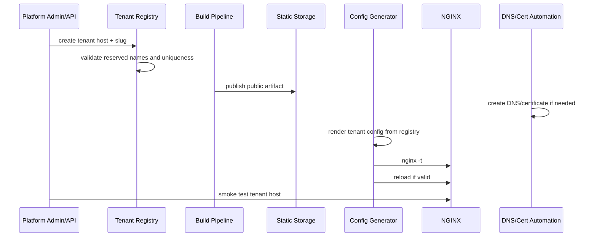

# Part 028 — Multi-Tenant Static Hosting: Isolasi Path, Host, dan Asset Namespace

Multi-tenant static hosting terlihat mudah:

```txt
tenant-a.example.com → /srv/tenants/a/public
tenant-b.example.com → /srv/tenants/b/public
```

Masalahnya bukan membuat dua domain bisa membuka dua folder. Masalah production-nya adalah memastikan tenant A tidak bisa bocor ke tenant B melalui:

1. Host header ambiguity;
2. wildcard server name yang terlalu luas;
3. variable root yang tidak di-whitelist;
4. cache key yang tidak menyertakan tenant;
5. log yang tidak bisa diinvestigasi per tenant;
6. symlink/release path yang keluar boundary;
7. browser origin/cookie/service-worker behavior;
8. deployment automation yang salah menaruh artifact.

Multi-tenancy bukan routing problem. Multi-tenancy adalah **isolation problem**.

---

## 1. Tujuan Part Ini

Setelah bagian ini, kamu harus bisa:

1. membedakan host-based, path-based, wildcard, dan generated-config tenancy;
2. memahami kenapa host-based isolation biasanya lebih aman daripada path-based isolation;
3. mendesain default server yang tidak membocorkan tenant;
4. membuat whitelist host-to-root mapping;
5. menghindari dangerous variable filesystem path;
6. menjaga cache, log, error page, dan deploy artifact terpisah per tenant;
7. memahami boundary NGINX vs OS/container/object-storage isolation;
8. membuat workflow onboarding tenant yang aman;
9. membuat smoke test dan failure injection untuk multi-tenant hosting;
10. menentukan kapan NGINX static multi-tenancy tidak cukup dan perlu platform layer lain.

---

## 2. Mental Model: Tenant Resolution Pipeline

Setiap request harus melalui pipeline ini:



Production invariant:

```txt
Tenant identity must be resolved before filesystem path is selected.
```

Jangan biarkan user-controlled string langsung menjadi path.

---

## 3. Model Tenancy

Ada empat model umum.

### 3.1 Host-Based Tenancy

```txt
tenant-a.example.com → tenant A
tenant-b.example.com → tenant B
```

Kelebihan:

1. browser origin terpisah;
2. cookies lebih mudah dipisah;
3. service worker scope tidak saling tumpang tindih;
4. cache behavior lebih jelas;
5. incident blast radius lebih kecil;
6. TLS/SNI mapping natural.

Kekurangan:

1. perlu DNS automation;
2. perlu certificate automation;
3. wildcard domain policy harus hati-hati;
4. lebih banyak hostnames untuk observability.

### 3.2 Path-Based Tenancy

```txt
example.com/t/tenant-a/
example.com/t/tenant-b/
```

Kelebihan:

1. DNS sederhana;
2. TLS sederhana;
3. cocok untuk internal preview yang low-risk.

Kekurangan besar:

1. semua tenant berbagi origin;
2. cookies bisa beririsan;
3. CSP/frame policy lebih sulit;
4. service worker scope bisa menjadi bahaya;
5. path traversal/routing mistake lebih berdampak;
6. browser cache dan frontend assumptions sering kabur.

Path-based multi-tenancy untuk unrelated tenants jarang ideal. Untuk platform public hosting, host-based hampir selalu lebih defensif.

### 3.3 Wildcard Domain Tenancy

```txt
*.sites.example.com
```

Kelebihan:

1. onboarding cepat;
2. certificate wildcard bisa dipakai;
3. config bisa lebih generik.

Kekurangan:

1. host validation wajib kuat;
2. tenant slug normalization wajib konsisten;
3. reserved names harus dicegah;
4. takeover risiko jika tenant lifecycle tidak disiplin.

### 3.4 Generated Config per Tenant

```txt
conf.d/tenants/tenant-a.conf
conf.d/tenants/tenant-b.conf
```

Kelebihan:

1. explicit config;
2. mudah audit per tenant;
3. tidak perlu variable root;
4. bisa punya policy per tenant.

Kekurangan:

1. reload per onboarding/update;
2. config explosion jika ribuan tenant;
3. perlu generator dan CI validation.

---

## 4. Browser Origin Adalah Boundary Nyata

Browser menganggap origin sebagai kombinasi scheme, host, dan port.

```txt
https://tenant-a.example.com  ≠  https://tenant-b.example.com
https://example.com/a/        =  https://example.com/b/
```

Artinya path-based tenants tetap satu origin jika scheme/host/port sama.

Konsekuensi:

| Concern | Host-based | Path-based |
|---|---:|---:|
| JavaScript origin | terpisah | sama |
| Cookies by host | lebih mudah pisah | berbagi host |
| Service worker scope | lebih mudah batasi | rawan overlap |
| CSP per tenant | lebih mudah | bisa konflik |
| Cache mental model | lebih jelas | lebih rawan salah |
| Tenant isolation | lebih kuat | lemah untuk unrelated tenants |

Jika tenant adalah customer berbeda yang tidak saling percaya, path-based hosting harus dianggap high-risk kecuali ada sandboxing tambahan dan policy browser yang sangat disiplin.

---

## 5. Default Server: Unknown Tenant Harus Mati di Depan

Jangan pernah biarkan unknown host jatuh ke tenant pertama.

```nginx
server {
    listen 80 default_server;
    listen 443 ssl default_server;
    server_name _;

    ssl_certificate     /etc/nginx/certs/default.crt;
    ssl_certificate_key /etc/nginx/certs/default.key;

    return 444;
}
```

Untuk HTTP plaintext, bisa redirect hanya jika host dikenal. Kalau tidak, sinkhole.

Buruk:

```nginx
server {
    listen 80;
    server_name _;
    return 301 https://$host$request_uri;
}
```

Masalahnya: `$host` berasal dari request Host header. Kamu baru saja menjadi redirector untuk host arbitrary.

Lebih baik:

```nginx
server {
    listen 80 default_server;
    server_name _;
    return 444;
}

server {
    listen 80;
    server_name tenant-a.example.com;
    return 301 https://tenant-a.example.com$request_uri;
}
```

Jika tenant banyak, generate redirect server blocks dari tenant registry.

---

## 6. Pattern Aman: Explicit Server Block per Tenant

Untuk jumlah tenant kecil sampai menengah, pattern paling jelas:

```nginx
server {
    listen 443 ssl http2;
    server_name tenant-a.example.com;

    root /srv/static/tenants/tenant-a/current/public;
    index index.html;

    access_log /var/log/nginx/tenant-a.access.log tenant_json;
    error_log  /var/log/nginx/tenant-a.error.log warn;

    include snippets/static-hardening.conf;
    include snippets/static-cache-policy.conf;

    location / {
        try_files $uri $uri/ =404;
    }
}

server {
    listen 443 ssl http2;
    server_name tenant-b.example.com;

    root /srv/static/tenants/tenant-b/current/public;
    index index.html;

    access_log /var/log/nginx/tenant-b.access.log tenant_json;
    error_log  /var/log/nginx/tenant-b.error.log warn;

    include snippets/static-hardening.conf;
    include snippets/static-cache-policy.conf;

    location / {
        try_files $uri $uri/ =404;
    }
}
```

Kelebihan utamanya: reviewer dapat membaca boundary tanpa menjalankan mental interpreter kompleks.

Invariant:

```txt
A tenant server block must mention exactly one tenant root.
```

---

## 7. Generated Config dari Tenant Registry

Tenant registry:

```yaml
tenants:
  - id: tenant-a
    host: tenant-a.example.com
    root: /srv/static/tenants/tenant-a/current/public
    cachePolicy: spa
  - id: tenant-b
    host: tenant-b.example.com
    root: /srv/static/tenants/tenant-b/current/public
    cachePolicy: docs
```

Generator menghasilkan NGINX config:

```nginx
# generated: do not edit manually
server {
    listen 443 ssl http2;
    server_name tenant-a.example.com;

    set $tenant_id tenant-a;
    root /srv/static/tenants/tenant-a/current/public;

    include snippets/static-hardening.conf;
    include snippets/cache-spa.conf;

    location / {
        try_files $uri $uri/ /index.html;
    }
}
```

CI validation:

```bash
nginx -t -c /etc/nginx/nginx.conf
nginx -T -c /etc/nginx/nginx.conf > /tmp/rendered-nginx.conf
```

Static policy checks:

```bash
grep -R "server_name _" /etc/nginx/conf.d/tenants && exit 1
grep -R "root /srv/static/tenants" /etc/nginx/conf.d/tenants || exit 1
```

Lebih kuat: parse tenant registry dan rendered config, lalu pastikan setiap tenant host hanya muncul sekali.

---

## 8. Pattern Dinamis dengan `map`: Whitelist, Bukan Interpolasi Bebas

Kadang tenant terlalu banyak untuk server block manual. NGINX mendukung variable di beberapa path directive seperti `root`. Tetapi ini rawan jika `$host` langsung dipakai.

Jangan:

```nginx
root /srv/static/tenants/$host/current/public;
```

Masalah:

1. `$host` berasal dari request;
2. normalization host bisa tricky;
3. filesystem path menjadi public input;
4. reserved host bisa terbuka;
5. typo DNS/Host bisa memilih directory tidak sengaja.

Lebih baik pakai whitelist `map`:

```nginx
map $host $tenant_id {
    default "";
    tenant-a.example.com tenant-a;
    tenant-b.example.com tenant-b;
}

map $tenant_id $tenant_root {
    default /srv/static/empty;
    tenant-a /srv/static/tenants/tenant-a/current/public;
    tenant-b /srv/static/tenants/tenant-b/current/public;
}
```

Server:

```nginx
server {
    listen 443 ssl http2;
    server_name tenant-a.example.com tenant-b.example.com;

    root $tenant_root;
    index index.html;

    location / {
        if ($tenant_id = "") {
            return 444;
        }

        try_files $uri $uri/ =404;
    }
}
```

`if` di sini hanya melakukan `return`; jangan pakai `if` untuk rewrite kompleks atau nested config mutation.

Namun untuk tenant banyak, `server_name` list juga harus dihasilkan dari registry. Jangan hanya mengandalkan wildcard tanpa tenant validation.

---

## 9. Wildcard Tenant Host

Wildcard pattern:

```nginx
server {
    listen 443 ssl http2;
    server_name ~^(?<tenant_slug>[a-z0-9-]+)\.sites\.example\.com$;

    # Do not directly root with $tenant_slug unless validated through map/registry.
}
```

Regex captures terlihat menggoda:

```nginx
root /srv/static/tenants/$tenant_slug/current/public;
```

Masih kurang aman karena regex hanya memvalidasi bentuk, bukan keberadaan tenant aktif.

Lebih baik:

```nginx
map $host $tenant_root {
    default /srv/static/empty;
    tenant-a.sites.example.com /srv/static/tenants/tenant-a/current/public;
    tenant-b.sites.example.com /srv/static/tenants/tenant-b/current/public;
}
```

Jika tenant registry besar sekali, pertimbangkan:

1. generated NGINX config sharded per tenant group;
2. object storage/CDN sebagai serving plane;
3. application lookup + signed redirect;
4. NGINX Plus key-value/API capability jika memang tersedia dan justified;
5. custom gateway layer di depan NGINX.

NGINX Open Source bukan dynamic tenant registry. Jangan memaksanya menjadi database.

---

## 10. Reserved Names dan Tenant Slug Policy

Untuk wildcard domain, tenant slug harus punya policy.

Reserved names:

```txt
www
api
admin
root
login
auth
static
assets
cdn
support
status
internal
localhost
mail
ftp
```

Slug constraints:

```txt
lowercase alphanumeric + hyphen
no leading hyphen
no trailing hyphen
max length bounded
no double dots
no punycode unless explicitly supported
no reserved names
must be globally unique
```

Example validation:

```regex
^[a-z0-9](?:[a-z0-9-]{0,61}[a-z0-9])?$
```

But regex is not enough. Need registry state:

```txt
slug valid AND slug reserved=false AND tenant active=true AND artifact ready=true
```

---

## 11. Filesystem Layout per Tenant

Recommended:

```txt
/srv/static/tenants/
├── tenant-a/
│   ├── releases/
│   │   ├── 20260706T100000Z/
│   │   │   └── public/
│   │   └── 20260707T090000Z/
│   │       └── public/
│   └── current -> releases/20260707T090000Z
└── tenant-b/
    ├── releases/
    └── current -> releases/20260706T110000Z
```

Better isolation for high-risk tenants:

```txt
/srv/static/tenants/tenant-a owned by deploy-tenant-a
/srv/static/tenants/tenant-b owned by deploy-tenant-b
NGINX group has read-only access
```

But remember: NGINX worker usually runs as one OS user. NGINX config alone is not a hard multi-process isolation boundary.

If tenants are adversarial and can influence file content, consider:

1. separate domains;
2. separate storage buckets;
3. separate NGINX instances or containers;
4. separate Unix users/filesystem permissions;
5. object storage/CDN with bucket policy;
6. scanning/sanitization pipeline.

---

## 12. Static Hardening Snippet per Tenant

Shared snippet:

```nginx
# snippets/static-hardening.conf
include /etc/nginx/mime.types;
default_type application/octet-stream;

autoindex off;

add_header X-Content-Type-Options "nosniff" always;
add_header Referrer-Policy "strict-origin-when-cross-origin" always;

location ~ /\.(?!well-known(?:/|$)) {
    return 404;
}

location ~* /(?:\.git|\.svn|\.hg|CVS)(?:/|$) {
    return 404;
}

location ~* /(?:\.env(?:\..*)?|package(?:-lock)?\.json|yarn\.lock|pnpm-lock\.yaml|composer\.(?:json|lock)|Dockerfile|docker-compose\.ya?ml|Makefile)(?:$|\?) {
    return 404;
}

location ~* \.(?:bak|old|orig|save|swp|swo|tmp|temp|log|sql|sqlite|db|dump|map)(?:$|\?) {
    return 404;
}
```

Caution: NGINX does not allow arbitrary `location` blocks inside every include placement. Include snippet ini harus ditempatkan pada context `server`, bukan di dalam `location`.

Better naming:

```txt
snippets/server-static-hardening.conf
snippets/location-static-assets-cache.conf
snippets/location-spa-fallback.conf
```

Nama snippet harus menunjukkan context-nya.

---

## 13. Cache Isolation

Untuk static files, browser cache sudah key by URL termasuk host. Tetapi ketika ada proxy cache/CDN/NGINX cache, cache key harus eksplisit memasukkan tenant boundary.

Wrong mental model:

```txt
/assets/app.js sama untuk semua tenant karena path sama.
```

Mungkin benar, mungkin salah. Jika tenant bisa deploy sendiri, path yang sama tidak berarti content sama.

Safe cache key pattern for proxy/cache layer:

```nginx
proxy_cache_key "$scheme|$host|$request_uri|$http_accept_encoding";
```

Untuk static file langsung dari disk, perhatikan cache headers:

```nginx
location ^~ /assets/ {
    try_files $uri =404;
    add_header Cache-Control "public, max-age=31536000, immutable" always;
    add_header X-Content-Type-Options "nosniff" always;
}

location / {
    try_files $uri $uri/ /index.html;
    add_header Cache-Control "no-cache" always;
    add_header X-Content-Type-Options "nosniff" always;
}
```

Tenant policy bisa berbeda:

| Tenant Type | Asset Cache | HTML Cache | Notes |
|---|---|---|---|
| SPA | immutable hashed assets | no-cache | common pattern |
| Docs | moderate cache | revalidate | docs updates frequent |
| Download site | long cache with versioned paths | not applicable | add Content-Disposition if needed |
| Preview env | no-store | no-store | avoid stale previews |

---

## 14. Log Isolation dan Investigation

Per-tenant log file mudah dibaca tetapi sulit disk-manage jika tenant banyak.

Option A: per-tenant access log for small/medium scale:

```nginx
access_log /var/log/nginx/tenants/tenant-a.access.log tenant_json;
```

Option B: shared structured log with tenant field:

```nginx
log_format tenant_json escape=json
  '{'
  '"ts":"$time_iso8601",'
  '"tenant":"$tenant_id",'
  '"host":"$host",'
  '"remote":"$remote_addr",'
  '"method":"$request_method",'
  '"uri":"$uri",'
  '"status":$status,'
  '"bytes":$body_bytes_sent,'
  '"request_time":$request_time,'
  '"ref":"$http_referer",'
  '"ua":"$http_user_agent"'
  '}';

access_log /var/log/nginx/tenant-static.access.log tenant_json;
```

Variable path in access logs can be tempting, but it can create file descriptor churn and operational complexity. Prefer structured logs routed by log pipeline when tenant count is large.

Investigation questions:

```txt
Which tenant served this response?
Which release was active?
Which host was requested?
Was this a known host or default server?
Was the file part of public artifact?
Was it cached elsewhere?
```

Add release ID header internally if useful:

```nginx
add_header X-Static-Release "tenant-a-20260706T100000Z" always;
```

For public internet, decide whether this exposes too much. Often better to log release ID rather than send it to clients.

---

## 15. Error Page Isolation

Shared error page can be okay, but never include tenant filesystem path or internal ID.

```nginx
error_page 404 /__errors/404.html;
error_page 500 502 503 504 /__errors/50x.html;

location ^~ /__errors/ {
    internal;
    root /srv/static/error-pages;
    add_header Cache-Control "no-store" always;
}
```

Per-tenant branded error page:

```nginx
error_page 404 /404.html;

location = /404.html {
    internal;
    try_files /404.html /__shared_errors/404.html =404;
    add_header Cache-Control "no-store" always;
}
```

Be careful: branded error fallback must not allow tenant A's error page for tenant B.

---

## 16. Tenant Onboarding Workflow

A reliable onboarding flow:



Onboarding invariants:

```txt
[ ] tenant slug validated
[ ] host verified/owned
[ ] artifact exists and passes static artifact gate
[ ] certificate available or ACME flow ready
[ ] generated config passes nginx -t
[ ] default server still rejects unknown hosts
[ ] smoke test passes for tenant host
```

---

## 17. Tenant Deactivation and Takeover Prevention

Deactivation is harder than creation.

Bad deactivation:

```txt
Delete tenant artifact, leave DNS and server_name active.
```

Potential result:

1. host still resolves;
2. default/fallback content may appear;
3. cache may continue serving old files;
4. tenant slug may be reused unsafely;
5. ACME/cert automation may renew unwanted names.

Safer deactivation:

```txt
1. mark tenant disabled in registry
2. generate explicit disabled server response
3. purge tenant cache if applicable
4. remove or archive artifact
5. optionally remove DNS after grace period
6. prevent immediate slug reuse unless policy allows
```

Disabled tenant config:

```nginx
server {
    listen 443 ssl http2;
    server_name old-tenant.example.com;

    return 410;
}
```

`410 Gone` can be useful when removal is intentional. For security-sensitive deactivation, `404` or `444` may be preferable.

---

## 18. Path-Based Tenancy: If You Must

Sometimes path-based is unavoidable:

```txt
https://preview.example.com/t/tenant-a/
https://preview.example.com/t/tenant-b/
```

Use only for trusted/internal tenants unless sandboxed.

Pattern:

```nginx
location ^~ /t/tenant-a/ {
    alias /srv/static/tenants/tenant-a/current/public/;
    try_files $uri $uri/ /t/tenant-a/index.html;

    add_header Cache-Control "no-cache" always;
    add_header X-Content-Type-Options "nosniff" always;
}
```

But note the SPA fallback with alias is tricky. A clearer pattern is often separate exact generated locations:

```nginx
location ^~ /t/tenant-a/assets/ {
    alias /srv/static/tenants/tenant-a/current/public/assets/;
    try_files $uri =404;
    add_header Cache-Control "public, max-age=31536000, immutable" always;
}

location ^~ /t/tenant-a/ {
    alias /srv/static/tenants/tenant-a/current/public/;
    try_files $uri $uri/ /index.html;
    add_header Cache-Control "no-cache" always;
}
```

Path-based checklist:

```txt
[ ] tenant cannot set arbitrary service worker at root scope
[ ] cookies are not shared unexpectedly
[ ] CSP accounts for shared origin risk
[ ] asset URLs are tenant-prefixed
[ ] SPA base href is correct
[ ] missing assets return 404, not another tenant's index.html
[ ] logs include tenant path/ID
[ ] no tenant-controlled HTML is served under privileged app origin
```

---

## 19. Service Worker Risk

Service workers can control a scope of URLs under their registration scope. For path-based tenants, a tenant serving JavaScript under a broad path can create surprising control boundaries if registration/scope are not constrained.

Defensive choices:

1. prefer host-based tenancy;
2. block service worker files for untrusted tenant content;
3. serve untrusted tenant sites from separate domain;
4. set CSP that limits script execution where possible;
5. use preview-only path tenancy, not public untrusted hosting.

Example block for path-based preview:

```nginx
location ~* /(?:service-worker|sw)\.js$ {
    return 404;
}
```

This may break legitimate PWAs. That is the point: decide intentionally.

---

## 20. TLS and Certificate Strategy

Host-based tenancy needs TLS strategy:

| Strategy | Kapan cocok | Trade-off |
|---|---|---|
| wildcard certificate | `*.sites.example.com` | tidak cover arbitrary custom domains |
| per-tenant certificate | custom domains | automation needed |
| SAN batching | bounded known hosts | reissue complexity |
| TLS terminated before NGINX | LB/CDN handles cert | NGINX still needs Host trust model |

For custom domains:

```txt
customer.example.org → CNAME tenant-a.sites.example.com
```

But serving custom domains requires validating domain ownership. Jangan hanya menerima host arbitrary yang menunjuk ke IP kamu.

Tenant registry should include:

```yaml
customDomains:
  - host: docs.customer.com
    verifiedAt: 2026-07-06T10:00:00Z
    certificateStatus: ready
```

---

## 21. Multi-Tenant Config Example: Generated Explicit Blocks

Example rendered file:

```nginx
# /etc/nginx/conf.d/tenants.generated.conf
# Generated from tenant registry. Do not edit manually.

server {
    listen 443 ssl http2;
    server_name tenant-a.sites.example.com;

    set $tenant_id "tenant-a";
    set $static_release "20260706T100000Z";

    root /srv/static/tenants/tenant-a/releases/20260706T100000Z/public;
    index index.html;

    include snippets/server-static-hardening.conf;

    location ^~ /assets/ {
        try_files $uri =404;
        add_header Cache-Control "public, max-age=31536000, immutable" always;
        add_header X-Content-Type-Options "nosniff" always;
    }

    location / {
        try_files $uri $uri/ /index.html;
        add_header Cache-Control "no-cache" always;
        add_header X-Content-Type-Options "nosniff" always;
    }
}

server {
    listen 443 ssl http2;
    server_name tenant-b.sites.example.com;

    set $tenant_id "tenant-b";
    set $static_release "20260706T110000Z";

    root /srv/static/tenants/tenant-b/releases/20260706T110000Z/public;
    index index.html;

    include snippets/server-static-hardening.conf;

    location / {
        try_files $uri $uri/ =404;
        add_header Cache-Control "no-cache" always;
        add_header X-Content-Type-Options "nosniff" always;
    }
}
```

This is verbose. Verbose is acceptable when it reduces cross-tenant ambiguity.

---

## 22. Smoke Test Matrix

For each tenant:

```bash
HOST=tenant-a.sites.example.com
BASE="https://$HOST"

curl -k -i --resolve "$HOST:443:127.0.0.1" "$BASE/"
curl -k -i --resolve "$HOST:443:127.0.0.1" "$BASE/assets/missing.js"
curl -k -i --resolve "$HOST:443:127.0.0.1" "$BASE/.env"
curl -k -i --resolve "$HOST:443:127.0.0.1" "$BASE/.git/config"
```

Cross-tenant tests:

```bash
# Unknown host should not serve tenant A.
curl -k -i --resolve "unknown.sites.example.com:443:127.0.0.1" \
  https://unknown.sites.example.com/

# Tenant B should not see Tenant A artifact.
curl -k -i --resolve "tenant-b.sites.example.com:443:127.0.0.1" \
  https://tenant-b.sites.example.com/assets/tenant-a-only.js
```

Expected:

| Test | Expected |
|---|---|
| tenant root | 200/expected HTML |
| missing asset | 404 |
| `.env` | 404 |
| `.git/config` | 404 |
| unknown host | 444/404/421 depending policy |
| tenant A-only file via tenant B | 404 |

---

## 23. Failure Injection

Test operational mistakes before production finds them.

### 23.1 Wrong Root

Temporarily render tenant B with tenant A root in staging. CI should detect mismatch between tenant ID and root path.

Check:

```bash
python3 - <<'PY'
import re, pathlib, sys
conf = pathlib.Path('/tmp/rendered-nginx.conf').read_text()
for m in re.finditer(r'set \$tenant_id "([^"]+)";.*?root (/srv/static/tenants/([^/]+)/)', conf, re.S):
    tenant_id, root, root_tenant = m.group(1), m.group(2), m.group(3)
    if tenant_id != root_tenant:
        print(f'mismatch: tenant_id={tenant_id}, root={root}', file=sys.stderr)
        sys.exit(1)
print('tenant root check OK')
PY
```

### 23.2 Missing Tenant Artifact

If root does not exist, `nginx -t` may still pass because it validates syntax, not business existence. Add preflight:

```bash
while read -r root; do
  [ -d "$root" ] || { echo "missing root: $root" >&2; exit 1; }
done < <(awk '/^[[:space:]]*root \/srv\/static\/tenants\// {print $2}' /tmp/rendered-nginx.conf | tr -d ';')
```

### 23.3 Unknown Host

Automated:

```bash
status=$(curl -sk -o /dev/null -w '%{http_code}' \
  --resolve "random.sites.example.com:443:127.0.0.1" \
  https://random.sites.example.com/)

case "$status" in
  000|404|421) echo OK ;;
  *) echo "unknown host produced suspicious status: $status" >&2; exit 1 ;;
esac
```

If using `return 444`, curl may show `000` because connection is closed without HTTP response.

---

## 24. When NGINX Is Not Enough

NGINX can route and serve files. It cannot by itself solve every multi-tenant platform problem.

NGINX is not:

1. tenant registry database;
2. quota manager;
3. malware scanner;
4. HTML sanitizer;
5. certificate authority workflow;
6. domain ownership verifier;
7. billing/enforcement engine;
8. hard sandbox for hostile content;
9. object lifecycle manager;
10. deployment orchestrator.

Use NGINX for deterministic edge serving. Use platform services for tenant lifecycle.

Decision matrix:

| Requirement | NGINX alone? | Better boundary |
|---|---:|---|
| dozens of trusted internal static sites | yes | generated config |
| hundreds of customer docs sites | maybe | generated config + registry + automation |
| thousands/millions of public tenant sites | usually no | object storage/CDN/platform edge |
| arbitrary user HTML/JS hosting | no as sole control | separate domain + sandbox + abuse controls |
| custom domains at scale | partial | cert automation + ownership verification |
| per-tenant quota | no | storage layer |

---

## 25. Production Checklist

```txt
[ ] tenant identity resolved from validated host, not arbitrary path
[ ] unknown host handled by default_server sinkhole
[ ] host-based tenancy preferred for unrelated tenants
[ ] path-based tenancy used only with explicit browser-risk acceptance
[ ] tenant root comes from registry/generated config/whitelist map
[ ] no direct root /srv/tenants/$host without whitelist
[ ] tenant artifact exists before reload
[ ] tenant root path matches tenant ID
[ ] static hardening snippet applied at server context
[ ] cache policy is tenant-safe
[ ] source maps/upload policy explicit per tenant class
[ ] logs include tenant ID and host
[ ] release ID is logged or otherwise traceable
[ ] DNS/certificate lifecycle tied to tenant lifecycle
[ ] deactivation path defined
[ ] smoke tests include cross-tenant negative tests
```

---

## 26. Key Takeaways

Multi-tenant static hosting is not primarily about serving files. It is about **preserving isolation while serving files cheaply**.

Core invariants:

```txt
Unknown host must not map to a tenant.
Tenant host must map to exactly one tenant.
Tenant root must come from trusted registry/config, not raw user input.
Tenant cache/log/error behavior must be separable during incident response.
Host-based isolation is usually safer than path-based isolation for unrelated tenants.
```

The simplest robust architecture is often:

```txt
default_server sinkhole
+ generated exact server blocks
+ per-tenant public artifact directories
+ shared hardening snippets
+ structured logs with tenant_id
+ CI validation before reload
```

Make the routing boring. Put the complexity in the registry, generator, tests, and deployment pipeline where it can be reviewed.

---

## 27. Referensi

- NGINX Documentation — How nginx processes a request: https://nginx.org/en/docs/http/request_processing.html
- NGINX Documentation — Server names: https://nginx.org/en/docs/http/server_names.html
- NGINX Documentation — `ngx_http_core_module`: https://nginx.org/en/docs/http/ngx_http_core_module.html
- F5 NGINX Documentation — Serving Static Content: https://docs.nginx.com/nginx/admin-guide/web-server/serving-static-content/
- MDN — Same-origin policy: https://developer.mozilla.org/en-US/docs/Web/Security/Defenses/Same-origin_policy
- MDN — ServiceWorkerContainer.register(): https://developer.mozilla.org/en-US/docs/Web/API/ServiceWorkerContainer/register
