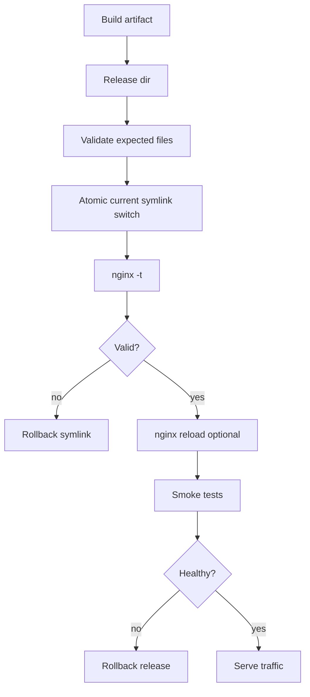
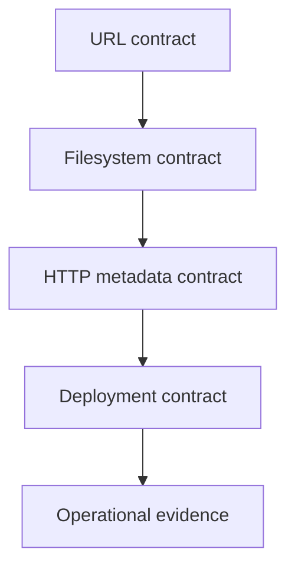

# Part 029 — Static Assets Production Lab: SPA/MPA dengan Cache dan Rollback Aman

Sekarang kita gabungkan semua konsep Phase 2 menjadi satu lab production-grade.

Tujuannya bukan sekadar membuat NGINX bisa menampilkan file HTML. Itu terlalu mudah. Tujuan lab ini adalah membuat static asset server yang punya kontrak jelas:

1. hashed assets boleh di-cache sangat lama;
2. HTML entrypoint tetap bisa berubah cepat;
3. SPA route tidak membuat API/error/static asset berubah menjadi `index.html` palsu;
4. hidden/source/build files tidak bocor;
5. compression tidak merusak correctness;
6. rollback bisa dilakukan tanpa menebak file mana yang sedang aktif;
7. smoke test bisa membuktikan behavior penting sebelum traffic nyata masuk.

Static asset serving adalah edge contract. Browser, CDN, service worker, API gateway, deployment system, dan incident team semuanya bergantung pada kontrak ini.

---

## 1. Target Arsitektur Lab

Kita akan membuat satu host:

```txt
app.example.test
```

dengan behavior:

```txt
/                         -> HTML entrypoint, no long cache
/dashboard                -> SPA fallback ke /index.html
/assets/app.abc123.js     -> immutable cache 1 tahun
/assets/app.abc123.css    -> immutable cache 1 tahun
/favicon.ico              -> short/static cache
/api/*                    -> tidak ditangani static server
/.git/config              -> ditolak
/config.json              -> ditolak kecuali memang public
/missing-asset.js         -> 404, bukan index.html
```

Kita juga akan memakai release directory:

```txt
/srv/www/app/releases/20260706-120000/public
/srv/www/app/releases/20260706-123000/public
/srv/www/app/current -> /srv/www/app/releases/20260706-123000/public
```

NGINX hanya melihat `current`. Deployment system mengubah symlink secara atomic, lalu menjalankan `nginx -t` dan reload jika perlu.



Important nuance: untuk static files, reload tidak selalu diperlukan jika path `current` tetap sama dan hanya symlink berubah. Tetapi reload tetap bisa diperlukan jika config, MIME map, snippets, TLS, log format, atau upstream boundary berubah. Lab ini menyiapkan keduanya.

---

## 2. Production Invariants

Sebelum menulis config, tetapkan invariant. Ini lebih penting dari snippet.

```txt
Invariant 1: HTML entrypoint must not be cached as immutable.
Invariant 2: Hashed assets must be immutable and safe to cache long-term.
Invariant 3: Missing assets must return 404, not index.html.
Invariant 4: SPA fallback only applies to navigation routes, not asset/API paths.
Invariant 5: Unknown host must not serve the application.
Invariant 6: Hidden/source/build metadata must not be publicly readable.
Invariant 7: Compression must vary by Accept-Encoding.
Invariant 8: Release switch must be reversible.
Invariant 9: Logs must show enough data to debug cache and fallback behavior.
Invariant 10: Smoke tests must cover both positive and negative routes.
```

If an invariant is not testable, it is a wish, not an operational rule.

---

## 3. Directory Layout

Create the lab layout:

```bash
sudo mkdir -p /srv/www/app/releases/20260706-120000/public/assets
sudo mkdir -p /srv/www/app/shared/logs
```

Example files:

```bash
cat <<'HTML' | sudo tee /srv/www/app/releases/20260706-120000/public/index.html
<!doctype html>
<html lang="en">
<head>
  <meta charset="utf-8">
  <title>NGINX Static Lab</title>
  <script type="module" src="/assets/app.abc123.js"></script>
  <link rel="stylesheet" href="/assets/app.abc123.css">
</head>
<body>
  <main id="app">Static Lab v1</main>
</body>
</html>
HTML

cat <<'JS' | sudo tee /srv/www/app/releases/20260706-120000/public/assets/app.abc123.js
console.log("static-lab-v1");
JS

cat <<'CSS' | sudo tee /srv/www/app/releases/20260706-120000/public/assets/app.abc123.css
body { font-family: system-ui, sans-serif; }
CSS
```

Create a dangerous file to prove blocking works:

```bash
sudo mkdir -p /srv/www/app/releases/20260706-120000/public/.git
sudo sh -c 'echo secret > /srv/www/app/releases/20260706-120000/public/.git/config'
sudo sh -c 'echo internal > /srv/www/app/releases/20260706-120000/public/config.json'
```

Point `current` to the release:

```bash
sudo ln -sfn /srv/www/app/releases/20260706-120000/public /srv/www/app/current
```

Permissions model:

```bash
sudo chown -R root:root /srv/www/app/releases
sudo find /srv/www/app/releases -type d -exec chmod 0755 {} \;
sudo find /srv/www/app/releases -type f -exec chmod 0644 {} \;
```

If your deployment agent writes the artifact, do not let the NGINX worker user own writable deployment directories. NGINX should read static artifacts, not mutate them.

Bad pattern:

```txt
nginx worker user owns /srv/www/app/current and deployment uploads there directly
```

Better pattern:

```txt
deployment user writes release dir
root/deployment process flips symlink
nginx worker only reads final artifact
```

---

## 4. Base `nginx.conf`

Use a minimal global config:

```nginx
user nginx;
worker_processes auto;

error_log /var/log/nginx/error.log warn;
pid /run/nginx.pid;

events {
    worker_connections 4096;
    multi_accept off;
}

http {
    include       /etc/nginx/mime.types;
    default_type  application/octet-stream;

    log_format static_lab escape=json
      '{'
        '"ts":"$time_iso8601",'
        '"remote_addr":"$remote_addr",'
        '"host":"$host",'
        '"request":"$request",'
        '"status":$status,'
        '"bytes_sent":$bytes_sent,'
        '"request_time":$request_time,'
        '"uri":"$uri",'
        '"request_uri":"$request_uri",'
        '"sent_content_type":"$sent_http_content_type",'
        '"sent_cache_control":"$sent_http_cache_control",'
        '"sent_etag":"$sent_http_etag",'
        '"http_accept_encoding":"$http_accept_encoding",'
        '"gzip_ratio":"$gzip_ratio"'
      '}';

    access_log /var/log/nginx/access.log static_lab;

    sendfile on;
    tcp_nopush on;
    tcp_nodelay on;

    keepalive_timeout 65s;
    types_hash_max_size 4096;

    gzip on;
    gzip_vary on;
    gzip_proxied any;
    gzip_min_length 1024;
    gzip_types
        text/plain
        text/css
        text/xml
        application/json
        application/javascript
        application/xml
        image/svg+xml;

    include /etc/nginx/conf.d/*.conf;
}
```

Why these choices?

| Setting | Why it exists |
|---|---|
| `include mime.types` | prevent JS/CSS/SVG from being served as generic binary |
| `default_type application/octet-stream` | safer fallback than `text/plain` for unknown files |
| JSON-ish access log | makes routing/cache debugging queryable |
| `sendfile on` | efficient kernel-assisted static file transfer |
| `gzip_vary on` | tells caches that response depends on `Accept-Encoding` |
| `gzip_min_length` | avoid wasting CPU on tiny responses |

The config is intentionally boring. Production NGINX should be boring until the domain forces complexity.

---

## 5. Default Server Sinkhole

Never let unknown hosts fall into the app by accident.

Create `/etc/nginx/conf.d/00-default-sinkhole.conf`:

```nginx
server {
    listen 80 default_server;
    server_name _;

    access_log /var/log/nginx/default-sinkhole.access.log static_lab;

    return 444;
}
```

For a public-facing HTTP server, you may prefer a normal `404` or `421` depending on operational needs. `444` is an NGINX-specific behavior that closes the connection without sending a response. It is useful in controlled environments, but can confuse some monitors and load balancers.

Decision rule:

```txt
Use 404/421 if external clients, monitors, or compliance evidence need explicit responses.
Use 444 only when silent drop is intentional and understood.
```

---

## 6. Static App Server Config

Create `/etc/nginx/conf.d/app-static.conf`:

```nginx
server {
    listen 80;
    server_name app.example.test;

    root /srv/www/app/current;
    index index.html;

    access_log /srv/www/app/shared/logs/access.log static_lab;
    error_log  /srv/www/app/shared/logs/error.log warn;

    # Security: never serve hidden files or common source/build metadata.
    location ~ (^|/)\. {
        return 404;
    }

    location ~* \.(?:bak|backup|old|orig|swp|tmp|log|sql|env|ini|conf|yml|yaml|toml|lock)$ {
        return 404;
    }

    location = /config.json {
        return 404;
    }

    location = /index.html {
        add_header Cache-Control "no-cache, no-store, must-revalidate" always;
        add_header Pragma "no-cache" always;
        add_header Expires "0" always;
        try_files /index.html =404;
    }

    location = / {
        add_header Cache-Control "no-cache, no-store, must-revalidate" always;
        try_files /index.html =404;
    }

    location ^~ /assets/ {
        access_log /srv/www/app/shared/logs/assets.access.log static_lab;
        add_header Cache-Control "public, max-age=31536000, immutable" always;
        add_header X-Content-Type-Options "nosniff" always;
        try_files $uri =404;
    }

    location = /favicon.ico {
        add_header Cache-Control "public, max-age=86400" always;
        try_files $uri =204;
    }

    location = /robots.txt {
        add_header Cache-Control "public, max-age=300" always;
        try_files $uri =404;
    }

    # Static asset extensions outside /assets/ should not silently fall back to SPA.
    location ~* \.(?:js|mjs|css|map|json|png|jpg|jpeg|gif|webp|avif|svg|ico|woff2?|ttf|eot)$ {
        add_header Cache-Control "public, max-age=300" always;
        add_header X-Content-Type-Options "nosniff" always;
        try_files $uri =404;
    }

    # Placeholder boundary. This static server must not pretend to own API routes.
    location ^~ /api/ {
        return 404;
    }

    # SPA navigation fallback.
    location / {
        add_header Cache-Control "no-cache, no-store, must-revalidate" always;
        try_files $uri $uri/ /index.html;
    }
}
```

This config has a deliberate ordering strategy:

1. exact and regex deny rules protect hidden/source files;
2. exact `index.html` and `/` define HTML cache behavior;
3. `^~ /assets/` protects immutable asset semantics from regex override;
4. static extension regex prevents missing assets from becoming `index.html`;
5. `/api/` is explicitly out of scope;
6. final `location /` handles SPA navigation only.

The most important line for SPA correctness is not the fallback itself. It is this guard:

```nginx
location ~* \.(?:js|mjs|css|map|json|png|jpg|jpeg|gif|webp|avif|svg|ico|woff2?|ttf|eot)$ {
    try_files $uri =404;
}
```

Without it, `/assets/missing.js` or `/some/missing.css` can return HTML with status 200. That causes broken browser behavior, misleading monitoring, and sometimes security confusion.

---

## 7. Why `/assets/` Gets Long Cache and HTML Does Not

Hashed asset URLs are content-addressed by convention:

```txt
/assets/app.abc123.js
```

If content changes, filename changes. That makes long cache safe.

HTML is not content-addressed in the same way:

```txt
/index.html
/
/dashboard
```

HTML usually points to the current asset graph. If HTML is cached for a year, users can be pinned to old JS/CSS references long after deployment.

Correct contract:

| Resource | Cache policy |
|---|---|
| `/assets/app.<hash>.js` | `public, max-age=31536000, immutable` |
| `/assets/app.<hash>.css` | `public, max-age=31536000, immutable` |
| `/index.html` | `no-cache` or `no-store` depending risk |
| SPA route `/dashboard` | same as HTML entrypoint |
| `favicon.ico` | short cache unless content-addressed |
| `robots.txt` | short cache |

Subtlety: `no-cache` does not mean “do not store”. It means stored responses must be revalidated before reuse. `no-store` means do not store. For highly dynamic HTML entrypoints with auth-sensitive bootstrap data, prefer `no-store`. For public HTML shells, `no-cache` is often enough.

This lab uses conservative HTML behavior:

```nginx
Cache-Control: no-cache, no-store, must-revalidate
```

In a real product, you might relax this to:

```nginx
Cache-Control: no-cache
```

But only after confirming the HTML shell contains no sensitive user-specific content.

---

## 8. Precompressed Assets Optional Variant

If your build pipeline creates `.gz` files:

```bash
gzip -k -9 /srv/www/app/releases/20260706-120000/public/assets/app.abc123.js
```

and NGINX has `ngx_http_gzip_static_module`, you can use:

```nginx
gzip_static on;
```

Recommended placement:

```nginx
http {
    gzip on;
    gzip_vary on;
    gzip_static on;
}
```

But do not assume this module is always available. Validate:

```bash
nginx -V 2>&1 | grep -o -- '--with-http_gzip_static_module' || true
```

Operational invariant:

```txt
If precompressed files are used, the release artifact must contain both original and compressed files, unless the server is intentionally configured to serve only compressed variants.
```

Why keep originals?

1. some clients do not send `Accept-Encoding: gzip`;
2. troubleshooting is simpler;
3. content-type detection remains straightforward;
4. partial/range behavior is less surprising;
5. fallback behavior is safer.

---

## 9. Optional Stronger Asset Hash Enforcement

The previous config assumes assets under `/assets/` are hashed. You can harden this by splitting hashed and un-hashed assets.

Example convention:

```txt
/assets/app.abc123def456.js
/assets/app.abc123def456.css
```

Config:

```nginx
location ~* ^/assets/.+\.[0-9a-f]{8,}\.(?:js|mjs|css|png|jpg|jpeg|webp|avif|svg|woff2?)$ {
    add_header Cache-Control "public, max-age=31536000, immutable" always;
    add_header X-Content-Type-Options "nosniff" always;
    try_files $uri =404;
}

location ^~ /assets/ {
    add_header Cache-Control "public, max-age=300" always;
    add_header X-Content-Type-Options "nosniff" always;
    try_files $uri =404;
}
```

This prevents accidentally caching unversioned files for one year.

Trade-off:

| Approach | Benefit | Cost |
|---|---|---|
| all `/assets/` immutable | simple | relies on build discipline |
| hash-regex immutable | safer | regex complexity and naming constraint |
| manifest-generated exact config | strongest | requires build/config integration |

For mature platforms, manifest-generated cache rules are often best:

```txt
build manifest -> config generator -> exact locations/cache policy -> nginx -t -> deploy
```

---

## 10. Build Manifest Contract

A serious static deployment should produce a manifest:

```json
{
  "release": "20260706-120000",
  "entrypoints": ["/index.html"],
  "immutableAssets": [
    "/assets/app.abc123.js",
    "/assets/app.abc123.css"
  ],
  "publicShortCache": [
    "/favicon.ico",
    "/robots.txt"
  ],
  "forbiddenPatterns": [
    ".git/",
    ".env",
    "*.map"
  ]
}
```

Then CI checks:

```bash
test -f public/index.html
find public -path '*/.git/*' -o -name '.env' -o -name '*.pem' | tee /tmp/forbidden.txt
if [ -s /tmp/forbidden.txt ]; then
  echo "Forbidden files found"
  exit 1
fi
```

The best NGINX config is the one that does not need to rescue a broken artifact. Defense in depth still matters, but CI should reject bad releases before NGINX ever sees them.

---

## 11. Smoke Test Script

Create `smoke-static.sh`:

```bash
#!/usr/bin/env bash
set -euo pipefail

BASE="http://127.0.0.1"
HOST="app.example.test"

request() {
  local path="$1"
  curl -sS -D - -o /tmp/nginx-smoke-body \
    -H "Host: ${HOST}" \
    "${BASE}${path}"
}

assert_status() {
  local path="$1"
  local expected="$2"
  local status
  status=$(curl -sS -o /dev/null -w '%{http_code}' -H "Host: ${HOST}" "${BASE}${path}")
  if [ "$status" != "$expected" ]; then
    echo "FAIL ${path}: expected ${expected}, got ${status}"
    exit 1
  fi
  echo "OK ${path}: ${status}"
}

assert_header_contains() {
  local path="$1"
  local header="$2"
  local expected="$3"
  local headers
  headers=$(curl -sS -D - -o /dev/null -H "Host: ${HOST}" "${BASE}${path}")
  if ! printf '%s' "$headers" | tr -d '\r' | grep -i "^${header}: .*${expected}" >/dev/null; then
    echo "FAIL ${path}: missing ${header} containing ${expected}"
    printf '%s\n' "$headers"
    exit 1
  fi
  echo "OK ${path}: ${header} contains ${expected}"
}

assert_status / 200
assert_status /index.html 200
assert_status /dashboard 200
assert_status /assets/app.abc123.js 200
assert_status /assets/missing.js 404
assert_status /api/users 404
assert_status /.git/config 404
assert_status /config.json 404

assert_header_contains /index.html Cache-Control "no-cache"
assert_header_contains /dashboard Cache-Control "no-cache"
assert_header_contains /assets/app.abc123.js Cache-Control "immutable"
assert_header_contains /assets/app.abc123.js X-Content-Type-Options "nosniff"

echo "Static smoke tests passed"
```

Run:

```bash
chmod +x smoke-static.sh
./smoke-static.sh
```

This script tests the contract, not just availability.

Bad smoke test:

```bash
curl http://app.example.test
```

Good smoke test:

```txt
positive routes + negative routes + cache headers + host behavior + forbidden files
```

---

## 12. Unknown Host Test

Add a smoke test for default server:

```bash
status=$(curl -sS -o /dev/null -w '%{http_code}' -H 'Host: unknown.example.test' http://127.0.0.1/ || true)
echo "unknown host status: ${status}"
```

If you used `return 444`, curl may show status `000` because the connection is closed without a response.

For CI environments, you may prefer default server `return 404;` because it is easier to assert.

Example test-friendly default:

```nginx
server {
    listen 80 default_server;
    server_name _;
    return 404;
}
```

Production decision depends on environment, but the invariant does not change:

```txt
Unknown host must not serve the application.
```

---

## 13. Deployment Script with Atomic Symlink

Example `deploy-static-release.sh`:

```bash
#!/usr/bin/env bash
set -euo pipefail

APP_ROOT="/srv/www/app"
RELEASE_ID="${1:?release id required}"
RELEASE_DIR="${APP_ROOT}/releases/${RELEASE_ID}/public"
CURRENT_LINK="${APP_ROOT}/current"
PREVIOUS_TARGET="$(readlink -f "${CURRENT_LINK}" || true)"

if [ ! -f "${RELEASE_DIR}/index.html" ]; then
  echo "Missing index.html in ${RELEASE_DIR}"
  exit 1
fi

for forbidden in '.git' '.env' 'id_rsa' 'server.key'; do
  if find "${RELEASE_DIR}" -name "${forbidden}" | grep -q .; then
    echo "Forbidden artifact found: ${forbidden}"
    exit 1
  fi
done

ln -sfn "${RELEASE_DIR}" "${CURRENT_LINK}.next"
mv -Tf "${CURRENT_LINK}.next" "${CURRENT_LINK}"

if ! nginx -t; then
  echo "nginx -t failed; rolling back symlink"
  if [ -n "${PREVIOUS_TARGET}" ]; then
    ln -sfn "${PREVIOUS_TARGET}" "${CURRENT_LINK}.rollback"
    mv -Tf "${CURRENT_LINK}.rollback" "${CURRENT_LINK}"
  fi
  exit 1
fi

# Optional. Needed only if config changed. Harmless if your reload discipline requires it.
nginx -s reload

if ! ./smoke-static.sh; then
  echo "smoke test failed; rolling back"
  if [ -n "${PREVIOUS_TARGET}" ]; then
    ln -sfn "${PREVIOUS_TARGET}" "${CURRENT_LINK}.rollback"
    mv -Tf "${CURRENT_LINK}.rollback" "${CURRENT_LINK}"
    nginx -s reload || true
  fi
  exit 1
fi

echo "deployed ${RELEASE_ID}"
```

This script is intentionally simple. In a real platform, deployment metadata, owner, commit SHA, build URL, and artifact checksum should be recorded.

Example release metadata:

```json
{
  "releaseId": "20260706-120000",
  "gitSha": "abc123def456",
  "buildUrl": "https://ci.example/build/1234",
  "deployedBy": "deploy-bot",
  "deployedAt": "2026-07-06T12:00:00+07:00"
}
```

Serve this metadata publicly only if your security policy allows it. Otherwise store it outside document root and include the release ID only in logs.

---

## 14. Rollback Drill

Create second release:

```bash
sudo mkdir -p /srv/www/app/releases/20260706-123000/public/assets
sudo cp -a /srv/www/app/releases/20260706-120000/public/. /srv/www/app/releases/20260706-123000/public/
sudo sed -i 's/Static Lab v1/Static Lab v2/' /srv/www/app/releases/20260706-123000/public/index.html
```

Deploy:

```bash
sudo ./deploy-static-release.sh 20260706-123000
```

Then rollback manually:

```bash
sudo ln -sfn /srv/www/app/releases/20260706-120000/public /srv/www/app/current.rollback
sudo mv -Tf /srv/www/app/current.rollback /srv/www/app/current
sudo nginx -t
sudo nginx -s reload
./smoke-static.sh
```

Rollback invariant:

```txt
Rollback must restore both file content and edge contract.
```

That means rollback testing must include headers and negative cases, not just HTML body.

---

## 15. Failure Injection Matrix

Use failure injection to prove the config fails safely.

| Injection | Expected result | Why |
|---|---|---|
| delete `/assets/app.abc123.js` | 404 | missing assets must not become HTML |
| request `/.git/config` | 404 | hidden files blocked |
| request `/config.json` | 404 | sensitive config blocked |
| request `/dashboard` | 200 HTML | SPA route fallback works |
| request `/api/users` | 404 | static server does not own API |
| unknown host | 404/444 | default server sinkhole |
| wrong MIME extension | `application/octet-stream` or defined type | avoid misleading content type |
| large asset | served efficiently | sendfile/static path works |
| compressed request | `Vary: Accept-Encoding` | cache correctness |

Example injection:

```bash
sudo mv /srv/www/app/current/assets/app.abc123.js /srv/www/app/current/assets/app.abc123.js.broken
./smoke-static.sh || echo "expected failure detected"
sudo mv /srv/www/app/current/assets/app.abc123.js.broken /srv/www/app/current/assets/app.abc123.js
```

This is not busywork. It proves your test suite catches dangerous regressions.

---

## 16. Debugging Static Asset Incidents

### 16.1 Symptom: JavaScript MIME error in browser

Browser says:

```txt
Refused to execute script because its MIME type is text/html
```

Likely cause:

```txt
missing JS asset returned index.html due to SPA fallback
```

Check:

```bash
curl -i -H 'Host: app.example.test' http://127.0.0.1/assets/app.missing.js
```

Expected:

```txt
HTTP/1.1 404 Not Found
```

Bad:

```txt
HTTP/1.1 200 OK
Content-Type: text/html
```

Fix:

```nginx
location ~* \.(?:js|mjs|css|map|json|png|jpg|jpeg|gif|webp|avif|svg|ico|woff2?|ttf|eot)$ {
    try_files $uri =404;
}
```

### 16.2 Symptom: Users stuck on old UI

Likely causes:

1. `index.html` cached too long;
2. CDN/browser cached HTML despite deployment;
3. service worker caching old shell;
4. asset filenames not content-hashed;
5. rollback/deploy mixed old HTML with new assets.

Check:

```bash
curl -I -H 'Host: app.example.test' http://127.0.0.1/index.html
curl -I -H 'Host: app.example.test' http://127.0.0.1/assets/app.abc123.js
```

Expected:

```txt
index.html: no-cache/no-store or short revalidation
asset: immutable long cache
```

### 16.3 Symptom: Source maps exposed

Source maps are not automatically bad, but they can expose source structure, comments, internal endpoint names, and sometimes secrets if your build pipeline is broken.

Decision rule:

```txt
Serve source maps publicly only if security/product explicitly accepts it.
```

Block by default:

```nginx
location ~* \.map$ {
    return 404;
}
```

Or allow only behind VPN/internal host.

### 16.4 Symptom: Wrong tenant/app served

Check host selection:

```bash
curl -i -H 'Host: app.example.test' http://127.0.0.1/
curl -i -H 'Host: unknown.example.test' http://127.0.0.1/
```

Look at logs:

```bash
jq . /srv/www/app/shared/logs/access.log | tail
```

If unknown hosts serve the app, your default server or `server_name` strategy is wrong.

---

## 17. Observability Fields That Matter

For static asset incidents, these fields are high-value:

| Field | Use |
|---|---|
| `$host` | host routing and tenant isolation |
| `$uri` | normalized internal URI after rewrite/internal redirect |
| `$request_uri` | original URI including query string |
| `$status` | fallback/404 behavior |
| `$sent_http_content_type` | MIME debugging |
| `$sent_http_cache_control` | browser cache contract |
| `$sent_http_etag` | validator debugging |
| `$gzip_ratio` | compression visibility |
| `$request_time` | slow static file/disk pressure investigation |

Do not rely only on HTTP status. A broken SPA fallback often returns `200` with the wrong content type.

A better query is:

```txt
status=200 AND uri endsWith .js AND content_type contains text/html
```

That pattern almost always indicates fallback leakage.

---

## 18. Security Review Checklist

```txt
[ ] default_server does not serve app
[ ] hidden dotfiles denied
[ ] VCS directories denied
[ ] backup/temp/env/config files denied
[ ] source maps policy explicit
[ ] /api/ not accidentally handled by static fallback
[ ] missing static extensions return 404
[ ] index.html not immutable cached
[ ] hashed assets immutable cached
[ ] X-Content-Type-Options nosniff on script/style/font assets
[ ] MIME types loaded from known file
[ ] no writable upload directory under static root
[ ] symlink policy understood
[ ] release directory immutable after deploy
[ ] smoke tests cover negative cases
[ ] rollback tested
```

Security is not a single header. It is the combination of artifact hygiene, location matching, cache policy, and deployment discipline.

---

## 19. Production Variants

### 19.1 Static site behind CDN

If CDN sits in front of NGINX:

```txt
client -> CDN -> NGINX -> filesystem
```

Then NGINX becomes origin. Your headers become CDN policy inputs.

Rules:

1. set origin cache headers deliberately;
2. avoid caching HTML long unless content-addressed;
3. include `Vary: Accept-Encoding` when compression variants exist;
4. purge/invalidate only when necessary;
5. use immutable assets to reduce purge dependence.

### 19.2 Static shell + API backend

For a real app:

```nginx
location ^~ /api/ {
    proxy_pass http://api_backend;
}

location / {
    try_files $uri $uri/ /index.html;
}
```

But do not add this blindly in this lab. Reverse proxy semantics begin in Part 030 onward. For now, the point is that `/api/` must not accidentally fall into static SPA behavior.

### 19.3 Multiple apps under one domain

Example:

```txt
/admin/     -> admin SPA
/console/   -> console SPA
/docs/      -> static docs
```

This is possible, but it increases risk:

1. path rewriting mistakes;
2. service worker scope overlap;
3. relative asset path bugs;
4. cache policy collisions;
5. auth boundary confusion.

Prefer separate hosts for unrelated apps:

```txt
admin.example.com
console.example.com
docs.example.com
```

Path-based composition should be a deliberate product/platform choice, not the default.

---

## 20. Minimal Final Config

For reference, the core server block is:

```nginx
server {
    listen 80;
    server_name app.example.test;

    root /srv/www/app/current;
    index index.html;

    location ~ (^|/)\. { return 404; }
    location ~* \.(?:bak|backup|old|orig|swp|tmp|log|sql|env|ini|conf|yml|yaml|toml|lock)$ { return 404; }
    location = /config.json { return 404; }

    location = /index.html {
        add_header Cache-Control "no-cache, no-store, must-revalidate" always;
        try_files /index.html =404;
    }

    location = / {
        add_header Cache-Control "no-cache, no-store, must-revalidate" always;
        try_files /index.html =404;
    }

    location ^~ /assets/ {
        add_header Cache-Control "public, max-age=31536000, immutable" always;
        add_header X-Content-Type-Options "nosniff" always;
        try_files $uri =404;
    }

    location ~* \.(?:js|mjs|css|map|json|png|jpg|jpeg|gif|webp|avif|svg|ico|woff2?|ttf|eot)$ {
        add_header Cache-Control "public, max-age=300" always;
        add_header X-Content-Type-Options "nosniff" always;
        try_files $uri =404;
    }

    location ^~ /api/ { return 404; }

    location / {
        add_header Cache-Control "no-cache, no-store, must-revalidate" always;
        try_files $uri $uri/ /index.html;
    }
}
```

This config is not universal. It is a baseline. Change it only after naming the invariant you are changing.

---

## 21. Common Mistakes

### Mistake 1: One catch-all SPA fallback for everything

Bad:

```nginx
location / {
    try_files $uri /index.html;
}
```

Why bad:

```txt
/assets/missing.js -> 200 index.html
/api/users -> 200 index.html
/favicon.ico -> 200 index.html
```

### Mistake 2: Long cache on all files

Bad:

```nginx
add_header Cache-Control "public, max-age=31536000, immutable" always;
```

at `server` level.

This can cache `index.html` too long.

### Mistake 3: Relying on NGINX to hide bad artifacts

Bad:

```txt
Build includes .env, .git, source maps, test fixtures, and internal docs.
NGINX blocks some patterns.
Team calls it secure.
```

NGINX hardening is a final guardrail, not an artifact quality system.

### Mistake 4: No unknown-host behavior

If the first server block serves the app and also becomes implicit default, unknown hosts may serve the app.

### Mistake 5: No rollback drill

A rollback plan that has never been executed is not a rollback plan. It is documentation.

---

## 22. Mental Model Recap

Static asset serving has four contracts:



URL contract:

```txt
Which paths exist? Which paths fallback? Which paths must never fallback?
```

Filesystem contract:

```txt
Which release is active? Which files are readable? Which files are forbidden?
```

HTTP metadata contract:

```txt
Which content type? Which cache policy? Which validators? Which security headers?
```

Deployment contract:

```txt
Can we switch release atomically? Can we test? Can we rollback?
```

Operational evidence:

```txt
Can logs prove what happened after an incident?
```

Top 1% NGINX usage is not memorizing directives. It is turning these contracts into deterministic behavior.

---

## 23. Key Takeaways

1. Static serving is a public filesystem API with HTTP metadata.
2. SPA fallback must be scoped; missing assets must not return HTML.
3. HTML and hashed assets need different cache policies.
4. Unknown hosts must not serve your app.
5. Hidden/source/build artifacts should be blocked in both CI and NGINX.
6. Release directories plus atomic symlink switching make rollback simple.
7. Smoke tests must include negative cases and headers.
8. Logs should expose URI, request URI, status, content type, cache-control, and compression behavior.
9. A production static config is not a snippet; it is a contract enforced by config, CI, deployment, and tests.

---

## 24. Referensi

- F5 NGINX Documentation — Serving Static Content: https://docs.nginx.com/nginx/admin-guide/web-server/serving-static-content/
- NGINX Documentation — `ngx_http_core_module`: https://nginx.org/en/docs/http/ngx_http_core_module.html
- NGINX Documentation — `ngx_http_gzip_module`: https://nginx.org/en/docs/http/ngx_http_gzip_module.html
- NGINX Documentation — `ngx_http_gzip_static_module`: https://nginx.org/en/docs/http/ngx_http_gzip_static_module.html
- NGINX Documentation — `ngx_http_headers_module`: https://nginx.org/en/docs/http/ngx_http_headers_module.html
- NGINX Documentation — Controlling nginx: https://nginx.org/en/docs/control.html
