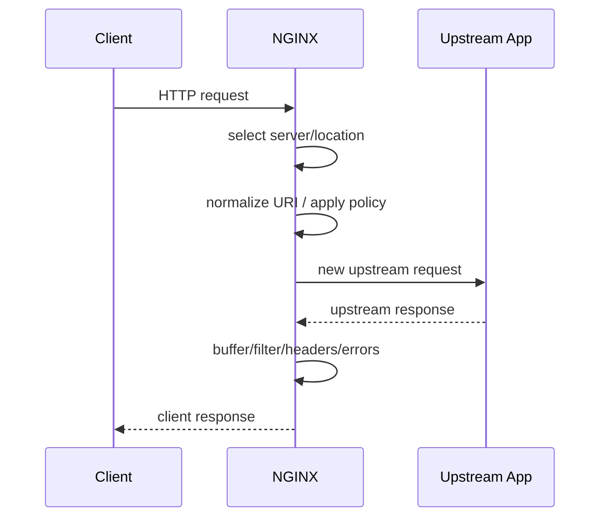
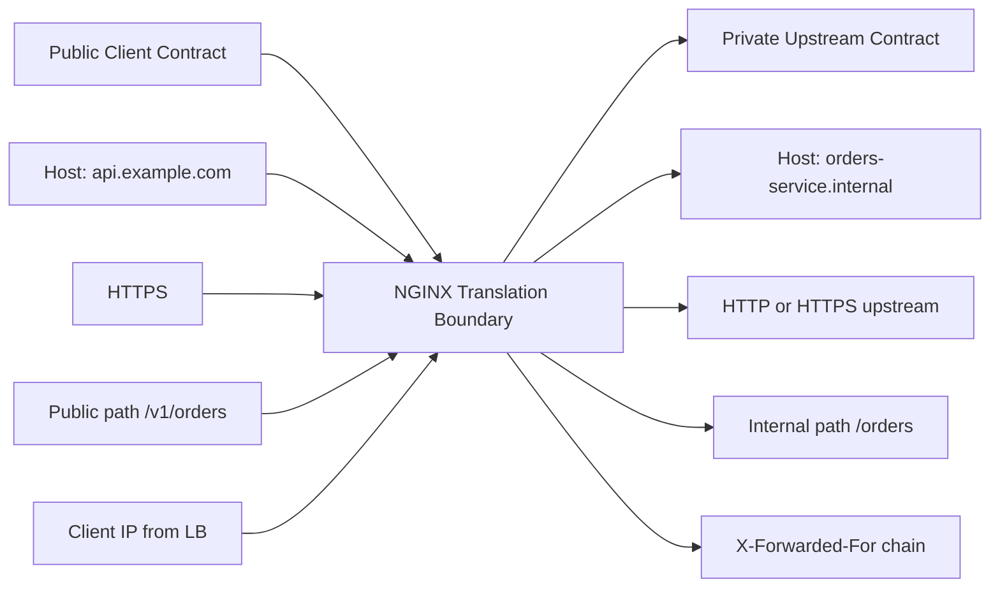
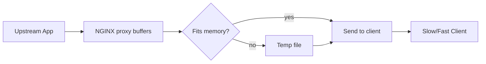
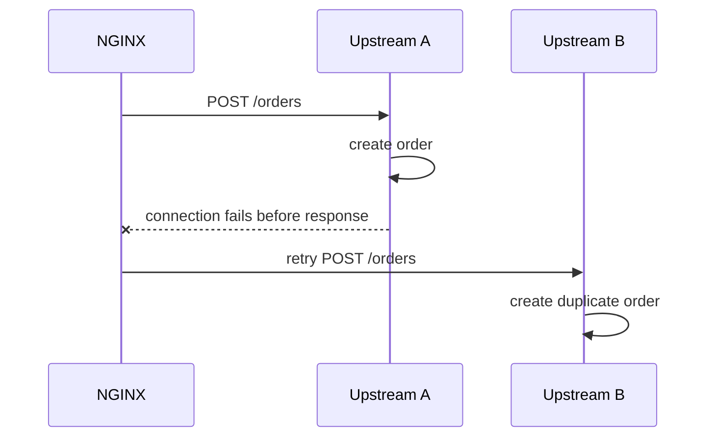
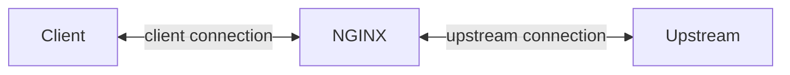

# Part 030 — Reverse Proxy Mental Model: Client Contract vs Upstream Contract

Reverse proxy adalah titik ketika NGINX berhenti menjadi “server file” dan mulai menjadi **traffic mediator**.

Client tidak lagi langsung berbicara dengan application server. Client berbicara dengan NGINX. NGINX lalu membuat request baru ke upstream.

Itu berarti ada dua kontrak berbeda:

```txt
Client <-> NGINX contract
NGINX <-> Upstream contract
```

Banyak incident reverse proxy terjadi karena engineer menganggap dua kontrak ini sama.

Contoh asumsi salah:

```txt
Client mengirim Host: api.example.com
Maka upstream pasti menerima Host: api.example.com
```

Belum tentu.

```txt
Client timeout 60s
Maka upstream timeout juga 60s
```

Belum tentu.

```txt
Client IP adalah $remote_addr
Maka aplikasi pasti tahu IP client asli
```

Belum tentu.

```txt
NGINX hanya meneruskan request apa adanya
```

Salah. NGINX bisa mengubah URI, header, body buffering, connection behavior, timeout, retry, protocol, compression, cache behavior, dan error response.

Reverse proxy bukan pipa transparan. Reverse proxy adalah **boundary**.

---

## 1. Apa yang Berubah Saat NGINX Menjadi Reverse Proxy

Static server flow:

```txt
client request -> NGINX location -> filesystem -> response
```

Reverse proxy flow:

```txt
client request -> NGINX location -> proxy request -> upstream -> proxy response -> client response
```

Diagram:



The phrase “new upstream request” matters. NGINX is not merely passing bytes in HTTP reverse proxy mode. It is receiving an HTTP request from the client and producing another HTTP request to the upstream.

This creates ownership questions:

| Concern | Owner |
|---|---|
| public hostnames | NGINX/platform edge |
| TLS termination | NGINX/platform edge unless passthrough |
| client IP trust | NGINX + infrastructure chain |
| public routing | NGINX/API gateway/platform |
| business authorization | application/auth service |
| upstream timeout budget | NGINX + app team |
| retry safety | NGINX + app team |
| response body semantics | application |
| response header exposure | both NGINX and application |
| overload behavior | both NGINX and application |

Reverse proxy design is mostly boundary design.

---

## 2. Core `proxy_pass` Shape

A minimal reverse proxy:

```nginx
upstream app_backend {
    server 127.0.0.1:8080;
}

server {
    listen 80;
    server_name app.example.test;

    location / {
        proxy_pass http://app_backend;
    }
}
```

This is enough to work. It is not enough to be production-ready.

Production reverse proxy must answer:

1. what host header should upstream see?
2. how is client IP represented?
3. what timeout budget applies?
4. are request bodies buffered?
5. are responses buffered?
6. can NGINX retry?
7. which methods are safe to retry?
8. what happens on 502/504?
9. how are upstream latency and status logged?
10. what is the public route contract?

The minimal config hides all of these choices behind defaults.

---

## 3. Reverse Proxy as Contract Translation

Think of NGINX as a translator between two worlds.



Translation dimensions:

| Dimension | Example |
|---|---|
| protocol | HTTPS client → HTTP upstream |
| host | public host → internal service name |
| URI | `/api/orders` → `/orders` |
| headers | add/remove/normalize forwarding headers |
| body | buffer upload before upstream receives it |
| response | hide upstream headers, add security headers |
| errors | map upstream failure to branded or generic error |
| connection | client keepalive independent from upstream keepalive |
| timeout | client-facing and upstream-facing budgets differ |

Top-tier NGINX configs make translation explicit.

---

## 4. The First Production Reverse Proxy Baseline

Baseline snippet:

```nginx
upstream app_backend {
    server 127.0.0.1:8080;
    keepalive 32;
}

server {
    listen 80;
    server_name app.example.test;

    access_log /var/log/nginx/app.access.log main;
    error_log  /var/log/nginx/app.error.log warn;

    location / {
        proxy_http_version 1.1;

        proxy_set_header Host $host;
        proxy_set_header X-Real-IP $remote_addr;
        proxy_set_header X-Forwarded-For $proxy_add_x_forwarded_for;
        proxy_set_header X-Forwarded-Proto $scheme;
        proxy_set_header X-Forwarded-Host $host;
        proxy_set_header X-Forwarded-Port $server_port;

        proxy_connect_timeout 3s;
        proxy_send_timeout 30s;
        proxy_read_timeout 30s;

        proxy_pass http://app_backend;
    }
}
```

This is still not universal, but it makes several assumptions visible.

Important details:

| Directive | Meaning |
|---|---|
| `proxy_http_version 1.1` | enables HTTP/1.1 upstream behavior, needed for upstream keepalive/WebSocket patterns |
| `Host $host` | upstream sees normalized host chosen by NGINX variable |
| `X-Real-IP` | single client IP as NGINX sees it |
| `X-Forwarded-For` | append client IP to forwarding chain |
| `X-Forwarded-Proto` | preserve original public scheme |
| `proxy_connect_timeout` | time to connect to upstream |
| `proxy_send_timeout` | time while sending request to upstream |
| `proxy_read_timeout` | time while reading response from upstream |
| `proxy_pass` | upstream target |

Do not cargo-cult this into every system. Use it as the first explicit baseline.

---

## 5. Client Contract vs Upstream Contract

### 5.1 Client contract

The client contract includes:

```txt
public DNS name
public TLS certificate
public paths
allowed methods
request size limit
browser CORS behavior
public cache headers
error response style
rate limit behavior
```

Example:

```txt
GET https://api.example.com/v1/orders/123
Authorization: Bearer ...
```

The client expects:

```txt
stable public hostname
stable public route
correct HTTPS identity
predictable status codes
safe errors
```

### 5.2 Upstream contract

The upstream contract includes:

```txt
internal service DNS/IP
internal protocol
internal path
headers that carry original client context
timeout expectations
retry/idempotency rules
load balancing behavior
health/failure semantics
```

Example:

```txt
GET http://orders-service.internal:8080/orders/123
Host: api.example.com
X-Forwarded-For: 203.0.113.10
X-Forwarded-Proto: https
```

The upstream expects:

```txt
trusted proxy headers
bounded request sizes
timeouts matching application behavior
no unsafe duplicate writes
correct route rewrite
```

If these two contracts are not documented separately, production debugging becomes guesswork.

---

## 6. Trust Boundary: The Most Important Reverse Proxy Concept

Forwarded headers are not facts. They are claims.

A client can send:

```http
X-Forwarded-For: 1.2.3.4
X-Forwarded-Proto: https
```

If NGINX blindly forwards or app blindly trusts those headers, the client can spoof request context.

The safe model:

```txt
Only trusted infrastructure may define/append forwarding headers.
Application trusts forwarding headers only from known proxy path.
```

Common chain:

```txt
client -> cloud load balancer -> NGINX -> app
```

At NGINX:

```txt
$remote_addr = load balancer IP, unless real_ip module is configured
$proxy_add_x_forwarded_for = prior XFF chain + current $remote_addr
```

This means `X-Forwarded-For` can contain multiple addresses:

```txt
client, proxy1, proxy2
```

The application must know which side of the chain is trusted. Many frameworks have settings like “trust proxy” or “forwarded header filter”. Misconfiguring them creates auth, audit, redirect, and rate-limit bugs.

Reverse proxy invariant:

```txt
Do not use forwarded headers for security decisions unless the entire proxy trust chain is explicit.
```

We will go deeper in Part 032.

---

## 7. URI Translation: The Sharp Edge of `proxy_pass`

`proxy_pass` URI behavior is one of the most common NGINX footguns.

Two configs that look similar can produce different upstream URIs.

Example A:

```nginx
location /api/ {
    proxy_pass http://backend;
}
```

Request:

```txt
/api/orders/123
```

Upstream receives roughly:

```txt
/api/orders/123
```

Example B:

```nginx
location /api/ {
    proxy_pass http://backend/;
}
```

Request:

```txt
/api/orders/123
```

Upstream receives roughly:

```txt
/orders/123
```

The trailing slash changes whether the matching location prefix is replaced.

This is not syntax trivia. It defines whether NGINX is preserving public route structure or translating it to internal route structure.

Mental model:

```txt
proxy_pass without URI  -> pass normalized URI mostly as-is
proxy_pass with URI     -> replace matching location prefix with proxy_pass URI
```

Part 031 is dedicated to this because production bugs here are expensive.

---

## 8. Buffering: Is NGINX a Pipe or a Shock Absorber?

By default, NGINX often behaves like a shock absorber rather than a pure pipe.

Response buffering model:

```txt
upstream response -> NGINX buffers/temp files -> client response
```

Why buffering helps:

1. upstream can finish quickly even if client is slow;
2. NGINX protects upstream from slow client connections;
3. NGINX can manage disk/memory buffering;
4. upstream connection can be reused sooner;
5. client network slowness does not always pin app worker/thread.

Why buffering can hurt:

1. streaming responses are delayed;
2. SSE can break or feel stuck;
3. large responses can pressure disk temp paths;
4. latency profile can be misleading;
5. backpressure semantics may not match application expectations.

Simplified diagram:



For regular JSON/HTML/API responses, buffering is usually useful.

For streaming:

```nginx
proxy_buffering off;
```

But do not set it globally without thinking. Turning off buffering can expose upstream services to slow clients.

Production question:

```txt
Should NGINX absorb slow client behavior, or should upstream directly experience it?
```

There is no universal answer. There is only a correct answer for a specific endpoint class.

---

## 9. Timeout Budget: Reverse Proxy as Failure Boundary

Timeouts are not random numbers. They encode how long each layer is willing to wait.

Core upstream timeout categories:

```nginx
proxy_connect_timeout 3s;
proxy_send_timeout 30s;
proxy_read_timeout 30s;
```

Meaning:

| Timeout | What it bounds |
|---|---|
| connect | TCP connection establishment to upstream |
| send | sending request to upstream |
| read | reading response from upstream between read operations |

Bad config:

```nginx
proxy_read_timeout 300s;
```

without knowing whether endpoint is synchronous, streaming, long-polling, or broken.

Timeout design starts from endpoint class:

| Endpoint class | Example | Timeout posture |
|---|---|---|
| low-latency API | GET order | short, fail fast |
| write API | POST payment | app-specific, retry careful |
| report generation | POST export | avoid synchronous if possible |
| SSE | event stream | long read timeout, buffering off |
| WebSocket | chat/socket | long idle/read, upgrade handling |
| file upload | large media | body size/backpressure design |

A timeout is also a user experience decision. If NGINX times out first, client sees NGINX error. If app times out first, client may see app-defined error. If load balancer times out first, neither NGINX nor app may log enough.

Timeout invariant:

```txt
Outer layers should not accidentally outlive inner layers by huge margins unless streaming/long-lived behavior is intentional.
```

---

## 10. Retry Semantics: Reliability or Duplicate Writes?

NGINX can try another upstream under some failure conditions. This can improve availability for safe requests. It can also duplicate side effects.

Safe-ish:

```txt
GET /catalog/items
HEAD /health
```

Dangerous:

```txt
POST /payments
POST /orders
PATCH /case/123/status
```

If upstream receives a write, commits it, then connection fails before NGINX reads response, a retry can create duplicate operations unless the application uses idempotency keys or transactional dedupe.

Mental model:



Do not treat retries as free resilience.

Production invariant:

```txt
Retries must be constrained by method, failure type, and idempotency design.
```

We will cover this deeply in Part 042.

---

## 11. Header Ownership

Reverse proxy header design should answer two questions:

1. Which headers from the client are allowed to pass through?
2. Which headers does NGINX define as authoritative?

Common forwarding baseline:

```nginx
proxy_set_header Host $host;
proxy_set_header X-Real-IP $remote_addr;
proxy_set_header X-Forwarded-For $proxy_add_x_forwarded_for;
proxy_set_header X-Forwarded-Proto $scheme;
```

But header policy may need more:

```nginx
proxy_set_header X-Request-ID $request_id;
proxy_set_header X-Forwarded-Host $host;
proxy_set_header X-Forwarded-Port $server_port;
```

And sometimes less.

For internal upstreams, you may want to clear dangerous inbound headers:

```nginx
proxy_set_header X-Original-URI $request_uri;
proxy_set_header X-Forwarded-User "";
```

Why? Because headers like `X-Forwarded-User`, `X-Authenticated-User`, or `X-User-ID` can be dangerous if a client can inject them and the upstream trusts them.

Rule:

```txt
Identity-bearing headers must be generated by a trusted authentication layer, not passed from the public client.
```

If NGINX is not doing auth, it should not invent user identity. If another gateway/auth proxy is doing auth, NGINX must preserve only the trusted result and strip spoofable alternatives.

---

## 12. Error Ownership

When upstream fails, who owns the error response?

Possible sources:

```txt
NGINX generated 502/504
upstream generated 500
load balancer generated timeout
client canceled request
```

Client may only see:

```txt
502 Bad Gateway
```

But operationally these are different incidents.

Common NGINX upstream statuses:

| Status | Typical meaning |
|---|---|
| 502 | upstream invalid response, connection refused/reset, protocol mismatch |
| 503 | service unavailable, sometimes explicit maintenance/limit |
| 504 | upstream timeout |
| 499 | client closed request before NGINX responded; NGINX-specific log status |

A good reverse proxy log format includes upstream details:

```nginx
log_format proxy_json escape=json
  '{'
    '"ts":"$time_iso8601",'
    '"remote_addr":"$remote_addr",'
    '"host":"$host",'
    '"request":"$request",'
    '"status":$status,'
    '"request_time":$request_time,'
    '"upstream_addr":"$upstream_addr",'
    '"upstream_status":"$upstream_status",'
    '"upstream_response_time":"$upstream_response_time",'
    '"upstream_connect_time":"$upstream_connect_time",'
    '"upstream_header_time":"$upstream_header_time",'
    '"request_id":"$request_id"'
  '}';
```

Without `$upstream_*`, you are debugging blind.

---

## 13. Connection Independence

There are two different connections:

```txt
client <-> NGINX
NGINX <-> upstream
```

They have separate:

1. TCP connections;
2. keepalive behavior;
3. TLS behavior;
4. timeout behavior;
5. buffering behavior;
6. failure behavior.

Diagram:



This matters when debugging:

```txt
Client connection slow does not always mean upstream slow.
Upstream response fast does not always mean client received fast.
Client disconnect does not always immediately stop upstream work.
Upstream keepalive pool can be saturated even if client keepalive looks fine.
```

Connection independence is one reason NGINX can protect upstreams. It is also why logs need both request timing and upstream timing.

---

## 14. Reverse Proxy Is Not a Service Mesh

NGINX can do many things:

1. routing;
2. TLS termination;
3. header manipulation;
4. rate limiting;
5. load balancing;
6. caching;
7. basic auth/mTLS;
8. some scripting with njs;
9. TCP/UDP proxying.

But do not confuse it with a full distributed control plane.

NGINX alone does not automatically give you:

1. service identity across every hop;
2. automatic mTLS between all services;
3. per-request distributed tracing propagation correctness;
4. global traffic policy consistency;
5. application-level authorization;
6. semantic retries for business operations;
7. per-tenant quota ledger;
8. deep request body validation;
9. schema-aware API governance;
10. durable workflow coordination.

Good architecture uses NGINX for edge mediation and keeps domain decisions in the right layer.

Boundary rule:

```txt
Use NGINX to enforce transport/edge policy.
Use applications or dedicated policy services to enforce domain semantics.
```

---

## 15. Reverse Proxy Patterns

### 15.1 Edge TLS termination

```txt
client HTTPS -> NGINX -> upstream HTTP
```

Benefits:

1. central certificate management;
2. simpler upstream services;
3. consistent security headers;
4. easier public routing.

Risk:

```txt
internal traffic may be plaintext unless network boundary is trusted or upstream TLS is added.
```

### 15.2 Internal TLS to upstream

```txt
client HTTPS -> NGINX -> upstream HTTPS
```

Benefits:

1. encryption across internal network;
2. upstream identity verification possible;
3. better zero-trust posture.

Costs:

1. certificate lifecycle complexity;
2. SNI/upstream verification config;
3. debugging complexity;
4. performance overhead usually acceptable but not zero.

### 15.3 Path-based service routing

```nginx
location /orders/ {
    proxy_pass http://orders_backend/;
}

location /customers/ {
    proxy_pass http://customers_backend/;
}
```

Risk:

```txt
public path coupling leaks into service architecture
```

### 15.4 Host-based service routing

```nginx
server_name orders.example.test;
proxy_pass http://orders_backend;
```

Often cleaner when services have distinct external identities.

### 15.5 Backend-for-frontend static + API

```txt
/             -> static SPA
/api/         -> API backend
/assets/      -> static immutable assets
```

Good for smaller products, but be careful with auth boundary and SPA fallback.

---

## 16. Minimal Reverse Proxy Reference Config

A more complete starting point:

```nginx
upstream app_backend {
    server 10.0.1.10:8080 max_fails=3 fail_timeout=10s;
    server 10.0.1.11:8080 max_fails=3 fail_timeout=10s;
    keepalive 64;
}

server {
    listen 80;
    server_name app.example.test;

    access_log /var/log/nginx/app.access.log proxy_json;
    error_log  /var/log/nginx/app.error.log warn;

    client_max_body_size 10m;

    location / {
        proxy_http_version 1.1;
        proxy_set_header Connection "";

        proxy_set_header Host $host;
        proxy_set_header X-Real-IP $remote_addr;
        proxy_set_header X-Forwarded-For $proxy_add_x_forwarded_for;
        proxy_set_header X-Forwarded-Proto $scheme;
        proxy_set_header X-Forwarded-Host $host;
        proxy_set_header X-Request-ID $request_id;

        proxy_connect_timeout 3s;
        proxy_send_timeout 30s;
        proxy_read_timeout 30s;

        proxy_buffering on;
        proxy_buffers 16 16k;
        proxy_buffer_size 16k;

        proxy_next_upstream error timeout invalid_header http_502 http_503 http_504;
        proxy_next_upstream_tries 2;

        proxy_pass http://app_backend;
    }
}
```

Why `proxy_set_header Connection ""`?

For upstream keepalive, NGINX docs commonly show clearing the `Connection` header so hop-by-hop client connection semantics do not poison upstream keepalive behavior.

But again: this is a baseline, not a universal truth.

For WebSocket, you need different upgrade handling. For SSE, buffering changes. For gRPC, this is not the right module. For uploads, body buffering and size limits matter. For auth, identity headers need explicit design.

---

## 17. Endpoint Classes

Do not use one proxy config for every endpoint just because it works.

Classify endpoints:

| Class | Example | Proxy posture |
|---|---|---|
| normal API | `GET /orders/1` | buffering on, short timeout |
| write API | `POST /orders` | retries constrained, idempotency required |
| upload | `POST /files` | body size/buffering/backpressure design |
| download | `GET /files/1` | response buffering/range/cache decision |
| streaming | `/events` | buffering off, long read timeout |
| WebSocket | `/ws` | upgrade headers, long idle behavior |
| health | `/health` | fast, no heavy dependencies |
| admin | `/admin` | access control, audit, stricter limits |

Config should follow endpoint classes.

Example:

```nginx
location /events {
    proxy_buffering off;
    proxy_read_timeout 1h;
    proxy_pass http://app_backend;
}

location /api/ {
    proxy_buffering on;
    proxy_read_timeout 30s;
    proxy_pass http://app_backend;
}
```

If every endpoint inherits the same timeout and buffering policy, the config is probably too coarse.

---

## 18. Production Review Questions

Before shipping a reverse proxy config, answer these:

```txt
[ ] What exact public routes does this server own?
[ ] What upstream service receives each route?
[ ] Does proxy_pass preserve or rewrite the URI?
[ ] What Host header does upstream receive?
[ ] What is the trusted client IP chain?
[ ] Does the app trust forwarded headers safely?
[ ] What is the request body size limit?
[ ] Are large uploads buffered to disk?
[ ] Are responses buffered?
[ ] Which endpoints need streaming behavior?
[ ] What are connect/send/read timeouts?
[ ] Can NGINX retry? Under which methods/failure modes?
[ ] Are write endpoints idempotent if retried?
[ ] Are upstream errors observable with $upstream_* fields?
[ ] Are sensitive inbound headers stripped?
[ ] Are error pages generated by app or NGINX?
[ ] Does this config accidentally expose internal routes?
```

Review should focus on invariants, not aesthetics.

---

## 19. Anti-Patterns

### Anti-pattern 1: Proxy as magic fix for bad app behavior

NGINX can shield some problems, but it cannot make a blocking, non-idempotent, overloaded app semantically safe.

### Anti-pattern 2: Infinite timeout as reliability

Bad:

```nginx
proxy_read_timeout 3600s;
```

for normal API endpoints.

Long timeout often hides stuck upstream work and consumes resources longer.

### Anti-pattern 3: Blind retries

Bad:

```nginx
proxy_next_upstream error timeout http_500 http_502 http_503 http_504;
```

applied to all methods without idempotency design.

### Anti-pattern 4: Trusting spoofable identity headers

Bad:

```nginx
proxy_set_header X-User-ID $http_x_user_id;
```

unless that header came from a trusted auth layer and public clients cannot set it.

### Anti-pattern 5: One giant `location /` for everything

Routing everything through one catch-all hides endpoint classes and makes failure behavior coarse.

### Anti-pattern 6: No upstream timing logs

Without `$upstream_response_time`, teams argue whether NGINX or app is slow. Logs should settle the argument.

---

## 20. Relationship to Upcoming Parts

This part establishes the mental model. The next parts turn it into exact mechanics:

```txt
Part 031 -> proxy_pass URI rewrite semantics
Part 032 -> forwarded headers, real IP, trust boundaries
Part 033 -> proxy buffering, temp files, streaming
Part 034 -> timeouts for real systems
Part 035 -> request body size, upload, backpressure
Part 036 -> response header control
Part 037 -> WebSocket and SSE
Part 038 -> gRPC proxying
Part 040 -> upstream keepalive
Part 042 -> retries and idempotency
```

Everything in Phase 3 should be read through this core split:

```txt
client contract != upstream contract
```

---

## 21. Key Takeaways

1. Reverse proxy mode creates a new upstream request; it is not a transparent pipe.
2. The public client contract and private upstream contract must be designed separately.
3. `proxy_pass` controls route translation and is one of the biggest sources of production bugs.
4. Forwarded headers are claims, not facts, unless trust boundaries are explicit.
5. Buffering protects upstreams from slow clients but can break streaming semantics.
6. Timeouts encode failure budgets and must match endpoint classes.
7. Retries can improve availability or create duplicate writes depending on idempotency.
8. Logs must include upstream address, status, connect/header/response timing, and request ID.
9. NGINX is excellent at edge/transport policy, but application/domain semantics belong in application or policy services.
10. A production reverse proxy config is a boundary contract, not a list of directives.

---

## 22. Referensi

- F5 NGINX Documentation — NGINX Reverse Proxy: https://docs.nginx.com/nginx/admin-guide/web-server/reverse-proxy/
- NGINX Documentation — `ngx_http_proxy_module`: https://nginx.org/en/docs/http/ngx_http_proxy_module.html
- NGINX Documentation — `ngx_http_upstream_module`: https://nginx.org/en/docs/http/ngx_http_upstream_module.html
- NGINX Documentation — How nginx processes a request: https://nginx.org/en/docs/http/request_processing.html
- NGINX Documentation — WebSocket proxying: https://nginx.org/en/docs/http/websocket.html
- NGINX Documentation — `ngx_http_realip_module`: https://nginx.org/en/docs/http/ngx_http_realip_module.html
