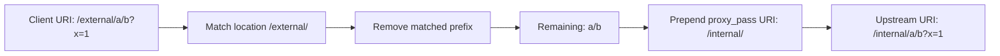

# Part 031 — `proxy_pass` Semantics: Slash, URI Replacement, Variables, and Regex

> Goal part ini: kamu bisa membaca konfigurasi `proxy_pass` dan memprediksi **persis** URI apa yang diterima upstream. Tanpa menebak. Tanpa trial-error. Tanpa bug karena satu karakter `/`.

`proxy_pass` adalah salah satu directive NGINX yang paling terlihat sederhana tapi paling banyak menghasilkan bug production.

Bukan karena directive-nya buruk. Masalahnya adalah banyak engineer memperlakukan `proxy_pass` seperti string concatenation biasa:

```nginx
location /api/ {
    proxy_pass http://backend/;
}
```

Padahal NGINX tidak sekadar menempelkan string. Ia menjalankan aturan URI replacement berdasarkan:

1. apakah `proxy_pass` memiliki URI part;
2. jenis `location` yang match;
3. apakah request URI sudah dinormalisasi;
4. apakah URI dimodifikasi oleh `rewrite`;
5. apakah `proxy_pass` memakai variable;
6. apakah location regex atau named location;
7. apakah kamu ingin meneruskan original URI atau normalized changed URI.

Part ini membangun mental model yang bisa dipakai untuk desain reverse proxy, API gateway, SPA backend routing, monolith strangler, dan service decomposition.

---

## 1. Core Mental Model

Saat request masuk, ada dua konsep URI yang perlu dibedakan:

| Konsep | Arti |
|---|---|
| Original request URI | URI yang dikirim client, termasuk query string, sebelum NGINX melakukan internal routing. |
| Normalized URI | URI yang sudah diproses NGINX untuk kebutuhan location matching dan internal routing. |
| Upstream URI | URI final yang dikirim NGINX ke backend melalui `proxy_pass`. |

`proxy_pass` menentukan bagaimana **upstream URI** dibentuk.

Secara besar:

```txt
proxy_pass without URI  => forward current request URI
proxy_pass with URI     => replace matching location prefix with proxy_pass URI
```

Contoh:

```nginx
location /api/ {
    proxy_pass http://backend/;
}
```

Request:

```txt
GET /api/users?id=123
```

Upstream menerima:

```txt
GET /users?id=123
```

Kenapa `/api/` hilang?

Karena `proxy_pass http://backend/;` memiliki URI part `/`. Maka NGINX mengganti bagian URI yang match dengan `location /api/` menggunakan URI part dari `proxy_pass`, yaitu `/`.

---

## 2. Anatomy of `proxy_pass`

`proxy_pass` bisa menunjuk ke HTTP upstream dengan bentuk:

```nginx
proxy_pass http://backend;
proxy_pass http://backend/;
proxy_pass http://backend/api/;
proxy_pass http://127.0.0.1:8080;
proxy_pass http://unix:/run/app.sock:/;
```

Yang penting bukan hanya host/port. Yang penting adalah apakah setelah host ada URI.

| Directive | Punya URI part? | URI part |
|---|---:|---|
| `proxy_pass http://backend;` | Tidak | none |
| `proxy_pass http://backend/;` | Ya | `/` |
| `proxy_pass http://backend/api/;` | Ya | `/api/` |
| `proxy_pass http://backend/v1;` | Ya | `/v1` |

Slash setelah host bukan dekorasi.

Ia mengubah mode operasi.

---

## 3. Truth Table: Location Prefix vs `proxy_pass` URI

Anggap request:

```txt
GET /app/users?id=123
```

Lalu `location`:

```nginx
location /app/ {
    ...
}
```

Maka hasilnya:

| Config | Upstream URI | Makna |
|---|---|---|
| `proxy_pass http://backend;` | `/app/users?id=123` | prefix tidak dihapus |
| `proxy_pass http://backend/;` | `/users?id=123` | `/app/` diganti `/` |
| `proxy_pass http://backend/api/;` | `/api/users?id=123` | `/app/` diganti `/api/` |
| `proxy_pass http://backend/internal;` | `/internalusers?id=123` | raw replacement; missing slash risk |
| `proxy_pass http://backend/internal/;` | `/internal/users?id=123` | replacement aman untuk subtree |

Perhatikan kasus ini:

```nginx
location /app/ {
    proxy_pass http://backend/internal;
}
```

Request:

```txt
/app/users
```

Upstream:

```txt
/internalusers
```

Ini bukan typo NGINX. Ini konsekuensi replacement.

Kalau kamu ingin subtree mapping, biasanya gunakan slash yang simetris:

```nginx
location /app/ {
    proxy_pass http://backend/internal/;
}
```

---

## 4. The Replacement Formula

Untuk prefix location biasa, formula aman untuk dipikirkan:

```txt
upstream_uri = proxy_pass_uri + (normalized_request_uri - matched_location_prefix)
```

Contoh:

```nginx
location /external/ {
    proxy_pass http://backend/internal/;
}
```

Request:

```txt
/external/a/b?x=1
```

Calculation:

```txt
matched_location_prefix        = /external/
proxy_pass_uri                 = /internal/
remaining URI                  = a/b
query string                   = ?x=1
upstream_uri                   = /internal/a/b?x=1
```

Diagram:



---

## 5. `proxy_pass` Without URI

Config:

```nginx
location /api/ {
    proxy_pass http://backend;
}
```

Request:

```txt
/api/users?id=123
```

Upstream:

```txt
/api/users?id=123
```

Tidak ada prefix stripping.

Ini cocok ketika backend memang mengetahui external path `/api/`.

Contoh use case:

```nginx
location /billing/ {
    proxy_pass http://billing-service;
}
```

Backend menerima:

```txt
/billing/invoices
```

Ini baik jika service memang didesain dengan base path `/billing`.

Tapi buruk jika backend hanya punya route `/invoices`.

---

## 6. `proxy_pass` With URI

Config:

```nginx
location /billing/ {
    proxy_pass http://billing-service/;
}
```

Request:

```txt
/billing/invoices
```

Upstream:

```txt
/invoices
```

Ini cocok ketika NGINX menjadi external path router, sedangkan backend tidak tahu external prefix.

Pola ini umum untuk strangler migration:

```nginx
location /legacy/ {
    proxy_pass http://legacy-monolith/;
}

location /payments/ {
    proxy_pass http://payments-service/;
}
```

Client melihat:

```txt
/payments/charges
```

Payments service melihat:

```txt
/charges
```

Kelebihan:

- backend tidak perlu tahu path publik;
- migrasi path bisa dikendalikan di edge;
- service bisa dipindah tanpa mengubah client contract.

Risiko:

- generated absolute URL dari backend bisa salah;
- cookie path bisa salah;
- redirect `Location` dari upstream perlu dipikirkan;
- observability harus mencatat external path dan upstream path.

---

## 7. Slash Discipline

Production rule sederhana:

> Kalau `location` prefix berakhir dengan `/`, `proxy_pass` URI subtree biasanya juga harus berakhir dengan `/`.

Aman:

```nginx
location /api/ {
    proxy_pass http://backend/;
}
```

Aman:

```nginx
location /api/ {
    proxy_pass http://backend/internal/;
}
```

Raw dan sering salah:

```nginx
location /api/ {
    proxy_pass http://backend/internal;
}
```

Kecuali kamu memang ingin menghasilkan `/internalfoo`, hindari bentuk terakhir.

---

## 8. Non-Slash Location Prefix Trap

Config:

```nginx
location /api {
    proxy_pass http://backend/;
}
```

Request:

```txt
/api/users
```

Matched prefix:

```txt
/api
```

Remaining:

```txt
/users
```

Upstream:

```txt
//users
```

Tergantung normalisasi dan backend, double slash bisa menjadi masalah.

Lebih buruk lagi:

```txt
/apiv2/users
```

Bisa match prefix `/api` juga, karena prefix location bukan segment-aware.

Untuk subtree path, prefer:

```nginx
location /api/ {
    proxy_pass http://backend/;
}
```

Lalu tangani `/api` secara eksplisit:

```nginx
location = /api {
    return 308 /api/;
}

location /api/ {
    proxy_pass http://backend/;
}
```

Ini membuat invariant jelas:

```txt
/api      => canonical redirect ke /api/
/api/...  => proxied subtree
/apiv2    => tidak ikut match /api/
```

---

## 9. Query String Behavior

Secara default, query string tetap diteruskan.

Config:

```nginx
location /api/ {
    proxy_pass http://backend/;
}
```

Request:

```txt
/api/users?role=admin&page=2
```

Upstream:

```txt
/users?role=admin&page=2
```

Kalau kamu menulis URI eksplisit dengan query string di `proxy_pass`, kamu sedang mengambil alih query behavior.

Contoh:

```nginx
location /search/ {
    proxy_pass http://backend/find?q=$arg_q;
}
```

Sekarang upstream URI dibentuk dari URI yang kamu susun.

Risiko:

- query lain hilang;
- encoding bisa berubah;
- parameter security seperti signature bisa invalid;
- cache key bisa tidak sesuai ekspektasi.

Jika perlu mempertahankan semua query string setelah rewrite manual, kamu harus eksplisit:

```nginx
proxy_pass http://backend$new_uri$is_args$args;
```

Tapi begitu masuk ke mode variable-heavy, kamu harus memperlakukan config sebagai program, bukan template.

---

## 10. Regex Location: Jangan Pakai URI Replacement

Pada regex location, NGINX tidak bisa menentukan bagian URI mana yang harus diganti dengan `proxy_pass` URI secara deterministik seperti prefix location.

Buruk:

```nginx
location ~ ^/api/v[0-9]+/(.*)$ {
    proxy_pass http://backend/;
}
```

Pola yang lebih jelas:

```nginx
location ~ ^/api/v[0-9]+/(.*)$ {
    proxy_pass http://backend/$1$is_args$args;
}
```

Tapi ini membawa risiko baru:

- capture group harus benar;
- path encoding harus dipahami;
- query string harus disambungkan dengan benar;
- security review harus memastikan tidak ada path confusion.

Sering kali lebih baik menghindari regex location untuk proxy routing dan memakai prefix location + `map`.

Contoh:

```nginx
map $uri $backend_name {
    default              default_backend;
    ~^/api/v1/           api_v1;
    ~^/api/v2/           api_v2;
}

upstream api_v1 { server api-v1:8080; }
upstream api_v2 { server api-v2:8080; }
upstream default_backend { server default-api:8080; }

server {
    location /api/ {
        proxy_pass http://$backend_name;
    }
}
```

Namun perhatikan: ketika `proxy_pass` memakai variable, semantics berubah. Kita bahas di bawah.

---

## 11. Named Location Trap

Named location digunakan untuk internal control flow:

```nginx
location / {
    try_files $uri @app;
}

location @app {
    proxy_pass http://backend;
}
```

Pada named location, tidak ada path prefix yang bisa diganti. Maka gunakan `proxy_pass` tanpa URI, atau susun URI secara eksplisit.

Aman:

```nginx
location @app {
    proxy_pass http://backend;
}
```

Hati-hati:

```nginx
location @app {
    proxy_pass http://backend/;
}
```

Jika kamu butuh fallback SPA ke backend dengan URI tertentu, lebih baik eksplisit:

```nginx
location @app {
    proxy_pass http://backend$request_uri;
}
```

Atau:

```nginx
location @index_api {
    proxy_pass http://backend/internal/index$is_args$args;
}
```

---

## 12. `rewrite` + `proxy_pass`

`rewrite` dapat mengubah URI sebelum proxying.

Contoh:

```nginx
location /old-api/ {
    rewrite ^/old-api/(.*)$ /v1/$1 break;
    proxy_pass http://backend;
}
```

Request:

```txt
/old-api/users
```

URI setelah rewrite:

```txt
/v1/users
```

Karena `proxy_pass` tidak punya URI part, upstream menerima changed URI:

```txt
/v1/users
```

Sekarang bandingkan:

```nginx
location /old-api/ {
    rewrite ^/old-api/(.*)$ /v1/$1 break;
    proxy_pass http://backend/api/;
}
```

Ini membingungkan karena ada dua mekanisme path transformation:

1. `rewrite` mengubah URI;
2. `proxy_pass` dengan URI juga ingin melakukan replacement.

Production rule:

> Jangan gabungkan `rewrite` dan `proxy_pass` URI replacement kecuali kamu bisa menulis expected upstream URI untuk semua test case.

Prefer salah satu:

### Option A — gunakan `proxy_pass` replacement saja

```nginx
location /old-api/ {
    proxy_pass http://backend/v1/;
}
```

### Option B — gunakan `rewrite` lalu `proxy_pass` tanpa URI

```nginx
location /old-api/ {
    rewrite ^/old-api/(.*)$ /v1/$1 break;
    proxy_pass http://backend;
}
```

Jangan campur tanpa alasan kuat.

---

## 13. Variable in `proxy_pass`

Begitu `proxy_pass` memakai variable, kamu keluar dari mode replacement normal.

Contoh:

```nginx
set $backend http://api-service:8080;

location /api/ {
    proxy_pass $backend;
}
```

Ini sering dipakai untuk dynamic upstream, environment-specific endpoint, atau routing berbasis `map`.

Tapi ada konsekuensi besar:

1. NGINX perlu resolver jika variable menghasilkan hostname yang harus di-resolve runtime.
2. URI handling menjadi lebih eksplisit.
3. Beberapa optimisasi/static upstream behavior berubah.
4. Debugging menjadi lebih sulit karena upstream tidak terlihat dari literal config.

Contoh dynamic upstream:

```nginx
resolver 10.96.0.10 valid=10s ipv6=off;

map $http_x_target_env $target_origin {
    default  http://api-stable.default.svc.cluster.local:8080;
    canary   http://api-canary.default.svc.cluster.local:8080;
}

location /api/ {
    proxy_pass $target_origin;
}
```

Pertanyaan wajib:

```txt
Apakah backend harus menerima /api/users atau /users?
```

Jika harus menerima `/users`, kamu perlu membentuk URI sendiri:

```nginx
location /api/ {
    rewrite ^/api/(.*)$ /$1 break;
    proxy_pass $target_origin;
}
```

Atau:

```nginx
location /api/ {
    proxy_pass $target_origin$request_uri;
}
```

Tapi contoh terakhir meneruskan `/api/...`, bukan stripping prefix.

Kalau ingin stripping prefix dengan variable, gunakan rewrite atau capture yang eksplisit.

---

## 14. Dynamic DNS and Resolver Implication

Config ini tampak masuk akal:

```nginx
set $origin http://api.internal:8080;

location /api/ {
    proxy_pass $origin;
}
```

Jika hostname dihasilkan lewat variable, NGINX tidak selalu memakai mekanisme resolve startup yang sama seperti literal upstream. Kamu biasanya perlu:

```nginx
resolver 127.0.0.53 valid=30s ipv6=off;
```

Atau DNS resolver internal environment:

```nginx
resolver 10.96.0.10 valid=10s ipv6=off; # Kubernetes kube-dns/CoreDNS service IP example
```

Tanpa resolver, request bisa gagal dengan error seperti:

```txt
no resolver defined to resolve api.internal
```

Jangan asal menambah `resolver 8.8.8.8;` di production internal service. Itu bisa membocorkan internal hostnames dan membuat dependency eksternal untuk traffic internal.

---

## 15. Host Header Is Separate from URI

`proxy_pass` menentukan destination dan URI. Ia tidak otomatis menentukan semantic Host yang benar untuk upstream application.

Contoh:

```nginx
location /api/ {
    proxy_pass http://api-service:8080/;
}
```

Tanpa override, default Host yang dikirim upstream bisa berdasarkan proxy host. Untuk banyak aplikasi, kamu ingin menjaga original host:

```nginx
proxy_set_header Host $host;
```

Tapi untuk virtual-hosted upstream, kamu mungkin perlu upstream host:

```nginx
proxy_set_header Host api.internal.example;
```

Atau:

```nginx
proxy_set_header Host $proxy_host;
```

Jangan campur URI routing problem dengan Host routing problem. Mereka dua kontrak berbeda.

---

## 16. Redirects from Upstream

Misal public path:

```txt
https://example.com/app/
```

NGINX config:

```nginx
location /app/ {
    proxy_pass http://backend/;
}
```

Backend melihat root path `/`. Jika backend mengirim redirect:

```http
Location: /login
```

Client akan menuju:

```txt
https://example.com/login
```

Padahal mungkin yang benar:

```txt
https://example.com/app/login
```

Solusinya tergantung ownership:

1. buat backend aware terhadap external base path;
2. ubah redirect upstream dengan `proxy_redirect`;
3. jangan strip prefix;
4. gunakan subdomain per service, bukan path prefix.

Contoh:

```nginx
location /app/ {
    proxy_pass http://backend/;
    proxy_redirect / /app/;
}
```

Tapi rewriting redirect adalah patch di edge. Untuk aplikasi kompleks dengan cookie, asset URL, OAuth callback, dan CSRF origin, subdomain sering lebih bersih daripada path prefix.

---

## 17. Cookie Path and Prefix Stripping

Kalau backend mengirim:

```http
Set-Cookie: session=abc; Path=/; Secure; HttpOnly
```

Dengan public path `/app/`, cookie `Path=/` berlaku untuk seluruh origin:

```txt
https://example.com/
```

Bukan hanya `/app/`.

Kalau beberapa aplikasi hidup di path prefix berbeda, ini bisa menyebabkan collision:

```txt
/app-a/ session cookie
/app-b/ session cookie
```

NGINX punya directive seperti `proxy_cookie_path`, tetapi jangan jadikan ini default tanpa desain.

Contoh:

```nginx
location /app/ {
    proxy_pass http://backend/;
    proxy_cookie_path / /app/;
}
```

Pertanyaan design:

```txt
Apakah aplikasi benar-benar aman berjalan di path prefix?
Atau seharusnya diberi host/subdomain sendiri?
```

---

## 18. Canonical Patterns

### Pattern 1 — Backend owns public prefix

Backend route:

```txt
/api/users
```

NGINX:

```nginx
location /api/ {
    proxy_pass http://api_backend;
}
```

Use when:

- backend aware public route;
- application generates links with `/api/...`;
- logs upstream ingin melihat same URI as client;
- no prefix stripping needed.

### Pattern 2 — Edge strips public prefix

Backend route:

```txt
/users
```

NGINX:

```nginx
location = /api {
    return 308 /api/;
}

location /api/ {
    proxy_pass http://api_backend/;
}
```

Use when:

- NGINX owns public path composition;
- backend reusable under different prefix;
- migration or strangler pattern;
- backend tidak generate banyak absolute URLs.

### Pattern 3 — Edge remaps public prefix to internal base path

Backend route:

```txt
/internal-api/users
```

NGINX:

```nginx
location /api/ {
    proxy_pass http://api_backend/internal-api/;
}
```

Use when:

- internal application punya base path berbeda;
- migration transitional;
- edge contract harus berbeda dari upstream contract.

### Pattern 4 — Explicit rewrite then proxy

```nginx
location /api/ {
    rewrite ^/api/(.*)$ /v2/$1 break;
    proxy_pass http://api_backend;
}
```

Use when:

- transformation tidak bisa diekspresikan dengan simple prefix replacement;
- kamu punya test matrix;
- kamu butuh regex capture.

---

## 19. Anti-Patterns

### Anti-pattern A — slash guessing

```nginx
location /api {
    proxy_pass http://backend/api;
}
```

Sulit diprediksi, raw concatenation risk, dan prefix `/apiv2` bisa ikut match.

### Anti-pattern B — regex proxy without explicit URI contract

```nginx
location ~ /api/(.*) {
    proxy_pass http://backend/;
}
```

Regex location + `proxy_pass` URI replacement adalah sumber ambiguity.

### Anti-pattern C — dynamic proxy without resolver strategy

```nginx
set $target http://$http_x_service.internal;
proxy_pass $target;
```

Ini bukan routing. Ini SSRF-shaped footgun jika header client bisa memilih upstream.

### Anti-pattern D — user-controlled upstream

```nginx
proxy_pass http://$arg_host$request_uri;
```

Jangan lakukan ini untuk request publik. Kamu membuka jalan ke SSRF, internal service exposure, metadata endpoint access, dan policy bypass.

### Anti-pattern E — path rewrite without logs

```nginx
location /a/ {
    proxy_pass http://backend/b/;
}
```

Tanpa log yang mencatat `$request_uri`, `$uri`, dan upstream address/status, debugging akan buta.

---

## 20. Production Log Format for URI Debugging

Tambahkan temporary atau permanent log field untuk reverse proxy:

```nginx
log_format proxy_debug escape=json
  '{'
    '"time":"$time_iso8601",'
    '"remote_addr":"$remote_addr",'
    '"host":"$host",'
    '"method":"$request_method",'
    '"request_uri":"$request_uri",'
    '"uri":"$uri",'
    '"args":"$args",'
    '"status":$status,'
    '"upstream_addr":"$upstream_addr",'
    '"upstream_status":"$upstream_status",'
    '"upstream_response_time":"$upstream_response_time"'
  '}';
```

Gunakan pada server/lokasi yang sedang dimigrasikan:

```nginx
access_log /var/log/nginx/api_proxy_debug.log proxy_debug;
```

Field penting:

| Field | Kegunaan |
|---|---|
| `$request_uri` | Original URI including query string. |
| `$uri` | Current normalized URI after internal processing. |
| `$args` | Query string tanpa `?`. |
| `$upstream_addr` | Backend yang menerima request. |
| `$upstream_status` | Status dari upstream. |
| `$upstream_response_time` | Latency upstream. |

---

## 21. Test Matrix Wajib

Untuk setiap `location /prefix/` reverse proxy, test minimal:

```txt
/prefix
/prefix/
/prefix/a
/prefix/a/b
/prefix/a?x=1
/prefix/a/b?x=1&y=2
/prefix//double
/prefix/%2Fencoded
/prefix/../x
/prefix?x=1
/prefixes/should-not-match
```

Contoh script smoke sederhana:

```bash
#!/usr/bin/env bash
set -euo pipefail

base="https://example.com"

paths=(
  "/api"
  "/api/"
  "/api/users"
  "/api/users?id=123"
  "/apiv2/users"
)

for p in "${paths[@]}"; do
  echo "==> $p"
  curl -skI "$base$p" | sed -n '1,8p'
  echo
 done
```

Untuk memverifikasi upstream URI, buat temporary echo backend:

```js
import http from "node:http";

http.createServer((req, res) => {
  res.setHeader("content-type", "application/json");
  res.end(JSON.stringify({
    method: req.method,
    url: req.url,
    headers: req.headers
  }, null, 2));
}).listen(8080);
```

Lalu proxy ke echo backend dan lihat hasil sebenarnya.

---

## 22. Decision Matrix

| Situation | Recommended style |
|---|---|
| Backend route sama dengan public route | `proxy_pass http://backend;` |
| Backend route tidak punya public prefix | `location /prefix/` + `proxy_pass http://backend/;` |
| Public prefix perlu diubah ke internal prefix | `proxy_pass http://backend/internal/;` |
| Butuh regex transform | `rewrite ... break` + `proxy_pass http://backend;` |
| Named location fallback | `proxy_pass http://backend;` atau explicit `$request_uri` |
| Dynamic upstream via `map` | variable `proxy_pass` + resolver + explicit URI policy |
| User input memilih upstream | Jangan, kecuali whitelist ketat via `map` |

---

## 23. Production Checklist

Sebelum merge config reverse proxy:

- [ ] Apakah backend harus menerima public prefix atau stripped prefix?
- [ ] Apakah `location` prefix segment-safe, misalnya `/api/`, bukan `/api`?
- [ ] Apakah `/api` tanpa slash ditangani eksplisit?
- [ ] Apakah `proxy_pass` memakai URI part dengan sengaja?
- [ ] Apakah regex location menghindari implicit URI replacement?
- [ ] Apakah named location tidak memakai replacement yang ambiguous?
- [ ] Apakah variable `proxy_pass` punya resolver strategy?
- [ ] Apakah user input tidak bisa memilih arbitrary upstream?
- [ ] Apakah redirect dan cookie path dari upstream sudah diuji?
- [ ] Apakah logs mencatat enough data untuk membedakan public URI dan upstream behavior?
- [ ] Apakah test matrix mencakup slash, query, encoded path, dan non-matching sibling path?

---

## 24. Failure Modes

| Failure | Cause | Symptom | Fix |
|---|---|---|---|
| Backend menerima `/api/users`, padahal expect `/users` | `proxy_pass` tanpa URI | 404 upstream | Tambahkan trailing `/` pada `proxy_pass` atau rewrite eksplisit |
| Backend menerima `/internalusers` | Missing slash pada `proxy_pass http://backend/internal` | 404 aneh | Gunakan `/internal/` |
| `/apiv2` masuk ke `/api` route | `location /api` bukan `/api/` | Wrong service | Tambahkan exact redirect dan prefix slash |
| Regex proxy menghasilkan URI salah | Replacement ambiguity | 404/loop | Gunakan capture eksplisit atau prefix location |
| Dynamic upstream gagal resolve | variable host tanpa `resolver` | 502 | Tambahkan resolver internal yang benar |
| Redirect keluar dari prefix | upstream `Location: /login` | Client ke path salah | Backend base path, `proxy_redirect`, atau subdomain |
| Cookie bocor antar app path | upstream `Path=/` | Session collision | `proxy_cookie_path` atau host isolation |
| SSRF via `proxy_pass` variable | user-controlled upstream | Internal service exposure | Whitelist via `map`; jangan pakai raw user input |

---

## 25. Minimal Production-Safe Examples

### Prefix stripping API

```nginx
upstream api_backend {
    server 10.0.10.21:8080;
    keepalive 32;
}

server {
    listen 443 ssl http2;
    server_name example.com;

    location = /api {
        return 308 /api/;
    }

    location /api/ {
        proxy_http_version 1.1;
        proxy_set_header Host $host;
        proxy_set_header X-Real-IP $remote_addr;
        proxy_set_header X-Forwarded-For $proxy_add_x_forwarded_for;
        proxy_set_header X-Forwarded-Proto $scheme;

        proxy_pass http://api_backend/;
    }
}
```

### No prefix stripping

```nginx
location /api/ {
    proxy_http_version 1.1;
    proxy_set_header Host $host;
    proxy_set_header X-Real-IP $remote_addr;
    proxy_set_header X-Forwarded-For $proxy_add_x_forwarded_for;
    proxy_set_header X-Forwarded-Proto $scheme;

    proxy_pass http://api_backend;
}
```

### Internal base path remap

```nginx
location = /billing {
    return 308 /billing/;
}

location /billing/ {
    proxy_http_version 1.1;
    proxy_set_header Host $host;
    proxy_set_header X-Real-IP $remote_addr;
    proxy_set_header X-Forwarded-For $proxy_add_x_forwarded_for;
    proxy_set_header X-Forwarded-Proto $scheme;

    proxy_pass http://billing_backend/internal-billing/;
}
```

---

## 26. Mental Compression

Ingat tiga pertanyaan ini:

```txt
1. Apakah proxy_pass punya URI part?
2. Apakah location punya prefix yang bisa diganti?
3. Apakah URI sudah diubah oleh rewrite/variable/named-location behavior?
```

Kalau jawabannya tidak jelas, config belum siap production.

---

## 27. Key Takeaways

- `proxy_pass http://backend;` dan `proxy_pass http://backend/;` berbeda besar.
- Slash setelah upstream host menentukan apakah ada URI part.
- Prefix location + `proxy_pass` URI melakukan URI replacement.
- Regex dan named location tidak cocok untuk implicit URI replacement.
- Variable dalam `proxy_pass` mengubah model resolusi dan URI handling.
- `rewrite` dan `proxy_pass` URI replacement jangan dicampur tanpa test matrix.
- Path prefix proxying berdampak ke redirect, cookie path, generated links, OAuth callback, dan observability.
- Reverse proxy config harus diuji seperti code, bukan hanya divalidasi syntax dengan `nginx -t`.

---

## Referensi

- NGINX official docs — `ngx_http_proxy_module`: https://nginx.org/en/docs/http/ngx_http_proxy_module.html
- NGINX official docs — request processing: https://nginx.org/en/docs/http/request_processing.html
- NGINX official docs — `ngx_http_rewrite_module`: https://nginx.org/en/docs/http/ngx_http_rewrite_module.html
- NGINX/F5 admin guide — Reverse Proxy: https://docs.nginx.com/nginx/admin-guide/web-server/reverse-proxy/

