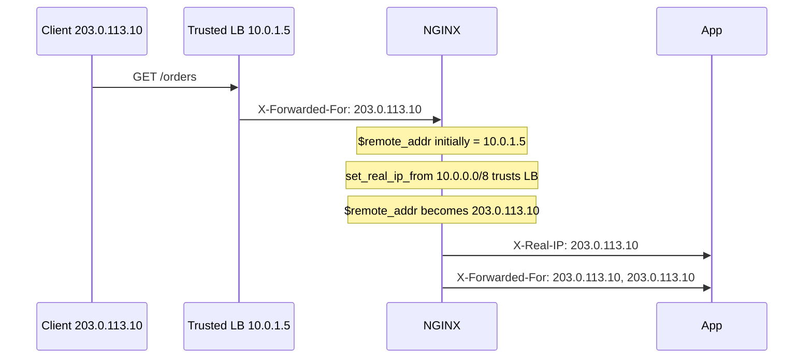

# Part 032 — Forwarded Headers, Real IP, and Trust Boundaries

> Goal part ini: kamu bisa mendesain forwarding header dan real client IP chain yang aman. Bukan sekadar copy `X-Forwarded-For`, tapi paham siapa yang boleh dipercaya, header mana yang boleh dihapus/ditimpa, dan bagaimana efeknya ke log, audit, rate limiting, auth, geo policy, dan incident response.

Reverse proxy mengubah topologi koneksi.

Tanpa proxy:

```txt
Client TCP connection -> Application
```

Dengan NGINX:

```txt
Client TCP connection -> NGINX -> Upstream TCP connection -> Application
```

Dari sudut pandang application, peer TCP-nya bukan client asli. Peer-nya adalah NGINX.

Artinya, kalau backend membaca remote address dari socket, ia melihat IP NGINX, bukan IP user.

Untuk mengirim identitas client asli, proxy biasanya memakai header seperti:

```http
X-Real-IP: 203.0.113.10
X-Forwarded-For: 203.0.113.10, 10.0.0.5
X-Forwarded-Proto: https
X-Forwarded-Host: example.com
```

Tapi header HTTP datang dari client dan bisa dipalsukan.

Jadi masalah utamanya bukan “bagaimana menambah header”. Masalahnya:

> Header mana yang boleh dipercaya, dari hop mana, dan kapan harus ditimpa?

---

## 1. Identity at the Edge

Di edge traffic system, identity punya beberapa lapisan:

| Identity | Contoh | Sumber |
|---|---|---|
| TCP peer IP | `10.0.0.15` | Socket connection ke NGINX |
| Claimed client IP | `X-Forwarded-For: 1.2.3.4` | Header HTTP, bisa spoofed |
| Restored real IP | `$remote_addr` setelah realip | NGINX `realip` module |
| Original peer before restore | `$realip_remote_addr` | NGINX realip variable |
| Public host | `example.com` | `Host` / SNI / proxy policy |
| Public scheme | `https` | TLS termination / `X-Forwarded-Proto` |
| Authenticated user | `sub=user-123` | App/session/token, bukan IP |

Jangan menyamakan IP address dengan user identity.

IP berguna untuk:

- audit trail;
- rate limit kasar;
- geo/IP allowlist;
- abuse detection;
- forensic correlation;
- bot mitigation;
- network-level policy.

IP tidak cukup untuk:

- authorization business action;
- tenant isolation;
- user ownership;
- irreversible enforcement decision tanpa evidence lain.

---

## 2. Basic Forwarding Headers

Konfigurasi paling umum:

```nginx
location / {
    proxy_set_header Host $host;
    proxy_set_header X-Real-IP $remote_addr;
    proxy_set_header X-Forwarded-For $proxy_add_x_forwarded_for;
    proxy_set_header X-Forwarded-Proto $scheme;

    proxy_pass http://app;
}
```

Makna:

| Header | Tujuan |
|---|---|
| `Host` | Memberi tahu upstream host publik atau host yang dipilih. |
| `X-Real-IP` | Single client IP menurut NGINX pada saat proxying. |
| `X-Forwarded-For` | Chain IP dari client dan proxy sebelumnya. |
| `X-Forwarded-Proto` | Scheme publik yang dilihat client: `http` atau `https`. |
| `X-Forwarded-Host` | Host publik original, jika perlu dibedakan dari `Host`. |
| `X-Forwarded-Port` | Port publik, jika backend perlu generate URL absolut. |

Namun config dasar ini belum menjawab trust boundary.

---

## 3. Trust Boundary Mental Model

Misal deployment:

```txt
Internet Client
    |
Cloud Load Balancer
    |
NGINX
    |
Application
```

Ada dua kemungkinan:

### Case A — NGINX menerima koneksi langsung dari Internet

```txt
Client -> NGINX
```

Maka `$remote_addr` adalah IP client TCP peer.

Client bisa mengirim header palsu:

```http
X-Forwarded-For: 8.8.8.8
X-Real-IP: 1.1.1.1
```

Jika kamu meneruskan header ini tanpa menimpa, backend bisa tertipu.

### Case B — NGINX menerima koneksi dari trusted load balancer

```txt
Client -> Trusted LB -> NGINX
```

Maka `$remote_addr` awal adalah IP load balancer. Client IP asli mungkin dikirim lewat header/proxy protocol oleh load balancer.

NGINX boleh mempercayai header itu **hanya jika koneksi datang dari load balancer yang trusted**.

---

## 4. Rule: Strip or Overwrite at Trust Boundary

Di public edge, jangan pass-through client-supplied forwarding headers mentah.

Buruk:

```nginx
proxy_set_header X-Forwarded-For $http_x_forwarded_for;
proxy_set_header X-Real-IP $http_x_real_ip;
```

Ini membiarkan client mengaku sebagai IP apapun.

Lebih aman:

```nginx
proxy_set_header X-Real-IP $remote_addr;
proxy_set_header X-Forwarded-For $proxy_add_x_forwarded_for;
```

Tetapi `$proxy_add_x_forwarded_for` berarti:

```txt
existing X-Forwarded-For + current $remote_addr
```

Jika NGINX adalah public first hop, existing header berasal dari client dan bisa spoofed. Dalam beberapa sistem, kamu justru ingin reset:

```nginx
proxy_set_header X-Forwarded-For $remote_addr;
```

Decision:

| NGINX position | Recommended `X-Forwarded-For` |
|---|---|
| First trusted edge after Internet | `$remote_addr` untuk reset chain |
| Behind trusted proxy/LB and realip already restored | `$proxy_add_x_forwarded_for` atau controlled chain policy |
| Internal proxy chain | append chain, tapi hanya antar trusted hops |

Tidak ada satu config universal. Yang ada adalah trust boundary yang harus eksplisit.

---

## 5. `ngx_http_realip_module`

`realip` module dipakai untuk mengganti client address di NGINX berdasarkan header/proxy protocol dari trusted upstream proxy.

Contoh:

```nginx
set_real_ip_from 10.0.0.0/8;
set_real_ip_from 192.168.0.0/16;
real_ip_header X-Forwarded-For;
real_ip_recursive on;
```

Makna:

| Directive | Fungsi |
|---|---|
| `set_real_ip_from` | Mendefinisikan IP/CIDR proxy yang dipercaya. |
| `real_ip_header` | Header yang dipakai untuk mengganti client IP. |
| `real_ip_recursive` | Cara memilih IP dari chain ketika ada beberapa proxy. |

Setelah realip berjalan:

| Variable | Makna |
|---|---|
| `$remote_addr` | Client address hasil restore. |
| `$realip_remote_addr` | Original peer address sebelum restore. |
| `$remote_port` | Port hasil restore jika tersedia. |
| `$realip_remote_port` | Original peer port sebelum restore. |

Diagram:



Perhatikan duplicate risk pada last line. Chain policy perlu dipilih dengan sadar.

---

## 6. `real_ip_recursive` Intuition

`X-Forwarded-For` biasanya berupa list:

```http
X-Forwarded-For: client, proxy1, proxy2
```

Jika NGINX menerima koneksi dari `proxy2`, dan `proxy2` trusted, NGINX perlu mencari IP client yang paling tepat.

Dengan recursive mode, NGINX dapat berjalan mundur dari kanan ke kiri dan memilih address non-trusted terakhir sebagai client.

Contoh:

```txt
XFF: 198.51.100.7, 10.0.1.5, 10.0.2.5
peer: 10.0.3.5
trusted: 10.0.0.0/8
```

Candidate:

```txt
10.0.2.5 trusted
10.0.1.5 trusted
198.51.100.7 non-trusted => restored client
```

Jika trust CIDR terlalu luas, kamu bisa mempercayai hop yang seharusnya tidak dipercaya.

Jangan gunakan:

```nginx
set_real_ip_from 0.0.0.0/0;
```

Itu berarti semua orang boleh mengklaim IP sendiri melalui header.

---

## 7. Safer Real IP Config by Topology

### Topology 1 — NGINX directly exposed to Internet

```nginx
# Do not trust client-supplied XFF for realip.
# No set_real_ip_from for public Internet.

location / {
    proxy_set_header Host $host;
    proxy_set_header X-Real-IP $remote_addr;
    proxy_set_header X-Forwarded-For $remote_addr;
    proxy_set_header X-Forwarded-Proto $scheme;
    proxy_pass http://app;
}
```

### Topology 2 — NGINX behind known L4/L7 load balancer

```nginx
# Trust only the load balancer subnets.
set_real_ip_from 10.10.0.0/16;
real_ip_header X-Forwarded-For;
real_ip_recursive on;

location / {
    proxy_set_header Host $host;
    proxy_set_header X-Real-IP $remote_addr;
    proxy_set_header X-Forwarded-For $proxy_add_x_forwarded_for;
    proxy_set_header X-Forwarded-Proto $scheme;
    proxy_pass http://app;
}
```

### Topology 3 — Cloud LB sends PROXY protocol

```nginx
server {
    listen 443 ssl proxy_protocol;

    set_real_ip_from 10.10.0.0/16;
    real_ip_header proxy_protocol;

    location / {
        proxy_set_header Host $host;
        proxy_set_header X-Real-IP $remote_addr;
        proxy_set_header X-Forwarded-For $remote_addr;
        proxy_set_header X-Forwarded-Proto $scheme;
        proxy_pass http://app;
    }
}
```

Use PROXY protocol only if the immediate peer is trusted and actually speaks PROXY protocol. If you enable it on an Internet-facing listener, normal HTTP clients will fail because NGINX expects a PROXY header before HTTP.

---

## 8. `Host`: `$host`, `$http_host`, `$proxy_host`

`Host` header is not just a string. It affects:

- virtual host routing inside application;
- generated absolute URLs;
- OAuth callback validation;
- CSRF origin logic;
- cookie domain logic;
- tenant selection;
- audit trails;
- cache key design.

Common choices:

| Value | Meaning | Risk |
|---|---|---|
| `$host` | Normalized host selected by NGINX; may fallback to server name. | Safer than raw but may not preserve port. |
| `$http_host` | Raw client `Host` header. | Can include port and weird casing; must be validated. |
| `$proxy_host` | Host from `proxy_pass`. | Good for upstream virtual host; loses public host. |
| fixed host | Explicit internal host. | Good for controlled upstream; may break public URL generation. |

Common public app pattern:

```nginx
proxy_set_header Host $host;
proxy_set_header X-Forwarded-Host $host;
```

Upstream virtual host pattern:

```nginx
proxy_set_header Host internal-app.service.local;
proxy_set_header X-Forwarded-Host $host;
```

This tells backend:

```txt
Host: internal-app.service.local          # route inside upstream infrastructure
X-Forwarded-Host: example.com             # public host seen by client
```

But only do this if application understands forwarded host correctly.

---

## 9. Scheme and Port: `X-Forwarded-Proto`, `X-Forwarded-Port`

When NGINX terminates TLS:

```txt
Client -> HTTPS -> NGINX -> HTTP -> App
```

Backend sees plain HTTP unless told otherwise.

If app generates URLs, it may produce:

```txt
http://example.com/login
```

instead of:

```txt
https://example.com/login
```

So set:

```nginx
proxy_set_header X-Forwarded-Proto $scheme;
proxy_set_header X-Forwarded-Port $server_port;
```

If NGINX itself is behind an outer TLS-terminating LB, `$scheme` at NGINX might be `http`, even though public scheme is `https`.

Topology:

```txt
Client HTTPS -> Cloud LB terminates TLS -> HTTP -> NGINX -> App
```

In that case, public scheme must come from trusted LB header:

```nginx
map $http_x_forwarded_proto $public_scheme {
    default $scheme;
    https   https;
    http    http;
}

proxy_set_header X-Forwarded-Proto $public_scheme;
```

But only trust `$http_x_forwarded_proto` if the immediate peer is trusted. Otherwise a client can claim HTTPS and bypass app logic.

---

## 10. RFC `Forwarded` Header vs `X-Forwarded-*`

There is a standardized `Forwarded` header:

```http
Forwarded: for=203.0.113.10;proto=https;host=example.com
```

In practice, many frameworks and load balancers still rely on de facto headers:

```http
X-Forwarded-For
X-Forwarded-Proto
X-Forwarded-Host
```

You can emit both if your ecosystem needs it:

```nginx
proxy_set_header X-Forwarded-For $proxy_add_x_forwarded_for;
proxy_set_header X-Forwarded-Proto $scheme;
proxy_set_header X-Forwarded-Host $host;
proxy_set_header Forwarded "for=$remote_addr;proto=$scheme;host=$host";
```

Be careful with quoting, IPv6, and multiple hops if you rely heavily on standardized `Forwarded`.

For most internal platform designs, consistency matters more than ideological purity. Pick a contract and enforce it.

---

## 11. Header Spoofing Example

Attacker sends:

```bash
curl -H 'X-Forwarded-For: 127.0.0.1' \
     -H 'X-Forwarded-Proto: https' \
     -H 'X-Admin: true' \
     https://example.com/admin
```

If your application trusts these headers directly, attacker may:

- bypass IP allowlist;
- trigger localhost-only behavior;
- bypass HTTPS-required checks;
- poison audit logs;
- influence rate limit identity;
- create misleading forensic evidence.

NGINX should normalize headers at the trust boundary:

```nginx
proxy_set_header X-Forwarded-For $remote_addr;
proxy_set_header X-Real-IP $remote_addr;
proxy_set_header X-Forwarded-Proto $scheme;
proxy_set_header X-Admin "";
```

But removing arbitrary sensitive headers requires knowing your application contract.

Common headers to scrutinize:

```txt
X-Forwarded-For
X-Real-IP
X-Forwarded-Proto
X-Forwarded-Host
Forwarded
X-Original-URI
X-Rewrite-URL
X-Accel-Redirect
X-User
X-Email
X-Role
X-Admin
X-Auth-Request-User
```

Especially if upstream app was originally deployed behind a trusted auth proxy.

---

## 12. Identity Header Ownership

A safe platform rule:

> Any header that affects identity, authorization, routing, tenant selection, or scheme must have exactly one owner.

Examples:

| Header | Owner |
|---|---|
| `X-Forwarded-For` | Edge proxy chain |
| `X-Real-IP` | Last trusted reverse proxy |
| `X-Forwarded-Proto` | TLS termination layer |
| `X-User-ID` | Authentication gateway, not public NGINX unless auth happens there |
| `X-Tenant-ID` | Auth/business layer, not raw client header |
| `X-Request-ID` | Edge if absent; preserve if trusted from gateway |

If multiple systems can set the same identity header, incident response becomes ambiguous.

---

## 13. Request ID and Correlation

Forwarded IP solves one axis. You also need request correlation.

```nginx
map $http_x_request_id $request_id_out {
    default $http_x_request_id;
    ""      $request_id;
}

location / {
    proxy_set_header X-Request-ID $request_id_out;
    proxy_set_header X-Correlation-ID $request_id_out;
    proxy_pass http://app;
}
```

But again: decide trust.

If request comes from public Internet, client-provided `X-Request-ID` could be maliciously huge or crafted for log injection. You may prefer to always generate:

```nginx
proxy_set_header X-Request-ID $request_id;
```

At internal boundaries, preserving request ID helps distributed tracing.

---

## 14. Logging Real and Peer IP

A production log should capture both restored IP and immediate peer.

```nginx
log_format edge_json escape=json
  '{'
    '"time":"$time_iso8601",'
    '"request_id":"$request_id",'
    '"remote_addr":"$remote_addr",'
    '"realip_remote_addr":"$realip_remote_addr",'
    '"xff":"$http_x_forwarded_for",'
    '"host":"$host",'
    '"http_host":"$http_host",'
    '"scheme":"$scheme",'
    '"method":"$request_method",'
    '"request_uri":"$request_uri",'
    '"status":$status,'
    '"upstream_addr":"$upstream_addr",'
    '"upstream_status":"$upstream_status",'
    '"request_time":$request_time,'
    '"upstream_response_time":"$upstream_response_time"'
  '}';
```

Why both?

| Field | Why it matters |
|---|---|
| `$remote_addr` | Effective client IP after realip. |
| `$realip_remote_addr` | Immediate trusted peer before replacement. |
| `$http_x_forwarded_for` | Original incoming chain for forensic review. |
| `$host` | Normalized effective host. |
| `$http_host` | Raw host supplied by client. |

During incident, you need to answer:

```txt
Who connected to us directly?
Who did they claim to represent?
Which trusted hop supplied that claim?
What did we forward to the app?
```

---

## 15. Rate Limiting and Real IP

Rate limiting usually uses `$binary_remote_addr`:

```nginx
limit_req_zone $binary_remote_addr zone=per_ip:10m rate=10r/s;

server {
    location /api/ {
        limit_req zone=per_ip burst=20 nodelay;
        proxy_pass http://api;
    }
}
```

If realip is misconfigured, all users behind a load balancer may appear as the load balancer IP.

Result:

```txt
One client can throttle everyone.
```

Or worse:

```txt
Attacker spoofs X-Forwarded-For and gets unlimited identities.
```

Therefore, realip config must be finalized before IP-based rate limiting.

Correct order conceptually:

```txt
1. Establish trusted proxy boundary
2. Restore real client IP safely
3. Log effective and peer IP
4. Apply rate limit using effective IP
5. Forward normalized identity to upstream
```

---

## 16. IP Allowlist and Admin Paths

Bad:

```nginx
location /admin/ {
    allow 10.0.0.0/8;
    deny all;
    proxy_pass http://admin_app;
}
```

This may be wrong depending on whether `$remote_addr` is real client IP or load balancer IP.

If NGINX is behind a trusted LB and realip is not configured, all requests come from `10.0.0.0/8`, so admin becomes public.

Safer approach:

```nginx
# Restore real IP first, trusting only LB CIDR.
set_real_ip_from 10.10.0.0/16;
real_ip_header X-Forwarded-For;
real_ip_recursive on;

location /admin/ {
    allow 203.0.113.0/24;
    deny all;
    proxy_pass http://admin_app;
}
```

Then test from:

- allowed IP;
- denied IP;
- denied IP spoofing `X-Forwarded-For` allowed IP;
- request through expected LB;
- direct-to-NGINX path if network allows it.

---

## 17. Direct-to-Origin Bypass

If NGINX trusts a load balancer but clients can reach NGINX directly, trust model breaks.

Topology intended:

```txt
Internet -> LB -> NGINX
```

Bypass:

```txt
Internet -> NGINX
```

If NGINX config trusts broad private CIDRs or all peers, attacker may spoof forwarded headers.

Controls:

- security group/firewall only allows LB to reach NGINX;
- `set_real_ip_from` only LB subnet, not all private networks casually;
- default server rejects unexpected hosts;
- logs alert when `$realip_remote_addr` is empty/unexpected;
- health endpoint separated from public virtual hosts.

---

## 18. PROXY Protocol

PROXY protocol sends client connection metadata before the proxied protocol payload.

Instead of HTTP header:

```http
X-Forwarded-For: 203.0.113.10
```

The LB sends a connection preface like:

```txt
PROXY TCP4 203.0.113.10 10.0.1.20 56324 443\r\n
GET / HTTP/1.1\r\n
```

NGINX listener must opt in:

```nginx
server {
    listen 443 ssl proxy_protocol;

    set_real_ip_from 10.10.0.0/16;
    real_ip_header proxy_protocol;

    location / {
        proxy_set_header X-Real-IP $remote_addr;
        proxy_set_header X-Forwarded-For $remote_addr;
        proxy_pass http://app;
    }
}
```

Use PROXY protocol when:

- L4 load balancer preserves client metadata this way;
- you need real client IP before HTTP parsing;
- stream/TCP proxying also needs client IP.

Do not enable it unless the immediate peer speaks it. Otherwise requests fail before HTTP parsing.

---

## 19. Upstream Framework Configuration

Even if NGINX forwards correct headers, backend frameworks often require explicit trust proxy settings.

Examples conceptually:

| Framework/platform | Typical need |
|---|---|
| Express.js | Configure `trust proxy` carefully. |
| Spring Boot/Tomcat | Configure forwarded header strategy / valve depending deployment. |
| ASP.NET Core | Configure Forwarded Headers Middleware and known proxies/networks. |
| Rails | Configure trusted proxies. |
| Django | Configure secure proxy SSL header and allowed hosts. |

The invariant:

> Backend must trust forwarded headers only from NGINX or known proxies, not from arbitrary clients.

If backend sits behind NGINX on private network, enforce network-level access so clients cannot call backend directly with spoofed headers.

---

## 20. Safe Header Contract Template

For a typical HTTPS-terminating NGINX directly exposed to Internet:

```nginx
location / {
    proxy_http_version 1.1;

    # Public host/scheme contract
    proxy_set_header Host $host;
    proxy_set_header X-Forwarded-Host $host;
    proxy_set_header X-Forwarded-Proto $scheme;
    proxy_set_header X-Forwarded-Port $server_port;

    # Client IP contract: reset public spoofed chain
    proxy_set_header X-Real-IP $remote_addr;
    proxy_set_header X-Forwarded-For $remote_addr;

    # Correlation
    proxy_set_header X-Request-ID $request_id;

    # Hop-by-hop cleanup for normal HTTP proxying
    proxy_set_header Connection "";

    proxy_pass http://app;
}
```

For NGINX behind trusted LB:

```nginx
set_real_ip_from 10.10.0.0/16;
real_ip_header X-Forwarded-For;
real_ip_recursive on;

location / {
    proxy_http_version 1.1;

    proxy_set_header Host $host;
    proxy_set_header X-Forwarded-Host $host;
    proxy_set_header X-Forwarded-Proto $scheme;
    proxy_set_header X-Forwarded-Port $server_port;

    proxy_set_header X-Real-IP $remote_addr;
    proxy_set_header X-Forwarded-For $proxy_add_x_forwarded_for;

    proxy_set_header X-Request-ID $request_id;
    proxy_set_header Connection "";

    proxy_pass http://app;
}
```

But validate `$scheme` if public TLS terminates before NGINX.

---

## 21. Hop-by-Hop Headers

Some headers describe a single transport hop and should not be forwarded blindly.

Examples:

```txt
Connection
Keep-Alive
Proxy-Authenticate
Proxy-Authorization
TE
Trailer
Transfer-Encoding
Upgrade
```

For ordinary HTTP proxying, avoid forwarding stale hop-by-hop semantics.

For WebSocket, you intentionally handle Upgrade:

```nginx
map $http_upgrade $connection_upgrade {
    default upgrade;
    ''      close;
}

location /ws/ {
    proxy_http_version 1.1;
    proxy_set_header Upgrade $http_upgrade;
    proxy_set_header Connection $connection_upgrade;
    proxy_pass http://app;
}
```

Do not copy WebSocket `Connection upgrade` config into all normal HTTP locations by habit.

---

## 22. Multi-Proxy Chain Example

Topology:

```txt
Client
  -> CDN
  -> Cloud LB
  -> NGINX
  -> App
```

Questions:

1. Does CDN send true client IP to LB?
2. Does LB preserve CDN header or rewrite it?
3. Does NGINX trust CDN, LB, or both?
4. Can clients bypass CDN or LB?
5. Which layer owns bot/security decision?
6. Which IP should app use for audit?
7. Which IP should rate limit use?

Possible policy:

```txt
CDN is public trust boundary.
LB only forwards CDN result.
NGINX trusts LB subnet only.
NGINX restores client IP from XFF chain recursively.
App trusts only NGINX.
```

Config sketch:

```nginx
set_real_ip_from 10.20.0.0/16; # LB subnet only
real_ip_header X-Forwarded-For;
real_ip_recursive on;

location / {
    proxy_set_header X-Real-IP $remote_addr;
    proxy_set_header X-Forwarded-For $proxy_add_x_forwarded_for;
    proxy_pass http://app;
}
```

But this is safe only if LB itself prevents arbitrary clients from spoofing CDN headers or if CDN header behavior is controlled.

For critical systems, document the full chain.

---

## 23. Operational Smoke Tests

### Test direct spoofing

```bash
curl -sk https://example.com/whoami \
  -H 'X-Forwarded-For: 127.0.0.1' \
  -H 'X-Real-IP: 127.0.0.1' \
  -H 'X-Forwarded-Proto: https'
```

Expected if NGINX is public edge:

```txt
Backend sees real client IP from TCP peer, not 127.0.0.1.
```

### Test trusted LB path

From controlled LB or test proxy, send:

```http
X-Forwarded-For: 203.0.113.10
```

Expected:

```txt
NGINX restores 203.0.113.10 only when peer IP is trusted LB.
```

### Test untrusted peer

Send same header from non-LB source.

Expected:

```txt
Header is not trusted for realip restoration.
```

### Test rate limit key

Trigger rate limit from two different client IPs behind LB.

Expected:

```txt
Each client gets separate quota.
```

If all users share one quota, realip is wrong.

---

## 24. Failure Modes

| Failure | Cause | Symptom | Fix |
|---|---|---|---|
| All users appear as LB IP | realip not configured | Bad logs, broken rate limit | `set_real_ip_from` LB + `real_ip_header` |
| Attacker spoofs IP | Trusting public `X-Forwarded-For` | Allowlist/rate limit bypass | Reset headers at public edge; trust only known proxies |
| Admin path public | `allow` checks LB IP, not client IP | Unauthorized access | Restore real IP before allow/deny |
| App generates `http://` links | Missing/wrong `X-Forwarded-Proto` | Mixed content, bad redirects | Forward public scheme correctly |
| OAuth callback mismatch | Wrong Host/proto | Login failure | Set `Host`, `X-Forwarded-Host`, proto carefully |
| Logs cannot prove chain | Only logs `$remote_addr` | Weak forensics | Log `$realip_remote_addr`, incoming XFF, request ID |
| PROXY listener breaks HTTP | Enabled `proxy_protocol` without LB support | 400/broken connection | Enable only on listeners behind PROXY-speaking LB |
| Multi-tenant host spoof | Raw `$http_host` trusted | Tenant confusion | Validate host via `server_name`/`map`; use `$host` or fixed host |

---

## 25. Production Checklist

Before enabling a reverse proxy route:

- [ ] Is NGINX first public hop or behind a trusted proxy/LB?
- [ ] Are all trusted proxy CIDRs explicit and minimal?
- [ ] Is direct-to-origin access blocked?
- [ ] Is `set_real_ip_from` never set to `0.0.0.0/0` for public traffic?
- [ ] Is `real_ip_recursive` behavior understood for the chain?
- [ ] Are incoming spoofable headers overwritten at the trust boundary?
- [ ] Is `$remote_addr` after realip the intended rate limit key?
- [ ] Are both effective client IP and immediate peer IP logged?
- [ ] Is public scheme correct when TLS terminates before NGINX?
- [ ] Does backend framework have correct trusted proxy configuration?
- [ ] Are identity/auth headers owned by exactly one trusted component?
- [ ] Are WebSocket hop-by-hop headers scoped only to WebSocket locations?
- [ ] Is there a smoke endpoint or controlled echo backend to verify headers?

---

## 26. Mental Compression

Forwarded headers are not facts.

They are claims.

NGINX turns claims into facts only when:

```txt
1. the immediate peer is trusted;
2. the header/protocol is expected from that peer;
3. the chain is parsed with a documented rule;
4. spoofable public input is overwritten or ignored;
5. logs preserve enough evidence to audit the decision.
```

---

## 27. Key Takeaways

- Reverse proxy hides the original TCP client from backend.
- Forwarded headers are necessary but spoofable.
- `realip` should only trust known proxy/LB CIDRs.
- Public edge should overwrite identity-related headers, not pass them blindly.
- `$remote_addr` may mean peer IP or restored client IP depending on realip config.
- `$realip_remote_addr` is valuable for forensic visibility.
- `Host`, scheme, and port are part of application correctness, not cosmetic headers.
- PROXY protocol is useful but listener-specific and trust-sensitive.
- Backend frameworks must also be configured to trust only known proxies.
- IP-based rate limiting and allowlist rules are only as correct as the real IP model.

---

## Referensi

- NGINX official docs — `ngx_http_proxy_module`: https://nginx.org/en/docs/http/ngx_http_proxy_module.html
- NGINX official docs — `ngx_http_realip_module`: https://nginx.org/en/docs/http/ngx_http_realip_module.html
- NGINX/F5 admin guide — Reverse Proxy: https://docs.nginx.com/nginx/admin-guide/web-server/reverse-proxy/
- NGINX/F5 admin guide — Accepting the PROXY Protocol: https://docs.nginx.com/nginx/admin-guide/load-balancer/using-proxy-protocol/

