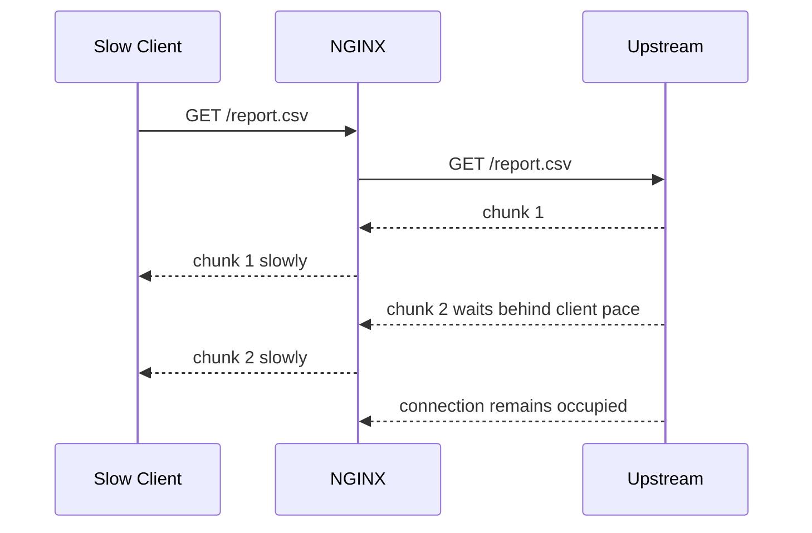
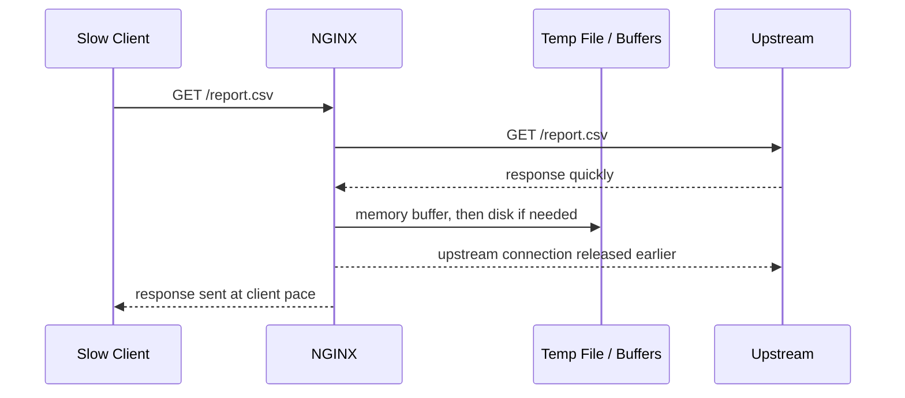
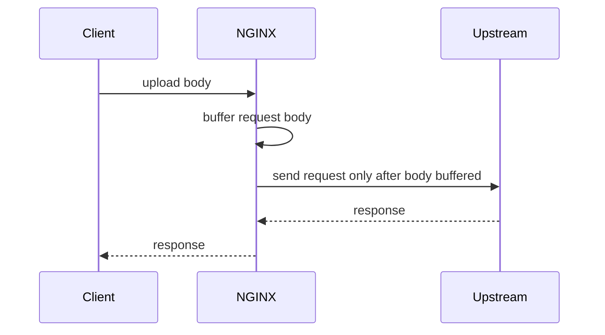
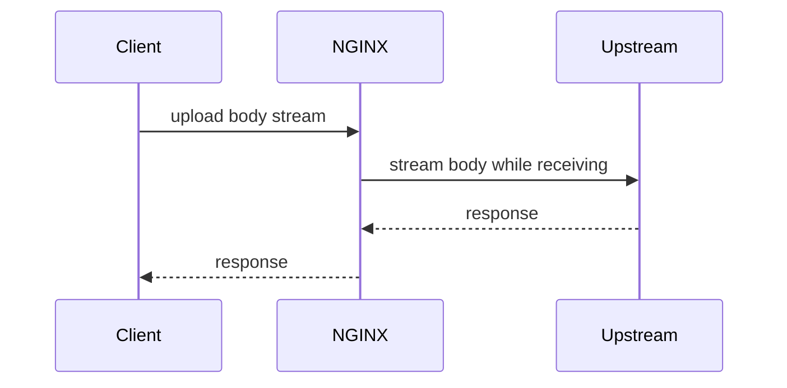

# Part 033 — Proxy Buffering, Temp Files, and Streaming

> Goal part ini: kamu bisa menentukan kapan response harus di-buffer, kapan harus di-stream, berapa risiko memory/disk yang muncul, dan bagaimana menghindari pola reverse proxy yang membuat upstream lambat, disk penuh, atau koneksi real-time rusak.

Banyak engineer menganggap reverse proxy hanya mem-forward byte.

Mental model itu terlalu dangkal.

Dalam praktik production, NGINX bukan cuma pipa. NGINX bisa menjadi **shock absorber** antara dua dunia yang kecepatannya berbeda:

```txt
Client side: browser, mobile app, flaky network, slow download, NAT, proxy corporate
Upstream side: app server, internal network, service mesh, DB-bound API, object storage
```

Buffering adalah mekanisme untuk memisahkan kecepatan upstream dari kecepatan client.

Kalau buffering aktif, NGINX bisa membaca response dari upstream secepat mungkin, menyimpannya di memory buffer, lalu bila tidak cukup, menulis sebagian response ke temporary file di disk. Setelah itu NGINX mengirim response ke client dengan kecepatan client.

Kalau buffering nonaktif, NGINX meneruskan data ke client segera saat diterima dari upstream. Ini membuat upstream lebih lama terikat pada kecepatan client.

Perbedaan kecil ini mengubah banyak hal:

- memory usage;
- disk I/O;
- upstream connection occupancy;
- latency first byte;
- latency last byte;
- behavior untuk SSE/WebSocket-like stream;
- behavior untuk file besar;
- observability dan incident mode.

---

## 1. Reverse Proxy Is a Decoupling Layer

Tanpa buffering:



Dengan buffering:



Invariant production-nya:

> Buffering memperpendek waktu upstream connection ditempati oleh slow client, tetapi memindahkan pressure ke NGINX memory/disk.

Jadi buffering bukan “fast” atau “slow”. Buffering adalah pertukaran pressure.

---

## 2. Response Buffering: `proxy_buffering`

Directive utama:

```nginx
location /api/ {
    proxy_pass http://app_backend;

    proxy_buffering on;
    proxy_buffer_size 8k;
    proxy_buffers 16 16k;
    proxy_busy_buffers_size 64k;
    proxy_max_temp_file_size 256m;
    proxy_temp_file_write_size 64k;
}
```

Makna praktisnya:

| Directive | Fungsi |
|---|---|
| `proxy_buffering` | Mengaktifkan/menonaktifkan buffering response dari upstream |
| `proxy_buffer_size` | Buffer untuk bagian awal response, biasanya response header |
| `proxy_buffers` | Jumlah dan ukuran buffer untuk body response |
| `proxy_busy_buffers_size` | Batas buffer yang boleh sibuk dikirim ke client |
| `proxy_max_temp_file_size` | Batas response yang boleh ditulis ke temporary file |
| `proxy_temp_file_write_size` | Ukuran write chunk ke temporary file |
| `proxy_temp_path` | Lokasi file temporary proxy |

NGINX menyimpan bagian awal response dari upstream di `proxy_buffer_size`. Bagian ini biasanya berisi response header. Body response masuk ke `proxy_buffers`. Jika response tidak muat di memory buffer dan temp file diperbolehkan, NGINX menulis sebagian response ke disk.

---

## 3. Buffering Is Usually Good for Normal HTTP APIs

Untuk mayoritas request HTTP biasa, buffering aktif adalah default yang masuk akal.

Contoh:

- JSON API;
- HTML page;
- generated report kecil sampai sedang;
- image/file yang tidak perlu real-time streaming;
- upstream yang mahal koneksinya;
- backend Java/Node/Go yang worker/thread/socket-nya harus dilepas secepat mungkin.

Dengan buffering aktif, NGINX bisa membaca response upstream cepat, melepas upstream connection, lalu mengirim ke client secara terpisah.

Ini penting ketika client lambat.

Misalnya backend mengirim 20 MB response dalam 200 ms di internal network, tapi mobile client butuh 40 detik untuk download. Tanpa buffering, upstream connection bisa terikat 40 detik. Dengan buffering, upstream bisa selesai lebih cepat, tetapi NGINX menanggung memory/disk selama client belum selesai.

Trade-off:

```txt
buffering on  -> upstream protected, NGINX memory/disk exposed
buffering off -> NGINX lighter per response, upstream exposed to slow clients
```

---

## 4. Buffering Breaks Some Streaming Use Cases

Ada response yang correctness-nya bergantung pada immediate flush.

Contoh:

- Server-Sent Events;
- long-polling tertentu;
- incremental logs;
- progress stream;
- chunked AI/token stream;
- tail-like endpoint;
- some gRPC-like streaming through HTTP paths, jika bukan `grpc_pass`;
- upstream yang sengaja mengirim heartbeat periodik.

Untuk endpoint seperti ini, buffering dapat membuat client tidak menerima event sampai buffer penuh atau response selesai.

Config umum untuk SSE:

```nginx
location /events/ {
    proxy_pass http://app_backend;

    proxy_http_version 1.1;
    proxy_set_header Connection "";

    proxy_buffering off;
    proxy_cache off;

    proxy_read_timeout 1h;
}
```

Untuk stream token:

```nginx
location /api/chat/stream {
    proxy_pass http://app_backend;

    proxy_http_version 1.1;
    proxy_set_header Connection "";

    proxy_buffering off;
    proxy_request_buffering off;
    proxy_read_timeout 10m;
}
```

Kuncinya:

> Jangan mematikan buffering secara global hanya karena satu endpoint butuh streaming.

Gunakan location spesifik.

Buruk:

```nginx
http {
    proxy_buffering off;
}
```

Lebih aman:

```nginx
location /api/ {
    proxy_buffering on;
    proxy_pass http://app_backend;
}

location /api/events/ {
    proxy_buffering off;
    proxy_pass http://app_backend;
}
```

---

## 5. Request Buffering Is Different from Response Buffering

Dua directive yang sering tertukar:

```nginx
proxy_request_buffering on;
proxy_buffering on;
```

| Directive | Arah data | Pertanyaan yang dijawab |
|---|---|---|
| `proxy_request_buffering` | Client → NGINX → upstream | Apakah request body client dibaca penuh dulu oleh NGINX sebelum dikirim ke upstream? |
| `proxy_buffering` | Upstream → NGINX → client | Apakah response upstream disimpan dulu oleh NGINX sebelum dikirim ke client? |

Request buffering aktif:



Request buffering nonaktif:



Default `proxy_request_buffering on` sering melindungi upstream dari slow upload client. NGINX menerima body dari client, lalu baru mengirim ke upstream.

Tetapi untuk upload besar atau streaming request body, ini bisa buruk karena:

- NGINX harus menyimpan body ke memory/temp file;
- latency upstream mulai bekerja tertunda sampai body selesai;
- disk temp path bisa penuh;
- progress processing di backend tidak bisa dimulai lebih awal.

Contoh upload besar ke object-ingestion service:

```nginx
location /upload/ {
    proxy_pass http://upload_backend;

    client_max_body_size 2g;
    proxy_request_buffering off;
    proxy_buffering off;
    proxy_read_timeout 10m;
    proxy_send_timeout 10m;
}
```

Tetapi jangan memakai ini untuk semua endpoint. Jika request body kecil dan backend mahal, request buffering aktif lebih aman.

---

## 6. Temporary Files Are Part of the Design, Not an Accident

Ketika response tidak muat di buffer memory, NGINX bisa memakai temp file.

Default path bergantung instalasi/distribusi. Production config sebaiknya eksplisit:

```nginx
http {
    proxy_temp_path /var/cache/nginx/proxy_temp 1 2;
}
```

Contoh layout:

```txt
/var/cache/nginx/
├── proxy_temp/
├── fastcgi_temp/
├── uwsgi_temp/
├── scgi_temp/
└── client_temp/
```

Hal-hal yang harus diputuskan:

| Area | Pertanyaan production |
|---|---|
| Filesystem | Apakah temp path berada di disk yang cukup cepat dan cukup besar? |
| Isolation | Apakah temp file bercampur dengan root filesystem? |
| Quota | Apakah ada batas agar disk penuh tidak menjatuhkan host? |
| Monitoring | Apakah disk usage dan inode usage dipantau? |
| Permissions | Apakah user NGINX bisa menulis ke temp path? |
| Container | Apakah temp path ephemeral, writable, dan tidak terlalu kecil? |
| Security | Apakah temp path tidak bisa diakses sebagai static web root? |

Jangan taruh temp path di bawah directory public static.

Buruk:

```nginx
root /srv/www/public;
proxy_temp_path /srv/www/public/tmp;
```

Lebih aman:

```nginx
root /srv/www/public;
proxy_temp_path /var/cache/nginx/proxy_temp 1 2;
```

---

## 7. Memory Model: Buffer Sizing Is Per Request

Kesalahan umum: menghitung buffer seperti global pool tetap.

Misalnya:

```nginx
proxy_buffer_size 8k;
proxy_buffers 16 16k;
```

Secara kasar, satu active proxied request bisa memakai:

```txt
8 KiB + 16 * 16 KiB = 264 KiB
```

Belum termasuk:

- connection structures;
- request headers;
- output chain;
- TLS buffers;
- OS socket buffers;
- temp file metadata;
- module overhead.

Kalau ada 10.000 concurrent proxied responses yang aktif:

```txt
264 KiB * 10,000 = ~2.5 GiB theoretical buffer exposure
```

Tidak semua request memakai penuh, tetapi sizing harus dipikirkan sebagai exposure envelope.

Rule praktis:

> Buffer tuning harus dihitung bersama concurrency, response size distribution, dan disk spill policy.

Jangan hanya copy:

```nginx
proxy_buffers 64 256k;
```

Karena itu bisa membuat satu request punya envelope besar. Pada concurrency tinggi, memory pressure bisa muncul cepat.

---

## 8. Disk Model: Temp File Is a Pressure Valve

Temp file membantu memory, tetapi bisa memindahkan bottleneck ke disk.

Gejala disk temp pressure:

- latency response naik;
- `iowait` naik;
- disk usage `/var/cache/nginx` naik cepat;
- error log berisi indikasi buffering ke temporary file;
- 500/502/504 meningkat karena write failure;
- container restart karena ephemeral storage penuh;
- node Kubernetes kena eviction karena ephemeral storage pressure.

Design decision:

| Strategy | Cocok untuk | Risiko |
|---|---|---|
| Allow temp files | Response besar, slow clients, upstream harus cepat dilepas | Disk pressure |
| Disable temp files dengan `proxy_max_temp_file_size 0` | Response sebaiknya tetap di memory atau diperlakukan streaming | Slow clients bisa menahan upstream/NGINX buffer behavior berubah |
| Dedicated cache/temp volume | High traffic proxy/cache | Operasional volume lebih kompleks |
| Endpoint-specific buffering off | SSE/stream | Upstream terikat client pace |

Contoh membatasi temp file per response:

```nginx
location /api/ {
    proxy_pass http://app_backend;

    proxy_buffering on;
    proxy_buffers 16 16k;
    proxy_max_temp_file_size 64m;
}
```

Contoh response besar sengaja di-stream:

```nginx
location /exports/ {
    proxy_pass http://export_backend;

    proxy_buffering off;
    proxy_request_buffering off;
    proxy_read_timeout 30m;
}
```

---

## 9. `X-Accel-Buffering`: Let Upstream Decide Per Response

NGINX dapat mengubah buffering berdasarkan response header dari upstream.

Pola yang sering dipakai:

```http
X-Accel-Buffering: no
```

Ini memungkinkan application mematikan buffering untuk response tertentu, misalnya event stream, tanpa membuat config NGINX terlalu banyak location.

Contoh app response:

```http
HTTP/1.1 200 OK
Content-Type: text/event-stream
Cache-Control: no-cache
X-Accel-Buffering: no
```

Tetapi jangan memperlakukan ini sebagai escape hatch tanpa governance.

Risiko:

- developer app tanpa sadar mematikan buffering untuk endpoint high-volume;
- upstream connection occupancy naik;
- slow clients menahan backend;
- traffic spike menjadi backend thread/socket exhaustion.

Production policy:

```nginx
location /api/ {
    proxy_pass http://app_backend;

    proxy_buffering on;

    # Optional: hide upstream attempt to control acceleration unless explicitly allowed.
    # proxy_ignore_headers X-Accel-Buffering;
}
```

Gunakan header ini hanya jika tim memahami ownership-nya.

---

## 10. Buffering and Cache Are Related but Not the Same

Jangan menyamakan buffering dengan caching.

| Mechanism | Tujuan | Persist setelah response selesai? |
|---|---|---|
| Proxy buffering | Menjembatani speed upstream/client | Tidak sebagai cache reusable |
| Proxy cache | Menyimpan response untuk reuse request berikutnya | Ya, selama cache valid |

Config buffering:

```nginx
proxy_buffering on;
```

Config cache:

```nginx
proxy_cache api_cache;
proxy_cache_valid 200 5m;
```

Buffering bisa terjadi walaupun cache off. Cache biasanya membutuhkan buffering agar response bisa disimpan, tetapi keduanya bukan konsep yang sama.

---

## 11. Streaming Pattern Catalog

### 11.1 SSE

```nginx
location /sse/ {
    proxy_pass http://app_backend;

    proxy_http_version 1.1;
    proxy_set_header Connection "";

    proxy_buffering off;
    proxy_cache off;
    proxy_read_timeout 1h;
}
```

App harus mengirim:

```http
Content-Type: text/event-stream
Cache-Control: no-cache
```

### 11.2 Incremental Log Tail

```nginx
location /logs/tail/ {
    proxy_pass http://ops_backend;

    proxy_buffering off;
    proxy_read_timeout 30m;
}
```

Tambahkan auth kuat. Endpoint log sering sensitif.

### 11.3 AI Token Streaming

```nginx
location /api/ai/stream {
    proxy_pass http://ai_backend;

    proxy_http_version 1.1;
    proxy_set_header Connection "";

    proxy_buffering off;
    proxy_cache off;
    proxy_read_timeout 10m;
}
```

Observability penting:

```nginx
log_format stream_api '$remote_addr "$request" status=$status '
                      'request_time=$request_time '
                      'upstream_response_time=$upstream_response_time '
                      'upstream_status=$upstream_status';
```

### 11.4 File Download Generated by Backend

Untuk file generated biasa, buffering aktif sering lebih aman:

```nginx
location /reports/download/ {
    proxy_pass http://report_backend;

    proxy_buffering on;
    proxy_buffers 16 32k;
    proxy_max_temp_file_size 1g;
    proxy_read_timeout 10m;
}
```

Tetapi untuk file yang sangat besar, pertimbangkan arsitektur lebih baik:

```txt
request report -> backend creates object -> client downloads from object store/CDN/nginx static path
```

Jangan selalu menjadikan app server sebagai long-lived file pump.

---

## 12. Anti-Patterns

### Anti-pattern 1 — Disable buffering globally

```nginx
http {
    proxy_buffering off;
}
```

Dampak:

- semua upstream terkena slow client;
- backend connection occupancy naik;
- API biasa kehilangan proteksi;
- incident latency lebih sulit dikendalikan.

Lebih baik:

```nginx
location /api/ {
    proxy_buffering on;
}

location /api/events/ {
    proxy_buffering off;
}
```

### Anti-pattern 2 — Giant buffers tanpa capacity model

```nginx
proxy_buffers 64 256k;
```

Satu request bisa punya envelope besar. Pada concurrency tinggi, memory pressure jadi cepat.

### Anti-pattern 3 — Temp path di root filesystem kecil

```nginx
proxy_temp_path /tmp;
```

Di container atau VM kecil, `/tmp` bisa berbagi root filesystem. Saat penuh, bukan hanya NGINX yang rusak.

### Anti-pattern 4 — Streaming endpoint memakai default timeout pendek

```nginx
location /events/ {
    proxy_buffering off;
    proxy_pass http://app;
    # proxy_read_timeout default-ish, stream putus diam-diam
}
```

Gunakan timeout yang sesuai heartbeat stream.

### Anti-pattern 5 — Mengira buffering memperbaiki upstream lambat

Buffering membantu slow client. Ia tidak membuat upstream yang lambat menjadi cepat.

Kalau upstream butuh 20 detik untuk first byte, `proxy_buffering on` tidak menyelesaikan itu. Timeout dan upstream capacity tetap harus didesain.

---

## 13. Production Baseline for Buffering

Baseline untuk API biasa:

```nginx
location /api/ {
    proxy_pass http://app_backend;

    proxy_http_version 1.1;
    proxy_set_header Host $host;
    proxy_set_header X-Real-IP $remote_addr;
    proxy_set_header X-Forwarded-For $proxy_add_x_forwarded_for;
    proxy_set_header X-Forwarded-Proto $scheme;

    proxy_buffering on;
    proxy_buffer_size 8k;
    proxy_buffers 16 16k;
    proxy_busy_buffers_size 64k;
    proxy_max_temp_file_size 128m;
    proxy_temp_file_write_size 64k;
}
```

Baseline untuk SSE:

```nginx
location /api/events/ {
    proxy_pass http://app_backend;

    proxy_http_version 1.1;
    proxy_set_header Host $host;
    proxy_set_header Connection "";
    proxy_set_header X-Real-IP $remote_addr;
    proxy_set_header X-Forwarded-For $proxy_add_x_forwarded_for;
    proxy_set_header X-Forwarded-Proto $scheme;

    proxy_buffering off;
    proxy_cache off;
    proxy_read_timeout 1h;
}
```

Baseline untuk upload stream:

```nginx
location /api/upload/ {
    proxy_pass http://upload_backend;

    client_max_body_size 2g;
    proxy_request_buffering off;
    proxy_buffering off;
    proxy_send_timeout 10m;
    proxy_read_timeout 10m;
}
```

---

## 14. Observability: What to Measure

Log format yang membantu:

```nginx
log_format proxy_buffers '$remote_addr $host "$request" '
                         'status=$status bytes_sent=$bytes_sent body_bytes_sent=$body_bytes_sent '
                         'request_length=$request_length request_time=$request_time '
                         'upstream_addr=$upstream_addr upstream_status=$upstream_status '
                         'upstream_response_time=$upstream_response_time '
                         'upstream_connect_time=$upstream_connect_time '
                         'upstream_header_time=$upstream_header_time';
```

Pantau:

| Signal | Kenapa penting |
|---|---|
| `request_time` | Durasi total client-facing |
| `upstream_header_time` | Waktu sampai upstream first byte/header |
| `upstream_response_time` | Durasi upstream response |
| `bytes_sent` | Ukuran response ke client |
| Disk usage temp path | Indikator spill ke disk |
| Disk inode usage | Temp file banyak kecil bisa habiskan inode |
| Error log warning | Indikasi temp file buffering atau write issue |
| Upstream active connections | Apakah buffering off menahan backend |
| Client aborts | Slow/flaky client behavior |

Interpretasi dasar:

```txt
upstream_response_time rendah, request_time tinggi
=> upstream cepat, client lambat atau response besar; buffering/temp path mungkin aktif.

upstream_header_time tinggi
=> upstream lambat menghasilkan first byte; buffering tidak menyelesaikan root cause.

request_time tinggi hanya pada streaming endpoint
=> normal jika stream long-lived; alert harus berbeda.
```

---

## 15. Failure Modes

### 15.1 Disk penuh karena temp file

Gejala:

- 5xx naik;
- error log menampilkan write failure;
- `/var/cache/nginx` penuh;
- Kubernetes node kena ephemeral storage pressure.

Mitigasi:

1. Batasi `proxy_max_temp_file_size`.
2. Pindahkan `proxy_temp_path` ke volume dedicated.
3. Pisahkan endpoint large download.
4. Gunakan object storage/CDN untuk file besar.
5. Tambahkan alert disk usage + inode usage.

### 15.2 Backend thread/socket exhaustion setelah buffering dimatikan

Gejala:

- upstream active connection naik;
- latency backend naik;
- slow clients membuat backend stuck;
- CPU backend mungkin tidak tinggi, tetapi connection pool penuh.

Mitigasi:

1. Aktifkan buffering untuk endpoint biasa.
2. Batasi streaming hanya pada endpoint yang perlu.
3. Gunakan heartbeat dan timeout eksplisit.
4. Tambahkan rate/concurrency limit untuk stream.

### 15.3 SSE tidak muncul di client

Gejala:

- backend mengirim event;
- client menerima setelah lama atau ketika response selesai;
- browser/network tab terlihat pending.

Mitigasi:

```nginx
proxy_buffering off;
proxy_cache off;
proxy_read_timeout 1h;
```

Pastikan upstream mengirim `Content-Type: text/event-stream` dan flush.

### 15.4 Memory pressure karena buffer terlalu besar

Gejala:

- RSS NGINX naik;
- OOM kill;
- latency spike saat GC bukan faktor karena NGINX bukan JVM;
- traffic concurrency tinggi dengan response besar.

Mitigasi:

1. Kecilkan `proxy_buffers`.
2. Izinkan spill ke disk dengan batas wajar.
3. Gunakan endpoint-specific strategy.
4. Pisahkan large-object traffic ke host/pool berbeda.

---

## 16. Decision Matrix

| Use Case | `proxy_buffering` | `proxy_request_buffering` | Catatan |
|---|---:|---:|---|
| JSON API biasa | on | on | Default sehat |
| HTML page | on | on | Baik untuk slow client |
| Static via proxy origin | on | on | Bisa digabung cache |
| SSE | off | on | Long-lived response stream |
| AI token stream | off | usually off/on per app | Butuh immediate flush |
| Large upload processed incrementally | off/on per response | off | Backend harus siap slow client |
| File download generated backend | on atau off | on | Pilih berdasar ukuran dan upstream cost |
| Object storage proxy | on + cache atau redirect | on | Pertimbangkan signed URL/CDN |
| WebSocket | not normal HTTP buffering path | off-ish behavior via upgrade | Bahas detail di Part 037 |

---

## 17. Engineering Checklist

Sebelum merge config reverse proxy:

- Apakah endpoint ini normal request/response atau stream?
- Apakah upstream perlu dilepas cepat dari slow client?
- Berapa distribusi ukuran response p50/p95/p99?
- Berapa concurrency p95/p99?
- Berapa memory envelope dari buffer per request?
- Apakah temp path punya kapasitas, quota, dan alert?
- Apakah response besar seharusnya lewat object storage/CDN?
- Apakah streaming endpoint punya timeout dan heartbeat?
- Apakah log bisa membedakan upstream lambat vs client lambat?
- Apakah buffering dimatikan hanya pada location spesifik?

---

## 18. Mental Model Final

Buffering bukan tuning kosmetik.

Buffering adalah keputusan arsitektur tentang **di mana pressure diserap**.

```txt
Slow client pressure
    with buffering on  -> mostly NGINX memory/disk
    with buffering off -> mostly upstream connection/thread/socket

Large response pressure
    with small buffers -> disk temp path
    with huge buffers  -> memory
    with streaming     -> connection duration

Streaming correctness
    requires disabling buffering where immediate flush matters
```

Engineer production-grade tidak bertanya:

> “Harus on atau off?”

Pertanyaannya:

> “Traffic class ini harus menekan komponen mana saat dunia tidak ideal?”

Itulah cara membaca `proxy_buffering` sebagai desain sistem, bukan sekadar directive.

---

## References

- NGINX official documentation — `ngx_http_proxy_module`
- NGINX Admin Guide — Reverse Proxy
- NGINX official documentation — core module variables and logging
