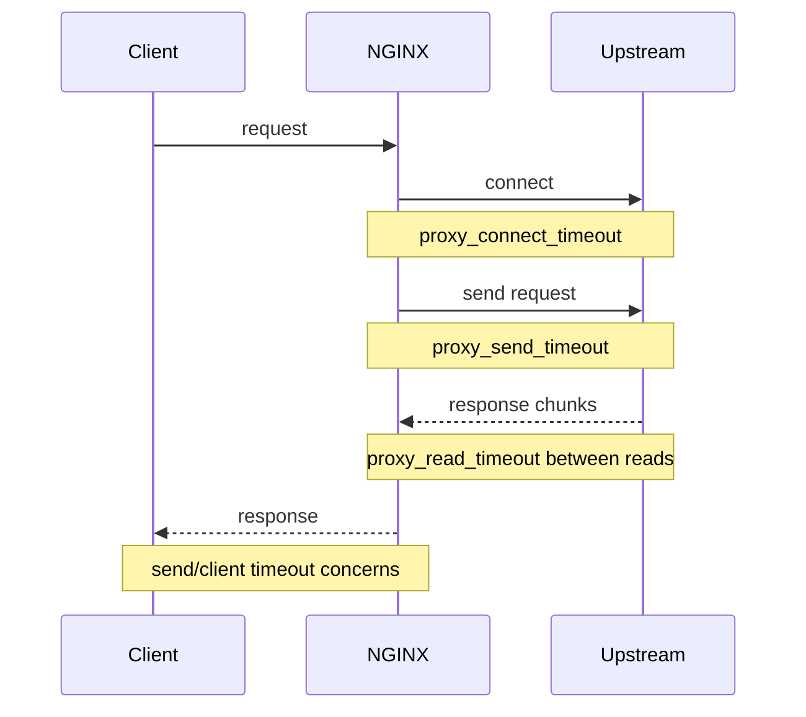
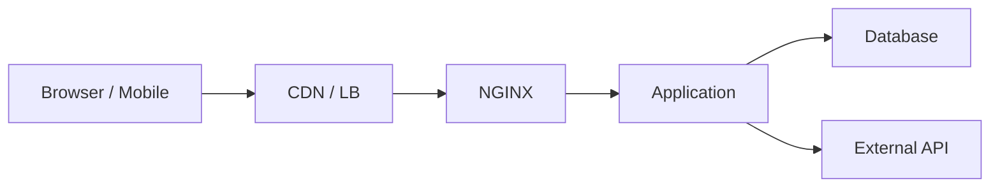

# Part 034 — Timeouts for Real Systems

> Goal part ini: kamu bisa mendesain timeout NGINX sebagai kontrak reliability. Bukan “naikkan timeout sampai error hilang”, tapi menentukan batas waktu connect, send, read, client, keepalive, retry, dan streaming berdasarkan latency budget, idempotency, resource occupancy, dan failure propagation.

Timeout adalah salah satu mekanisme paling penting dalam sistem terdistribusi.

Sayangnya, timeout sering diperlakukan sebagai obat generik:

```nginx
proxy_read_timeout 300s;
```

Lalu 504 hilang.

Tetapi masalahnya tidak selesai. Ia hanya dipindahkan.

Menaikkan timeout bisa:

- menahan worker/upstream connection lebih lama;
- memperlambat failure detection;
- memperbesar queue;
- membuat client menunggu tanpa kepastian;
- menyembunyikan backend saturation;
- menyebabkan retry storm di layer lain;
- membuat incident lebih lama pulih.

Timeout production-grade bukan angka besar. Timeout adalah batas eksplisit atas berapa lama satu dependency boleh menahan request.

---

## 1. Timeout Is a Resource Lease

Saat NGINX menerima request dan meneruskannya ke upstream, beberapa resource dipinjam:

```txt
client socket
NGINX connection state
NGINX buffer/temp file
upstream socket
upstream worker/thread/event loop slot
backend DB connection indirectly
observability/log context
```

Timeout menentukan kapan lease itu dicabut.



Jika timeout terlalu pendek, request valid bisa gagal.

Jika timeout terlalu panjang, failure menjadi lambat dan mahal.

---

## 2. The Three Core Upstream Proxy Timeouts

Untuk reverse proxy HTTP, tiga directive paling penting:

```nginx
proxy_connect_timeout 3s;
proxy_send_timeout 30s;
proxy_read_timeout 30s;
```

| Directive | Arah | Artinya |
|---|---|---|
| `proxy_connect_timeout` | NGINX → upstream | Batas waktu membangun koneksi ke upstream |
| `proxy_send_timeout` | NGINX → upstream | Batas waktu antara dua operasi write ketika mengirim request ke upstream |
| `proxy_read_timeout` | Upstream → NGINX | Batas waktu antara dua operasi read ketika menerima response dari upstream |

Poin penting:

> `proxy_read_timeout` bukan batas total durasi response. Ia adalah batas waktu antara dua operasi read berturut-turut dari upstream.

Artinya, stream yang mengirim heartbeat setiap 15 detik bisa hidup lama walau `proxy_read_timeout 30s`, selama tidak ada gap read lebih dari 30 detik.

Sebaliknya, request biasa yang tidak mengirim apa pun dari upstream selama lebih dari `proxy_read_timeout` akan dianggap timeout.

---

## 3. Timeout Names Map to Phases, Not Business Meaning

Jangan mulai dari pertanyaan:

> “Endpoint ini butuh timeout berapa?”

Mulai dari phase:

```txt
1. accept client
2. read client headers
3. read client body
4. connect to upstream
5. send request to upstream
6. wait for upstream first byte/header
7. read upstream response body
8. send response to client
9. keep idle connection alive
```

NGINX punya directive timeout berbeda untuk phase berbeda.

| Phase | Directive yang relevan |
|---|---|
| Client mengirim header | `client_header_timeout` |
| Client mengirim body | `client_body_timeout` |
| NGINX connect ke upstream | `proxy_connect_timeout` |
| NGINX send request ke upstream | `proxy_send_timeout` |
| NGINX read response upstream | `proxy_read_timeout` |
| NGINX send response ke client | `send_timeout` |
| Idle keepalive client | `keepalive_timeout` |
| Upstream keepalive pool | `keepalive` pada `upstream`, plus keepalive-related proxy headers |

Timeout yang salah di phase yang salah tidak menyelesaikan root cause.

Contoh:

- menaikkan `proxy_read_timeout` tidak memperbaiki client upload lambat;
- menaikkan `client_body_timeout` tidak memperbaiki upstream DB query lambat;
- menaikkan `keepalive_timeout` tidak memperbaiki backend connection refused;
- menaikkan semua timeout hanya membuat incident lebih mahal.

---

## 4. `proxy_connect_timeout`: Dependency Reachability Budget

Contoh:

```nginx
proxy_connect_timeout 2s;
```

Ini mengontrol waktu membangun koneksi TCP ke upstream.

Failure yang biasanya terlihat:

- upstream down;
- port closed;
- SYN dropped;
- network path bermasalah;
- DNS/service discovery mengarah ke alamat buruk;
- security group/firewall salah;
- upstream accept queue penuh.

`proxy_connect_timeout` sebaiknya relatif pendek untuk internal network.

Kenapa?

Karena connect failure biasanya bukan operasi bisnis valid yang butuh lama. Kalau connect ke upstream di jaringan internal butuh puluhan detik, sistem sudah berada dalam mode rusak.

Baseline internal service:

```nginx
proxy_connect_timeout 1s;   # aggressive
proxy_connect_timeout 3s;   # common conservative baseline
proxy_connect_timeout 5s;   # untuk network yang lebih variatif
```

Untuk upstream publik atau cross-region, bisa lebih longgar, tetapi tetap harus punya budget.

Anti-pattern:

```nginx
proxy_connect_timeout 60s;
```

Jika satu upstream mati, request bisa menunggu terlalu lama sebelum failover/retry.

---

## 5. `proxy_send_timeout`: Sending Request to Upstream

Contoh:

```nginx
proxy_send_timeout 30s;
```

Ini bukan total waktu upload request ke upstream. Ini batas antara dua write operation ke upstream.

Kondisi yang membuatnya penting:

- request body besar;
- `proxy_request_buffering off`, sehingga NGINX stream body client ke upstream;
- upstream lambat membaca body;
- upstream connection window/backpressure;
- backend overload sehingga socket receive lambat.

Untuk API JSON kecil, directive ini jarang menjadi bottleneck.

Untuk upload besar, ia penting.

Contoh upload endpoint:

```nginx
location /upload/ {
    proxy_pass http://upload_backend;

    client_max_body_size 2g;
    proxy_request_buffering off;
    proxy_send_timeout 10m;
    proxy_read_timeout 10m;
}
```

Tetapi menaikkan `proxy_send_timeout` berarti upstream boleh menahan request body lebih lama. Pastikan upstream memang dirancang untuk slow body handling.

---

## 6. `proxy_read_timeout`: Waiting for Upstream Response Progress

Contoh:

```nginx
proxy_read_timeout 30s;
```

Ini sering menjadi sumber 504.

Tetapi arti sebenarnya harus tepat:

> NGINX menunggu data dari upstream. Jika tidak ada data baru selama timeout interval, request gagal.

Bukan:

> Seluruh request harus selesai dalam 30 detik.

Dampaknya:

- response yang streaming bisa bertahan lama jika terus mengirim data;
- response yang silent selama lebih dari timeout akan gagal;
- API yang melakukan DB query panjang tanpa output bisa kena timeout walau akhirnya sukses di backend;
- backend mungkin tetap melanjutkan pekerjaan setelah NGINX sudah menyerah, tergantung app/server behavior.

Contoh API biasa:

```nginx
location /api/ {
    proxy_pass http://app_backend;

    proxy_connect_timeout 3s;
    proxy_send_timeout 30s;
    proxy_read_timeout 30s;
}
```

Contoh report generation yang memang lama:

```nginx
location /reports/export/ {
    proxy_pass http://report_backend;

    proxy_connect_timeout 3s;
    proxy_send_timeout 2m;
    proxy_read_timeout 5m;
}
```

Namun pikirkan alternatif yang lebih baik:

```txt
POST /reports -> returns job id
GET /reports/{id}/status -> polling/status
GET /reports/{id}/download -> object/static download
```

Long synchronous request sering menjadi desain buruk jika bisa diganti async job.

---

## 7. Client-Side Timeouts Are Equally Important

NGINX juga harus melindungi diri dari client lambat atau malicious.

Baseline:

```nginx
client_header_timeout 10s;
client_body_timeout 30s;
send_timeout 30s;
keepalive_timeout 30s;
```

| Directive | Fungsi |
|---|---|
| `client_header_timeout` | Berapa lama NGINX menunggu client mengirim full request header |
| `client_body_timeout` | Berapa lama NGINX menunggu body chunk berikutnya dari client |
| `send_timeout` | Berapa lama NGINX menunggu client menerima response progress |
| `keepalive_timeout` | Berapa lama koneksi idle client dipertahankan |

Slowloris-style issue biasanya menyerang fase client header/body. Jangan hanya fokus ke upstream timeout.

Contoh baseline public edge:

```nginx
http {
    client_header_timeout 10s;
    client_body_timeout 30s;
    send_timeout 30s;
    keepalive_timeout 30s;
}
```

Untuk upload endpoint besar, override hanya di location terkait:

```nginx
location /upload/ {
    client_body_timeout 5m;
    client_max_body_size 2g;
    proxy_pass http://upload_backend;
}
```

---

## 8. Keepalive Timeout Is Not Request Timeout

`keepalive_timeout` mengatur idle client connection setelah response selesai, bukan waktu request aktif.

Contoh:

```nginx
keepalive_timeout 30s;
```

Ini berarti NGINX boleh mempertahankan koneksi idle agar client bisa reuse untuk request berikutnya.

Trade-off:

| Keepalive lebih panjang | Keepalive lebih pendek |
|---|---|
| Lebih sedikit TCP/TLS handshake | Lebih sedikit idle connection resource |
| Baik untuk browser traffic | Baik saat connection pressure tinggi |
| Bisa menaikkan idle FD count | Bisa menaikkan handshake overhead |

Untuk public edge, 15–75 detik sering menjadi area wajar, tergantung traffic profile. Jangan set terlalu tinggi tanpa file descriptor dan memory model.

---

## 9. Timeout and Retry Must Be Designed Together

Timeout tidak berdiri sendiri.

Jika request timeout, NGINX bisa mencoba upstream lain tergantung `proxy_next_upstream`.

Contoh:

```nginx
upstream app_backend {
    server 10.0.1.10:8080 max_fails=3 fail_timeout=10s;
    server 10.0.1.11:8080 max_fails=3 fail_timeout=10s;
}

location /api/ {
    proxy_pass http://app_backend;

    proxy_connect_timeout 2s;
    proxy_read_timeout 30s;
    proxy_next_upstream error timeout http_502 http_503 http_504;
    proxy_next_upstream_tries 2;
}
```

Bahaya:

> Retry pada non-idempotent request bisa menggandakan side effect.

Aman relatif:

- `GET /catalog/items`;
- `HEAD`;
- idempotent `PUT` jika benar-benar idempotent;
- request dengan idempotency key yang enforced backend.

Berbahaya:

- `POST /payments`;
- `POST /orders`;
- `POST /case/escalations`;
- `POST /messages/send`;
- request yang membuat side effect tanpa idempotency key.

Pattern lebih aman:

```nginx
map $request_method $retry_policy {
    default "off";
    GET     "error timeout http_502 http_503 http_504";
    HEAD    "error timeout http_502 http_503 http_504";
}
```

NGINX config tidak selalu bisa menerima string variable untuk semua directive sesuai konteks, jadi sering kali lebih sederhana memisahkan location/method handling dengan policy eksplisit. Detail retry akan dibahas lebih dalam di Part 042.

Untuk sekarang, invariant-nya:

> Timeout yang diikuti retry adalah keputusan correctness, bukan hanya reliability.

---

## 10. Latency Budget Design

Misal SLO API public:

```txt
p95 latency <= 500ms
p99 latency <= 1500ms
```

Kalau `proxy_read_timeout 60s`, timeout itu tidak selaras dengan user-facing SLO. Itu tidak selalu salah, tetapi artinya timeout bukan guardrail SLO; ia hanya failure cutoff yang sangat longgar.

Breakdown budget:

```txt
client -> edge network        50ms
NGINX processing             <5ms
upstream connect/reuse       0-20ms
backend app                  300ms p95
DB/external dependency       100ms p95
response transfer            50ms
margin                       75ms
```

Untuk endpoint ini, timeout bisa seperti:

```nginx
proxy_connect_timeout 1s;
proxy_send_timeout 5s;
proxy_read_timeout 5s;
```

Kenapa `proxy_read_timeout` 5s padahal SLO 500ms?

Karena timeout bukan SLO alert. Timeout adalah batas hard failure. Alerting harus berbasis latency distribution sebelum timeout tercapai.

Namun `proxy_read_timeout 300s` untuk endpoint ini hampir pasti menyembunyikan kerusakan.

---

## 11. Endpoint Classes Need Different Timeouts

Jangan satu global timeout untuk semua traffic.

| Class | Example | Timeout style |
|---|---|---|
| Fast API | auth, profile, lookup | connect pendek, read pendek |
| Slow API | report sync, admin batch | read lebih panjang, lebih baik async |
| Upload | file ingestion | body/send lebih panjang |
| Download | generated file | read/send lebih panjang atau object storage |
| Streaming | SSE, logs, AI tokens | read panjang + heartbeat |
| WebSocket | realtime | khusus upgrade + idle timeout panjang |
| Internal admin | low traffic ops | explicit, not accidental long timeout |

Contoh config class-based:

```nginx
location /api/fast/ {
    proxy_pass http://app_backend;
    proxy_connect_timeout 1s;
    proxy_send_timeout 5s;
    proxy_read_timeout 5s;
}

location /api/reports/export/ {
    proxy_pass http://report_backend;
    proxy_connect_timeout 3s;
    proxy_send_timeout 2m;
    proxy_read_timeout 5m;
}

location /api/events/ {
    proxy_pass http://app_backend;
    proxy_buffering off;
    proxy_read_timeout 1h;
}
```

---

## 12. Streaming Requires Heartbeats

Long timeout saja bukan desain streaming yang baik.

Untuk SSE, app harus mengirim heartbeat:

```txt
: heartbeat

```

Misal setiap 15 detik.

NGINX:

```nginx
location /events/ {
    proxy_pass http://app_backend;

    proxy_buffering off;
    proxy_read_timeout 45s;
}
```

Dengan heartbeat 15 detik dan timeout 45 detik, NGINX akan menutup stream jika upstream diam terlalu lama.

Lebih baik daripada:

```nginx
proxy_read_timeout 24h;
```

Karena timeout 24 jam membuat dead stream lebih lama bertahan.

Invariant:

> Streaming yang sehat butuh heartbeat lebih pendek dari read timeout.

---

## 13. 502 vs 504: Do Not Debug Blindly

Secara praktis:

| Status | Makna umum di reverse proxy |
|---|---|
| 502 Bad Gateway | NGINX menerima response invalid/gagal dari upstream atau upstream connection error tertentu |
| 504 Gateway Timeout | Upstream tidak merespons dalam timeout yang ditentukan |

Tetapi jangan hanya lihat status. Lihat error log.

Contoh error log umum:

```txt
upstream timed out (110: Connection timed out) while reading response header from upstream
```

Kemungkinan:

- `proxy_read_timeout` tercapai sebelum upstream mengirim header;
- backend stuck sebelum first byte;
- DB/external dependency backend lambat;
- thread pool/backend event loop penuh.

Contoh:

```txt
connect() failed (111: Connection refused) while connecting to upstream
```

Kemungkinan:

- upstream process down;
- wrong port;
- deployment belum siap;
- health check tidak menahan traffic;
- service discovery stale.

Contoh:

```txt
upstream prematurely closed connection while reading response header from upstream
```

Kemungkinan:

- backend crash;
- backend timeout internal;
- connection reset;
- response header terlalu besar;
- protocol mismatch.

---

## 14. Observability for Timeout RCA

Gunakan log format yang membedakan phase:

```nginx
log_format proxy_timing '$remote_addr $host "$request" '
                        'status=$status request_time=$request_time '
                        'upstream_addr=$upstream_addr '
                        'upstream_status=$upstream_status '
                        'uct=$upstream_connect_time '
                        'uht=$upstream_header_time '
                        'urt=$upstream_response_time '
                        'bytes_sent=$bytes_sent request_length=$request_length';
```

Interpretasi:

| Signal | Arti praktis |
|---|---|
| `uct` tinggi | Connect ke upstream lambat |
| `uht` tinggi | Upstream lambat menghasilkan header/first byte |
| `urt` tinggi | Response upstream lama dibaca |
| `request_time` jauh lebih tinggi dari `urt` | Client lambat atau response transfer lambat |
| `upstream_status` multiple values | Ada retry ke lebih dari satu upstream |
| `status=499` | Client menutup koneksi sebelum response selesai |
| `status=504` | Timeout gateway, cek phase di error log |

Contoh:

```txt
status=504 request_time=30.001 uct=0.002 uht=30.000 urt=30.000
```

Interpretasi:

```txt
connect cepat, upstream tidak mengirim header sebelum proxy_read_timeout 30s
```

Contoh:

```txt
status=200 request_time=45.0 uct=0.001 uht=0.050 urt=0.300 bytes_sent=50000000
```

Interpretasi:

```txt
upstream cepat, total request lama karena transfer besar/client lambat
```

---

## 15. Timeout Layering Across the Stack

Timeout harus konsisten antar layer.



Jika timeout tidak berurutan, muncul perilaku aneh.

Contoh buruk:

```txt
client timeout:          10s
CDN timeout:             60s
NGINX proxy_read:        300s
app request timeout:     none
DB statement timeout:    none
```

Client sudah pergi pada 10 detik, tetapi backend bisa tetap bekerja lama.

Contoh lebih baik:

```txt
client timeout:          10s
CDN timeout:             15s
NGINX proxy_read:        12s
app request timeout:     9s
DB statement timeout:    8s
external API timeout:    2s with retry budget
```

Prinsip umum:

> Inner dependency timeout harus lebih pendek dari outer request timeout, agar failure bisa dikontrol dan response error bisa dikirim sebelum caller menyerah.

Tidak selalu harus strict secara matematis, tetapi harus disengaja.

---

## 16. Regulatory / Case Management Example

Misal sistem enforcement lifecycle punya endpoint:

```txt
POST /cases/{caseId}/escalations
```

Endpoint ini non-idempotent jika membuat escalation baru.

Jika NGINX timeout lalu retry ke upstream lain, bisa terjadi:

```txt
client sends POST
upstream A creates escalation but response delayed
NGINX times out
NGINX retries to upstream B
upstream B creates second escalation
client receives success/error inconsistent
```

Solusi bukan “timeout lebih besar” saja.

Solusi correctness:

- gunakan idempotency key;
- backend enforce uniqueness per command id;
- NGINX jangan retry unsafe method secara otomatis;
- request timeout backend lebih pendek dari NGINX timeout;
- audit event memiliki command correlation id;
- response ambiguity ditangani oleh client dengan status query, bukan repeat blind write.

NGINX config:

```nginx
location /cases/ {
    proxy_pass http://case_backend;

    proxy_connect_timeout 2s;
    proxy_send_timeout 10s;
    proxy_read_timeout 15s;

    # Hati-hati dengan retry non-idempotent.
    proxy_next_upstream error timeout;
    proxy_next_upstream_tries 1;
}
```

`proxy_next_upstream_tries 1` berarti tidak mencoba upstream tambahan. Ini menjaga correctness untuk write path, walau availability lebih rendah.

---

## 17. Timeout Profiles

### 17.1 Fast Public API

```nginx
location /api/ {
    proxy_pass http://app_backend;

    proxy_connect_timeout 1s;
    proxy_send_timeout 5s;
    proxy_read_timeout 10s;
    send_timeout 30s;
}
```

### 17.2 Internal API with Moderate Work

```nginx
location /internal-api/ {
    allow 10.0.0.0/8;
    deny all;

    proxy_pass http://internal_backend;

    proxy_connect_timeout 2s;
    proxy_send_timeout 15s;
    proxy_read_timeout 30s;
}
```

### 17.3 Long Report Export

```nginx
location /reports/export/ {
    proxy_pass http://report_backend;

    proxy_connect_timeout 3s;
    proxy_send_timeout 2m;
    proxy_read_timeout 5m;
}
```

Tetap pertimbangkan async job.

### 17.4 SSE

```nginx
location /events/ {
    proxy_pass http://app_backend;

    proxy_buffering off;
    proxy_connect_timeout 2s;
    proxy_read_timeout 45s;
}
```

App heartbeat setiap 15 detik.

### 17.5 Upload

```nginx
location /upload/ {
    proxy_pass http://upload_backend;

    client_max_body_size 2g;
    client_body_timeout 5m;
    proxy_request_buffering off;
    proxy_send_timeout 5m;
    proxy_read_timeout 5m;
}
```

---

## 18. Anti-Patterns

### Anti-pattern 1 — “Fix 504 by setting 1 hour globally”

```nginx
http {
    proxy_read_timeout 3600s;
}
```

Dampak:

- semua endpoint bisa menahan resource sangat lama;
- backend issue lebih lambat muncul;
- client mungkin sudah timeout lebih dulu;
- queue/connection pool bisa penuh;
- incident menjadi kabur.

### Anti-pattern 2 — Same timeout for all endpoints

```nginx
proxy_read_timeout 60s;
```

Untuk fast API terlalu lama. Untuk stream terlalu pendek. Untuk upload belum tentu relevan.

### Anti-pattern 3 — NGINX timeout lebih panjang dari semua caller

Jika mobile client timeout 15 detik, CDN timeout 30 detik, tapi NGINX 5 menit, banyak pekerjaan backend bisa orphaned.

### Anti-pattern 4 — Retry after timeout on unsafe writes

Availability naik sedikit, correctness bisa rusak parah.

### Anti-pattern 5 — Long timeout without observability

Timeout panjang tanpa `upstream_*_time` log membuat RCA hampir mustahil.

---

## 19. Incident Playbook: 504 Spike

Saat 504 naik:

1. **Baca error log**, jangan hanya dashboard status.
2. Cek apakah timeout terjadi while connecting, sending, atau reading.
3. Cek `upstream_connect_time`, `upstream_header_time`, `upstream_response_time`.
4. Cek apakah hanya endpoint tertentu atau global.
5. Cek deployment upstream terbaru.
6. Cek backend saturation: CPU, thread pool, event loop lag, DB pool, queue.
7. Cek dependency backend: DB statement timeout, external API latency.
8. Cek apakah NGINX retry memperparah load.
9. Untuk write path, cek duplicate side effect/idempotency.
10. Turunkan blast radius: disable expensive endpoint, shed load, route to degraded response, atau rollback.

Temporary mitigation yang masuk akal:

```nginx
location /expensive-report/ {
    return 503 "report export temporarily unavailable\n";
}
```

Lebih baik memberi 503 cepat daripada membiarkan request menggantung dan menjatuhkan sistem lain.

---

## 20. Review Checklist

Sebelum merge timeout config:

- Apa class endpoint ini: fast, slow, upload, download, stream, websocket?
- Apakah angka timeout selaras dengan SLO dan caller timeout?
- Apakah backend punya internal request timeout lebih pendek?
- Apakah DB/external API timeout lebih pendek dari backend request timeout?
- Apakah retry aman secara idempotency?
- Apakah streaming endpoint punya heartbeat?
- Apakah upload endpoint butuh `proxy_request_buffering off`?
- Apakah `proxy_read_timeout` dipakai untuk menyembunyikan desain sync long-running?
- Apakah log format menyimpan `upstream_connect_time`, `upstream_header_time`, dan `upstream_response_time`?
- Apakah alert berbasis latency muncul sebelum timeout massal terjadi?

---

## 21. Mental Model Final

Timeout adalah **failure boundary**.

Ia menjawab:

```txt
Berapa lama satu request boleh meminjam resource sistem ini
sebelum kita menganggap dependency tidak lagi sehat untuk request tersebut?
```

Timeout yang baik:

- berbeda per traffic class;
- lebih pendek untuk connect failure;
- cukup panjang untuk legitimate long-lived stream;
- lebih pendek di inner dependency daripada outer caller;
- tidak otomatis retry unsafe writes;
- diobservasi dengan phase-level timing;
- dipakai sebagai guardrail, bukan penyembunyi desain buruk.

Jangan menghafal angka.

Bangun budget.

Lalu buat NGINX menegakkan budget itu.

---

## References

- NGINX official documentation — `ngx_http_proxy_module`
- NGINX official documentation — `ngx_http_core_module`
- NGINX Admin Guide — Reverse Proxy
