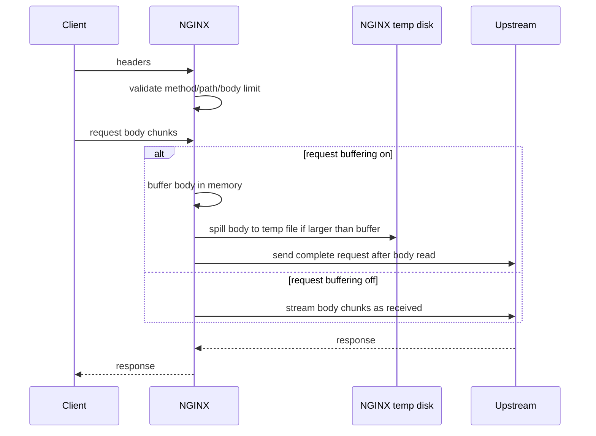
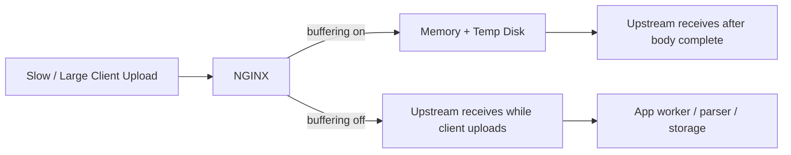

# Part 035 — Request Body Size, Upload, and Backpressure

> Goal part ini: kamu bisa mendesain request body handling di NGINX dengan benar: batas ukuran, buffering, temporary file, streaming upload, timeout, disk pressure, retry semantics, dan backpressure. Fokusnya bukan “cara upload file lewat NGINX”, tapi bagaimana NGINX mengatur pressure dari client ke upstream tanpa merusak reliability.

Request body adalah bagian request yang paling mahal.

Header biasanya kecil. URI biasanya kecil. Method kecil. Tetapi body bisa 1 KB, 10 MB, 5 GB, atau stream yang tidak selesai dalam waktu lama.

Di production, request body adalah sumber pressure pada:

```txt
client socket
NGINX memory buffer
NGINX temporary disk
upstream connection
upstream request parser
application worker/thread/event loop
object storage or database layer
observability pipeline
```

Karena itu, upload bukan sekadar fitur UI. Upload adalah desain flow control.

---

## 1. Request Body Is Ingress Load

Saat client mengirim body, NGINX harus memutuskan:

1. Apakah body ini boleh diterima?
2. Seberapa besar body maksimum?
3. Apakah body dibaca penuh dulu sebelum dikirim ke upstream?
4. Apakah body boleh ditulis ke temporary file?
5. Apa yang terjadi jika client lambat?
6. Apa yang terjadi jika upstream lambat?
7. Apakah request boleh di-retry ke upstream lain?
8. Bagaimana disk pressure dimonitor?

Ini bukan detail kecil. Ini memengaruhi failure mode seluruh edge tier.



Mental model yang benar:

> NGINX bisa menjadi shock absorber antara slow/untrusted client dan expensive upstream.

Tetapi shock absorber itu memakai resource. Biasanya memory dan disk.

---

## 2. Directive Utama untuk Request Body

Untuk reverse proxy upload, directive yang paling sering menentukan behavior:

```nginx
client_max_body_size 10m;
client_body_buffer_size 128k;
client_body_temp_path /var/lib/nginx/body_temp 1 2;
client_body_timeout 30s;

location /api/upload/ {
    proxy_request_buffering on;
    proxy_pass http://upload_backend;
}
```

| Directive | Fungsi |
|---|---|
| `client_max_body_size` | Batas maksimum ukuran request body yang diterima dari client |
| `client_body_buffer_size` | Ukuran buffer memory untuk membaca body client |
| `client_body_temp_path` | Lokasi temporary file untuk body yang tidak muat di buffer |
| `client_body_timeout` | Timeout antar operasi read body dari client |
| `proxy_request_buffering` | Apakah body dibaca penuh dulu sebelum dikirim ke upstream |
| `proxy_pass_request_body` | Apakah body client diteruskan ke upstream |
| `proxy_set_body` | Mengganti body yang dikirim ke upstream |

Default penting:

```txt
client_max_body_size default: 1m
proxy_request_buffering default: on
client_body_timeout default: 60s
```

Konsekuensi default:

- upload > 1 MB akan ditolak jika tidak dikonfigurasi;
- body biasanya dibaca penuh oleh NGINX sebelum dikirim ke upstream;
- body besar bisa memakai temporary file;
- upstream terlindungi dari slow upload client, tetapi NGINX disk bisa menjadi bottleneck.

---

## 3. `client_max_body_size`: Batas Kontrak, Bukan Angka Random

`client_max_body_size` menentukan maksimum ukuran body request.

```nginx
server {
    client_max_body_size 1m;

    location /api/profile/avatar {
        client_max_body_size 5m;
        proxy_pass http://app;
    }

    location /api/documents/upload {
        client_max_body_size 100m;
        proxy_pass http://upload_service;
    }
}
```

Jangan set global terlalu besar hanya karena satu endpoint butuh upload.

Buruk:

```nginx
http {
    client_max_body_size 2g;
}
```

Itu membuat semua endpoint menerima body raksasa, termasuk endpoint yang seharusnya hanya menerima JSON kecil.

Lebih sehat:

```nginx
http {
    client_max_body_size 1m;

    server {
        location /api/ {
            proxy_pass http://api;
        }

        location /api/uploads/ {
            client_max_body_size 100m;
            proxy_pass http://upload_api;
        }
    }
}
```

Invariant:

> Body limit harus mengikuti kontrak endpoint, bukan kenyamanan deployment.

Jika endpoint adalah `POST /api/orders`, biasanya body raksasa adalah bug atau serangan.

Jika endpoint adalah `POST /api/videos`, body besar adalah bagian domain.

---

## 4. 413 Is a Useful Boundary

Ketika body melebihi `client_max_body_size`, NGINX mengembalikan `413 Request Entity Too Large`.

Ini bagus.

413 berarti request ditolak sebelum upstream membayar biaya parsing, auth deep processing, database transaction, atau object storage upload.

Kamu bisa membuat response 413 yang jelas:

```nginx
server {
    client_max_body_size 10m;

    error_page 413 /errors/413.json;

    location = /errors/413.json {
        internal;
        default_type application/json;
        return 413 '{"error":"payload_too_large","max":"10MB"}\n';
    }
}
```

Namun jangan bergantung pada browser untuk menampilkan 413 dengan baik. Banyak client UX perlu menangani error upload sendiri.

Untuk API, lebih baik dokumentasikan limit:

```txt
POST /api/profile/avatar
max body: 5 MiB
content-type: image/jpeg,image/png,image/webp
413 payload_too_large
```

---

## 5. Body Buffering: Memory First, Disk Later

`client_body_buffer_size` mengatur buffer untuk membaca body client.

```nginx
client_body_buffer_size 128k;
```

Jika body lebih besar dari buffer, NGINX dapat menulis body ke temporary file.

```nginx
client_body_temp_path /var/lib/nginx/client_body_temp 1 2;
```

Pikirkan ini sebagai storage hierarchy:

```txt
small body  -> memory buffer
large body  -> memory + temp file
huge body   -> rejected by client_max_body_size or consumes temp disk
```

Jangan menaikkan `client_body_buffer_size` secara besar-besaran untuk menghindari disk.

Buruk:

```nginx
client_body_buffer_size 50m;
```

Jika ada 1.000 concurrent upload, potensi memory pressure menjadi besar.

Lebih baik:

```nginx
client_body_buffer_size 128k;
client_body_temp_path /var/lib/nginx/client_body_temp 1 2;
client_max_body_size 100m;
```

Lalu kapasitas disk temp path dihitung eksplisit.

---

## 6. Temporary File Is Part of Architecture

Banyak engineer menganggap temp file sebagai detail implementasi.

Di production, temp file adalah dependency.

Ia butuh:

- filesystem yang cukup cepat;
- capacity limit;
- alert disk usage;
- permission benar;
- isolasi dari root filesystem;
- cleanup behavior yang dipahami;
- runbook ketika penuh.

Layout yang lebih aman:

```nginx
http {
    client_body_temp_path /var/lib/nginx/client_body_temp 1 2;
}
```

Filesystem:

```txt
/var/lib/nginx/client_body_temp  -> dedicated mount or quota
/var/log/nginx                   -> log mount or quota
/var/cache/nginx                 -> cache mount or quota
/                                -> jangan sampai penuh karena temp body
```

Jika temp body memakai root filesystem dan disk penuh, efeknya bisa merusak komponen lain:

```txt
upload spike
  -> / penuh
  -> NGINX gagal menulis temp body
  -> log gagal
  -> service lain gagal membuat file
  -> node menjadi tidak stabil
```

Invariant:

> Semua path yang bisa tumbuh karena traffic harus dianggap resource production, bukan folder biasa.

---

## 7. `proxy_request_buffering on`: NGINX Menjadi Gate

Default `proxy_request_buffering on` berarti NGINX membaca seluruh body dari client sebelum mengirim request ke upstream.

```nginx
location /api/upload/ {
    proxy_request_buffering on;
    proxy_pass http://upload_backend;
}
```

Kelebihan:

- upstream tidak terikat pada slow upload client;
- NGINX bisa reject body terlalu besar lebih awal;
- upstream menerima request setelah body lengkap;
- retry ke upstream lain lebih mungkin sebelum body dikirim;
- backend worker/thread tidak diikat lama hanya karena client upload lambat.

Biaya:

- NGINX memakai memory/disk;
- upload besar bisa memenuhi temp disk;
- latency ke upstream dimulai setelah body lengkap diterima;
- aplikasi tidak bisa memproses stream secara incremental dari awal;
- progress dari upstream tidak relevan sampai body selesai dibaca.

Pattern cocok:

```txt
small/medium API body
normal multipart upload
backend servlet/thread-per-request
backend mahal dan tidak ingin diikat slow client
request yang aman di-buffer dulu
```

---

## 8. `proxy_request_buffering off`: NGINX Menjadi Pipe

Jika buffering dimatikan, NGINX mengirim body ke upstream segera saat diterima.

```nginx
location /api/stream-upload/ {
    proxy_request_buffering off;
    proxy_http_version 1.1;
    proxy_pass http://stream_upload_backend;
}
```

Kelebihan:

- upstream bisa memproses body secara streaming;
- NGINX tidak perlu menyimpan seluruh body;
- cocok untuk upload sangat besar yang tidak seharusnya melewati disk NGINX;
- latency first-byte ke upstream lebih rendah.

Biaya:

- upstream terikat pada speed client;
- slow client bisa menahan upstream connection lama;
- retry ke upstream lain menjadi terbatas setelah body mulai dikirim;
- backend harus punya backpressure dan timeout yang matang;
- debugging lebih sulit karena request partial bisa sudah sampai backend.

Pattern cocok:

```txt
streaming ingestion service
large media upload processor
custom protocol over HTTP body
backend reactive/event-driven yang memang siap slow input
edge yang tidak boleh menjadi temp storage
```

Pattern tidak cocok:

```txt
backend thread-per-request kecil
endpoint biasa yang hanya menerima JSON
upstream yang tidak punya timeout/read limit
request yang perlu safe retry otomatis
```

---

## 9. Buffered vs Streaming Upload: Decision Matrix

| Use Case | `client_max_body_size` | `proxy_request_buffering` | Rationale |
|---|---:|---:|---|
| JSON API biasa | 256k–2m | on | Reject anomali, lindungi app |
| Form kecil | 1m–10m | on | Sederhana dan aman |
| Avatar upload | 5m–20m | on | Body finite, validasi app |
| Document upload | 50m–250m | on/off tergantung backend | Disk vs upstream occupancy |
| Video upload besar | sering lebih baik direct-to-object-storage | hindari NGINX jika bisa | Edge bukan object store |
| Streaming ingestion | domain-specific | off | Backend memproses stream |
| Webhook | kecil dan ketat | on | Hindari abuse payload besar |
| GraphQL/REST admin | kecil/medium | on | Query besar harus dikontrol |

Rule of thumb:

> Default-kan buffering on. Matikan hanya ketika endpoint memang didesain untuk streaming request body dan upstream siap menerima pressure client.

---

## 10. Backpressure: Siapa yang Menunggu Siapa?

Backpressure adalah mekanisme agar producer tidak mengirim lebih cepat dari consumer.

Dalam upload, producer adalah client.

Consumer bisa:

- NGINX memory buffer;
- NGINX temp disk;
- upstream socket;
- application parser;
- object storage;
- database;
- downstream queue.

Dengan buffering on:

```txt
client -> NGINX memory/disk -> upstream
```

Backpressure utama berhenti di NGINX.

Dengan buffering off:

```txt
client -> NGINX -> upstream -> app processing path
```

Backpressure menembus sampai upstream.

Tidak ada pilihan yang selalu benar. Yang penting adalah sadar siapa yang menanggung pressure.



---

## 11. Slow Client Is Not Just a Client Problem

Slow client bisa terjadi karena:

- mobile network;
- browser tab throttling;
- malicious slow upload;
- corporate proxy;
- packet loss;
- client SDK bug;
- huge body on weak connection.

Directive terkait:

```nginx
client_body_timeout 30s;
client_header_timeout 10s;
send_timeout 30s;
```

`client_body_timeout` bukan batas total upload. Ia adalah timeout antara dua operasi read body. Jika client terus mengirim chunk kecil sebelum timeout, upload bisa berlangsung lama.

Karena itu, timeout saja tidak cukup. Butuh kombinasi:

```txt
size limit
rate limit / connection limit jika perlu
body timeout
upstream timeout
observability
endpoint-specific policy
```

Contoh baseline:

```nginx
server {
    client_header_timeout 10s;
    client_body_timeout 30s;
    client_max_body_size 1m;

    location /api/upload/ {
        client_max_body_size 100m;
        client_body_timeout 60s;
        proxy_request_buffering on;
        proxy_pass http://upload_api;
    }
}
```

---

## 12. Large Upload Should Often Bypass NGINX

Untuk upload sangat besar, arsitektur yang lebih baik sering bukan:

```txt
browser -> NGINX -> app -> object storage
```

Tetapi:

```txt
browser -> app: request upload session
app -> browser: signed upload URL
browser -> object storage/CDN upload endpoint
object storage -> app: callback/event or client confirm
```

Kenapa?

Karena NGINX dan app bukan tempat ideal untuk menjadi data plane file raksasa jika value bisnisnya hanya menyimpan object.

NGINX tetap bisa berperan untuk:

- auth initial upload session;
- API metadata;
- callback endpoint;
- download acceleration;
- cache/static delivery;
- object storage reverse proxy untuk kasus terbatas.

Tetapi untuk multi-GB upload, signed URL/resumable upload biasanya lebih scalable.

Decision point:

| Pertanyaan | Jika jawabannya “ya” |
|---|---|
| File > ratusan MB? | Pertimbangkan direct-to-object-storage |
| Upload butuh resume? | Gunakan resumable protocol/object storage multipart |
| App tidak perlu inspect bytes inline? | Jangan lewatkan body penuh ke app |
| Edge disk terbatas? | Hindari buffering upload besar di NGINX |
| Compliance butuh malware scan? | Gunakan async scan pipeline setelah upload |

---

## 13. NGINX Is Not a Content Validator

NGINX bisa membatasi ukuran.

NGINX bisa membatasi path.

NGINX bisa membaca header.

Tetapi NGINX bukan tempat utama untuk validasi isi file.

Jangan menganggap ini aman:

```nginx
location /upload-image/ {
    if ($http_content_type !~ '^image/') { return 415; }
    client_max_body_size 10m;
    proxy_pass http://app;
}
```

`Content-Type` dari client adalah klaim.

Validasi sebenarnya tetap di aplikasi/pipeline:

```txt
magic bytes
file parser safety
size after decompression
image dimensions
malware scanning
file extension policy
storage ACL
metadata sanitization
retention policy
```

NGINX berperan sebagai coarse-grained gate.

Aplikasi berperan sebagai semantic validator.

---

## 14. Chunked Transfer Encoding Caveat

Client bisa mengirim body dengan `Content-Length`, atau memakai chunked transfer encoding.

Untuk upload streaming, detail protokol matters.

Ketika `proxy_request_buffering off`, NGINX dapat mengirim body segera ke upstream. Namun ada caveat: untuk HTTP/1.1 chunked request body, buffering bisa tetap terjadi kecuali proxying menggunakan HTTP/1.1 atau HTTP/2 sesuai dukungan module/version.

Karena itu, streaming upload config biasanya eksplisit:

```nginx
location /api/stream-upload/ {
    proxy_request_buffering off;
    proxy_http_version 1.1;
    proxy_set_header Connection "";
    proxy_pass http://stream_upload_backend;
}
```

Tetapi jangan copy ini ke semua endpoint.

`proxy_http_version` dan `Connection` handling harus konsisten dengan upstream keepalive/WebSocket/streaming design yang akan dibahas lebih jauh di Part 037 dan Part 040.

---

## 15. Retry Semantics with Request Body

Upload dan retry adalah kombinasi berbahaya.

Dengan buffering on, NGINX punya body lengkap sebelum menghubungi upstream. Jika upstream gagal sebelum request dikirim sepenuhnya, retry ke upstream lain lebih feasible.

Dengan buffering off, body bisa sudah mulai dikirim ke upstream. Jika upstream gagal di tengah, request tidak otomatis bisa “diputar ulang” dengan aman.

Masalahnya bukan hanya teknis. Masalahnya semantic:

```txt
POST /payments
POST /orders
POST /imports
POST /uploads/finalize
```

Non-idempotent request bisa menciptakan duplicate effect jika di-retry sembarangan.

Prinsip:

- upload raw bytes boleh punya idempotency key/session id;
- finalize harus idempotent;
- retry harus dibatasi berdasarkan method dan stage;
- app harus bisa mendeteksi duplicate upload session;
- NGINX tidak tahu business semantics.

Contoh safer upload protocol:

```txt
POST /upload-sessions
  -> returns upload_id

PUT /upload-sessions/{id}/parts/{part_number}
  -> idempotent by upload_id + part_number + checksum

POST /upload-sessions/{id}/complete
  -> idempotent finalize
```

Dengan design ini, retry menjadi bagian domain, bukan tebakan proxy.

---

## 16. `proxy_pass_request_body off`: Request Without Client Body

Ada kasus NGINX tidak meneruskan body client ke upstream.

Misalnya auth subrequest atau metadata-only transform:

```nginx
location = /auth-check {
    internal;
    proxy_pass_request_body off;
    proxy_set_header Content-Length "";
    proxy_set_header X-Original-URI $request_uri;
    proxy_pass http://auth_service;
}
```

Ini umum untuk subrequest auth pattern.

Poin penting:

- jika body tidak diteruskan, hapus/atur `Content-Length` dengan benar;
- jangan membuat upstream menunggu body yang tidak akan datang;
- jangan memakai ini untuk endpoint normal kecuali contract jelas.

`proxy_set_body` juga bisa mengganti body yang dikirim ke upstream, tetapi gunakan sangat hati-hati. Itu mengubah request semantic.

---

## 17. Logging Request Body: Usually a Bad Idea

NGINX punya variable seperti `$request_body` dan `$request_body_file`, tetapi logging body production biasanya buruk.

Risiko:

- data pribadi bocor ke log;
- credential/token bocor;
- log pipeline overload;
- biaya observability naik;
- compliance incident;
- body besar membuat log tidak berguna.

Yang lebih sehat adalah log metadata:

```nginx
log_format body_meta escape=json
  '{'
    '"ts":"$time_iso8601",'
    '"request":"$request",'
    '"status":$status,'
    '"request_length":$request_length,'
    '"body_bytes_sent":$body_bytes_sent,'
    '"request_time":$request_time,'
    '"upstream_status":"$upstream_status",'
    '"upstream_response_time":"$upstream_response_time"'
  '}';

access_log /var/log/nginx/access.json body_meta;
```

`$request_length` memberi sinyal ukuran request total, termasuk request line, header, dan body. Untuk banyak debugging upload, ini cukup.

Untuk payload debugging, gunakan sampling aman di aplikasi dengan redaction, bukan default NGINX access log.

---

## 18. Per-Endpoint Body Policy

Production config harus memperlakukan body policy sebagai bagian route contract.

Contoh:

```nginx
server {
    listen 443 ssl http2;
    server_name api.example.com;

    # Default ketat untuk semua endpoint.
    client_max_body_size 1m;
    client_body_timeout 30s;

    location /api/ {
        proxy_request_buffering on;
        proxy_pass http://api_backend;
    }

    # Avatar: kecil, finite, boleh buffer.
    location /api/profile/avatar {
        client_max_body_size 8m;
        proxy_request_buffering on;
        proxy_pass http://media_api;
    }

    # Document upload: lebih besar, masih buffer untuk lindungi backend.
    location /api/documents/upload {
        client_max_body_size 100m;
        client_body_timeout 60s;
        proxy_request_buffering on;
        proxy_pass http://document_ingest;
    }

    # Streaming ingestion: backend siap backpressure.
    location /api/ingest/stream {
        client_max_body_size 0; # hanya jika benar-benar intentional
        client_body_timeout 60s;
        proxy_request_buffering off;
        proxy_http_version 1.1;
        proxy_pass http://stream_ingest;
    }
}
```

Catatan tentang `client_max_body_size 0`:

> Ini menonaktifkan checking ukuran body. Gunakan hanya untuk endpoint yang punya kontrol lain yang sama kuatnya.

Biasanya lebih baik tetap punya limit besar tapi finite.

---

## 19. Disk Capacity Model untuk Upload Buffering

Jika `proxy_request_buffering on`, disk temp bisa menjadi bottleneck.

Model kasar:

```txt
required_temp_disk ~= concurrent_large_uploads * average_unflushed_body_size
```

Contoh:

```txt
200 concurrent uploads
average body buffered on disk: 40 MB
required temp disk: 8 GB
add safety margin: 2x–3x
recommended capacity: 16–24 GB dedicated/quota
```

Tetapi p95/p99 lebih penting dari average.

Lebih realistis:

```txt
p95 concurrent upload: 300
p95 body size: 80 MB
potential pressure: 24 GB
safety factor: 2x
capacity: 48 GB
```

Jika upload spike bisa jauh lebih tinggi, jangan hanya menaikkan disk. Pertimbangkan:

- direct-to-object-storage;
- rate limit per identity/IP;
- separate upload NGINX tier;
- autoscaling edge nodes;
- queue/session admission control;
- object storage multipart upload.

---

## 20. Separate Upload Traffic Class

Jangan campur semua traffic dalam satu mental bucket.

Upload traffic punya karakteristik berbeda:

```txt
longer connection duration
larger request body
more temp disk usage
more timeout sensitivity
less cacheability
more abuse risk
```

Untuk sistem besar, pisahkan:

```txt
api.example.com          -> normal API
upload.example.com       -> upload ingress
assets.example.com       -> static/download
stream.example.com       -> streaming ingestion
```

Keuntungan:

- config lebih jelas;
- body limit per host lebih aman;
- log/metrics lebih mudah dibaca;
- temp path bisa dipisah;
- rate limit bisa berbeda;
- autoscaling bisa berbeda;
- incident upload tidak menjatuhkan API biasa.

NGINX config:

```nginx
server {
    server_name api.example.com;
    client_max_body_size 1m;
    proxy_pass_request_body on;
    # normal API locations
}

server {
    server_name upload.example.com;
    client_max_body_size 250m;
    client_body_temp_path /mnt/nginx-upload-temp 1 2;
    # upload locations
}
```

---

## 21. Application Runtime Implications

NGINX config harus cocok dengan model aplikasi.

### Servlet / thread-per-request backend

Risiko:

- slow upload mengikat thread;
- request body parsing bisa blocking;
- multipart temp file app juga memakai disk;
- double buffering: NGINX temp + app temp.

Biasanya:

```nginx
proxy_request_buffering on;
```

Lebih aman kecuali backend upload service memang dipisah.

### Node.js / event-loop backend

Risiko:

- stream handling salah bisa memory leak;
- middleware body parser membaca seluruh body ke memory;
- backpressure stream harus benar;
- single process bisa rusak oleh payload besar.

Jangan hanya matikan buffering karena “Node bisa streaming”. Pastikan pipeline benar.

### Go backend

Risiko:

- body tidak di-limit di app;
- goroutine menunggu client lambat;
- temporary file multipart default;
- context cancellation tidak dipropagasi.

Tetap butuh app-level `MaxBytesReader`/limit semantic.

### Reactive Java backend

Cocok untuk streaming jika benar-benar end-to-end reactive.

Tetapi banyak sistem “reactive di controller” masih blocking di storage, parser, atau DB.

---

## 22. Security and Abuse Model

Request body abuse tidak selalu terlihat seperti DDoS besar.

Contoh:

```txt
many slow uploads under max size
many uploads just below limit
large multipart with many fields
zip bomb uploaded as valid file
huge JSON nested body
malformed multipart parser attack
chunked upload with delayed chunks
```

NGINX dapat membantu dengan:

- `client_max_body_size`;
- `client_body_timeout`;
- connection limiting;
- request rate limiting;
- route isolation;
- temp disk quota;
- early 413/408;
- rejecting unexpected methods/paths.

NGINX tidak cukup untuk:

- semantic validation;
- malware scanning;
- decompression bomb detection;
- object ACL enforcement;
- per-user quota unless integrated with auth layer;
- multipart field count validation;
- content moderation.

Security contract:

```txt
NGINX: coarse ingress limits
App: semantic validation and identity quota
Storage: object ACL and lifecycle
Async pipeline: scan/transcode/verify
```

---

## 23. Failure Modes

### 413 Payload Too Large

Kemungkinan:

- client body melebihi `client_max_body_size`;
- limit di `server`/`location` tidak sesuai;
- request masuk ke default server/location yang salah;
- upstream juga punya limit dan mengembalikan 413 sendiri.

Debug:

```bash
curl -i -X POST https://api.example.com/api/upload \
  -H 'Content-Type: application/octet-stream' \
  --data-binary @large.bin
```

Cek:

```nginx
client_max_body_size
server_name matching
location matching
error_page 413
upstream logs
```

### 408 Request Timeout

Kemungkinan:

- client terlalu lambat mengirim header/body;
- `client_body_timeout` terlalu agresif;
- network buruk;
- malicious slow upload.

### 499 Client Closed Request

Kemungkinan:

- user membatalkan upload;
- browser timeout;
- mobile network drop;
- upstream/NGINX terlalu lama merespons;
- client SDK abort.

### 500/502 saat Upload

Kemungkinan:

- temp path permission salah;
- disk penuh;
- upstream reset;
- body streaming off dan upstream tidak siap;
- app multipart parser gagal.

### 504 saat Upload Flow

Kemungkinan:

- upstream lama memproses setelah body diterima;
- `proxy_read_timeout` terlalu pendek;
- app menunggu storage/DB;
- NGINX buffering membuat upstream baru mulai setelah upload selesai sehingga total UX terasa lama.

---

## 24. Operational Metrics

Minimal observability untuk upload endpoint:

```txt
status distribution: 2xx, 4xx, 413, 408, 499, 5xx
request_length distribution
request_time distribution
upstream_response_time distribution
temp disk usage
temp disk inode usage
connection count
upload route QPS/concurrency
client abort rate
upstream failure rate
```

Access log field:

```nginx
log_format upload_json escape=json
  '{'
    '"ts":"$time_iso8601",'
    '"host":"$host",'
    '"uri":"$uri",'
    '"method":"$request_method",'
    '"status":$status,'
    '"request_length":$request_length,'
    '"request_time":$request_time,'
    '"upstream_status":"$upstream_status",'
    '"upstream_response_time":"$upstream_response_time",'
    '"client":"$remote_addr"'
  '}';

location /api/upload/ {
    access_log /var/log/nginx/upload_access.json upload_json;
    client_max_body_size 100m;
    proxy_request_buffering on;
    proxy_pass http://upload_backend;
}
```

Alert yang sering menyelamatkan incident:

```txt
/var/lib/nginx/client_body_temp usage > 70%
/var/lib/nginx/client_body_temp inode usage > 70%
413 spike
408 spike
499 spike
request_time p95/p99 spike
upload endpoint concurrency spike
```

---

## 25. Safe Baseline Config

Baseline untuk API umum + upload finite:

```nginx
http {
    client_max_body_size 1m;
    client_body_buffer_size 128k;
    client_body_timeout 30s;
    client_body_temp_path /var/lib/nginx/client_body_temp 1 2;

    upstream api_backend {
        server 10.0.10.11:8080;
        server 10.0.10.12:8080;
    }

    upstream upload_backend {
        server 10.0.20.11:8080;
        server 10.0.20.12:8080;
    }

    server {
        listen 443 ssl http2;
        server_name api.example.com;

        error_page 413 /_errors/413.json;

        location = /_errors/413.json {
            internal;
            default_type application/json;
            return 413 '{"error":"payload_too_large"}\n';
        }

        location /api/ {
            proxy_request_buffering on;
            proxy_pass http://api_backend;
        }

        location /api/uploads/ {
            client_max_body_size 100m;
            client_body_timeout 60s;
            proxy_request_buffering on;
            proxy_pass http://upload_backend;
        }
    }
}
```

Baseline untuk streaming ingestion:

```nginx
location /api/ingest/stream {
    client_max_body_size 500m;
    client_body_timeout 60s;

    proxy_request_buffering off;
    proxy_http_version 1.1;
    proxy_set_header Connection "";

    proxy_connect_timeout 3s;
    proxy_send_timeout 60s;
    proxy_read_timeout 60s;

    proxy_pass http://stream_ingest_backend;
}
```

Catatan:

- jangan pakai `client_max_body_size 0` kecuali ada alasan kuat;
- jangan matikan buffering untuk seluruh `/api/`;
- pisahkan upload backend jika workload berbeda;
- pastikan app juga punya body limit.

---

## 26. Test Plan

### Test body kecil diterima

```bash
curl -i -X POST https://api.example.com/api/echo \
  -H 'Content-Type: application/json' \
  --data '{"hello":"world"}'
```

Expected:

```txt
2xx/4xx dari app, bukan 413 dari NGINX
```

### Test body melebihi default API ditolak

```bash
python3 - <<'PY'
from pathlib import Path
Path('/tmp/2mb.bin').write_bytes(b'a' * 2 * 1024 * 1024)
PY

curl -i -X POST https://api.example.com/api/echo \
  --data-binary @/tmp/2mb.bin
```

Expected:

```txt
413
```

### Test upload endpoint menerima body lebih besar

```bash
curl -i -X POST https://api.example.com/api/uploads/file \
  --data-binary @/tmp/2mb.bin
```

Expected:

```txt
request sampai ke upload_backend
```

### Test slow upload

Gunakan tool seperti `curl --limit-rate`:

```bash
curl -i -X POST https://api.example.com/api/uploads/file \
  --limit-rate 10k \
  --data-binary @/tmp/20mb.bin
```

Amati:

```txt
request_time
client_body_timeout behavior
temp disk usage
upstream start time
```

### Test temp disk

Saat load test upload:

```bash
watch -n 1 'df -h /var/lib/nginx/client_body_temp; df -ih /var/lib/nginx/client_body_temp'
```

Expected:

```txt
disk usage naik terkendali dan turun setelah request selesai
inode tidak habis
```

---

## 27. Incident Playbook

### Incident: Upload 413 Spike

Langkah:

1. Cek route mana yang naik 413.
2. Cek deploy config terbaru.
3. Cek apakah request masuk server/location yang benar.
4. Cek apakah limit berubah di upstream/app.
5. Cek ukuran request p95/p99 dari log.
6. Jika memang kebutuhan bisnis berubah, naikkan limit hanya pada endpoint tersebut.
7. Tambahkan test kontrak body size di CI/smoke test.

Jangan langsung menaikkan global `client_max_body_size`.

### Incident: Disk Temp Penuh

Langkah:

1. Confirm mount mana penuh.
2. Cek upload traffic/concurrency spike.
3. Cek apakah endpoint baru memakai buffering on dengan body besar.
4. Aktifkan mitigasi: rate limit, scale out, temporarily lower body limit, reroute large upload.
5. Bersihkan temp file hanya jika yakin tidak sedang digunakan.
6. Tambahkan quota/alert/isolasi mount.
7. Evaluasi direct-to-object-storage.

### Incident: Upstream Saturated Saat Streaming Upload

Langkah:

1. Cek location dengan `proxy_request_buffering off`.
2. Cek upstream connection duration.
3. Cek client network distribution dan abort rate.
4. Naikkan capacity atau pisahkan upload backend.
5. Pertimbangkan kembali buffering on atau session-based resumable upload.
6. Tambahkan app-level read timeout dan max body enforcement.

---

## 28. Common Anti-Patterns

### Anti-pattern 1: Global unlimited body

```nginx
http {
    client_max_body_size 0;
}
```

Ini membuka semua endpoint untuk body tak terbatas.

### Anti-pattern 2: Matikan buffering global

```nginx
http {
    proxy_request_buffering off;
}
```

Ini membuat semua upstream ikut menanggung slow client body.

### Anti-pattern 3: Upload besar lewat app biasa

```txt
browser -> NGINX -> monolith -> local temp -> object storage
```

Tanpa isolated worker, quota, dan async scanning, ini sering menjadi incident.

### Anti-pattern 4: Menaikkan memory buffer untuk menghindari disk

```nginx
client_body_buffer_size 100m;
```

Memory envelope bisa runtuh saat concurrency tinggi.

### Anti-pattern 5: Hanya percaya Content-Type

```nginx
if ($http_content_type = image/png) { ... }
```

Header client bukan validasi file.

---

## 29. Engineering Checklist

Sebelum merge upload/reverse proxy config:

- Apakah endpoint ini seharusnya menerima body?
- Berapa maximum body size berdasarkan kontrak bisnis?
- Apakah limit dikonfigurasi di `location`, bukan global sembarangan?
- Apakah app juga punya limit?
- Apakah body perlu streaming atau boleh buffered?
- Jika streaming, apakah upstream siap slow client?
- Jika buffered, apakah temp disk punya capacity dan alert?
- Apakah upload traffic perlu host/backend terpisah?
- Apakah retry semantics aman untuk method ini?
- Apakah 413 response jelas untuk API client?
- Apakah log merekam `request_length` dan timing?
- Apakah ada test untuk body over-limit dan under-limit?
- Apakah object storage direct upload lebih tepat?

---

## 30. Mental Model Final

Request body handling adalah desain pressure boundary.

```txt
client_max_body_size       -> apa yang boleh masuk
client_body_buffer_size    -> berapa banyak diserap memory
client_body_temp_path      -> di mana body besar ditahan
client_body_timeout        -> seberapa lama client boleh diam
proxy_request_buffering on -> NGINX melindungi upstream dari slow client
proxy_request_buffering off-> upstream ikut menanggung stream pressure
```

Engineer production-grade tidak bertanya:

> “Biar upload jalan, config apa?”

Pertanyaannya:

> “Untuk endpoint ini, siapa yang boleh menahan bytes, berapa lama, sebesar apa, dan bagaimana sistem gagal saat limit tercapai?”

Jika jawaban itu jelas, konfigurasi NGINX biasanya ikut jelas.

---

## References

- NGINX official documentation — `ngx_http_core_module`: `client_max_body_size`, `client_body_buffer_size`, `client_body_temp_path`, `client_body_timeout`
- NGINX official documentation — `ngx_http_proxy_module`: `proxy_request_buffering`, `proxy_pass_request_body`, `proxy_set_body`, `proxy_next_upstream`
- NGINX Admin Guide — Reverse Proxy
