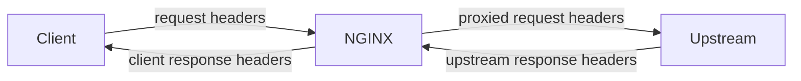

# Part 036 — Response Header Control

> Goal part ini: kamu bisa mengontrol header di NGINX sebagai kontrak edge, bukan dekorasi response. Kita akan membahas request header ke upstream, response header dari upstream, `add_header`, `proxy_hide_header`, `proxy_pass_header`, `proxy_ignore_headers`, cookie rewriting, redirect rewriting, inheritance trap, testing, dan failure mode.

Header adalah metadata contract.

Header menentukan:

```txt
identity: Host, X-Forwarded-For, X-Real-IP
protocol: Connection, Upgrade, Transfer-Encoding
cache behavior: Cache-Control, Expires, ETag, Vary
security posture: HSTS, CSP, X-Frame-Options, Referrer-Policy
redirect behavior: Location, Refresh
cookie scope: Set-Cookie Domain/Path/Secure/HttpOnly/SameSite
debug/trace: X-Request-ID, traceparent
upstream control: X-Accel-Redirect, X-Accel-Buffering, X-Accel-Expires
```

Karena header terlihat kecil, banyak engineer memperlakukannya sembarangan.

Di production, header salah bisa menyebabkan:

- cache private bocor ke user lain;
- HSTS hilang pada error response;
- upstream melihat `Host` salah;
- redirect internal bocor ke client;
- cookie domain/path salah;
- CORS terlalu terbuka;
- real client IP dipalsukan;
- service worker/cache browser menyimpan response yang salah;
- duplicate header dengan semantic ambigu.

---

## 1. Header Control Has Four Directions

Jangan campur semua directive header menjadi satu kategori.

Ada empat arah berbeda:



| Arah | Directive utama | Pertanyaan |
|---|---|---|
| Client → NGINX | core variables, realip module | Apa yang client klaim? |
| NGINX → Upstream | `proxy_set_header`, `proxy_pass_request_headers` | Header apa yang upstream boleh lihat? |
| Upstream → NGINX | `proxy_hide_header`, `proxy_pass_header`, `proxy_ignore_headers` | Header upstream mana dipakai/dibuang? |
| NGINX → Client | `add_header`, `expires`, `add_trailer`, `proxy_redirect`, cookie rewrite | Header apa yang menjadi public contract? |

Mental model:

> NGINX adalah boundary translator. Ia tidak harus meneruskan semua header apa adanya.

---

## 2. Request Headers to Upstream: `proxy_set_header`

`proxy_set_header` mendefinisikan atau menambahkan header request yang dikirim ke upstream.

Contoh baseline:

```nginx
location /api/ {
    proxy_set_header Host              $host;
    proxy_set_header X-Real-IP         $remote_addr;
    proxy_set_header X-Forwarded-For   $proxy_add_x_forwarded_for;
    proxy_set_header X-Forwarded-Proto $scheme;
    proxy_set_header X-Request-ID      $request_id;

    proxy_pass http://api_backend;
}
```

Header ini bukan sekadar formalitas.

Upstream sering memakai header tersebut untuk:

- generate absolute URL;
- audit log;
- rate limiting;
- tenant resolution;
- callback URL;
- OAuth redirect URI;
- security decision;
- trace correlation.

Karena itu, header forwarding adalah bagian security contract.

---

## 3. `Host`: `$host`, `$http_host`, atau `$proxy_host`?

Tiga variable ini sering tertukar.

| Variable | Makna praktis |
|---|---|
| `$http_host` | Nilai mentah header `Host` dari client jika ada |
| `$host` | Host hasil normalisasi: request Host, atau server name jika Host tidak ada |
| `$proxy_host` | Host dari `proxy_pass` target |

Contoh:

```nginx
proxy_pass http://api_backend;
proxy_set_header Host $host;
```

Ini menjaga upstream melihat host publik seperti `api.example.com`.

Jika kamu memakai default `$proxy_host`, upstream bisa melihat `api_backend`, `127.0.0.1`, atau nama internal lain.

Kapan pakai `$proxy_host`?

- upstream memang butuh host internal;
- proxy ke SaaS/internal service dengan virtual host spesifik;
- upstream TLS/SNI/backend routing dirancang berdasarkan host target, bukan public host.

Kapan pakai `$host`?

- aplikasi perlu host publik;
- tenant berdasarkan domain publik;
- redirect URL harus public-facing;
- app tidak boleh tahu nama internal upstream.

Hindari `$http_host` kecuali memang butuh raw value. Raw `Host` bisa berisi port dan nilai aneh dari client.

---

## 4. Forwarded Headers Are Claims Unless Sanitized

Ini buruk:

```nginx
proxy_set_header X-Forwarded-For $http_x_forwarded_for;
```

Client bisa mengirim:

```http
X-Forwarded-For: 1.2.3.4
```

Lalu upstream percaya bahwa IP client adalah `1.2.3.4`.

Lebih umum:

```nginx
proxy_set_header X-Forwarded-For $proxy_add_x_forwarded_for;
proxy_set_header X-Real-IP       $remote_addr;
```

Namun ini pun harus dipahami. Jika NGINX berada di belakang load balancer/CDN, `$remote_addr` mungkin IP load balancer, bukan client asli, sampai real IP module dikonfigurasi dengan trusted hops.

Trust boundary:

```txt
Untrusted Internet
  -> CDN / LB trusted?
  -> NGINX realip config
  -> upstream receives sanitized headers
```

Jangan pernah memakai forwarded headers untuk authorization/rate limit tanpa mendefinisikan trusted proxy chain.

Part 032 membahas ini lebih dalam. Di part ini, poinnya: header forwarding harus eksplisit dan sanitized.

---

## 5. `proxy_set_header` Inheritance Trap

`proxy_set_header` punya aturan inheritance khusus: directive dari level sebelumnya diwariskan hanya jika level sekarang tidak mendefinisikan `proxy_set_header` sama sekali.

Contoh bug:

```nginx
http {
    proxy_set_header Host              $host;
    proxy_set_header X-Forwarded-For   $proxy_add_x_forwarded_for;
    proxy_set_header X-Forwarded-Proto $scheme;

    server {
        location /api/ {
            proxy_set_header X-Request-ID $request_id;
            proxy_pass http://api_backend;
        }
    }
}
```

Banyak orang mengira hasilnya empat header.

Yang terjadi: karena `location` punya `proxy_set_header`, inheritance dari `http` bisa tidak berlaku. Location tersebut bisa hanya punya `X-Request-ID` plus default behavior lain.

Pattern aman:

```nginx
# snippets/proxy/common-headers.conf
proxy_set_header Host              $host;
proxy_set_header X-Real-IP         $remote_addr;
proxy_set_header X-Forwarded-For   $proxy_add_x_forwarded_for;
proxy_set_header X-Forwarded-Proto $scheme;
proxy_set_header X-Request-ID      $request_id;
```

Lalu include di setiap proxy location:

```nginx
location /api/ {
    include snippets/proxy/common-headers.conf;
    proxy_pass http://api_backend;
}
```

Invariant:

> Jangan menambahkan satu `proxy_set_header` lokal tanpa memastikan seluruh set header wajib tetap ada.

---

## 6. Removing Request Header to Upstream

Jika value `proxy_set_header` adalah string kosong, header tidak diteruskan.

Contoh umum:

```nginx
proxy_set_header Accept-Encoding "";
```

Kenapa dilakukan?

- agar upstream mengirim response uncompressed;
- agar NGINX bisa memodifikasi/compress/cache response dengan lebih predictable;
- agar debug response body lebih mudah.

Tetapi jangan hapus header tanpa alasan.

Contoh lain:

```nginx
proxy_set_header Authorization "";
```

Ini hanya benar jika edge sudah melakukan auth dan upstream tidak boleh menerima credential asli.

Kalau upstream butuh Authorization, menghapusnya akan menyebabkan 401/403.

---

## 7. Response Headers from Upstream: Default Behavior

Upstream mengembalikan header.

NGINX tidak selalu meneruskannya mentah-mentah.

Secara default, NGINX tidak meneruskan beberapa header tertentu dari proxied response seperti:

```txt
Date
Server
X-Pad
X-Accel-...
```

`X-Accel-*` bukan header publik biasa. Ia adalah control plane antara upstream dan NGINX.

Contoh:

```txt
X-Accel-Redirect
X-Accel-Expires
X-Accel-Limit-Rate
X-Accel-Buffering
X-Accel-Charset
```

Jika upstream bisa mengirim header ini, ia bisa memengaruhi behavior NGINX.

Itu powerful, tapi juga trust-sensitive.

---

## 8. `proxy_hide_header`: Jangan Teruskan Header Ini

`proxy_hide_header` menambah daftar response header upstream yang tidak diteruskan ke client.

Contoh:

```nginx
location /api/ {
    proxy_hide_header Server;
    proxy_hide_header X-Powered-By;
    proxy_hide_header Cache-Control;
    proxy_hide_header Expires;

    add_header Cache-Control "no-store" always;

    proxy_pass http://api_backend;
}
```

Use case:

- menyembunyikan implementation detail;
- mengganti cache policy upstream;
- mencegah header internal bocor;
- memastikan edge memiliki public header contract;
- menghapus duplicate/conflicting header.

Namun `proxy_hide_header` tidak otomatis “replace”. Ia hanya menyembunyikan header upstream. Kamu perlu `add_header` atau directive lain untuk menambahkan header baru.

Pattern:

```nginx
proxy_hide_header Cache-Control;
proxy_hide_header Expires;
add_header Cache-Control "no-store" always;
```

---

## 9. `proxy_pass_header`: Izinkan Header yang Default-nya Disembunyikan

Jika kamu justru ingin meneruskan header yang default-nya disembunyikan, pakai `proxy_pass_header`.

Contoh:

```nginx
location /download/ {
    proxy_pass_header X-Accel-Redirect;
    proxy_pass http://trusted_internal_backend;
}
```

Ini jarang diperlukan untuk public response karena `X-Accel-*` biasanya internal control.

Gunakan hanya jika:

- upstream benar-benar trusted;
- kamu tahu header tersebut bukan control internal yang bocor;
- ada alasan kompatibilitas spesifik;
- sudah dites secara eksplisit.

Untuk kebanyakan sistem, lebih aman membiarkan default NGINX menyembunyikan header internal.

---

## 10. `proxy_ignore_headers`: Jangan Proses Header Upstream

`proxy_ignore_headers` berbeda dari `proxy_hide_header`.

- `proxy_hide_header`: jangan kirim header itu ke client.
- `proxy_ignore_headers`: jangan gunakan header itu untuk mengubah behavior NGINX.

Contoh:

```nginx
location /cached/ {
    proxy_ignore_headers Cache-Control Expires Set-Cookie;
    proxy_cache edge_cache;
    proxy_cache_valid 200 10m;
    proxy_pass http://origin;
}
```

Ini sangat berbahaya jika tidak dipahami.

Jika kamu mengabaikan `Set-Cookie` atau `Cache-Control`, NGINX bisa menyimpan response yang upstream maksudkan sebagai private/no-cache.

Use case valid:

- origin legacy mengirim cache header salah;
- edge menjadi owner cache policy;
- route hanya melayani public content;
- sudah ada cache key dan bypass/no-cache policy yang aman.

Anti-pattern:

```nginx
proxy_ignore_headers Cache-Control Set-Cookie;
proxy_cache api_cache;
```

Untuk API user-specific, ini bisa menjadi data leak.

Invariant:

> `proxy_ignore_headers` adalah override terhadap niat upstream. Jangan pakai kecuali edge benar-benar memiliki policy yang lebih kuat dan lebih benar.

---

## 11. `add_header`: Menambah Header ke Client Response

`add_header` menambahkan header response.

Contoh:

```nginx
add_header X-Content-Type-Options "nosniff" always;
add_header Referrer-Policy "strict-origin-when-cross-origin" always;
```

Tetapi ada dua jebakan besar:

1. Default-nya hanya berlaku pada status code tertentu.
2. Inheritance-nya tidak additive secara intuitif.

Tanpa `always`, header hanya ditambahkan untuk response code tertentu seperti 200, 201, 204, 206, redirect tertentu, dan 304.

Untuk security header, biasanya gunakan `always`:

```nginx
add_header X-Content-Type-Options "nosniff" always;
add_header X-Frame-Options "DENY" always;
```

Kenapa?

Error response juga harus punya security posture.

---

## 12. `add_header` Inheritance Trap

Contoh bug yang sering terjadi:

```nginx
server {
    add_header X-Content-Type-Options "nosniff" always;
    add_header Referrer-Policy "strict-origin-when-cross-origin" always;

    location /assets/ {
        add_header Cache-Control "public, max-age=31536000, immutable" always;
        root /srv/www;
    }
}
```

Banyak engineer mengira `/assets/` akan punya tiga header.

Tetapi karena `location /assets/` mendefinisikan `add_header`, header dari `server` bisa tidak diwariskan dengan aturan default.

Solusi portabel:

```nginx
# snippets/headers/security.conf
add_header X-Content-Type-Options "nosniff" always;
add_header Referrer-Policy "strict-origin-when-cross-origin" always;
add_header X-Frame-Options "DENY" always;
```

```nginx
server {
    include snippets/headers/security.conf;

    location /assets/ {
        include snippets/headers/security.conf;
        add_header Cache-Control "public, max-age=31536000, immutable" always;
        root /srv/www;
    }
}
```

Pada NGINX yang mendukung `add_header_inherit merge`, inheritance bisa dibuat merge:

```nginx
http {
    add_header_inherit merge;
    add_header X-Content-Type-Options "nosniff" always;

    server {
        location /assets/ {
            add_header Cache-Control "public, max-age=31536000, immutable" always;
        }
    }
}
```

Namun jangan mengandalkan directive baru ini jika fleet kamu masih memakai versi distro lama. Untuk compatibility lintas versi, include snippet eksplisit masih paling jelas.

---

## 13. `add_header` Appends; It Is Not a General Replace Tool

Jika upstream sudah mengirim:

```http
Cache-Control: private
```

Lalu NGINX menambahkan:

```nginx
add_header Cache-Control "public, max-age=60" always;
```

Client bisa menerima dua header:

```http
Cache-Control: private
Cache-Control: public, max-age=60
```

Ini ambiguous dan berbahaya.

Pattern yang lebih benar jika edge menjadi owner:

```nginx
proxy_hide_header Cache-Control;
proxy_hide_header Expires;
add_header Cache-Control "public, max-age=60" always;
```

Tetapi gunakan ini hanya jika benar-benar public response.

Untuk private API:

```nginx
proxy_hide_header Cache-Control;
proxy_hide_header Expires;
add_header Cache-Control "no-store" always;
```

---

## 14. Security Header Ownership

Security header bisa datang dari app atau edge.

Keduanya valid, tetapi ownership harus jelas.

### Edge-owned security headers

Cocok untuk:

- static sites;
- broad baseline policy;
- HSTS;
- nosniff;
- frame protection;
- simple referrer policy;
- gateway-controlled APIs.

Contoh:

```nginx
add_header Strict-Transport-Security "max-age=31536000; includeSubDomains" always;
add_header X-Content-Type-Options "nosniff" always;
add_header Referrer-Policy "strict-origin-when-cross-origin" always;
```

Catatan HSTS:

- hanya masuk akal pada HTTPS;
- hati-hati dengan `includeSubDomains`;
- hati-hati preload;
- salah deploy HSTS bisa mengunci domain/subdomain.

### App-owned security headers

Cocok untuk:

- Content-Security-Policy yang route/page-specific;
- headers yang butuh nonce/hash per response;
- permission policy yang tergantung halaman;
- auth/session-specific policy.

Contoh:

```txt
CSP dengan nonce -> app lebih cocok
HSTS -> edge lebih cocok
```

---

## 15. Cache Header Ownership

Cache headers harus punya satu owner.

Jika app mengatur cache, NGINX jangan menambahkan conflicting cache header.

Jika edge mengatur cache, hide/ignore harus eksplisit dan aman.

### Static hashed asset

```nginx
location /assets/ {
    include snippets/headers/security.conf;
    add_header Cache-Control "public, max-age=31536000, immutable" always;
    try_files $uri =404;
}
```

### HTML shell SPA

```nginx
location = /index.html {
    include snippets/headers/security.conf;
    add_header Cache-Control "no-cache" always;
    try_files /index.html =404;
}
```

### Private API

```nginx
location /api/private/ {
    proxy_hide_header Cache-Control;
    proxy_hide_header Expires;
    add_header Cache-Control "no-store" always;
    proxy_pass http://api_backend;
}
```

### Public proxied content

```nginx
location /public-content/ {
    proxy_hide_header Cache-Control;
    proxy_hide_header Expires;
    add_header Cache-Control "public, max-age=300, stale-while-revalidate=30" always;
    proxy_pass http://content_backend;
}
```

Jangan menerapkan public cache policy ke endpoint yang memakai cookie/authorization/user identity.

---

## 16. `expires`: Convenience with Consequences

`expires` menambahkan atau memodifikasi `Expires` dan `Cache-Control`.

Contoh:

```nginx
location /assets/ {
    expires 1y;
}
```

Jika time positif atau nol, NGINX menghasilkan `Cache-Control: max-age=t`.

Jika time negatif, NGINX menghasilkan `Cache-Control: no-cache`.

Contoh:

```nginx
location / {
    expires -1;
}
```

Ini bisa berguna, tetapi untuk production modern, banyak tim lebih memilih `add_header Cache-Control ...` eksplisit karena policy lebih terbaca.

`expires` cocok untuk static simple config.

`add_header Cache-Control` lebih cocok untuk policy kompleks seperti:

```txt
public, max-age=31536000, immutable
no-store
private, no-cache
public, max-age=60, stale-while-revalidate=30
```

---

## 17. Cookie Rewriting

Saat NGINX berada di depan upstream, upstream mungkin mengirim cookie dengan domain/path internal.

Contoh upstream:

```http
Set-Cookie: session=abc; Domain=internal.local; Path=/app
```

Public client butuh:

```http
Set-Cookie: session=abc; Domain=example.com; Path=/
```

Directive:

```nginx
proxy_cookie_domain internal.local example.com;
proxy_cookie_path /app /;
```

Untuk flag cookie:

```nginx
proxy_cookie_flags ~ secure httponly samesite=lax;
```

Gunakan dengan hati-hati:

- `Secure` hanya benar jika client-facing scheme HTTPS;
- `SameSite=None` membutuhkan `Secure` pada browser modern;
- path terlalu luas bisa membuka cookie ke aplikasi lain;
- domain terlalu luas bisa membuka subdomain risk;
- jangan override cookie security app tanpa ownership jelas.

Cookie scope adalah security boundary.

---

## 18. Redirect Rewriting: `proxy_redirect`

Upstream sering mengirim `Location` header internal:

```http
Location: http://backend:8080/login
```

NGINX bisa rewrite:

```nginx
location /app/ {
    proxy_pass http://backend:8080/;
    proxy_redirect http://backend:8080/ /app/;
}
```

Default `proxy_redirect default` memakai relationship antara `location` dan `proxy_pass` untuk rewrite common cases.

Jangan biarkan internal host bocor:

```txt
http://service.namespace.svc.cluster.local
http://localhost:8080
http://10.0.1.20:9000
```

Jika redirect public salah, biasanya root cause ada di salah satu:

- upstream tidak tahu external host/scheme;
- `Host`/`X-Forwarded-Proto` salah;
- `proxy_redirect` belum dikonfigurasi;
- app base URL salah;
- path stripping di `proxy_pass` salah.

Fix terbaik sering kombinasi:

```nginx
proxy_set_header Host              $host;
proxy_set_header X-Forwarded-Proto $scheme;
proxy_redirect                     default;
```

Tetapi untuk aplikasi path-mounted, perlu test eksplisit.

---

## 19. Upstream Control Headers: `X-Accel-*`

NGINX mendukung header upstream yang mengontrol behavior NGINX:

```txt
X-Accel-Redirect
X-Accel-Expires
X-Accel-Limit-Rate
X-Accel-Buffering
X-Accel-Charset
```

Ini powerful.

Contoh secure internal file serving:

```nginx
location /protected-download/ {
    proxy_pass http://app;
}

location /internal-files/ {
    internal;
    alias /srv/private-files/;
}
```

App response:

```http
X-Accel-Redirect: /internal-files/report.pdf
```

Client tidak melihat file path asli. NGINX melayani file setelah app authorize.

Tetapi jangan izinkan service tidak trusted mengirim `X-Accel-Redirect`, karena ia bisa mencoba mengakses internal location yang tidak seharusnya.

Jika upstream tidak dipercaya penuh:

```nginx
proxy_ignore_headers X-Accel-Redirect X-Accel-Expires X-Accel-Buffering;
```

Atau jangan berikan upstream akses route yang punya internal acceleration behavior.

---

## 20. Headers and Error Responses

Security/cache headers sering hilang pada error response.

Buruk:

```nginx
add_header X-Content-Type-Options "nosniff";
```

Jika response 500, header mungkin tidak muncul.

Lebih baik:

```nginx
add_header X-Content-Type-Options "nosniff" always;
add_header Referrer-Policy "strict-origin-when-cross-origin" always;
```

Untuk API error:

```nginx
error_page 502 503 504 /_errors/upstream.json;

location = /_errors/upstream.json {
    internal;
    default_type application/json;
    add_header Cache-Control "no-store" always;
    return 503 '{"error":"upstream_unavailable"}\n';
}
```

Jangan cache error response private tanpa sengaja.

Untuk public static 404, policy bisa berbeda.

---

## 21. Header Contract by Traffic Class

### Static assets

```nginx
location /assets/ {
    try_files $uri =404;
    add_header X-Content-Type-Options "nosniff" always;
    add_header Cache-Control "public, max-age=31536000, immutable" always;
}
```

### HTML app shell

```nginx
location = /index.html {
    add_header X-Content-Type-Options "nosniff" always;
    add_header Cache-Control "no-cache" always;
    try_files /index.html =404;
}
```

### Private API

```nginx
location /api/ {
    include snippets/proxy/common-headers.conf;
    proxy_hide_header Cache-Control;
    proxy_hide_header Expires;
    add_header Cache-Control "no-store" always;
    proxy_pass http://api_backend;
}
```

### Public content proxy

```nginx
location /content/ {
    include snippets/proxy/common-headers.conf;
    proxy_hide_header Cache-Control;
    proxy_hide_header Expires;
    add_header Cache-Control "public, max-age=300" always;
    proxy_pass http://content_backend;
}
```

### WebSocket/SSE

Jangan generalisasi dari HTTP API biasa.

WebSocket butuh `Upgrade`/`Connection` handling yang akan dibahas detail di Part 037.

SSE sering butuh buffering off dan cache no-store/no-cache tergantung use case.

---

## 22. Observability: Log Sent and Upstream Headers

NGINX variable dapat membaca header upstream dan sent header.

Pattern debug sementara:

```nginx
log_format header_debug escape=json
  '{'
    '"ts":"$time_iso8601",'
    '"uri":"$uri",'
    '"status":$status,'
    '"upstream_status":"$upstream_status",'
    '"upstream_cache_control":"$upstream_http_cache_control",'
    '"sent_cache_control":"$sent_http_cache_control",'
    '"upstream_location":"$upstream_http_location",'
    '"sent_location":"$sent_http_location"'
  '}';
```

Gunakan hati-hati. Jangan log header sensitif seperti:

```txt
Authorization
Cookie
Set-Cookie
X-Api-Key
```

Untuk incident cache/header, sangat berguna membandingkan:

```txt
upstream intended header
NGINX final sent header
client observed header
```

---

## 23. Testing Header Contract

Jangan test hanya status code.

Test header juga.

### Static asset

```bash
curl -sSI https://example.com/assets/app.abc123.js | tr -d '\r'
```

Expected:

```txt
Cache-Control: public, max-age=31536000, immutable
X-Content-Type-Options: nosniff
```

### HTML

```bash
curl -sSI https://example.com/ | tr -d '\r'
```

Expected:

```txt
Cache-Control: no-cache
```

### Private API

```bash
curl -sSI https://api.example.com/api/me | tr -d '\r'
```

Expected:

```txt
Cache-Control: no-store
no duplicate public cache header
```

### Error response

```bash
curl -sSI https://api.example.com/force-502 | tr -d '\r'
```

Expected:

```txt
security headers still present
Cache-Control safe
Content-Type expected
```

### Duplicate header check

```bash
curl -sSI https://api.example.com/api/me | grep -i '^cache-control:'
```

Expected:

```txt
exactly one intended policy, unless duplicate is deliberate and semantically safe
```

Automate this in smoke tests. Header bugs often survive functional tests because body still looks correct.

---

## 24. Common Failure Modes

### Security Headers Missing on `/assets/`

Cause:

```nginx
server {
    add_header X-Content-Type-Options "nosniff" always;

    location /assets/ {
        add_header Cache-Control "public, max-age=31536000" always;
    }
}
```

Fix:

```nginx
location /assets/ {
    include snippets/headers/security.conf;
    add_header Cache-Control "public, max-age=31536000" always;
}
```

Or use `add_header_inherit merge` only if fleet supports it.

### Upstream Gets Wrong Host

Symptoms:

- redirects to internal host;
- tenant mismatch;
- OAuth callback mismatch;
- absolute URLs wrong.

Check:

```nginx
proxy_set_header Host $host;
proxy_set_header X-Forwarded-Proto $scheme;
```

### Private API Cached Publicly

Symptoms:

- user sees another user's data;
- CDN/browser caches `/api/me`;
- `Cache-Control: public` appears on authenticated route.

Check:

```nginx
proxy_hide_header Cache-Control;
add_header Cache-Control "no-store" always;
```

But also check upstream and CDN config.

### Duplicate Cache-Control

Symptoms:

```http
Cache-Control: private
Cache-Control: public, max-age=300
```

Fix:

```nginx
proxy_hide_header Cache-Control;
add_header Cache-Control "..." always;
```

Only if edge owns the policy.

### Internal Redirect Host Leaks

Symptoms:

```http
Location: http://backend:8080/login
```

Fix:

```nginx
proxy_set_header Host $host;
proxy_set_header X-Forwarded-Proto $scheme;
proxy_redirect default;
```

Or app-level external base URL.

### Cookie Scope Wrong

Symptoms:

- cookie not stored;
- session lost after redirect;
- cookie sent to wrong path/subdomain;
- `SameSite=None` without `Secure` rejected by browser.

Check:

```nginx
proxy_cookie_domain
proxy_cookie_path
proxy_cookie_flags
```

---

## 25. Production Header Baseline

Reusable snippet:

```nginx
# snippets/headers/security-baseline.conf
add_header X-Content-Type-Options "nosniff" always;
add_header Referrer-Policy "strict-origin-when-cross-origin" always;
add_header X-Frame-Options "DENY" always;
```

Optional HTTPS-only snippet:

```nginx
# snippets/headers/hsts.conf
add_header Strict-Transport-Security "max-age=31536000; includeSubDomains" always;
```

Proxy common headers:

```nginx
# snippets/proxy/common-headers.conf
proxy_set_header Host              $host;
proxy_set_header X-Real-IP         $remote_addr;
proxy_set_header X-Forwarded-For   $proxy_add_x_forwarded_for;
proxy_set_header X-Forwarded-Proto $scheme;
proxy_set_header X-Request-ID      $request_id;
```

Private API route:

```nginx
location /api/ {
    include snippets/proxy/common-headers.conf;

    proxy_hide_header Cache-Control;
    proxy_hide_header Expires;
    add_header Cache-Control "no-store" always;

    proxy_pass http://api_backend;
}
```

Static asset route:

```nginx
location /assets/ {
    include snippets/headers/security-baseline.conf;
    add_header Cache-Control "public, max-age=31536000, immutable" always;
    try_files $uri =404;
}
```

HTML route:

```nginx
location / {
    include snippets/headers/security-baseline.conf;
    add_header Cache-Control "no-cache" always;
    try_files $uri /index.html;
}
```

---

## 26. Header Ownership Decision Matrix

| Header | Usually Owned By | Notes |
|---|---|---|
| `Host` to upstream | NGINX/platform | Must match upstream contract |
| `X-Forwarded-*` | NGINX/platform | Requires trusted proxy chain |
| `X-Request-ID` | Edge or first service | Must be propagated consistently |
| `Cache-Control` static asset | NGINX/platform | Hashed asset = immutable |
| `Cache-Control` private API | App or NGINX, one owner | Avoid duplicate/conflict |
| `Strict-Transport-Security` | HTTPS edge | Do not blindly include subdomains/preload |
| `Content-Security-Policy` | Often app | Nonce/hash/page-specific policy |
| `X-Content-Type-Options` | Edge baseline | Good global baseline |
| `Set-Cookie` | App, maybe edge rewrite | Scope/flags are security boundary |
| `Location` | App + NGINX rewrite | Must be public-facing |
| `X-Accel-*` | Trusted upstream + NGINX | Internal control, not public decoration |

---

## 27. Anti-Patterns

### Anti-pattern 1: Header sprawl

```nginx
add_header Cache-Control ...;
add_header X-Frame-Options ...;
add_header Something ...;
```

Scattered across many files with no ownership.

Fix: snippets, traffic-class policy, smoke tests.

### Anti-pattern 2: One global cache policy

```nginx
add_header Cache-Control "public, max-age=3600" always;
```

Applied to API, HTML, assets, errors, and authenticated responses.

Fix: per route/traffic class.

### Anti-pattern 3: Believing `add_header` overwrites

It can append alongside upstream header.

Fix: hide upstream header first if edge owns replacement.

### Anti-pattern 4: Forgetting `always`

Security headers disappear on 4xx/5xx.

Fix: use `always` for security baseline.

### Anti-pattern 5: Untrusted `X-Accel-*`

Letting arbitrary upstream control internal redirect/buffering/cache behavior.

Fix: trust boundary, `proxy_ignore_headers`, route isolation.

### Anti-pattern 6: Local header directive breaks inherited baseline

Adding one local `add_header` or `proxy_set_header` and accidentally losing inherited headers.

Fix: explicit snippets or supported inheritance merge.

---

## 28. Review Checklist

Before merging header config:

- Who owns each header: app, NGINX, CDN, or browser policy?
- Are security headers present on error responses?
- Does any location-level `add_header` accidentally drop parent headers?
- Does any location-level `proxy_set_header` accidentally drop common forwarded headers?
- Are duplicate `Cache-Control` headers possible?
- Are private/authenticated routes protected with safe cache policy?
- Are upstream internal headers hidden?
- Are `X-Accel-*` headers only accepted from trusted upstreams?
- Are cookie domain/path/flags correct for public host/path?
- Are redirects public-facing and scheme-correct?
- Are tests checking headers, not only status/body?
- Is fleet version compatible with directives like `add_header_inherit` if used?

---

## 29. Mental Model Final

Headers are not decoration.

Headers are distributed system control messages.

```txt
proxy_set_header      -> what upstream is told
proxy_hide_header     -> what client must not see
proxy_pass_header     -> what hidden header is allowed through
proxy_ignore_headers  -> what upstream is not allowed to control
add_header            -> what edge adds to public response
expires               -> convenience cache policy writer
proxy_cookie_*        -> cookie scope translator
proxy_redirect        -> public redirect translator
```

Engineer production-grade tidak bertanya:

> “Header apa yang perlu ditambahkan?”

Pertanyaannya:

> “Untuk traffic class ini, header mana yang menjadi contract, siapa owner-nya, dan apa failure mode jika header itu hilang, duplicate, atau salah scope?”

Jika ownership header jelas, konfigurasi NGINX menjadi jauh lebih aman.

---

## References

- NGINX official documentation — `ngx_http_proxy_module`: `proxy_set_header`, `proxy_hide_header`, `proxy_pass_header`, `proxy_ignore_headers`, `proxy_cookie_domain`, `proxy_cookie_path`, `proxy_cookie_flags`, `proxy_redirect`
- NGINX official documentation — `ngx_http_headers_module`: `add_header`, `add_header_inherit`, `add_trailer`, `expires`
- NGINX Admin Guide — Reverse Proxy
