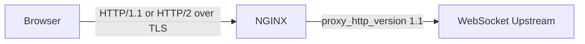

# Part 037 — WebSocket and Server-Sent Events Proxying

> Target pembelajaran: setelah bagian ini, kamu tidak hanya bisa membuat WebSocket/SSE “jalan” lewat NGINX, tetapi bisa menjelaskan kenapa koneksi putus, kenapa latency naik, kenapa load balancer tidak merata, kenapa deploy menyebabkan disconnect massal, dan bagaimana mendesain edge policy yang aman untuk traffic long-lived.

WebSocket dan Server-Sent Events terlihat sederhana dari sisi aplikasi: satu endpoint, satu koneksi, data mengalir terus. Tetapi dari sisi NGINX, keduanya mengubah asumsi dasar reverse proxy.

Pada HTTP request biasa, lifecycle-nya pendek:

```txt
client sends request -> upstream returns response -> NGINX logs -> connection can be reused or closed
```

Pada WebSocket/SSE, lifecycle-nya panjang:

```txt
client opens connection -> NGINX keeps resources -> upstream keeps resources -> data flows over time -> disconnect may happen minutes/hours later
```

Artinya, tuning yang aman untuk REST endpoint belum tentu aman untuk realtime endpoint.

---

## 1. Mental Model: Long-Lived Edge Flow

NGINX pada endpoint realtime bukan sekadar request router. Ia menjadi penjaga koneksi jangka panjang.

```mermaid
sequenceDiagram
    participant C as Client
    participant N as NGINX Edge
    participant U as Upstream Realtime App

    C->>N: HTTP request /ws or /events
    N->>U: proxied request
    alt WebSocket
        U-->>N: 101 Switching Protocols
        N-->>C: 101 Switching Protocols
        C<->>N: WebSocket frames over upgraded TCP
        N<->>U: WebSocket frames over upstream TCP
    else SSE
        U-->>N: 200 text/event-stream
        loop Stream events
            U-->>N: event chunk
            N-->>C: event chunk
        end
    end
```

Dua invariant penting:

1. **Koneksi harus tetap hidup walaupun tidak ada request-response cycle baru.**
2. **Buffering dan timeout harus sesuai dengan sifat stream.**

Jika salah satu gagal, gejalanya biasanya bukan error deterministik. Gejalanya berupa disconnect acak, event terlambat, reconnect storm, worker penuh koneksi idle, atau upstream terlihat sehat tetapi user merasakan realtime rusak.

---

## 2. Bedakan WebSocket dan SSE

| Aspek | WebSocket | SSE |
|---|---|---|
| Arah komunikasi | Full-duplex | Server → client saja |
| Start protocol | HTTP Upgrade | HTTP response biasa |
| Response awal | `101 Switching Protocols` | `200 OK` + `text/event-stream` |
| Client browser API | `WebSocket` | `EventSource` |
| Proxy requirement utama | `Upgrade` dan `Connection` header | disable buffering, long read timeout |
| Cocok untuk | chat, collaboration, bidirectional control | notifications, event feed, progress, AI token stream sederhana |
| Reconnect | Biasanya aplikasi/client library | Built-in pada `EventSource` |
| Load balancer affinity | Sering penting | Kadang penting, tergantung state |

SSE sering lebih sederhana secara operasional jika kebutuhan hanya server push. WebSocket lebih fleksibel, tetapi membuka lebih banyak surface area: bidirectional messages, connection accounting, abuse control, dan stateful backend routing.

---

## 3. WebSocket: Kenapa Butuh Konfigurasi Khusus

WebSocket dimulai sebagai HTTP request biasa, lalu client meminta upgrade protocol:

```http
GET /ws HTTP/1.1
Host: example.com
Upgrade: websocket
Connection: Upgrade
Sec-WebSocket-Key: ...
Sec-WebSocket-Version: 13
```

Upstream yang menerima upgrade membalas:

```http
HTTP/1.1 101 Switching Protocols
Upgrade: websocket
Connection: Upgrade
Sec-WebSocket-Accept: ...
```

Setelah itu koneksi tidak lagi diperlakukan sebagai HTTP request-response biasa. Ia menjadi stream dua arah.

NGINX tidak otomatis meneruskan hop-by-hop header seperti `Upgrade` dan `Connection` sebagaimana header end-to-end biasa. Karena itu WebSocket memerlukan forwarding eksplisit.

---

## 4. Baseline Config WebSocket yang Benar

Gunakan `map` di context `http`, bukan hardcode `Connection: upgrade` di semua request.

```nginx
http {
    map $http_upgrade $connection_upgrade {
        default upgrade;
        ''      close;
    }

    upstream realtime_backend {
        server 10.0.10.11:8080;
        server 10.0.10.12:8080;
        keepalive 64;
    }

    server {
        listen 443 ssl http2;
        server_name app.example.com;

        location /ws/ {
            proxy_pass http://realtime_backend;

            proxy_http_version 1.1;
            proxy_set_header Upgrade $http_upgrade;
            proxy_set_header Connection $connection_upgrade;

            proxy_set_header Host $host;
            proxy_set_header X-Real-IP $remote_addr;
            proxy_set_header X-Forwarded-For $proxy_add_x_forwarded_for;
            proxy_set_header X-Forwarded-Proto $scheme;

            proxy_read_timeout 1h;
            proxy_send_timeout 1h;

            proxy_buffering off;
        }
    }
}
```

Kenapa `map`?

Karena tidak semua request ke server itu WebSocket. Jika kamu selalu mengirim:

```nginx
proxy_set_header Connection "upgrade";
```

maka request non-WebSocket ikut membawa sinyal hop-by-hop yang tidak semestinya. Config seperti ini bisa menyebabkan perilaku aneh pada upstream, mengganggu upstream keepalive, dan membuat debugging sulit.

Invariant yang lebih aman:

```txt
Only send Connection: upgrade when the client actually sent Upgrade.
```

---

## 5. `proxy_http_version 1.1` Bukan Hiasan

WebSocket upgrade membutuhkan HTTP/1.1 semantics pada koneksi upstream. Jika NGINX berbicara HTTP/1.0 ke upstream, upgrade tidak bekerja sebagaimana mestinya.

```nginx
proxy_http_version 1.1;
```

Jangan salah paham dengan `listen 443 ssl http2;`.

Itu mengatur koneksi **client → NGINX**. Sedangkan `proxy_http_version` mengatur koneksi **NGINX → upstream**.



WebSocket browser tradisional memakai HTTP/1.1 Upgrade. Ada evolusi standar untuk WebSocket over HTTP/2, tetapi jangan asumsikan seluruh chain kamu mendukungnya. Untuk desain production yang predictable, pisahkan kemampuan client-side ALPN dari upstream WebSocket behavior.

---

## 6. Timeout Design untuk WebSocket

Default timeout yang cocok untuk REST biasanya terlalu pendek untuk WebSocket.

Directive yang paling sering relevan:

```nginx
proxy_read_timeout 1h;
proxy_send_timeout 1h;
```

Maknanya:

| Directive | Yang dijaga | Gejala jika terlalu pendek |
|---|---|---|
| `proxy_read_timeout` | NGINX menunggu data dari upstream | koneksi putus saat upstream idle |
| `proxy_send_timeout` | NGINX mengirim data ke upstream | disconnect saat client/upstream lambat |
| `send_timeout` | NGINX mengirim data ke client | client lambat diputus |
| `keepalive_timeout` | idle HTTP keepalive sebelum/antar request | tidak selalu mengontrol WebSocket setelah upgrade |

Untuk realtime production, jangan hanya menaikkan timeout sampai “besar”. Buat kontrak heartbeat.

Contoh policy:

```txt
client heartbeat interval: 25s
server heartbeat interval: 25s
proxy_read_timeout: 75s
reconnect backoff: jittered exponential backoff
idle business timeout: 30m
absolute max connection age: 6h
```

Kenapa heartbeat penting?

Karena banyak layer di luar NGINX dapat memutus koneksi idle:

- browser/network mobile,
- corporate proxy,
- cloud load balancer,
- CDN,
- firewall/NAT,
- upstream app server,
- NGINX timeout sendiri.

Heartbeat mengubah “diam lama” menjadi sinyal bahwa koneksi masih sehat.

---

## 7. Buffering: WebSocket vs SSE

Untuk WebSocket, setelah upgrade, data mengalir sebagai stream. Biasanya kamu tidak ingin buffering response seperti endpoint biasa.

```nginx
proxy_buffering off;
```

Untuk SSE, ini lebih kritikal. SSE mengirim event sebagai chunk kecil. Jika NGINX buffering aktif, event bisa tertahan hingga buffer penuh atau response selesai. Dari sudut pandang user, realtime terlihat “delay” walaupun upstream sudah mengirim data.

---

## 8. SSE Baseline Config

SSE tidak butuh `Upgrade`, tetapi butuh stream-friendly proxy behavior.

```nginx
upstream sse_backend {
    server 10.0.20.11:8080;
    server 10.0.20.12:8080;
    keepalive 64;
}

server {
    listen 443 ssl http2;
    server_name app.example.com;

    location /events/ {
        proxy_pass http://sse_backend;

        proxy_http_version 1.1;
        proxy_set_header Host $host;
        proxy_set_header X-Real-IP $remote_addr;
        proxy_set_header X-Forwarded-For $proxy_add_x_forwarded_for;
        proxy_set_header X-Forwarded-Proto $scheme;

        proxy_buffering off;
        proxy_cache off;

        proxy_read_timeout 1h;
        proxy_send_timeout 1h;

        add_header Cache-Control "no-cache, no-transform" always;
        add_header X-Accel-Buffering "no" always;
    }
}
```

Catatan penting:

- `X-Accel-Buffering: no` sering dipakai sebagai sinyal eksplisit untuk menonaktifkan buffering di beberapa path NGINX/proxying scenario.
- `Cache-Control: no-transform` mencegah intermediary tertentu mengubah response stream.
- Jangan menerapkan gzip sembarangan pada SSE. Compression dapat menambah buffering dan delay, terutama jika flush tidak dikontrol oleh upstream.

---

## 9. Jangan Gabungkan Semua API dan Realtime dalam Satu Location

Anti-pattern:

```nginx
location /api/ {
    proxy_pass http://app;
    proxy_buffering off;
    proxy_read_timeout 1h;
}
```

Ini membuat semua REST API mewarisi policy realtime. Akibatnya:

- response kecil kehilangan benefit buffering,
- upstream lebih mudah dipengaruhi client lambat,
- timeout terlalu panjang memperlambat failure detection,
- observability endpoint berbeda bercampur.

Lebih baik pisahkan:

```nginx
location /api/ {
    proxy_pass http://api_backend;
    proxy_read_timeout 30s;
    proxy_buffering on;
}

location /ws/ {
    proxy_pass http://realtime_backend;
    proxy_http_version 1.1;
    proxy_set_header Upgrade $http_upgrade;
    proxy_set_header Connection $connection_upgrade;
    proxy_read_timeout 1h;
    proxy_buffering off;
}

location /events/ {
    proxy_pass http://sse_backend;
    proxy_buffering off;
    proxy_read_timeout 1h;
}
```

Rule of thumb:

```txt
Different lifecycle, different location, different policy.
```

---

## 10. Load Balancing Long-Lived Connections

Long-lived connections membuat load balancing berbeda dari REST.

Pada REST, round-robin per request biasanya cukup. Pada WebSocket, satu request bisa hidup berjam-jam. Jika 1000 koneksi pertama kebetulan masuk ke backend A, backend A bisa terus penuh walaupun request baru sudah merata.

Contoh upstream:

```nginx
upstream realtime_backend {
    least_conn;
    server 10.0.10.11:8080 max_fails=3 fail_timeout=10s;
    server 10.0.10.12:8080 max_fails=3 fail_timeout=10s;
    server 10.0.10.13:8080 max_fails=3 fail_timeout=10s;
}
```

`least_conn` sering lebih masuk akal untuk connection-heavy workloads dibanding round-robin, karena jumlah koneksi aktif menjadi sinyal kapasitas yang lebih relevan.

Tetapi jangan anggap `least_conn` menyelesaikan semua hal. Jika koneksi punya cost yang tidak sama, misalnya beberapa user subscribe banyak channel, maka jumlah koneksi bukan proxy sempurna untuk load.

Metric yang lebih baik:

```txt
active connections per upstream
messages/sec per upstream
bytes/sec per upstream
subscription count per upstream
CPU and event loop lag per upstream
memory per connection
```

NGINX Open Source tidak punya active health check built-in seperti NGINX Plus. Untuk realtime backend, passive health check bisa terlambat mengetahui backend unhealthy jika koneksi lama tetap terbuka tetapi proses aplikasi sudah degraded secara logis.

---

## 11. Sticky Session: Kapan Perlu, Kapan Berbahaya

Realtime apps sering stateful:

- user connection registry ada di memory backend,
- subscription state ada di process,
- room/channel membership lokal,
- pending messages disimpan di memory.

Jika begitu, reconnect ke backend berbeda dapat menyebabkan user kehilangan context.

Pilihan desain:

| Desain | Konsekuensi |
|---|---|
| Sticky connection ke backend | sederhana, tapi failover buruk |
| Shared state via Redis/pubsub/message broker | lebih resilient, lebih kompleks |
| Stateless gateway + state externalized | lebih platform-grade |
| Route berdasarkan consistent hash user/session | predictable, tapi hotspot mungkin terjadi |

Contoh hash berdasarkan cookie:

```nginx
upstream realtime_backend {
    hash $cookie_session_id consistent;
    server 10.0.10.11:8080;
    server 10.0.10.12:8080;
    server 10.0.10.13:8080;
}
```

Tetapi hati-hati: hashing berdasarkan cookie yang bisa dipalsukan dapat menjadi vector hotspot. Untuk traffic publik, pertimbangkan cookie/session yang ditandatangani oleh aplikasi atau key yang berasal dari authenticated identity.

---

## 12. Reconnect Storm dan Deploy Safety

Realtime incidents sering tidak terjadi ketika traffic naik perlahan. Ia terjadi ketika banyak koneksi putus bersamaan.

Contoh pemicu:

- NGINX reload yang salah timeout drain,
- upstream rolling restart,
- node Kubernetes diganti,
- cloud load balancer idle timeout,
- deploy aplikasi menutup semua socket,
- cert reload gagal dan traffic pindah ke node lain,
- network flap.

Jika 100.000 client reconnect dalam 10 detik, upstream bisa mati bukan karena steady-state load, tetapi karena reconnect spike.

Mitigasi:

1. Client reconnect harus pakai exponential backoff + jitter.
2. Upstream harus punya admission control.
3. NGINX harus punya rate limit untuk connection establishment, bukan hanya message rate.
4. Rolling deploy harus drain koneksi lama secara bertahap.
5. Connection max age bisa dibuat menyebar, bukan semua koneksi lahir/mati bersamaan.

Contoh NGINX connection limiting:

```nginx
http {
    limit_conn_zone $binary_remote_addr zone=per_ip_conn:10m;

    server {
        location /ws/ {
            limit_conn per_ip_conn 20;
            proxy_pass http://realtime_backend;
            proxy_http_version 1.1;
            proxy_set_header Upgrade $http_upgrade;
            proxy_set_header Connection $connection_upgrade;
        }
    }
}
```

Jangan menetapkan limit tanpa memahami NAT. Banyak user corporate/mobile bisa berbagi IP publik yang sama. Jika kamu limit terlalu rendah per IP, kamu akan memblokir user valid.

---

## 13. Authentication dan Authorization di Endpoint Realtime

Kesalahan umum: mengamankan REST API tetapi membiarkan `/ws` hanya validasi saat handshake, lalu tidak memikirkan lifecycle token.

Pertanyaan yang harus dijawab:

1. Token dicek saat handshake saja atau berkala?
2. Apa yang terjadi jika token dicabut saat koneksi masih hidup?
3. Apakah user bisa subscribe channel yang berubah permission-nya?
4. Apakah backend melakukan authorization per message/subscription?
5. Apakah NGINX hanya boleh melakukan coarse gate, bukan fine-grained policy?

NGINX cocok untuk coarse edge policy:

```nginx
location /ws/ {
    # contoh coarse guard, bukan complete auth model
    if ($http_authorization = "") {
        return 401;
    }

    proxy_pass http://realtime_backend;
    proxy_http_version 1.1;
    proxy_set_header Upgrade $http_upgrade;
    proxy_set_header Connection $connection_upgrade;
}
```

Tetapi fine-grained authorization biasanya harus berada di aplikasi realtime atau authorization service karena NGINX tidak memahami message semantics setelah WebSocket upgrade.

Untuk SSE, NGINX masih melihat response HTTP, tetapi tidak memahami business event stream. Authorization event-level tetap tanggung jawab upstream.

---

## 14. Observability untuk WebSocket/SSE

Access log biasa hanya muncul ketika request selesai. Untuk koneksi yang hidup lama, ini berarti kamu bisa buta selama koneksi aktif.

Tambahkan log format yang mencatat request time dan upstream timing ketika koneksi berakhir:

```nginx
log_format realtime_json escape=json
  '{'
  '"ts":"$time_iso8601",'
  '"remote_addr":"$remote_addr",'
  '"request":"$request",'
  '"status":$status,'
  '"request_time":$request_time,'
  '"upstream_addr":"$upstream_addr",'
  '"upstream_status":"$upstream_status",'
  '"upstream_response_time":"$upstream_response_time",'
  '"bytes_sent":$bytes_sent,'
  '"http_upgrade":"$http_upgrade",'
  '"connection":"$connection",'
  '"connection_requests":$connection_requests'
  '}';

access_log /var/log/nginx/realtime_access.log realtime_json;
```

Metric yang perlu dipantau:

- active NGINX connections,
- accepted/handled requests,
- upstream active connections,
- 101 status count untuk WebSocket handshake,
- 499 client closed request,
- 502/504 spike,
- average/percentile connection duration,
- bytes in/out per realtime endpoint,
- reconnect rate dari telemetry client,
- upstream event loop lag,
- open file descriptors,
- worker connection utilization.

Untuk WebSocket, status `101` yang tinggi bukan error. Itu sukses handshake.

Untuk SSE, status normal biasanya `200`, tetapi durasi request panjang.

---

## 15. Failure Mode: 400/426/502 saat WebSocket Handshake

### Gejala

Client gagal connect, browser console menunjukkan WebSocket connection failed.

### Kemungkinan penyebab

- `proxy_http_version 1.1` hilang,
- `Upgrade` header tidak diteruskan,
- `Connection` header salah,
- upstream tidak support path WebSocket,
- TLS termination/SNI salah,
- CDN/proxy di depan tidak support WebSocket,
- route masuk ke location REST biasa.

### Debug cepat

```bash
curl -i \
  -H 'Connection: Upgrade' \
  -H 'Upgrade: websocket' \
  -H 'Sec-WebSocket-Version: 13' \
  -H 'Sec-WebSocket-Key: SGVsbG9Xb3JsZA==' \
  https://app.example.com/ws/
```

Kamu tidak sedang menguji full WebSocket client, tetapi cukup untuk melihat apakah edge dan upstream menghasilkan `101 Switching Protocols` atau tidak.

---

## 16. Failure Mode: SSE Event Terlambat Batch Sekaligus

### Gejala

Upstream mengirim event setiap detik, tetapi browser menerima beberapa event sekaligus setiap beberapa detik atau menit.

### Kemungkinan penyebab

- `proxy_buffering` masih aktif,
- gzip/compression menahan flush,
- upstream framework tidak flush response,
- intermediate CDN/proxy melakukan buffering,
- response header `Content-Type` tidak `text/event-stream`,
- HTTP client/browser wrapper tidak membaca stream benar.

### Config check

```nginx
location /events/ {
    proxy_buffering off;
    proxy_cache off;
    add_header X-Accel-Buffering "no" always;
    add_header Cache-Control "no-cache, no-transform" always;
}
```

### Upstream check

Pastikan upstream benar-benar flush:

```txt
data: hello

```

SSE event harus dipisahkan oleh blank line. Jika upstream hanya menulis ke buffer framework tanpa flush, NGINX tidak bisa mengirim sesuatu yang belum diterima.

---

## 17. Failure Mode: 499 Meningkat pada Endpoint Realtime

`499` adalah status NGINX untuk client menutup koneksi sebelum NGINX selesai memproses response.

Pada WebSocket/SSE, 499 tidak selalu berarti server error. User menutup tab, mobile network berubah, sleep mode, atau client reconnect normal dapat menghasilkan 499.

Yang perlu dilihat:

```txt
499 rate absolute
499 rate per endpoint
connection duration distribution before 499
client platform/network
correlation with deploy/reload
correlation with timeout setting
```

Jika 499 melonjak tepat setelah deploy, itu sinyal drain/reconnect storm. Jika 499 dominan di mobile, bisa jadi network churn normal tetapi perlu client reconnect strategy.

---

## 18. Production Config Pattern: Separate Realtime Server Snippet

Buat snippet khusus agar policy realtime tidak bercampur dengan REST.

```nginx
# snippets/proxy-common.conf
proxy_set_header Host $host;
proxy_set_header X-Real-IP $remote_addr;
proxy_set_header X-Forwarded-For $proxy_add_x_forwarded_for;
proxy_set_header X-Forwarded-Proto $scheme;

# snippets/proxy-websocket.conf
proxy_http_version 1.1;
proxy_set_header Upgrade $http_upgrade;
proxy_set_header Connection $connection_upgrade;
proxy_buffering off;
proxy_read_timeout 1h;
proxy_send_timeout 1h;

# snippets/proxy-sse.conf
proxy_http_version 1.1;
proxy_buffering off;
proxy_cache off;
proxy_read_timeout 1h;
proxy_send_timeout 1h;
add_header Cache-Control "no-cache, no-transform" always;
add_header X-Accel-Buffering "no" always;
```

Pemakaian:

```nginx
location /ws/ {
    include snippets/proxy-common.conf;
    include snippets/proxy-websocket.conf;
    proxy_pass http://realtime_backend;
}

location /events/ {
    include snippets/proxy-common.conf;
    include snippets/proxy-sse.conf;
    proxy_pass http://sse_backend;
}
```

---

## 19. Lab: WebSocket dan SSE di Local Production-Like Setup

### 19.1 App WebSocket sederhana

Misal upstream berjalan di `127.0.0.1:9001`.

```js
// ws-server.js
import { WebSocketServer } from 'ws';

const wss = new WebSocketServer({ port: 9001 });

wss.on('connection', (ws) => {
  const interval = setInterval(() => {
    ws.send(JSON.stringify({ type: 'heartbeat', ts: new Date().toISOString() }));
  }, 25000);

  ws.on('message', (msg) => {
    ws.send(JSON.stringify({ type: 'echo', payload: msg.toString() }));
  });

  ws.on('close', () => clearInterval(interval));
});
```

### 19.2 App SSE sederhana

```js
// sse-server.js
import http from 'http';

http.createServer((req, res) => {
  if (req.url !== '/events') {
    res.writeHead(404);
    res.end('not found');
    return;
  }

  res.writeHead(200, {
    'Content-Type': 'text/event-stream',
    'Cache-Control': 'no-cache',
    'Connection': 'keep-alive'
  });

  const interval = setInterval(() => {
    res.write(`data: ${JSON.stringify({ ts: new Date().toISOString() })}\n\n`);
  }, 1000);

  req.on('close', () => clearInterval(interval));
}).listen(9002);
```

### 19.3 NGINX lab config

```nginx
http {
    map $http_upgrade $connection_upgrade {
        default upgrade;
        ''      close;
    }

    upstream ws_backend {
        server 127.0.0.1:9001;
    }

    upstream sse_backend {
        server 127.0.0.1:9002;
    }

    server {
        listen 8080;
        server_name localhost;

        location /ws/ {
            proxy_pass http://ws_backend;
            proxy_http_version 1.1;
            proxy_set_header Upgrade $http_upgrade;
            proxy_set_header Connection $connection_upgrade;
            proxy_set_header Host $host;
            proxy_read_timeout 75s;
            proxy_buffering off;
        }

        location /events {
            proxy_pass http://sse_backend/events;
            proxy_http_version 1.1;
            proxy_set_header Host $host;
            proxy_buffering off;
            proxy_cache off;
            proxy_read_timeout 75s;
            add_header Cache-Control "no-cache, no-transform" always;
            add_header X-Accel-Buffering "no" always;
        }
    }
}
```

### 19.4 Test SSE

```bash
curl -N http://localhost:8080/events
```

`-N` menonaktifkan curl buffering sehingga kamu bisa melihat event datang satu per satu.

### 19.5 Test WebSocket

Gunakan tool seperti `websocat`:

```bash
websocat ws://localhost:8080/ws/
```

Kirim pesan, cek echo, lalu diamkan lebih lama dari heartbeat untuk melihat apakah koneksi tetap hidup.

---

## 20. Checklist Production

Sebelum endpoint realtime dianggap siap production, jawab ini:

```txt
[ ] WebSocket dan SSE punya location terpisah dari REST.
[ ] WebSocket memakai proxy_http_version 1.1.
[ ] Upgrade dan Connection header diteruskan dengan map, bukan hardcode global.
[ ] SSE memakai proxy_buffering off.
[ ] SSE response punya Content-Type text/event-stream dari upstream.
[ ] Timeout disesuaikan dengan heartbeat.
[ ] Client reconnect memakai jittered exponential backoff.
[ ] Limit connection mempertimbangkan NAT/shared IP.
[ ] Deploy strategy tidak memutus semua koneksi sekaligus.
[ ] Observability bisa membedakan 101, 200 stream, 499, 502, 504.
[ ] Upstream punya metric active connection dan event loop lag.
[ ] Authentication/authorization tidak hanya diasumsikan dari REST API.
[ ] Edge/CDN/cloud LB idle timeout sudah disejajarkan.
```

---

## 21. Key Takeaways

WebSocket dan SSE memaksa kita berpikir dalam bentuk connection lifecycle, bukan request lifecycle.

Konfigurasi minimum WebSocket adalah:

```nginx
proxy_http_version 1.1;
proxy_set_header Upgrade $http_upgrade;
proxy_set_header Connection $connection_upgrade;
```

Konfigurasi minimum SSE adalah:

```nginx
proxy_buffering off;
proxy_read_timeout <lebih panjang dari heartbeat>;
```

Tetapi production readiness tidak berhenti di sana. Yang membedakan engineer kuat dari config copier adalah kemampuan menjawab:

- apa yang terjadi saat upstream restart,
- apa yang terjadi saat client reconnect massal,
- apa yang terjadi saat koneksi idle melewati beberapa proxy,
- apa yang terlihat di log ketika koneksi normal ditutup,
- apa yang harus diukur agar tidak buta selama koneksi masih aktif.

Pada bagian berikutnya kita akan masuk ke gRPC proxying. Secara operasional, gRPC juga long-lived dalam beberapa mode, tetapi protokolnya berbeda: HTTP/2, trailers, status code gRPC, deadline, dan method-level observability.

---

## References

- NGINX documentation — WebSocket proxying and `ngx_http_proxy_module`: https://nginx.org/en/docs/http/ngx_http_proxy_module.html
- NGINX documentation — Reverse proxy admin guide: https://docs.nginx.com/nginx/admin-guide/web-server/reverse-proxy/
- NGINX documentation — `map` module: https://nginx.org/en/docs/http/ngx_http_map_module.html
- MDN Web Docs — WebSocket API: https://developer.mozilla.org/en-US/docs/Web/API/WebSockets_API
- MDN Web Docs — Server-sent events: https://developer.mozilla.org/en-US/docs/Web/API/Server-sent_events
