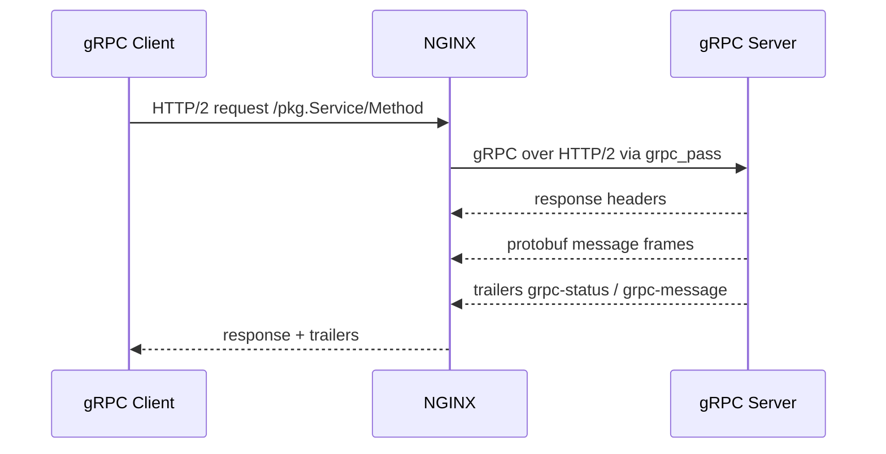
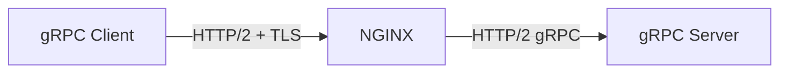

# Part 038 — gRPC Proxying

> Target pembelajaran: setelah bagian ini, kamu bisa menjalankan gRPC lewat NGINX dengan benar, tetapi lebih penting lagi: kamu bisa menjelaskan boundary HTTP/2, TLS, `grpc_pass`, timeout, retry, status mapping, dan failure mode yang membedakan gRPC dari REST biasa.

NGINX dapat mem-proxy request ke gRPC server melalui `ngx_http_grpc_module`. Modul ini memungkinkan passing request ke server gRPC dan membutuhkan HTTP/2 module. Ini detail kecil yang sering menjadi akar kesalahan besar.

Banyak engineer memperlakukan gRPC sebagai “REST yang pakai protobuf”. Itu framing yang lemah.

Untuk NGINX, gRPC berarti:

```txt
HTTP/2 framing
binary payload
method path berbentuk /package.Service/Method
headers + trailers
status gRPC yang tidak selalu sama dengan HTTP status
optional streaming request/response
explicit deadline semantics dari client/app
```

Jadi operational model-nya harus berbeda.

---

## 1. Mental Model: gRPC di Depan NGINX



NGINX berada di antara dua kontrak:

1. **Client-facing contract**: TLS, ALPN, HTTP/2, endpoint, headers, auth, rate limit.
2. **Upstream-facing contract**: gRPC server address, plaintext/TLS upstream, timeout, retry, health behavior.

Jangan campur dua kontrak ini.

---

## 2. gRPC Bukan `proxy_pass`

Untuk HTTP reverse proxy biasa, kamu memakai:

```nginx
proxy_pass http://api_backend;
```

Untuk gRPC, gunakan:

```nginx
grpc_pass grpc://grpc_backend;
```

atau jika upstream gRPC memakai TLS:

```nginx
grpc_pass grpcs://grpc_backend;
```

Baseline:

```nginx
upstream grpc_backend {
    server 10.0.30.11:50051;
    server 10.0.30.12:50051;
}

server {
    listen 443 ssl http2;
    server_name grpc.example.com;

    ssl_certificate     /etc/nginx/tls/fullchain.pem;
    ssl_certificate_key /etc/nginx/tls/privkey.pem;

    location / {
        grpc_pass grpc://grpc_backend;

        grpc_set_header Host $host;
        grpc_set_header X-Real-IP $remote_addr;
        grpc_set_header X-Forwarded-For $proxy_add_x_forwarded_for;
        grpc_set_header X-Forwarded-Proto $scheme;

        grpc_read_timeout 60s;
        grpc_send_timeout 60s;
        grpc_connect_timeout 5s;
    }
}
```

`listen 443 ssl http2` penting untuk client gRPC umum karena gRPC biasanya menggunakan HTTP/2. Tanpa HTTP/2 di sisi client, banyak gRPC client tidak bisa berbicara dengan endpoint kamu.

---

## 3. HTTP/2 Boundary: Client Side vs Upstream Side

Ada dua sisi HTTP/2:



`listen ... http2` mengaktifkan HTTP/2 pada sisi client-facing NGINX.

`grpc_pass` mengatur upstream request sebagai gRPC ke backend.

Jangan berpikir bahwa `proxy_http_version 2` adalah cara mem-proxy gRPC. Untuk gRPC gunakan `grpc_pass`, bukan `proxy_pass`.

---

## 4. Four Deployment Modes

### Mode A — TLS terminate di NGINX, plaintext gRPC ke upstream

```nginx
server {
    listen 443 ssl http2;
    server_name grpc.example.com;

    location / {
        grpc_pass grpc://grpc_backend;
    }
}
```

Cocok jika upstream berada di private trusted network dan kamu ingin NGINX menjadi TLS boundary.

Risiko:

- traffic internal plaintext,
- identity upstream tidak dibuktikan via certificate,
- compliance tertentu mungkin tidak mengizinkan.

### Mode B — TLS terminate di NGINX, TLS lagi ke upstream

```nginx
server {
    listen 443 ssl http2;
    server_name grpc.example.com;

    location / {
        grpc_pass grpcs://grpc_backend;
        grpc_ssl_server_name on;
        grpc_ssl_name grpc.internal.example.com;
        grpc_ssl_trusted_certificate /etc/nginx/ca/internal-ca.pem;
        grpc_ssl_verify on;
    }
}
```

Cocok untuk zero-trust-ish internal network atau compliance yang menuntut encryption in transit end-to-end antar hop.

### Mode C — mTLS client → NGINX

```nginx
server {
    listen 443 ssl http2;
    server_name grpc.example.com;

    ssl_client_certificate /etc/nginx/ca/client-ca.pem;
    ssl_verify_client on;

    location / {
        grpc_pass grpc://grpc_backend;
        grpc_set_header X-Client-Cert-Verify $ssl_client_verify;
        grpc_set_header X-Client-DN $ssl_client_s_dn;
    }
}
```

Cocok untuk service-to-service edge atau partner integration.

### Mode D — Passthrough TLS di Layer 4

Ini bukan `grpc_pass`; ini stream module.

```nginx
stream {
    upstream grpc_tls_backend {
        server 10.0.30.11:443;
        server 10.0.30.12:443;
    }

    server {
        listen 443;
        proxy_pass grpc_tls_backend;
    }
}
```

Cocok jika NGINX tidak boleh melihat HTTP/gRPC content. Tetapi kamu kehilangan L7 routing, L7 logs, header manipulation, auth di edge, dan method-level policy.

---

## 5. gRPC Path Semantics

gRPC method biasanya terlihat seperti path HTTP:

```txt
/package.Service/Method
```

Contoh:

```txt
/com.acme.payment.PaymentService/CreatePayment
```

Ini berguna untuk routing.

```nginx
location /com.acme.payment.PaymentService/ {
    grpc_pass grpc://payment_grpc_backend;
}

location /com.acme.user.UserService/ {
    grpc_pass grpc://user_grpc_backend;
}
```

Namun hati-hati: jangan melakukan rewrite path gRPC sembarangan. gRPC server biasanya mengharapkan path method persis sesuai service/method. Mengubah URI bisa membuat upstream mengembalikan `UNIMPLEMENTED` atau error yang tampak seperti aplikasi rusak.

Jika ingin memecah routing per service, lebih aman route berdasarkan prefix service penuh daripada rewrite method path.

---

## 6. Headers, Metadata, dan Trailers

gRPC metadata dibawa melalui HTTP/2 headers. Response status gRPC sering dikirim melalui trailers:

```txt
grpc-status: 0
grpc-message: OK
```

Konsekuensi penting:

1. HTTP status `200` belum tentu berarti gRPC call sukses secara business/protocol.
2. Observability harus membaca `grpc-status`, bukan hanya `$status`.
3. Client gRPC memahami trailers; generic HTTP tooling sering tidak.

Contoh common gRPC status:

| gRPC status | Makna umum |
|---:|---|
| 0 | OK |
| 1 | CANCELLED |
| 3 | INVALID_ARGUMENT |
| 4 | DEADLINE_EXCEEDED |
| 5 | NOT_FOUND |
| 7 | PERMISSION_DENIED |
| 13 | INTERNAL |
| 14 | UNAVAILABLE |
| 16 | UNAUTHENTICATED |

Jika dashboard hanya memantau HTTP 5xx, gRPC production kamu bisa “hijau” padahal banyak `grpc-status: 13` atau `14`.

---

## 7. Timeout Design: gRPC Deadline vs NGINX Timeout

Ada dua dunia timeout:

1. **gRPC deadline**: dikirim/diatur oleh client atau application layer.
2. **NGINX timeout**: batas koneksi dan transfer di reverse proxy.

Directive NGINX yang relevan:

```nginx
grpc_connect_timeout 5s;
grpc_send_timeout 60s;
grpc_read_timeout 60s;
```

Tuning yang buruk:

```txt
client deadline: 3s
NGINX grpc_read_timeout: 60s
upstream app timeout: 120s
DB timeout: 300s
```

Ini berarti client sudah menyerah, tetapi upstream mungkin masih bekerja. Pada beban tinggi, ini menghasilkan wasted work.

Lebih baik buat timeout ladder:

```txt
client deadline: 2.5s
NGINX read timeout: 3s
app handler timeout: 2s
DB/query timeout: 1.5s
```

Untuk streaming gRPC, timeout perlu mempertimbangkan idle gap antar message. Jika server-streaming mengirim message tiap 30 detik, `grpc_read_timeout 10s` akan memutus stream normal.

---

## 8. Retry Semantics: Sangat Hati-Hati

NGINX punya `grpc_next_upstream` untuk menentukan kapan request diteruskan ke upstream berikutnya.

Contoh:

```nginx
grpc_next_upstream error timeout http_502 http_503 http_504;
grpc_next_upstream_tries 2;
grpc_next_upstream_timeout 3s;
```

Masalahnya: gRPC method bisa mutating.

Jika `CreatePayment` sudah diproses upstream tetapi koneksi putus sebelum response diterima, retry di NGINX bisa menciptakan duplicate write.

Safe retry membutuhkan salah satu:

- method benar-benar idempotent,
- idempotency key enforced di application layer,
- request belum dikirim ke upstream,
- retry hanya untuk safe/read method,
- retry dikendalikan client/service mesh dengan semantic awareness.

Untuk endpoint mutating, default yang lebih defensif:

```nginx
grpc_next_upstream error timeout;
grpc_next_upstream_tries 1;
```

Artinya tidak mencoba backend lain secara agresif.

Prinsip:

```txt
Transport-level retry cannot prove business-level safety.
```

---

## 9. Unary vs Streaming Calls

gRPC punya beberapa bentuk call:

| Type | Bentuk | Dampak NGINX |
|---|---|---|
| Unary | 1 request → 1 response | mirip RPC biasa |
| Server streaming | 1 request → banyak response | long-lived read path |
| Client streaming | banyak request → 1 response | long-lived send path |
| Bidirectional streaming | banyak request ↔ banyak response | mirip WebSocket secara lifecycle |

Untuk streaming, kamu harus berpikir seperti Part 037:

- timeout lebih panjang,
- observability request selesai terlambat,
- client disconnect normal,
- deploy drain penting,
- upstream connection count lebih relevan daripada request/sec saja.

Jangan memakai satu config global untuk semua gRPC method jika unary dan streaming bercampur.

Contoh split location:

```nginx
location /com.acme.report.ReportService/StreamReport {
    grpc_pass grpc://report_stream_backend;
    grpc_read_timeout 1h;
    grpc_send_timeout 1h;
}

location /com.acme.report.ReportService/ {
    grpc_pass grpc://report_unary_backend;
    grpc_read_timeout 10s;
    grpc_send_timeout 10s;
}
```

---

## 10. Load Balancing gRPC

Baseline:

```nginx
upstream grpc_backend {
    least_conn;
    server 10.0.30.11:50051 max_fails=3 fail_timeout=10s;
    server 10.0.30.12:50051 max_fails=3 fail_timeout=10s;
    server 10.0.30.13:50051 max_fails=3 fail_timeout=10s;
}
```

For unary gRPC, request balancing works similarly to HTTP. For streaming gRPC, long-lived streams behave like long-lived connections. `least_conn` may be better than round-robin when stream duration varies.

If backend holds per-client state, consider consistent hashing:

```nginx
upstream grpc_backend {
    hash $http_x_tenant_id consistent;
    server 10.0.30.11:50051;
    server 10.0.30.12:50051;
    server 10.0.30.13:50051;
}
```

But only hash on trusted metadata. If `x-tenant-id` is client-controlled and unauthenticated, a malicious client can create hotspots or route confusion.

---

## 11. Health Checks: Open Source Boundary

NGINX Open Source primarily relies on passive failure detection for upstreams. That means a backend is considered failed based on failed attempts such as connection errors/timeouts according to upstream settings.

For gRPC, this is not the same as application health.

A backend can:

- accept TCP,
- complete TLS,
- accept HTTP/2,
- but return gRPC `UNAVAILABLE` for business dependencies,
- or be overloaded but not fail connection attempts.

Production patterns:

1. Use active health checks at another layer if using OSS NGINX.
2. Expose gRPC health checking service from app.
3. Use orchestrator readiness probes to remove bad pods before NGINX routes to them.
4. If using NGINX Plus, evaluate active health checks explicitly.
5. Never assume TCP accept means gRPC service healthy.

---

## 12. TLS to Upstream: `grpcs://` and Verification

If upstream uses TLS:

```nginx
location / {
    grpc_pass grpcs://grpc_backend;

    grpc_ssl_server_name on;
    grpc_ssl_name grpc.internal.example.com;
    grpc_ssl_trusted_certificate /etc/nginx/ca/internal-ca.pem;
    grpc_ssl_verify on;
    grpc_ssl_verify_depth 2;
}
```

Avoid this in production unless you understand the risk:

```nginx
grpc_ssl_verify off;
```

Turning verification off encrypts traffic but does not authenticate upstream identity. That can still be vulnerable to misrouting or internal man-in-the-middle scenarios.

For mTLS to upstream:

```nginx
grpc_ssl_certificate     /etc/nginx/tls/nginx-client.crt;
grpc_ssl_certificate_key /etc/nginx/tls/nginx-client.key;
```

Now upstream can authenticate NGINX as a client.

---

## 13. Request Size, Message Size, and Backpressure

NGINX sees gRPC as HTTP/2 request/response carrying binary frames. Application-level gRPC message size limits are usually enforced by gRPC library/server, not by NGINX in protobuf-aware fashion.

But NGINX still controls HTTP request body constraints:

```nginx
client_max_body_size 20m;
client_body_timeout 10s;
grpc_send_timeout 60s;
grpc_read_timeout 60s;
```

Think in layers:

```txt
client library max inbound/outbound message size
NGINX client body limit
gRPC server max message size
application validation limit
storage/business limit
```

Do not let edge accept a 2GB payload if your gRPC service rejects at 16MB after reading too much data. Align limits early.

---

## 14. Rate Limiting gRPC

NGINX can rate limit HTTP requests by key, but it does not understand protobuf method semantics beyond HTTP path/headers.

Example per client IP:

```nginx
http {
    limit_req_zone $binary_remote_addr zone=grpc_ip:10m rate=50r/s;

    server {
        location / {
            limit_req zone=grpc_ip burst=100 nodelay;
            grpc_pass grpc://grpc_backend;
        }
    }
}
```

Better keys may include tenant or authenticated identity, but only if trusted:

```nginx
limit_req_zone $http_x_tenant_id zone=grpc_tenant:10m rate=500r/s;
```

Do not trust raw client headers for tenant identity unless an earlier trusted auth layer overwrites them.

For streaming RPC, request rate limit only limits stream creation, not messages inside the stream. Per-message abuse must be handled by the gRPC server or protocol-aware gateway.

---

## 15. Error Mapping: HTTP Status vs gRPC Status

When upstream is unreachable, NGINX may return HTTP 502/504. But when gRPC server returns application failure, the HTTP status may be 200 with `grpc-status` nonzero.

This creates monitoring traps.

Bad dashboard:

```txt
HTTP 5xx < 1% => system healthy
```

Better dashboard:

```txt
HTTP 5xx
+ grpc-status distribution
+ grpc-status by method
+ deadline exceeded rate
+ unavailable rate
+ cancelled rate
+ upstream connect/read timeout
```

NGINX logs may not capture all gRPC trailer values in a convenient way depending on version/module behavior and log variables available. For strong gRPC observability, combine NGINX edge logs with application interceptors and client metrics.

---

## 16. Observability Log Format

A useful edge log starts like this:

```nginx
log_format grpc_json escape=json
  '{'
  '"ts":"$time_iso8601",'
  '"remote_addr":"$remote_addr",'
  '"host":"$host",'
  '"method":"$request_method",'
  '"uri":"$uri",'
  '"status":$status,'
  '"request_time":$request_time,'
  '"upstream_addr":"$upstream_addr",'
  '"upstream_status":"$upstream_status",'
  '"upstream_connect_time":"$upstream_connect_time",'
  '"upstream_header_time":"$upstream_header_time",'
  '"upstream_response_time":"$upstream_response_time",'
  '"bytes_sent":$bytes_sent,'
  '"request_length":$request_length,'
  '"http2":"$server_protocol"'
  '}';

access_log /var/log/nginx/grpc_access.log grpc_json;
```

Untuk method-level breakdown, `$uri` biasanya berisi path method:

```txt
/com.acme.payment.PaymentService/CreatePayment
```

Kamu bisa memproses ini di log pipeline untuk mendapatkan service dan method.

---

## 17. Debugging gRPC dengan `grpcurl`

`curl` tidak cukup nyaman untuk gRPC. Gunakan `grpcurl`.

List services jika reflection aktif:

```bash
grpcurl grpc.example.com:443 list
```

Call method plaintext local:

```bash
grpcurl -plaintext \
  -d '{"id":"123"}' \
  localhost:50051 \
  com.acme.user.UserService/GetUser
```

Call via TLS edge:

```bash
grpcurl \
  -d '{"id":"123"}' \
  grpc.example.com:443 \
  com.acme.user.UserService/GetUser
```

Dengan authority override:

```bash
grpcurl \
  -authority grpc.example.com \
  -d '{"id":"123"}' \
  127.0.0.1:443 \
  com.acme.user.UserService/GetUser
```

---

## 18. Failure Mode: Client Mendapat “protocol error”

### Kemungkinan penyebab

- client tidak berbicara HTTP/2,
- NGINX listener tidak memakai `http2`,
- TLS/ALPN tidak cocok,
- endpoint diarahkan ke `proxy_pass` HTTP biasa,
- intermediate proxy downgrade ke HTTP/1.1,
- upstream bukan gRPC server.

### Diagnosis

```bash
openssl s_client -alpn h2 -connect grpc.example.com:443 -servername grpc.example.com
```

Cari apakah ALPN negotiated `h2`.

---

## 19. Failure Mode: HTTP 200 tetapi Client Error

### Kemungkinan penyebab

- upstream mengembalikan `grpc-status` nonzero di trailers,
- application-level exception,
- deadline exceeded,
- protobuf serialization/deserialization error,
- metadata missing,
- auth failed di application layer.

### Diagnosis

Gunakan `grpcurl -v` untuk melihat headers/trailers.

```bash
grpcurl -v \
  -d '{}' \
  grpc.example.com:443 \
  com.acme.health.Health/Check
```

Jangan berhenti pada HTTP status.

---

## 20. Failure Mode: 502 dari NGINX

### Kemungkinan penyebab

- upstream port salah,
- backend tidak listening,
- TLS upstream mismatch (`grpc://` vs `grpcs://`),
- upstream certificate verification gagal,
- HTTP/2/gRPC handshake gagal,
- backend crash saat menerima request,
- NGINX tidak bisa resolve upstream DNS.

### NGINX error log biasanya lebih berguna daripada access log

Contoh pola:

```txt
connect() failed
upstream prematurely closed connection
SSL_do_handshake() failed
no live upstreams
host not found in upstream
```

---

## 21. Failure Mode: DEADLINE_EXCEEDED Naik tetapi NGINX 5xx Tidak Naik

Ini tipikal gRPC.

Client deadline habis. Dari sisi NGINX, request mungkin masih HTTP 200 atau upstream response normal secara transport. Dari sisi user, call gagal.

Diagnosis:

```txt
grpc-status=4 by method
gRPC client deadline setting
upstream p95/p99 handler latency
DB latency
queue time before handler
NGINX request_time
upstream_response_time
```

Solusi bukan “naikkan timeout” secara otomatis. Kadang solusi benar adalah:

- kurangi work,
- batasi concurrency,
- fail fast,
- cache,
- pecah endpoint,
- ubah deadline budget,
- hilangkan retry amplification.

---

## 22. Production Pattern: Split Unary dan Streaming

```nginx
upstream grpc_unary_backend {
    least_conn;
    server 10.0.30.11:50051;
    server 10.0.30.12:50051;
}

upstream grpc_stream_backend {
    least_conn;
    server 10.0.31.11:50051;
    server 10.0.31.12:50051;
}

server {
    listen 443 ssl http2;
    server_name grpc.example.com;

    location /com.acme.feed.FeedService/Subscribe {
        grpc_pass grpc://grpc_stream_backend;
        grpc_connect_timeout 5s;
        grpc_send_timeout 1h;
        grpc_read_timeout 1h;
    }

    location / {
        grpc_pass grpc://grpc_unary_backend;
        grpc_connect_timeout 3s;
        grpc_send_timeout 10s;
        grpc_read_timeout 10s;
        grpc_next_upstream error timeout http_502 http_503 http_504;
        grpc_next_upstream_tries 2;
    }
}
```

Kenapa dipisah?

Karena streaming dan unary punya:

- durasi berbeda,
- timeout berbeda,
- load-balancing signal berbeda,
- incident behavior berbeda,
- scaling policy berbeda.

---

## 23. Lab: gRPC Echo di Belakang NGINX

### 23.1 NGINX local config

```nginx
events {}

http {
    upstream grpc_backend {
        server 127.0.0.1:50051;
    }

    server {
        listen 8080 http2;
        server_name localhost;

        location / {
            grpc_pass grpc://grpc_backend;
            grpc_connect_timeout 3s;
            grpc_send_timeout 30s;
            grpc_read_timeout 30s;
        }
    }
}
```

Untuk local plaintext h2c testing, support client/tooling harus sesuai. Banyak production setup lebih sederhana diuji via TLS dengan ALPN `h2`.

### 23.2 Test dengan `grpcurl`

Jika server mendukung reflection:

```bash
grpcurl -plaintext localhost:8080 list
```

Jika tidak mendukung reflection, berikan proto file:

```bash
grpcurl -plaintext \
  -import-path ./proto \
  -proto echo.proto \
  -d '{"message":"hello"}' \
  localhost:8080 \
  demo.EchoService/Echo
```

### 23.3 Failure injection

1. Stop upstream, pastikan NGINX menghasilkan error yang dapat dijelaskan.
2. Ubah upstream ke port salah, lihat error log.
3. Tambahkan sleep di handler melebihi `grpc_read_timeout`.
4. Buat method mutating, lalu diskusikan kenapa retry edge berbahaya.
5. Buat server-streaming endpoint, lalu lihat perbedaan request duration di access log.

---

## 24. Checklist Production

```txt
[ ] NGINX listener client-facing memakai HTTP/2 untuk endpoint gRPC.
[ ] gRPC upstream memakai grpc_pass/grpcs_pass style, bukan proxy_pass biasa.
[ ] TLS boundary jelas: terminate, re-encrypt, mTLS, atau L4 passthrough.
[ ] Upstream TLS verification tidak dimatikan tanpa risk acceptance eksplisit.
[ ] Timeout ladder selaras dengan client deadline, app timeout, dan DB timeout.
[ ] Retry hanya aktif untuk operation yang aman atau idempotent.
[ ] Unary dan streaming call dipisah bila lifecycle berbeda signifikan.
[ ] Dashboard tidak hanya memantau HTTP status, tetapi juga gRPC status.
[ ] Logs menyimpan URI/method, upstream timing, status, dan request time.
[ ] Health check tidak hanya TCP accept.
[ ] Rate limit streaming creation tidak dikira sebagai per-message limit.
[ ] Request/message size limit disejajarkan antar edge, client, server, dan business rule.
```

---

## 25. Key Takeaways

NGINX gRPC proxying bukan HTTP reverse proxy biasa dengan payload protobuf. Ia adalah HTTP/2-aware reverse proxy dengan gRPC-specific module dan semantics.

Minimal baseline:

```nginx
listen 443 ssl http2;

grpc_pass grpc://grpc_backend;
```

Tetapi production correctness memerlukan lebih dari itu:

- deadline harus sejajar dengan timeout,
- retry harus memahami idempotency,
- status gRPC harus diobservasi selain HTTP status,
- streaming call harus diperlakukan seperti long-lived connection,
- TLS upstream harus memverifikasi identity bila digunakan sebagai trust boundary.

Pada bagian berikutnya kita akan membahas FastCGI/uWSGI/SCGI/PHP-FPM. Walaupun terlihat legacy dibanding gRPC, masih banyak production system menjalankannya, dan failure mode-nya sangat khas: buffering, params leakage, script path confusion, pool saturation, dan 502 yang sulit dibedakan.

---

## References

- NGINX documentation — `ngx_http_grpc_module`: https://nginx.org/en/docs/http/ngx_http_grpc_module.html
- NGINX documentation — `ngx_http_v2_module`: https://nginx.org/en/docs/http/ngx_http_v2_module.html
- NGINX documentation — HTTP load balancing: https://docs.nginx.com/nginx/admin-guide/load-balancer/http-load-balancer/
- NGINX documentation — reverse proxy: https://docs.nginx.com/nginx/admin-guide/web-server/reverse-proxy/
- gRPC official documentation — core concepts: https://grpc.io/docs/what-is-grpc/core-concepts/
- gRPC official documentation — health checking: https://grpc.io/docs/guides/health-checking/
