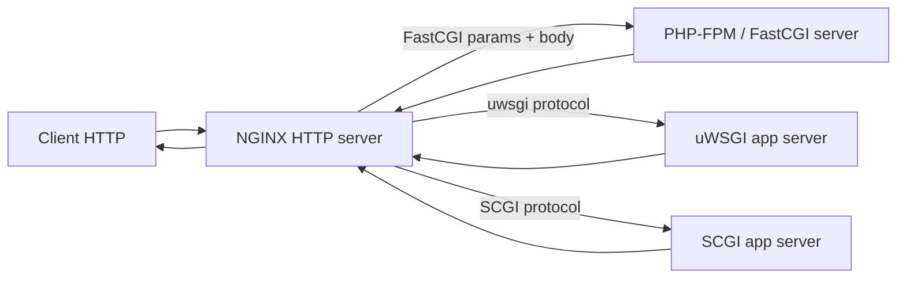
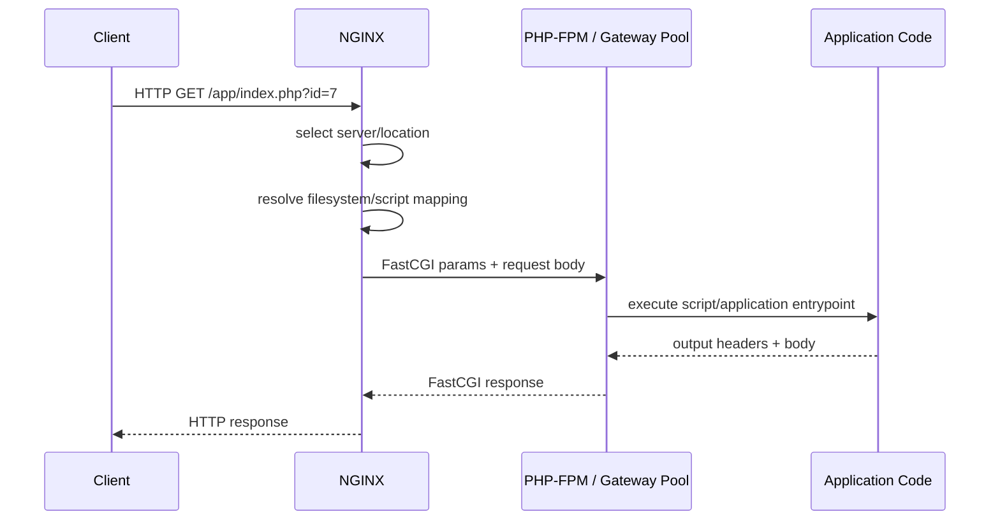
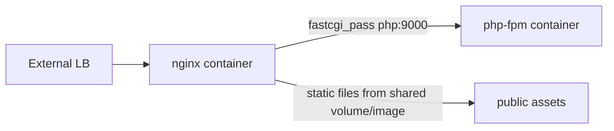

# Part 039 — FastCGI/uWSGI/SCGI/PHP-FPM

> Target pembelajaran: setelah bagian ini, kamu tidak hanya bisa menulis config `fastcgi_pass` untuk PHP-FPM. Kamu bisa menjelaskan kenapa FastCGI/uWSGI/SCGI berbeda dari HTTP reverse proxy, bagaimana parameter diteruskan, di mana script path bisa salah, bagaimana buffering dan pool saturation muncul, serta bagaimana men-debug 502/504 yang berasal dari gateway app server.

Di sistem modern, banyak engineer langsung melompat ke `proxy_pass`, gRPC, Kubernetes Ingress, atau service mesh. Tetapi banyak production estate masih menjalankan PHP-FPM, Python uWSGI, legacy SCGI service, atau app server berbasis protocol gateway.

Kesalahan umum: memperlakukan FastCGI/uWSGI/SCGI seperti HTTP upstream biasa.

Itu framing yang salah.

FastCGI/uWSGI/SCGI bukan sekadar “backend server di port lain”. Mereka adalah **gateway protocol**. NGINX tidak mengirim HTTP request utuh seperti ke `proxy_pass`. NGINX menerjemahkan request HTTP menjadi parameter/protocol record yang dimengerti app gateway.



Konsekuensinya:

- path script adalah data input kritis,
- parameter environment adalah boundary security,
- request body buffering memengaruhi retry dan backpressure,
- pool app server bisa penuh walaupun NGINX masih terlihat sehat,
- 502 bisa berarti socket unavailable, malformed response, process crash, atau wrong params,
- 504 bisa berarti app gateway tidak mengirim response tepat waktu,
- observability harus menangkap upstream address, status, timing, dan script identity.

---

## 1. Protocol Gateway Mental Model

Untuk HTTP reverse proxy biasa:

```nginx
location /api/ {
    proxy_pass http://api_backend;
}
```

NGINX meneruskan request sebagai HTTP request ke upstream HTTP server.

Untuk FastCGI:

```nginx
location ~ \.php$ {
    fastcgi_pass unix:/run/php/php-fpm.sock;
    include fastcgi_params;
    fastcgi_param SCRIPT_FILENAME $document_root$fastcgi_script_name;
}
```

NGINX tidak mengirim request HTTP utuh ke PHP-FPM. Ia mengirim FastCGI records, termasuk parameter seperti:

```txt
SCRIPT_FILENAME
SCRIPT_NAME
QUERY_STRING
REQUEST_METHOD
CONTENT_TYPE
CONTENT_LENGTH
SERVER_PROTOCOL
REQUEST_URI
DOCUMENT_ROOT
```

Untuk uWSGI:

```nginx
location / {
    include uwsgi_params;
    uwsgi_pass unix:/run/uwsgi/app.sock;
}
```

Untuk SCGI:

```nginx
location / {
    include scgi_params;
    scgi_pass 127.0.0.1:9000;
}
```

Semua terlihat mirip, tetapi correctness-nya berada di **translation layer**.

---

## 2. Kapan FastCGI/uWSGI/SCGI Masih Relevan?

Gunakan jalur ini ketika:

1. kamu menjalankan PHP-FPM,
2. framework lama masih memakai uWSGI protocol,
3. platform legacy menyediakan SCGI endpoint,
4. kamu perlu NGINX sebagai frontend web server dan app process manager terpisah,
5. kamu ingin NGINX menangani static file, TLS, compression, access control, dan buffering, sementara app server fokus pada dynamic execution.

Jangan gunakan jalur ini untuk service HTTP biasa yang sudah exposing HTTP endpoint. Untuk Node.js, Java, Go, Rust HTTP service, default-nya adalah `proxy_pass`, bukan FastCGI.

Decision matrix:

| Backend | Directive | Common runtime | Typical use |
|---|---|---|---|
| HTTP app | `proxy_pass` | Java/Node/Go/Python HTTP server | API/service reverse proxy |
| gRPC app | `grpc_pass` | gRPC server | RPC over HTTP/2 |
| FastCGI | `fastcgi_pass` | PHP-FPM, custom FastCGI | PHP/dynamic script gateway |
| uWSGI | `uwsgi_pass` | uWSGI Python apps | Legacy Python deployment |
| SCGI | `scgi_pass` | SCGI app servers | Legacy/simple gateway |

---

## 3. The Contract: NGINX Handles HTTP, Gateway Handles Execution

The real architecture:



Ada dua contract:

1. **External HTTP contract**: path, method, headers, body, cache, TLS, compression, access control.
2. **Gateway execution contract**: script filename, app root, query string, request body, env params, pool capacity, process timeout.

Production bug sering muncul ketika dua contract ini dicampur.

Contoh kesalahan:

```nginx
location ~ \.php$ {
    fastcgi_pass unix:/run/php/php-fpm.sock;
    fastcgi_param SCRIPT_FILENAME $request_filename;
}
```

Sekilas masuk akal. Tetapi bila routing, symlink, `alias`, chroot, atau internal redirect terlibat, `$request_filename` bisa tidak sesuai dengan script yang benar-benar boleh dieksekusi. Tidak semua deployment salah memakai ini, tetapi config production harus eksplisit dan diuji.

---

## 4. PHP-FPM Baseline yang Lebih Aman

Baseline untuk PHP-FPM yang melayani front controller:

```nginx
server {
    listen 80;
    server_name app.example.com;

    root /srv/app/current/public;
    index index.php index.html;

    location / {
        try_files $uri $uri/ /index.php?$query_string;
    }

    location ~ \.php$ {
        try_files $uri =404;

        include fastcgi_params;
        fastcgi_pass unix:/run/php/php-fpm.sock;
        fastcgi_index index.php;

        fastcgi_param SCRIPT_FILENAME $realpath_root$fastcgi_script_name;
        fastcgi_param DOCUMENT_ROOT $realpath_root;

        fastcgi_connect_timeout 3s;
        fastcgi_send_timeout 30s;
        fastcgi_read_timeout 30s;
    }

    location ~ /\. {
        deny all;
    }
}
```

Kenapa ini baseline yang lebih kuat?

- `root` menunjuk ke public directory, bukan project root.
- `try_files` di `/` memisahkan static file dari front controller.
- `try_files $uri =404` di PHP location mencegah eksekusi script yang tidak ada.
- `SCRIPT_FILENAME` menunjuk ke resolved root + script name.
- dotfiles diblok.
- timeout eksplisit.
- socket Unix menghindari exposure TCP listener yang tidak perlu.

Ingat: baseline ini bukan universal. Framework tertentu punya kebutuhan berbeda. Tetapi invariant-nya tetap: **hanya script yang valid dan intended yang boleh dieksekusi**.

---

## 5. `fastcgi_params` vs `fastcgi.conf`

Banyak distro menyertakan file include seperti:

```nginx
include fastcgi_params;
```

atau:

```nginx
include fastcgi.conf;
```

Masalahnya: isi file include bisa berbeda antar distribusi dan versi packaging.

Jangan menghafal nama file. Audit isinya.

```bash
nginx -T | sed -n '/fastcgi_params/,+80p'
```

Yang harus kamu cek:

```txt
Apakah SCRIPT_FILENAME sudah didefinisikan?
Apakah DOCUMENT_ROOT benar?
Apakah QUERY_STRING diteruskan?
Apakah REQUEST_METHOD diteruskan?
Apakah CONTENT_TYPE/CONTENT_LENGTH diteruskan?
Apakah HTTPS diteruskan saat TLS terminate di NGINX?
Apakah HTTP_PROXY dicegah masuk ke environment aplikasi?
```

Jika `SCRIPT_FILENAME` tidak ada di include, kamu wajib menambahkannya sendiri.

Jika `SCRIPT_FILENAME` ada di include dan kamu menambahkannya lagi, pastikan tidak ada override yang membingungkan.

Prinsip production:

```txt
Do not trust distro include blindly.
Render and review the final config with nginx -T.
```

---

## 6. The Most Important PHP-FPM Variable: `SCRIPT_FILENAME`

`SCRIPT_FILENAME` menentukan file yang akan dieksekusi oleh FastCGI application.

Unsafe-ish pattern yang perlu diaudit:

```nginx
fastcgi_param SCRIPT_FILENAME $document_root$fastcgi_script_name;
```

Sering benar, tetapi bisa bermasalah bila:

- `root` berubah di nested location,
- `alias` digunakan,
- symlink deploy dipakai,
- app memerlukan realpath,
- `fastcgi_split_path_info` salah,
- regex location terlalu luas,
- request URI mengandung path yang tidak intended.

Lebih explicit untuk symlink deploy:

```nginx
fastcgi_param SCRIPT_FILENAME $realpath_root$fastcgi_script_name;
fastcgi_param DOCUMENT_ROOT $realpath_root;
```

Tetapi ini juga punya konsekuensi: app akan melihat path resolved, bukan symlink path. Itu bisa memengaruhi cache path, framework path detection, dan deployment assumptions.

Tidak ada satu variable yang selalu benar. Yang ada adalah invariant:

```txt
SCRIPT_FILENAME must resolve to an existing, intended, executable application entrypoint under the allowed public root.
```

---

## 7. Never Execute User Uploads

Salah satu bug paling mahal di PHP deployments: user upload directory bisa mengeksekusi PHP.

Bad pattern:

```nginx
root /srv/app/current/public;

location ~ \.php$ {
    fastcgi_pass unix:/run/php/php-fpm.sock;
    include fastcgi_params;
    fastcgi_param SCRIPT_FILENAME $document_root$fastcgi_script_name;
}
```

Jika user bisa upload `avatar.php` ke `/uploads/avatar.php`, regex location bisa mengeksekusinya.

Safer pattern:

```nginx
location ^~ /uploads/ {
    try_files $uri =404;
    default_type application/octet-stream;

    location ~ \.php$ {
        return 404;
    }
}

location ~ \.php$ {
    try_files $uri =404;
    include fastcgi_params;
    fastcgi_pass unix:/run/php/php-fpm.sock;
    fastcgi_param SCRIPT_FILENAME $realpath_root$fastcgi_script_name;
}
```

Lebih baik lagi: simpan upload di luar web root dan serve melalui controlled download endpoint/object storage.

Invariant:

```txt
A directory writable by users must not be executable by the application gateway.
```

---

## 8. Front Controller Pattern

Framework seperti Laravel, Symfony, CodeIgniter, dan banyak PHP framework modern menggunakan front controller:

```txt
/all/routes -> /index.php
```

NGINX side:

```nginx
location / {
    try_files $uri $uri/ /index.php?$query_string;
}

location = /index.php {
    include fastcgi_params;
    fastcgi_pass unix:/run/php/php-fpm.sock;
    fastcgi_param SCRIPT_FILENAME $realpath_root/index.php;
    fastcgi_param DOCUMENT_ROOT $realpath_root;
}

location ~ \.php$ {
    return 404;
}
```

Ini lebih strict daripada membiarkan semua `*.php` dieksekusi. Kamu hanya mengizinkan `index.php` sebagai dynamic entrypoint.

Untuk banyak sistem modern, ini adalah model yang lebih aman:

```txt
Static file allowed from public root.
Only explicit front controller is executable.
Everything else is 404.
```

---

## 9. `PATH_INFO` dan `fastcgi_split_path_info`

Beberapa app membutuhkan URL seperti:

```txt
/index.php/users/123
```

Di sini `/index.php` adalah script, `/users/123` adalah `PATH_INFO`.

Pattern umum:

```nginx
location ~ ^(.+\.php)(/.+)$ {
    fastcgi_split_path_info ^(.+\.php)(/.+)$;

    include fastcgi_params;
    fastcgi_pass unix:/run/php/php-fpm.sock;
    fastcgi_param SCRIPT_FILENAME $realpath_root$fastcgi_script_name;
    fastcgi_param PATH_INFO $fastcgi_path_info;
}
```

Risikonya: split regex yang terlalu permisif bisa membuat script path ambiguous.

Audit pertanyaan:

```txt
Apakah app benar-benar butuh PATH_INFO?
Apakah script part harus existing file?
Apakah path info boleh mengandung extension lain?
Apakah front controller saja cukup?
```

Safer front-controller alternative:

```nginx
location / {
    try_files $uri $uri/ /index.php?$query_string;
}

location = /index.php {
    include fastcgi_params;
    fastcgi_pass unix:/run/php/php-fpm.sock;
    fastcgi_param SCRIPT_FILENAME $realpath_root/index.php;
    fastcgi_param PATH_INFO "";
}
```

Jangan menyalakan `PATH_INFO` karena “biasa begitu”. Nyalakan hanya jika app contract membutuhkannya.

---

## 10. FastCGI Params as Security Boundary

FastCGI params mirip environment variable untuk app.

Contoh:

```nginx
fastcgi_param REQUEST_METHOD  $request_method;
fastcgi_param QUERY_STRING    $query_string;
fastcgi_param CONTENT_TYPE    $content_type;
fastcgi_param CONTENT_LENGTH  $content_length;
fastcgi_param REQUEST_URI     $request_uri;
fastcgi_param DOCUMENT_URI    $document_uri;
fastcgi_param DOCUMENT_ROOT   $realpath_root;
fastcgi_param SERVER_PROTOCOL $server_protocol;
fastcgi_param HTTPS           $https if_not_empty;
```

Pertanyaan production:

1. Apakah app membedakan HTTPS berdasarkan `HTTPS=on`?
2. Apakah app memakai `HTTP_HOST` untuk URL generation?
3. Apakah forwarded headers dibersihkan sebelum app menggunakannya?
4. Apakah app melihat real client IP atau NGINX IP?
5. Apakah header sensitif seperti `Proxy`/`HTTP_PROXY` bisa masuk?

Untuk app di balik TLS termination:

```nginx
fastcgi_param HTTPS on;
fastcgi_param HTTP_X_FORWARDED_PROTO https;
fastcgi_param HTTP_X_FORWARDED_HOST $host;
fastcgi_param HTTP_X_FORWARDED_FOR $proxy_add_x_forwarded_for;
```

Tetapi jangan meneruskan forwarded headers mentah dari client tanpa trust boundary. Dari Part 032, forwarded headers adalah klaim sampai berasal dari hop yang dipercaya.

---

## 11. Unix Socket vs TCP Socket

PHP-FPM biasanya bisa expose via Unix socket:

```nginx
fastcgi_pass unix:/run/php/php-fpm.sock;
```

atau TCP:

```nginx
fastcgi_pass 127.0.0.1:9000;
```

Trade-off:

| Option | Strength | Risk |
|---|---|---|
| Unix socket | Tidak expose network port, permission-based local access | Permission mismatch, path lifecycle, container sharing complexity |
| TCP localhost | Simpler across processes/containers on same host namespace | Port exposure risk if bind salah |
| TCP service DNS | Cocok untuk remote pool/container cluster | Network latency, discovery, firewall, retry complexity |

Untuk single-host NGINX + PHP-FPM, Unix socket sering lebih aman.

Untuk containerized split service, TCP service endpoint sering lebih realistis.

Invariant:

```txt
The gateway listener must be reachable only by intended NGINX workers or trusted internal callers.
```

---

## 12. PHP-FPM Pool Capacity Model

NGINX event loop bisa menangani banyak koneksi. PHP-FPM pool tidak begitu.

PHP-FPM menjalankan worker process terbatas:

```txt
pm.max_children = 20
```

Jika semua worker sibuk:

```txt
Client -> NGINX accepted
NGINX -> PHP-FPM waits/connects/sends
PHP-FPM pool saturated
NGINX read timeout / 502 / 504 / queueing
```

Model sederhana:

```txt
capacity ~= max_children / average_request_duration_seconds
```

Jika:

```txt
pm.max_children = 20
average dynamic request = 200ms
capacity ideal = 20 / 0.2 = 100 RPS
```

Tetapi itu sebelum DB latency, slow client, external API, GC, CPU, memory, lock contention, dan long request.

NGINX tidak otomatis menyelamatkan pool yang undersized. NGINX hanya menjadi edge yang bisa:

- membatasi request body,
- membatasi concurrency/rate,
- timeout dengan tegas,
- cache response tertentu,
- serve static file sendiri,
- menghindari request tidak perlu ke FPM.

---

## 13. Do Not Send Static Assets to PHP-FPM

Bad:

```nginx
location / {
    fastcgi_pass unix:/run/php/php-fpm.sock;
}
```

Ini membuat semua request melewati app runtime.

Better:

```nginx
location /assets/ {
    try_files $uri =404;
    expires 1y;
    add_header Cache-Control "public, immutable";
}

location / {
    try_files $uri $uri/ /index.php?$query_string;
}
```

Static asset harus dilayani NGINX langsung.

Benefit:

- FPM worker tidak habis untuk CSS/JS/image,
- latency turun,
- app CPU turun,
- cache-control lebih konsisten,
- failure app tidak menjatuhkan static assets.

---

## 14. Buffering Model

FastCGI/uWSGI/SCGI punya buffering mirip proxy module, tetapi directive-nya berbeda:

```nginx
fastcgi_buffering on;
fastcgi_buffer_size 16k;
fastcgi_buffers 16 16k;
fastcgi_busy_buffers_size 64k;
fastcgi_temp_path /var/cache/nginx/fastcgi_temp;
```

Default buffering umumnya aktif. Saat buffering aktif:

```txt
Gateway -> NGINX as fast as possible
NGINX -> stores in memory/temp file if needed
NGINX -> sends to client at client speed
```

Ini melindungi app gateway dari slow clients.

Saat buffering off:

```txt
Gateway -> NGINX -> Client synchronously
```

Ini cocok untuk streaming-like output, tetapi membuat gateway worker lebih lama terikat pada client speed.

Decision:

| Endpoint | Buffering |
|---|---|
| HTML page biasa | on |
| JSON API biasa | on |
| File generated besar | usually on, maybe X-Accel-Redirect better |
| SSE/progress stream | off atau app-specific |
| long polling | carefully tune timeout |

---

## 15. Request Body Buffering

Untuk FastCGI:

```nginx
fastcgi_request_buffering on;
```

Saat on, NGINX membaca full request body dari client sebelum mengirim ke FastCGI server.

Implikasi:

- app worker tidak terikat oleh slow upload client,
- NGINX temp disk bisa terpakai besar,
- retry ke upstream lain masih lebih mungkin sebelum body dikirim,
- latency request upload mulai terlihat setelah body selesai diterima.

Saat off:

- body diteruskan segera,
- app worker bisa terikat slow client,
- retry setelah body mulai dikirim menjadi tidak aman,
- cocok hanya untuk kebutuhan streaming upload spesifik.

Baseline:

```nginx
client_max_body_size 10m;
client_body_buffer_size 128k;
client_body_temp_path /var/cache/nginx/client_temp;

location = /index.php {
    fastcgi_request_buffering on;
}
```

Untuk upload besar, lebih baik desain khusus:

```txt
client uploads directly to object storage
app signs upload URL
NGINX does not proxy massive upload through app runtime
```

---

## 16. Timeout Design for Gateway Protocols

FastCGI directives:

```nginx
fastcgi_connect_timeout 3s;
fastcgi_send_timeout 30s;
fastcgi_read_timeout 30s;
```

uWSGI equivalents:

```nginx
uwsgi_connect_timeout 3s;
uwsgi_send_timeout 30s;
uwsgi_read_timeout 30s;
```

SCGI equivalents:

```nginx
scgi_connect_timeout 3s;
scgi_send_timeout 30s;
scgi_read_timeout 30s;
```

Mental model:

| Timeout | Meaning |
|---|---|
| connect | NGINX connects to app gateway socket/service |
| send | NGINX sends request to gateway |
| read | NGINX waits between reads from gateway response |

`read_timeout` is not always total request timeout. It is typically a timeout between read operations. A slow but periodically flushing response may survive longer.

Production invariant:

```txt
Edge timeout < platform timeout < user-facing SLO budget.
App runtime timeout <= edge timeout or intentionally aligned.
Database/external-call timeout < app runtime timeout.
```

Bad:

```txt
NGINX fastcgi_read_timeout = 300s
PHP max_execution_time = 30s
DB timeout = infinite
Client timeout = 60s
```

This creates misleading failures.

Better:

```txt
Client budget: 15s
NGINX read timeout: 20s
App max execution: 18s
DB statement timeout: 10s
External API timeout: 3s
```

Exact numbers depend on product/SLO.

---

## 17. Handling Generated Files: Prefer `X-Accel-Redirect`

A common anti-pattern:

```txt
PHP reads 800MB private file
PHP streams it through FPM
NGINX forwards to client
FPM worker busy for minutes
```

Better pattern:

```txt
PHP authorizes request
PHP returns X-Accel-Redirect: /internal-downloads/file-123
NGINX serves file directly from protected location
```

Example:

```nginx
location /private-download/ {
    internal;
    alias /srv/private-files/;
}

location = /download.php {
    include fastcgi_params;
    fastcgi_pass unix:/run/php/php-fpm.sock;
    fastcgi_param SCRIPT_FILENAME $realpath_root/download.php;
}
```

App response:

```http
X-Accel-Redirect: /private-download/report.pdf
Content-Type: application/pdf
```

NGINX then serves the file. App handles authorization, not bytes.

Invariant:

```txt
Application authorizes; NGINX transfers large bytes.
```

---

## 18. Error Semantics: 502 vs 504

Common errors:

| Symptom | Likely meaning |
|---|---|
| `502 Bad Gateway` | socket refused, upstream closed, invalid header, process crashed, malformed response |
| `504 Gateway Timeout` | gateway did not produce response within read timeout |
| `413 Request Entity Too Large` | body exceeded `client_max_body_size` |
| `499` in access log | client closed before response completed |
| `upstream timed out` in error log | app/gateway slow or blocked |
| `connect() failed` | socket permission/path/listener issue |
| `upstream sent too big header` | response headers exceed buffer |

Debug starts with logs:

```nginx
log_format app_gateway '$remote_addr $host "$request" '
                       'status=$status upstream_status=$upstream_status '
                       'rt=$request_time uct=$upstream_connect_time '
                       'uht=$upstream_header_time urt=$upstream_response_time '
                       'upstream=$upstream_addr';

access_log /var/log/nginx/app_access.log app_gateway;
error_log  /var/log/nginx/app_error.log warn;
```

Read both access and error log. Access log tells the shape. Error log tells the cause.

---

## 19. `upstream sent too big header`

This happens when app returns response headers too large for NGINX buffer.

Examples:

- huge `Set-Cookie`,
- too many cookies,
- oversized redirect URL,
- framework debug headers,
- accidental data in header,
- auth token stuffed into cookie.

Quick mitigation:

```nginx
fastcgi_buffer_size 32k;
fastcgi_buffers 16 32k;
```

But do not stop there.

Root-cause checklist:

```txt
Which header is huge?
Is session stored in cookie?
Is JWT too large?
Is debug middleware leaking data?
Is redirect URL unbounded?
Is Set-Cookie repeated many times?
```

Buffer increase is operational relief, not domain fix.

---

## 20. uWSGI Specific Notes

uWSGI with NGINX:

```nginx
upstream django_uwsgi {
    server unix:/run/uwsgi/django.sock;
}

server {
    listen 80;
    server_name django.example.com;

    location /static/ {
        root /srv/django/current;
        expires 1y;
        add_header Cache-Control "public, immutable";
    }

    location / {
        include uwsgi_params;
        uwsgi_pass django_uwsgi;

        uwsgi_connect_timeout 3s;
        uwsgi_send_timeout 30s;
        uwsgi_read_timeout 30s;
    }
}
```

uWSGI failure mode mirrors FastCGI:

- socket missing,
- permission denied,
- workers saturated,
- app startup failure,
- invalid response,
- large headers,
- buffering/temp disk pressure.

Do not blindly copy `uwsgi_params`. Audit what your app expects.

---

## 21. SCGI Specific Notes

SCGI is simpler and less common today.

Example:

```nginx
upstream scgi_app {
    server 127.0.0.1:9000;
}

server {
    listen 80;
    server_name legacy.example.com;

    location / {
        include scgi_params;
        scgi_pass scgi_app;

        scgi_connect_timeout 3s;
        scgi_send_timeout 30s;
        scgi_read_timeout 30s;
    }
}
```

Treat SCGI as a legacy gateway protocol. Keep it isolated:

```txt
dedicated server block
dedicated logs
dedicated timeout
dedicated rate/concurrency control
dedicated ownership notes
```

Do not bury it inside a generic routing config without documenting why it exists.

---

## 22. Upstream Groups for Gateway Pools

You can define FastCGI pool:

```nginx
upstream php_fpm_pool {
    server unix:/run/php/php-fpm.sock;
}

location = /index.php {
    include fastcgi_params;
    fastcgi_pass php_fpm_pool;
    fastcgi_param SCRIPT_FILENAME $realpath_root/index.php;
}
```

Or multiple TCP app gateways:

```nginx
upstream php_fpm_pool {
    server 10.0.1.10:9000 max_fails=3 fail_timeout=10s;
    server 10.0.1.11:9000 max_fails=3 fail_timeout=10s;
}
```

Be careful: load balancing PHP-FPM across hosts means shared state concerns:

- sessions,
- uploaded temp files,
- cache files,
- local filesystem dependencies,
- deployment version skew,
- clock/config differences.

If app assumes local filesystem state, multi-host FPM can produce nondeterministic bugs.

---

## 23. Retry Semantics

FastCGI has `fastcgi_next_upstream` family. uWSGI and SCGI have equivalents.

Danger: retrying dynamic app execution can duplicate side effects.

Example:

```txt
POST /checkout
NGINX sends request to FPM-A
FPM-A writes order to DB but connection closes before response
NGINX retries to FPM-B
FPM-B writes another order
```

Do not blindly enable retries for non-idempotent operations.

Safer baseline:

```nginx
fastcgi_next_upstream error timeout invalid_header http_500 http_503;
fastcgi_next_upstream_tries 1;
```

For critical write endpoints, prefer no retry or app-level idempotency key.

```nginx
location = /checkout.php {
    fastcgi_next_upstream off;
    include fastcgi_params;
    fastcgi_pass php_fpm_pool;
    fastcgi_param SCRIPT_FILENAME $realpath_root/checkout.php;
}
```

---

## 24. Rate and Concurrency Limit at Edge

NGINX can protect app gateway pools:

```nginx
limit_req_zone $binary_remote_addr zone=per_ip_dynamic:10m rate=5r/s;
limit_conn_zone $binary_remote_addr zone=per_ip_conn:10m;

server {
    location = /index.php {
        limit_req zone=per_ip_dynamic burst=20 nodelay;
        limit_conn per_ip_conn 10;

        include fastcgi_params;
        fastcgi_pass unix:/run/php/php-fpm.sock;
        fastcgi_param SCRIPT_FILENAME $realpath_root/index.php;
    }
}
```

This does not replace app authorization. It protects worker pools from accidental or abusive load.

Better key for authenticated apps:

```nginx
map $http_authorization $auth_limit_key {
    default $binary_remote_addr;
    ~^Bearer\s+(.+)$ $http_authorization;
}
```

In real systems, avoid raw token as key in logs/metrics. Hash at app layer or use stable account id where available.

---

## 25. Observability for FastCGI/uWSGI/SCGI

Minimum access log:

```nginx
log_format gateway_json escape=json
  '{'
    '"ts":"$time_iso8601",'
    '"remote_addr":"$remote_addr",'
    '"host":"$host",'
    '"request":"$request",'
    '"status":$status,'
    '"body_bytes_sent":$body_bytes_sent,'
    '"request_time":$request_time,'
    '"upstream_addr":"$upstream_addr",'
    '"upstream_status":"$upstream_status",'
    '"upstream_connect_time":"$upstream_connect_time",'
    '"upstream_header_time":"$upstream_header_time",'
    '"upstream_response_time":"$upstream_response_time",'
    '"request_id":"$request_id"'
  '}';
```

Useful dimensions:

```txt
location / route group
script entrypoint
upstream address
upstream status
connect/header/response time
request method
body size
response size
client aborts
cache/static bypass
```

Do not log raw query string if it carries secrets. Use `$uri` plus controlled fields when needed.

---

## 26. Health Checks

Open Source NGINX passive health is based on request failures and upstream fail parameters. It does not actively poll FastCGI/PHP-FPM health unless you build a route that tests it.

A fake health endpoint that only returns from NGINX:

```nginx
location = /healthz {
    return 200 "ok\n";
}
```

This checks NGINX only, not PHP-FPM.

Better app health:

```nginx
location = /app-healthz.php {
    internal;
    include fastcgi_params;
    fastcgi_pass unix:/run/php/php-fpm.sock;
    fastcgi_param SCRIPT_FILENAME $realpath_root/app-healthz.php;
}
```

But exposing it publicly may be wrong. Use private network, allowlist, or platform health check path.

Health levels:

| Level | Checks |
|---|---|
| NGINX alive | process/listener returns 200 |
| Gateway reachable | NGINX can connect to FPM/uWSGI/SCGI |
| App booted | script/framework can execute |
| Dependency ready | DB/cache/external dependency reachable |
| Business ready | can serve meaningful traffic |

Do not use a deep dependency health check for high-frequency load balancer checks unless you want your health system to DDoS your dependencies.

---

## 27. Deployment and Reload Safety

For PHP-FPM + symlink deploy:

```txt
/srv/app/releases/20260707-100000
/srv/app/releases/20260707-103000
/srv/app/current -> /srv/app/releases/20260707-103000
```

NGINX config:

```nginx
root /srv/app/current/public;
fastcgi_param SCRIPT_FILENAME $realpath_root/index.php;
fastcgi_param DOCUMENT_ROOT $realpath_root;
```

Operational steps:

```bash
# deploy new release
ln -sfn /srv/app/releases/20260707-103000 /srv/app/current

# reload PHP-FPM if opcache/path cache requires it
systemctl reload php-fpm || systemctl reload php8.3-fpm

# validate NGINX config
nginx -t

# reload NGINX if config changed
nginx -s reload
```

Risk: PHP opcache can retain old code depending on configuration. NGINX reload alone may not be enough.

Invariant:

```txt
NGINX deployment and app runtime deployment are separate control planes.
```

---

## 28. Container Pattern

In containers, avoid putting NGINX and PHP-FPM in one container unless you intentionally run a supervised multi-process image.

Common pattern:



Example:

```nginx
upstream php_fpm {
    server php:9000;
}

server {
    listen 8080;
    root /var/www/html/public;

    location / {
        try_files $uri $uri/ /index.php?$query_string;
    }

    location = /index.php {
        include fastcgi_params;
        fastcgi_pass php_fpm;
        fastcgi_param SCRIPT_FILENAME /var/www/html/public/index.php;
        fastcgi_param DOCUMENT_ROOT /var/www/html/public;
    }
}
```

Container-specific pitfalls:

- NGINX and PHP containers must see identical code paths if `SCRIPT_FILENAME` references filesystem path.
- If NGINX has static assets but PHP-FPM image lacks same path, script resolution fails.
- DNS name `php` depends on container network/service discovery.
- NGINX reload does not restart PHP-FPM container.
- Readiness of PHP-FPM should be separate from NGINX readiness.

---

## 29. Security Checklist

```txt
[ ] Public root points to /public or equivalent, not project root.
[ ] Dotfiles blocked.
[ ] Upload directories cannot execute PHP/scripts.
[ ] Only intended entrypoints are executable.
[ ] SCRIPT_FILENAME is explicit and tested.
[ ] PATH_INFO enabled only if required.
[ ] fastcgi_params/uwsgi_params/scgi_params audited with nginx -T.
[ ] Gateway socket not exposed publicly.
[ ] Socket permissions allow NGINX but not arbitrary local users.
[ ] Request body size is bounded.
[ ] Large download uses X-Accel-Redirect or object storage.
[ ] Timeout layers aligned.
[ ] Retry disabled or constrained for non-idempotent operations.
[ ] Access log includes upstream timing/status.
[ ] Error log monitored for connect/refused/timeout/big header.
[ ] App pool capacity is measured, not guessed.
```

---

## 30. Failure Playbook

### 30.1 502 after deploy

Check:

```bash
nginx -T | grep -n "fastcgi_pass\|SCRIPT_FILENAME" -A5 -B5
ls -l /run/php/php-fpm.sock
systemctl status php-fpm php8.3-fpm --no-pager
journalctl -u php-fpm -n 100 --no-pager
```

Likely causes:

```txt
socket path changed
socket permission mismatch
FPM not running
bad SCRIPT_FILENAME
app fatal error before headers
invalid response header
```

### 30.2 504 under load

Check:

```txt
upstream_connect_time high? -> connection/pool/socket problem
upstream_header_time high? -> app slow before first byte
upstream_response_time high? -> app streaming/large response/slow dependency
request_time much higher than upstream_response_time? -> slow client/output
```

Then check FPM pool:

```bash
# depending on distro/process manager
ps -o pid,ppid,stat,pcpu,pmem,cmd -C php-fpm
```

If enabled, inspect FPM status page privately.

### 30.3 `upstream sent too big header`

Actions:

```txt
increase buffer as short-term mitigation
capture response headers from app
find large cookies/debug headers/redirect
fix app/session design
```

### 30.4 Uploads fail

Check:

```txt
client_max_body_size
client_body_temp_path disk free/inodes
fastcgi_request_buffering
app upload_max_filesize/post_max_size if PHP
proxy/CDN body limit in front of NGINX
```

### 30.5 Random old code after deploy

Check:

```txt
symlink target
$realpath_root vs $document_root
PHP opcache settings
FPM reload/restart
multiple app containers with version skew
```

---

## 31. Production Reference Config: Strict Front Controller

```nginx
upstream php_fpm_app {
    server unix:/run/php/php-fpm.sock;
}

log_format php_gateway escape=json
  '{'
    '"ts":"$time_iso8601",'
    '"request_id":"$request_id",'
    '"remote_addr":"$remote_addr",'
    '"host":"$host",'
    '"method":"$request_method",'
    '"uri":"$uri",'
    '"status":$status,'
    '"request_time":$request_time,'
    '"upstream_addr":"$upstream_addr",'
    '"upstream_status":"$upstream_status",'
    '"upstream_connect_time":"$upstream_connect_time",'
    '"upstream_header_time":"$upstream_header_time",'
    '"upstream_response_time":"$upstream_response_time"'
  '}';

server {
    listen 80;
    server_name app.example.com;

    root /srv/app/current/public;
    index index.php;

    access_log /var/log/nginx/app_access.log php_gateway;
    error_log  /var/log/nginx/app_error.log warn;

    client_max_body_size 10m;
    client_body_timeout 15s;

    location ~ /\. {
        return 404;
    }

    location ^~ /uploads/ {
        try_files $uri =404;
        default_type application/octet-stream;

        location ~ \.php$ {
            return 404;
        }
    }

    location ^~ /assets/ {
        try_files $uri =404;
        expires 1y;
        add_header Cache-Control "public, immutable";
    }

    location / {
        try_files $uri $uri/ /index.php?$query_string;
    }

    location = /index.php {
        include fastcgi_params;
        fastcgi_pass php_fpm_app;

        fastcgi_param SCRIPT_FILENAME $realpath_root/index.php;
        fastcgi_param DOCUMENT_ROOT $realpath_root;
        fastcgi_param HTTPS $https if_not_empty;
        fastcgi_param HTTP_X_REQUEST_ID $request_id;

        fastcgi_connect_timeout 3s;
        fastcgi_send_timeout 30s;
        fastcgi_read_timeout 30s;

        fastcgi_buffering on;
        fastcgi_buffer_size 16k;
        fastcgi_buffers 16 16k;
        fastcgi_busy_buffers_size 64k;

        fastcgi_next_upstream off;
    }

    location ~ \.php$ {
        return 404;
    }
}
```

This config chooses strong correctness:

- only `/index.php` executes,
- arbitrary PHP files return 404,
- uploads cannot execute,
- assets bypass app runtime,
- logs capture upstream timings,
- retries are off for dynamic execution.

---

## 32. Anti-Patterns

### 32.1 Executing every PHP file under web root

```nginx
location ~ \.php$ {
    fastcgi_pass unix:/run/php/php-fpm.sock;
}
```

Risk: upload/source/dependency scripts can execute.

### 32.2 Project root exposed as web root

```nginx
root /srv/app/current;
```

Risk: `.env`, composer files, vendor files, migrations, source code exposure.

### 32.3 No `try_files` before FastCGI

```nginx
location ~ \.php$ {
    fastcgi_pass unix:/run/php/php-fpm.sock;
    fastcgi_param SCRIPT_FILENAME $document_root$fastcgi_script_name;
}
```

Risk: nonexistent script passed to app; behavior depends on FPM/framework config.

### 32.4 Infinite timeout to “fix” 504

```nginx
fastcgi_read_timeout 600s;
```

Risk: hides pool saturation and dependency latency.

### 32.5 Large downloads through app worker

```txt
PHP reads file and echoes bytes
```

Risk: app worker occupied for client transfer duration.

---

## 33. Lab: Verify Gateway Correctness

Create test files:

```bash
mkdir -p /srv/app/current/public/uploads
cat > /srv/app/current/public/index.php <<'PHP'
<?php
header('Content-Type: text/plain');
echo "ok\n";
echo "SCRIPT_FILENAME=" . ($_SERVER['SCRIPT_FILENAME'] ?? '') . "\n";
echo "DOCUMENT_ROOT=" . ($_SERVER['DOCUMENT_ROOT'] ?? '') . "\n";
echo "REQUEST_URI=" . ($_SERVER['REQUEST_URI'] ?? '') . "\n";
PHP

cat > /srv/app/current/public/uploads/pwn.php <<'PHP'
<?php echo "should not execute\n";
PHP
```

Smoke tests:

```bash
curl -i http://app.example.com/
curl -i http://app.example.com/index.php
curl -i http://app.example.com/uploads/pwn.php
curl -i http://app.example.com/.env
curl -i http://app.example.com/assets/app.123.js
```

Expected:

```txt
/ returns 200 from index.php
/index.php returns 200 from index.php
/uploads/pwn.php returns 404 or non-executable response
/.env returns 404/403
/assets/app.123.js served by NGINX if exists, not app
```

---

## 34. Key Takeaways

FastCGI/uWSGI/SCGI are not generic HTTP reverse proxy protocols. They are gateway execution protocols.

The most important production questions are:

```txt
Which exact script/app entrypoint is executable?
Which params are passed to the app?
Can user-writable files execute?
Can app pool saturation collapse latency?
Are buffering and timeouts aligned with request type?
Can logs distinguish NGINX failure from gateway failure?
```

For PHP-FPM, the safest modern shape is often:

```txt
public root only
static assets served by NGINX
single front controller executable
uploads non-executable
bounded body size
explicit SCRIPT_FILENAME
no blind retries for dynamic writes
```

Pada bagian berikutnya, kita akan membahas upstream keepalive dan connection reuse. Itu terlihat seperti optimasi kecil, tetapi di production ia memengaruhi port exhaustion, backend accept load, TLS handshakes, latency tail, dan cara NGINX menyimpan koneksi per worker.

---

## References

- NGINX documentation — `ngx_http_fastcgi_module`: https://nginx.org/en/docs/http/ngx_http_fastcgi_module.html
- NGINX documentation — `ngx_http_uwsgi_module`: https://nginx.org/en/docs/http/ngx_http_uwsgi_module.html
- NGINX documentation — `ngx_http_scgi_module`: https://nginx.org/en/docs/http/ngx_http_scgi_module.html
- NGINX documentation — request processing: https://nginx.org/en/docs/http/request_processing.html
- NGINX documentation — serving static content: https://docs.nginx.com/nginx/admin-guide/web-server/serving-static-content/
- PHP-FPM documentation: https://www.php.net/manual/en/install.fpm.php
