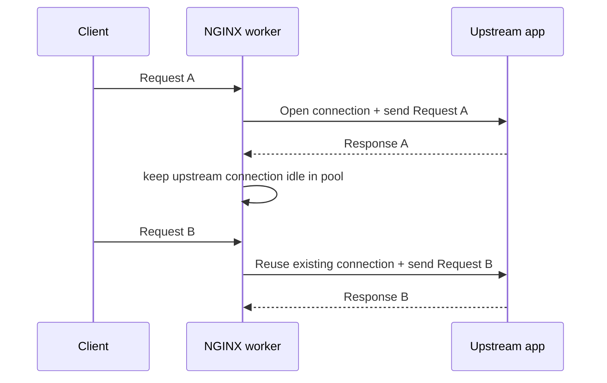
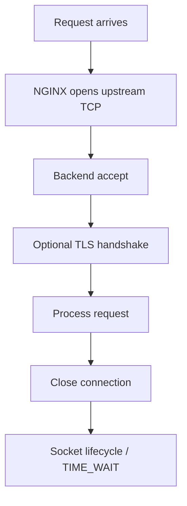

# Part 040 — Upstream Keepalive: Connection Reuse, Pooling, and Backend Saturation

> Target pembelajaran: setelah bagian ini, kamu bisa menjelaskan apa yang sebenarnya terjadi ketika NGINX memakai upstream keepalive, kenapa `keepalive` bukan sekadar “membuat koneksi tetap hidup”, bagaimana pool per worker bekerja, kenapa `proxy_http_version` dan `Connection` header penting, serta bagaimana mengukur efeknya pada latency, backend accept load, port exhaustion, dan failure recovery.

Upstream keepalive terlihat seperti setting kecil:

```nginx
upstream api_backend {
    server 10.0.1.10:8080;
    server 10.0.1.11:8080;
    keepalive 64;
}
```

Tetapi efeknya bisa besar.

Tanpa connection reuse, setiap request ke upstream dapat memerlukan:

```txt
new TCP connection
possibly TLS handshake
kernel accept on backend
application connection setup
request processing
connection close
TIME_WAIT / socket lifecycle
```

Dengan keepalive, NGINX dapat menyimpan koneksi idle ke upstream untuk dipakai ulang request berikutnya.



Namun keepalive bukan magic. Ia menambah state di NGINX worker. State berarti sizing, expiry, failure mode, observability, dan rollout discipline.

---

## 1. Two Different Keepalives

Jangan campur:

1. **Client-side keepalive**: browser/client menjaga koneksi ke NGINX.
2. **Upstream keepalive**: NGINX menjaga koneksi ke backend.


Directive yang berbeda:

```nginx
# client-side
keepalive_timeout 65s;
keepalive_requests 1000;

# upstream-side
upstream api_backend {
    server 10.0.1.10:8080;
    keepalive 64;
}
```

Client keepalive membantu mengurangi handshake antara client dan NGINX.

Upstream keepalive membantu mengurangi handshake antara NGINX dan app.

Mereka harus dipikirkan terpisah karena bottleneck dan risikonya berbeda.

---

## 2. Upstream Keepalive Is Worker-Local

NGINX worker process memiliki event loop dan connection state sendiri. Upstream keepalive cache juga efektifnya berada di worker context.

Artinya:

```txt
worker_processes = 4
upstream keepalive = 64
potential idle upstream connections ≈ 4 * 64 per upstream group
```

Jika ada banyak upstream group:

```txt
api_backend keepalive 64
search_backend keepalive 32
billing_backend keepalive 16
```

Maka total idle connections bisa bertambah cepat.

Rough sizing:

```txt
total_idle_upstream_connections ≈ worker_processes * sum(keepalive per upstream group)
```

Contoh:

```txt
worker_processes = 8
api = 128
search = 64
billing = 32
sum = 224
total potential idle = 8 * 224 = 1792 idle upstream connections
```

Ini belum termasuk active connections.

Itu sebabnya `keepalive 1000` bukan tanda engineer senior. Bisa jadi tanda tidak memahami pool cardinality.

---

## 3. What `keepalive` Actually Means

Dalam upstream block:

```nginx
upstream api_backend {
    server 10.0.1.10:8080;
    server 10.0.1.11:8080;
    keepalive 64;
}
```

`keepalive 64` menyatakan jumlah maksimum idle keepalive connections yang disimpan dalam cache worker untuk upstream group tersebut.

Bukan:

```txt
maximum active connections
maximum requests per backend
global connection limit
load balancer queue size
```

Untuk membatasi active connections per upstream server, itu konsep berbeda. NGINX Open Source punya beberapa mekanisme seperti `max_conns` pada upstream server dalam versi modern, tetapi kamu harus memahami scope-nya dan interaksinya dengan multiple workers/shared zone. NGINX Plus punya kemampuan tambahan seperti runtime API dan advanced health checks.

Jangan gunakan `keepalive` sebagai rate limiter.

---

## 4. HTTP/1.1 Requirement and Connection Header

Untuk upstream HTTP keepalive, kamu biasanya perlu:

```nginx
proxy_http_version 1.1;
proxy_set_header Connection "";
```

Full example:

```nginx
upstream api_backend {
    server 10.0.1.10:8080;
    server 10.0.1.11:8080;
    keepalive 64;
}

server {
    listen 80;

    location /api/ {
        proxy_pass http://api_backend;
        proxy_http_version 1.1;
        proxy_set_header Connection "";
        proxy_set_header Host $host;
        proxy_set_header X-Request-ID $request_id;
    }
}
```

Why?

- HTTP/1.0 defaults do not give the same persistent connection behavior.
- `Connection: close` would tell upstream not to keep the connection reusable.
- Clearing `Connection` avoids forwarding hop-by-hop client connection semantics to upstream.

Hop-by-hop headers belong to a single transport segment, not the end-to-end application contract.

---

## 5. The Cost of No Reuse

Without reuse, high RPS causes connection churn.



Cost surfaces:

| Cost | Impact |
|---|---|
| TCP handshake | latency and CPU |
| TLS handshake | CPU, latency, cert/session behavior |
| Backend accept loop | app/kernel overhead |
| Ephemeral ports | exhaustion risk from NGINX side |
| TIME_WAIT | socket table pressure |
| Load balancer state | more churn in middleboxes |
| Tail latency | more variance under load |

Connection reuse reduces this churn, but can create different risks:

| Keepalive risk | Explanation |
|---|---|
| Too many idle connections | backend file descriptors consumed |
| Uneven connection distribution | old connections stay pinned to certain servers |
| Stale connections | backend closed idle connection silently |
| Version skew | reused connections may hide rollout behavior briefly |
| Worker-local imbalance | one worker can have warmer pool than another |

---

## 6. Backend Saturation: Accept Load vs Request Load

Backend can saturate in two different ways:

1. **Request processing saturation**: CPU/thread/event loop/db bottleneck.
2. **Connection management saturation**: accept rate, TLS handshake, socket churn, file descriptors.

Upstream keepalive mainly helps the second.

If backend is slow because each request waits 2 seconds on DB, keepalive will not fix it.

```txt
Keepalive reduces connection setup overhead.
It does not reduce application work per request.
```

Good effect:

```txt
p50 latency improves due to fewer handshakes
backend accept CPU drops
TLS handshake CPU drops
TIME_WAIT drops
```

No effect or limited effect:

```txt
DB query latency
external API latency
application lock contention
GC pause
thread pool starvation
business logic CPU
```

Measure before and after.

---

## 7. Sizing Upstream Keepalive

Start from questions:

```txt
How many NGINX workers?
How many upstream groups?
How many backend instances per group?
What is steady RPS?
What is request duration?
Does upstream use HTTP/1.1, HTTP/2, or TLS?
How many idle FDs can backend tolerate?
How does deployment/draining work?
```

Rough baseline for HTTP APIs:

```nginx
upstream api_backend {
    server 10.0.1.10:8080;
    server 10.0.1.11:8080;
    keepalive 32;
}
```

Then observe.

If RPS is high and upstream handshake cost matters, increase cautiously:

```nginx
keepalive 64;
```

Avoid starting with huge numbers.

Bad:

```nginx
keepalive 10000;
```

Why bad?

```txt
per worker multiplier
per upstream group multiplier
backend FD pressure
harder deploy/drain behavior
memory overhead
false sense of capacity control
```

Sizing heuristic:

```txt
keepalive per worker per upstream group should be enough to cover hot concurrency reuse,
not enough to hoard backend file descriptors forever.
```

---

## 8. `keepalive_requests`, `keepalive_time`, and `keepalive_timeout`

In upstream module, there are directives to limit reused connection lifecycle.

Example:

```nginx
upstream api_backend {
    server 10.0.1.10:8080;
    server 10.0.1.11:8080;

    keepalive 64;
    keepalive_requests 1000;
    keepalive_time 1h;
    keepalive_timeout 60s;
}
```

Mental model:

| Directive | Meaning |
|---|---|
| `keepalive` | max idle cached connections |
| `keepalive_requests` | max requests through one keepalive connection |
| `keepalive_time` | max lifetime of a keepalive connection |
| `keepalive_timeout` | max idle time before close |

Why limit lifecycle?

- prevent one connection living forever,
- allow load redistribution over time,
- reduce risk from backend/middlebox idle policies,
- bound memory/resource accumulation,
- make deploy/drain behavior less sticky.

Do not set lifecycle to “infinite because performance”. Long-lived connections have operational cost.

---

## 9. Interaction with Load Balancing

Load balancing algorithm chooses an upstream server when NGINX needs to send a request.

But when an idle keepalive connection exists, NGINX may reuse an existing connection to a previously selected server.

This can influence distribution.

Example:

```nginx
upstream api_backend {
    least_conn;
    server 10.0.1.10:8080;
    server 10.0.1.11:8080;
    keepalive 64;
}
```

Keepalive does not disable load balancing. But connection reuse can make traffic “sticky-ish” at connection level, especially with HTTP/1.1 and worker-local pools.

Questions to ask:

```txt
Are backend instances equally loaded after enabling keepalive?
Do old instances retain traffic after canary/drain?
Does least_conn behave as expected when idle connections are reused?
Are keepalive lifecycle limits short enough for rollout dynamics?
```

If rollout needs fast traffic movement, reduce lifecycle/idle timeout or use explicit drain strategy.

---

## 10. Keepalive and DNS / Service Discovery

If upstream servers are static IPs:

```nginx
upstream api_backend {
    server 10.0.1.10:8080;
    server 10.0.1.11:8080;
    keepalive 64;
}
```

Connection reuse is straightforward.

If upstream relies on DNS/service discovery, lifecycle matters more. Existing connections remain connected to their original endpoint until closed. DNS changes do not teleport existing sockets to new targets.

Implication:

```txt
shorter keepalive_timeout/time = faster endpoint churn response
longer keepalive_timeout/time = better reuse but slower traffic movement
```

In Kubernetes or container service environments, this matters during rolling deploys.

If service discovery changes rapidly, make connection lifecycle part of deployment design.

---

## 11. Keepalive and Upstream TLS

If NGINX proxies to HTTPS upstream:

```nginx
upstream secure_api {
    server api.internal.example.com:443;
    keepalive 64;
}

location /api/ {
    proxy_pass https://secure_api;
    proxy_http_version 1.1;
    proxy_set_header Connection "";

    proxy_ssl_server_name on;
    proxy_ssl_name api.internal.example.com;
    proxy_ssl_verify on;
    proxy_ssl_trusted_certificate /etc/nginx/trust/internal-ca.pem;
}
```

Keepalive reduces repeated TLS handshakes.

But upstream TLS adds identity questions:

```txt
Does SNI match certificate?
Is verification enabled?
Which CA is trusted?
Do reused connections survive certificate rotation correctly?
Does rollout require closing old connections?
```

If upstream TLS is used for trust boundary, do not disable verification just to make config pass.

Bad:

```nginx
proxy_ssl_verify off;
```

It may be acceptable only as temporary debug in isolated non-production environment. In production, it destroys the identity guarantee.

---

## 12. Keepalive and WebSocket/SSE/gRPC

Different protocols behave differently.

### WebSocket

WebSocket upgraded connections are long-lived. They are not a normal pool of short HTTP request/response cycles.

```txt
client holds connection
NGINX holds upstream upgraded connection
keepalive pool is not the primary lever
```

### SSE

SSE keeps response open. Again, upstream keepalive is less important than timeout/buffering settings.

### gRPC

gRPC uses HTTP/2. Connection reuse/multiplexing semantics differ from HTTP/1.1 keepalive. NGINX `grpc_pass` uses gRPC module and HTTP/2 concepts; do not blindly transfer HTTP/1.1 keepalive assumptions.

For this part, the main focus is HTTP/1.1 upstream reuse with `proxy_pass`.

---

## 13. Keepalive and Request Body Retry

Connection reuse does not solve retry correctness.

If a reused upstream connection is stale, NGINX may get an error when sending a request.

For idempotent GET, retry may be acceptable.

For POST/write requests, retry can duplicate side effects.

Config:

```nginx
proxy_next_upstream error timeout invalid_header http_502 http_503 http_504;
proxy_next_upstream_tries 2;
```

This needs route-level policy:

```nginx
location /api/read/ {
    proxy_next_upstream error timeout http_502 http_503 http_504;
    proxy_next_upstream_tries 2;
    proxy_pass http://api_backend;
}

location /api/write/ {
    proxy_next_upstream off;
    proxy_pass http://api_backend;
}
```

Keepalive can increase the chance of discovering stale connections. That is normal. What matters is whether retry policy is safe.

---

## 14. Stale Idle Connections

Backend or middlebox may close idle connections before NGINX uses them.

Symptoms:

```txt
intermittent 502
upstream prematurely closed connection
recv() failed
connection reset by peer
first request after idle fails
```

Mitigations:

1. set upstream `keepalive_timeout` lower than backend/middlebox idle close,
2. ensure retry is safe for idempotent requests,
3. tune backend keepalive idle timeout,
4. monitor 502 rate around idle periods,
5. avoid very long idle cache for volatile upstreams.

Example:

```nginx
upstream api_backend {
    server 10.0.1.10:8080;
    keepalive 64;
    keepalive_timeout 30s;
}
```

If backend closes idle at 60s, NGINX closing at 30s avoids many stale reuse attempts.

---

## 15. Ephemeral Port Exhaustion

Without reuse, NGINX may create many outbound connections to upstream.

A TCP connection from NGINX to upstream uses local ephemeral port:

```txt
NGINX_IP:ephemeral_port -> UPSTREAM_IP:port
```

High churn can exhaust available ephemeral ports for a destination tuple, especially with short requests and high RPS.

Symptoms:

```txt
connect() failed (99: Cannot assign requested address)
latency spikes
upstream connect time increases
kernel socket table pressure
```

Keepalive can reduce churn by reusing connections.

But if keepalive is too large, it can consume backend FDs. So the optimization shifts pressure:

```txt
No keepalive -> port/handshake/accept churn
Too much keepalive -> idle FD hoarding
```

Good engineering finds the balance.

---

## 16. Backend File Descriptor Budget

Each idle upstream connection consumes resources on both sides:

```txt
NGINX FD
backend FD
kernel memory
possibly app connection state
possibly TLS session state
```

Backend budget:

```txt
max open files
worker/thread connection limit
event loop connection limit
per-process FD limit
load balancer/middlebox limits
```

Before enabling large keepalive:

```bash
ulimit -n
cat /proc/$(pidof nginx | awk '{print $1}')/limits | grep files
```

On backend, check process limits too.

Keepalive sizing must fit both NGINX and backend.

---

## 17. Observability: What to Log

Access log should include upstream timing:

```nginx
log_format upstream_perf escape=json
  '{'
    '"ts":"$time_iso8601",'
    '"request_id":"$request_id",'
    '"method":"$request_method",'
    '"uri":"$uri",'
    '"status":$status,'
    '"request_time":$request_time,'
    '"upstream_addr":"$upstream_addr",'
    '"upstream_status":"$upstream_status",'
    '"upstream_connect_time":"$upstream_connect_time",'
    '"upstream_header_time":"$upstream_header_time",'
    '"upstream_response_time":"$upstream_response_time"'
  '}';
```

Interpretation:

| Field | Signal |
|---|---|
| `$upstream_connect_time` | connection setup cost; should drop with reuse, but may be `0.000`/low depending behavior |
| `$upstream_header_time` | app time to first byte/header |
| `$upstream_response_time` | full upstream response duration |
| `$request_time` | total request time as seen by NGINX |
| `$upstream_addr` | selected backend(s) |
| `$upstream_status` | status from backend(s), including retries |

If keepalive helps, expect:

```txt
lower connect time
lower backend accept/TLS CPU
lower outbound connection rate
lower TIME_WAIT/socket churn
possibly lower p95/p99 latency
```

If app is bottlenecked elsewhere, you may see little change.

---

## 18. Metrics Beyond NGINX Logs

NGINX OSS does not expose a detailed per-upstream keepalive pool dashboard by default.

So observe surrounding signals:

On NGINX host:

```bash
ss -tan state established '( sport = :80 or sport = :443 )'
ss -tan dst 10.0.1.10:8080
ss -tan state time-wait dst 10.0.1.10:8080
```

On backend:

```bash
ss -tan sport = :8080 | wc -l
ss -tan state established sport = :8080 | wc -l
```

Application metrics:

```txt
accept rate
active connections
request concurrency
thread pool utilization
event loop lag
TLS handshakes/sec
CPU system/user split
p95/p99 latency
5xx rate
```

Cloud/load balancer metrics may expose new connections/sec and active connections. Use them.

---

## 19. Rollout Strategy

Do not enable high keepalive everywhere at once.

Safer rollout:

```txt
1. Pick one upstream group.
2. Baseline current latency, new connections/sec, backend CPU, 5xx, FD usage.
3. Add small keepalive, e.g. 16 or 32.
4. Set proxy_http_version 1.1 and clear Connection header.
5. Reload NGINX.
6. Observe under normal and peak traffic.
7. Increase gradually if needed.
8. Add lifecycle limits if not already.
9. Document final budget.
```

Example phase:

```nginx
upstream api_backend {
    server 10.0.1.10:8080;
    server 10.0.1.11:8080;
    keepalive 32;
    keepalive_timeout 30s;
    keepalive_requests 1000;
}
```

Rollback:

```nginx
upstream api_backend {
    server 10.0.1.10:8080;
    server 10.0.1.11:8080;
    # keepalive disabled
}
```

Then:

```bash
nginx -t && nginx -s reload
```

---

## 20. Common Misconfigurations

### 20.1 `keepalive` without HTTP/1.1

```nginx
upstream api_backend {
    server 10.0.1.10:8080;
    keepalive 64;
}

location / {
    proxy_pass http://api_backend;
}
```

Risk: upstream connection reuse may not work as intended.

Better:

```nginx
proxy_http_version 1.1;
proxy_set_header Connection "";
```

### 20.2 Forwarding client `Connection` header

Bad:

```nginx
proxy_set_header Connection $http_connection;
```

This forwards hop-by-hop semantics from client side into upstream side.

Better:

```nginx
proxy_set_header Connection "";
```

Exception: WebSocket upgrade intentionally sets `Connection upgrade`, as covered in Part 037.

### 20.3 Huge keepalive pool

Bad:

```nginx
keepalive 4096;
```

Maybe valid for a special environment, but almost never as a default.

Ask:

```txt
worker_processes?
backend FD limit?
number of upstream groups?
active vs idle connection count?
observed new connection rate?
```

### 20.4 Using keepalive to hide slow backend

Keepalive does not fix slow DB or app lock contention.

### 20.5 No lifecycle limit

If connections live too long, deployment/drain and load redistribution can become messy.

---

## 21. Keepalive With `max_conns`

Example:

```nginx
upstream api_backend {
    zone api_backend 64k;
    server 10.0.1.10:8080 max_conns=100;
    server 10.0.1.11:8080 max_conns=100;
    keepalive 64;
}
```

Conceptually:

- `keepalive` controls idle cached connections.
- `max_conns` limits active connections to a server under supported conditions.
- `zone` allows shared runtime state across workers for upstream group.

Important nuance: connection accounting can be subtle when idle keepalive connections, multiple workers, and shared zones are involved. Always verify behavior on your exact NGINX version and config.

Do not assume `max_conns` equals total backend FD limit. Backend sees active + idle + other clients.

---

## 22. Keepalive and Queuing

NGINX Open Source does not provide a universal upstream request queue in the same way a dedicated queueing load balancer might. NGINX Plus has queue-related upstream capabilities in commercial contexts.

Do not assume:

```txt
if backend is full, NGINX will politely queue everything
```

Without explicit controls, overload can become:

```txt
more accepted client requests
more upstream connection attempts
more timeouts
more retries
more load
latency collapse
```

Use:

- `limit_req`,
- `limit_conn`,
- app-level admission control,
- backend thread/connection pools,
- circuit-breaker-like routing patterns,
- clear timeouts,
- cache when correct.

Keepalive reduces connection overhead; it does not provide overload governance.

---

## 23. Production Reference Config

```nginx
worker_processes auto;

events {
    worker_connections 4096;
}

http {
    log_format upstream_perf escape=json
      '{'
        '"ts":"$time_iso8601",'
        '"request_id":"$request_id",'
        '"remote_addr":"$remote_addr",'
        '"host":"$host",'
        '"method":"$request_method",'
        '"uri":"$uri",'
        '"status":$status,'
        '"request_time":$request_time,'
        '"upstream_addr":"$upstream_addr",'
        '"upstream_status":"$upstream_status",'
        '"upstream_connect_time":"$upstream_connect_time",'
        '"upstream_header_time":"$upstream_header_time",'
        '"upstream_response_time":"$upstream_response_time"'
      '}';

    upstream api_backend {
        zone api_backend 64k;
        least_conn;

        server 10.0.1.10:8080 max_fails=3 fail_timeout=10s;
        server 10.0.1.11:8080 max_fails=3 fail_timeout=10s;

        keepalive 64;
        keepalive_requests 1000;
        keepalive_time 1h;
        keepalive_timeout 30s;
    }

    server {
        listen 80;
        server_name api.example.com;

        access_log /var/log/nginx/api_access.log upstream_perf;
        error_log  /var/log/nginx/api_error.log warn;

        location /api/ {
            proxy_pass http://api_backend;

            proxy_http_version 1.1;
            proxy_set_header Connection "";

            proxy_set_header Host $host;
            proxy_set_header X-Request-ID $request_id;
            proxy_set_header X-Real-IP $remote_addr;
            proxy_set_header X-Forwarded-For $proxy_add_x_forwarded_for;
            proxy_set_header X-Forwarded-Proto $scheme;

            proxy_connect_timeout 3s;
            proxy_send_timeout 30s;
            proxy_read_timeout 30s;

            proxy_next_upstream error timeout http_502 http_503 http_504;
            proxy_next_upstream_tries 2;
        }

        location /api/write/ {
            proxy_pass http://api_backend;

            proxy_http_version 1.1;
            proxy_set_header Connection "";

            proxy_set_header Host $host;
            proxy_set_header X-Request-ID $request_id;
            proxy_set_header X-Real-IP $remote_addr;
            proxy_set_header X-Forwarded-For $proxy_add_x_forwarded_for;
            proxy_set_header X-Forwarded-Proto $scheme;

            proxy_connect_timeout 3s;
            proxy_send_timeout 30s;
            proxy_read_timeout 30s;

            proxy_next_upstream off;
        }
    }
}
```

This config separates read-like and write-like retry policy. It also treats keepalive as an upstream pool optimization, not a correctness mechanism.

---

## 24. Benchmarking Keepalive

A naive benchmark can lie.

Bad benchmark:

```bash
wrk -t8 -c512 -d30s http://nginx/api/ping
```

Then conclude:

```txt
keepalive improved everything
```

Problems:

- `/ping` may not represent real app work,
- benchmark client keepalive can dominate,
- backend may be localhost,
- TLS may be absent,
- DB/external calls absent,
- no deploy/drain behavior tested,
- short test misses stale idle connections.

Better plan:

```txt
Test A: no upstream keepalive
Test B: keepalive 32
Test C: keepalive 64
Measure: latency percentiles, upstream connect time, backend CPU, new connections/sec, established connections, TIME_WAIT, 5xx, FD usage.
Run idle gap test: traffic -> idle 2 min -> traffic again.
Run deploy test: remove one backend -> observe traffic drain.
```

Example commands:

```bash
wrk -t8 -c256 -d5m http://api.example.com/api/read
ss -tan dst 10.0.1.10:8080 | awk 'NR>1 {s[$1]++} END {for (k in s) print k,s[k]}'
```

---

## 25. Incident Playbook

### 25.1 502 spike after enabling keepalive

Check:

```txt
Are upstream idle connections stale?
Is backend closing idle sooner than NGINX?
Is middlebox closing idle silently?
Are retries safe and configured?
Did Connection header get cleared?
```

Mitigation:

```nginx
keepalive_timeout 15s;
proxy_next_upstream error timeout http_502 http_503 http_504;
proxy_next_upstream_tries 2;
```

For writes:

```nginx
proxy_next_upstream off;
```

### 25.2 Backend FD exhaustion

Check:

```txt
worker_processes * keepalive per group
number of upstream groups
backend established/idle connections
backend ulimit
other clients to backend
```

Mitigation:

```txt
reduce keepalive
reduce keepalive_timeout
increase backend FD limit if justified
separate upstream groups
scale backend
```

### 25.3 Uneven traffic after deploy

Check:

```txt
old keepalive connections pinned to old instances
DNS/service discovery stale connections
long keepalive_time
least_conn with warm pools
```

Mitigation:

```txt
lower keepalive_time during rollout
reload NGINX if acceptable
use explicit drain/removal strategy
avoid very long idle timeout
```

### 25.4 No performance improvement

Likely:

```txt
app work dominates latency
upstream connect time was already tiny
traffic low enough that connection churn irrelevant
benchmark endpoint not representative
keepalive misconfigured due to HTTP version/Connection header
```

---

## 26. Review Checklist

```txt
[ ] Client keepalive and upstream keepalive are configured independently.
[ ] `keepalive` value is sized per worker and per upstream group.
[ ] HTTP upstream uses `proxy_http_version 1.1` where needed.
[ ] Hop-by-hop `Connection` header is cleared for normal HTTP proxying.
[ ] WebSocket locations intentionally override Connection/Upgrade behavior.
[ ] Upstream lifecycle limits are explicit: requests/time/timeout.
[ ] Backend FD budget includes idle keepalive connections.
[ ] Retry policy differs for idempotent and non-idempotent routes.
[ ] Logs include upstream connect/header/response time.
[ ] Rollout plan includes baseline and rollback.
[ ] DNS/service discovery behavior is understood.
[ ] Upstream TLS verification is not disabled casually.
```

---

## 27. Mental Model Summary

Think of upstream keepalive as a **small worker-local connection cache**.

It optimizes:

```txt
TCP/TLS setup
backend accept overhead
socket churn
some tail latency
```

It does not solve:

```txt
slow backend logic
database latency
unsafe retries
overload governance
bad load balancing design
service discovery correctness
```

The senior-level question is not “should we enable keepalive?”

The senior-level question is:

```txt
What connection churn are we removing,
what idle state are we adding,
which failure modes become better,
and which failure modes become worse?
```

Pada bagian berikutnya, kita akan membahas DNS resolution dan dynamic upstreams. Itu penting karena upstream keepalive, service discovery, Docker/Kubernetes DNS, and rolling deploys often collide in surprising ways.

---

## References

- NGINX documentation — `ngx_http_upstream_module`: https://nginx.org/en/docs/http/ngx_http_upstream_module.html
- NGINX documentation — `ngx_http_proxy_module`: https://nginx.org/en/docs/http/ngx_http_proxy_module.html
- NGINX documentation — reverse proxy: https://docs.nginx.com/nginx/admin-guide/web-server/reverse-proxy/
- NGINX documentation — HTTP load balancing: https://docs.nginx.com/nginx/admin-guide/load-balancer/http-load-balancer/
- NGINX documentation — controlling NGINX: https://nginx.org/en/docs/control.html
